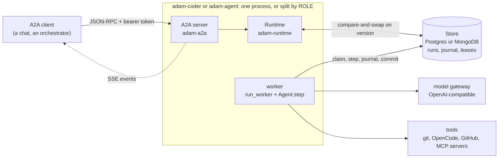

# adam-rs

adam-rs is a Rust framework for **durable AI agents**: an agent is a state machine whose state and every side
effect are saved after each step, so a worker that dies loses nothing and another resumes the run. Every piece
of infrastructure (database, model, code host) sits behind a trait with a conformance testkit, and agents are
authored as Markdown folders plus `#[tool]` functions, in the spirit of [eve](https://eve.dev). It ships two
agents over A2A 1.0: Adam, a general agent that answers, researches, writes documents and turns a coding task into a verified pull request, and one that serves any agent folder.



## Quickstart

You need Docker with Compose v2. Everything runs against mocks (a scripted model, a fake GitHub, a git server),
so no credential is needed. The first build compiles the workspace and takes several minutes.

```sh
docker compose --profile app up -d --build --wait
curl -N http://127.0.0.1:8080/ \
  -H 'Authorization: Bearer dev-token' -H 'Content-Type: application/json' \
  -d '{"jsonrpc":"2.0","id":"1","method":"SendStreamingMessage","params":{"message":{
        "messageId":"m1","role":"ROLE_USER","parts":[{"text":
        "In http://git-server:8080/local/sandbox.git (base branch main), add hello.txt containing hello."}]}}}'
docker compose down -v      # stop and forget everything
```

The stream ends in `TASK_STATE_COMPLETED` with a `pull_request` artifact. More: [Run it locally](docs/guides/run-locally.md).

## The two agents

| | What it does | Read |
|---|---|---|
| [`adam-coder`](bin/adam-coder/README.md) (the binary of **Adam**) | answers, researches, writes documents, and takes a coding task to a verified pull request: worktree, OpenCode, the project's own checks, push, PR | [the coder](docs/reference/coder-agent.md), [deploy it](docs/guides/deploy-the-coder.md) |
| [`adam-agent`](bin/adam-agent/README.md) | serves **any agent folder** (instructions, skills, subagents, MCP tools) with no build | [write an agent](docs/guides/write-an-agent.md) |

Both ship in one image, `ghcr.io/vymalo/another-adam-rs/coder`, and share the process in
[`adam-service`](crates/adam-service/README.md).

## The operator

[`adam-operator`](bin/adam-operator/README.md) runs agents on Kubernetes from two custom resources, `AgentService` and
`AgentConfig` (`agents.vymalo.com/v1alpha1`): it makes the coder or an agent folder as pods, a Service and a database, and serves
the agent registry. Image `ghcr.io/vymalo/another-adam-rs/operator`, charts [`deploy/operator`](deploy/operator/README.md) and
[`deploy/operator-crds`](deploy/operator-crds/README.md); why it is here: [ADR 0029](docs/decisions/0029-adam-rs-has-an-operator.md).

| Crate | Job |
|---|---|
| [`adam-operator-api`](crates/adam-operator-api/README.md) | the CRD types and their CEL rules |
| [`adam-operator-domain`](crates/adam-operator-domain/README.md) | validate and resolve a service into a runtime spec, and the env contract of the agents |
| [`adam-operator-ports`](crates/adam-operator-ports/README.md) | `RuntimeProvider`, `StoreProvisioner`, `AgentDirectory` and their testkit |
| [`adam-operator-controller`](crates/adam-operator-controller/README.md) | the reconcilers |
| [`adam-operator-runtime-kubernetes`](crates/adam-operator-runtime-kubernetes/README.md) | the runtime provider on native Kubernetes |
| [`adam-operator-store-cnpg`](crates/adam-operator-store-cnpg/README.md), [`adam-operator-store-secret`](crates/adam-operator-store-secret/README.md) | a CloudNativePG cluster, or a referenced Secret, as the agent's store |
| [`adam-operator-registry`](crates/adam-operator-registry/README.md) | the `agent-registry/v1` document and its HTTP router |

## Documentation

| | |
|---|---|
| [`docs/`](docs/README.md) | the index |
| [Architecture](docs/architecture.md) | the crate map, the path of a task, the run lifecycle, the data schema |
| [Guides](docs/guides/) | [run locally](docs/guides/run-locally.md), [write an agent](docs/guides/write-an-agent.md), [deploy the coder](docs/guides/deploy-the-coder.md), [embed adam](docs/guides/embed-adam.md), [testing](docs/guides/testing.md) |
| [Reference](docs/reference/) | [environment variables](docs/reference/environment.md), [agent files](docs/reference/agent-files.md), [errors](docs/reference/errors.md), [store adapters](docs/reference/store-adapters.md), [the local stack](docs/reference/dev-stack.md) |
| [Decisions](docs/decisions/) | ADRs: why it is the way it is |
| [Crates](docs/architecture.md#the-crate-map) | every crate has a `README.md` next to its `Cargo.toml` |
| [Chart](deploy/coder/README.md) | the Helm chart of the coder |

## Contributing

Work on a branch and open a pull request against `main`; commits are Conventional Commits. The checks CI runs
are in [Testing](docs/guides/testing.md#the-commands-ci-runs). Update the matching guide, reference or crate
README in the same change as any change to behaviour. AI assistants: read [`CLAUDE.md`](CLAUDE.md); the skills
for repositories that integrate adam-rs install with `npx skills add vymalo/another-adam-rs --list`
(`adam-agent-folder`, `adam-embed`, `adam-store-adapter`, `adam-a2a-extensions`, `adam-coder-deploy`,
`adam-operator`, `adam-upgrade`). Roadmap: [`docs/roadmap.md`](docs/roadmap.md).

## License

Licensed under either of [Apache License, Version 2.0](LICENSE-APACHE) or [MIT license](LICENSE-MIT) at your
option. Vendored agent skills keep their own licenses; see [third-party-notices.md](third-party-notices.md).

Unless you explicitly state otherwise, any contribution intentionally submitted for inclusion in this work by
you, as defined in the Apache-2.0 license, shall be dual licensed as above, without any additional terms or
conditions.
