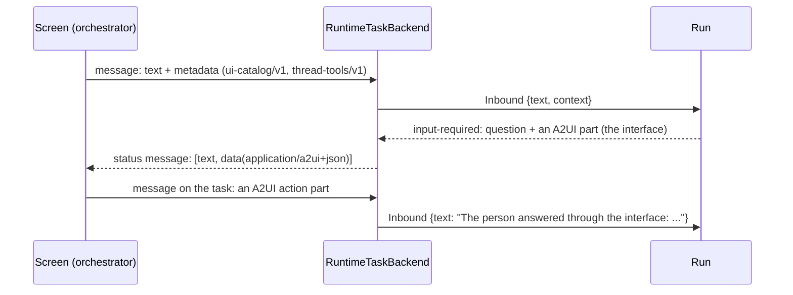
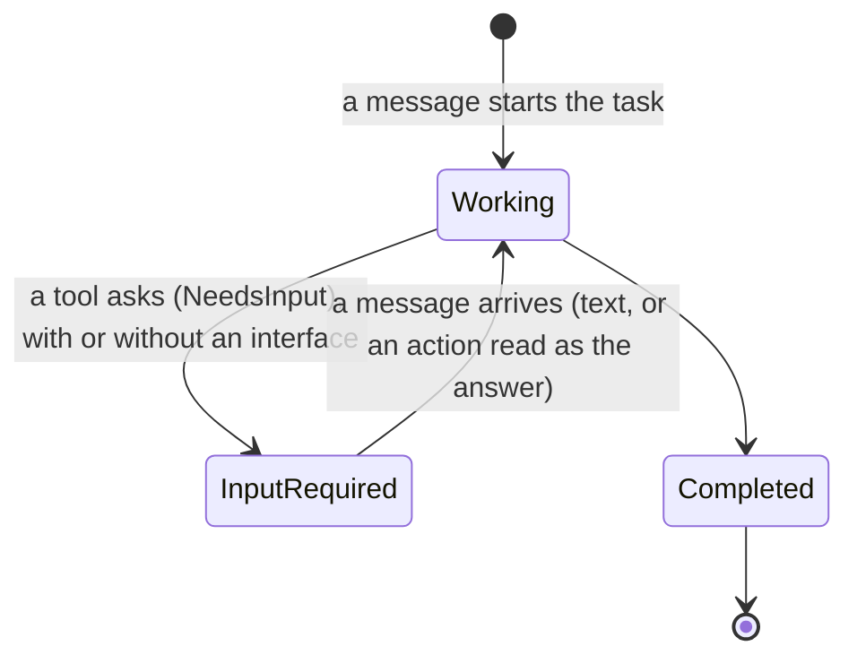

# adam-a2a-runtime

`RuntimeTaskBackend`: the `adam_a2a::TaskBackend` implemented over
`adam_runtime::Runtime`, so any adam-rs agent can be served as an A2A agent.

## Where it sits

The glue between two ports: it implements the backend seam of
[`adam-a2a`](../adam-a2a/README.md) using [`adam-runtime`](../adam-runtime/README.md)
(and through it whatever `Store` the runtime holds). It is reusable by any
agent; [`adam-coder`](../../bin/adam-coder/README.md) uses it.

## API at a glance

| Item | What |
|---|---|
| `RuntimeTaskBackend::new(runtime, events, agent)` | `events` must be the `BroadcastSink` the runtime was built with; `agent` is the registered name, as an agent (`.agent`) or as a start-only starter (`.starter`) |
| `.with_poll_interval(..)`, `DEFAULT_POLL_INTERVAL` | how often a subscription re-reads the durable run |
| `.with_prompt(..)`, `.with_inbound(..)` | override how the `input-required` question is derived (`PromptFn`; the default reads `state.pending_wait.question`, and `state.pending_question.question` for runs parked by an older build) and how an A2A message becomes an `Inbound` (`InboundFn`) |
| `default_prompt`, `default_inbound`, `task_state`, `artifact_of`, `artifact_id` | the default mappings. `artifact_of`: string data is a text part, anything else a data part; an object whose `url` is an absolute `http(s)` URL also gets a `url` part after the data part (A2A v1 `Part.url`), so a client can show a link; **a file artifact (`adam_runtime::Artifact::file`) is one `raw` part** (`Part.raw`: the bytes, base64 in JSON) with `mediaType` and `filename` and nothing else, so any A2A client reads a standard file artifact and no extension is involved ([ADR 0012](../../docs/decisions/0012-files-as-a2a-artifacts.md)). `artifact_id` follows a file's name, media type, filename and the SHA-256 of its bytes, so the live event and the durable copy are one artifact |
| `vymalo_inbound`, `CONTEXT_UI_REF`, `CONTEXT_UI_CATALOG`, `CONTEXT_THREAD_TOOLS`, `integral_numbers` | the inbound function of an agent that serves a screen (`.with_inbound(vymalo_inbound)`): an A2UI action reads as the person's answer, and the extensions a message carries become the run's inbound context; see *A screen as the sender* |
| `task_id_for(agent, subject, context_id, message_id)` | the task id a new task of `agent` started by that message gets (see *Stable ids*) |
| `MAX_REFERENCES` | how many of a message's `referenceTaskIds` are looked at (8); see *Continuing a task* |

```rust
use std::sync::Arc;
use adam_a2a::{A2aServer, AgentCardConfig, AuthConfig};
use adam_a2a_runtime::RuntimeTaskBackend;
use adam_runtime::{BroadcastSink, Runtime};

let events = BroadcastSink::default();
let runtime = Runtime::builder(store).agent(agent).event_sink(events.clone()).build();
let backend = RuntimeTaskBackend::new(runtime.clone(), events, "my-agent");
let card = AgentCardConfig::new("my-agent", "Does things", "http://localhost:8080/".parse().unwrap(), "0.1.0");
let app = A2aServer::router(card, Arc::new(backend), AuthConfig::AllowAnonymous);
// serve `app` with axum, and run `runtime.run_worker(shutdown)` next to it
```

The backend only starts, delivers to, reads and cancels runs, never steps one,
so a front process can register the agent's `AgentStarter` instead of the
agent (`Runtime::builder(store).starter(starter)`), holding no model or
credentials, while workers with the full agent run in another process over the
same store. Nothing steps a task in the front itself.

Mapping (full table in `src/backend.rs`): a task is a run (`task_id` is the run
id); a new `SendMessage` is `Runtime::start_with_id` (delivering to the context's open task if it has one), or
`Runtime::start_with_id_continuing` when it references a finished task (see *Continuing a task*); a message with `taskId` is
`Runtime::deliver`, only while the task is `input-required`; `CancelTask` is
`Runtime::cancel`. Ownership is encoded in the run's durable conversation id
(`<subject>:<context id>`), so it survives restarts with no side table, and a
task owned by someone else looks like one that does not exist. Subscriptions
are built from `Runtime::view` and polling, so they work for a task started by
another process or before a restart; live events only reduce latency. Across
processes those events do not exist unless something carries them, so a
subscription of a task another process is stepping advances at the durable poll.
[`adam-notify-postgres`](../adam-notify-postgres/README.md) carries them (its
`PgEventSink` as the runtime's sink, with this backend subscribing to the
`BroadcastSink` it delivers into) and also wakes the worker on a start and
delivers a `CancelTask` to the running step at once (a `Notifier`), instead of at
the next poll. `adam-coder` wires it in for every role (`Coder::new_with`,
`Coder::control_plane_with`).

## Continuing a task

A refinement, a follow-up or a rework is a **new** task in the same `contextId` (a finished task accepts
nothing more), and A2A lets the client name what it builds on in `Message.referenceTaskIds`. A new task
(no `taskId`) whose message has references starts its run **continuing** one of them: the new run's first
state is `Agent::init_continuing` (`AgentStarter::init_continuing` on a front that holds only the starter,
which works because the prior state is read from the store) of that run's last state, so an `LlmAgent` keeps
the conversation. The new run is still a new run, with its own id, journal and limits.

The backend takes the **first** of the first `MAX_REFERENCES` (8) references that is all of:

* a task **of this agent, owned by the caller**: the rule of every other call;
* in the **same context** as the new task (the message's `contextId`; a message without one gets a context of
  its own, so it continues nothing);
* **terminal**: `completed`, `failed` or `canceled`. A task that is `input-required` or `working` is open: a
  message for the context goes to its open task as before, reference or not (and if that task finishes
  between the two steps the reference is judged again, instead of starting fresh).

A reference that is malformed, unknown, someone else's, in another context, still open or unreadable is
skipped. The client cannot tell why: it gets the fresh task it would for an id that never existed, so a
reference is no way to find out whether another caller's task exists. A reference is **judged from the raw
record** (agent, conversation, status: `Store::load_run`) **before any state is decoded**: a record the caller
does not own is never decoded and cannot fail the request, and one of the caller's own that does not decode
is skipped with a `warn`. No reference, no continuation: the backend never guesses "the latest task of the
context". `task_id_for` does not depend on the references, so a repeated request is idempotent, continuing or
not.

* **"Caller" is the authenticated subject** (`Caller::subject`; `Caller::extensions`, the extensions the request activated, is for what the agent *reports*, never for who owns a task). With token authentication that is
  `token-<index>` of the token in the configured list, so **reordering or replacing tokens hands the history of
  an index to whoever holds it next**: keep the list append-only, or drop the contexts, when a holder changes.
  The **anonymous** caller (`Caller::ANONYMOUS`, authentication off) is every client at once, so a message from
  it **never continues anything**: references are ignored (debug log) and the task starts fresh.
* **What the operator sees.** A request that named references and **started a fresh task** anyway leaves one
  `info` line (`none of the referenceTaskIds could be continued`) with `given` and a count per reason
  (`malformed`, `unknown`, `not_the_callers`, `other_context`, `open`, `unreadable`, `over_limit`), and never an
  id of another caller's task. `start_or_join` says it once, after the start that settled the outcome: not
  when a reference was continued, not when the message was delivered to the open task of its context, not
  again when a busy conversation made the request pick twice, and not for a repeat of the request. At `debug` each reference is shown escaped (`{:?}`) and cut to 48 characters.

An agent only continues if it overrides `init_continuing` (`LlmAgent`, `LlmStarter`, and the coder's
`CoderAgent` and `CoderStarter` do); the default is `init`, and a wrapper must forward it. The decision, the rejected alternatives and the state diagram are in
[ADR 0003](../../docs/decisions/0003-a-new-task-continues-the-task-it-references.md).

## A screen as the sender

`RuntimeTaskBackend::with_inbound(vymalo_inbound)` reads a message the way the orchestration layer's chat
sends it (contracts: `docs/api/ui-catalog-v1.md`, `docs/api/thread-tools-v1.md` and `docs/api/mentions-v1.md` of
`vymalo/another-agentic-system`; the card entries that announce them are in [`adam-a2a`](../adam-a2a/README.md)):

| In the message | In the run |
|---|---|
| text parts | the text |
| an A2UI action part (`application/a2ui+json`, in `mediaType` or in `metadata.mimeType`) with Choices answers (`context.answers`: `[{id, values, other?}]`) | `The person answered through the interface:` then one line per question, `- db: pg`, `- auth: other: "Keycloak"` (what the person typed is JSON-quoted); it is the result of the `ask_user` call that parked the run |
| any other A2UI action | `The person used the interface: action "<name>" on surface "<id>" with context <JSON, cut at 4096 characters>` |
| `metadata[ui-catalog/v1]` | `Conversation::context["vymalo.ui.ref"]` = `{catalogId, version, digest}` |
| an inline catalog with that `catalogId` in the renderer's capabilities (`a2uiClientCapabilities` under `v0.9.1`, else `v0.9`; `a2uiRendererCapabilities` under `v1.0`) | `context["vymalo.ui.catalog"]` = `{catalogId, version, digest, catalog}`; an inline catalog of another id is ignored |
| `metadata[thread-tools/v1]` `{url, token, expiresAt}` | `context["vymalo.threadTools"]`, copied exactly; the entry expires at `expiresAt` (`Conversation::drop_expired_context`) |
| `metadata[mentions/v1]` `{mentions: [{agentId, label, start, end, name?, cardUrl?}], coordinate?: {tool}}` | `context["vymalo.mentions"]` = `{mentions, coordinate?}` (`CONTEXT_MENTIONS`): the references that are well formed (an `agentId`, a `label` of at most 64 UTF-16 code units; the `name` cut at 200 characters), at most 16, in order, and `coordinate` only as `{tool}` with a tool name a model can be shown. **The mentions of the latest message:** a message that carries other extension metadata and no mentions sets the key to `null`, which deletes it, so a run that continues another does not read the earlier message's mentions as its own. The text is not rewritten; `adam-ui` turns the entry into the "Mentioned agents" block of the prompt |

A message with none of these has no `context`, so it changes nothing in the run. An A2A server holds the numbers of
metadata as doubles (a catalog's `maxLength: 256` arrives as `256.0`, `version` as `2.0`); every whole number that goes into
the context is written as an integer (`integral_numbers`), which is what the digest of a catalog is taken over.





**The question's interface.** While a run waits on a question, its status message has the question as a text part and,
when `state.pending_wait.ui` is a non-empty array of A2UI messages (`PendingQuestion::ui`), that array as a second part
(`mediaType` and `metadata.mimeType` both `application/a2ui+json`). The status message id and the "did anything change" key
include a digest of the interface, so a question with another interface is another status; a status without one has
exactly the id it had before. A run **artifact** whose media type is `application/a2ui+json` (what a `show` tool emits) carries
the same two spellings on its data part.

## Steps

A run's work reaches an A2A client as **steps** ([ADR 0007](../../docs/decisions/0007-progress-as-steps-and-streamed-text.md)):
each `RunEvent::Step` that a subscription sees (live, in the process that steps the run, like every event) is a
`working` status update whose message has one text part and, **for a client whose request activated `steps/v1`**
(`Caller::extensions`, which `adam-a2a` fills from the `A2A-Extensions` header and `message.extensions`), the step
itself in the message's `metadata` under the extension's URI (`STEPS_EXTENSION` of `adam-a2a`; the contract is
`docs/api/steps-v1.md` of `vymalo/another-agentic-system`):

```json
{"https://agents.vymalo.com/a2a/extensions/steps/v1": {
  "id": "acp:c2:1", "parentId": "tool:c2", "kind": "command", "label": "npm test",
  "state": "failed", "icon": "execute", "detail": "1 failed"}}
```

A tool call's report also carries what the tool was given (`input`, on the report that starts the step) and what it
answered (`output`, `{text, truncated?, bytes?, error?}`, on the one that ends it), cut and redacted by the agent
([ADR 0011](../../docs/decisions/0011-a-tool-calls-step-carries-its-input-and-output.md)):

```json
{"https://agents.vymalo.com/a2a/extensions/steps/v1": {
  "id": "tool:call_1", "kind": "tool", "label": "Search the web", "state": "completed",
  "output": {"text": "1. Example Domain ..."}}}
```

The members are in the metadata only: the plain line does not carry them.

The text is the plain line the contract asks for. Without the activation it is all a client gets, one line per report:
the label for a start or a move; the detail alone for a progress line of a step at the top (what a tool's
`emit_progress` always was); `label: detail` for one under another step; and `label: done`, `label: failed` or
`label: canceled` (then the detail) for an end. For an activated client the subscription holds back a report of the
state a step is already in for a second (a change of state, the start and the end always go out), because the
contract asks for at most one update per step per second; a client without steps gets every line. Steps are live
events: a subscription that attaches after they were emitted, or in another process without an event sink,
does not see them (the durable record of the task is unchanged).

## Streamed text

The model's answer reaches an A2A client **as it is written** ([ADR 0007](../../docs/decisions/0007-progress-as-steps-and-streamed-text.md),
`text-stream/v1`, the contract of `docs/api/text-stream-v1.md` of `vymalo/another-agentic-system`). Each `RunEvent::TextDelta` a
subscription sees (live, like every event; `adam-llm-agent` sends them while a model turn streams) is, **for a client whose
request activated `text-stream/v1`** (`Caller::extensions` has `TEXT_STREAM_EXTENSION` of `adam-a2a`), a **chunk**: a
`TaskArtifactUpdateEvent` whose artifact is the stream (`artifactId` = the stream id, `name` `reply`, one text part, the
piece), with where it begins in UTF-8 bytes in its metadata, and nothing for any other client:

```json
{"artifact": {"artifactId": "run-m2-a1b2c3d4", "name": "reply", "parts": [{"text": "onacci "}],
              "extensions": ["https://agents.vymalo.com/a2a/extensions/text-stream/v1"],
              "metadata": {"https://agents.vymalo.com/a2a/extensions/text-stream/v1": {"offset": 3}}},
 "append": true, "lastChunk": false}
```

`append` is false for the first chunk and true after; the last has `lastChunk: true` (and its text may be empty), and
`"abandoned": true` in the metadata when the model failed in the middle (no whole text follows, and the task ends as a
failed model call always did). The whole text is **stated once**, in the metadata of a status message under the same URI,
`{"streamId": "<the stream>"}`: on a `working` status for the words that came before a tool call (from the `agent_text`
event that names a stream; best effort, like every event; only for an activated client; the message id is the stream's),
and on the status that ends the turn when its text is the streamed words (durable, so a poll and a stream agree, and
**for every client**: it is data under a namespaced key): `completed` for a run whose output names its stream
(`output.stream`), and `input-required` for a question that is the model's own reply (`pending_wait.stream`, set by an agent
that turns a reply into a question, as the coder does: `PendingQuestion::stream` of `adam-llm-agent`) while the status
says that question. Chunks are transient: they are never in a task's
`artifacts`, a resubscribe does not replay them, and a blocking `message/send` is unchanged. A client that did not activate
the extension reads the whole reply with the turn, as it always did. On the wire the SDK writes a number of metadata as a
float (`"offset": 3.0`): the contract reads a whole number either way.

## Stable ids

Ids are derived, never drawn at random per read, so a consumer that keys on
them sees each thing once (a SHA-256 of length-prefixed fields, laid out as a
UUID of version 8):

* **Status messages.** The `message_id` of a task's status message is a
  function of the task id, the state and the message text (and, for a question that has an
  interface, a digest of it). The stream event and
  every `tasks/get` snapshot of the same status carry the same id; another
  state or text gives another id. (Progress messages, which exist only in the
  live stream, keep a fresh id.)
* **Submission is idempotent by `messageId`.** A new task's id is
  `task_id_for(agent, subject, contextId, messageId)` and it is started with
  `Runtime::start_with_id`, so a client that repeats `SendMessage` /
  `SendStreamingMessage` (an outbox retry after a crash) gets the task its
  first attempt made, with the agent reading the input once. A repeat without
  a `contextId` finds the context the first attempt generated. A message with
  an empty `messageId` is not recognised as a repeat. The caller is part of
  the id, so two callers never share a task.
  Not covered: a message delivered into an already open task of its context,
  and a follow-up to a `taskId`, are not recognised on a repeat (the runtime
  keeps no record of consumed inbound ids); a repeated follow-up is refused
  because the task is no longer `input-required`.

## Errors

The backend has no error type of its own: it returns `adam_a2a::BackendError`.
`RuntimeError` is mapped by its class (see
[`adam-error`](../adam-error/README.md)), and is kept as the `source` of the
result so the A2A server can log the chain while the client sees only what the
mapping chose to say.

| `RuntimeError` class | `BackendError` | Client sees |
|---|---|---|
| `NotFound` | `TaskNotFound` | `-32001` |
| `Invalid`, `Rejected` | `InvalidParams` | `-32602` with a safe detail |
| `Transient`, `RateLimited`, `Conflict` | `Unavailable` | `-32603` "backend temporarily unavailable" |
| anything else | `Internal` | `-32603` "internal error" |

The `-32602` detail is one of: "task <id> is already <status>", "the
conversation already has an open task", the agent's own message for an `init`
rejection (`AgentError::Permanent`, such as an unreadable start message), a
store's `InvalidInput` message, or "the request was rejected". A transport or
driver text, and the conversation id (which holds the caller's subject), never
reach the client.

## Features and environment

No Cargo features, no environment variables at runtime.

## Tests

`tests/backend.rs` drives the backend with a real A2A client over HTTP and a
scripted agent: snapshot/progress/artifact/completed order, `input-required`
round trips, ownership between callers, context handling, an `init` rejection
that is `-32602` and not `-32603`
(`an_init_rejection_is_invalid_params_not_internal`,
`an_init_rejection_is_a_32602_over_http`), and a
`a_starter_only_front_accepts_a_task_a_separate_worker_completes_it`, and a
restart scenario in which a second backend (a second replica) rebuilds a
subscription from the store, and the repeated-`messageId` cases. The continuation cases: a
new task that references a finished one continues it (and a failed or canceled one), no reference means a fresh
task, another caller's, another context's, unknown and malformed references are ignored without a difference the
caller can see, an open referenced task keeps the old semantics, the first qualifying reference wins and the list is
bounded, a repeated continuing request starts one task, two concurrent continuing messages make one task and
the other joins it (memory and PostgreSQL, eight rounds each), an unreadable referenced record (foreign or
own) is skipped and is never an error, the anonymous caller continues nothing, `referenceTaskIds` over the
wire through the official client, one `info` line with counts and no foreign id (and the escaped, cut debug
form), a front that holds only the starter continues what a
separate worker finished, a continuation after a restart (memory and PostgreSQL), and a real `LlmAgent` behind
the backend whose model is shown the earlier messages (memory and PostgreSQL). Unit tests in `src/backend.rs`
(`runtime_errors_map_by_class`,
`what_a_client_is_told_carries_no_cause_and_no_conversation_id`) and
`src/convert.rs` (the interface part of a status, its id and key, the A2UI artifact), and the reading of a screen's
messages in `src/vymalo.rs` (each shape of answer, quoting, the cut, the context under every capability key, a catalog
of another id, a malformed reference, the doubles) and `tests/vymalo.rs` (a real `Runtime` and `LlmAgent`: the
extensions reaching the run's context, a question with an interface as `input-required` with two parts, and the person's
answer as the tool result the model reads), and `tests/text_stream.rs` (a real `Runtime` and an `LlmAgent` with a model that writes slowly: an activated client reads chunks that begin where the one before ended and add up to the answer, all before the status that ends the turn, and that status carries the stream's id; the words before a tool call are a `working` status with the stream's id as the message id and the answer is another stream; a question that is the streamed reply is stated under its stream; a model that fails in the middle ends the stream abandoned and fails the task as it does without streaming; a client that did not activate reads no chunk and the same reply; a blocking send's task has no chunk; and over HTTP through the SDK the header activates it, the response names it, and `offset` is a whole number on the wire), `src/text_stream.rs` (the chunk, the marker and the stream id as pure functions), and `tests/steps.rs` (a real `Runtime` and an agent that reports a tool call, a command under it that waits and fails, and the end: an activated client reads each step as a report in the metadata beside its line, with the same state held back within a second and a change of state not, one that did not reads every step as a line and nothing else, and another extension activates nothing) with the unit tests of `src/steps.rs` (the metadata, the message, the line of each state) and of the throttle in `src/subscribe.rs` (once a second a state, every change, the end, a retry starting afresh, the bound on what is remembered).

| Variable | Meaning |
|---|---|
| `ADAM_TEST_POSTGRES_URL` | also runs the restart and continuation scenarios against PostgreSQL (`adam-store-postgres`); the in-memory variants always run |
| `ADAM_TEST_REQUIRE_DB` | `1`: an unset Postgres URL fails instead of skipping (CI sets it) |

## See also

[`adam-a2a`](../adam-a2a/README.md),
[`adam-runtime`](../adam-runtime/README.md),
[`adam-coder`](../../bin/adam-coder/README.md),
[`adam-error`](../adam-error/README.md).
