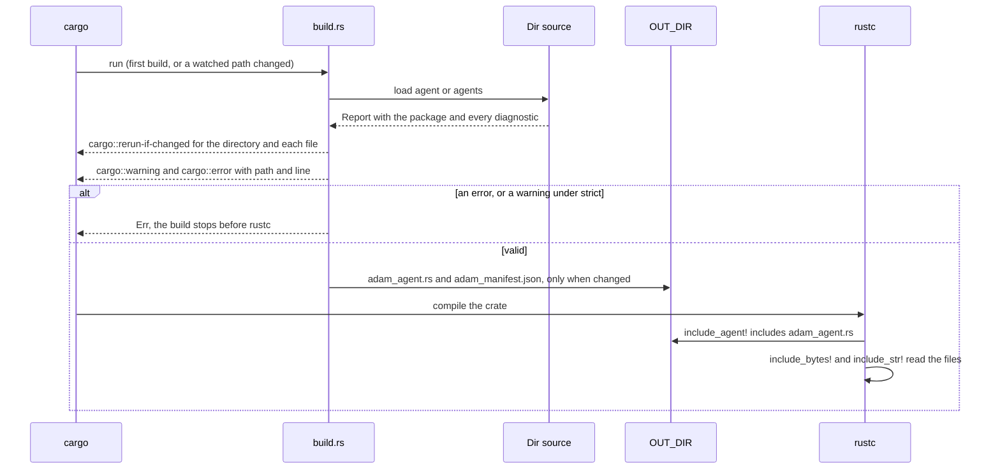
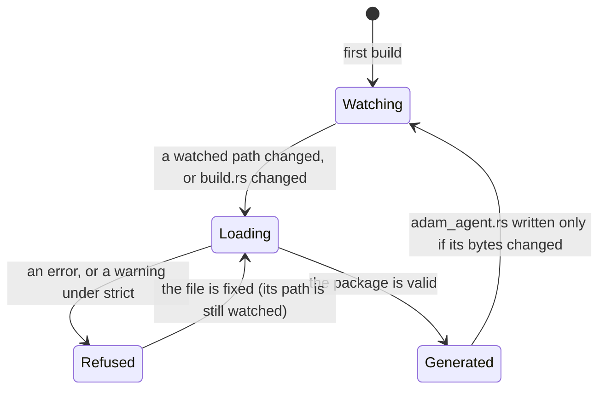

# adam-agent-fs

Parse and validate agent directories. An agent is a directory of Markdown and JSON
(`agent/instructions.md`, `skills/`, `subagents/`, `mcp.json`, `schedules/`); this crate reads
it into an owned `AgentManifest` and reports every mistake as a `Diagnostic` with the file and
the line. The layout, the file formats and the reasons are in
[`docs/authoring.md`](../../docs/authoring.md).

## Where it sits

The **files half of the authoring layer** (slices S4 and S5). It is a leaf: `serde`, `serde_json`,
[`serde-saphyr`](https://crates.io/crates/serde-saphyr) (YAML 1.2, deserialize only), `sha2`, `url`,
`thiserror` and [`adam-error`](../adam-error/README.md). No async, no `tokio`, no adam runtime
crate, and it never expands `${VAR}` or reads a secret. The binding to `LlmAgent` ([`adam-assembly`](../adam-assembly/README.md), S6)
builds on it; the MCP client (S11) is not here yet.

`ManifestSource` is the seam between where the files are and what they mean. `Dir` reads a
directory; `EmbeddedPackage` (the static manifest `build.rs` generates, see
[Embedding at build time](#embedding-at-build-time)) is the second implementation, and a remote one
can sit next to them.
Its signature has only manifest types and diagnostics: no `walkdir`, `notify` or `std::fs` type.
Directory walking uses `std::fs`, so there is no `walkdir` dependency either.

## API at a glance

| Item | What |
|---|---|
| `ManifestSource` (trait), `Dir` | `load() -> Result<Report, Error>` and `read_resource(&Skill, name) -> Result<Cow<'static, [u8]>, Error>` (the bytes of a file a skill bundles; it refuses a name the skill does not list, so `..` cannot leave its directory). `Dir::new(root)` reads `root/agent/` (one agent) or `root/agents/<name>/` (several); `.optional()` accepts neither, `.default_name(n)` names a root agent whose frontmatter has no `name` (a build script passes `CARGO_PKG_NAME`) |
| `Report`, `Package`, `Layout` | `report.package.agents`, `report.diagnostics`, `errors()`, `warnings()`, `is_ok()`, `into_package(Strictness)` |
| `Diagnostic`, `Severity` | `{ severity: Error \| Warning, path, line: Option<u32>, message }`; `Display` is `path:line: severity: message` |
| `Strictness` | `Lenient` (only errors fail) or `Strict` (warnings fail too) |
| `AgentManifest` | `name`, `path`, `frontmatter`, `instructions` (`body`, `parts`, `prompt()`), `skills`, `subagents`, `mcp`, `schedules` |
| `Subagent` | `Local(Box<AgentManifest>)` or `Remote(RemoteAgent)` (`a2a:` URL, `RemoteAuth::Bearer { env }`) |
| `Skill`, `SkillLayout`, `SKILL_RESOURCE_LIMIT` | `name`, `description`, `license`, `compatibility`, `metadata`, `allowed_tools`, `body`, `resources` (paths, not contents; `SKILL_RESOURCE_LIMIT` is the 1 MiB one skill may bundle) |
| `Schedule` | `name` (`a/b` from the path), `cron`, `timezone`, `agent`, `prompt` |
| `AgentFrontmatter`, `Limits`, `Card`, `ToolList`, `ModelRef`, `SkillSelection` | the shared agent and subagent schema; unknown keys are kept in `extra` |
| `SkillFrontmatter`, `ScheduleFrontmatter` | the other two YAML schemas |
| `McpConfig`, `McpServer`, `RemoteKind`, `EnvRef` | `mcp.json`; `env_references()` lists the `${VAR}` names, never values |
| `split_env_references(text)`, `Segment` | the one grammar of `${VAR}` / `${VAR:-default}`: a text cut into `Literal` and `Ref(EnvRef)` segments (a `${` that is not a reference stays in the literal text). `env_references()` is built on it, and so is the run-time expansion of `adam-mcp`; a property test checks that it agrees with the scanner it replaced and that the segments write back to the text. `EnvRef::written()` is the reference as written |
| `split(text)` | the frontmatter splitter: `Split { frontmatter, body, .. }` or `SplitError::Unterminated` |
| `parse_skill`, `parse_mcp` | the pure text-to-value parsers, for callers that hold text and not a directory |
| `is_agent_name`, `is_skill_name`, `is_tool_name`, `is_env_name` | the name patterns |
| `Error` | `Io { path, source }` (the source could not be read), `Invalid { diagnostics }` (`into_package` refused) and `Codec { action, what, source }` (a manifest could not be encoded or decoded); implements `adam_error::Classify` (`NotFound`, `Internal`, `Invalid`) |
| `Digest`, `digest_with`, `Dir::digest` | `sha256:...` of a normalised manifest and its skill resources: the same for a directory and for the embedded copy of it |
| `EmbeddedPackage`, `EmbeddedAgent`, `EmbeddedSkill`, `EmbeddedSubagent`, ... | the `'static` form of a package, built by generated code; `EmbeddedPackage` is a `ManifestSource`, `EmbeddedAgent::{to_manifest, frontmatter, recompute_digest, verify, resource}` |
| `build(dir)`, `Build`, `BuildError`, `Emitted`, `Generated` (feature `build`) | the code generator for `build.rs` |

```rust
use adam_agent_fs::{Dir, ManifestSource, Strictness};

let report = Dir::new(env!("CARGO_MANIFEST_DIR")).default_name(env!("CARGO_PKG_NAME")).load()?;
for finding in &report.diagnostics {
    eprintln!("{finding}"); // agent/skills/pdf/SKILL.md:2: warning: `name: pdf-tools` does not match ...
}
let package = report.into_package(Strictness::Lenient)?; // Err when there is an error
```

A problem in the files is a diagnostic, not an `Err`: one load reports every mistake. An item
with an error is left out of the package (a skill without a description, a subagent that does not
parse), so a package next to errors is what *could* be read, not something to run.

## Embedding at build time

Feature `build` (off by default; a crate lists it under `[build-dependencies]`) adds the code
generator. A whole build script:

```rust
// build.rs
fn main() -> Result<(), adam_agent_fs::BuildError> {
    adam_agent_fs::build("agent").emit()?; // "agents" for agents/<name>/
    Ok(())
}
```

```rust
// src/main.rs (or lib.rs); the crate depends on `adam`, which re-exports this crate as `adam::agent_fs`
adam::include_agent!();          // AGENTS, AGENT (an `agent/` package) and PACKAGE

let root = AGENT.to_manifest()?; // the owned AgentManifest, when you want to walk it
println!("{} {}", AGENT.name, AGENT.digest);
```

`emit()` reads `CARGO_MANIFEST_DIR`, `CARGO_PKG_NAME` and `OUT_DIR`, loads the directory with
[`Dir`](src/source.rs) (the parser and the validator of the run-time path), and prints cargo
directives:

| Directive | When |
|---|---|
| `cargo::rerun-if-changed=PATH` | the agent directory and every file and directory in it (so a new file rebuilds, and so does an ignored file that is renamed into place). Nothing when the directory does not exist: a missing path would make the script rerun on every build |
| `cargo::error=path:line: message` | every error; with `.strict()` every warning too. `path` is relative to the package root, so editors and CI link it. The build fails, and `emit()` returns `Err` |
| `cargo::warning=path:line: message` | every warning |

*Verified 2026-09-29* with cargo 1.94.1 (a scratch build script): `cargo::error=` and `cargo::warning=`
lines show as `error: pkg@version: text` and `warning: ...`, and a script that logged an error fails
the build (`error: build script logged errors`) even if it exits 0; a `rerun-if-changed` path that
does not exist makes the package dirty on every build (`the file ... is missing`); and creating a file
in a watched directory makes the package dirty. `cargo::error` needs cargo 1.84 or newer.

It writes `OUT_DIR/adam_agent.rs` (the source `include_agent!` includes) and
`OUT_DIR/adam_manifest.json` (the normalised manifest and the digest of each agent, for people and
tools), each only when the bytes changed, so an unchanged agent does not rebuild the crate.

Options: `.optional()` (no `agent/` is fine: `AGENTS` is empty), `.strict()` (warnings fail the
build), `.name(n)` (the root agent's name when its frontmatter has none; default `CARGO_PKG_NAME`),
`.crate_path(p)` (how the generated code names this crate; default `::adam::agent_fs`, use
`::adam_agent_fs` when the crate depends on this one directly), and `.root(dir)` / `.out_dir(dir)`
(default `CARGO_MANIFEST_DIR` / `OUT_DIR`; tests set them). `.emit_to(&mut writer)` sends the
directives to a writer, and `.generate()` returns the source, the manifest JSON, the findings and the
watch list without printing or writing anything. `BuildError`'s `Debug` prints its message, so
`fn main() -> Result<(), BuildError>` gives cargo one readable line.

What is in the generated file:

* Prompts, skill bodies, schedule prompts and `instructions/*.md` are raw string literals, already
  normalised (frontmatter removed, LF endings, trimmed): no parsing at startup.
* The frontmatter is JSON, read back by `EmbeddedAgent::frontmatter()` into the same
  `AgentFrontmatter` the directory path uses, so there is no second schema.
* `mcp.json` is `include_str!` of the file (placeholders unexpanded, no secret can be in the build).
* Skill resources are `include_bytes!` of the file, up to 1 MiB per skill (`SKILL_RESOURCE_LIMIT`); over that is a build error. `ManifestSource::read_resource` serves their bytes from either source (`adam-assembly` reads them for `read_skill_file`).
* Every agent, at every depth of subagents, carries its `digest`.

The generated code is plain `'static` data, so it is const-evaluated and costs nothing at startup.
Build script and runtime must use the same version of this crate (they do when both come from the
workspace or from `adam`), because the generated code fills the public fields of the `Embedded*`
types.





Reading the same files at run time (the `dev` feature of `adam-assembly`, slice S10, which also reloads them
when they change) is `Dir::new(root).load()`:
both give a `Package`, and the two are equal for the same files, which the tests assert.
`Dir::digest(&manifest)` and `EmbeddedAgent::digest` are equal too.

## What is checked

| File | Errors (the item is skipped or the build fails) | Warnings (kept) |
|---|---|---|
| directory | `agent/` and `agents/` together; neither (unless `.optional()`); no `instructions.md`; `agents/<name>` whose `name:` differs; two subagents or skills with one name; an empty prompt; a file that is not UTF-8 | an entry that is not part of an agent directory (`tools/`, ...); `agents/<x>` without `instructions.md`; `schedules/` in a subagent |
| frontmatter | a `---` first line with no closing `---`; YAML that does not parse (line reported); `api_key`, `apiKey`, `token`, `secret`, `password`, `base_url` ("secrets and endpoints belong in the environment"); a `model` that is a URL; an invalid `vars` key; `a2a` on the root agent, a bad `a2a` URL or `auth`; a subagent with no `description` or no body | unknown keys; Claude Code and Copilot keys adam ignores (`color`, `permissionMode`, `target`, ...); `mcpServers` / `mcp-servers` (use `mcp.json`); a `name` that is not a valid identifier (the file name is used, lower-cased when needed); tool names adam cannot bind (`Read`); `maxTurns` disagreeing with `limits.max_turns`; a prompt over Copilot's 30,000 characters |
| `SKILL.md` | no `description`; unparseable YAML or an unterminated frontmatter | `name` different from the directory, missing, or breaking the name rule; a description over 1024 or `compatibility` over 500 characters; a flat skill without frontmatter (its first line becomes the description) |
| `mcp.json` | invalid JSON; a `url` without `type`; an unsupported `type`; `command` and `url` together; a key such as `apiKey`; a server or allow-listed tool name that cannot become `<server>__<tool>` within 64 characters (a server name has no `__` and does not end in `_`, a tool name does not start with `_`, so that `a` + `_x` and `a_` + `x` are never both `a___x`) | unknown keys; a header, environment value or URL that carries a literal credential (`Bearer sk-...`, `X-Api-Key: ...`, `user:pw@`); a `${` that is not a reference |
| schedule | no `cron`, not five fields, a bad time zone, no body, `agent:` naming another agent | unknown keys |

The Agent Skills rules follow the spec's client guide (lenient: a name mismatch or an over-long
field warns; a missing description or bad YAML skips the skill). Skipping is an *error* here
because these files are our own source, not a third-party install.

Formats accepted unchanged: a Claude Code agent (`.claude/agents/x.md`) and a GitHub Copilot
custom agent (`.github/agents/x.agent.md`) read as subagents when copied into `subagents/`. The
`.agent.md` suffix is dropped from the name. Claude's `maxTurns` is read as
`limits.max_turns`; `tools` is a list or a comma-separated string.

## Tests

`cargo test -p adam-agent-fs` (add `--features build` for the code generator; `--all-features` in CI):

* `tests/rules.rs`: one directory per rule (75), each producing exactly one diagnostic of
  the stated severity; the valid fixture (`tests/fixtures/valid`) with none; ordering, ignore
  rules, symbolic links, non-UTF-8 files.
* `tests/conformance.rs`: all 75 vendored `.agents/skills/*/SKILL.md` of this repository parse
  with no error and no warning; a Claude Code agent and two Copilot agents
  (`tests/fixtures/{claude,copilot}-agents`) parse unchanged as subagents.
* `tests/splitter.rs` (proptest): the splitter and the parsers never panic on arbitrary text; an
  unclosed `---` is always an error; the split loses no byte.
* Unit tests next to the code: the splitter, name patterns, `${VAR}` scanning, cron.
* `tests/codegen.rs` (feature `build`): a golden test of the generated source
  (`tests/golden/adam_agent.rs.golden`, the absolute root written as `{ROOT}`; regenerate with
  `ADAM_UPDATE_GOLDEN=1`); an invalid directory fails with `path:line` diagnostics and writes
  nothing; warnings versus `.strict()`; `rerun-if-changed` equals the set of every file and
  directory; a missing directory with and without `.optional()`; a layout that is not the one asked
  for; the 1 MiB resource cap; the output is written only when it changed.
* `tests/compile.rs` (feature `build`): a trybuild **pass** test. It generates the source for the
  valid fixture, a multi-agent package and an absent one, appends a `main`, and has trybuild compile
  and run each under `deny(warnings, missing_docs, unreachable_pub)`. The `main` asserts that the
  embedded package equals what `Dir` reads from the same files, that the digests agree and that
  `verify()` holds. Skipped under `cargo-llvm-cov`.
* [`adam-agent-fixture`](../adam-agent-fixture/README.md): a crate with a real `build.rs` and
  `adam::include_agent!()` over the same valid fixture; its tests are the end-to-end version of the
  same equality.
* Unit tests next to the code: the digest (framing, resources), the embedded types (conversion,
  damaged JSON, `verify`), the literal escaping of the generator, and the serde round trip of the
  frontmatter.
