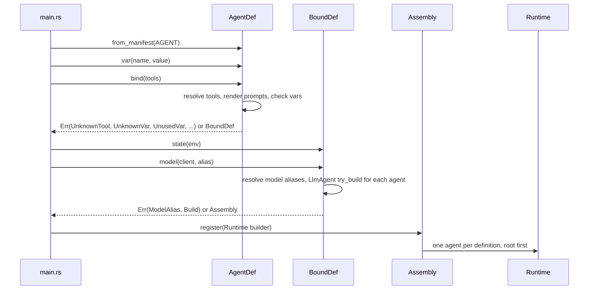
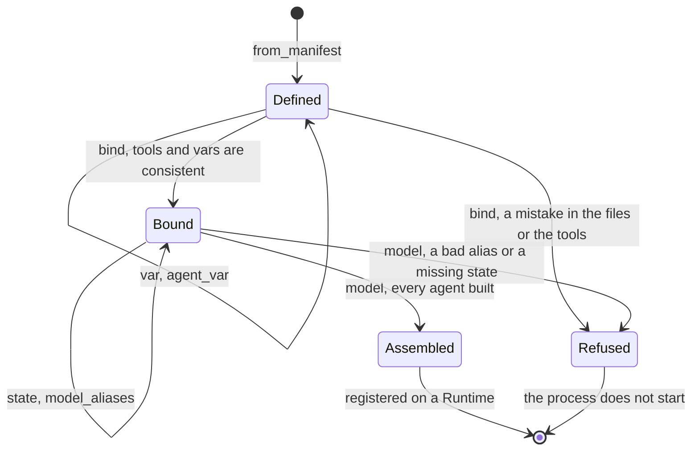

# adam-assembly

Bind an agent manifest to [`LlmAgent`](../adam-llm-agent/README.md)s. An agent written as files
(`agent/instructions.md`, subagents, skills, `mcp.json`; see [`docs/authoring.md`](../../docs/authoring.md))
is read into a manifest by [`adam-agent-fs`](../adam-agent-fs/README.md). This crate gives the
manifest its meaning at run time: the tools it names, the `{{placeholders}}` of its prompt, the model
it talks to and the state its tools need. Every mistake in that is found **when the process starts**,
with the agent and the file in the message, and never in the middle of a run.

## Where it sits

Slices S6 and S7 of the authoring layer, the meeting point of the "macro" track (`#[tool]`, `ToolSet`)
and the "files" track (`adam-agent-fs`).

```text
adam-agent-fs  (files -> manifest) ─┐
adam-llm-agent (ToolSet, LlmAgent) ─┼─> adam-assembly ─> adam (facade)
adam-model, adam-runtime ───────────┘        ▲
adam-a2a  (feature a2a) ─────────────────────┘
```

It depends on `adam-agent-fs`, `adam-llm-agent`, `adam-model`, `adam-runtime`, `adam-error`,
`async-trait`, `serde_json` and `thiserror`, and on `adam-a2a` and `url` behind the feature `a2a`. It has no `unsafe`, no I/O of its
own (the manifest is already in memory; the bytes of a skill's files are read once at startup, or come
from the binary) and no async code except the two skill tools' `Tool::call`.

## Use

```rust
use adam::prelude::*; // AgentDef and friends are in the facade prelude

adam::include_agent!(); // AGENT: the agent build.rs embedded (a `&'static EmbeddedAgent`)

let assembly = AgentDef::from_manifest(AGENT)?    // or an `AgentManifest` a `Dir` loaded
    .var("repo", "acme/widgets")                   // a value for a `{{repo}}` placeholder
    .bind(tools![PrepareWorkspace, RunChecks])?    // tools: names checked, prompts rendered
    .state(Arc::new(env))                          // what the tools read with State<T>
    .model(model, "coder-large")?;                 // one client, and the default gateway alias

let runtime = assembly.register(Runtime::builder(store)).build(); // root and subagents
let card = assembly.card(public_url, env!("CARGO_PKG_VERSION"))?;   // feature a2a
```

The embedded agent and the directory read at run time are the same `AgentManifest`, so they take the
same code path here and bind to equal agents (`Assembly::info()` compares equal). The facade calls the
first `AgentDef::from_manifest(AGENT)`; note that `AGENT` is already a reference, so no `&`.

## API at a glance

| Item | What |
|---|---|
| `AgentDef` | `from_manifest(impl IntoManifest)`, `from_source(&impl ManifestSource, Strictness)` (one per agent of a package, with the bytes of the skills' files), `resources_from(&impl ManifestSource)`, `var(name, value)`, `agent_var(agent, name, value)`, `name()`, `manifest()`, `bind(ToolSet)` |
| `IntoManifest` | `AgentManifest`, `&AgentManifest`, `EmbeddedAgent` and `&EmbeddedAgent` (what `include_agent!` gives; these bring the bytes of the skills' files) |
| `SkillFiles` | the bytes of the files skills bundle (opaque: made by `IntoManifest` and `resources_from`) |
| `LOAD_SKILL`, `READ_SKILL_FILE` | the names of the two skill tools |
| `SkillError` | why `load_skill` or `read_skill_file` refused a call: closed enum, its `Display` is the tool result the model reads |
| `BoundDef` | `state(Arc<T>)`, `model_aliases(..)`, `model(DynModel, alias)` |
| `Assembly` | `agents()`, `root()`, `register(RuntimeBuilder)`, `info()`, `remotes()`, `manifest()`, `card(url, version)` (feature `a2a`) |
| `AgentInfo` | `name` (`coder`, `coder/reviewer`), `parent`, `description`, `file`, `model_alias`, `prompt` (rendered, with the skills catalog), `tools` (with the skill tools), `skills`, `preloaded`, `limits`: what an `LlmAgent` was made from, comparable |
| `RemoteInfo` | a remote (`a2a:`) subagent, as data |
| `Error`, `Origin` | the closed error enum, and the agent and file every file-related variant carries |
| `AliasProblem`, `TemplateProblem`, `SkillField` | closed enums inside `Error::ModelAlias`, `Error::Template` and `Error::UnknownSkill` |

## The stages

Each step is a type, so a step cannot be skipped: the state comes before the model because the model
step is the one that builds the agents and finds a missing state.





## What binding checks

**Tools.** `tools:` names are checked against the `ToolSet`. A name nobody registered is
`Error::UnknownTool`, with the closest registered name as a suggestion and the list of what is
registered (`Read` in a Claude Code file suggests `read_diff`). An entry with a `*` (`linear__*`, the
MCP spelling) is a pattern over the registered names and must match at least one
(`Error::NoToolMatches`). A tool listed twice, or matched twice, is bound once, in the order the file
lists. A `ToolSet` with two tools of one name is `Error::DuplicateTool`. Without `tools:` the root
agent gets every registered tool and a subagent gets none (decision D3 of `docs/authoring.md`); `*` is
every tool and `[]` none. A subagent's tools come from the same set but are only the ones it lists: it
inherits nothing.

**Vars.** `{{name}}` is logic-free substitution into the body of `instructions.md` and each
`instructions/*.md`; spaces inside the braces are ignored, `{{{{` writes a literal `{{` (so a
literal `{{name}}` is `{{{{name}}`), and a `}}` in text is always itself. The rules, checked per agent:

| Mistake | Error |
|---|---|
| a `{{` that is not closed, is empty or is not a var name | `Template { line, problem }` |
| a placeholder that `vars` does not declare | `UnknownVar`, with a suggestion |
| a value supplied in code for a var `vars` does not declare | `UnknownVarValue`, with a suggestion |
| a var declared and never used, even if a value was supplied | `UnusedVar` |
| a used var with an empty default and no value from the code (`vars:` with `repo:` and nothing after it) | `UnsetVar` |
| `agent_var` for an agent the definition does not have | `UnknownAgent`, with a suggestion |

A var is required, with no default, when its default is empty. The value comes from
`AgentDef::var` (root) or `agent_var("coder/reviewer", ..)` (any agent by its registered name), and any
`ToString` works. Lines are counted from the start of the body of the file (the frontmatter is not
counted); the error names the file, `instructions/10-style.md` for a part.

**Model.** One `DynModel` serves every agent (decision: one OpenAI-compatible endpoint), and the
gateway alias of each agent is, in this order: the `model:` it names; the alias of its parent when it
says `inherit` or names nothing (a subagent's default); the alias passed to `model(..)` (the root's
default). The alias is a deployment setting, so the code picks the default and a file may pin one for
an agent that needs a particular model. `model_aliases([..])` lists what the deployment serves and
turns an alias outside the list into `Error::ModelAlias` with a suggestion; an empty alias or one with
whitespace is refused either way.

**State.** `state(Arc<T>)` is given to every agent, like `LlmAgentBuilder::state`. `model()` builds
the agents with `try_build`, so a tool whose `required_state` nobody gave is
`Error::Build { origin, source: MissingState }`, naming the agent, before anything runs.

**Limits.** The frontmatter `limits` (`max_turns`, `max_tool_calls`, `max_output_tokens`,
`max_history_tokens`) replace the loop's default for the keys that are set. Each subagent has its own.

**The card.** With feature `a2a`, `Assembly::card(url, version)` is the root's `card:` as an
`adam_a2a::AgentCardConfig`: `card.name` (default: the agent's), `card.description` (default: the
frontmatter `description`, else `Error::MissingCardDescription`) and `card.skills`. The public URL and the
version are the deployment's, so they are arguments. A2A card skills are not Agent Skills.

## Skills

An agent's skills are the ones under its **own** `skills/` (a subagent inherits none), narrowed by
`skills:` (`all`, the default, or a list, kept in the order given) and turned into the three tiers of
[Agent Skills](https://agentskills.io/specification) progressive disclosure at `bind`. Nothing is added
for an agent with no selected skill: no catalog, no tool. The design and the reasons are in
[`docs/authoring.md`](../../docs/authoring.md#skills-at-run-time-built-s7-adam-assembly); the contract is
here.

**Tier 1, the catalog.** After the instructions and a blank line, in this format (pinned by
`tests/golden/coder-prompt.txt`):

```text
The following skills provide specialized instructions for specific tasks.
When a task matches a skill's description, call the load_skill tool with the skill's name to load its full instructions.
Files a skill bundles are listed under <skill_resources> when it is loaded; read one with the read_skill_file tool.
<available_skills>
  <skill>
    <name>release-notes</name>
    <description>Drafts release notes from merged pull requests. ...</description>
  </skill>
</available_skills>
```

The third line is there only when a selected skill bundles a file. A description is collapsed to one line
and `&`, `<`, `>` are escaped. Skills that are preloaded are not listed.

**Tier 2, `load_skill { name }`.** `name` is an enum of the skills left to load. It returns

```text
<skill_content name="release-notes">
{the body of SKILL.md, frontmatter stripped}

Relative paths in this skill are relative to the skill's directory.
<skill_resources>
  <file>references/style.md</file>
  <file>scripts/run.sh</file>
</skill_resources>
</skill_content>
```

(the last two blocks only for a skill with files; the list is sorted, and lists files without reading them).

**Tier 3, `read_skill_file { skill, path }`.** `skill` is an enum of the skills that bundle a file. The
path is normalised (a leading `./` is dropped) and refused when it is empty, absolute (`/x`, `\x`, `C:`), has
a `..` component, a backslash or a control character. What passes is looked up by exact match in the
skill's list of files, so nothing outside the list is reachable and there is no file system access at run
time. A **text** file (UTF-8, no NUL byte) is returned as it is (an empty one as `(the file is empty)`); a
**binary** file is refused with its size. A skill bundles at most 1 MiB (`SKILL_RESOURCE_LIMIT`, checked by
the build script and again when the bytes are loaded), which bounds any result.

A refusal is a tool result with `is_error`, not a failed run: the message says what to do (the available
names with a "did you mean", the skill's files, that `SKILL.md` is loaded with `load_skill`). An unselected
skill gets the same answer as a made-up one.

**`preload_skills: [a]`** puts `<skill_content name="a">` in the prompt after the catalog, under the line
"The following skills are already loaded. ...", instead of leaving it to `load_skill`. A preloaded skill
must be selected by `skills:`; it leaves the catalog and the `load_skill` enum (asking for it says it is
already in the instructions), and its files stay readable. With every skill preloaded there is no
`load_skill`, and with no skill bundling a file there is no `read_skill_file`.

**Where the bytes come from.** An embedded agent (`from_manifest(AGENT)`) brings its files, borrowed from the
binary. A directory is read with `AgentDef::from_source(&Dir, ..)`, which reads every file once, at
startup. A manifest made without its source (`from_manifest(manifest)` from `Dir::load`) has none:
binding it fails with `Error::SkillFilesUnavailable` when a selected skill bundles a file, and
`resources_from(&dir)` supplies them. Embedded and directory therefore give equal `AgentInfo`s and the
same tool results.

| Mistake in the files or the wiring | Error, at `bind` |
|---|---|
| `skills:` or `preload_skills:` names a skill the agent does not have | `UnknownSkill { field, .. }`, with a suggestion |
| `preload_skills:` names a skill `skills:` does not select | `PreloadNotSelected` |
| a selected skill's files were not supplied | `SkillFilesUnavailable` |
| a skill bundles more than 1 MiB | `SkillTooLarge` (also from `resources_from`) |
| a registered tool called `load_skill` or `read_skill_file` on an agent with skills | `ReservedToolName` |

`tools:` does not filter the skill tools; `skills: []` turns them off. Both are ordinary tools, so their
results are journaled with the step that ran them.

Known limit: a loaded skill is a tool result, and the loop may truncate an old one to fit
`limits.max_history_tokens`. `preload_skills` is the way around it until the loop learns to protect skill
content.

## Errors

`Error` is a closed enum; every variant about the files carries an `Origin { agent, file }`, printed as
``agent `coder/reviewer` (agent/subagents/reviewer.md)``. All are `ErrorClass::Invalid` (the same input
never succeeds) except `Manifest`, which keeps its source's class. `bind` and `model` return the first
problem found, in the order of the tables above.

## Subagents and the seams left

A subagent that is a local file becomes an `LlmAgent` of its own, registered as `<parent>/<name>`
(`coder/reviewer`, `coder/researcher/summarizer`), with its own prompt, tools, skills, model and limits.
It is *defined*, not yet callable: nothing gives the parent a tool that starts it. A remote subagent
(`a2a:`) is data in `Assembly::remotes()`. `mcp.json` and schedules stay in `Assembly::manifest()`.
The seams are in code, in one place each:

| Slice | What plugs in | Where |
|---|---|---|
| S7 skills (built) | the catalog appended to the prompt, `load_skill` and `read_skill_file` added to the tools | `add_skills` in `def.rs`, called while `bind` resolves an agent, so `Node::prompt` and `Node::tools` are final when `BoundDef::build` hands them to `LlmAgent`; the logic is `skills.rs` |
| S8, S9 subagents | a tool per child that starts a durable child run; least-privilege tools are already resolved | `BoundDef::build`: the children of a node are the nodes whose `parent` is its index, and `AgentInfo::description` is the tool description; a tool with a name `load_skill` or `read_skill_file` is already refused by `add_skills`, and a subagent tool will need the same check |
| S9b remote subagents | a tool per `RemoteInfo` | `BoundDef::build`, with `remotes` |
| S10 dev reload | `from_source` + `bind` + `model` again on a changed directory, swapped at a step boundary | a caller of this crate; `AgentDef` and `BoundDef` are plain values |
| S11 MCP tools | the discovered tools go into the `ToolSet` given to `bind`; `linear__*` patterns already match them | `AgentDef::bind` |

## Tests

`cargo test -p adam-assembly --all-features`:

* `tests/bind.rs`: unknown tool (the message asserted, the suggestion, the subagent's origin), patterns,
  default tool access, duplicate tools; unknown, unused and unset vars, values for undeclared vars and
  unknown agents, syntax errors with their line, an error in an `instructions/*.md` part.
* `tests/model.rs`: alias resolution through three generations, alias errors, a deployment's alias list,
  missing state and state reaching a running tool, manifests by value and by reference, `from_source`
  for one agent, several agents and a directory with errors.
* `tests/fixture.rs`: the fixture of [`adam-agent-fixture`](../adam-agent-fixture/README.md) (the valid
  directory of `adam-agent-fs`), embedded and read from disk, binds to equal `AgentInfo`s; each agent is
  bound as its files say; the root and a subagent run to the end on a `MockModel` through a `Runtime` on
  the in-memory store.
* `tests/skills.rs`: the catalog against `tests/golden/coder-prompt.txt` (the fixture; regenerate with
  `ADAM_UPDATE_GOLDEN=1`) and against a hand-written text with escaping; no skill, no tool; `skills:`
  selection and order; unknown, unselected and unsupplied skills, an over-size skill and a reserved tool
  name at startup; on a `MockModel` through a `Runtime`: `load_skill` then `read_skill_file` with both
  results in the conversation, every refusal (unknown, unselected, `../x`, `/etc/passwd`,
  `a/../../b`, not in the list, `SKILL.md`, a binary file, bad arguments), `preload_skills` (prompt,
  enum, "already loaded", files still readable), a subagent with its own selection, and the embedded
  fixture against the same files read from disk giving equal `AgentInfo`s and equal tool results.
* `tests/card.rs` (feature `a2a`): the card of the fixture against `tests/golden/card.json`
  (regenerate with `ADAM_UPDATE_GOLDEN=1`), the fallbacks and the missing description.
* Unit tests next to the code: the template scanner (with proptest), the suggestions, the error texts,
  glob matching, the limits, the path checks and the tool results of `skills.rs`.

The dev-dependency on `adam-agent-fixture` is a cycle through `adam` (which re-exports this crate);
cargo allows cycles through dev-dependencies, and only the integration tests use the fixture.
