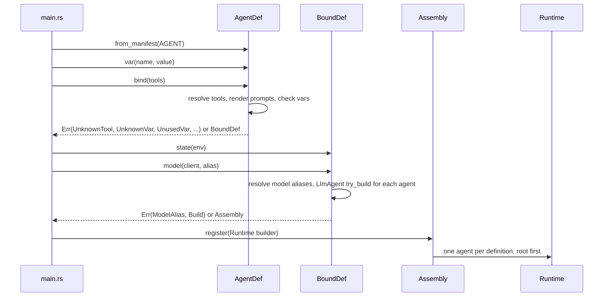
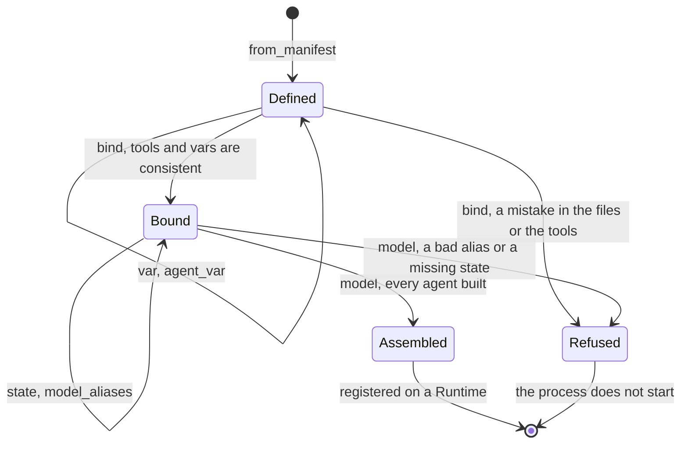
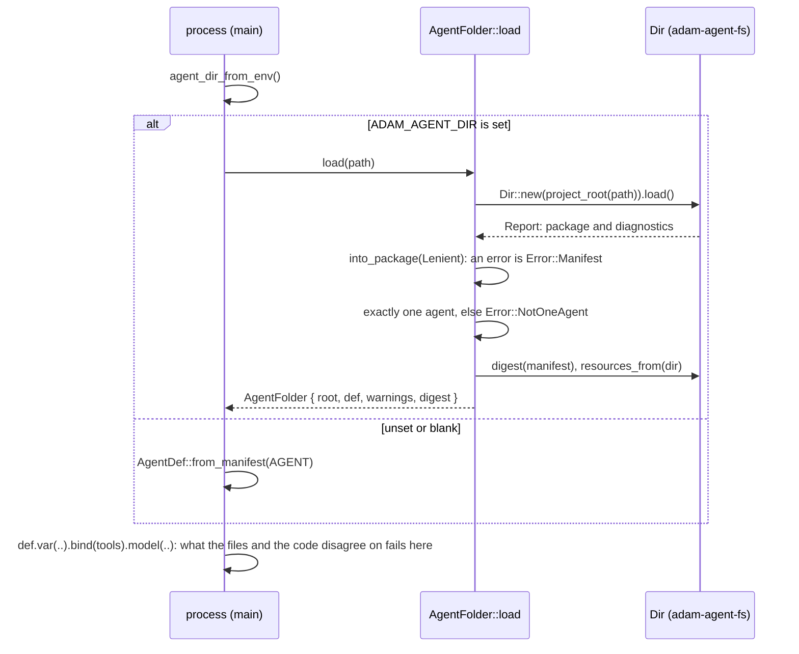
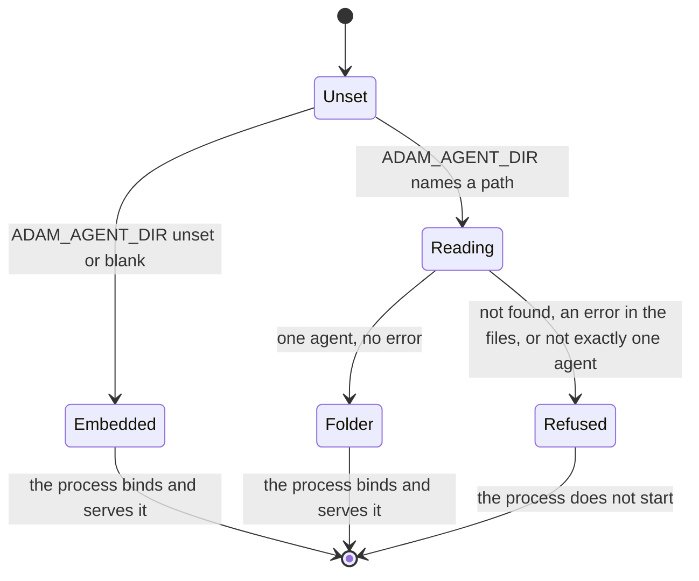
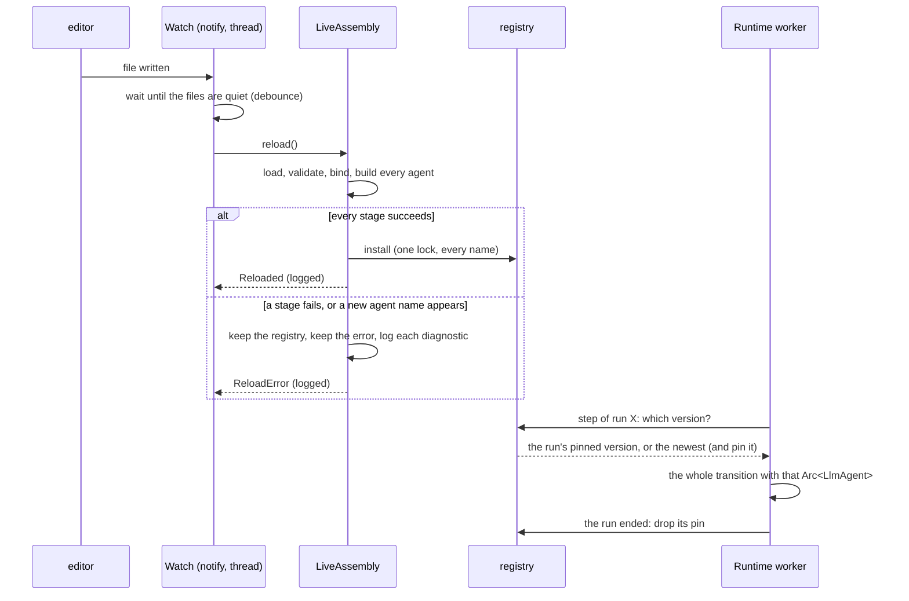
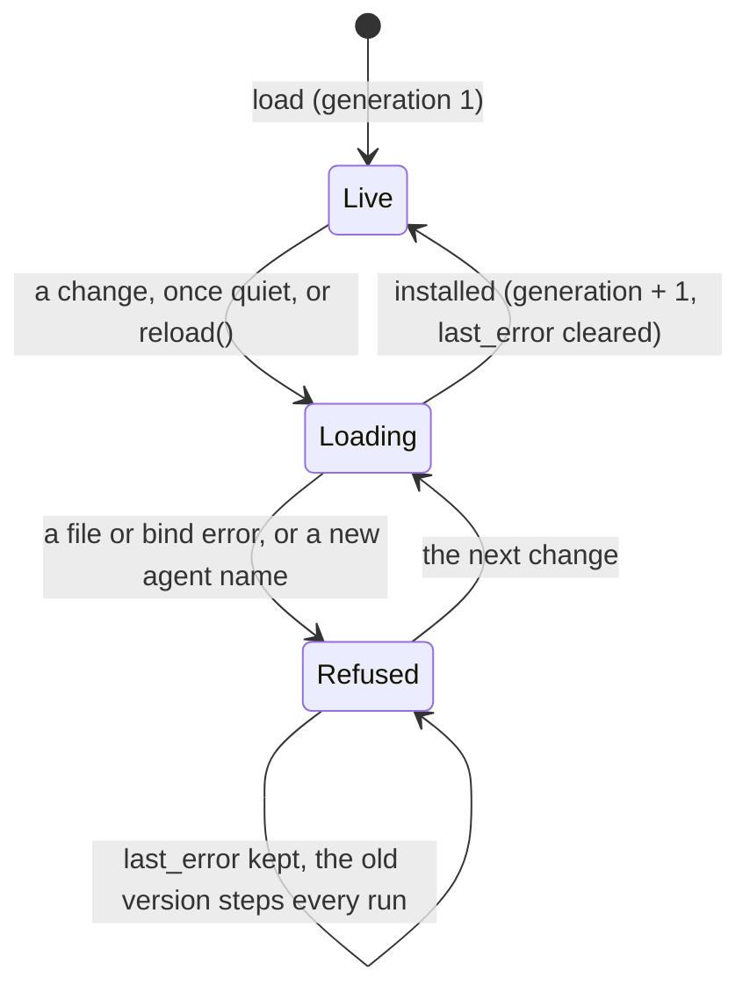
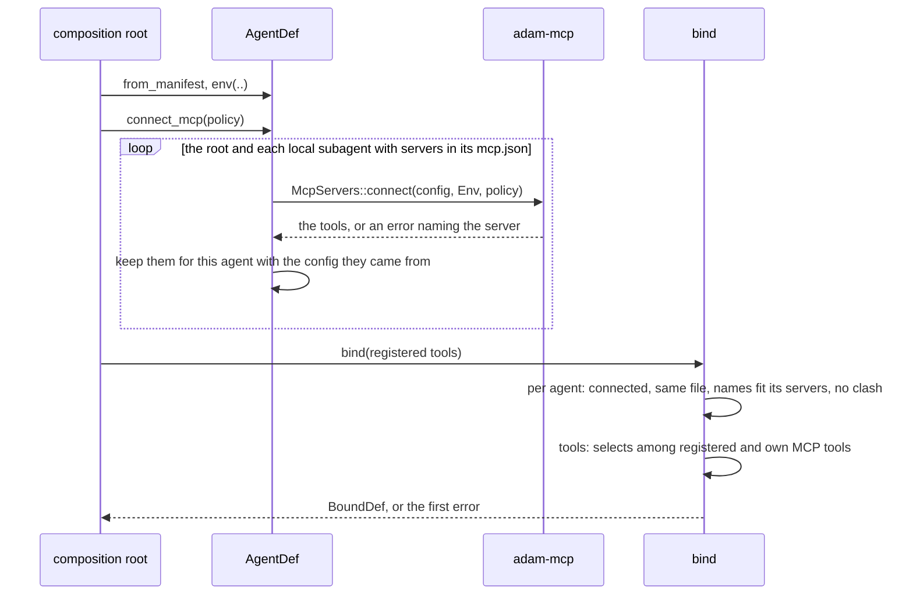
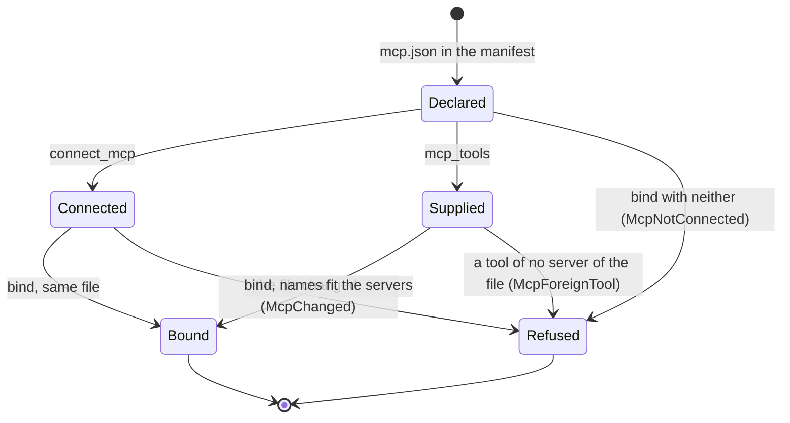

# adam-assembly

Bind an agent manifest to [`LlmAgent`](../adam-llm-agent/README.md)s. An agent written as files
(`agent/instructions.md`, subagents, skills, `mcp.json`; see [`docs/reference/agent-files.md`](../../docs/reference/agent-files.md))
is read into a manifest by [`adam-agent-fs`](../adam-agent-fs/README.md). This crate gives the
manifest its meaning at run time: the tools it names, the `{{placeholders}}` of its prompt, the model
it talks to and the state its tools need. Every mistake in that is found **when the process starts**,
with the agent and the file in the message, and never in the middle of a run.

## Where it sits

Slices S6, S7, S9, S9b, S10 and S11 of the authoring layer, the meeting point of the "macro" track (`#[tool]`, `ToolSet`)
and the "files" track (`adam-agent-fs`).

```text
adam-agent-fs  (files -> manifest) ─┐
adam-llm-agent (ToolSet, LlmAgent) ─┼─> adam-assembly ─> adam (facade)
adam-model, adam-runtime ───────────┘        ▲
adam-a2a  (feature a2a) ─────────────────────┤
adam-mcp  (feature mcp) ─────────────────────┘
```

It depends on `adam-agent-fs`, `adam-llm-agent`, `adam-model`, `adam-runtime`, `adam-error`,
`async-trait`, `serde_json`, `thiserror` and `url`, on the A2A client for remote subagents (`a2a-client-lf`,
`a2a-lf`, `reqwest`, `tokio` for a once-cell, `secrecy` for the token, `tracing`), and on `adam-a2a` behind the
feature `a2a`, on [`adam-mcp`](../adam-mcp/README.md) behind the feature `mcp` (the MCP client; see
[MCP tools](#mcp-tools-feature-mcp)), and, behind the feature `dev` only, on [`notify`](https://crates.io/crates/notify) and `adam-core` (see
[Dev reload](#dev-reload-feature-dev)). It has no `unsafe`. Its I/O is the skill tools (the bytes are read once at startup, or come
from the binary) and the remote subagents' tool: the environment variable of `auth: bearer:VAR` at `bind`, and
the network (agent card, `SendMessage`, `GetTask`) only when a call needs it.

## Use

```rust
use adam::prelude::*; // AgentDef and friends are in the facade prelude

adam::include_agent!(); // AGENT: the agent build.rs embedded (a `&'static EmbeddedAgent`)

let assembly = AgentDef::from_manifest(AGENT)?    // or an `AgentManifest` a `Dir` loaded
    .var("repo", "acme/widgets")                   // a value for a `{{repo}}` placeholder
    .bind(tools![PrepareWorkspace, RunChecks])?    // tools: names checked, prompts rendered
    .state(Arc::new(env))                          // what the tools read with State<T>
    .model(model, "coder-large")?;                 // one client, and the default gateway alias

let runtime = assembly.register(Runtime::builder(store)).build(); // root and subagents
let card = assembly.card(public_url, env!("CARGO_PKG_VERSION"))?;   // feature a2a
```

The embedded agent and the directory read at run time are the same `AgentManifest`, so they take the
same code path here and bind to equal agents (`Assembly::info()` compares equal). The facade calls the
first `AgentDef::from_manifest(AGENT)`; note that `AGENT` is already a reference, so no `&`.

## API at a glance

| Item | What |
|---|---|
| `AgentDef` | `from_manifest(impl IntoManifest)`, `card(url, version)` (feature `a2a`; the root's card before anything is bound), `from_source(&impl ManifestSource, Strictness)` (one per agent of a package, with the bytes of the skills' files), `resources_from(&impl ManifestSource)`, `var(name, value)`, `agent_var(agent, name, value)`, `env(name, value)` (a value for the environment variable `auth: bearer:VAR` reads), `allow_insecure_remotes(bool)`, `remote_timeout(Duration)`, `mcp_tools(agent, ToolSet)` (the MCP tools of an agent, from a client of your own), `connect_mcp(&McpPolicy)` (feature `mcp`: connect to the servers of every agent's `mcp.json`), `with_extra_mcp(McpConfig, &Path)` and `with_extra_mcp_file(&Path)` (add the servers of another file to the root's own `mcp.json`; a name both have is an error, see [Extra MCP servers](#extra-mcp-servers-adam_extra_mcp_file)), `mcp_env_references()` (the `${VAR}` names every local agent's servers refer to), `name()`, `manifest()`, `bind(ToolSet)` |
| `IntoManifest` | `AgentManifest`, `&AgentManifest`, `EmbeddedAgent` and `&EmbeddedAgent` (what `include_agent!` gives; these bring the bytes of the skills' files) |
| `SkillFiles` | the bytes of the files skills bundle (opaque: made by `IntoManifest` and `resources_from`) |
| `LOAD_SKILL`, `READ_SKILL_FILE` | the names of the two skill tools |
| `SkillError` | why `load_skill` or `read_skill_file` refused a call: closed enum, its `Display` is the tool result the model reads |
| `BoundDef` | `state(Arc<T>)`, `tool_source(source)` (a `ToolSource` of `adam-llm-agent` for every agent: tools it learns about while it runs, offered at every model turn after the agent's own; `tools:` does not narrow it), `model_aliases(..)`, `wait_poll(Duration)` (how often a waiting agent looks: a remote subagent's task is polled at this interval), `step_io(StepIo)` (how every agent's tool-call steps report their input and output, and what is scrubbed from them first: `LlmAgentBuilder::step_io`, [ADR 0011](../../docs/decisions/0011-a-tool-calls-step-carries-its-input-and-output.md)), `model(DynModel, alias)` |
| `SubagentTool` | the tool that runs a subagent as a child run: `new(tool_name, agent, description)`, `agent()`. `bind` adds one per local subagent, so a user never builds one. Its call is a `subagent` step drawn as an agent (`Tool::step_style`), as is a remote subagent's, **labelled with the tool's name as a person reads it** (`explorer` is "Explorer", `code_reviewer` is "Code reviewer"). `load_skill` and `read_skill_file` are "Load a skill" and "Read a skill file" |
| `Assembly` | `agents()`, `root()`, `register(RuntimeBuilder)`, `info()`, `remotes()`, `manifest()`, `card(url, version)` (feature `a2a`) |
| `AgentInfo` | `name` (`coder`, `coder/reviewer`), `parent`, `description`, `file`, `model_alias`, `prompt` (rendered, with the skills catalog), `tools` (own, skill tools, then one per subagent, local or remote: what the model is offered), `skills`, `preloaded`, `limits`: what an `LlmAgent` was made from, comparable |
| `RemoteInfo` | a remote (`a2a:`) subagent, as data (its tool is in `AgentInfo::tools` like a local subagent's) |
| `LiveAssembly`, `LiveBuilder`, `Watch` (feature `dev`) | dev reload: `LiveAssembly::builder(dir, model, alias)` then `tools`, `configure`, `configure_bound`, `strictness`, `default_name`, `debounce`, `connect_mcp(&McpPolicy)` (feature `mcp`), `load()`; on the handle `register(RuntimeBuilder)`, `reload()`, `watch()`, `generation()`, `last_error()`, `info()`, `retired()`, `runs_on_previous_tools()`, `dir()` |
| `Reloaded`, `ToolChange`, `ReloadError`, `WatchError` (feature `dev`) | what a reload did (`generation`, `changed`, `tool_changes`, `retired`), why it changed nothing (`Load(Error)` with `diagnostics()`, `NeedsRestart { added }`), why a watcher did not start |
| `AgentFolder` | one agent read from a folder when the process starts (no feature): `AgentFolder::load(path)` gives `root`, `def` (an `AgentDef`), `warnings` and `digest`; the folder holds exactly one agent, else `Error::NotOneAgent` |
| `extra_mcp_file_from_env`, `EXTRA_MCP_FILE_ENV` | `ADAM_EXTRA_MCP_FILE` when set and not blank, else `None`: a file of extra MCP servers (below). No feature |
| `agent_dir_from_env`, `agent_dir`, `AGENT_DIR_ENV`, `AgentDef::from_dir` | where the folder is: `ADAM_AGENT_DIR` when set and not blank (`agent_dir_from_env` is `None` otherwise, `agent_dir(default)` falls back to `default`), and one `AgentDef` per agent of a directory. No feature |
| `Error`, `Origin` | the closed error enum, and the agent and file every file-related variant carries |
| `AliasProblem`, `TemplateProblem`, `SkillField`, `ToolClash`, `RemoteAuthProblem`, `RemoteUrlProblem` | closed enums inside `Error::ModelAlias`, `Error::Template`, `Error::UnknownSkill`, `Error::SubagentToolClash` (which may name a parent's MCP tool: `ToolClash::McpTool`), `Error::RemoteAuth` and `Error::RemoteUrl` |

## The stages

Each step is a type, so a step cannot be skipped: the state comes before the model because the model
step is the one that builds the agents and finds a missing state.





## What binding checks

**Tools.** `tools:` names are checked against the `ToolSet`. A name nobody registered is
`Error::UnknownTool`, with the closest registered name as a suggestion and the list of what is
registered (`Read` in a Claude Code file suggests `read_diff`). An entry with a `*` (`linear__*`, the
MCP spelling) is a pattern over the registered names and must match at least one
(`Error::NoToolMatches`). A tool listed twice, or matched twice, is bound once, in the order the file
lists. A `ToolSet` with two tools of one name is `Error::DuplicateTool`. Without `tools:` the root
agent gets every registered tool and a subagent gets none (decision D3 of `docs/authoring.md`); `*` is
every tool and `[]` none. A subagent's tools come from the same set but are only the ones it lists: it
inherits nothing.

**Vars.** `{{name}}` is logic-free substitution into the body of `instructions.md` and each
`instructions/*.md`; spaces inside the braces are ignored, `{{{{` writes a literal `{{` (so a
literal `{{name}}` is `{{{{name}}`), and a `}}` in text is always itself. The rules, checked per agent:

| Mistake | Error |
|---|---|
| a `{{` that is not closed, is empty or is not a var name | `Template { line, problem }` |
| a placeholder that `vars` does not declare | `UnknownVar`, with a suggestion |
| a value supplied in code for a var `vars` does not declare | `UnknownVarValue`, with a suggestion |
| a var declared and never used, even if a value was supplied | `UnusedVar` |
| a used var with an empty default and no value from the code (`vars:` with `repo:` and nothing after it) | `UnsetVar` |
| `agent_var` for an agent the definition does not have | `UnknownAgent`, with a suggestion |

A var is required, with no default, when its default is empty. The value comes from
`AgentDef::var` (root) or `agent_var("coder/reviewer", ..)` (any agent by its registered name), and any
`ToString` works. Lines are counted from the start of the body of the file (the frontmatter is not
counted); the error names the file, `instructions/10-style.md` for a part.

**Model.** One `DynModel` serves every agent (decision: one OpenAI-compatible endpoint), and the
gateway alias of each agent is, in this order: the `model:` it names; the alias of its parent when it
says `inherit` or names nothing (a subagent's default); the alias passed to `model(..)` (the root's
default). The alias is a deployment setting, so the code picks the default and a file may pin one for
an agent that needs a particular model. `model_aliases([..])` lists what the deployment serves and
turns an alias outside the list into `Error::ModelAlias` with a suggestion; an empty alias or one with
whitespace is refused either way.

**State.** `state(Arc<T>)` is given to every agent, like `LlmAgentBuilder::state`. `model()` builds
the agents with `try_build`, so a tool whose `required_state` nobody gave is
`Error::Build { origin, source: MissingState }`, naming the agent, before anything runs.

**Limits.** The frontmatter `limits` (`max_turns`, `max_tool_calls`, `max_output_tokens`,
`max_history_tokens`) replace the loop's default for the keys that are set. Each subagent has its own.

**The card.** With feature `a2a`, `Assembly::card(url, version)` is the root's `card:` as an
`adam_a2a::AgentCardConfig`: `card.name` (default: the agent's), `card.description` (default: the
frontmatter `description`, else `Error::MissingCardDescription`), `card.skills` and `card.extended` (`description`,
`skills`: what an authenticated caller sees on top of the public card, `GetExtendedAgentCard`; it becomes
`AgentCardConfig::extended`, and `extended: {}` declares nothing). The public URL and the
version are the deployment's, so they are arguments. A2A card skills are not Agent Skills. The card is a fact
about the files, so `AgentDef::card(url, version)` gives the same card before any tool, state or model is
bound: a process that only serves A2A (a control plane, with no model) needs it, and the coder uses it.

## Skills

An agent's skills are the ones under its **own** `skills/` (a subagent inherits none), narrowed by
`skills:` (`all`, the default, or a list, kept in the order given) and turned into the three tiers of
[Agent Skills](https://agentskills.io/specification) progressive disclosure at `bind`. Nothing is added
for an agent with no selected skill: no catalog, no tool. The design and the reasons are in
[`docs/reference/agent-files.md`](../../docs/reference/agent-files.md#skills-at-run-time); the contract is
here.

**Tier 1, the catalog.** After the instructions and a blank line, in this format (pinned by
`tests/golden/coder-prompt.txt`):

```text
The following skills provide specialized instructions for specific tasks.
When a task matches a skill's description, call the load_skill tool with the skill's name to load its full instructions.
Files a skill bundles are listed under <skill_resources> when it is loaded; read one with the read_skill_file tool.
<available_skills>
  <skill>
    <name>release-notes</name>
    <description>Drafts release notes from merged pull requests. ...</description>
  </skill>
</available_skills>
```

The third line is there only when a selected skill bundles a file. A description is collapsed to one line
and `&`, `<`, `>` are escaped. Skills that are preloaded are not listed.

**Tier 2, `load_skill { name }`.** `name` is an enum of the skills left to load. It returns

```text
<skill_content name="release-notes">
{the body of SKILL.md, frontmatter stripped}

Relative paths in this skill are relative to the skill's directory.
<skill_resources>
  <file>references/style.md</file>
  <file>scripts/run.sh</file>
</skill_resources>
</skill_content>
```

(the last two blocks only for a skill with files; the list is sorted, and lists files without reading them).

**Tier 3, `read_skill_file { skill, path }`.** `skill` is an enum of the skills that bundle a file. The
path is normalised (a leading `./` is dropped) and refused when it is empty, absolute (`/x`, `\x`, `C:`), has
a `..` component, a backslash or a control character. What passes is looked up by exact match in the
skill's list of files, so nothing outside the list is reachable and there is no file system access at run
time. A **text** file (UTF-8, no NUL byte) is returned as it is (an empty one as `(the file is empty)`); a
**binary** file is refused with its size. A skill bundles at most 1 MiB (`SKILL_RESOURCE_LIMIT`, checked by
the build script and again when the bytes are loaded), which bounds any result.

A refusal is a tool result with `is_error`, not a failed run: the message says what to do (the available
names with a "did you mean", the skill's files, that `SKILL.md` is loaded with `load_skill`). An unselected
skill gets the same answer as a made-up one.

**`preload_skills: [a]`** puts `<skill_content name="a">` in the prompt after the catalog, under the line
"The following skills are already loaded. ...", instead of leaving it to `load_skill`. A preloaded skill
must be selected by `skills:`; it leaves the catalog and the `load_skill` enum (asking for it says it is
already in the instructions), and its files stay readable. With every skill preloaded there is no
`load_skill`, and with no skill bundling a file there is no `read_skill_file`.

**Where the bytes come from.** An embedded agent (`from_manifest(AGENT)`) brings its files, borrowed from the
binary. A directory is read with `AgentDef::from_source(&Dir, ..)`, which reads every file once, at
startup. A manifest made without its source (`from_manifest(manifest)` from `Dir::load`) has none:
binding it fails with `Error::SkillFilesUnavailable` when a selected skill bundles a file, and
`resources_from(&dir)` supplies them. Embedded and directory therefore give equal `AgentInfo`s and the
same tool results.

| Mistake in the files or the wiring | Error, at `bind` |
|---|---|
| `skills:` or `preload_skills:` names a skill the agent does not have | `UnknownSkill { field, .. }`, with a suggestion |
| `preload_skills:` names a skill `skills:` does not select | `PreloadNotSelected` |
| a selected skill's files were not supplied | `SkillFilesUnavailable` |
| a skill bundles more than 1 MiB | `SkillTooLarge` (also from `resources_from`) |
| a registered tool called `load_skill` or `read_skill_file` on an agent with skills | `ReservedToolName` |

`tools:` does not filter the skill tools; `skills: []` turns them off. Both are ordinary tools, so their
results are journaled with the step that ran them.

Known limit: a loaded skill is a tool result, and the loop may truncate an old one to fit
`limits.max_history_tokens`. `preload_skills` is the way around it until the loop learns to protect skill
content.

## Run-time folders (no feature)

An agent does not have to be embedded. `AgentFolder::load(path)` reads one agent's folder when the process
starts, with the same loader `build.rs` uses (lenient: a warning is returned, an error is an `Err`), so a
deployment can change the instructions, the card, the skills or the `mcp.json` of an agent by changing
a mounted folder, without a build. It is read once, and a change on disk is picked up by the next start.

```rust
use adam::{AgentFolder, agent_dir_from_env};

// ADAM_AGENT_DIR=/etc/adam/agent; unset or blank: the copy embedded at build time.
let def = match agent_dir_from_env() {
    Some(path) => {
        let folder = AgentFolder::load(path)?;             // exit 78 on `Err`: the files are wrong
        for warning in &folder.warnings { tracing::warn!("{warning}"); }
        tracing::info!(root = %folder.root.display(), digest = %folder.digest, "agent files");
        folder.def
    }
    None => AgentDef::from_manifest(AGENT)?,
};
let assembly = def.var("max_check_cycles", 3).bind(tools)?.model(model, "alias")?;
```





A path may name the directory that holds `agent/` (or `agents/`), or that directory itself. `agents/` is
accepted when it holds exactly one agent: a process serves one. `digest` is the digest of the manifest and
the bytes of the files its skills bundle, so the same files read from a folder and embedded by `build.rs`
have the same digest (a test compares them on the fixture); a startup log line with it says which files a
process runs. `AgentDef::from_dir(path)` is the one-shot `from_source(&Dir::new(root), Strictness::Lenient)`
for a path that may hold several agents, with `ADAM_AGENT_DIR` replacing the path.

## Dev reload (feature `dev`)

Off by default, so **a release build cannot watch and reload prompts unless its author turned the feature on**
(the `adam` facade re-exports it as `dev`; reading a folder once, at startup, needs no feature: see above);
turning it on brings `notify` and logs a warning at startup.
`LiveAssembly` does what `from_source`, `bind` and `model` do at startup, keeps the recipe, and does it again
when a file changes. Tool code is Rust and still needs a rebuild (`cargo watch`); `mcp.json` tools are connected
once, at startup, and outlive reloads (see the paragraph on `mcp.json` below).

```rust
use adam::assembly::LiveAssembly; // feature `dev`

let live = LiveAssembly::builder(adam::assembly::agent_dir("."), model, "coder-large")
    .tools(tools![PrepareWorkspace, RunChecks])
    .configure(|def| def.var("repo", "acme/widgets").env("BILLING_TOKEN", token()).remote_timeout(secs(600)))
    .configure_bound(move |bound| bound.state(env.clone()).wait_poll(secs(5)))
    .load()?;                                       // a bad first load is a startup error
let runtime = live.register(Runtime::builder(store)).build(); // stable names, current version
let _watch = live.watch()?;                        // notify; dropping it stops the watching
```

`ADAM_AGENT_DIR` replaces the directory the code names; it may name the directory that
holds `agent/` (or `agents/`), or that directory itself (the same rule as for a run-time folder). A store that survives the process
(the Compose Postgres) lets a restart resume runs; the in-memory store cannot.





**What a reload changes, and when.** Each `step` of a run takes the current `Arc<LlmAgent>` once and makes its
whole transition with it, so a swap is never seen in the middle of a step, and a running run picks up new
instructions at its next step. The prompt is not journaled and the model request is rebuilt on every turn, so
a new prompt, limits, model alias, tool description, `{{var}}` value, wait timer, remote timeout or rotated
token (the hooks run again, and a re-bind gives a remote tool a fresh client) apply to every run at its next
step.

**The replay rule.** A run is durable: its journal is keyed by step names (`model:3`, `tool:<call id>`), and a
transition that is replayed must take the same steps, or it fails with `NonDeterminism`. What would change the
steps is a change to *which tools exist*. So the tool set of an agent (its tools' names) decides which
versions may step the same run:

| Reload | Runs already stepped | Runs that start later |
|---|---|---|
| same tool set | swap to the new version | the new version |
| changed tool set | keep the newest version **with the tool set they started with**, until they end | the new version |
| goes back to an old tool set | the runs on it follow it again | the new version |
| a new agent name (a new subagent, a renamed root) | *refused as a whole* (`NeedsRestart`): the runtime registers agents once, when it is built | - |
| an agent removed from the files | it stays registered with its last version (`retired()`), for its runs and for parents on the old tool set | a parent on the new tool set has no tool for it |

A pin is dropped when its run ends (done, failed, or a permanent error). A run that is cancelled while nobody
steps it leaves a small entry (and its old version) until the process ends; `runs_on_previous_tools()` counts
the runs that are on a replaced tool set. A restart is a deploy: pins are in memory, and a new process steps
every run with the files as they are, as a production deploy of new code does.

**An invalid edit.** The old version stays in force for every run. Each diagnostic of the files is logged at
`error` with its file and line, then `reload refused, keeping the last good version`; `last_error()` returns
the `ReloadError` (its `diagnostics()` are the loader's findings; a bind error such as an unknown tool is
`ReloadError::Load(Error::UnknownTool { .. })`). The next good load clears it. Warnings of a load that
succeeds are logged at `warn` (with `Strictness::Strict` they refuse the load instead).

**`mcp.json` and reload (features `dev` and `mcp`).** `reload()` is synchronous and may run on the watcher's
thread, where nothing can wait for a network, so a reload never connects. `LiveBuilder::connect_mcp(&policy).await`
does it once, before `load()`: it reads the directory, applies the `configure` hooks added so far (so an `env` given
there is what `${VAR}` sees), calls `AgentDef::connect_mcp` for each root and keeps the connections in the
recipe. Every load then gives each definition its root's connections, after the hooks, so **connections outlive
reloads**: a reload starts no process and opens no session (a test counts one `initialize` across reloads).
The tools of an agent are discovered once, and a run in flight may already have called one, so an edit of an
`mcp.json` is not applied: the reload hits `Error::McpChanged` (the connected file is no longer the agent's),
which is `ReloadError::Load(..)` like any bind error, keeps the last good version, and whose message says to
restart the process. Putting the file back makes the next reload succeed. An `mcp.json` added for an agent that
had none is `McpNotConnected`, the same way.

**The watcher.** `watch()` uses [`notify`](https://crates.io/crates/notify) on `agent/` and `agents/`
recursively, ignores what cannot have changed a load (reads, access times, so a reload does not trigger the
next), waits until the files have been quiet for the debounce (150 ms by default; an editor writes in several
steps), then calls `reload()` on its own thread. A reload reads the disk on the calling thread. There is no
watcher for `ADAM_AGENT_DIR` itself: it is read once, when the builder is made.

**`notify` (verified 2026-09-29, crates.io API and the manifests in the registry):** version 8.2.0 is the
current stable release (`9.0.0-rc.5` is a pre-release, not used); licence CC0-1.0 (accepted by `deny.toml`);
MSRV 1.77; the API used is `recommended_watcher`, `Watcher::watch`, `RecursiveMode::Recursive` and
`EventKind`. It comes in only through the feature `dev`; the debounce is ours (about 15 lines), so
`notify-debouncer-mini` is not a dependency.

## Errors

`Error` is a closed enum; every variant about the files carries an `Origin { agent, file }`, printed as
``agent `coder/reviewer` (agent/subagents/reviewer.md)``. All are `ErrorClass::Invalid` (the same input
never succeeds) except `Manifest`, which keeps its source's class (a folder that is not there is `NotFound`), and `Mcp`, which keeps the class of the MCP
client's error in its `class` field (a server that is down is transient). `Mcp` is a variant of every build, with
or without the feature `mcp`, and its `source` is an opaque `Box<dyn Error + Send + Sync>` (with the feature, an
`adam_mcp::Error`: `source.downcast_ref::<adam_mcp::Error>()`), so that the feature adds nothing to the enum. `bind` and `model` return the first
problem found, in the order of the tables above.

## Subagents

A subagent that is a local file becomes an `LlmAgent` of its own, registered as `<parent>/<name>`
(`coder/reviewer`, `coder/researcher/summarizer`), with its own prompt, tools, skills, model and limits.
It inherits **nothing** from its parent: its tools are the ones its own `tools:` lists and none when it
lists none (a tool only the parent has is unknown to the child), its skills are the ones under its own
`skills/`, and its history starts with the message it is called with.

Its parent gets a `SubagentTool`, one per subagent, named after it, added by `bind` after the parent's own
tools and its skills' tools, in the order of the manifest (`AgentInfo::tools` lists them):

* input `{ "message": string }` (required); description: the subagent's `description`, then "The agent does
  not see this conversation; put everything it needs in `message`.";
* a call starts the subagent as a child run of the parent's run and parks the parent until it is done
  (`ToolCtx::start_child` and `ToolError::AwaitRun`, see "Child runs" in `docs/architecture.md`). The
  child's final **text** is the tool result; an error result if the child failed, and the parent goes on. A
  blank or missing `message` is an error result and starts nothing;
* the child's own `limits:` apply to the child (its turns and tool calls are not the parent's);
* **the runtime handle is not something you attach.** The tool starts the child on the runtime that steps
  the parent, through the `ToolCtx` of the call, so there is nothing to forget. What it needs is the child
  registered on that runtime: `Assembly::register` registers every agent. A process that steps the parent
  without the child (only `assembly.root()` registered) refuses the call for good, with the agent's name, as
  an error result; in a split deployment register the subagents as starters where the parent runs;
* what does not travel back: artifacts (they stay on the child's run). What does not happen: two subagent
  calls of one model turn run one after the other, not side by side, and cancelling the parent does not
  cancel the child.

| Mistake | Error, at `bind` |
|---|---|
| a subagent named like a tool its parent has (registered and selected, or `load_skill` / `read_skill_file` when the parent has skills), or like another subagent of the parent | `SubagentToolClash { origin, parent, tool, clash: ToolClash }` (origin is the subagent) |
| a subagent with a tool that asks the user (`Tool::asks_user()`), by name, by `*` or by a pattern | `SubagentAsksUser { origin, tool }` |

A registered tool the parent does not select is not a clash. **Why a subagent may not have an asking
tool:** a subagent runs as a child of another run with nobody to answer, and a run that asks parks until
someone does, so the parent would wait for ever. The tool declares it (`#[tool(asks_user)]`,
`FnTool::asking_user()`, or `fn asks_user(&self) -> bool` on a hand-written `Tool`) and `bind` refuses it
(a deadline on the child would only make "waits for ever" into "fails late"). It is a declaration: a tool
that returns `NeedsInput` without saying so would still park its child.

## Remote subagents

A subagent file with `a2a:` is a tool on the parent whose work is done by another A2A agent. Everything above
about the tool's shape holds: `{ "message": string }`, the description and the same "does not see this
conversation" note (the body of the file, if any, extends the description), no questions to the user, the same
name checks (`SubagentToolClash`, in manifest order with the local subagents). It is not an `LlmAgent` of the
assembly, so there is nothing to register on the runtime for it.

```markdown
---
description: Handles billing questions for a customer account.
a2a: https://billing.example.com/.well-known/agent-card.json
auth: bearer:BILLING_AGENT_TOKEN
---
```

* **A call** is one journaled `SendMessage` (`returnImmediately`) whose message id is derived from the parent's
  run and the tool call, so a retry or a replay sends the same id (a server that recognises repeated ids, as
  `adam-a2a-runtime` does, returns the task it already made). A reply that is already final is the result;
  otherwise the tool returns `ToolError::AwaitRemote { task, timeout_ms }` and the parent parks.
* **The wait** is polled: nothing tells the parent the task is over, so each time its `wait_poll` timer fires
  the agent calls `Tool::poll_remote` (a `GetTask`) in a journaled step, until the task is final or the wait
  passes `AgentDef::remote_timeout` (default one hour: an error result, the remote task is left running).
  Set `BoundDef::wait_poll` for the remote (default 60 s). See "Remote subagents" in
  [`docs/reference/agent-files.md`](../../docs/reference/agent-files.md#remote-subagents-a2a) and the diagrams in
  [`docs/reference/child-runs.md`](../../docs/reference/child-runs.md#remote-tasks-the-same-wait-without-a-message).
* **The result:** `completed` gives the text of the artifacts (else of the status message; when the artifacts hold
  files only, as an adam agent's screenshots do, the status message first, then their lines), cut at 64 KiB;
  `failed`, `canceled` and `rejected` are error results with the remote's message; **`input-required` and
  `auth-required` are error results too**, because nobody can answer a subagent (the message says so and tells
  the model to call again with the whole task). Data parts are their JSON; a file at a `url` stays a line (it is not
  fetched); a `raw` file part is described and dropped, unless the file says `files: true`.
* **`files: true`** in the subagent's file (a browser agent's screenshots) shares each `raw` part of the answer as a
  **file artifact of the calling run**, through `adam_runtime::ReceivedFiles`, the rule of a `files: true` MCP server
  ([`adam-mcp`](../adam-mcp/README.md#files-files-true)), which believes nothing the sender says of a file: it is named
  `<base>-<hash>.<ext>` (the sender's file name without its extension, cut to `[A-Za-z0-9._-]`, else the subagent's
  name; a hash of the bytes; the extension of the type checked against the bytes, so `evil.html` that is not a PNG is a
  `.bin`), the remote artifact's name (one line, at most 120 characters) names the artifact when the part is its only
  one, and the model reads a line in its place. Every cap is checked on the part's length before its bytes are copied:
  4 MiB a file, 16 a result and what the run may still share (`ToolCtx::files_left`, also for the `poll:` step); a
  refused file makes the result an error result. The root's go to the person (its A2A client gets them as shared
  files); a subagent's stay on its run. A file at a `url` is never fetched. The files are untrusted content for the
  client too: served as attachments or sanitized.
* **Auth.** `auth: bearer:VAR` reads `VAR` at `bind`: `AgentDef::env(VAR, value)` first, then the process
  environment; trimmed; refused as `Error::RemoteAuth { origin, var, problem }` (`Missing`, `Empty`,
  `NotAToken`) without ever showing a value. The token is a `SecretString`, sent as `Authorization: Bearer` on
  the card fetch and every call, and appears in no journal entry, event, log line, error message or `Debug`
  (tests read all of them). It goes only to the origin of the card URL: a card that advertises an interface on
  another host or port is refused for an agent with `auth`, and redirects are not followed.
* **The URL** must be `https`, or `http` to `localhost`, `*.localhost`, `127.0.0.0/8` or `::1`
  (`Error::RemoteUrl { problem: Insecure }` otherwise, unless `AgentDef::allow_insecure_remotes(true)`: development, or
  a service of the same cluster, `A2A_ALLOW_INSECURE_REMOTES` in `adam-agent`). With it the messages and the bearer
  cross the pod network in clear text: the deployment is expected to protect that network (a NetworkPolicy that admits
  only the caller, or mesh mTLS). A card cannot widen it: an `https` card's plain-`http` interface is refused, and a
  plain-`http` interface is accepted only on the card's own host. A URL with a user name or password is
  `Credentials`, always refused, and errors show the URL without them.
* **Under a local subagent.** `subagents/researcher/subagents/browser.md` with `a2a:` is a tool of `researcher`
  (the walk binds every local agent's subagents, remote ones included): the researcher's child run calls it, parks
  on the remote task and polls it like a root, and the root gets the researcher's text. A subagent gets no tool its
  own files do not declare, so a remote the root declares is the root's alone; a second declaration (the same URL,
  the same `auth` variable if you like) gives it to another agent.
* **The client** is made by the first call that needs it (agent card fetched with a size cap, a safe interface
  chosen, the token attached) and kept in the tool, so `bind` never touches the network and everything it decides
  is plain values: a reload binds again and gets a new client.
* **Failures.** A transport error or a JSON-RPC internal error is transient (the step is retried; the message id
  makes that safe); a 401, a task that no longer exists, or an invalid card is an error result for the model.

| Mistake | Error, at `bind` |
|---|---|
| `auth: bearer:VAR` and `VAR` unset, empty or not a token | `RemoteAuth { origin, var, problem }` |
| an `a2a:` URL that is plain http to another machine (without the development switch) or has a user name or password | `RemoteUrl { origin, url, problem }` |
| a remote named like a tool of the parent, like `load_skill`/`read_skill_file`, or like another subagent | `SubagentToolClash` |

## MCP tools (feature `mcp`)

An agent's `mcp.json` names MCP servers; their tools become tools of that agent, named `<server>__<tool>`.
The client is [`adam-mcp`](../adam-mcp/README.md) (behind the feature `mcp`, off by default); this crate decides
whose tools they are and checks them at `bind`.

```rust
use adam::mcp::McpPolicy; // feature `mcp` of `adam`

let assembly = AgentDef::from_manifest(AGENT)?
    .env("LINEAR_API_TOKEN", token())                    // what `${LINEAR_API_TOKEN}` in mcp.json reads
    .connect_mcp(&McpPolicy::default().allow_stdio(true)).await?   // startup: every server, or an error
    .bind(tools![PrepareWorkspace, RunChecks])?          // `tools: ["linear__*"]` selects among both
    .state(Arc::new(env))
    .model(model, "coder-large")?;
```

* **Per agent, not shared.** The tools come **only** from the `mcp.json` next to the agent's own instructions
  (the root's for the root, a subagent directory's for that subagent). They are not added to the `ToolSet` given
  to `bind`, so a subagent inherits none of its parent's, and two directories may each have a server called
  `linear`, connected separately with their own headers. `connect_mcp` walks the root and every local subagent.
* **Files of a `files: true` server** are artifacts of the run that made the call
  ([`adam-mcp`](../adam-mcp/README.md#files-files-true)): the root's go to the person, a subagent's stay on the
  subagent's run with its budget, as for every artifact of a child (see *Subagents*).

### Extra MCP servers (`ADAM_EXTRA_MCP_FILE`)

A deployment that wants an agent to have more MCP servers than its folder (or its embedded copy) names does not copy
the agent's files: it gives **one more file** in the shape of `mcp.json`, and the binary adds its servers to the root
agent's own before `connect_mcp`. `AgentDef::with_extra_mcp_file(path)` reads it with the loader of `mcp.json`
(`adam_agent_fs::parse_mcp`: the same fields, `${VAR}` and `optional`), returns the definition and what the loader
warned about, and `AgentDef::with_extra_mcp(config, path)` is the same for a config already parsed. The rules:

* a server name that the agent already has is an error (`Error::Manifest`, `Invalid`, one `path:line: error:` per
  name, naming the extra file): a file added over an agent never replaces one of its servers, and nothing is added;
* an unreadable file is `Error::Io` and one with errors is `Invalid`, both before anything connects (exit 78 in the
  binaries);
* the servers of subagents are untouched; the digest of a folder is the folder's, not the sum;
* `mcp_env_references()` is the union of the `${VAR}` names of every local agent's servers, extras included:
  `adam-coder` hides exactly those from the processes it starts and registers their values with its redactor.

`adam-coder` and `adam-agent` read the file named by `ADAM_EXTRA_MCP_FILE` (`EXTRA_MCP_FILE_ENV`, `extra_mcp_file_from_env`).
Tests: `tests/extra_mcp.rs`.
* **Selection is `tools:`.** The catalog `tools:` selects from is the registered tools plus the agent's own MCP
  tools, so `tools: [ask_user, "linear__*"]`, a misspelt name with its suggestion and `NoToolMatches` all work as
  before. A root without `tools:` gets everything registered and its own MCP tools; a subagent that lists none
  gets none, its own MCP tools included (decision D3).
* **Fail closed.** An agent whose `mcp.json` lists servers must have been connected (or given tools with
  `AgentDef::mcp_tools`, for a client of your own or a test): `Error::McpNotConnected { origin, servers }`
  otherwise, and the message says what to call. An empty set given for such an agent (by hand, or servers that
  offer no tool it can use) binds, with a `warn` naming the agent and its servers. `connect_mcp` itself fails at startup (`Error::Mcp { origin,
  class, source }`, the agent and the `mcp.json` in `origin`) for anything `adam-mcp` refuses: an unset variable,
  `type: sse`, a stdio server the policy does not allow, a server that is down, an allow-listed tool the server
  lacks.
* **The checks at `bind`,** in this order, per agent: connected or supplied (`McpNotConnected`); the connected
  config is the agent's current `mcp.json` (`McpChanged`); each tool is named `<server>__<tool>` after a server
  of **that agent's** file, and no name repeats (`McpForeignTool`, `DuplicateTool`); no MCP tool has the name of
  a registered tool (`McpToolClash`); then `tools:` resolves against the catalog. A subagent named like an MCP
  tool its parent selects is a `SubagentToolClash` with `ToolClash::McpTool { server }`. Tools given for an agent
  the definition does not contain are `McpUnknownAgent`, with a suggestion, before anything else is checked.
* **The environment.** `${VAR}` in the files reads `AgentDef::env` first and the process environment second, as
  `auth: bearer:VAR` does, so one set of secrets serves remote subagents and MCP servers. Secrets stay
  `SecretString`s in `adam-mcp`; none appears in a journal, state, event, log, `Debug`, error or tool result (a
  test reads all of them). Put secrets in `headers`: a `${VAR}` in a `url` is refused unless the policy given to
  `connect_mcp` says `allow_url_secrets(true)`, because the SDK logs URLs (see
  [`adam-mcp`](../adam-mcp/README.md#security)).
* **Durability.** A call runs inside the agent's journaled step `tool:CALL_ID`, so a replay of a committed call
  returns the recorded result and does not call the server. A transition that fails *before* it commits (a
  crash, a lost lease, a later tool of the same turn returning `Transient`) runs again from its start and calls
  the server again: MCP has no idempotency key, so an MCP tool is **at-least-once**, and `adam-mcp` never turns
  a failed call into `ToolError::Transient` (which would retry a call that may have run). The tests pin both
  cases.
* **The connections** live as long as the tools do, that is as long as the `Assembly` (drop it and the sessions
  close and the child processes are killed). A server that dies mid-run is an error result for that call and
  is reconnected once, on the next call, from the same recipe; the tools are never listed again.





| Mistake | Error |
|---|---|
| `mcp.json` lists servers and nothing was connected or supplied | `McpNotConnected { origin, servers }`, at `bind` |
| `mcp.json` lists servers and an empty tool set was connected or supplied | no error: a `warn` naming the agent and its servers |
| a server cannot be connected (variable, policy, network, allow-list) | `Mcp { origin, class, source }`, at `connect_mcp` (feature `mcp`; the variant itself is always there) |
| the connected `mcp.json` is not the agent's current one (dev reload) | `McpChanged { origin }` |
| a tool not named after a server of the agent's own `mcp.json` | `McpForeignTool { origin, tool, servers }` |
| an MCP tool named like a registered tool | `McpToolClash { origin, tool }` |
| `mcp_tools` for an agent the definition lacks | `McpUnknownAgent`, with a suggestion |
| a subagent named like an MCP tool of its parent's selection | `SubagentToolClash` with `ToolClash::McpTool` |

Schedules stay in `Assembly::manifest()`. The seams for the slices are in code, in one
place each:

| Slice | What plugs in | Where |
|---|---|---|
| S7 skills (built) | the catalog appended to the prompt, `load_skill` and `read_skill_file` added to the tools | `add_skills` in `def.rs`, called while `bind` resolves an agent, so `Node::prompt` and `Node::tools` are final when `BoundDef::build` hands them to `LlmAgent`; the logic is `skills.rs` |
| S9 subagents (built) | a `SubagentTool` per local child, the name checks, the asks-user refusal | `add_subagent_tools` and `refuse_asking_tools` in `def.rs`, in the same walk; the tool is `subagent.rs` |
| S9b remote subagents (built) | a `RemoteSubagentTool` per remote child, through the same name checks | `add_subagent_tools` in `def.rs`; `RemoteSubagentTool::bind` and the tool are `remote.rs`; the deployment's choices (`env`, `allow_insecure_remotes`, `remote_timeout`) are `AgentDef` fields passed in as `RemoteSettings` |
| S10 dev reload (built, feature `dev`) | `from_source` + `bind` + `model` again on a changed directory, swapped at a step boundary | `dev.rs`: a `Recipe` (the directory, the `ToolSet`, the model and the hooks that give `AgentDef` and `BoundDef` their values) that a reload runs again from the top; `AgentDef` and `BoundDef` are plain values, and a remote tool holds only plain values (URL, token, limits) until its first call, so a new bind is a new client |
| S11 MCP tools (built, feature `mcp`) | the tools of each agent's own `mcp.json`, joined to the catalog `tools:` selects from | `Walk::mcp_tools` and `Catalog::with` in `def.rs`, in the same walk (so `AgentInfo::tools` and the agent cannot disagree); the binding (per agent, with the config it was connected from) and its diagrams are `mcp.rs`; `connect_mcp` calls `adam-mcp`; `AgentDef::env` is where a `${VAR}` in `mcp.json` reads from too; `LiveBuilder::connect_mcp` keeps one binding per root for reloads |

## Tests

`cargo test -p adam-assembly --all-features` (and without, for the compile-fail doctests of a build without `dev` or `mcp`):

* `tests/folder.rs` (no feature): `AgentFolder::load` on the fixture (its digest equals the embedded copy's, its
  manifest equals the embedded manifest), a root or the `agent/` directory, binding and rendering a loaded
  folder, an edit changing the digest and the prompt, the bytes of a skill's bundled file counting in the digest,
  warnings returned, an error in the files refused with every diagnostic (`Error::Manifest`, class `Invalid`), a
  folder that is not there (class `NotFound`), several agents refused and named (`Error::NotOneAgent`), one
  agent under `agents/`, and `AgentDef::from_dir`.

* `tests/bind.rs`: unknown tool (the message asserted, the suggestion, the subagent's origin), patterns,
  default tool access, duplicate tools; unknown, unused and unset vars, values for undeclared vars and
  unknown agents, syntax errors with their line, an error in an `instructions/*.md` part.
* `tests/model.rs`: alias resolution through three generations, alias errors, a deployment's alias list,
  missing state and state reaching a running tool, manifests by value and by reference, `from_source`
  for one agent, several agents and a directory with errors.
* `tests/mcp.rs` (feature `mcp`, and `dev` for the last): a real MCP server (`adam-mcp-testkit`, streamable HTTP,
  bearer token) and runs on `MockModel` through a `Runtime`: each agent gets its own `mcp.json` (two servers
  both called `linear`, two tokens, each server called once with its own), patterns select MCP tools in the
  file's order and the model is offered their descriptions and schemas, a clash with a registered tool and
  with a subagent name, unconnected and failing servers name the agent and the `mcp.json` (an unset variable
  sends no request, a stdio server without the policy, a server that is down), a parent run calls an MCP tool on
  memory and PostgreSQL (the journal has `tool:c1`, the token is in no journal, state, event or `Debug`), a
  committed call is not repeated when a later transition is retried, a transient failure later in the turn calls
  the server again (at-least-once, documented), a server that went away is an error result and the run goes on,
  the screenshot of a `files: true` server is an artifact of the run on memory and PostgreSQL (in its view, emitted,
  never in a model request), three images of about 4 MiB in one result share one and the call's journal entry stays
  within the run's 6 MiB of files (memory and PostgreSQL), and one of a subagent's server stays on the subagent's run
  while only its text reaches the parent, and, with `dev`, a reload keeps the connections (one `initialize`) and refuses a changed `mcp.json`.
* `tests/bind.rs` also covers `mcp.json` without the feature: unconnected servers fail closed (root and
  subagent, with the file), tools given by hand bind like connected ones, a foreign tool name is refused, the
  clashes and the unknown agent.
* `tests/fixture.rs`: the fixture of [`adam-agent-fixture`](../adam-agent-fixture/README.md) (the valid
  directory of `adam-agent-fs`), embedded and read from disk, binds to equal `AgentInfo`s; each agent is
  bound as its files say; the root and a subagent run to the end on a `MockModel` through a `Runtime` on
  the in-memory store. The fixture's remote subagent says `auth: bearer:BILLING_AGENT_TOKEN`, so these tests
  give it a value with `AgentDef::env` (an unset variable is a bind error).
* `tests/subagents.rs`: a parent calls a subagent which calls its own (root, researcher, summarizer) on a
  `MockModel` through a `Runtime`, on the memory store and on PostgreSQL when `ADAM_TEST_POSTGRES_URL` is
  set: each model request's prompt, tool list and history asserted, the answers coming back as tool results,
  the runs recorded under their parents; the fixture's reviewer; a tool only the parent has is not offered
  to the child and is refused when the child calls it; limits apply per child (a child over its `max_turns`
  fails and the parent is told; a child's turns are not the parent's); a call without a `message`; a runtime
  that does not know the child; a parent whose process goes away while it waits and is stepped by a new
  runtime that gets the child's answer; every name clash and the asks-user refusal.
* `tests/remote.rs`: an in-process `adam-a2a` server (`InMemoryBackend` where it suffices, a scripted backend
  for a failing task, a repeated message id and a lost response), a parent on `MockModel` through a `Runtime`
  on the memory store and on PostgreSQL when set: a remote called, polled and answered (the request's tools and
  description, the message id derived from run and call, `Authorization: Bearer` on every request, the journal
  recording `tool:` and `poll:` and no token anywhere in it, the state, the events, the logs or `Debug`);
  failed, canceled and input-required tasks as error results; a blank message sends nothing; a missing, empty
  or malformed token variable is a bind error naming it; a wrong token; a card that points the token at another
  origin; a restart mid-wait that polls on without sending again; a send whose response is lost and is retried
  under the same message id; the wait limit; plain http refused unless local or allowed; clashes with a tool, a
  skill tool and a subagent; the tool's place among the subagents; a remote declared in a local subagent's directory
  is that subagent's tool, and its child run sends (message id from the child's run and call), polls and answers
  the root with its text; with `files: true` a remote's screenshot is an artifact of the calling run (in its view)
  and a line for the model, without it a line only. Unit tests in `src/remote.rs`: the parts of a completed task
  shared (names, types, a `url` part kept as a line; an adam agent's words in its status message kept before its
  screenshot's line), the parts of a plain message reply shared too (a real PNG called
  `evil.html` is `evil-<hash>.png`; with no budget left the part is refused before it is copied), a file over the cap
  refused as an error result, allowed plain `http` never a downgrade from an `https` card nor another host, and a
  remote card never an interface on this machine.
* `tests/skills.rs`: the catalog against `tests/golden/coder-prompt.txt` (the fixture; regenerate with
  `ADAM_UPDATE_GOLDEN=1`) and against a hand-written text with escaping; no skill, no tool; `skills:`
  selection and order; unknown, unselected and unsupplied skills, an over-size skill and a reserved tool
  name at startup; on a `MockModel` through a `Runtime`: `load_skill` then `read_skill_file` with both
  results in the conversation, every refusal (unknown, unselected, `../x`, `/etc/passwd`,
  `a/../../b`, not in the list, `SKILL.md`, a binary file, bad arguments), `preload_skills` (prompt,
  enum, "already loaded", files still readable), a subagent with its own selection, and the embedded
  fixture against the same files read from disk giving equal `AgentInfo`s and equal tool results.
* `tests/dev.rs` (feature `dev`): a temp directory is edited while a run is parked on a question, and the
  model request of the run's next step carries the new prompt (memory and PostgreSQL); a run started as the
  continuation of a finished one (`Runtime::start_with_id_continuing`) carries its conversation through the
  stable agent a reload registers, which forwards `init_continuing` as it forwards `init`; an unchanged file
  swaps and reports no change; an invalid edit keeps the old version (the run's next step still has the old
  prompt), the loader's diagnostic is in `last_error()` and in the captured log, a bind error is refused
  the same way, and the fix applies and clears the error; a bad first load and a missing directory are
  startup errors; a changed tool set: a run that has taken a step keeps its tools, prompt and the call it is
  owed (the removed tool runs for real), a run that starts after the reload gets the new tools, the pin ends
  with the run, and going back to the old set updates the runs on it; a new subagent is `NeedsRestart` and
  changes nothing; a removed one stays registered and serves a run; vars and state given by hooks are
  applied on every load; `remote_timeout` and `wait_poll` are still in force in a version made by a reload
  (a wait that would otherwise last an hour ends), and a rotated token is the one sent after it; one test
  with a real `notify` watcher on a temp directory (a burst of writes, a broken file, the fix) and a stop by
  drop. Unit tests in `dev.rs`: the pin bookkeeping of a slot, the event filter, the directory rules.
* Without the features the API does not exist: `compile_fail` doctests in `lib.rs` (and in `adam`) for `dev` and
  for `mcp`, which run when the crate is tested without `--all-features`.
* `tests/card.rs` (feature `a2a`): the card of the fixture against `tests/golden/card.json`
  (regenerate with `ADAM_UPDATE_GOLDEN=1`), the fallbacks and the missing description, and
  `AgentDef::card` equal to `Assembly::card`.
* Unit tests next to the code: the template scanner (with proptest), the suggestions, the error texts,
  glob matching, the limits, the path checks and the tool results of `skills.rs`, and, in `remote.rs`, the
  URL and token rules, every task state's mapping, the cut of a long answer and the same-origin rule.

The dev-dependency on `adam-agent-fixture` is a cycle through `adam` (which re-exports this crate);
cargo allows cycles through dev-dependencies, and only the integration tests use the fixture.
