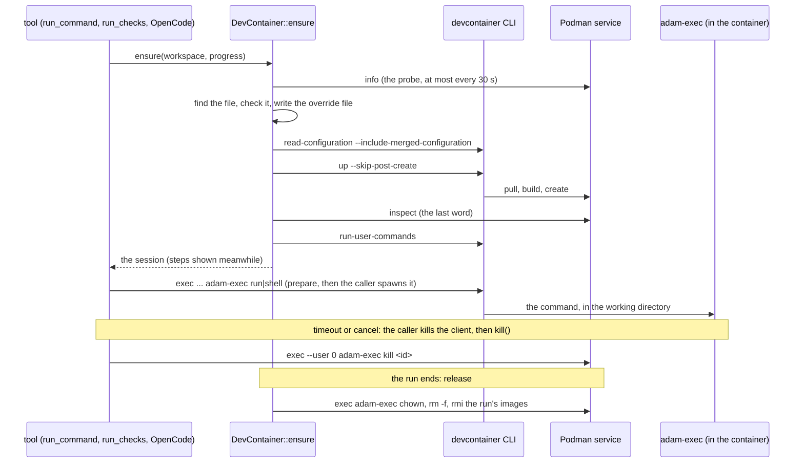
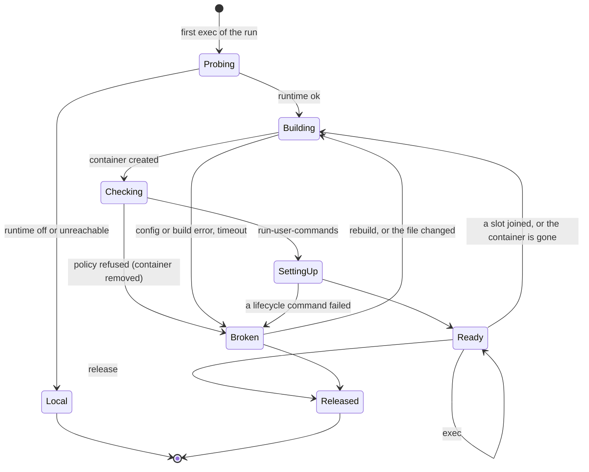

# adam-devcontainer

A run's processes in its repository's devcontainer, on a rootless Podman service: the container-backed
[`Environment`](../adam-workspace/README.md#where-a-runs-processes-run-the-environment-port) of
`adam-workspace`. The decision, the facts it rests on, and the lifecycle are
[ADR 0010](../../docs/decisions/0010-a-run-works-in-its-repositorys-devcontainer.md).

## Where it sits

An **implementation** of the `Environment` port (swapped at build time, ADR 0009 of the orchestration
layer: a binary composes it, no plugin). It depends on `adam-workspace` for the port and on nothing that
runs containers: it drives the official devcontainer CLI and Podman's remote client as child processes, with
an empty environment plus an allow-list. The coder (`adam-coder`) composes it in the next change of this
series; until then nothing in this repository calls it except its own tests.

A run's commands (`run_command`, `run_checks`, OpenCode and everything OpenCode starts) go through the
run's `EnvSession`: the coder `prepare`s a command and spawns it. The files, the paths and all git work stay
in the coder (it holds the credentials); **a path means the same inside the container as in the coder**.

## API at a glance

| Item | What |
|---|---|
| `DevContainer` | the `Environment`: `new(Settings)`, plus `probe()`, `prepull()`, `install_tools()`, `prune()` and `rebuild(run, use_default)` for the coder's startup, sweep and `rebuild_environment` tool |
| `Settings` | the root, the CLI and Podman programs, `CONTAINER_HOST`, the default image, the network, the deployment label, the timeouts, the OpenCode binary and the model key; `Settings::new(root)` has the defaults |
| `Runtime` | `Off` (every run is in the coder's own container; the default) or `Podman` |
| `Network` | `Inherit` (the Podman service's own network, which the deployment limits) or `None` |

```rust
use adam_devcontainer::{DevContainer, Runtime, Settings};
use adam_workspace::Environment;

let mut settings = Settings::new("/work");
settings.runtime = Runtime::Podman;
settings.container_host = "unix:///run/podman/podman.sock".to_owned();
settings.default_image = "mcr.microsoft.com/devcontainers/base:2.2.1-trixie@sha256:1f851004...".to_owned();
let environment = DevContainer::new(settings);
// environment.ensure(&run_workspace, &progress).await? gives the session of the run.
```

## Which file is used

The **first slot** of the run, in the order the slots joined (a scratch project counts), decides **once**, for the
whole run. In it, in the containers.dev order: `.devcontainer/devcontainer.json`, then `.devcontainer.json`,
then `.devcontainer/<folder>/devcontainer.json` (the first folder in sorted order; a step names the others). A
slot with none gets `Settings::default_image`. Later repositories are mounted into the same container and their
own devcontainer is ignored (a step says so). A workspace of the older layout (`<root>/worktrees/<run>`) stays in
the coder's own container, with a step. The file is read as JSON with comments (`jsonc-parser`), must be a
regular file inside the slot (a link that leaves it is refused), at most 1 MiB.

## The file is untrusted

It can run commands, mount directories and build images. The same policy (`src/policy.rs`) is checked three
times: on the **file**, on the **merged configuration** the CLI computes from features and the image's
`devcontainer.metadata` label (`read-configuration --include-merged-configuration`), and on **`podman inspect` of
the container that was made**, which has the last word: a refusal there removes the container.

| Key | What happens |
|---|---|
| `workspaceFolder`, `workspaceMount` | set to the first slot's path and a bind of the run's whole workspace at the same path |
| `mounts` | the repository's `volume` and `tmpfs` only (a volume name must be a name, `volume-opt` and `volume-driver` are refused, a target under `/opt/adam` or `/run/adam` is refused); a `bind` is **refused**. We append, all **read-only**: each repository slot's mirror, each slot's `.git`, the tools at `/opt/adam/bin`, the secrets at `/run/adam/secrets`; and the first slot read-write at the folder the repository says its workspace is (`/workspaces/<dir>`), for scripts that hardcode it |
| `runArgs` | allowed: `-e/--env`, `-l/--label` (not the `adam.vymalo.com/` prefix), `--hostname`, `--add-host`, `--shm-size`, `--ulimit`, `--init`, `--tmpfs`, `--memory*`, `--cpus`, `--pids-limit`; anything else is **refused**. We append `--network=host` (`Inherit`) or `--network=none` |
| `initializeCommand` | **removed**: the specification runs it on the host side, which here is the coder, next to its credentials |
| `dockerComposeFile` | **refused** |
| `privileged` | **refused** unless `false` |
| `capAdd` | only `SYS_PTRACE` |
| `securityOpt` | only `seccomp=unconfined` and `label=disable` (the Podman service's own seccomp filter still applies to everything below it) |
| `build.options` | **refused** (`--secret` and `--ssh` read files outside the repository) |
| `build.context`, `build.dockerfile`, `dockerFile`, `context`, local features | must stay inside the repository (lexically, relative to the file) |
| `appPort`, `forwardPorts`, `portsAttributes` | removed: nothing is published |
| `${localEnv:X}` | resolved by the CLI against its own cleared environment: empty, but for `PATH`, `HOME`, `CONTAINER_HOST`, `LANG`, `TMPDIR` |

The created container is refused for `Privileged`, a `CapAdd` other than `SYS_PTRACE`, a `Devices` entry, a
`SecurityOpt` outside the two, a `NetworkMode` other than the asked one, a `PidMode` that is not its own, an
`IpcMode` that joins another container or a path, any `bind` mount that is not one this crate added (or one of
ours that is writable when it must not be), and any mount of another type. Every change made to the file is listed in the detail of
the step that builds the environment.

## The CLI calls and the lifecycle





* **The CLI's environment** is empty plus `PATH`, a `HOME` of its own (`<root>/environments/.cli-home`),
  `CONTAINER_HOST`, `LANG` and `TMPDIR`, for every call (and for Podman's client).
* **Common flags:** `--docker-path <podman> --workspace-folder <first slot> --override-config <run dir>/devcontainer.json
  [--config <repository file>] --id-label adam.vymalo.com/run=<run> --id-label adam.vymalo.com/deployment=<id>
  --mount-workspace-git-root=false`. With `--config` the file's directory is the repository's, so relative paths resolve there.
* **A command** is `devcontainer exec <common> --log-format text --remote-env K=V... /opt/adam/bin/adam-exec run|shell <id> <cwd> :<word>...`.
  The log format is text (with a JSON log the CLI takes a terminal and swallows the output). The variables of the
  `ExecSpec` are `--remote-env`, minus what it said to hide, plus `GIT_CONFIG_COUNT=1`, `GIT_CONFIG_KEY_0=safe.directory`,
  `GIT_CONFIG_VALUE_0=*` (the tree is the coder's, whoever the remote user is). Every word after the working directory has a
  `:` in front, which `adam-exec` removes, because the CLI's option parser would take `--version` for its own. No secret
  is ever on a command line: the model key is the file `/run/adam/secrets/model-key` (`secret_ref("model-key")`).
* **`adam-exec`** (`src/adam-exec.sh`, POSIX sh, shellchecked; embedded and mounted read-only with the OpenCode binary at
  `/opt/adam/bin`) enters the directory, records the process (pid and start time, so that a reused pid is never mistaken for
  it) and becomes the command. `kill` stops that process and its descendants, found through the parent ids of the
  container's own `/proc`, and the members of its process group when it leads one. Killing the `devcontainer exec` client
  does **not** stop what it started inside (verified 2026-10-01 by the slice 7b planning), so `kill` is the backstop, and
  the container's removal the last one: a daemon that left its parent and its group stays until then. `chown` gives the tree
  back to the coder's own ids, mapped through the container's id map.
* **`Broken` is kept** in `state.json` (the error, and the digest of the file): a retry gets the same error at once until
  the file changes or `rebuild` is called. `rebuild(run, use_default: true)` ignores the repository's file for the run.
  A coder that restarts finds its containers again by their labels.
* **Failure modes:** runtime `Off`, or the service unreachable (probed with `podman info`): the run is `Local`, with a step that
  says so (and, for `Off`, a repository that has a devcontainer says the deployment has no runtime); a parse error, no
  `image` or `build`, Compose, a refusal, a pull or build failure, a failed lifecycle command or a timeout is `Broken` with an
  error that names the file and the problem and carries the last 40 lines of the log, scrubbed; the container gone (a service
  restart) is made again with a step; a missing devcontainer CLI is `Unavailable` and not kept.
* **Timeouts:** `read-configuration` 120 s, `up` 1200 s, `run-user-commands` 900 s, the probe 10 s, `release` 60 s. A call that
  runs out is killed with its process group and any partial container is removed by label.

## What is on the volume

`<root>/environments/`: `.tools/<version>/{adam-exec,opencode}` (written once, atomically, shared by every run), `.cli-home/`, and
per run `<run>/{state.json,devcontainer.json,secrets/model-key,build.log,lock}`. All of it is scratch: it goes with the run
(`release` removes the container, the `vsc-*` images the CLI built for it, and this directory). The Podman storage volume is kept,
so pulled images and layers are reused across runs.

## Tests

* `cargo test -p adam-devcontainer` needs no Podman: unit tests for the config discovery, the policy (one case per row of the table
  above, the three checks), the override file, the state, the CLI runner (the allow-list, the process group, the timeout) and
  the scrubbing; `tests/environment.rs` runs `DevContainer` over a stub Podman and a stub devcontainer CLI (shell scripts that
  record their arguments and environment) and a real `Workspaces`, and asserts the order and arguments of every call, the steps,
  every refusal, the state across a restart, single-flight, release and the sweep; `tests/adam_exec.rs` runs the embedded script.
* `tests/podman.rs` runs against a real Podman service and the real CLI. It is gated on `ADAM_TEST_DEVCONTAINER=1`,
  `CONTAINER_HOST` and `ADAM_TEST_DEVCONTAINER_ROOT` (`ADAM_TEST_REQUIRE_DEVCONTAINER=1` makes a skip fail); the CI job
  `devcontainer` runs it ([`dev/podman/README.md`](../../dev/podman/README.md)).
* The `podman inspect`, `ps` and `images` JSON of the unit tests is written by hand in the shapes of Podman v5.8.7's own structs
  (`libpod/define/container_inspect.go`, `pkg/domain/entities/types`, *verified* against the source on 2026-10-01), not recorded from
  a live Podman: the gated test is what shows they match.

## Errors

`adam_workspace::EnvError`: `Unavailable` (the CLI is not installed, the service did not answer, a call to it failed) and `Timeout`
and `Lost` are `Transient`; `Config`, `Refused` and `Build` are `Invalid`; `Io` is `Internal`. A message never carries a secret.

## See also

* [`adam-workspace`](../adam-workspace/README.md): the port (`Environment`, `EnvSession`, `ExecSpec`, `PreparedCommand`) and `Local`.
* [`dev/podman/README.md`](../../dev/podman/README.md): the service, what it is given and why, the pinned seccomp profile.
* [ADR 0010](../../docs/decisions/0010-a-run-works-in-its-repositorys-devcontainer.md).
