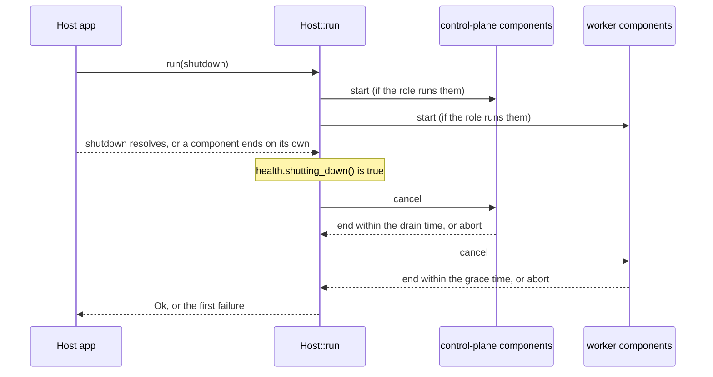
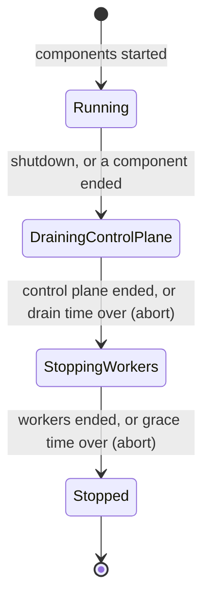

# adam-host

The contract between adam-rs and a host app: the process `Role` enum, the workspace `Placement`
enum, and a small role-aware supervisor.

## Where it sits

adam-rs is a **library** that any host app embeds. The comparison: eve.dev is a library, NestJS
is the app. The library gives durable runs, stores and protocol adapters. The host is the app
that decides how a process starts, and what it exposes.

A host runs a **control plane** and **workers**, and they are decoupled: one control plane and
N workers, or more, all over one durable store. What runs in a process is a **role**. The role
enum lives here, in adam-rs, so it is the same for every host. A host only says which role its
process runs. It does not define roles of its own.

The crate is small on purpose. By default it needs std, `adam-error` (for `Classify`),
`thiserror`, and the supervisor's tokio. It has no HTTP framework and it never reads the
environment: the host owns the name of the variable (`ROLE`, `ORCH_ROLE`) or the flag.

## API at a glance

| Item | What |
|---|---|
| `Role` | `All` (default), `ControlPlane`, `Worker`. Closed: no `#[non_exhaustive]` |
| `Role::VALUES`, `as_str()` | every role, and its name: `all`, `control-plane`, `worker` |
| `runs_control_plane()`, `runs_workers()` | what a role runs. `All` runs both |
| `Role::from_optional(Option<&str>)` | `None` or blank gives `All`; anything else must be a name |
| `FromStr`, `Display` | `FromStr` trims and ignores ASCII case; exact names only, no aliases. `Display` equals `as_str()` and round-trips |
| `ParseRoleError { input }` | the message lists the accepted values; `Classify` gives `Invalid` |
| `Placement` | `Shared` (default), `Affinity`, `Isolated`, `A2aOnly`. Closed: no `#[non_exhaustive]` |
| `Placement::VALUES`, `as_str()` | every placement, and its name: `shared`, `affinity`, `isolated`, `a2a-only` |
| `pins_runs()`, `needs_workspace()` | `Affinity` and `Isolated` pin runs to a worker; every placement but `A2aOnly` needs a workspace |
| `Placement::from_optional(Option<&str>)` | `None` or blank gives `Shared`; anything else must be a name |
| `ParsePlacementError { input }` | the message lists the accepted values; `Classify` gives `Invalid` |
| `Host` (feature `supervisor`) | `Host::new(role).control_plane(name, f).worker(name, f).control_plane_drain(..).worker_grace(..).run(shutdown)` |
| `Health` (feature `supervisor`) | `host.health()`: `ready()` and `shutting_down()`. Data only |
| `HostError` (feature `supervisor`) | `Stopped`, `Panicked`, `EndedEarly`, `NothingToRun`. `#[non_exhaustive]`; `Classify` gives `Internal` |

### Why `Role` is closed

A new role must be a compile error in every host that matches on it. Then each host decides
what the new role runs, and none of them runs it by accident. A host that only asks
`runs_control_plane()` and `runs_workers()` needs no change. See
[ADR 0001](../../docs/decisions/0001-library-first-host-roles.md).

### Placement

Where the files of a run live, and whether a run stays on one worker. The deployer chooses; the
host reads the choice from its own variable (`adam-coder`: `WORKSPACE_PLACEMENT`) and passes it to
`Placement::from_optional`, like `Role`. `FromStr` trims and ignores ASCII case, and `Display`
equals `as_str()`. Like `Role`, it is closed on purpose.

| Placement | Meaning | `pins_runs()` | `needs_workspace()` |
|---|---|---|---|
| `shared` (default) | one volume that every worker mounts; any worker may resume any run | no | yes |
| `affinity` | a run is stepped only by the worker that first claimed it; each worker owns a folder under the root | yes | yes |
| `isolated` | as `affinity`, and the worker's root is a volume of its own | yes | yes |
| `a2a-only` | no workspace; the host's agents only call remote agents | no | no |

This crate does not touch the store. A host maps `pins_runs()` to `ClaimScope::Pinned`
([`adam-core`](../adam-core/README.md)) and `needs_workspace()` to "build a workspace root or
not". A pinning worker needs a stable worker id. See
[ADR 0002](../../docs/decisions/0002-workspace-placement.md).

## The supervisor

A component is an async closure: `FnOnce(CancellationToken) -> impl Future<Output = Result<(),
BoxError>> + Send + 'static`. The host registers **all** its components, whatever the role.
`run` starts only those that match:

| Registered with | Runs when |
|---|---|
| `.control_plane(name, f)` | `role.runs_control_plane()` |
| `.worker(name, f)` | `role.runs_workers()` |

If nothing matches, `run` returns `HostError::NothingToRun` at once.





* **The first component to end on its own ends the host.** An error is `Stopped`, a panic is
  `Panicked` and an `Ok` before shutdown is `EndedEarly`. Each names the component.
* **Order.** The control plane stops first, so no new work comes in. The workers stop second, so
  the steps in flight can finish and commit.
* **Bounds.** `control_plane_drain(Some(d))` aborts the control plane after `d`. This is for
  connections that never close, such as SSE. `worker_grace(Some(g))` aborts the workers after
  `g`. `None`, the default, waits for ever. Set the grace below the orchestrator's kill
  timeout (Kubernetes `terminationGracePeriodSeconds`).
* **First failure wins.** A later failure is logged, not returned. A component that returns
  `Ok` after the host began to stop is not a failure.
* **Health.** `Health` is a shared handle. `ready()` is true when every started component is
  running and the host is not shutting down. `shutting_down()` is true from the first step of
  the stop. The host exposes it as it likes, for example `/readyz` returning 503.

## Usage

```rust
use std::time::Duration;
use adam_host::{Host, Role};

// The host owns the variable name. None or blank means `all`.
let role = Role::from_optional(std::env::var("ROLE").ok().as_deref())?;

let host = Host::new(role)
    // Control plane: the front and the state changes users ask for.
    .control_plane("http", |stop| async move {
        axum::serve(listener, router)
            .with_graceful_shutdown(stop.cancelled_owned())
            .await
            .map_err(Into::into)
    })
    // Workers: the loops that claim and run work.
    .worker("dispatcher", |stop| async move {
        runtime.run_worker(stop.cancelled_owned()).await.map_err(Into::into)
    })
    .control_plane_drain(Some(Duration::from_secs(10)))
    .worker_grace(None);

let health = host.health(); // serve it on /readyz, or ignore it
host.run(sigterm()).await?; // the host passes its own shutdown future
```

The same code serves `ROLE=control-plane`, `ROLE=worker` and the default `all`.

With clap, the role is a flag: `#[arg(long, env = "ROLE", value_enum, default_value_t)] role: Role`
(the values are `all`, `control-plane` and `worker`).

## Features

| Feature | Default | Adds |
|---|---|---|
| `supervisor` | yes | `Host`, `Health`, `HostError`. Brings `tokio` (`rt`, `sync`, `time`), `tokio-util` and `tracing` |
| `clap` | no | `Role` and `Placement` implement `clap::ValueEnum` (`--role control-plane`, `--placement a2a-only`) |
| `serde` | no | `Role` and `Placement` implement `Serialize` and `Deserialize` as `"control-plane"`, `"a2a-only"` |

Future work: a `runtime` feature with the `adam-runtime` worker as a ready-made worker
component.

## Errors

Both enums follow the repo rules ([`adam-error`](../adam-error/README.md)): `HostError` is
`#[non_exhaustive]` with a `Classify` impl. Every variant is `Internal`: a failed component is
a bug or a lost dependency, and the process should exit and be restarted. `ParseRoleError` and `ParsePlacementError` are
`Invalid`: it is bad configuration, and it never succeeds. Print a `HostError` with
`adam_error::report`, which adds the cause (`component `dispatcher` stopped: connection reset`).

## Tests

`cargo test -p adam-host --all-features` runs the unit tests and one doc test. The supervisor
tests run on tokio's paused clock, so the drain and grace bounds are exact and instant:

* `Role`: round-trip of every value, trimmed and case-insensitive input, exact names only,
  `from_optional` for `None`, blank and unknown input, the `runs_*` truth table, the clap names
  and a parsed flag (feature `clap`), and kebab-case serde (feature `serde`).
* Supervisor: role gating, `NothingToRun`, control plane stopped before workers, drain and grace
  bounds (abort, and `None` waits), an error reported by name, a panic, `EndedEarly`, first
  failure wins, and `Health` flips.
* The class table of `HostError` and `ParseRoleError`, as an exhaustive `match`.

* `Placement`: the same set as `Role` (round-trip, trimmed and case-insensitive input, exact
  names only, `from_optional`, the clap names and flag, kebab-case serde), and the truth table of
  `pins_runs` and `needs_workspace`.

`cargo test -p adam-host --no-default-features` runs the `Role` and `Placement` tests alone.
