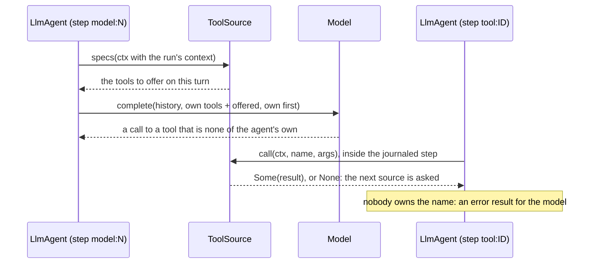
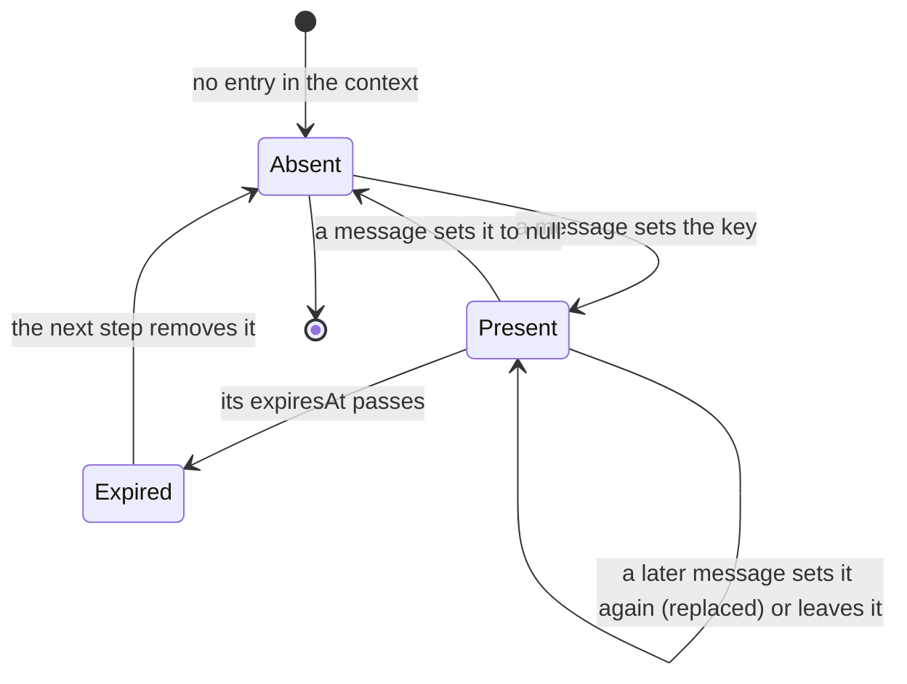

# adam-llm-agent

`LlmAgent`: a reusable, durable model/tool-calling loop on top of
`adam-runtime`.

## Where it sits

An `adam_runtime::Agent` implementation, written against the two ports it
needs: [`adam-model`](../adam-model/README.md) (`DynModel`) and
[`adam-runtime`](../adam-runtime/README.md). Every model call and every tool
call is a journaled `Ctx::step`, so a restarted worker replays what already
happened instead of repeating a side effect. An adam-rs agent is then
instructions + a model + a toolset. It is served over A2A by
[`adam-a2a-runtime`](../adam-a2a-runtime/README.md); the coder agent
([`adam-coder`](../../bin/adam-coder/README.md)) is built on it.

## API at a glance

| Item | What |
|---|---|
| `LlmAgent`, `LlmAgentBuilder` | `LlmAgent::builder(name, model, model_alias)` then `.instructions(..)`, `.tool(..)`, `.dyn_tool(..)`, `.limits(..)`, `.wait_poll(..)`, `.build()` |
| `LlmStarter` | the start-only half: `LlmStarter::new(name)` implements `adam_runtime::AgentStarter` with `State = Conversation`, needs no model or tools, and inits exactly like `LlmAgent` (same accepted payloads, same `unusable start message` rejection), and continues a prior run exactly like `LlmAgent` (see *Continuing a conversation*) |
| `Limits` | `max_turns`, `max_tool_calls`, `max_output_tokens`, `max_history_tokens`; a tripped limit fails the run with a message naming it (except history, which shortens old tool output) |
| `Tool` (trait), `DynTool` | `spec() -> ToolSpec`, `async call(&ToolCtx, Value) -> Result<ToolOutput, ToolError>` and the default methods `required_state() -> Vec<StateKey>` (none) and `asks_user() -> bool` (`false`: says the tool can end a call with `NeedsInput`, so `adam-assembly` keeps it out of subagents; `#[tool(asks_user)]` and `FnTool::asking_user()` set it) and `step_style() -> StepStyle` (how a call is drawn as a step: the default is a plain `tool` labelled with the tool's name; `#[tool(step = "subagent", label = "OpenCode", icon = "agent")]` sets it; a tool that wraps another must forward it, as `required_state` and `asks_user`; see *Steps*) |
| `ToolOutput` | `text`, `error`, `with_artifact` |
| `StepStyle`, `StepEvent`, `StepKind`, `StepState`, `StepIcon` | `StepStyle::new(kind).with_label(..).with_icon(..)`; the others are `adam-runtime`'s, re-exported (see *Steps*) |
| `ToolCtx` | run id, conversation id, attempt, call id, `child_run_id()` (the id of the child this call starts), `start_child(agent, message)` (starts it on the runtime that steps the run), `step_id()` (`tool:<call id>`), `report_step(StepEvent)` (a step that runs under this call's), `emit_progress` (an update of the call's own step, the text in its detail), `cancelled` / `cancel_token`, `state::<T>()` / `require_state::<T>()`, `context(key)` / `context_map()` (the run's inbound context, see *Context and tool sources*), and for tests `detached(..).with_state(..).with_context(..)` |
| `ToolError` | `Transient`, `Permanent`, `NeedsInput { question, ui }` (parks the run; A2A reports `input-required`; `ui` is an interface that comes with the question; build one with `ToolError::needs_input(q)` or `needs_input_with_ui(q, ui)`), `AwaitRun { run }` (the result is a child run's outcome; the run parks with a timer, A2A reports `working`), `AwaitRemote { task, timeout_ms }` (the result is the outcome of a task on another system, polled on the timer); `#[non_exhaustive]`, see *Errors* |
| `LlmAgentBuilder::state`, `try_build`, `tools` | `state(Arc<T>)` shares a value with the tools (one per type); `try_build() -> Result<LlmAgent, BuildError>` fails on a tool whose `required_state` was not given (`BuildError::MissingState`) or on two tools with one name (`BuildError::DuplicateTool`); `tools(ToolSet)` registers a group. `build()` is unchanged (last duplicate wins, no state check) |
| `State<T>`, `StateKey`, `Extensions` | a cheap `Arc` handle that derefs to `T`; the key of a state type; the typed map behind them |
| `ToolSet`, `tools!` | an ordered group of tools: `tools![Clock, Search::new()]`, `.extend(..)`, `.wrap(\|tool\| ..)` for middleware, `names()`, `get(..)` |
| `parse_args`, `IntoToolOutput`, `IntoToolResult`, `Json<T>` | read the model's arguments into a struct (a mistake is a `ToolOutput::error` for the model, never a panic; `null` reads as `{}`); return a `String`, `&'static str`, `Value`, `Json<T>` (compact JSON) or a `Result` of one with an error that is `Into<ToolError>` |
| `FnTool` | a tool from a closure: `FnTool::raw(name, description, schema, \|ctx, args\| async ..)`; with feature `schema`, `FnTool::builder(name).description(..).args::<A>().handler(..)` |
| `spec_for::<A>(name, description)`, `ToolSpecExt::for_args` | feature `schema`: the `ToolSpec` of a tool whose arguments are `A: JsonSchema` |
| `ToolError::from_classified(&e)` | a retryable `Classify` error becomes `Transient`, any other `Permanent`, with the whole source chain as the message |
| `__private` | feature `schema`, `#[doc(hidden)]`: the paths `#[tool]` generates code against (`serde`, `schemars`, `async_trait`, `spec_for`, `parse_args`, ...). Not API: it changes with the macro |
| `ToolSource`, `DynToolSource`, `SourceCtx`, `LlmAgentBuilder::tool_source`, `MAX_SOURCE_TOOLS` | tools the agent learns about while it runs: a source lists its tools at every model turn (`specs(&SourceCtx)`) and answers the calls to them (`call(&ToolCtx, name, args) -> Option<..>`), see *Context and tool sources* |
| `Conversation::context`, `merge_context`, `drop_expired_context`, `MAX_CONTEXT_BYTES` | what the messages of the run say about their sender, merged key by key (`null` deletes), bounded, with expiring entries; see *Context and tool sources* |
| `Conversation`, `PendingWait`, `PendingQuestion`, `PendingRun`, `PendingRemote`, `ArtifactRef` | what `Runtime::view(run).state` deserializes into; `PendingQuestion::ui` is the interface that came with the question (absent when there is none, and in state stored before it existed); `Conversation::pending_wait` is the question, the child run or the remote task the parked run waits for (it was `pending_question`, and state stored under that name still loads); `Conversation::continued_from` is the run a continued run carries on, and `Conversation::omitted_turns` how many turns of earlier conversation were left out to meet the cap (both absent otherwise, and in state stored before they existed) |
| `Conversation::continued(&self, text, from: RunId)`, `LlmAgent::init_continuing`, `LlmStarter::init_continuing` | the conversation of a new run that carries on this one with one more user message; what is carried, dropped and reset is in *Continuing a conversation* |
| `Conversation::is_omission_marker(message, part)` | whether that text part is the marker (the second part of the first message while `omitted_turns` is not zero), so a rule that reads what the user said skips exactly it: the coder's `person_texts` |
| `MAX_CARRIED_BYTES`, `OMITTED_MARKER_PREFIX` | the cap on the history a continuation carries (256 KiB of JSON), and the prefix of the marker text part that stands in for the turns dropped to fit it |
| `Tool::poll_remote`, `RemotePoll` | how a tool that returned `AwaitRemote` answers "how does the task stand": `Ready(ToolOutput)` or `Working`; the default refuses |
| `DEFAULT_WAIT_POLL` | 60 s: how long a run waiting for a child sleeps before it reads the child itself |
| `user_message(text)`, `MESSAGE_KIND` | build the `Inbound` that starts or continues a run |
| `TRUNCATION_MARKER_PREFIX` | prefix of the marker left where history truncation shortened a tool output |

```rust
use std::sync::Arc;
use adam_llm_agent::{Limits, LlmAgent};
use adam_model::MockModel;

let agent = LlmAgent::builder("assistant", Arc::new(MockModel::new()), "my-model")
    .instructions("Be brief.")
    .limits(Limits { max_turns: 10, ..Limits::default() })
    .build();
// register it: Runtime::builder(store).agent(agent).build()
// start a run: runtime.start("assistant", user_message("hello"), None)
```

A process that only accepts requests registers `LlmStarter::new("assistant")`
with `RuntimeBuilder::starter` instead, and a worker with the `LlmAgent`
steps the runs (see *Starting without stepping* in
[`adam-runtime`](../adam-runtime/README.md)).

A complete `Tool` implementation, and one using the typed helpers, are in the crate docs
(`src/lib.rs`). The `#[tool]` macro that generates such a tool from a function is in
[`adam-macros`](../adam-macros/README.md), used through the [`adam`](../adam/README.md) facade (part of
[the authoring layer](../../docs/authoring.md)).

### Shared state

```rust
// a tool: `let db = ctx.require_state::<Db>()?;` and, in `impl Tool`,
//         `fn required_state(&self) -> Vec<StateKey> { vec![StateKey::of::<Db>()] }`
let agent = LlmAgent::builder("assistant", model, "my-model")
    .state(Arc::new(db))          // one value per type
    .tools(tools![Lookup])
    .try_build()?;                // Err(BuildError::MissingState { .. }) at startup, not mid-run
```

`Tool::required_state` returns a `Vec` and not a `&'static [StateKey]`: `TypeId::of` is not `const` on
stable, so a static slice cannot be built. It is only called when the agent is built.

### Argument schemas

With the `schema` feature, `spec_for::<Args>("name", "description")` derives `parameters` from
`schemars::JsonSchema` (schemars 1.x): draft 2020-12, subschemas inlined, no `$schema`, no `title`
(a property that is *called* `title` stays), and an object schema always has `properties`. Doc comments
become descriptions and `Option<T>` fields are not required. The feature also enables schemars' `derive`, so
`#[derive(JsonSchema)]` works for whoever depends on it, and it is what `#[tool(crate = ::adam_llm_agent)]`
needs from a crate that does not use the `adam` facade.

## Continuing a conversation

When the runtime starts a run as the continuation of another (`Runtime::start_with_id_continuing`; over A2A,
a new task whose message references a finished one), `LlmAgent::init_continuing` and
`LlmStarter::init_continuing` (both `Conversation::continued`, so a front and a worker cannot disagree) give it
the conversation of the run before:

| | |
|---|---|
| **Carried** | the history, oldest first, and the user messages that were waiting behind an owed tool result (`deferred`), in arrival order; then the new user message |
| **Dropped** | a last assistant message whose tool calls did not all get a result, with the results that did arrive: a run that ended mid-turn (a limit, a cancel, a question nobody answered) leaves one, and a provider rejects a call without a result. So `pending_calls` and `pending_wait` are always empty: a continued run never answers a question or a child run of the run before. The side effects of the dropped calls are not undone |
| **Reset** | `turns`, `tool_calls`, `usage` (`Limits` are per run) and `artifacts` (the final output lists what this run produced) |
| **Recorded** | `continued_from: Option<RunId>`, not written while `None`; `omitted_turns: u32`, not written while zero |
| **Bounded** | over `MAX_CARRIED_BYTES` (256 KiB of JSON), in this order and only as far as needed: **(1) the tool outputs of the turns older than the newest are shortened**, oldest first, each keeping its head and ending in the `TRUNCATION_MARKER_PREFIX` marker (the same truncation `max_history_tokens` does when a history is sent); **(2) whole old turns are dropped** (a turn is a user message and what follows it up to the next), one marker standing in for them; **(3) the newest prior turn's tool outputs are shortened, last**. Never dropped: **the first user message of the chain** (the task; kept verbatim as the first text part of the first message) and the **newest prior turn**. A newest turn whose own text is over the cap is carried over it. The waiting messages and the new one are counted, never cut |
| **The marker** | the **second text part of the first user message**, starting with `OMITTED_MARKER_PREFIX` and naming the number of turns; `omitted_turns` (not the text) is what says the part is a marker, so a user message that merely starts with the prefix is an ordinary one. It is always the second part: before anything is dropped, a first message that has several parts (`[task, next]`, from a run that ended before the model answered) is reduced to its task, and the rest becomes a user message of its own (a turn like any other), then merged behind the marker. A rule that reads what the user said should read user messages part by part and skip that part (`Conversation::is_omission_marker`) |
| **Alternating** | user messages that would be adjacent become one message with several text parts (the marker and what follows it, the new message after a history that ends with the user's, the waiting ones before the new one), because chat templates that insist on alternating roles reject two user messages in a row |

The cap is not "history the model would be cut anyway": `max_history_tokens` (`src/history.rs`) only ever
shortens tool output in what is sent, so shortening tool output first is the loss the loop already accepts, and
dropping turns is the last resort. The cap is about what is stored and carried. **An agent that wraps an
`LlmAgent` and delegates `init` must delegate `init_continuing` too.** Breaking for code that builds a
`Conversation` with a struct literal (two new public fields) and for `AgentStarter` implementors (`State` now
needs `DeserializeOwned`), see the ADR's *Consequences*. The decision is
[ADR 0003](../../docs/decisions/0003-a-new-task-continues-the-task-it-references.md).

## Context and tool sources

Two ways for a run to learn something its code did not know when it was built, both fed by the **inbound
messages**.

**The context.** A message may carry `{"text": "...", "context": {...}}`: the object under `context` is merged,
key by key, into `Conversation::context` when the run reads the message (the start message, every message
delivered later, and the answer to a question). A key a message sets replaces the one before, a key set to `null`
deletes it, a message without `context` changes nothing. Tools read it with `ToolCtx::context(key)`. What it holds
is the sender's own account of itself, so a tool treats it as input; an A2A server fills it from the extensions a
message carries (`adam-a2a-runtime`'s `vymalo_inbound`). The context is part of the durable state, so a restart or a
change of worker keeps it, and a run that continues another starts with the one before
(`Conversation::continued`; the new message's keys then win). Two bounds: the whole context is at most
`MAX_CONTEXT_BYTES` (256 KiB of JSON; a message that would take it over has its context dropped, with a warning,
and is still read for its text), and **an entry that is an object with an `expiresAt` (RFC 3339) is removed once
that time has passed**, at the start of the next step (`drop_expired_context`): a credential the sender put there
does not stay in the store after it stops working. (A run parked for hours still holds it until it next steps.)

**The question's interface.** `ToolError::NeedsInput { question, ui }` may carry an interface, an array of A2UI
messages; it is kept with the question in `PendingQuestion::ui` (`/pending_wait/ui` in the stored state), where an
A2A server reads it to send it beside the question in the `input-required` status. The agent does not look inside
it.

**Tool sources.** A `Tool` has one fixed spec; a `ToolSource` lists its tools anew for every model call and answers
the calls to them:



The sources are read inside the step of the model call, so a replay of a turn whose answer is recorded reads
nothing and the journal has no new entries: only the answer is recorded, not the tools it was given. A listed tool
whose name an own tool or an earlier source has is left out, with a warning (the agent's own tools win), at most
`MAX_SOURCE_TOOLS` (64) are offered, and an agent with no source behaves exactly as before. A source's tool may ask
the person and wait for a child run, but not wait on a remote task (`AwaitRemote` is answered with an error result:
the agent polls the tool that started the task, and a source's tool is not known then).



## Steps

Every tool call is a **step** ([`RunEvent::Step`](../adam-runtime/README.md#steps), the vocabulary of the orchestration
layer's `steps/v1`; [ADR 0007](../../docs/decisions/0007-progress-as-steps-and-streamed-text.md)). The agent reports the
step `tool:<call id>` as `running` before the tool runs and, after it, `completed` (a result), `failed` (an error
result, a `Permanent` error, an unknown tool, or a `Transient` failure the run retries) or `waiting` (the tool asked
the person with `NeedsInput`, or the run parked on a child run or a remote task); a `waiting` step ends when the
answer, the child's outcome or the remote task's result arrives (`completed`, or `failed` for an error result). The
agent never puts a tool's output in the step: a step is shown to the person, and a result is for the model.

A tool chooses how its call is drawn with `Tool::step_style` (`StepStyle { kind, label, icon }`; the default is kind
`tool`, the tool's name as the label, no icon) and says more while it runs:

```rust
#[tool(step = "subagent", label = "OpenCode", icon = "agent")]      // or `fn step_style` by hand
async fn delegate(ctx: &ToolCtx, task: String) -> Result<String, ToolError> {
    ctx.emit_progress("starting OpenCode").await;               // an update of the call's own step
    ctx.report_step(
        StepEvent::new(format!("acp:{}:1", ctx.call_id()), StepKind::Command, "npm test", StepState::Running)
            .with_icon(StepIcon::Execute),                       // runs under the call's step
    )
    .await;
    // ... and later the same id in `Failed`/`Completed`, with `.with_detail("1 failed")`
    Ok("done".into())
}
```

`report_step` puts the step under the call's own (`ToolCtx::step_id()`) unless it says `.under(id)` another step the
call reported; ids must be unique within the run, so put the call id in them. A step the call leaves open when it
returns is closed by whoever shows the tree. These replace the `Custom` events `tool_start` and `tool_end` and
the `Progress` of `emit_progress` that earlier versions emitted (a breaking change of the events, ADR 0007):
`tool_end`'s `ok` is `completed`, `error` and `transient_error` are `failed`, `needs_input` and `waiting` are `waiting`.
`adam-a2a-runtime` serves steps to a client that activated `steps/v1` and as lines of text to one that did not.

## Child runs

A tool that delegates returns `Err(ToolError::AwaitRun { run })` after starting the child:

```rust
// the child's id is derived from this call, so a replay finds the child it started
let child = ctx.start_child("coder/reviewer", &message).await?;
Err(ToolError::AwaitRun { run: child })
```

The error is journaled, the agent records `PendingWait::Run` in the conversation and parks with a timer
(`wait_poll`, 60 s). When the child finishes the runtime sends `adam.run.finished` and the parent wakes at once
and answers the call; if that message is lost, the timer wakes the parent and it reads the child. The answer is the
child's `output.text` (or its output as JSON); a child that failed, was cancelled or was purged gives an error
result (`the run failed: ..`) and the run goes on. The message is matched to the wait by the child's run id, so
copies and strays are dropped; user messages that arrive meanwhile queue behind the result. Cancelling the parent
does not cancel the child. Events: `awaiting_run`, the call's step `waiting`, then the step's end
(`completed` or `failed`). The design and the failure interleavings are in
[`docs/architecture.md`](../../docs/architecture.md#child-runs).

The tool needs no `Runtime` of its own: `ToolCtx::start_child(agent, message)` starts the child on the runtime
that is stepping the run (through `Ctx::child_starter()`, whose only possible parent is this run), under
`child_run_id()`, and is idempotent. The agent must be registered on that runtime. A context made by
`ToolCtx::detached` belongs to no runtime and refuses (`Permanent`). This is what `adam-assembly`'s
`SubagentTool` does. (`tests/child_runs.rs` starts children with a `Runtime` it holds, which works too.)

## Remote tasks

A tool that starts a task on another system (an A2A agent, a job queue) and cannot wait for it inside one call
returns `Err(ToolError::AwaitRemote { task, timeout_ms })` from the step that started it, and implements
`Tool::poll_remote`:

```rust
async fn call(&self, ctx: &ToolCtx, args: Value) -> Result<ToolOutput, ToolError> {
    // start it, idempotently: key the request by ctx.call_id() or ctx.child_run_id()
    let task = start(ctx.child_run_id().to_string(), &args).await?;
    Err(ToolError::AwaitRemote { task, timeout_ms: Some(3_600_000) })
}

async fn poll_remote(&self, ctx: &ToolCtx, task: &str) -> Result<RemotePoll, ToolError> {
    Ok(match look(task).await? {
        Some(result) => RemotePoll::Ready(result), // becomes the tool result
        None => RemotePoll::Working,               // ask again after the next interval
    })
}
```

The agent records `PendingWait::Remote` (`{call_id, tool, task, deadline}`) and parks with the `wait_poll`
timer. Nothing tells it the task is over, so each time the timer fires it calls `poll_remote` in a journaled
step named `poll:<call id>`: a replay sees the recorded answer and never asks the tool twice for one wake.
`Ready` is the result (an error result if `is_error`); `Err(Transient)` fails the wake and retries it;
`Err(Permanent)` is an error result. With a `timeout_ms` the call is answered with an error result once the
wait is older (by the journaled clock) and the tool is not asked again. `task` is stored in the run's state:
put no secret in it. The tool is looked up by the name in the wait, so a definition that lost the tool answers
the call with an error result. A user message that arrives meanwhile wakes the run for one look and queues
behind the result. Events: `awaiting_remote`, the call's step `waiting`, then the step's end (`completed` or `failed`).
Cancelling the run does not cancel the remote task. This is what `adam-assembly`'s remote subagents do; the
design is in [`docs/architecture.md`](../../docs/architecture.md#remote-tasks-the-same-wait-without-a-message).

## Errors

`ToolError` implements `adam_error::Classify` (see
[`adam-error`](../adam-error/README.md)).

| `ToolError` | Class | The run |
|---|---|---|
| `Transient` | `Transient` | the step fails with `AgentError::Transient`; the runtime retries with backoff |
| `Permanent` | `Invalid` | the model is told, and can go on |
| `NeedsInput` | `Rejected` | valid, but it needs the user first: the run parks |
| `AwaitRun` | `Rejected` | valid, but it needs a child run first: the run parks with a timer |
| `AwaitRemote` | `Rejected` | valid, but it needs a remote task first: the run parks with a timer and polls |

`ToolError` is journaled, so its serde shape is frozen and it carries no
`source`: a tool flattens its own cause into the message (with
`adam_error::report`) before it returns.

Model failures are classified by `adam_model::ModelError` and journaled as a
record of `retryable`, the flattened message (`report`, so the chain is printed
once), `retry_after_ms` and the `class` name (records written before classes
existed decode with `class` absent). A retryable one becomes
`AgentError::Transient`, with `with_retry_after` when the provider sent a
`Retry-After`, so the retry waits at least that long; any other fails the run
with `model call failed: ...`. An unreadable start message is
`AgentError::Permanent` (`unusable start message: ...`), which A2A reports as
invalid params.

## Features and environment

| Feature | Default | What |
|---|---|---|
| `schema` | off | `schemars` 1.x as a dependency: `spec_for`, `ToolSpecExt`, `FnTool::builder`. Everything else in *API at a glance* is always available |

No environment variables.

## Tests

`tests/child_runs.rs` is the child-run suite (one case per failure interleaving, see *Child runs*), run against
`MemoryStore` always, against PostgreSQL when `ADAM_TEST_POSTGRES_URL` is set and against MongoDB when
`ADAM_TEST_MONGODB_URI` is set; it never sleeps for a fixed time (gates, a `ManualClock`, `FaultyStore::fail_run`).
The old `Conversation` JSON with `pending_question` is a literal in `src/conversation.rs`
(`a_state_stored_as_pending_question_still_loads`) and the old `ToolError` shapes are literals in `src/tool.rs`
(`journals_written_before_await_run_still_decode`).

`tests/context_and_sources.rs` is the suite of *Context and tool sources* (real `Runtime`, scripted `MockModel`, `MemoryStore`):
the context of the start message reaching a tool, replace/delete/keep across messages, a continued run carrying the
context (and the new message winning), the expiry, the size bound, state stored before the context existed, a question
that keeps its interface and the frozen shapes of old journals, a source read at every turn (a tool offered since the
last turn is there), an own tool winning a clash, the limit of offered tools, an unknown name, a source's tool that asks the person, and, with a store that loses the
acknowledgement of a write (`FaultyStore`), the replays: a model step that was recorded neither calls the model nor
reads the sources again, a source's tool that was recorded is not called again, and a source's tool that waits on a
remote task ends as an error result.

`tests/remote_tasks.rs` is the remote-task suite (`MemoryStore`, and PostgreSQL when `ADAM_TEST_POSTGRES_URL` is
set): polling on the moved clock until `Ready` with one start, a new process that polls on without starting,
a failed result, permanent and transient poll errors, the timeout, a tool that cannot be polled, and a user
message queueing behind the result. The shapes of `AwaitRemote` and of the wait are literals in `src/tool.rs`
and `src/conversation.rs`.

The continuation is tested in `src/conversation.rs` (what is carried, dropped and reset; tool outputs of old turns shortened
before any turn is dropped and the newest turn's last; a huge single turn keeping the task through two continuations;
a two-part first message keeping the marker second across two dropping continuations; the first user message
surviving a long chain under a small cap; markers counted by `omitted_turns` and never stacked or forged by a
message that starts like one; the newest prior turn protected with waiting messages present; the roles
alternating in each shape a continuation can take; state stored before `continued_from` and `omitted_turns`
existed still loads), in `src/history.rs` (`shorten_output`) and in `tests/llm_agent.rs`
(`a_starter_continues_exactly_like_the_agent`, a new run whose model is shown the earlier messages, a front that
holds only the starter, a run cancelled on a question that is continued without the stale wait, the 256 KiB cap
through the starter).

`tests/llm_agent.rs` is a behavioural suite over a scripted `MockModel` and
`MemoryStore` (`a_starter_inits_exactly_like_the_agent`, tool loop, retries and rate limits, limits, replay after a
crash, `NeedsInput` parking, cancellation, history truncation, and **steps**: a tool is a step in its own style and the steps it reports run under it, a plain tool is labelled with its name and an unknown one fails, a question keeps the step `waiting` until the answer ends it, a detached context reports to its sink). Property tests
of the truncation are in `src/history.rs`; the journal record of a model
failure is tested in `src/agent.rs`
(`a_journaled_failure_keeps_the_class_the_hint_and_the_whole_chain`,
`old_journal_records_decode`). `tests/typed_tools.rs` covers the typed helpers end to end (state reaching a tool in a real run,
`try_build`, `ToolSet` middleware, `FnTool`, and with `schema` a typed `FnTool`). Unit tests in
`src/typed.rs` include a property test that arbitrary JSON into `parse_args` never panics and fails only
as a `ToolOutput::error`; `src/schema.rs` tests the generated schema (run them with
`cargo test -p adam-llm-agent --features schema`). Offline, no environment variables.

## See also

[`adam-runtime`](../adam-runtime/README.md),
[`adam-model`](../adam-model/README.md),
[`adam-coder`](../../bin/adam-coder/README.md),
[`adam-error`](../adam-error/README.md).
