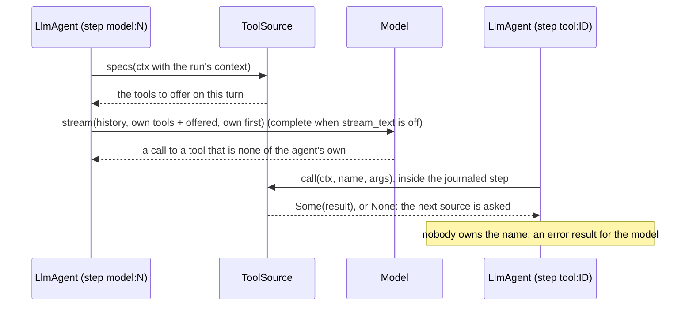
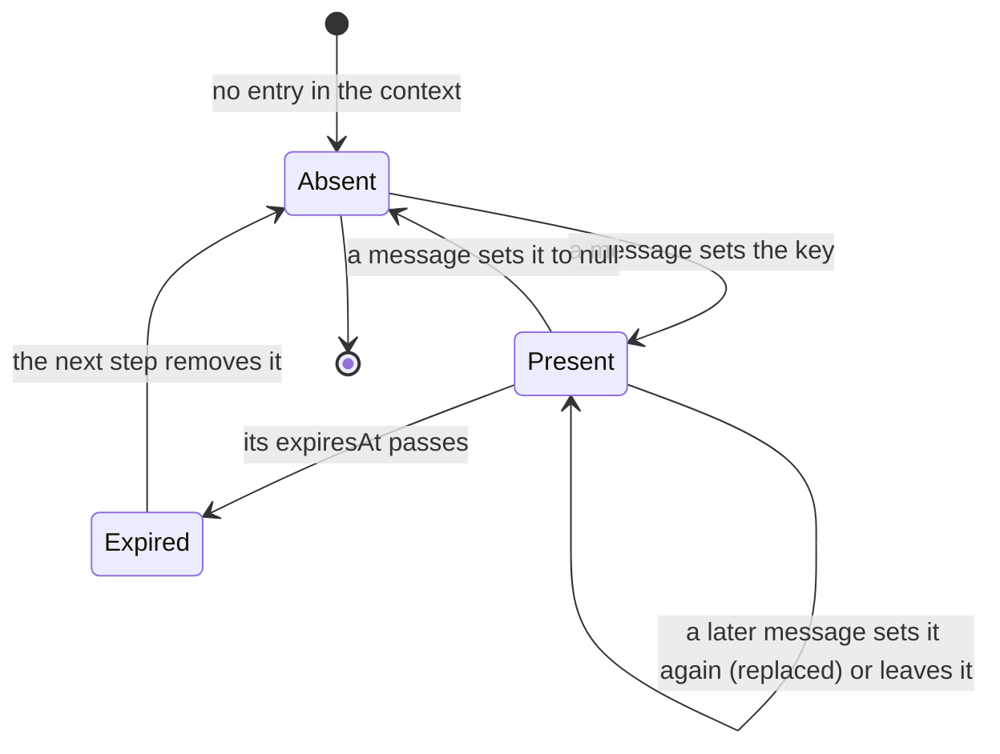

# adam-llm-agent

`LlmAgent`: a reusable, durable model/tool-calling loop on top of
`adam-runtime`.

## Where it sits

An `adam_runtime::Agent` implementation, written against the two ports it
needs: [`adam-model`](../adam-model/README.md) (`DynModel`) and
[`adam-runtime`](../adam-runtime/README.md). Every model call and every tool
call is a journaled `Ctx::step`, so a restarted worker replays what already
happened instead of repeating a side effect. An adam-rs agent is then
instructions + a model + a toolset. It is served over A2A by
[`adam-a2a-runtime`](../adam-a2a-runtime/README.md); the coder agent
([`adam-coder`](../../bin/adam-coder/README.md)) is built on it.

## API at a glance

| Item | What |
|---|---|
| `STOPPED_BY_THE_PERSON` | the error result a continued run gives a tool call that was still owed |
| `LlmAgent`, `LlmAgentBuilder` | `LlmAgent::builder(name, model, model_alias)` then `.instructions(..)`, `.tool(..)`, `.dyn_tool(..)`, `.limits(..)`, `.wait_poll(..)`, `.stream_text(..)` (on by default: see *Streamed text*), `.build()` |
| `LlmStarter` | the start-only half: `LlmStarter::new(name)` implements `adam_runtime::AgentStarter` with `State = Conversation`, needs no model or tools, and inits exactly like `LlmAgent` (same accepted payloads, same `unusable start message` rejection), and continues a prior run exactly like `LlmAgent` (see *Continuing a conversation*) |
| `Limits` | `max_turns`, `max_tool_calls`, `max_output_tokens`, `max_history_tokens`; a tripped limit fails the run with a message naming it (except history, which shortens old tool output) |
| `Tool` (trait), `DynTool` | `spec() -> ToolSpec`, `async call(&ToolCtx, Value) -> Result<ToolOutput, ToolError>` and the default methods `required_state() -> Vec<StateKey>` (none) and `asks_user() -> bool` (`false`: says the tool can end a call with `NeedsInput`, so `adam-assembly` keeps it out of subagents; `#[tool(asks_user)]` and `FnTool::asking_user()` set it) and `step_style() -> StepStyle` (how a call is drawn as a step: the default is a plain `tool` labelled with the tool's name; `#[tool(step = "subagent", label = "Hand to OpenCode", icon = "agent")]` sets it; a tool that wraps another must forward it, as `required_state` and `asks_user`; see *Steps*) |
| `ToolOutput` | `text`, `error`, `with_artifact`. A tool can return a **file** (`with_artifact(Artifact::file(..))`, [ADR 0012](../../docs/decisions/0012-files-as-a2a-artifacts.md)): the model is told only the tool's `content` (a line such as `Shared chart.svg (1.2 KiB, image/svg+xml).`), the bytes go to the run's artifacts and never into the history, the step's output or the run's final output. The loop keeps at most `MAX_RUN_FILE_BYTES` (6 MiB) of files per run: a file that would go over is not emitted and the result, marked as an error, says so. That check comes after the result is journaled, so a tool that may return several files it did not choose keeps its result within `ToolCtx::files_left()` (`adam_runtime::ReceivedFiles` does). `ArtifactRef` (what the state and the final output list) has `bytes: Option<u64>` for a file, absent otherwise and in state written before it existed. `announcing(text)` (the member `answer`) makes `text` **the run's answer**, see *Announced answers* |
| `StepStyle`, `StepEvent`, `StepKind`, `StepState`, `StepIcon`, `StepOutput` | `StepStyle::new(kind).with_label(..).with_icon(..)`; the others are `adam-runtime`'s, re-exported (see *Steps*) |
| `StepIo` | how a call's step reports its input and output: `StepIo::default().redact(\|text\| ..).input_max(n).output_max(n)`, or `StepIo::off()`; given to the builder with `step_io(..)` (see *Steps*) |
| `ToolCtx` | run id, conversation id, attempt, call id, `child_run_id()` (the id of the child this call starts), `start_child(agent, message)` (starts it on the runtime that steps the run), `root_run_id()` (the run whose work this one serves: the top of the chain of parents for a child run, the run itself otherwise), `with_root_run(id)` for tests, `step_id()` (`tool:<call id>`), `note()` (what the source that offered the tool said of it, `ToolNote`), `parent_step_id()` / `under_step(id)` (the step this call runs under; none for a call of the model's own), `report_step(StepEvent)` (a step that runs under this call's), `emit_progress` (an update of the call's own step, the text in its detail), `cancelled` / `cancel_token`, `state::<T>()` / `require_state::<T>()`, `context(key)` / `context_map()` (the run's inbound context, see *Context and tool sources*), `files_left()` (the bytes of files the run may still share: 6 MiB less what it kept, as the call began; the loop sets it with `with_files_left` for every call and poll, a detached context has the whole 6 MiB), and for tests `detached(..).with_state(..).with_context(..)` |
| `ToolError` | `Transient`, `Permanent`, `NeedsInput { question, ui }` (parks the run; A2A reports `input-required`; `ui` is an interface that comes with the question; build one with `ToolError::needs_input(q)` or `needs_input_with_ui(q, ui)`), `AwaitRun { run }` (the result is a child run's outcome; the run parks with a timer, A2A reports `working`), `AwaitRemote { task, timeout_ms }` (the result is the outcome of a task on another system, polled on the timer); `#[non_exhaustive]`, see *Errors* |
| `LlmAgentBuilder::state`, `try_build`, `tools` | `state(Arc<T>)` shares a value with the tools (one per type); `try_build() -> Result<LlmAgent, BuildError>` fails on a tool whose `required_state` was not given (`BuildError::MissingState`) or on two tools with one name (`BuildError::DuplicateTool`); `tools(ToolSet)` registers a group. `build()` is unchanged (last duplicate wins, no state check) |
| `State<T>`, `StateKey`, `Extensions` | a cheap `Arc` handle that derefs to `T`; the key of a state type; the typed map behind them |
| `ToolSet`, `tools!` | an ordered group of tools: `tools![Clock, Search::new()]`, `.extend(..)`, `.wrap(\|tool\| ..)` for middleware, `names()`, `get(..)` |
| `parse_args`, `IntoToolOutput`, `IntoToolResult`, `Json<T>` | read the model's arguments into a struct (a mistake is a `ToolOutput::error` for the model, never a panic; `null` reads as `{}`); return a `String`, `&'static str`, `Value`, `Json<T>` (compact JSON) or a `Result` of one with an error that is `Into<ToolError>` |
| `FnTool` | a tool from a closure: `FnTool::raw(name, description, schema, \|ctx, args\| async ..)`; with feature `schema`, `FnTool::builder(name).description(..).args::<A>().handler(..)` |
| `spec_for::<A>(name, description)`, `ToolSpecExt::for_args` | feature `schema`: the `ToolSpec` of a tool whose arguments are `A: JsonSchema` |
| `ToolError::from_classified(&e)` | a retryable `Classify` error becomes `Transient`, any other `Permanent`, with the whole source chain as the message |
| `__private` | feature `schema`, `#[doc(hidden)]`: the paths `#[tool]` generates code against (`serde`, `schemars`, `async_trait`, `spec_for`, `parse_args`, ...). Not API: it changes with the macro |
| `ToolSource`, `DynToolSource`, `SourceCtx`, `LlmAgentBuilder::tool_source`, `MAX_SOURCE_TOOLS` | tools the agent learns about while it runs: a source lists its tools at every model turn (`specs(&SourceCtx)`, or `listing` for the tools **and their notes**), may rewrite how the tools of that turn are described (`refine(&SourceCtx, &mut [ToolSpec])`, default: nothing), may add words to the agent's instructions for the turn (`instructions(&SourceCtx) -> Option<String>`, default: nothing) and answers the calls to them (`call(&ToolCtx, name, args) -> Option<..>`), see *Context and tool sources* |
| `Listing`, `ToolNote`, `Conversation::source_notes` | what a source says about a tool it lists: the system behind it **reports each call as a step itself** (`reports_step`, so the agent reports none), how long a call may run (`timeout_ms`) and what its step is called (`label`); kept in the run's state with the model's answer, so a later call, on another worker, reads it without listing again |
| `Conversation::context`, `merge_context`, `drop_expired_context`, `MAX_CONTEXT_BYTES` | what the messages of the run say about their sender, merged key by key (`null` deletes), bounded, with expiring entries; see *Context and tool sources* |
| `Conversation`, `PendingWait`, `PendingQuestion`, `PendingRun`, `PendingRemote`, `ArtifactRef` | what `Runtime::view(run).state` deserializes into; `PendingQuestion::ui` is the interface that came with the question (absent when there is none, and in state stored before it existed); `Conversation::pending_wait` is the question, the child run or the remote task the parked run waits for (it was `pending_question`, and state stored under that name still loads); `Conversation::continued_from` is the run a continued run carries on, and `Conversation::omitted_turns` how many turns of earlier conversation were left out to meet the cap (both absent otherwise, and in state stored before they existed), `Conversation::root_run` the top of a child run's parent chain (absent for a run that is nobody's child, and in state stored before it existed) |
| `Conversation::continued(&self, text, from: RunId)`, `LlmAgent::init_continuing`, `LlmStarter::init_continuing` | the conversation of a new run that carries on this one with one more user message; what is carried, dropped and reset is in *Continuing a conversation* |
| `Conversation::is_omission_marker(message, part)` | whether that text part is the marker (the second part of the first message while `omitted_turns` is not zero), so a rule that reads what the user said skips exactly it: the coder's `person_texts` |
| `MAX_CARRIED_BYTES`, `OMITTED_MARKER_PREFIX` | the cap on the history a continuation carries (256 KiB of JSON), and the prefix of the marker text part that stands in for the turns dropped to fit it |
| `Tool::poll_remote`, `RemotePoll` | how a tool that returned `AwaitRemote` answers "how does the task stand": `Ready(ToolOutput)` or `Working`; the default refuses |
| `DEFAULT_WAIT_POLL` | 60 s: how long a run waiting for a child sleeps before it reads the child itself |
| `user_message(text)`, `MESSAGE_KIND` | build the `Inbound` that starts or continues a run |
| `TRUNCATION_MARKER_PREFIX` | prefix of the marker left where history truncation shortened a tool output |

```rust
use std::sync::Arc;
use adam_llm_agent::{Limits, LlmAgent};
use adam_model::MockModel;

let agent = LlmAgent::builder("assistant", Arc::new(MockModel::new()), "my-model")
    .instructions("Be brief.")
    .limits(Limits { max_turns: 10, ..Limits::default() })
    .build();
// register it: Runtime::builder(store).agent(agent).build()
// start a run: runtime.start("assistant", user_message("hello"), None)
```

A process that only accepts requests registers `LlmStarter::new("assistant")`
with `RuntimeBuilder::starter` instead, and a worker with the `LlmAgent`
steps the runs (see *Starting without stepping* in
[`adam-runtime`](../adam-runtime/README.md)).

A complete `Tool` implementation, and one using the typed helpers, are in the crate docs
(`src/lib.rs`). The `#[tool]` macro that generates such a tool from a function is in
[`adam-macros`](../adam-macros/README.md), used through the [`adam`](../adam/README.md) facade (part of
[the authoring layer](../../docs/reference/agent-files.md)).

### Shared state

```rust
// a tool: `let db = ctx.require_state::<Db>()?;` and, in `impl Tool`,
//         `fn required_state(&self) -> Vec<StateKey> { vec![StateKey::of::<Db>()] }`
let agent = LlmAgent::builder("assistant", model, "my-model")
    .state(Arc::new(db))          // one value per type
    .tools(tools![Lookup])
    .try_build()?;                // Err(BuildError::MissingState { .. }) at startup, not mid-run
```

`Tool::required_state` returns a `Vec` and not a `&'static [StateKey]`: `TypeId::of` is not `const` on
stable, so a static slice cannot be built. It is only called when the agent is built.

### Argument schemas

With the `schema` feature, `spec_for::<Args>("name", "description")` derives `parameters` from
`schemars::JsonSchema` (schemars 1.x): draft 2020-12, subschemas inlined, no `$schema`, no `title`
(a property that is *called* `title` stays), and an object schema always has `properties`. Doc comments
become descriptions and `Option<T>` fields are not required. The feature also enables schemars' `derive`, so
`#[derive(JsonSchema)]` works for whoever depends on it, and it is what `#[tool(crate = ::adam_llm_agent)]`
needs from a crate that does not use the `adam` facade.

## Continuing a conversation

When the runtime starts a run as the continuation of another (`Runtime::start_with_id_continuing`; over A2A,
a new task whose message references a finished one), `LlmAgent::init_continuing` and
`LlmStarter::init_continuing` (both `Conversation::continued`, so a front and a worker cannot disagree) give it
the conversation of the run before:

| | |
|---|---|
| **Carried** | the history, oldest first, and the user messages that were waiting behind an owed tool result (`deferred`), in arrival order; then the new user message |
| **Answered** | the tool calls of a last assistant message that did not all get a result: a run that ended mid-turn (a cancel, a limit, a question nobody answered) leaves them, and a provider rejects a call without a result. Each owed call gets an error result, `STOPPED_BY_THE_PERSON`, after the results that did arrive: the model keeps what it asked for and is told which calls did not finish. The run state cannot tell a cancel from another ending, so a run that failed gets the same text. So `pending_calls` and `pending_wait` are always empty: a continued run never answers a question or a child run of the run before, and never runs a stopped call. The side effects of the calls are not undone |
| **Reset** | `turns`, `tool_calls`, `usage` and `usage_totals` (`Limits` are per run, and a new task counts its tokens afresh), `root_run` and `root_step`, and `artifacts` (the final output lists what this run produced) |
| **Recorded** | `continued_from: Option<RunId>`, not written while `None`; `omitted_turns: u32`, not written while zero |
| **Bounded** | over `MAX_CARRIED_BYTES` (256 KiB of JSON), in this order and only as far as needed: **(1) the tool outputs of the turns older than the newest are shortened**, oldest first, each keeping its head and ending in the `TRUNCATION_MARKER_PREFIX` marker (the same truncation `max_history_tokens` does when a history is sent); **(2) whole old turns are dropped** (a turn is a user message and what follows it up to the next), one marker standing in for them; **(3) the newest prior turn's tool outputs are shortened, last**. Never dropped: **the first user message of the chain** (the task; kept verbatim as the first text part of the first message) and the **newest prior turn**. A newest turn whose own text is over the cap is carried over it. The waiting messages and the new one are counted, never cut |
| **The marker** | the **second text part of the first user message**, starting with `OMITTED_MARKER_PREFIX` and naming the number of turns; `omitted_turns` (not the text) is what says the part is a marker, so a user message that merely starts with the prefix is an ordinary one. It is always the second part: before anything is dropped, a first message that has several parts (`[task, next]`, from a run that ended before the model answered) is reduced to its task, and the rest becomes a user message of its own (a turn like any other), then merged behind the marker. A rule that reads what the user said should read user messages part by part and skip that part (`Conversation::is_omission_marker`) |
| **Alternating** | user messages that would be adjacent become one message with several text parts (the marker and what follows it, the new message after a history that ends with the user's, the waiting ones before the new one), because chat templates that insist on alternating roles reject two user messages in a row |

The cap is not "history the model would be cut anyway": `max_history_tokens` (`src/history.rs`) only ever
shortens tool output in what is sent, so shortening tool output first is the loss the loop already accepts, and
dropping turns is the last resort. The cap is about what is stored and carried. **An agent that wraps an
`LlmAgent` and delegates `init` must delegate `init_continuing` too.** Breaking for code that builds a
`Conversation` with a struct literal (two new public fields) and for `AgentStarter` implementors (`State` now
needs `DeserializeOwned`), see the ADR's *Consequences*. The decision is
[ADR 0003](../../docs/decisions/0003-a-new-task-continues-the-task-it-references.md).

## Context and tool sources

Two ways for a run to learn something its code did not know when it was built, both fed by the **inbound
messages**.

**The context.** A message may carry `{"text": "...", "context": {...}}`: the object under `context` is merged,
key by key, into `Conversation::context` when the run reads the message (the start message, every message
delivered later, and the answer to a question). A key a message sets replaces the one before, a key set to `null`
deletes it, a message without `context` changes nothing. Tools read it with `ToolCtx::context(key)`. What it holds
is the sender's own account of itself, so a tool treats it as input; an A2A server fills it from the extensions a
message carries (`adam-a2a-runtime`'s `vymalo_inbound`). The context is part of the durable state, so a restart or a
change of worker keeps it, and a run that continues another starts with the one before
(`Conversation::continued`; the new message's keys then win). Two bounds: the whole context is at most
`MAX_CONTEXT_BYTES` (256 KiB of JSON; a message that would take it over has its context dropped, with a warning,
and is still read for its text), and **an entry that is an object with an `expiresAt` (RFC 3339) is removed once
that time has passed**, at the start of the next step (`drop_expired_context`): a credential the sender put there
does not stay in the store after it stops working. (A run parked for hours still holds it until it next steps.)

**The question's interface.** `ToolError::NeedsInput { question, ui }` may carry an interface, an array of A2UI
messages; it is kept with the question in `PendingQuestion::ui` (`/pending_wait/ui` in the stored state), where an
A2A server reads it to send it beside the question in the `input-required` status. The agent does not look inside
it.

**Tool sources.** A `Tool` has one fixed spec; a `ToolSource` lists its tools anew for every model call and answers
the calls to them:



The sources are read inside the step of the model call, so a replay of a turn whose answer is recorded reads
nothing and the journal has no new entries: only the answer is recorded, not the tools it was given. A listed tool
whose name an own tool or an earlier source has is left out, with a warning (the agent's own tools win), **unless the source
says it expects the repeat** (`ToolSource::expects_repeat(name, taken)`, default `false`: it offers whatever the system behind it
has, among which a tool the agent already owns): the omission is then a debug line, not a warning at every model turn
(`adam-ui`'s thread-tools source says so for a relayed `<server>__<tool>`, the web search a conversation attaches that the agent's own
`mcp.json` names too; any other clash still warns). At most
`MAX_SOURCE_TOOLS` (64) are offered, and an agent with no source behaves exactly as before. A source's tool may ask
the person and wait for a child run, but not wait on a remote task (`AwaitRemote` is answered with an error result:
the agent polls the tool that started the task, and a source's tool is not known then).

A source can also **refine** the description of the tools the model is about to be shown (`ToolSource::refine`): after
every source has listed, each gets the turn's tools, the agent's own first, and may rewrite a `description` from what it
knows of this run (what the screen of this conversation can draw, for the tool that draws on it). It runs in the same
journaled step as the listing, so a replay reads nothing, and it is for text the model reads: names and schemas are the
tools' own, and a source that cannot tell leaves the descriptions as they are (`adam-ui` uses it for `show`).

**Notes and instructions.** A source lists with `listing` (the default is `specs` and no notes) to say more than a spec
holds: a `ToolNote { tool, reports_step, timeout_ms, label }` for a tool whose system **reports each call as a step itself**
(the orchestration layer's relayed tools and `ask_agent`), for one that says how long a call may run and for one that has a
human title (`label`, `ToolNote::with_label`: what the step of a call of a *source's* tool is called, from the first report to the last; an agent's own tool says it with `step_style`). The notes of the
turn's listing (those of the tools that were kept, and only the ones that say something) are recorded with the model's
answer in the journal and written to `Conversation::source_notes`, replaced at every model call, because the calls to make
are the ones that turn asked for: a call made in a later transition, by another worker or after a restart, sees them
without listing again, and `ToolCtx::note()` hands the call its own. **A call of a tool whose note says `reports_step`
gets no step of the agent's** (no start, no end, no waiting report; the result still goes to the model); a call of any
other tool, and any call of an agent's own tool, has its step as before, and state written before the notes existed has
none. A source can also add words to the instructions of the turn (`ToolSource::instructions`, read in the same
journaled step as the listing): they follow the agent's own instructions after a blank line, and a source with nothing to
say changes nothing (`adam-ui` adds the "Mentioned agents" block that way, only when the run's context has mentions).



## Steps

Every tool call is a **step** ([`RunEvent::Step`](../adam-runtime/README.md#steps), the vocabulary of the orchestration
layer's `steps/v1`; [ADR 0007](../../docs/decisions/0007-progress-as-steps-and-streamed-text.md)). The agent reports the
step `tool:<call id>` as `running` before the tool runs and, after it, `completed` (a result), `failed` (an error
result, a `Permanent` error, an unknown tool, or a `Transient` failure the run retries) or `waiting` (the tool asked
the person with `NeedsInput`, or the run parked on a child run or a remote task); a `waiting` step ends when the
answer, the child's outcome or the remote task's result arrives (`completed`, or `failed` for an error result). The
step's `detail` never holds a tool's result: it is a short line shown with the label.

The result and the arguments have members of their own ([ADR 0011](../../docs/decisions/0011-a-tool-calls-step-carries-its-input-and-output.md)):
the `running` report carries the call's arguments as `input`, and the report that ends the step carries what the tool
answered, or the error it ended with, as `output` (`{text, truncated?, bytes?, error?}`), so that a screen can open a step
and show "params, then output". The agent's [`StepIo`](src/step_io.rs) says how:

```rust
let agent = LlmAgent::builder("assistant", model, "alias")
    .step_io(StepIo::default().redact(move |text| redactor.scrub(text)))   // every string, before the cut
    .tool(my_tool)
    .build();
```

Redaction comes first (every string of the arguments, every key, and the result, so a cut cannot leave half a secret),
then the contract's bounds (4 KiB of input, 8 KiB of output keeping head and tail; `input_max` and `output_max` lower
them, never raise them). The default sends both with no redactor, so **an agent that holds secrets sets one**;
`StepIo::off()` sends neither. What the model is told is not touched: the copy for the observer is the cut one. A tool that
says how it is called (`Tool::step_style`'s label) is labelled so in the step; an MCP tool's `title` is its label
(`adam-mcp`). **Give every tool a label**: a step called `edit_file` is a name for the model, not a word for the person
([ADR 0027](../../docs/decisions/0027-every-tool-has-a-title-for-its-step.md)).

A tool chooses how its call is drawn with `Tool::step_style` (`StepStyle { kind, label, icon }`; the default is kind
`tool`, the tool's name as the label, no icon) and says more while it runs:

```rust
#[tool(step = "subagent", label = "Hand to OpenCode", icon = "agent")] // or `fn step_style` by hand
async fn delegate(ctx: &ToolCtx, task: String) -> Result<String, ToolError> {
    ctx.emit_progress("starting OpenCode").await;               // an update of the call's own step
    ctx.report_step(
        StepEvent::new(format!("acp:{}:1", ctx.call_id()), StepKind::Command, "npm test", StepState::Running)
            .with_icon(StepIcon::Execute),                       // runs under the call's step
    )
    .await;
    // ... and later the same id in `Failed`/`Completed`, with `.with_detail("1 failed")`
    Ok("done".into())
}
```

`report_step` puts the step under the call's own (`ToolCtx::step_id()`) unless it says `.under(id)` another step the
call reported; ids must be unique within the run, so put the call id in them. A step the call leaves open when it
returns is closed by whoever shows the tree. These replace the `Custom` events `tool_start` and `tool_end` and
the `Progress` of `emit_progress` that earlier versions emitted (a breaking change of the events, ADR 0007):
`tool_end`'s `ok` is `completed`, `error` and `transient_error` are `failed`, `needs_input` and `waiting` are `waiting`.
`adam-a2a-runtime` serves steps to a client that activated `steps/v1` and as lines of text to one that did not.

## Usage

Every model call that completes (the provider answered, with or without usage) is reported as `RunEvent::Usage`
([ADR 0032](../../docs/decisions/0032-usage-per-model-call.md)): its tokens (`Usage::accounted`, so a part the provider
counted beside a smaller total is added in), the alias as `model`, and the provider and context window the model client says
(`ModelClient::provider`, `ModelClient::context_window(alias)`). Zeros for a provider that said nothing.

| | |
|---|---|
| **The id** | `<run id>-c<turn>-<8 hex digits>`, made inside the journaled step `model:<turn>` and recorded with the answer (the record's `call` member, beside `stream`): a replay of the entry reports the call under the same id, and a call made again (a transient retry starts at a fresh journal position; a crash before the journal write runs the call again) is another id. A journal written before this reports under `<run id>-c<turn>`. At most 57 bytes, unique within the task: a child's ids carry the child's run id |
| **Where** | an event of the **root** run (`Conversation::root_run`, the run itself when it is nobody's child), sent with `Emitter::emit_for`, so the task's client hears a subagent's calls; a child's report names `Conversation::root_step`, the root's `tool:<call id>` that started the chain (`ToolCtx::start_child` puts it in the child's first message, and a child hands it down); the agent's own calls name none |
| **The totals** | `Conversation::usage_totals` (`adam_runtime::UsageTotals`): one entry per provider and model, every call this run made and, when a child answers (its message or `Ctx::child_status`), the child's own totals read with `Ctx::child_state`. Durable with the state: a run taken up again after a question goes on from them. `Conversation::usage` stays this run's own calls |
| **Not counted** | a call of a try that failed transiently and was tried again is reported live, but its try's state is abandoned, so it is not in the totals; a call of a turn that a cancel ended likewise; a remote (`a2a:`) subagent's calls are its own agent's; OpenCode over ACP reports no tokens (`adam-coder`) |

## Reasoning

A model in thinking mode writes its reasoning before its answer ([ADR 0020](../../docs/decisions/0020-reasoning-is-streamed-beside-the-answer-and-never-stored.md)).
The streamed model step sends it as `RunEvent::ReasoningDelta` events, in **a stream of its own** (`<run id>-r<turn>-<8 hex digits>`,
pieces cut as the words' are), which opens on the first reasoning that is not blank and **ends (`last`) when the words, a tool call or the
end of the answer begin**, so it is over before the words of its turn are sent (`abandoned` when the model failed). With
`stream_text(false)` the reasoning of the whole answer is said, in pieces, before its words. It is **not part of the answer**:

* the step drops it from the response before the journal records it, so it is in no journal, no run state, no output text, no
  `turn_output` and no step output, and a replay sends none (the exception is a model client set to echo reasoning, which keeps it in
  the assistant message itself, so the history holds it: `MODEL_ECHO_REASONING`);
* no later request carries it (`tests/streaming.rs`, `reasoning_is_never_in_a_later_request`);
* how much a turn reasoned is one `DEBUG` line with `reasoning_chars`, never the text, and nothing at `INFO`.

## Streamed text

A model turn is **streamed** by default ([`LlmAgentBuilder::stream_text`](src/agent.rs), [ADR 0007](../../docs/decisions/0007-progress-as-steps-and-streamed-text.md)):
the journaled step `model:<turn>` calls `ModelClient::stream` instead of `complete`, and while the model writes it sends what
it has written as `RunEvent::TextDelta` events (see [`adam-runtime`](../adam-runtime/README.md#streamed-text)); the turn's
outcome is the assembled response, so the history, the tools and the run's outcome are what they were. `stream_text(false)`
asks for `complete` as before (for a model client that cannot stream, or a provider that refuses `stream: true`).

* **Pieces.** What the client of the model yields is cut into pieces: one goes out when 200 bytes have gathered or 100 ms
  have passed since the last one, whichever comes first (the first at once, a timer for the last words of a quiet model),
  never more than `MAX_TEXT_DELTA_BYTES`. A stream opens on the first word that is not blank and ends with a piece marked
  `last` (empty when everything had gone). The offsets are UTF-8 bytes of the whole text.
* **The stream's id** is `<run id>-m<turn>-<8 hex digits>`, made inside the step and **recorded with the answer** (the journal
  entry is `{message, finish, usage, stream}`; a journal written before this, a bare response, reads as one with no stream),
  so a replay calls no model and sends no piece but names the same stream. A retried turn is another stream.
* **A failure is the call's failure**: an error before the first byte or in the middle of the answer is the same
  `ModelFailure` as a failed `complete` (same retry, same message), and an open stream first ends with `abandoned: true`.
* **What says the words whole**: for a turn that goes on to call tools, the `agent_text` event carries `stream`; the answer that
  ends the run names its stream in the run's **output** (`{"text": .., "artifacts": .., "stream": ..}`). A turn that did
  not stream has neither. An agent that turns the answer into a question to the person (the coder does, for a reply that
  delivers nothing) puts the stream in `PendingQuestion::stream`, so the `input-required` status that carries the question
  says which stream its text was.

## Messages sent while the run works

A message delivered to a run while it steps (`steer/v1` on the A2A side, [ADR 0016](../../docs/decisions/0016-a-message-sent-to-a-working-task-is-steered-into-it.md))
is read at **the run's next step**: every `step` drains the inbox first and puts each user text in the history, behind the
result of a tool call that is still owed (`deferred`, as before), so the model reads it at its next turn and never in the
middle of a call. What is new is the end of the run:

* **A final answer is not the last word while a message is unread.** After the model answers with no tool call, the step asks
  the runtime whether a message arrived meanwhile (`Ctx::arrived`). If one did, the answer is kept in the history and said as
  the words of a turn that goes on (`agent_text` with its stream's id), the step returns `Continue`, and the next one reads the
  message and calls the model again: the answer to a message sent during the final model call reflects it. **The window between
  that check and the commit** is closed by the runtime: the agent calls `Ctx::reopen_on_arrival()` in every step, so a `Done`
  committed past a message that arrived after the check becomes a `Continue` (see `adam-runtime`).
* **An answer recorded before a message the run read is dropped.** The recorded model step carries `seen`, how long the history
  was when the call was made (`Recorded`, a serde default: a journal written before it reads as "current"). A transition that
  replays the step (the commit that followed the recording was lost) and has read a message that came in between sees a longer
  history, drops the stale answer (its text is not said, it is not kept) and calls the model again with the message in front.
  An answer that asks for tool calls is not dropped: the calls are valid, and the next turn reads the message.
* **A message is read once.** `Conversation::read_ids` keeps the ids (`Inbound::id`, an A2A `messageId`) of the last
  `MAX_READ_IDS` (128) messages the run has read, oldest first, and a message whose id is there is ignored, whether it is
  still in the inbox or was read transitions ago: the orchestration layer repeats a steer after a lost lease. An empty id is
  never remembered. Part of the durable state (serde default, not written while empty); a run that continues another starts
  with none.

## Cancel

`Runtime::cancel` fails the run and fires the step's `CancelToken`. The model call listens to it: the journaled step
`model:<turn>` races the token against `complete` (or against `ModelClient::stream` and every item of its answer, a model that
goes quiet in the middle included) and **drops the request** when it fires, so a cancel does not wait for the provider. A
stream that was open ends with `abandoned: true` and what had been written. The turn is then over: nothing the model said is
acted on, said whole or kept, and the calls of the turn that are still owed do not start (a tool that does not listen to the
token still ends by itself; the next call is not made). The run is already `Failed` (`cancelled: <reason>`) in the store, so the
worker drops the result of the step. A run that continues a cancelled one reads its history as *Answered* above.

## Announced answers

A tool can say "this is my answer" before the model is done: `ToolOutput::announcing(text)` (the member `answer: Option<String>`,
absent from a journal written before it and not written while `None`). It is for a tool that hands the final answer over by
another route, so that a client that reads only the run's output reads what the person was shown. `adam-ui` uses it for the
thread tool `turn_output` ([ADR 0014](../../docs/decisions/0014-a-turn-output-answer-is-the-runs-answer.md)).

* The loop keeps the words in `Conversation::announced` (journaled with the call's result, so a replay announces the same
  words and the tool is not called again). **The last announcement wins.** A result that is an error announces nothing, whatever
  its `answer` says (a call the endpoint refused changes nothing), and the same goes for a result marked as an error because a
  file was refused.
* When the run ends (a model turn with no tool call), the output is `{"text": <the announcement>, "artifacts": ..}` and so is
  the text of the A2A `completed` status. It names **no `stream`** and is never `truncated`: it is not the words the model
  streamed. The closing words are still said, as `agent_text` with the `stream` they were sent as, so the orchestration layer
  files them as working text.
* **A tool can end the turn with its announcement** (`ToolOutput::final_answer(text)`, which also sets `ToolOutput::ends_turn`;
  `Conversation::announced_final`, serde defaults both). Once the calls the model asked for in that turn are answered, the
  run finishes with `{"text": <the announcement>, "artifacts": ..}` and **calls no model**, so no closing words follow an answer
  that was already handed over (`adam-ui`'s `turn_output` does this, [ADR 0014](../../docs/decisions/0014-a-turn-output-answer-is-the-runs-answer.md),
  amended 2026-10-04). A message that reached the run meanwhile (`Ctx::arrived`, or one deferred behind the owed calls) is read
  first: the flag is dropped and the model is called with it. An error result ends nothing. Without it, the closing words
  follow as before. Adding a field to `ToolOutput` breaks a struct literal of it: build one with the constructors.
* **A message that reaches the run ends the turn** and clears the announcement (the person's answer to a question, a message
  that arrives while the run is going): what was announced is the answer of the turn before. A run that continues another
  starts with none.
* With no tool announcing anything, nothing changes: the closing words are the answer, with their `stream`.

## Child runs

A tool that delegates returns `Err(ToolError::AwaitRun { run })` after starting the child:

```rust
// the child's id is derived from this call, so a replay finds the child it started
let child = ctx.start_child("coder/reviewer", &message).await?;
Err(ToolError::AwaitRun { run: child })
```

The error is journaled, the agent records `PendingWait::Run` in the conversation and parks with a timer
(`wait_poll`, 60 s). When the child finishes the runtime sends `adam.run.finished` and the parent wakes at once
and answers the call; if that message is lost, the timer wakes the parent and it reads the child. The answer is the
child's `output.text` (or its output as JSON); a child that failed, was cancelled or was purged gives an error
result (`the run failed: ..`) and the run goes on. The message is matched to the wait by the child's run id, so
copies and strays are dropped; user messages that arrive meanwhile queue behind the result. Cancelling the parent
does not cancel the child. Events: `awaiting_run`, the call's step `waiting`, then the step's end
(`completed` or `failed`). The design and the failure interleavings are in
[`docs/reference/child-runs.md`](../../docs/reference/child-runs.md#failure-interleavings).

The tool needs no `Runtime` of its own: `ToolCtx::start_child(agent, message)` starts the child on the runtime
that is stepping the run (through `Ctx::child_starter()`, whose only possible parent is this run), under
`child_run_id()`, and is idempotent. The agent must be registered on that runtime. A context made by
`ToolCtx::detached` belongs to no runtime and refuses (`Permanent`). This is what `adam-assembly`'s
`SubagentTool` does. **The root run.** The child's first message carries the id of the run the starting call serves
(`ToolCtx::root_run_id()` of the caller: the caller's own run when it is nobody's child, else the root it was given),
and the child keeps it in its stored state (`Conversation::root_run`), so `ToolCtx::root_run_id()` in a child of a
child is the top run, after a restart and on another worker, with no store read per call. A tool that keeps a
workspace or a budget for the whole task keys it by the root. Only code in the process writes the key: the A2A front
builds payloads of `text` and `context`, and a run that continues another does not inherit it. (`tests/root_run.rs` is
the chain of three runs; `tests/child_runs.rs` starts children with a `Runtime` it holds, which works too.)

## Remote tasks

A tool that starts a task on another system (an A2A agent, a job queue) and cannot wait for it inside one call
returns `Err(ToolError::AwaitRemote { task, timeout_ms })` from the step that started it, and implements
`Tool::poll_remote`:

```rust
async fn call(&self, ctx: &ToolCtx, args: Value) -> Result<ToolOutput, ToolError> {
    // start it, idempotently: key the request by ctx.call_id() or ctx.child_run_id()
    let task = start(ctx.child_run_id().to_string(), &args).await?;
    Err(ToolError::AwaitRemote { task, timeout_ms: Some(3_600_000) })
}

async fn poll_remote(&self, ctx: &ToolCtx, task: &str) -> Result<RemotePoll, ToolError> {
    Ok(match look(task).await? {
        Some(result) => RemotePoll::Ready(result), // becomes the tool result
        None => RemotePoll::Working,               // ask again after the next interval
    })
}
```

The agent records `PendingWait::Remote` (`{call_id, tool, task, deadline}`) and parks with the `wait_poll`
timer. Nothing tells it the task is over, so each time the timer fires it calls `poll_remote` in a journaled
step named `poll:<call id>`: a replay sees the recorded answer and never asks the tool twice for one wake.
`Ready` is the result (an error result if `is_error`); `Err(Transient)` fails the wake and retries it;
`Err(Permanent)` is an error result. With a `timeout_ms` the call is answered with an error result once the
wait is older (by the journaled clock) and the tool is not asked again. `task` is stored in the run's state:
put no secret in it. The tool is looked up by the name in the wait, so a definition that lost the tool answers
the call with an error result. A user message that arrives meanwhile wakes the run for one look and queues
behind the result. Events: `awaiting_remote`, the call's step `waiting`, then the step's end (`completed` or `failed`).
Cancelling the run does not cancel the remote task. This is what `adam-assembly`'s remote subagents do; the
design is in [`docs/reference/child-runs.md`](../../docs/reference/child-runs.md#remote-tasks-the-same-wait-without-a-message).

## Errors

`ToolError` implements `adam_error::Classify` (see
[`adam-error`](../adam-error/README.md)).

| `ToolError` | Class | The run |
|---|---|---|
| `Transient` | `Transient` | the step fails with `AgentError::Transient`; the runtime retries with backoff |
| `Permanent` | `Invalid` | the model is told, and can go on |
| `NeedsInput` | `Rejected` | valid, but it needs the user first: the run parks |
| `AwaitRun` | `Rejected` | valid, but it needs a child run first: the run parks with a timer |
| `AwaitRemote` | `Rejected` | valid, but it needs a remote task first: the run parks with a timer and polls |

`ToolError` is journaled, so its serde shape is frozen and it carries no
`source`: a tool flattens its own cause into the message (with
`adam_error::report`) before it returns.

Model failures are classified by `adam_model::ModelError` and journaled as a
record of `retryable`, the flattened message (`report`, so the chain is printed
once), `retry_after_ms` and the `class` name (records written before classes
existed decode with `class` absent). A retryable one becomes
`AgentError::Transient`, with `with_retry_after` when the provider sent a
`Retry-After`, so the retry waits at least that long; any other fails the run
with `model call failed: ...`. An unreadable start message is
`AgentError::Permanent` (`unusable start message: ...`), which A2A reports as
invalid params.

## Features and environment

| Feature | Default | What |
|---|---|---|
| `schema` | off | `schemars` 1.x as a dependency: `spec_for`, `ToolSpecExt`, `FnTool::builder`. Everything else in *API at a glance* is always available |

No environment variables.

## Tests

`tests/steer.rs`: a message sent while a tool runs is the first thing the model reads after the tool's result; **a message sent
during the final model call is answered** (a second model turn whose request has the first answer and the message after it,
the run's answer the second one); no message, no extra turn; the same message sent three times is read once and another
message is read; a recorded answer that predates a message read in the next transition is dropped and not said; a journal
from before `seen` reads as current; state from before `read_ids` loads. Memory always, PostgreSQL when
`ADAM_TEST_POSTGRES_URL` is set; models and tools are held at gates, nothing sleeps. `src/conversation.rs` bounds the ids.

`tests/usage.rs`: one report per completed call with its tokens, alias, provider and window, and the totals; a call without
usage reported with zeros; **a subagent's calls (and its own child's) reported on the root's task under the root's step**,
none on the children's runs, and the root's totals holding all of them per provider and model; a replayed call reported
under the id its record holds (and a journal from before, under the run and the turn); a call made again after a transient
failure reported under another id, and only the kept try's call in the totals. `src/agent.rs` pins the record's `call` member.

`tests/child_runs.rs` is the child-run suite (one case per failure interleaving, see *Child runs*), run against
`MemoryStore` always, against PostgreSQL when `ADAM_TEST_POSTGRES_URL` is set and against MongoDB when
`ADAM_TEST_MONGODB_URI` is set; it never sleeps for a fixed time (gates, a `ManualClock`, `FaultyStore::fail_run`).
The old `Conversation` JSON with `pending_question` is a literal in `src/conversation.rs`
(`a_state_stored_as_pending_question_still_loads`) and the old `ToolError` shapes are literals in `src/tool.rs`
(`journals_written_before_await_run_still_decode`).

`tests/announced_answer.rs` is the suite of *Announced answers* (real `Runtime`, scripted `MockModel`, `MemoryStore`): an
announced answer is the run's output and the closing line is not, the last of several wins (in one message and across
turns), a refused call changes nothing (and one after an announcement keeps it), no announcement leaves the closing words as
the answer with their stream, a replay after a crash inside the next tool keeps the announced answer and does not call the
tool again, a message that reaches the run clears it, a final answer ends the turn with no model call after it (and the calls
of its model message are all answered first, and a refused one ends nothing), and the serde shapes of older journals.

`tests/context_and_sources.rs` is the suite of *Context and tool sources* (real `Runtime`, scripted `MockModel`, `MemoryStore`):
the context of the start message reaching a tool, replace/delete/keep across messages, a continued run carrying the
context (and the new message winning), the expiry, the size bound, state stored before the context existed, a question
that keeps its interface and the frozen shapes of old journals, a source read at every turn (a tool offered since the
last turn is there), an own tool winning a clash, the limit of offered tools, an unknown name, a source's tool that asks the person, and, with a store that loses the
acknowledgement of a write (`FaultyStore`), the replays: a model step that was recorded neither calls the model nor
reads the sources again, a source's tool that was recorded is not called again, and a source's tool that waits on a
remote task ends as an error result.

`tests/source_notes.rs` is the suite of the notes (real `Runtime`, scripted `MockModel`, `MemoryStore`, a `CollectingSink`
for the events): a tool whose system reports its steps gets none of the agent's and the other tools do, the note reaches the
call and is the one written to the state, an own tool wins the name and keeps its step, a source with no notes changes
nothing, a step retried after a transient failure sees the same run, call id and note and still reports none, instructions
added by a source after the agent's own (and not when it has none to add), and the shapes of older state.

`tests/streaming.rs` is the suite of *Streamed text* (real `Runtime`, `MemoryStore`, a scripted stream): the pieces add up to the answer and
each begins where the one before ended in UTF-8 bytes, a long answer is cut into pieces of a bounded size, the words before a
tool call are a stream of their own and the answer another (named by the run's output), a turn with no words opens no
stream, `stream_text(false)` calls `complete` and says nothing of streams, a model that fails in the middle fails the run
exactly as a failed `complete` does and ends its stream abandoned, a transient failure is retried as another stream, and a
replayed journal (the new record, and a bare response from before streaming) calls no model, sends no piece and says the
same words. `src/text_stream.rs` tests the coalescing (pure, with the time passed in) and the timer (a model that goes
quiet: what waits is sent when the interval is over); a stream takes about a second there, because it does not fake the clock.

`tests/remote_tasks.rs` is the remote-task suite (`MemoryStore`, and PostgreSQL when `ADAM_TEST_POSTGRES_URL` is
set): polling on the moved clock until `Ready` with one start, a new process that polls on without starting,
a failed result, permanent and transient poll errors, the timeout, a tool that cannot be polled, and a user
message queueing behind the result. The shapes of `AwaitRemote` and of the wait are literals in `src/tool.rs`
and `src/conversation.rs`.

The continuation is tested in `src/conversation.rs` (what is carried, dropped and reset; tool outputs of old turns shortened
before any turn is dropped and the newest turn's last; a huge single turn keeping the task through two continuations;
a two-part first message keeping the marker second across two dropping continuations; the first user message
surviving a long chain under a small cap; markers counted by `omitted_turns` and never stacked or forged by a
message that starts like one; the newest prior turn protected with waiting messages present; the roles
alternating in each shape a continuation can take; state stored before `continued_from` and `omitted_turns`
existed still loads), in `src/history.rs` (`shorten_output`) and in `tests/llm_agent.rs`
(`a_starter_continues_exactly_like_the_agent`, a new run whose model is shown the earlier messages, a front that
holds only the starter, a run cancelled on a question that is continued with its owed call answered as stopped, the 256 KiB cap
through the starter).

`tests/llm_agent.rs` is a behavioural suite over a scripted `MockModel` and
`MemoryStore` (`a_starter_inits_exactly_like_the_agent`, tool loop, retries and rate limits, limits, replay after a
crash, `NeedsInput` parking, cancellation (a tool, and the model call in flight: a model that takes 30 s, before the answer and in the middle of a stream, is dropped and the step ends in milliseconds; the owed calls of a turn do not start; a continuation answers the calls that were owed), history truncation, and **steps**: a tool is a step in its own style and the steps it reports run under it, a plain tool is labelled with its name and an unknown one fails, a question keeps the step `waiting` until the answer ends it, a detached context reports to its sink; the run's files bounded at 6 MiB, and each call told what is left, `files_left`). Property tests
of the truncation are in `src/history.rs`; the journal record of a model
failure is tested in `src/agent.rs`
(`a_journaled_failure_keeps_the_class_the_hint_and_the_whole_chain`,
`old_journal_records_decode`, and `a_recorded_model_call_reads_a_journal_from_before_streaming` for the record of a model call). `tests/typed_tools.rs` covers the typed helpers end to end (state reaching a tool in a real run,
`try_build`, `ToolSet` middleware, `FnTool`, and with `schema` a typed `FnTool`). Unit tests in
`src/typed.rs` include a property test that arbitrary JSON into `parse_args` never panics and fails only
as a `ToolOutput::error`; `src/schema.rs` tests the generated schema (run them with
`cargo test -p adam-llm-agent --features schema`). Offline, no environment variables.

## See also

[`adam-runtime`](../adam-runtime/README.md),
[`adam-model`](../adam-model/README.md),
[`adam-coder`](../../bin/adam-coder/README.md),
[`adam-error`](../adam-error/README.md).
