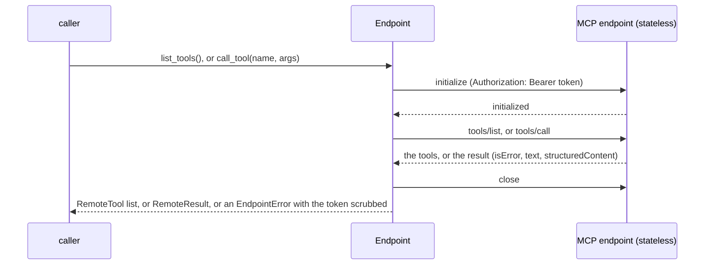
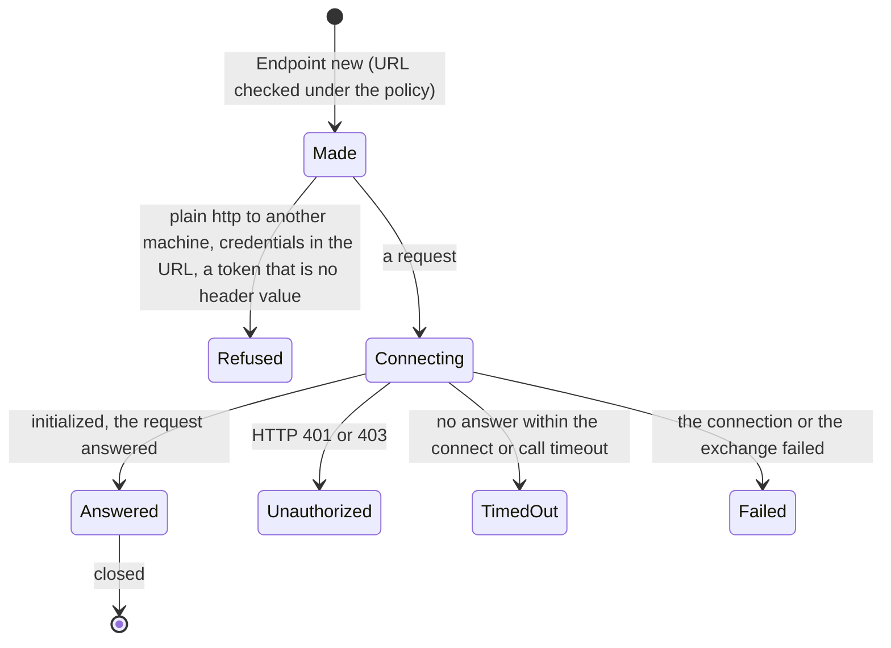
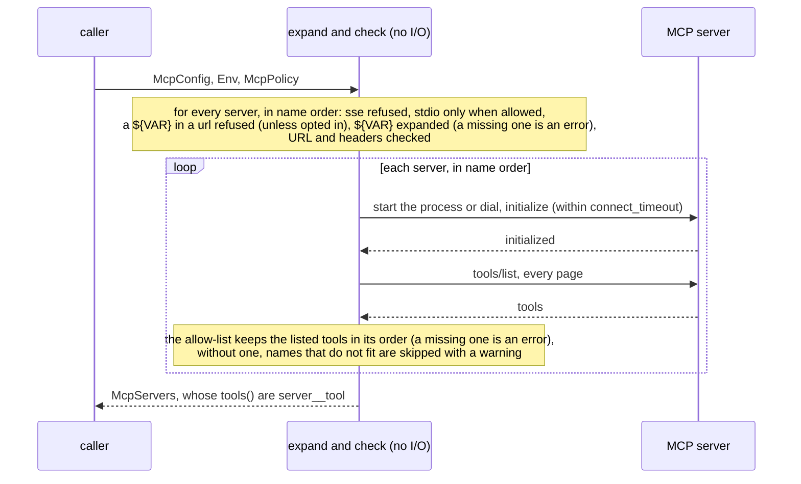
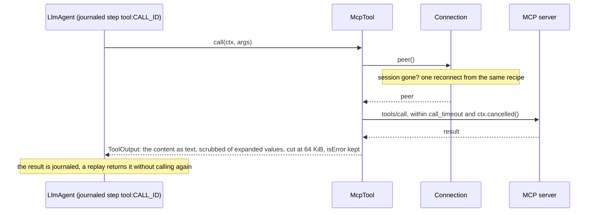
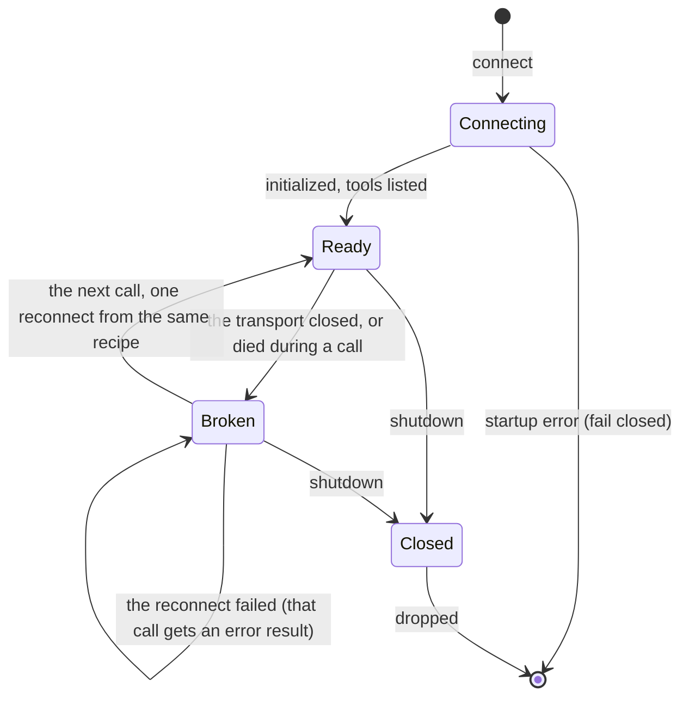

# adam-mcp

The servers of an agent's `mcp.json` as tools an [`LlmAgent`](../adam-llm-agent/README.md) can call. Slice S11
of the authoring layer ([`docs/authoring.md`](../../docs/authoring.md)); the wiring into an agent (whose tools
they are, and the checks at `bind`) is [`adam-assembly`](../adam-assembly/README.md#mcp-tools-feature-mcp), behind
its feature `mcp`.

It is an MCP **client** over the official Rust SDK, [`rmcp`](https://crates.io/crates/rmcp). It connects to
every server of a config at startup, lists their tools, and gives each one back as a `Tool` named
`<server>__<tool>`. Everything that can be wrong with the files, the environment or the policy is found
**when the process starts**; a server that is down is a startup error and not a tool that fails later.

## Use

```rust
use adam_mcp::{Env, McpPolicy, McpServers};

// `config` is the `McpConfig` of an `mcp.json`, as `adam-agent-fs` parsed it.
let servers = McpServers::connect(
    &config,
    &Env::new().var("LINEAR_API_TOKEN", token),   // `${LINEAR_API_TOKEN}` in the file; else the process environment
    &McpPolicy::default().allow_stdio(true),      // local processes are refused unless the deployment opts in
)
.await?;                                          // every server connected and listed, or an error

let tools: ToolSet = servers.tools();             // `linear__list_issues`, `fs__read_file`, ...
servers.shutdown().await;                         // or drop the servers and their tools
```

`adam-assembly` does this for each agent (`AgentDef::connect_mcp`); use this crate directly for a client of your
own.

| Item | What |
|---|---|
| `McpServers` | `connect(&McpConfig, &Env, &McpPolicy)`, `tools()` (a `ToolSet`), `names()`, `shutdown()`; `Debug` shows server and tool names only |
| `McpPolicy` | what the deployment decides: `allow_stdio` (default off), `allow_insecure` (off), `allow_url_secrets` (off: no `${VAR}` in a `url`; if on, filter the `rmcp` log target), `inherit_env` (off), `connect_timeout` (30 s), `call_timeout` (60 s) |
| `Env` | values for `${VAR}`, taken before the process environment; held as secrets, `Debug` shows names only |
| `Error` | closed enum, every variant names the server and none carries a value from a variable: `Var`, `StdioNotAllowed`, `SseUnsupported`, `Url`, `UrlSecret` (names the variable), `Header`, `Name`, `Spawn`, `Connect`, `ListTools`, `UnknownTool` |
| `VarProblem`, `UrlProblem` | closed enums inside `Error::Var` and `Error::Url` |
| `MAX_RESULT_BYTES` | 64 KiB: the most of an answer that reaches the model |
| `Endpoint::new(url, &SecretString, &McpPolicy)`, `list_tools()`, `call_tool(name, args)`, `EndpointError`, `RemoteTool`, `RemoteResult` | one MCP endpoint a **message** announced, with a bearer token known only at run time, one connection per request: see *An endpoint a message announces* |

`Connect`, `Spawn` and `ListTools` are `ErrorClass::Transient` (the server may be up later); every other variant is
`Invalid` (the same files and policy never succeed).

## An endpoint a message announces

The servers of an `mcp.json` are known when the process starts, connected once and kept. The per-thread tool
endpoint of the orchestration layer is not: a **message** carries its URL and a short-lived token, it exists for one
conversation, and the replica that steps the next turn may not be the one that read the message. `Endpoint` is the
client for that: it opens a connection for each request (initialize, the request, close), keeps nothing, and sends
the token as `Authorization: Bearer` on every request of the connection. The server is expected to be stateless
(*verified 2026-10-01* against rmcp 3.5's own server over a `NeverSessionManager`, mounted with `route_service` on a
parametrised path, in `tests/endpoint.rs`).





The URL goes through the same rules as a remote server's (https, or plain `http` only to this machine unless
`McpPolicy::allow_insecure`; no credentials in it), and the token is registered with the redactor: **no error and no
result text carries it**, and `Debug` shows the URL without its query. The call has no retry and no idempotency key,
as for any MCP call; a tool that ran and failed is a `RemoteResult` with `is_error`, and a protocol error (an unknown
tool) is `EndpointError::Rejected`. A 401 is told apart from other failures by the text the transport reports (the
SDK gives no status code in a type); a wrong guess only changes the wording of an error. `adam-ui`'s thread-tools
client is its user.

## What `mcp.json` means here

* **`type: http` and `type: streamable-http`** are the streamable HTTP transport. **`type: sse` is refused**
  (`Error::SseUnsupported`): the specification deprecates HTTP+SSE and `rmcp` removed it (see the facts below).
* **A server with `command`** is a child process over stdio, and only with `McpPolicy::allow_stdio(true)`:
  otherwise `Error::StdioNotAllowed`, before anything is started. Every server of the file is checked before the
  first is started, so a refusal never leaves a process behind. The child gets `PATH`, `HOME`, `LANG` and `TMPDIR`
  (on Windows `SystemRoot`, `TEMP` and `USERPROFILE`) and the `env` the file declares, and **nothing else**,
  unless `inherit_env(true)`; it is killed when its connection is dropped (`kill_on_drop`, and again by `rmcp`),
  including when the servers are dropped outside a runtime or after the runtime is gone (both are tests; in the
  second case the killed child stays a zombie until the process exits or a runtime reaps it).
* **`${VAR}` and `${VAR:-default}`** are expanded once, in `connect`, in the command, arguments, `env` values,
  header values and (only with `McpPolicy::allow_url_secrets(true)`, see *Security*) the URL, from the `Env` and
  then the process environment; the default stands for a variable that
  is unset **or empty** (POSIX `:-`); a variable without a default that is unset is `Error::Var`, naming the
  variable and never a value; a set-but-empty one expands to nothing, as in a shell. The grammar is
  [`adam_agent_fs::split_env_references`](../adam-agent-fs/README.md), the same function `McpConfig::env_references`
  is built on, so the build and the run cannot disagree about what a reference is (a property test checks it).
  A `${` that does not form a reference stays literal.
* **The URL** is https, or http to `localhost`, `*.localhost` and loopback addresses unless
  `McpPolicy::allow_insecure(true)`; a user name or password in it is always refused; **a `${VAR}` anywhere in it
  (a key in the query, a token in the path, the whole URL from a variable, even one with a default) is refused
  with `Error::UrlSecret` unless `McpPolicy::allow_url_secrets(true)`**, before any request; errors show it
  without userinfo, query and fragment, and with every value a variable put into it replaced by `[REDACTED]`
  (so, with the opt-in, a secret in the path or the host is not shown either). The rules are those of remote subagents (`a2a:`), whose helpers were copied (with a
  comment saying where from) rather than shared, because the two crates do not depend on each other.
* **Headers** are sent on every request, values marked sensitive. A header the transport owns
  (`Accept`, `Mcp-Session-Id`, `Last-Event-ID`: *verified 2026-09-29*, `RESERVED_HEADERS` in the `rmcp` source) is
  refused by `rmcp` when the first request is made, which is a startup error (`Error::Connect`).
* **`tools:`** (an adam extension) is an allow-list: exactly the listed tools, in the list's order; a listed tool the
  server lacks is `Error::UnknownTool` at startup (fail closed). Without it every tool is kept whose
  `<server>__<tool>` fits `^[A-Za-z0-9_-]{1,64}$`; the others are skipped with a `warn!` (a server cannot break
  startup by having a tool called `a.b`).
* **Names say whose tool it is.** A server name has no `__` and does not end in `_` (`Error::Name`, also in
  `adam-agent-fs`), and a tool name does not start with `_` (an error in an allow-list, skipped with a warning
  without one): otherwise `a` + `_x` and `a_` + `x` would both be `a___x`, `linear__*` would also select the
  tools of a server `linear_`, and the first `__` would not end the server's name.
* **What the model sees.** The description is the server's, else its title, else `` `<tool>` from the MCP server
  `<server>`. ``, cut at 8 KiB; the parameters are the server's `inputSchema` as it is, with `"type": "object"` added
  when the server left it out.
* **What the person sees.** The tool's `title`, when the server gave one (trimmed, not blank), is the **label of its
  step** (`Tool::step_style`: `Search the web`, not `search__web_search`), so that a screen's step list reads as words
  ([ADR 0011](../../docs/decisions/0011-a-tool-calls-step-carries-its-input-and-output.md)); without one the step is
  labelled with the name the model knows. The model never sees the title as a name: it is only the description's fallback,
  as above.

## Startup



## A call





* **The answer** is the content blocks joined by newlines: text as it is; an image or audio clip as
  `[image not included: image/png]`; an embedded text resource as its text, a blob as `[binary resource not
  included: <uri> (<type>)]`, a resource link as `[resource link: <uri>]`; anything the SDK adds later as
  `[unsupported content not included]`. No content falls back to `structuredContent` as JSON, then to `(the tool
  returned no content)`. It is **scrubbed of every value a `${VAR}` put into the server's text** (`[REDACTED]`;
  success text and `isError` text alike) and then cut at 64 KiB on a character boundary with a note. `isError: true` is an error
  *result* (the model reads it and the run goes on).
* **Every failure of a call is an error result, never a `ToolError`.** In particular never
  `ToolError::Transient`: an MCP call has no idempotency key, so a call that failed on the way may or may not have
  run, and retrying it is not this crate's decision. The result says "it may or may not have run on the MCP
  server; check before you repeat it". That covers a server that answered with a protocol error (its message,
  scrubbed), an `input_required` or task answer (not supported: nobody can answer), no answer within
  `call_timeout` ("may still be running"), a run cancelled meanwhile (the call is dropped at once), and a
  transport that closed (the connection is dropped, so that the next call starts it again).
* **At-least-once.** The call runs in the agent's journaled step, so a replay of a committed call returns the
  recorded result and does not call the server. A transition that fails before it commits (a crash, a lost lease,
  a later tool of the same turn returning `Transient`) runs again from its start and calls the server again.
  `adam-assembly`'s tests pin both cases.
* **Reconnection.** A session that is gone is replaced by the next call, once, from the same recipe (a stdio
  server is started again; a remote one is dialled and initialized again); calls wait for each other there, so a
  dead server is redialled once and not once per call. Tools are never listed again: what was discovered at
  startup is what the agent has, and a server that changes its tools is picked up at the next restart.
* **Lifetime.** The connections live as long as the `McpServers` or any tool made by `tools()` does. `shutdown()`
  closes them now (a child is asked to end, and killed after 3 s) and makes every later call an error result.

## Security

* **Secrets are `SecretString`s** (`Env`, the expanded command, arguments, environment and headers) and are never
  in a journal, state, event, `Debug`, error or tool result, nor in a log line **of this crate**. Every value a
  `${VAR}` put into a server's text is registered with a per-server redactor, **and so is the whole expanded
  text** (a `Bearer <token>` header, a URL with a key in its query), **and the forms of each value that a URL or
  JSON prints** (percent-encoded as a path or a query, form-encoded, JSON-escaped): every message that comes from
  the server, the transport or the SDK, every tool result (text and `isError` text: a server that echoes a
  credential it was given does not hand it to the model or the journal) and every line of a child's stderr goes
  through it (`[REDACTED]`) before it is shown, logged or returned. A default written in the file
  (`${LEVEL:-info}`) is not registered: it is in the file already. A child's stderr is logged at `debug` under
  the target `adam_mcp::stderr`, a line at a time; a line over 4 KiB is dropped whole (a cut line could end in the
  first half of a secret the redactor no longer recognises).
* **A short secret is redacted too, and garbles what it matches.** A value of one or two characters is still
  registered (a short secret is still a secret), so every occurrence of those characters in a message or a tool
  result becomes `[REDACTED]`, and a result can read strangely (`a t[REDACTED]le`). The remedy is a real secret,
  not a weaker redactor.
* **Secrets go in headers, never in the URL.** *The SDK logs the URL it dials* (*verified 2026-09-29, found by
  running the tests*: `rmcp::transport::streamable_http_client` logs "fail to delete session ... for url (...)" at
  `ERROR` when the server is gone at shutdown, `rmcp::service` logs a failed request, and the HTTP client's errors
  repeat the URL), in its own log lines, which this crate's redactor cannot reach. So `connect` refuses a `${VAR}`
  anywhere in a `url` (`Error::UrlSecret`, naming the variable) before any request, unless the deployment opts in
  with `McpPolicy::allow_url_secrets(true)`. With the opt-in, the errors and results of this crate stay scrubbed,
  but **the `rmcp` log target (and `reqwest` and `hyper` at `debug` and below) must be filtered out of any log
  that leaves the process**; a proxy or the server's access log may keep the URL too. `Authorization: Bearer
  ${TOKEN}` is the shape that is tested to leave no trace (the test reads the logs at `TRACE`, which include
  `hyper` and `rmcp`); `sensitive_headers` marks each header value sensitive, so the transport's `Debug` shows
  `Sensitive` (a test). A test pins the leak path itself, so that a newer `rmcp` that stops logging URLs shows up
  as a failing test and not as a stale claim.
* **Secrets in `args` are visible to the machine.** The arguments of a child process are readable by every
  process of the host (`/proc/<pid>/cmdline`, `ps`); its environment is readable only by its owner
  (`/proc/<pid>/environ`). Give a stdio server its secrets in `env` (`"env": {"API_KEY": "${API_KEY}"}`), not as
  `${API_KEY}` in `args`. This crate does not tell them apart (a `${HOME}` in `args` is fine), so it does not
  warn.
* **Tool descriptions and answers are text the server controls.** They go into the model's context, so a server
  can try to steer the model. The mitigation is the allow-list: name the tools you want under `tools:` and nothing
  else reaches the model. Only text is passed on; no byte of an image or a blob reaches the context or the journal.
* **Fail closed.** No local process unless the deployment says so, no plain http to other machines unless it says
  so, no redirects followed (they could carry the headers somewhere nobody named), a missing variable or a wrong
  token is a startup error.
* No `unsafe`.

## Facts about the SDK

*Verified 2026-09-29* from the crate itself (<https://static.crates.io/crates/rmcp/rmcp-3.5.0.crate>, read in the
Cargo registry), <https://docs.rs/rmcp/3.5.0> and <https://crates.io/api/v1/crates/rmcp>, unless a fact says it was
found by running the tests:

* `rmcp` 3.5.0, Apache-2.0, `rust-version` 1.88. Features used: `client`, `transport-child-process` and
  `transport-streamable-http-client-reqwest` with `default-features = false` (the `reqwest` feature is not used;
  the client is our own `reqwest::Client`, the workspace's 0.13). Its new dependencies are `process-wrap` 10.0.1
  (Apache-2.0 OR MIT), `sse-stream` 0.2.6 (MIT OR Apache-2.0), `pastey` 0.2.3 (MIT OR Apache-2.0), `nix` 0.31.3
  (MIT) and the Windows crates `process-wrap` needs there; `cargo deny check` passes.
* The SSE transport was removed in `rmcp` 0.11.0 (its CHANGELOG, PR #562) and the specification calls HTTP+SSE
  deprecated (<https://modelcontextprotocol.io/specification/2025-03-26/basic/transports>): so `type: sse` is
  refused.
* `serve` on a `ClientConfig` runs the legacy `initialize` handshake (`ClientLifecycleMode::Initialize`, the
  default), which every server speaks; the newer `server/discover` lifecycle is not used.
* `Peer::list_all_tools` pages through `tools/list`; `Peer::call_tool_once` sends one `tools/call` without the
  SDK's own multi-round handling of `input_required`, which is why that answer is reported and not driven.
  `CallToolResponse`, `ContentBlock`, `ResourceContents` and `ServiceError` are `#[non_exhaustive]`, so every
  `match` here has a wildcard arm, and an unknown block becomes `[unsupported content not included]`.
* The SDK logs the URL it dials (see *Security*): at `ERROR` ("fail to delete session"), and at `TRACE` for a failed
  request (*found by running the tests*, 2026-09-29).
* Custom headers go through `StreamableHttpClientTransportConfig::custom_headers`; `Authorization` is allowed
  there. Its `auth_header` field is not used: the config derives `Debug`, and a sensitive `HeaderValue` shows as
  `Sensitive` while a plain `String` would not. `reinit_on_expired_session` is turned **off**: the SDK would
  otherwise start a new session and send a request again behind our back; the reconnect here is ours.
* `TokioChildProcess` kills its child from `Drop` by spawning a task, which needs a runtime; the command is also
  `kill_on_drop`, and the tests drop the servers outside a runtime and after the runtime is gone (*found by
  running the tests*: the child is killed in both, but after the runtime is gone it is **left a zombie** (state
  `Z` in `/proc/<pid>/stat`) until the process exits or a runtime in it reaps orphans; so the tests count a zombie
  as dead, and read the state and not only whether `/proc/<pid>` exists).
* A test found (by running it) that scoped `tracing` subscribers (`set_default`) miss events when tests run in
  threads of one process, because a callsite caches whether anybody listens; the testkit's `LogCapture` installs one
  global subscriber and routes lines by thread instead.

## Tests

`cargo test -p adam-mcp` (unit tests and `tests/http.rs`) and `cargo test -p adam-mcp-testkit` (`tests/stdio.rs`,
which lives there because only the package that owns a binary gets `CARGO_BIN_EXE_*`). Both run against
[`adam-mcp-testkit`](../adam-mcp-testkit/README.md), a real MCP server; nothing sleeps for a fixed time (conditions
are polled with a deadline). Every test passes on its own in its own process (CI runs `cargo nextest`, one process
per test): none relies on another test's runtime to reap a process or to install a log subscriber.

* Unit: expansion (the `Env` before the process environment, defaults for unset and empty, a missing variable names
  only itself, malformed references stay literal), the URL rules and that credentials are refused and never shown,
  `sse` and stdio refusals, the names (`server__tool`, unmappable names skipped, allow-list order), the schema
  pass-through, description fallbacks, the mapping of every content block, `isError`, the 64 KiB cut, the redactor
  (longest first; expanded values, the whole expanded text and their encoded forms, not defaults; a short value is
  kept), errors scrubbed of expanded values (also the URL an error prints, with the opt-in), results scrubbed
  before the cut (a value that straddles it), header values marked sensitive (`is_sensitive`, and the transport
  configuration's `Debug`), a `${VAR}` in a `url` refused unless the policy allows it, server and tool names that
  would collide (`a_`, `_x`), `Debug` without header values.
* `tests/http.rs`: list and call over streamable HTTP; servers connected in name order; the allow-list and a
  listed tool the server lacks; every kind of content and an error result; a big result capped; arguments that are
  not an object and a server's protocol error as error results; the token sent on every request and in no log line
  (at `TRACE`), `Debug` or error; a wrong token fails startup without showing either token; a stopped server whose
  connection error repeats a `?key=${K}` URL, scrubbed (mutation-checked: with the redactor turned into the
  identity the test fails); a `${VAR}` in the URL refused before any request by default, connecting with the
  opt-in, and the SDK's own log line that repeats the URL (the documented leak); a missing variable fails before
  any request; `sse` and credentials in the URL refused before any request; a server down at startup;
  a server that stops mid-run (error result) and comes back (one reconnect, the tools not listed again); a server
  restarted between two calls (four POSTs exactly, counted by the testkit: no request is sent again after a `404`,
  which `reinit_on_expired_session(true)` would do and the test then fails); a slow
  call as an error result while the session stays usable; cancellation returning at once; shutdown.
* `tests/endpoint.rs`: against the testkit's fake thread-tools endpoint: listing and listing again after the tools
  change (one `initialize` per request), a call with its structured content and its text, a tool that failed (`isError`)
  and an unknown tool (`Rejected`), arguments reaching the tool, the token on every request and never shown, a token
  the endpoint does not accept (`Unauthorized`, nothing called), an endpoint that is down, a call that times out, plain
  `http` to another machine refused before anything is sent. Unit tests in `src/once.rs`: the URL policy, `Debug`, the
  listed tool's defaults, the wording of a 401.
* `tests/stdio.rs` (testkit): list and call over stdio; declared `env` expanded into the child (what the child
  reports comes back as `[REDACTED]`, which also proves it holds the value); the child does not
  inherit the environment (`CARGO`) unless asked; stdio refused without the opt-in; a missing command; a child
  that exits mid-call (error result, then a new process); dropping the servers kills the child, also outside a
  runtime and after it; a later server failing kills the children already started; the child's stderr is logged
  without the expanded secret.
* `tests/wiremock_compose.rs` (gated by `ADAM_TEST_MOCK_GITHUB_MCP_URL`, the endpoint of the compose service
  `mock-github-mcp`; CI's compose job runs it): the WireMock stand-in for the GitHub MCP server's HTTP endpoint is a
  server this client can use. The bearer is written as the coder's dev `mcp.json` writes it; `McpServers::connect`
  lists the twelve tools of the coder's allow-list in order, calls `list_branches` and `get_me`, and gets an error
  result for a tool the mock does not script; a tool the server lacks is a startup error; no bearer is a `401`, which
  fails startup (`Transient`). It skips itself without the variable. (The real server, over stdio, is exercised by
  the coder's `tests/binary.rs`.)
* Property test (`adam-agent-fs`): `split_env_references` and the scanner it replaced agree on any text, and the
  segments write back to the text.
