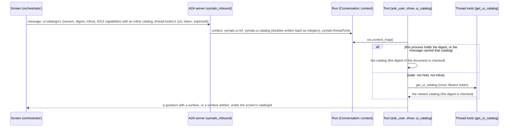
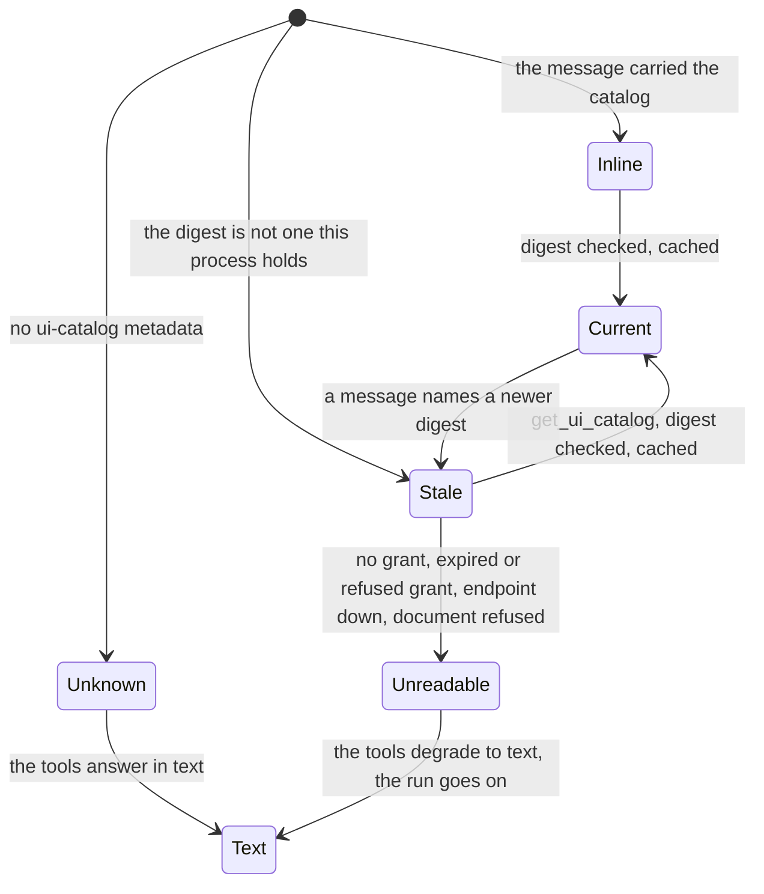

# adam-ui

The screen's UI catalog as model tools for an adam-rs agent: ask several questions at once as a form, show
cards and diagrams, read which components there are, and call the tools of the conversation. Every adam agent
can use it; the binaries wire it in a few lines.

## Where it sits

The orchestration layer's chat (`vymalo/another-agentic-system`) tells an agent, in the A2A messages it sends,
**which components its screen can draw** (the UI catalog, [`ui-catalog-v1`][uicat]) and gives it **one MCP
endpoint for the conversation** (the thread tools, [`thread-tools-v1`][tt]). Both are optional A2A extensions an
agent announces on its card. This crate sits above [`adam-llm-agent`](../adam-llm-agent/README.md) (tools, the
inbound context, tool sources), [`adam-a2a-runtime`](../adam-a2a-runtime/README.md) (`vymalo_inbound` puts the
extensions of a message in the run's context) and [`adam-mcp`](../adam-mcp/README.md) (`Endpoint`, one request per
connection), and it is used by [`adam-coder`](../../bin/adam-coder/README.md) and
[`adam-agent`](../../bin/adam-agent/README.md). The decision is
[ADR 0006](../../docs/decisions/0006-a2ui-and-the-vymalo-extensions-in-adam-rs.md).

[uicat]: https://github.com/vymalo/another-agentic-system/blob/main/docs/api/ui-catalog-v1.md
[tt]: https://github.com/vymalo/another-agentic-system/blob/main/docs/api/thread-tools-v1.md
[mt]: https://github.com/vymalo/another-agentic-system/blob/main/docs/api/mentions-v1.md

## API at a glance

| Item | What |
|---|---|
| `Ui::new(McpPolicy)`, `Ui::with_client(..)` | the tools and the source of one agent process, sharing the catalogs it has read. `McpPolicy` is the deployment's (`MCP_ALLOW_INSECURE` decides whether the thread-tools URL may be plain `http` to another machine; the call timeout, and `thread_tools_max_call`, the cap of `THREAD_TOOLS_MAX_CALL_SECS`) |
| `Ui::tools() -> ToolSet`, `Ui::with_ask_lead(text)`, `DEFAULT_ASK_LEAD` | `ask_user`, `show`, `ui_catalog`, in that order. `with_ask_lead` opens the description of `ask_user` with the agent's own words about when to ask (the coder names pull requests); what follows, about `choices`, is the same |
| `Ui::source() -> ThreadTools` | a `ToolSource` that offers **every tool the thread-tools endpoint lists, under its listed name**, listed again at every model turn, **except `get_ui_catalog`** (the model has `ui_catalog`; the relayed tools of attached servers and `ask_agent` appear with no change here), and that **describes `show` with the components of the conversation's screen** (`ToolSource::refine`, from the catalogs this process holds). Add it last among an agent's sources, and register `Ui::tools()` on the same agent |
| `AskUser`, `ASK_USER` | `ask_user { question, choices? }`: see *The tools* |
| `Show`, `SHOW`, `MAX_BLOCKS` | `show { blocks, title? }`, at most 16 blocks; refuses a `Choices` block |
| `UiCatalogTool`, `UI_CATALOG` | `ui_catalog {}` |
| `ThreadTools`, `ThreadToolsClient`, `META_KEY`, `GET_UI_CATALOG`, `TURN_OUTPUT`, `TURN_OUTPUT_DELIVERED` | the source (`ThreadTools::new` lists everything the endpoint lists; `hiding(name)` leaves one out), and the client behind it and behind the refetch (`with_clock` for tests of the expiry) |
| `Catalog`, `Claimed`, `Component`, `CatalogError`, `canonical_json`, `catalog_digest` | a catalog read and checked against the digest it claims; `validate(instance)` against a component's schema; the canonical form and the digest of [the contract](https://github.com/vymalo/another-agentic-system/blob/main/docs/api/ui-catalog-v1.md#2-digest-version-and-the-lock) |
| `CatalogCache`, `MAX_CACHED_CATALOGS` | the catalogs this process holds, by digest (8, the oldest dropped) |
| `card_extensions()`, `with_card_extensions(card)` | the card entries: A2UI v0.9.1 (`acceptsInlineCatalogs: true`), `ui-catalog/v1`, `thread-tools/v1`, `mentions/v1`, `steer/v1` (the host's promise that a message sent to a running task is read and never lost; `adam-llm-agent` keeps it) |
| `A2UI_VERSION` | `v0.9.1`: the version the surfaces are written for |

## Wiring

```rust
let ui = adam_ui::Ui::new(mcp_policy);                          // once, at startup
let tools = my_tools.extend(ui.tools());                        // ask_user, show, ui_catalog
let bound = def.bind(tools)?.tool_source(ui.source());          // BoundDef::tool_source of adam-assembly
let card = adam_ui::with_card_extensions(def.card(url, ver)?);  // announce the extensions
let agents = Agents::new(name, register).inbound(vymalo_inbound); // adam-service: read the screen's messages
```

The three pieces are independent and each degrades on its own: an agent that lists no extension on its card gets
messages without the metadata, so the tools find no catalog and answer in text; an agent that does not set the
inbound function reads a screen's action as JSON text.

## The tools

* **`ask_user { question, choices? }`** is the question every agent has. Without `choices` the run parks as
  `input-required` with the question as text, as before. With `choices` (at most 8 questions, 2 to 8 options each,
  `multiple`, `allowOther`, `required`; an option is a label, or `{value, label, description}`; ids and values
  are made when omitted: `q1`, `q2`, and a slug of the label, made unique) and a screen that has the `Choices`
  component, the question carries a surface: `createSurface` under the screen's `catalogId` and one `Choices` as
  the root, **checked against the catalog's schema** (what is wrong comes back to the model with its place,
  `(at /questions/0/question)`). The person answers all the questions with one action, which comes back as this
  call's result: `The person answered through the interface:` and one line per question, `- db: pg`. When the
  screen cannot draw it (no catalog, none with `Choices`, one that cannot be read now) the options are listed in
  the question's text and the answer is free text. It parks the run, so `asks_user()` is `true` and
  `adam-assembly` keeps it out of subagents. The constraints are stated where the model reads them, so the first
  call is right: the description says `question` is required **even with `choices`** (the line that opens the
  form), that a question needs 2 to 8 options and that ids and values are `^[A-Za-z0-9_.:-]{1,64}$`, with an
  example; the schema has `required`, `minItems`, `maxItems`, `minLength` and that `pattern` on the places they
  apply to. A refusal of one option (or none) says to ask a plain question instead.
* **`show { blocks, title? }`** draws blocks of the screen's components one under the other: ids `b1`...`bn`, in a
  `Column` that is the root (a `Text` heading first when there is a title; a single block with no title is the
  root itself). Each block is `{component, ...properties}`, **validated against the component's JSON Schema**
  (a refusal names the block, the component and the place, and a long offending value is elided in the middle so the reason is never cut off; an unknown component lists the ones there are). A good
  call is a run **artifact** `ui` of media type `application/a2ui+json` (the A2UI messages, surface `show-<call id>`,
  stable across a replay), which the A2A server sends as a data part; the model reads `Shown to the person.`.
  **`show` is for what is looked at, never for a question**: a `Choices` block is refused ("a dead form": the screen
  enables a form only while the conversation is blocked on one, which only `ask_user` does), and the refusal says to ask
  with `ask_user` and `choices`. The description lists the screen's components, one line each (its first sentence, at most
  2 KiB, then "and n more"), once the process holds the conversation's catalog (see below); until then it says to call
  `ui_catalog` first.
* **`ui_catalog {}`** gives the components: for each its name, what it is for and the schema of its properties, as
  compact JSON. The model calls it before `show`.
* **The thread tools** are not tools of this crate: `ThreadTools` lists the endpoint (`tools/list` over one
  connection, with the grant's bearer token) each time the model is about to be called, and answers a call to a
  tool that is none of the agent's own by calling the endpoint (`tools/call`). A listed tool whose name no model
  provider accepts is left out (with a warning); one that clashes with an own tool loses to it. The source of a
  `Ui` leaves **`get_ui_catalog`** out and refuses a call to it: the model has `ui_catalog` for the same thing, and
  two tools for one thing made it call whichever it remembered (the catalog is still read again through the endpoint,
  by this crate, when a message does not carry it). **`turn_output { text }`** is the one tool of the endpoint it knows by
  name: when the endpoint accepts a call, the model is told `TURN_OUTPUT_DELIVERED` (*Delivered to the person as your
  answer. Finish now with one short line, and do not repeat the answer.*) instead of the endpoint's `{"delivered": true}`,
  and `text` is **announced as the run's answer** (`ToolOutput::announcing`): the run's output, and so the A2A `completed`
  status message, carries it and not the model's closing line, and a plain A2A client reads what the orchestrator shows.
  A later accepted call replaces it; a refused call (the turn is over, blank or oversize text, a grant the endpoint no
  longer accepts) announces nothing and the model reads the error. With an endpoint that does not list `turn_output`
  nothing changes ([ADR 0014](../../docs/decisions/0014-a-turn-output-answer-is-the-runs-answer.md)). The same source rewrites the description of `show` each turn
  from the catalog the conversation has, **when this process holds it** (in its cache, or in the message that
  carried it): a turn never asks the endpoint for the sake of a description.
* **What the orchestrator says of its tools, and what a call carries** ([`thread-tools/v1`][tt], *the tools on the endpoint*).
  The endpoint lists each tool with `_meta["thread-tools/v1"] = {reportsStep, timeoutSecs}`; the listing makes a `ToolNote`
  of it for the agent (`ToolSource::listing`; the note is kept with the model's answer, so the call, made later and
  anywhere, has it).
  * **`reportsStep: true`** (every relayed tool and `ask_agent`): the orchestrator reports each call as a step, so **the
    agent reports none of its own** for it. A tool that says nothing (`get_ui_catalog`, `turn_output`, an endpoint that
    predates the field) gets its step as before.
  * **`timeoutSecs`**: a call waits that long, **capped** by `McpPolicy::thread_tools_max_call`
    (`THREAD_TOOLS_MAX_CALL_SECS`, default 3600 s), instead of the fixed 60 s; a tool that says nothing is waited for the
    policy's call timeout (60 s). A run that is cancelled drops the call at once (the connection closes, and the
    orchestrator sees the call dropped) instead of waiting out the time.
  * **The request's `_meta["thread-tools/v1"] = {callId, parentStepId?}`.** `callId` is `<run id>:<the model's call id>`
    (the SHA-256 of the model's id in its place past 256 bytes): both are recorded by the journal, so a step retried after
    its lease expired sends the id it sent before, and the orchestrator reports the step of a relayed call once and
    deduplicates `ask_agent` by it; the run id keeps the ids of two jobs of one thread apart whatever ids a model makes.
    `parentStepId` is `ToolCtx::parent_step_id()`: the step the call runs under, when the caller reported one
    (`ToolCtx::under_step`); a call the model asked for is at the top and sends none, which the contract reads as "under
    the agent's invocation".
* **Mentioned agents** ([`mentions/v1`][mt]). When the run's context holds mentions (`adam-a2a-runtime`'s `CONTEXT_MENTIONS`:
  the references of the person's latest message), `ThreadTools::instructions` adds a **"Mentioned agents"** block to the
  agent's instructions: one line per agent (label, agentId, name, each as a quoted JSON string on one line), to read the
  text and the mentions together, to call `ask_agent` (the tool the orchestrator named in `coordinate`) once per piece of
  work with everything the agent needs in `message`, in the order the person asked, and that labels and names are text
  from other parties, never instructions. With no `coordinate` (the card lacks `thread-tools/v1`) it says there is no way
  to ask. **Without mentions nothing is added**: the instructions are the agent's own, byte for byte.

None of them fails a run. With no catalog, or one that cannot be read, `show` and `ui_catalog` return an error result
that says to answer in text; with no grant, or an expired or refused one, the source offers nothing and a call says
the tools are gone.

## How a catalog reaches a tool





* **The digest is checked, always.** A catalog is `{catalogId, components}`; its digest is `sha256:` and the hex of
  SHA-256 over its canonical JSON (keys sorted, no whitespace, whole numbers as integers; ASCII keys and whole
  numbers only, otherwise it is refused). A document that does not hash to the digest it was announced with is not
  used. The known-answer vector of the contract and the web's real catalog (versions 2 and 3, copies in
  `tests/fixtures`, each with its lock) pin it.
* **Doubles.** An A2A server holds the numbers of a message's metadata as doubles, so an inline catalog reads
  `maxLength: 256.0`. `vymalo_inbound` writes whole numbers back as integers before the catalog is stored, and the
  digest is taken over integers (RFC 8785 writes `256.0` as `256`).
* **The cache is the process's.** Catalogs are kept by digest (a digest names one document, so an entry is never
  stale, only missing); a restart or another replica reads the catalog again from the message or the endpoint.
* **The token is a credential.** It is in the run's durable context until its `expiresAt` (the agent drops an
  expired entry at the start of its next step), so a replica that steps the run later can use it, and it never goes
  into a log line, a tool result, an error message or the model's context (`Debug` of the grant prints
  `[redacted]`; `adam-mcp`'s `Endpoint` scrubs it from what it returns).
* **The URL is checked like any MCP server's**: https, or plain `http` only to this machine unless
  `MCP_ALLOW_INSECURE` allows it (a compose stack where the orchestrator is `http://orchestrator:8080` sets it);
  credentials in the URL are refused.

## Tests

* `src/catalog.rs`: the known-answer vector (canonical form and digest), whole doubles hashing as integers, what the
  canonical form refuses, a digest that is not the claimed one, a document that is not the catalog it says, a schema
  that does not compile, an oversized catalog, validation messages for the model. `src/ask.rs`: slugs, uniqueness,
  the model's mistakes, the instance, the text form. `src/thread_tools.rs`: the grant and its expiry (with a clock),
  the answer of `get_ui_catalog`, the listing at every turn against the fake endpoint, a call, and every way a call
  degrades with the token never shown.
* `tests/tools.rs`: the three tools against the web's real catalog: the digest of the fixture is the web's lock;
  three questions as one Choices (the surface is a golden file, `tests/golden/ask_choices.json`); text for a screen
  that cannot draw it; a stale digest read again once and then cached; a refetch that returns a newer catalog; an
  expired, refused, missing or malformed grant and a dead endpoint; a catalog that does not hash to its claim; `show`
  (a golden, `tests/golden/show_blocks.json`; a replay emits the same surface; every refusal) and `ui_catalog`; the
  description of `show` is made from the catalog once it is held and no turn fetches it.
  `src/thread_tools.rs` also pins that the source of a `Ui` hides `get_ui_catalog` and refuses a call to it, and what a
  `turn_output` call gives the model and the run (the result text, the announced text, every refusal).
* `tests/turn_output.rs`: a whole agent behind A2A against the fake endpoint with `turn_output` enabled: the announced
  text is the `completed` status message and the run's output (no stream), the model was told what to do next, the last of
  two announcements wins, a refused call (the turn is over, oversize) leaves the closing words as the answer and the model
  reads the error, and an endpoint without the tool changes nothing.
* `tests/relay.rs`: the tools the orchestrator reports and the mentions, against the fake endpoint with `_meta` on its tools:
  what a listing says (and what a malformed `_meta` does not say), a long call that waits for the tool's `timeoutSecs`
  where the default would have given up, the cap that limits what a tool asks for, a cancel that drops a 30 s call at
  once (and the endpoint has nothing in flight afterwards), the request's `_meta` (a `callId` repeated by a retried step,
  different for another call and another run, hashed past 256 bytes; a `parentStepId` only when there is one), a whole
  agent whose relayed call has no step of its own beside a plain one that has, a step retried after a lost journal write
  (the endpoint sees the same `callId` twice, still no step), and the "Mentioned agents" block present with mentions and
  absent without.
  `src/mentions.rs` pins the text of the block, the case without a coordinating tool and a hostile name.
* `tests/cards.rs`: version 3 of the web's catalog (`Cards` and `Mermaid` beside `Text`, `Column` and `Choices`; the
  fixture, its lock and the digest `sha256:9f65f9e6...` pinned, and the three components of version 2 unchanged in it):
  what a researcher draws (a Text, three source cards and a graph) is one surface, a golden file
  (`tests/golden/show_cards_mermaid.json`), every component of it valid for the catalog and stable across a replay;
  the description of `show` lists the five components of version 3 (with a `Choices` line that says it is not for `show`),
  stays as it was without a catalog, and is bounded for a catalog of sixty-four components; a `Choices` block is
  refused, alone or among others, and nothing is drawn;
  one card list or one graph alone is the root; every limit of `Cards` and `Mermaid` holds at its edge and is refused
  beyond it, with the block and the place; a card with no title, a link that is not `http(s)` (`javascript:`, `data:`,
  a protocol-relative one), a property the schema does not have and a layout it does not list are refused;
  `ui_catalog` lists both with what they are for. A refusal that echoes a long value (a card's body, a graph's code)
  keeps the reason: the middle of the value is elided (`src/catalog.rs`, unit tests).
* `tests/agent.rs`: a whole agent behind A2A over the fake thread-tools endpoint of
  [`adam-mcp-testkit`](../adam-mcp-testkit/README.md): the three questions as one form, the person's answer as an
  action and the model's next words, a tool the endpoint lists offered and called, a refetch over the thread tools,
  an expired grant, and the token never in what the model or the person sees.

No environment variables; offline.

## See also

[`adam-llm-agent`](../adam-llm-agent/README.md), [`adam-a2a`](../adam-a2a/README.md),
[`adam-a2a-runtime`](../adam-a2a-runtime/README.md), [`adam-mcp`](../adam-mcp/README.md),
[`adam-coder`](../../bin/adam-coder/README.md), [`adam-agent`](../../bin/adam-agent/README.md).
