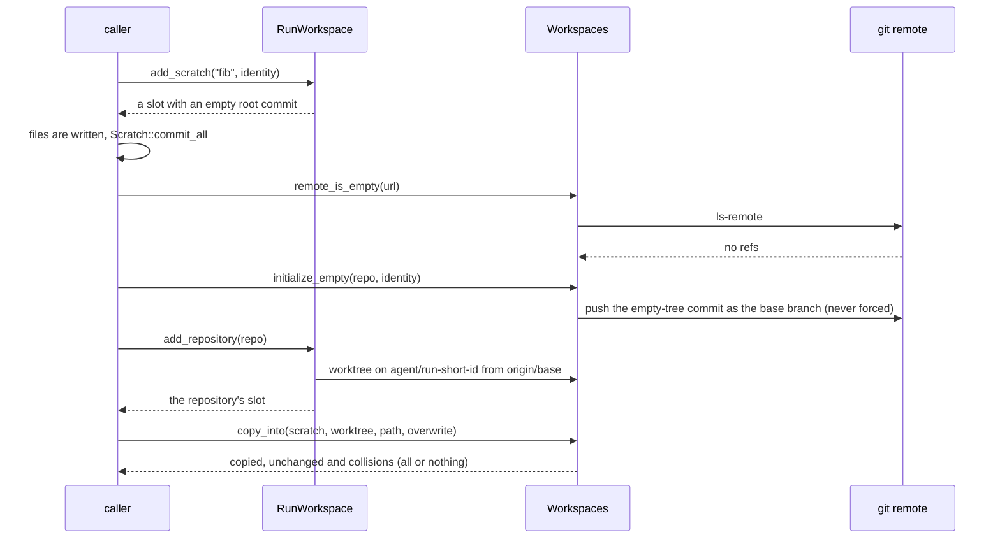
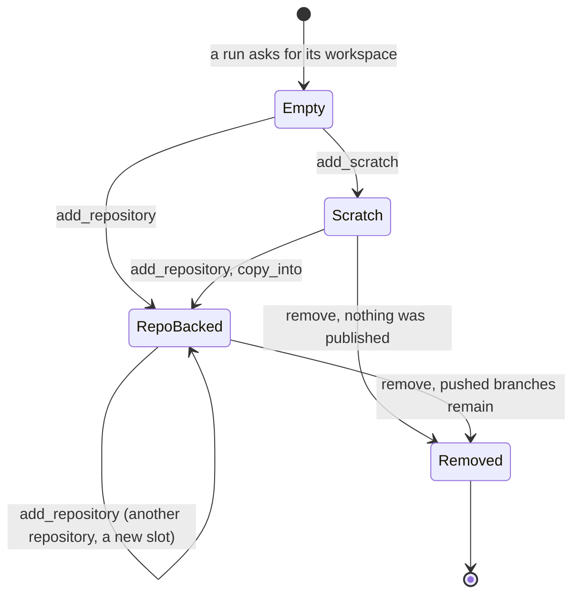
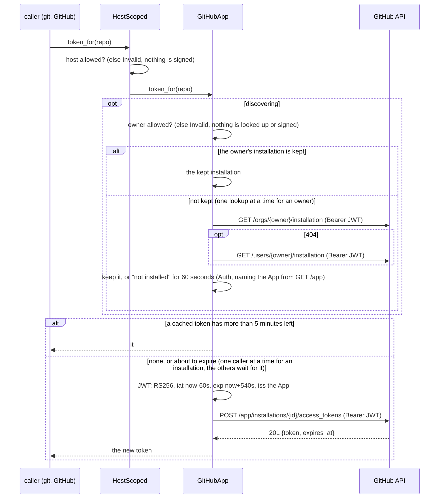
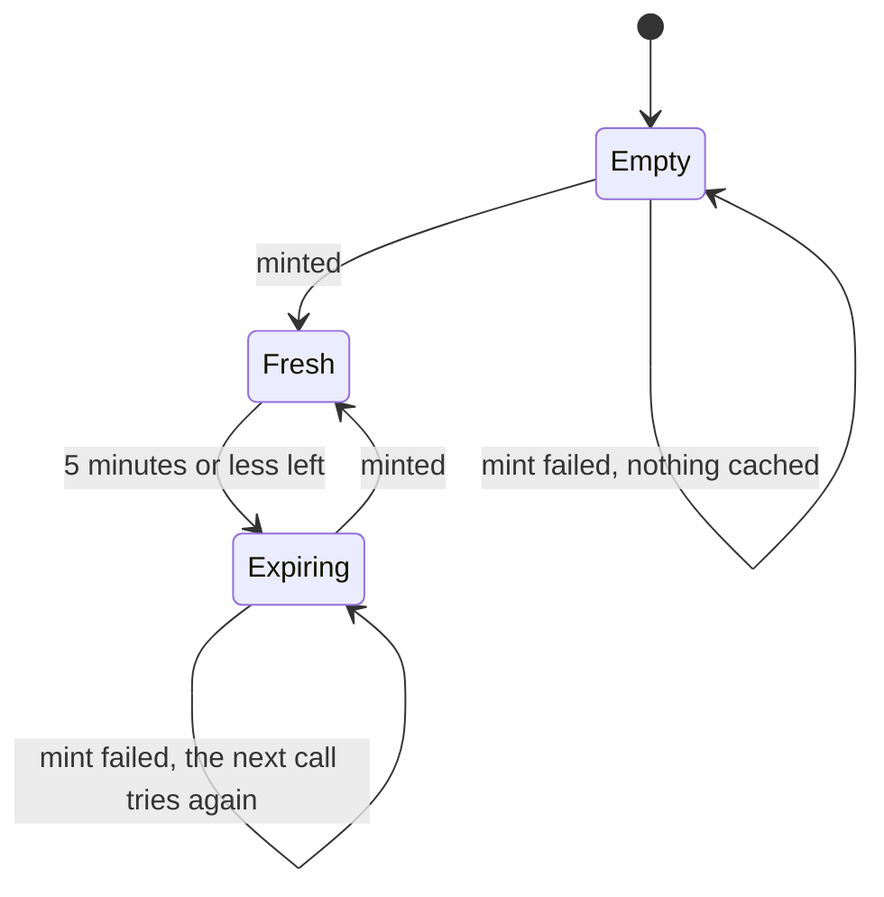
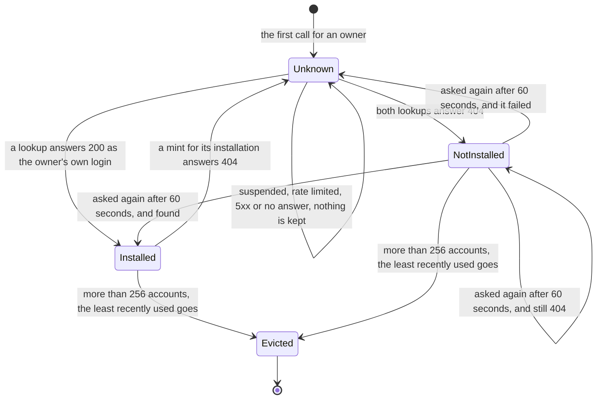
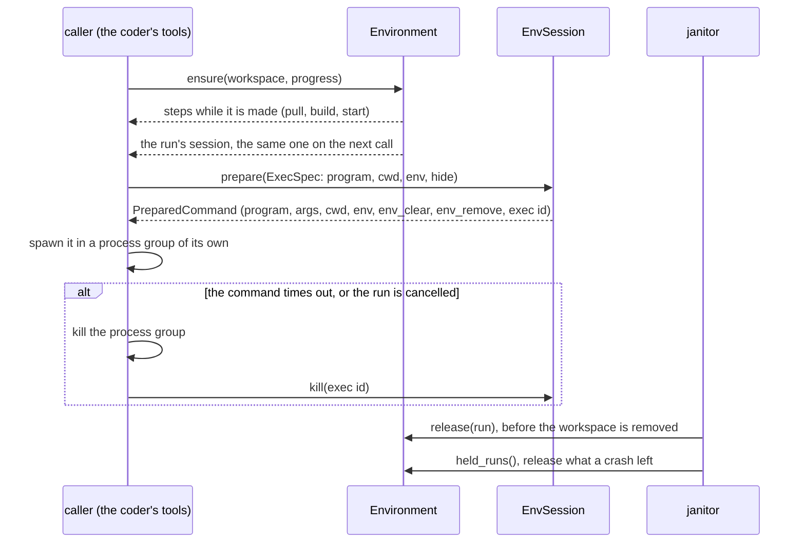
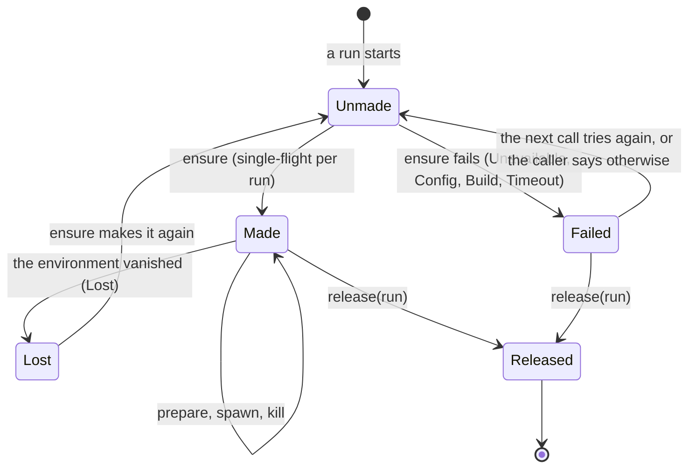

# adam-workspace

Per-run git worktrees, push and pull requests for coding agents. git is the
durable artifact: a run's result is a pushed branch and a pull request. A run's workspace holds
several repositories and scratch projects ([below](#a-runs-workspace-slots-scratch-projects-and-the-copy-between-them)).

## Where it sits

The **workspace and code-host layer** of the coder agent, used by
[`adam-coder`](../../bin/adam-coder/README.md) (and by anything that wants isolated
worktrees). It defines three ports, `GitCredentials`, `CodeHost` and `Environment` (where a run's
processes run, [below](#where-a-runs-processes-run-the-environment-port)), and ships
their implementations in the same crate (`StaticToken`, `ScopedToken`, `HostScoped`, `GitHubApp`,
`GitHub`; `MemoryCodeHost` for tests; `Local`). Nothing implementation-specific appears
in a trait signature. It shells out to the `git` CLI so mirrors, worktrees and
authentication behave like the real tool.

## API at a glance

| Item | What |
|---|---|
| `Workspaces` | `new(root, creds)`, `allow_hosts(..)`, `allow_local(bool)`, **`check_repository(&RepoRef)`** (whether the policy accepts a repository: nothing is spawned, requested or written), **`run(run)`** (a run's workspace, below), **`runs()`** (the runs that have one on disk), **`remote_is_empty(url)`**, **`initialize_empty(&RepoRef, &GitIdentity)`**, **`wait_reachable(url, Duration)`**, `default_branch(url)`, `remove(run)` (everything of the run's workspace, the legacy worktree included), and the single-repository helpers `prepare(&RepoRef, run)`, `prepare_continuing(&RepoRef, run, existing)`, `open_existing(run)`. One shared bare mirror per repository; each run gets a worktree on `agent/<run>`. `default_branch` is what the remote's `HEAD` names (`git ls-remote --symref <url> HEAD`); a remote whose `HEAD` names none is `NoDefaultBranch` (class `NotFound`: a caller that solves it by naming a branch matches this variant and no other). A base branch the remote does not have is `NotFound` and the error lists the remote's branches (the first 30) |
| `RunWorkspace`, `Slot`, `SlotKind`, `Scratch` | a run's workspace: `slots()`, `slots_in_join_order()`, `slot(dir)`, `slot_for(&RepoRef)`, `add_repository(&RepoRef)`, `add_repository_continuing(&RepoRef, branch)`, `add_scratch(dir, &GitIdentity)`, `remove()`; a `Slot` has `dir()`, `path()`, `seq()`, `kind()` (`SlotKind::Repository(Worktree)` or `SlotKind::Scratch(Scratch)`), `worktree()`, `scratch()`; a `Scratch` has `path()`, `dir()`, `commit_all(message, &GitIdentity)`, `files()`, `status()`, `published_to()` and `set_published_to(url)` |
| `copy_into(&Scratch, &Worktree, path, overwrite)`, `CopyReport`, `Collision` | the files of a scratch project into a worktree, all or nothing: `copied`, `unchanged`, `collisions` |
| `Environment` (trait), `DynEnvironment`, `Local` | where a run's processes run: `ensure(&RunWorkspace, &dyn EnvProgress)` gives the run's `EnvSession` (made on first need, then the same), `release(run)` (idempotent), `held_runs()`, `rebuild(run, use_default)` (throw the run's environment away and make it again on the next `ensure`; `false` where there is nothing of its own to make again). `Local` is the caller's own container and holds nothing |
| `HidingEnvironment` | `HidingEnvironment::new(inner, names)`: an `Environment` that adds `names` to the `hide` list of **every** `ExecSpec` its sessions prepare, so a process that holds secrets keeps them from the code it runs for others (the coder passes the variables its `mcp.json` files read as `${VAR}`) without every caller having to remember them; everything else (`describe`, `kill`, `tool_path`, `secret_ref`, `release`, `held_runs`, `rebuild`) is the inner environment's. `hidden()` lists the names |
| `EnvSession` (trait), `LocalSession` | `describe()`, `prepare(&ExecSpec)` (the command to spawn), `kill(&ExecId)`, `secret_ref(name)`, `tool_path(name)` (where an environment that runs processes elsewhere put the caller's own copy of a program the caller needs inside: the coder's `opencode`; `None`: use it as named) |
| `ExecSpec`, `Program`, `PreparedCommand`, `ExecId`, `SecretRef` | what to run (`ExecSpec::shell(command, cwd)` or `::argv(..)`, `.env(..)`, `.hide(names)`), the command an environment made of it (`PreparedCommand::command()` is a `tokio::process::Command` with its program, arguments, directory and environment), and how a process reads a secret (`SecretRef::Env` or `File`) |
| `EnvProgress` (trait), `EnvStep`, `EnvStepState`, `NoProgress`, `EnvKind`, `EnvDescription` | the steps of a slow `ensure`, and what an environment says it is (`EnvKind::{Local, DevContainer { source, image }, Kubernetes { pod, image }}`, `#[non_exhaustive]`: a `match` over it needs a wildcard) |
| `EnvError` | `Unavailable`, `Config { file, reason }`, `Refused`, `Build { reason, log_tail }`, `Timeout { phase, secs }`, `Lost`, `Io`; `#[non_exhaustive]`, see *Errors* |
| `confine_git_env(&mut tokio::process::Command)`, `GIT_INHERITED_ENV` | the environment of a `git` a caller starts itself: empty, plus only the variables of `GIT_INHERITED_ENV` (`PATH`, `HOME`, the locale and temp dirs, certificate and proxy settings, `GIT_CONFIG_GLOBAL`). Every `git` this crate runs starts this way, and the coder's own (`git apply`, the tree-id probes) too ([below](#git-starts-from-an-empty-environment)) |
| `login_shell()` | `bash` where the image has one, else `sh` (the shell of a `Program::Shell`) |
| `RepoRef`, `RepoLocation` | repository URL and base branch, parsed and validated (`RepoRef::new(url, base_branch)`, `locate()`) |
| `Worktree` | `lock_mirror` (`MirrorLock`), `path`, `mirror` (the bare mirror the worktree is linked to: an environment that runs `git` in the worktree has to read it), `dir` (the slot's name), `branch` (the branch the work ends up on, see below), `local_branch` (the run's own), `continues`, `run`, `repo`, `status`, `diff_stat`, `commit_all(message, &GitIdentity)`, `push` (the run's own branch), `publish` (moves the continued branch) |
| `GitIdentity`, `ChangedFile`, `FileStatus` | commit author and changed files |
| `GitCredentials` (trait), `DynGitCredentials` | `token_for(&RepoRef) -> SecretString` |
| `StaticToken`, `ScopedToken` | one token for any host, or bound to named hosts (`from_env(..)` for both) |
| `HostScoped<C>` | any credentials, issued only for named hosts: `new(hosts, inner)` checks the host of the repository (and refuses a local one) **before** `inner` is asked, as `ScopedToken` does for its token |
| `GitHubApp`, `AppKey`, `AppOwners`, `Installation`, `MAX_CACHED_INSTALLATIONS` | credentials of a GitHub App (feature `github`): `AppKey::from_pem(&str)` parses the App's RSA key once; `GitHubApp::new(api_base, app_id, installation_id, key)` is **pinned** to one installation, and `GitHubApp::discovering(api_base, app_id, key, AppOwners)` finds the installation of each repository's owner (`installation_for(owner)` is the lookup, `pinned_installation()` says which mode); both mint installation access tokens and keep each until five minutes before it expires ([below](#github-app-credentials)); `with_clock(..)` moves its clock. `AppOwners::{Any, Only}` (`only(logins)`, `allows(owner)`, without case) is which accounts a discovering App may act for; an `Installation` is `{ id, account }` (`#[non_exhaustive]`); `MAX_CACHED_INSTALLATIONS` (64) bounds the tokens kept |
| `CodeHost` (trait), `DynCodeHost` | `open_pull_request`, `find_pull_request` (matches the head **and** `repo.base_branch`), `find_pull_request_on_head` (the head alone, whatever the base: for a continued branch), `comment_on_pull_request`, and four that have defaults (a host that cannot is an error, `None`, or no login): **`find_repository(repo)`** (the repository if the host has it, `Ok(None)` if not: what a caller unsure its `create_repository` took effect asks), **`create_repository(NewRepository)`** (an **empty** repository: `NewRepository { repo: the address it will have, private, description, kind }` and `CreatedRepository { full_name, clone_url, html_url, default_branch }`; an existing name is `Invalid` "already exists"), **`owner_kind(owner, host_repo)`** (`OwnerKind::{User, Organization}`) and **`authenticated_login(host_repo)`** (`None` for credentials that are not a person's: an installation token); `NewPullRequest`, `PullRequest` |
| `GitHub` | GitHub REST `CodeHost`: `new(creds)`, `with_api_base(url)`; idempotent (returns the open pull request of the same head and base). `create_repository` is `POST /orgs/{owner}/repos` for an organisation and `POST /user/repos` for the authenticated user, with `auto_init: false`; the token is asked for the repository's future address, so the host check and the credentials are those of its host; `owner_kind` is `GET /users/{owner}` (`type`); `find_repository` is `GET /repos/{owner}/{name}` (`404` is `None`); `authenticated_login` is `GET /user`, and a `403` that is not a rate limit (what an installation token gets) is `None` |
| `MemoryCodeHost` | in-memory `CodeHost` that records pull requests and comments (`comments()`) and the repositories it was asked to create (`created()`; `with_organization(owner)`, `with_login(login)`), feature `test-util` |
| `WorkspaceError`, `WorkspaceResult` | `Auth`, `NotFound`, `NoDefaultBranch(repo)` (the remote's `HEAD` names no branch: what `default_branch` returns for an empty repository), `Invalid`, `Transient`, `RateLimited { retry_after }`, `Conflict`, `Corrupt`, `Git { .. }`, `Http { .. }`, `Io { .. }`; `#[non_exhaustive]`, see *Errors* |

**Continuing a pushed branch.** `prepare_continuing(repo, run, "agent/abc")` makes the run's worktree start from
`origin/agent/abc` (which must exist on the remote) instead of the base. The run still has its own local branch
`agent/<run>` checked out (so the worktree never collides with the one of the run that pushed `agent/abc`, and
a finished run's worktree need not be removed first), and **`Worktree::push` publishes that branch under its own
name**, also for a run that continues another: the continued branch is not moved by a push. `Worktree::publish`
does that, separately and on the caller's decision: `git push <url> agent/<run>:agent/abc`, never forced, so a
pull request from `agent/abc` is updated only when the caller lets the run's commits in (the coder does it
after its checks gate). `publish` on a worktree that continues nothing does nothing, and repeating it is a
no-op. `Worktree::branch()` is `agent/abc` (what a pull request is opened from), `local_branch()` is
`agent/<run>` and `continues()` is `Some("agent/abc")`. Only `agent/*` names can be continued (never `main`,
never a person's branch), a run that already has a branch of its own or another continued one is a `Conflict`,
no push ever forces, and a continued branch that moved on the remote makes `publish` fail with `Conflict` ("the
branch moved on the remote since this worktree was started from it"), the branch untouched and the run's commits
safe on its own branch. `diff_stat` and the pull request base are unchanged: the diff spans every run's work on
the branch.

```rust
use std::sync::Arc;
use adam_workspace::*;

let creds = Arc::new(StaticToken::from_env("GITHUB_TOKEN")?);
let workspaces = Workspaces::new("/data/workspaces".into(), creds.clone());
let repo = RepoRef::new("https://github.com/owner/repo", "main");

let wt = workspaces.prepare(&repo, "018f3a2b-7c1d-7000-8000-000000000001").await?;
// ... the agent edits files under wt.path() ...
let me = GitIdentity::new("adam", "adam@example.com");
if wt.commit_all("fix the thing", &me).await?.is_some() {
    wt.push().await?;
    let pr = GitHub::new(creds)?
        .open_pull_request(NewPullRequest {
            repo: repo.clone(),
            head: wt.branch().to_owned(),
            title: "Fix the thing".into(),
            body: "Automated change.".into(),
            draft: true,
        })
        .await?;
    println!("{}", pr.url);
}
```

Security posture: `Workspaces::allow_hosts` and `allow_local` decide which
repository URLs are accepted at all, so a token only goes to a host the
operator named. The commands that carry the token (`fetch`, `ls-remote`, `push`, `publish`) name that URL
(the canonical one for an http(s) remote) and the refspec, instead of the remote called `origin`;
`core.fsmonitor` is pinned off for every command and `GIT_CONFIG_GLOBAL` is `/dev/null` next to
`GIT_CONFIG_NOSYSTEM` unless the operator set `GIT_CONFIG_GLOBAL` in the process's own environment (a global file the
operator chose is theirs; `$HOME/.gitconfig` is not read, since code in a worktree can write it). That is not enough alone: `url.<base>.insteadOf` and `pushInsteadOf` rewrite the
URLs given on the command line too, and the mirror's configuration is shared by every run and
written by more than this crate (a model's command, OpenCode and a repository's scripts all run in
a worktree of it). So **the guard is at the credentialed call**: under the mirror lock, right before
each of those commands, the crate removes from the mirror's configuration every `url.*`, every
`remote.*` key but the two it writes, `include`s, `http.*`, `credential.*`, `core.sshCommand`,
`core.gitProxy`, `core.fsmonitor`, `core.hooksPath` and `core.askPass`, and puts `remote.origin.url` and
`remote.origin.fetch` back to what was approved. Who wrote the key does not matter. (A tool such as the coder's
`run_command` also undoes such writes when it sees them, but nothing relies on that.) The token reaches `git` only through the environment of one
invocation: never in a remote URL, `.git/config`, logs or error messages.
URLs with embedded credentials and ssh/scp forms are refused.

### `git` starts from an empty environment

A repository's configuration can run a program: a `filter.<name>.clean` command written to `.git/config` (a check script
can write it) and a committed `.gitattributes` make the coder's own next `git add -A` run it, **in the environment of that
`git`**. So every `git` this crate starts (`GitCmd`) begins from an empty environment (`confine_git_env`) and gets back only
`GIT_INHERITED_ENV`, then what the call sets on purpose: `GIT_CONFIG_GLOBAL`, `GIT_CONFIG_NOSYSTEM`, the ceiling
directories, the identity of a commit, and, for the one command that carries it, the token in `GIT_CONFIG_VALUE_0`. The
secrets of the process (`GITHUB_TOKEN`, `MODEL_API_KEY`, the keys an MCP server reads) are not in that list. What remains:
the one invocation that carries **the token** (fetch, ls-remote, push) has it in its environment, and the mirror guard above
is a list of keys, not a proof that nothing in a repository's configuration runs there; a proxy URL with a password in
`HTTPS_PROXY` is inherited. Test: `git_env::tests::a_filter_a_repository_configures_does_not_see_the_coders_environment`.

## A run's workspace: slots, scratch projects, and the copy between them

A run's files are `Workspaces::run(run)`: a directory of **slots** ([ADR 0008](../../docs/decisions/0008-a-workspace-holds-several-repositories.md)).

```text
<root>/git/<host>/<owner>/<name>.git    mirrors, shared by every run (unchanged)
<root>/workspaces/<run>/<dir>/          a slot: a worktree on agent/<run-short-id>, or a scratch project
<root>/workspaces/<run>.lock            the run's lock, beside its directory
<root>/meta/<run>/<dir>.json            the slot's metadata, version 2: dir, seq, kind ("repo" | "scratch"),
                                        for a repository url, base_branch, branch, remote_branch, for a scratch
                                        project published_to (no secrets)
<root>/worktrees/<run>                  legacy (one worktree per run): read as a slot, removed by remove(),
<root>/meta/<run>.json                  made only by prepare / prepare_continuing
```

* **A repository slot** is a `Worktree` of one repository; `add_repository` is `prepare` for a slot. Its directory is the
  repository's name, lowercased (`<name>-<owner>` when another repository of the run has that name, a number if even that is
  taken). A run has **at most one slot per repository**: asking again returns it, whatever the base branch or the spelling
  of the address (`.git`, `file://`), and a slot whose directory was lost is made again on its own branch, keeping its
  commits. `add_repository_continuing` is `prepare_continuing`.
* **A scratch slot** is a git repository on `main` with an empty root commit (so `HEAD` exists), made by
  `add_scratch(dir, identity)` (`^[a-z0-9][a-z0-9._-]{0,63}$`, not ending `.git`; again it returns the same project; a
  crash between `git init` and the first commit is finished by the next call). `Scratch::commit_all` commits locally;
  `Scratch::files` lists tracked files and untracked ones that `.gitignore` does not exclude; `Scratch::status` lists what
  differs from the last commit, as `Worktree::status` does. **`set_published_to(url)`** records, in the slot's metadata and
  under the run's lock, the repository the project's files were last copied into (a later call replaces it; it survives a
  restart and `add_scratch` of the same name), and **`published_to()`** says it as the slot was listed: what a caller tells
  a model that goes on editing the project, whose changes no longer reach that repository.
* **Order.** Every slot records `seq`, the place it joined the run, from 1; the legacy worktree is 0.
  `slots()` lists the legacy worktree first and then by directory; `slots_in_join_order()` by `seq`, whose first
  element is "the first repository". A slot whose directory is gone is not listed.
* **`copy_into(scratch, worktree, path, overwrite)`** copies the project's files under the directory `path` of the worktree
  (`.` for its root; no `..`, absolute path or `.git`), each written next to its place and renamed over it, with the
  executable bit. A symbolic link is copied only when its target is relative and stays inside the project. **All or
  nothing:** a file already there with other content (a collision unless `overwrite`), a directory or a symbolic link in the
  way or behind a link of the repository, and a link that leaves the project (a collision whatever `overwrite` says) stop
  the whole copy, and the report lists every collision with its reason. Nothing is written inside `.git`.
* **`remote_is_empty(url)`, `initialize_empty(repo, identity)`.** An empty remote (`git ls-remote` prints nothing) is given
  a commit of the empty tree (`Initial commit`) pushed as `repo.base_branch`, never forced: the only push outside `agent/*`,
  so a worktree has a base to start from. A remote with any ref is a `Conflict` and nothing is pushed, also when somebody
  pushed in between. `wait_reachable(url, within)` waits for a repository that was just created to answer `ls-remote`
  (backoff from 250 ms to 2 s; not found, a network failure and a rate limit are tried again, anything else fails at once).
* **`remove()`** deletes every slot (a worktree with its uncommitted changes, a scratch project), the legacy worktree, the
  metadata and the directory, idempotently, under the run's lock and each mirror's; the `agent/*` branches stay. A workspace
  with unreadable metadata is removed anyway. **`Workspaces::runs()`** lists the runs that have anything on disk, in either
  layout, a partly removed one too, so a sweep of finished runs can finish the job.





## GitHub App credentials

`GitHubApp` is a `GitCredentials` for a GitHub App
([ADR 0009](../../docs/decisions/0009-github-per-installation-read-through-mcp.md),
[ADR 0017](../../docs/decisions/0017-a-github-app-works-on-every-account-it-is-installed-on.md)). Wrap it in
`HostScoped` so the host is checked before anything is signed; the coder does. There are two ways to say which installation
mints the token:

* **Pinned**: `GitHubApp::new(api_base, app_id, installation_id, key)`. One installation, one token for every repository, no
  lookup. Nothing changed for it.
* **Discovering**: `GitHubApp::discovering(api_base, app_id, key, owners)`. The installation is the one on the **owner** of the
  repository, found with the App's JWT, so one process serves every account the App is installed on that `owners` allows.

```rust,ignore
let key = AppKey::from_pem(&std::fs::read_to_string("app.pem")?)?;   // PKCS#1 or PKCS#8, parsed once
// One installation:
let app = GitHubApp::new("https://api.github.com", "12345", 67890, key.clone())?;
// Or: the installation of each owner, for these accounts only (compared without case):
let app = GitHubApp::discovering("https://api.github.com", "12345", key, AppOwners::only(["acme", "octocat"]))?;
let creds = Arc::new(HostScoped::new(["github.com"], app));
let workspaces = Workspaces::new(root, creds.clone());
let github = GitHub::new(creds)?;                                        // the same tokens for the REST calls
```

`AppOwners::Any` is every account the App is installed on: for a public App that is every account whose owner chose to
install it, so name the owners unless that is what is wanted. An empty `only([])` allows nothing.





What is kept about an account, for a discovering App (the state diagram of
[ADR 0017](../../docs/decisions/0017-a-github-app-works-on-every-account-it-is-installed-on.md) is the same):



* **The key is parsed once**, in `AppKey::from_pem`: the first private key in the PEM, which must be an unencrypted RSA
  key of 2048 to 8192 bits, PKCS#1 (`BEGIN RSA PRIVATE KEY`, what GitHub lets the owner download) or PKCS#8. Anything else is
  `Invalid`, with a message that never carries the key, so a deployment finds a bad key at startup.
* **Single flight.** Each installation has a token slot behind a `tokio` mutex held while its token is minted, so 16 callers
  that arrive together make one request and share its token, while two installations mint at the same time. Each account has
  an entry behind its own mutex held during its lookup, so callers for one owner make one lookup. A mint that fails is not
  cached.
* **Kept, and for how long.** An account's installation is kept until a mint for it answers `404` (uninstalled, or installed
  again under a new ID): the entry is dropped and the owner looked up **once** more. "Not installed" is believed for 60
  seconds, by the clock of `with_clock`. Logins are compared without case. An account GitHub reports under another login (a
  rename) is not kept under the name that was asked for, and its new login has to be allowed too. A lookup that fails, or
  finds a suspended installation, is never kept. At most `MAX_CACHED_INSTALLATIONS` (64) installations' tokens and 256
  accounts are kept, the least recently used going first and found again with one request.
* **`iss`** is the App's application ID or its client ID: a number when the ID is one, a string otherwise.
* **Errors.** `401`, `403` and `404` to a mint or a lookup are `Auth` (the message names `GITHUB_APP_ID` and the key variables
  of the coder, and `GITHUB_APP_INSTALLATION_ID` only for a pinned App, and what GitHub said, with the JWT scrubbed). An App
  that is not installed on the owner is `Auth` ("the GitHub App `<slug>` is not installed on `<owner>` (install it at
  `<html_url>/installations/new`, or grant it the repository)"; the slug and page come from `GET /app`, read once, the first
  time a message needs them, and the App's ID is named when that fails), and so is a suspended installation. An owner that
  `AppOwners` does not allow, that is not a login, or a local repository is `Invalid` (the message names `GITHUB_APP_OWNERS`),
  before anything is looked up or signed. `429` and a `403` with no rate limit left are `RateLimited` (with `Retry-After`),
  `5xx`, a transport failure and an answer that cannot be read are `Transient`, for a lookup as for a mint. Neither the JWT
  nor a token is in an error, a `Debug` output or a log line (`owner` and `installation` are tracing fields). `Debug` shows
  the mode and the owners.
* **`installation_for(owner)`** is the lookup on its own (an `Installation`), and `Invalid` for a pinned App.
* **The token is not shaped.** Nothing reads its length or characters: GitHub began a staged rollout of a longer, stateless
  token format on 2026-04-27 (*verified 2026-10-01*, docs.github.com), and a token is good for an hour.
* *Verified 2026-10-01 against docs.github.com:* the JWT is `RS256` with `iat` best set 60 seconds in the past, `exp` at most
  ten minutes ahead and `iss` the client ID or application ID; the endpoint answers `201 {token, expires_at}`; the token is
  the password of `x-access-token` for git over HTTPS and a bearer for REST. *Verified 2026-10-03* (OpenAPI description of
  `github/rest-api-description`): `GET /orgs/{org}/installation`, `GET /users/{username}/installation` and `GET /app` take the
  App's JWT, an installation has `id`, a nullable `account` and `suspended_at`, `GET /app` has `slug` and `html_url`.
  *Unverified:* that the lookups answer `404` when the App is not installed (the description lists only `200`), whether the
  user lookup also answers for an organisation, that logins are case-insensitive, what a lookup by a former login answers, the
  rate limits of the lookups, GitHub Enterprise Server's endpoints (read from `api_base`, `https://<host>/api/v3`) and a live
  App.
* **`testing::TestAppKey`** (features `github` and `test-util`) makes an RSA key at run time (`pkcs1_pem`, `pkcs8_pem`) and
  verifies a JWT's signature (`verify_jwt`), so no test needs a committed key.

## Where a run's processes run: the environment port

A run's files are a workspace, and the processes that act on them (the project's checks, a command to look
around, a coding agent) run somewhere. Until now that was always the caller's own container. `Environment` is the
seam that lets it be somewhere else without the callers changing; `Local` is the one implementation here and
behaves as the callers always did. A caller describes what to run (`ExecSpec`), asks the run's `EnvSession` to
`prepare` it, and spawns what comes back (`PreparedCommand`) in its own process group. **Paths are the same in
every environment** (`cwd` is absolute and inside a slot of the run), which keeps working directories, file
requests and the git snapshots valid without any mapping. What stays in the caller whatever the environment is:
all git work, and the file tools (they act on the shared files).





* `ExecSpec.env` is **never a secret**. A secret is given by reference: `EnvSession::secret_ref("model-key")` says how a
  process in that environment reads it (`Local`: the variable `MODEL_API_KEY` that the process inherits), so no secret is
  ever in an argument list.
* `ExecSpec.hide` names variables of the caller's own environment that the process must not see (the caller's secrets).
  `Local` passes them as `env_remove` and keeps the rest of the environment (`env_clear` false); an environment that starts
  a process with nothing of the caller's has nothing to hide and sets `env_clear`. A name in both `env` and `hide` is hidden.
* `kill` is for what lives where the caller cannot reach; the caller has already killed the process it spawned, so `Local`'s
  is a no-op. `release` is idempotent, and the janitor calls it before it removes the workspace; `held_runs` lets an orphan
  sweep find what a crash left (`Local` holds nothing). `rebuild` is the way out of an environment that is broken, once the
  person has decided (`use_default` ignores the repository's own configuration); a defaulted method, so an implementation
  with nothing of its own to make again says nothing.
* `tool_path(name)` is how the caller finds a program in the environment: `Local` leaves it as the caller names it; an
  environment that runs the process elsewhere mounts the caller's copy (the coder's OpenCode, a native binary) at a path of
  its own, and says it.
* `ensure` may be slow (an image to build): it reports `EnvStep`s through `EnvProgress`, which the caller shows. It is
  single-flight per run, and a caller may drop its future.
* An implementation that runs processes in a container is a crate of its own (ADR 0009 of the orchestration layer: swapped
  at build time); this crate holds the port and `Local` only. [`adam-devcontainer`](../adam-devcontainer/README.md) is that
  crate: it runs them in the devcontainer of the run's first repository, on a rootless Podman service
  ([ADR 0010](../../docs/decisions/0010-a-run-works-in-its-repositorys-devcontainer.md)).

## Sharing a root between processes

Several worker processes may use one root (the `shared` placement of
[ADR 0002](../../docs/decisions/0002-workspace-placement.md): one RWX volume mounted by every
worker). `prepare`, `remove`, `Worktree::push` and `Worktree::publish` change a mirror (`fetch`, `worktree add` and
`remove`, config writes), and git's own lock files make a second process fail with "could not
lock". So each of them takes two locks on the mirror, in this order:

1. the in-process async lock of the mirror (as before), then
2. an exclusive advisory file lock on `<mirror>.lock`, with `std::fs::File::lock` (`flock(2)` on
   Linux), taken on a blocking thread. The file is a sibling of the mirror directory
   (`git/<host>/<owner>/<name>.git.lock`), never inside it. The lock ends with the file handle, so
   a crashed process frees it.

*Verified 2026-09-29:* `File::lock` and `File::unlock` are stable since Rust 1.89 (the MSRV is
1.94), and a second handle on the same file gets `WouldBlock` from `try_lock` until the first one
unlocks (a test program built with 1.94.1). *Unverified:* that `flock` is honoured on **NFS and
Longhorn RWX** volumes. A volume that refuses the lock fails the operation with
`WorkspaceError::Io` ("cannot lock the mirror") instead of running unlocked. Test two workers
against one repository on your volume before relying on it. The lock covers the mirror only:
two processes still must not prepare the *same run* at once (a run has one lease holder).

A root that belongs to one worker (the `affinity` and `isolated` placements) pays for one
uncontended `flock` per operation and gains nothing.

A run's workspace has a lock of its own, `<root>/workspaces/<run>.lock`, taken the same way (an in-process lock, then an
exclusive `flock` on the file beside the directory), by the operations that change its set of slots: `add_repository`,
`add_scratch` (which choose a directory and a `seq` that no other slot of the run has) and `remove` (which deletes the lock
file with the workspace). **The run's lock is taken before a mirror's, never the other way round, and never while holding
another run's**, so the locks cannot wait on each other in a circle.

## Errors

`WorkspaceError` implements `adam_error::Classify` (see
[`adam-error`](../adam-error/README.md)).

| Variant | Class |
|---|---|
| `Auth` | `Unauthenticated` |
| `NotFound`, `NoDefaultBranch` | `NotFound` |
| `Invalid` | `Invalid` |
| `Transient { message, source }` | `Transient` |
| `RateLimited { retry_after }` | `RateLimited` |
| `Conflict` (the run id is bound to another repository; a slot name is taken; the remote is not empty) | `Rejected` |
| `Corrupt` | `Corrupt` |
| `Git`, `Http`, `Io` | `Internal` |

`EnvError` implements `Classify` too: `Unavailable`, `Lost` and `Timeout` are `Transient` (worth another try), `Config`,
`Refused` and `Build` are `Invalid` (the repository's configuration or the request is at fault), `Io` is `Internal`. No
variant carries a secret; `Build` carries the end of the build's output, which the caller scrubs.

Only `Transient` and `RateLimited` are retryable. The `GitHub` code host
answers HTTP 429, and a 403 that GitHub marks as a rate limit, with
`RateLimited`; `retry_after` is the `Retry-After` header, else the time until
`x-ratelimit-reset`, capped at one hour. HTTP 5xx and transport failures are
`Transient`, with the `reqwest` error kept as the `source` (its URL removed).
`Io` keeps the `io::Error` as its `source`. No message or source carries the
token, and a message does not repeat its source.

## Features

| Feature | Default | Effect |
|---|---|---|
| `github` | yes | the `GitHub` code host and the `GitHubApp` credentials (pull in `reqwest`, and `aws-lc-rs`, `rustls-pki-types` and `chrono` to sign and read the App's JWT and key; `aws-lc-rs` and `rustls-pki-types` are already in the tree under `rustls`) |
| `test-util` | no | `MemoryCodeHost` for downstream tests, and with `github` also `testing::TestAppKey` |

The only environment variable the crate reads is the one you name in
`StaticToken::from_env` / `ScopedToken::from_env` (for example `GITHUB_TOKEN`).

## Tests

Offline. The `git` CLI must be on `PATH`.

* `tests/workspace.rs`: worktrees against local bare repositories (including the configuration planted in the
  mirror, `insteadOf`, `pushInsteadOf`, `pushurl`, a second remote, a proxy and an fsmonitor, which neither the
  push, the fetch of a later run, the default branch nor `publish` follows, and which is removed; a run that continues a pushed
  branch: its files, its pushes to its own branch and the separate, fast-forward-only `publish` to the continued
  one, the names it refuses, idempotency and a restart, a branch that moved; the default branch of the remote
  and the list of branches in the error for a missing one), the host
  allowlist, local-path policy, scoped tokens, and a `wiremock` "evil" git
  host that must never be contacted. Two cases cover the file lock:
  `two_workspaces_on_one_root_do_not_trip_over_each_others_git_locks` (two `Workspaces` on one
  root, which share no in-process lock, run 16 prepare/commit/push/remove tasks; without the file
  lock it fails with "could not lock" in 5 of 5 runs) and
  `a_mirror_locked_by_another_process_makes_prepare_wait` (a lock held on the lock file blocks
  `prepare` until it is released).
* `tests/workspace.rs` also covers the workspace of slots, against local bare repositories: two repositories in one run
  (their directories, their `seq`, the order they joined, each a worktree like any other), asking for one repository twice
  (also spelled as `file://` with another base: the same slot, uncommitted work kept), three repositories called `lib` (told
  apart by their owner, found again by their own repository), a slot that continues a pushed branch, a slot whose directory was
  lost (made again on its branch, with its commit), a refused repository (nothing created, no lock file, bad run ids);
  scratch (a repository on `main` with one root commit by the given identity, no sample hooks, `files` without ignored or
  deleted files, `commit_all` once and then nothing, idempotent, bad names, a name that is a repository's, a lost root
  commit made again; `status`, and `published_to` kept in the metadata across a new handle on the root and across
  `add_scratch`, replaced by a later publication, and refused for a workspace that was removed); `remote_is_empty` and `initialize_empty` (the empty tree, `Initial commit`, a `Conflict` the second
  time and for a remote with refs, also under another base, nothing forced, a worktree of it from the new base);
  `wait_reachable` (found at once, `NotFound` after the time, found when the repository appears meanwhile, a refused URL at
  once); `copy_into` (files, the executable bit, a link kept, ignored files left, no temporary file, again all unchanged;
  all or nothing with a collision, `overwrite` replaces files only, a directory or a link in the way, a link outside the
  project, destinations that leave the repository, a nested repository); a legacy worktree read as a slot, joined by a new
  repository (mixed layouts) and removed with it; `remove` (files and metadata and lock gone, the unpushed commit still in
  the mirror, repeatable, unreadable metadata); `runs`; and
  `two_workspaces_on_one_root_add_slots_without_clashing` (two handles, six repositories, one run from both: six slots, six
  distinct places in the order, no git lock error).
* `src/environment.rs`: `Local` (a shell command as a login shell that keeps the caller's environment and removes what
  was hidden, a program and its arguments as they are, an empty `argv` refused, an id of its own for each command,
  `describe`, `secret_ref`, nothing held, `release` twice), `PreparedCommand::command` (what is hidden stays hidden even
  when the spec sets it; `env_clear` starts from nothing), the error classes, and `login_shell`.
* `tests/github_app.rs`: `GitHubApp` against a `wiremock` server that verifies what it is sent: the JWT is signed by the key
  (`TestAppKey::verify_jwt`) with `iat` a minute ago, `exp` nine minutes ahead and `iss` the App, the token is what the REST
  client then sends; a client ID is the issuer as a string and a PKCS#8 key signs too; a token is kept until five minutes before
  it expires (a clock the test moves) and then replaced; sixteen callers at once make one request; a foreign host is refused
  before anything is minted (no request at all); a refusal names the variables and is not retried; `429`, a rate-limited `403`
  and a `5xx` are what they should be, an unreachable GitHub is transient; a failed mint is tried again and the JWT is never in
  the error. The same file runs a **discovering** App against a fake GitHub (`GET /app`, the two lookups and the mint, each
  checking the JWT's signature, with a clock the test moves): the owner's installation is looked up with the JWT and kept; two
  owners get two tokens and one mint each; logins are compared without case; a person's account is found after the
  organisation lookup says `404`; an account that is not installed is an `Auth` error naming the App and the owner (no
  request at +59 s, a new lookup at +61 s, the App's name read once, its ID named when `GET /app` fails); an owner that is
  not allowed is refused before any request, and `AppOwners::Any` only when said; a suspended installation is refused; a mint
  that answers `404` drops the entry and looks the owner up once more (and does not loop); sixteen callers for one owner make
  one lookup and one mint; two installations mint at the same time; a rate-limited, failing or unreachable lookup is typed and
  not kept; a renamed owner is not kept under the old login; a pinned App makes no lookup; the caches are bounded; and
  `Debug` shows no secret. `tests/wiremock_compose.rs` (gated by `ADAM_TEST_MOCK_GITHUB_URL`) trades a JWT at the compose mock
  and opens a pull request with the token it gives, and a discovering App finds the installations of `local` (67890) and
  `other-org` (67891) there, is told `not-installed` by name, and is refused a JWT-less lookup. Unit tests of
  `src/github_app.rs` (keys in either form, nothing else; the LRU; `AppOwners`; the account names) and `src/credentials.rs`
  (`HostScoped`).
* `tests/github.rs`: the `GitHub` code host against a `wiremock` server,
  including the match on head and base and the comment on a pull request, error classes, `Retry-After` and transport source chains; and, in its `create` module, repository creation: the request shape for an organisation (`POST /orgs/{owner}/repos`, empty, private, with the description) and for a user (`POST /user/repos`, a missing description not sent), `422` as `Invalid` "already exists" and a `403` as `Auth` with no token in the text, the owner's kind from `GET /users/{owner}` (an owner that is not a path segment refused before a request), a person's login and none for an installation token (a rate limit and a bad token are errors), and the trait's defaults. `tests/wiremock_compose.rs` also creates a repository at the compose mock (`scratch` is an organisation, an installation token has no login, `[mock:already-exists]` is `Invalid`). `MemoryCodeHost` has a unit test for its creation.
* Unit tests in `src/error.rs` (`class_table` and the source-chain checks) and
  `src/github.rs` (`retry_after_prefers_the_header_then_the_reset_time`).

No conformance testkit exists for `CodeHost` or `GitCredentials` yet.

## See also

[`adam-coder`](../../bin/adam-coder/README.md),
[`adam-acp`](../adam-acp/README.md),
[`adam-error`](../adam-error/README.md).
