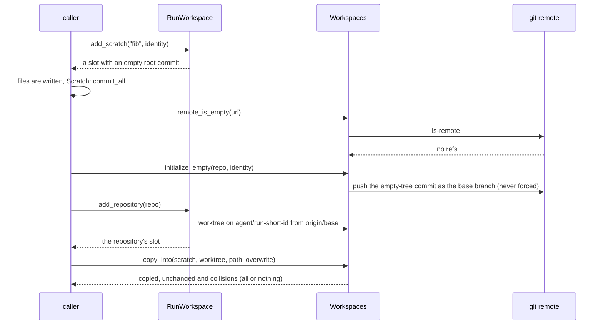
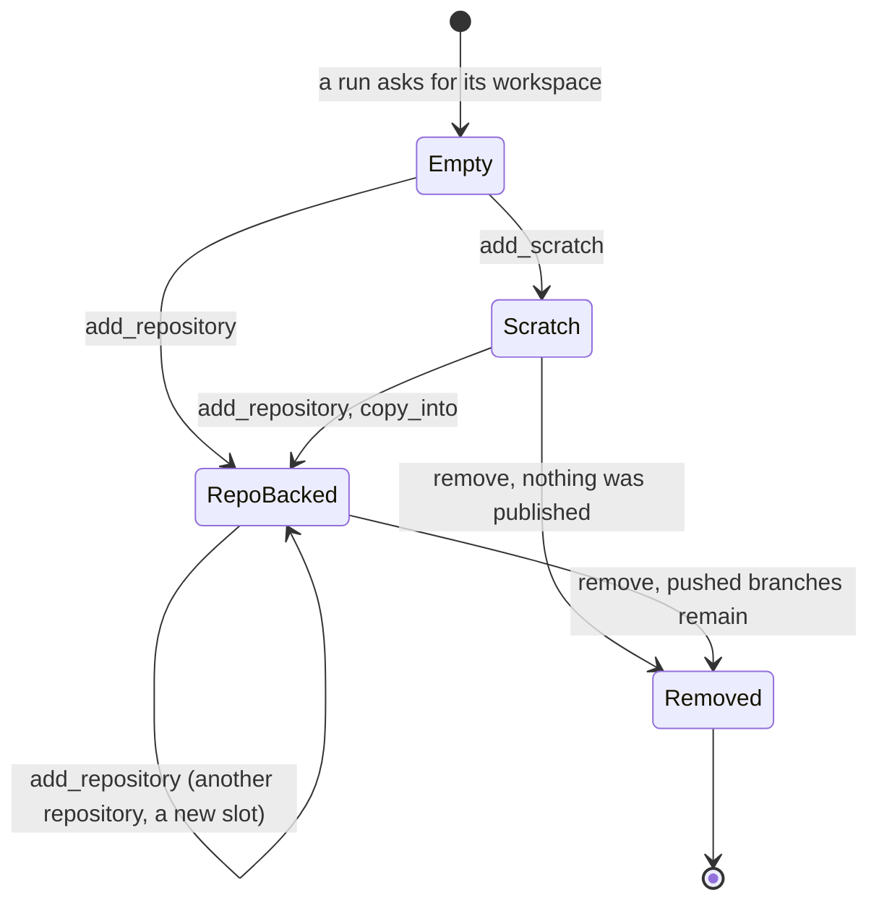

# adam-workspace

Per-run git worktrees, push and pull requests for coding agents. git is the
durable artifact: a run's result is a pushed branch and a pull request. A run's workspace holds
several repositories and scratch projects ([below](#a-runs-workspace-slots-scratch-projects-and-the-copy-between-them)).

## Where it sits

The **workspace and code-host layer** of the coder agent, used by
[`adam-coder`](../../bin/adam-coder/README.md) (and by anything that wants isolated
worktrees). It defines two ports, `GitCredentials` and `CodeHost`, and ships
their implementations in the same crate (`StaticToken`, `ScopedToken`,
`GitHub`; `MemoryCodeHost` for tests). Nothing implementation-specific appears
in a trait signature. It shells out to the `git` CLI so mirrors, worktrees and
authentication behave like the real tool.

## API at a glance

| Item | What |
|---|---|
| `Workspaces` | `new(root, creds)`, `allow_hosts(..)`, `allow_local(bool)`, **`run(run)`** (a run's workspace, below), **`runs()`** (the runs that have one on disk), **`remote_is_empty(url)`**, **`initialize_empty(&RepoRef, &GitIdentity)`**, **`wait_reachable(url, Duration)`**, `default_branch(url)`, `remove(run)` (everything of the run's workspace, the legacy worktree included), and the single-repository helpers `prepare(&RepoRef, run)`, `prepare_continuing(&RepoRef, run, existing)`, `open_existing(run)`. One shared bare mirror per repository; each run gets a worktree on `agent/<run>`. `default_branch` is what the remote's `HEAD` names (`git ls-remote --symref <url> HEAD`). A base branch the remote does not have is `NotFound` and the error lists the remote's branches (the first 30) |
| `RunWorkspace`, `Slot`, `SlotKind`, `Scratch` | a run's workspace: `slots()`, `slots_in_join_order()`, `slot(dir)`, `slot_for(&RepoRef)`, `add_repository(&RepoRef)`, `add_repository_continuing(&RepoRef, branch)`, `add_scratch(dir, &GitIdentity)`, `remove()`; a `Slot` has `dir()`, `path()`, `seq()`, `kind()` (`SlotKind::Repository(Worktree)` or `SlotKind::Scratch(Scratch)`), `worktree()`, `scratch()`; a `Scratch` has `path()`, `dir()`, `commit_all(message, &GitIdentity)` and `files()` |
| `copy_into(&Scratch, &Worktree, path, overwrite)`, `CopyReport`, `Collision` | the files of a scratch project into a worktree, all or nothing: `copied`, `unchanged`, `collisions` |
| `RepoRef`, `RepoLocation` | repository URL and base branch, parsed and validated (`RepoRef::new(url, base_branch)`, `locate()`) |
| `Worktree` | `lock_mirror` (`MirrorLock`), `path`, `dir` (the slot's name), `branch` (the branch the work ends up on, see below), `local_branch` (the run's own), `continues`, `run`, `repo`, `status`, `diff_stat`, `commit_all(message, &GitIdentity)`, `push` (the run's own branch), `publish` (moves the continued branch) |
| `GitIdentity`, `ChangedFile`, `FileStatus` | commit author and changed files |
| `GitCredentials` (trait), `DynGitCredentials` | `token_for(&RepoRef) -> SecretString` |
| `StaticToken`, `ScopedToken` | one token for any host, or bound to named hosts (`from_env(..)` for both) |
| `CodeHost` (trait), `DynCodeHost` | `open_pull_request`, `find_pull_request` (matches the head **and** `repo.base_branch`), `find_pull_request_on_head` (the head alone, whatever the base: for a continued branch), `comment_on_pull_request`; `NewPullRequest`, `PullRequest` |
| `GitHub` | GitHub REST `CodeHost`: `new(creds)`, `with_api_base(url)`; idempotent (returns the open pull request of the same head and base) |
| `MemoryCodeHost` | in-memory `CodeHost` that records pull requests and comments (`comments()`), feature `test-util` |
| `WorkspaceError`, `WorkspaceResult` | `Auth`, `NotFound`, `Invalid`, `Transient`, `RateLimited { retry_after }`, `Conflict`, `Corrupt`, `Git { .. }`, `Http { .. }`, `Io { .. }`; `#[non_exhaustive]`, see *Errors* |

**Continuing a pushed branch.** `prepare_continuing(repo, run, "agent/abc")` makes the run's worktree start from
`origin/agent/abc` (which must exist on the remote) instead of the base. The run still has its own local branch
`agent/<run>` checked out (so the worktree never collides with the one of the run that pushed `agent/abc`, and
a finished run's worktree need not be removed first), and **`Worktree::push` publishes that branch under its own
name**, also for a run that continues another: the continued branch is not moved by a push. `Worktree::publish`
does that, separately and on the caller's decision: `git push <url> agent/<run>:agent/abc`, never forced, so a
pull request from `agent/abc` is updated only when the caller lets the run's commits in (the coder does it
after its checks gate). `publish` on a worktree that continues nothing does nothing, and repeating it is a
no-op. `Worktree::branch()` is `agent/abc` (what a pull request is opened from), `local_branch()` is
`agent/<run>` and `continues()` is `Some("agent/abc")`. Only `agent/*` names can be continued (never `main`,
never a person's branch), a run that already has a branch of its own or another continued one is a `Conflict`,
no push ever forces, and a continued branch that moved on the remote makes `publish` fail with `Conflict` ("the
branch moved on the remote since this worktree was started from it"), the branch untouched and the run's commits
safe on its own branch. `diff_stat` and the pull request base are unchanged: the diff spans every run's work on
the branch.

```rust
use std::sync::Arc;
use adam_workspace::*;

let creds = Arc::new(StaticToken::from_env("GITHUB_TOKEN")?);
let workspaces = Workspaces::new("/data/workspaces".into(), creds.clone());
let repo = RepoRef::new("https://github.com/owner/repo", "main");

let wt = workspaces.prepare(&repo, "018f3a2b-7c1d-7000-8000-000000000001").await?;
// ... the agent edits files under wt.path() ...
let me = GitIdentity::new("adam", "adam@example.com");
if wt.commit_all("fix the thing", &me).await?.is_some() {
    wt.push().await?;
    let pr = GitHub::new(creds)?
        .open_pull_request(NewPullRequest {
            repo: repo.clone(),
            head: wt.branch().to_owned(),
            title: "Fix the thing".into(),
            body: "Automated change.".into(),
            draft: true,
        })
        .await?;
    println!("{}", pr.url);
}
```

Security posture: `Workspaces::allow_hosts` and `allow_local` decide which
repository URLs are accepted at all, so a token only goes to a host the
operator named. The commands that carry the token (`fetch`, `ls-remote`, `push`, `publish`) name that URL
(the canonical one for an http(s) remote) and the refspec, instead of the remote called `origin`;
`core.fsmonitor` is pinned off for every command and `GIT_CONFIG_GLOBAL` is `/dev/null` next to
`GIT_CONFIG_NOSYSTEM` unless the operator set `GIT_CONFIG_GLOBAL` in the process's own environment (a global file the
operator chose is theirs; `$HOME/.gitconfig` is not read, since code in a worktree can write it). That is not enough alone: `url.<base>.insteadOf` and `pushInsteadOf` rewrite the
URLs given on the command line too, and the mirror's configuration is shared by every run and
written by more than this crate (a model's command, OpenCode and a repository's scripts all run in
a worktree of it). So **the guard is at the credentialed call**: under the mirror lock, right before
each of those commands, the crate removes from the mirror's configuration every `url.*`, every
`remote.*` key but the two it writes, `include`s, `http.*`, `credential.*`, `core.sshCommand`,
`core.gitProxy`, `core.fsmonitor`, `core.hooksPath` and `core.askPass`, and puts `remote.origin.url` and
`remote.origin.fetch` back to what was approved. Who wrote the key does not matter. (A tool such as the coder's
`run_command` also undoes such writes when it sees them, but nothing relies on that.) The token reaches `git` only through the environment of one
invocation: never in a remote URL, `.git/config`, logs or error messages.
URLs with embedded credentials and ssh/scp forms are refused.

## A run's workspace: slots, scratch projects, and the copy between them

A run's files are `Workspaces::run(run)`: a directory of **slots** ([ADR 0008](../../docs/decisions/0008-a-workspace-holds-several-repositories.md)).

```text
<root>/git/<host>/<owner>/<name>.git    mirrors, shared by every run (unchanged)
<root>/workspaces/<run>/<dir>/          a slot: a worktree on agent/<run-short-id>, or a scratch project
<root>/workspaces/<run>.lock            the run's lock, beside its directory
<root>/meta/<run>/<dir>.json            the slot's metadata, version 2: dir, seq, kind ("repo" | "scratch"),
                                        and for a repository url, base_branch, branch, remote_branch (no secrets)
<root>/worktrees/<run>                  legacy (one worktree per run): read as a slot, removed by remove(),
<root>/meta/<run>.json                  made only by prepare / prepare_continuing
```

* **A repository slot** is a `Worktree` of one repository; `add_repository` is `prepare` for a slot. Its directory is the
  repository's name, lowercased (`<name>-<owner>` when another repository of the run has that name, a number if even that is
  taken). A run has **at most one slot per repository**: asking again returns it, whatever the base branch or the spelling
  of the address (`.git`, `file://`), and a slot whose directory was lost is made again on its own branch, keeping its
  commits. `add_repository_continuing` is `prepare_continuing`.
* **A scratch slot** is a git repository on `main` with an empty root commit (so `HEAD` exists), made by
  `add_scratch(dir, identity)` (`^[a-z0-9][a-z0-9._-]{0,63}$`, not ending `.git`; again it returns the same project; a
  crash between `git init` and the first commit is finished by the next call). `Scratch::commit_all` commits locally;
  `Scratch::files` lists tracked files and untracked ones that `.gitignore` does not exclude.
* **Order.** Every slot records `seq`, the place it joined the run, from 1; the legacy worktree is 0.
  `slots()` lists the legacy worktree first and then by directory; `slots_in_join_order()` by `seq`, whose first
  element is "the first repository". A slot whose directory is gone is not listed.
* **`copy_into(scratch, worktree, path, overwrite)`** copies the project's files under the directory `path` of the worktree
  (`.` for its root; no `..`, absolute path or `.git`), each written next to its place and renamed over it, with the
  executable bit. A symbolic link is copied only when its target is relative and stays inside the project. **All or
  nothing:** a file already there with other content (a collision unless `overwrite`), a directory or a symbolic link in the
  way or behind a link of the repository, and a link that leaves the project (a collision whatever `overwrite` says) stop
  the whole copy, and the report lists every collision with its reason. Nothing is written inside `.git`.
* **`remote_is_empty(url)`, `initialize_empty(repo, identity)`.** An empty remote (`git ls-remote` prints nothing) is given
  a commit of the empty tree (`Initial commit`) pushed as `repo.base_branch`, never forced: the only push outside `agent/*`,
  so a worktree has a base to start from. A remote with any ref is a `Conflict` and nothing is pushed, also when somebody
  pushed in between. `wait_reachable(url, within)` waits for a repository that was just created to answer `ls-remote`
  (backoff from 250 ms to 2 s; not found, a network failure and a rate limit are tried again, anything else fails at once).
* **`remove()`** deletes every slot (a worktree with its uncommitted changes, a scratch project), the legacy worktree, the
  metadata and the directory, idempotently, under the run's lock and each mirror's; the `agent/*` branches stay. A workspace
  with unreadable metadata is removed anyway. **`Workspaces::runs()`** lists the runs that have anything on disk, in either
  layout, a partly removed one too, so a sweep of finished runs can finish the job.





## Sharing a root between processes

Several worker processes may use one root (the `shared` placement of
[ADR 0002](../../docs/decisions/0002-workspace-placement.md): one RWX volume mounted by every
worker). `prepare`, `remove`, `Worktree::push` and `Worktree::publish` change a mirror (`fetch`, `worktree add` and
`remove`, config writes), and git's own lock files make a second process fail with "could not
lock". So each of them takes two locks on the mirror, in this order:

1. the in-process async lock of the mirror (as before), then
2. an exclusive advisory file lock on `<mirror>.lock`, with `std::fs::File::lock` (`flock(2)` on
   Linux), taken on a blocking thread. The file is a sibling of the mirror directory
   (`git/<host>/<owner>/<name>.git.lock`), never inside it. The lock ends with the file handle, so
   a crashed process frees it.

*Verified 2026-09-29:* `File::lock` and `File::unlock` are stable since Rust 1.89 (the MSRV is
1.94), and a second handle on the same file gets `WouldBlock` from `try_lock` until the first one
unlocks (a test program built with 1.94.1). *Unverified:* that `flock` is honoured on **NFS and
Longhorn RWX** volumes. A volume that refuses the lock fails the operation with
`WorkspaceError::Io` ("cannot lock the mirror") instead of running unlocked. Test two workers
against one repository on your volume before relying on it. The lock covers the mirror only:
two processes still must not prepare the *same run* at once (a run has one lease holder).

A root that belongs to one worker (the `affinity` and `isolated` placements) pays for one
uncontended `flock` per operation and gains nothing.

A run's workspace has a lock of its own, `<root>/workspaces/<run>.lock`, taken the same way (an in-process lock, then an
exclusive `flock` on the file beside the directory), by the operations that change its set of slots: `add_repository`,
`add_scratch` (which choose a directory and a `seq` that no other slot of the run has) and `remove` (which deletes the lock
file with the workspace). **The run's lock is taken before a mirror's, never the other way round, and never while holding
another run's**, so the locks cannot wait on each other in a circle.

## Errors

`WorkspaceError` implements `adam_error::Classify` (see
[`adam-error`](../adam-error/README.md)).

| Variant | Class |
|---|---|
| `Auth` | `Unauthenticated` |
| `NotFound` | `NotFound` |
| `Invalid` | `Invalid` |
| `Transient { message, source }` | `Transient` |
| `RateLimited { retry_after }` | `RateLimited` |
| `Conflict` (the run id is bound to another repository; a slot name is taken; the remote is not empty) | `Rejected` |
| `Corrupt` | `Corrupt` |
| `Git`, `Http`, `Io` | `Internal` |

Only `Transient` and `RateLimited` are retryable. The `GitHub` code host
answers HTTP 429, and a 403 that GitHub marks as a rate limit, with
`RateLimited`; `retry_after` is the `Retry-After` header, else the time until
`x-ratelimit-reset`, capped at one hour. HTTP 5xx and transport failures are
`Transient`, with the `reqwest` error kept as the `source` (its URL removed).
`Io` keeps the `io::Error` as its `source`. No message or source carries the
token, and a message does not repeat its source.

## Features

| Feature | Default | Effect |
|---|---|---|
| `github` | yes | the `GitHub` code host (pulls in `reqwest`) |
| `test-util` | no | `MemoryCodeHost` for downstream tests |

The only environment variable the crate reads is the one you name in
`StaticToken::from_env` / `ScopedToken::from_env` (for example `GITHUB_TOKEN`).

## Tests

Offline. The `git` CLI must be on `PATH`.

* `tests/workspace.rs`: worktrees against local bare repositories (including the configuration planted in the
  mirror, `insteadOf`, `pushInsteadOf`, `pushurl`, a second remote, a proxy and an fsmonitor, which neither the
  push, the fetch of a later run, the default branch nor `publish` follows, and which is removed; a run that continues a pushed
  branch: its files, its pushes to its own branch and the separate, fast-forward-only `publish` to the continued
  one, the names it refuses, idempotency and a restart, a branch that moved; the default branch of the remote
  and the list of branches in the error for a missing one), the host
  allowlist, local-path policy, scoped tokens, and a `wiremock` "evil" git
  host that must never be contacted. Two cases cover the file lock:
  `two_workspaces_on_one_root_do_not_trip_over_each_others_git_locks` (two `Workspaces` on one
  root, which share no in-process lock, run 16 prepare/commit/push/remove tasks; without the file
  lock it fails with "could not lock" in 5 of 5 runs) and
  `a_mirror_locked_by_another_process_makes_prepare_wait` (a lock held on the lock file blocks
  `prepare` until it is released).
* `tests/workspace.rs` also covers the workspace of slots, against local bare repositories: two repositories in one run
  (their directories, their `seq`, the order they joined, each a worktree like any other), asking for one repository twice
  (also spelled as `file://` with another base: the same slot, uncommitted work kept), three repositories called `lib` (told
  apart by their owner, found again by their own repository), a slot that continues a pushed branch, a slot whose directory was
  lost (made again on its branch, with its commit), a refused repository (nothing created, no lock file, bad run ids);
  scratch (a repository on `main` with one root commit by the given identity, no sample hooks, `files` without ignored or
  deleted files, `commit_all` once and then nothing, idempotent, bad names, a name that is a repository's, a lost root
  commit made again); `remote_is_empty` and `initialize_empty` (the empty tree, `Initial commit`, a `Conflict` the second
  time and for a remote with refs, also under another base, nothing forced, a worktree of it from the new base);
  `wait_reachable` (found at once, `NotFound` after the time, found when the repository appears meanwhile, a refused URL at
  once); `copy_into` (files, the executable bit, a link kept, ignored files left, no temporary file, again all unchanged;
  all or nothing with a collision, `overwrite` replaces files only, a directory or a link in the way, a link outside the
  project, destinations that leave the repository, a nested repository); a legacy worktree read as a slot, joined by a new
  repository (mixed layouts) and removed with it; `remove` (files and metadata and lock gone, the unpushed commit still in
  the mirror, repeatable, unreadable metadata); `runs`; and
  `two_workspaces_on_one_root_add_slots_without_clashing` (two handles, six repositories, one run from both: six slots, six
  distinct places in the order, no git lock error).
* `tests/github.rs`: the `GitHub` code host against a `wiremock` server,
  including the match on head and base and the comment on a pull request, error classes, `Retry-After` and transport source chains.
* Unit tests in `src/error.rs` (`class_table` and the source-chain checks) and
  `src/github.rs` (`retry_after_prefers_the_header_then_the_reset_time`).

No conformance testkit exists for `CodeHost` or `GitCredentials` yet.

## See also

[`adam-coder`](../../bin/adam-coder/README.md),
[`adam-acp`](../adam-acp/README.md),
[`adam-error`](../adam-error/README.md).
