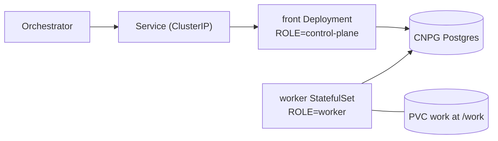

# coder chart

The coder agent (`crates/adam-coder`) as one StatefulSet (`topology: combined`, the
default) or as a front Deployment plus a worker StatefulSet (`topology: split`), with its
own CloudNativePG database, for the `netcup-k8s` cluster.

| Object | What |
|---|---|
| `StatefulSet` | 1 replica (MVP; the worker with `topology: split`), PVC `work` at `/work` on `longhorn` (mirrors and worktrees persist), `fsGroupChangePolicy: OnRootMismatch`, uid/gid 10001, probes on `/healthz` |
| `Deployment` | `topology: split` only: the front (`<release>-coder-front`), `ROLE=control-plane`, no volume, `front.replicas` replicas |
| `PodDisruptionBudget` | `topology: split` with `front.replicas` above 1: `minAvailable: 1` for the front |
| `Service` | ClusterIP only. **No Ingress**: the orchestrator reaches it in-cluster over A2A with a bearer token |
| `NetworkPolicy` | (both workloads with `topology: split`) ingress only from the namespace `another-agentic-system`; egress open (git, the gateway, registries) |
| `Cluster` (CNPG) | the coder's database; `DATABASE_URL` is the `uri` key of the `<release>-db-app` Secret CNPG creates |
| `ExternalSecret` | `ssegning-aws` / `prod/meta/test-app`; the property of each value is in `externalSecrets.properties` |

```sh
helm lint deploy/coder
helm template coder deploy/coder --namespace another-agentic-system
sh deploy/coder/tests/render-check.sh   # the guarantees above, asserted on the render
helm template coder deploy/coder --set topology=split   # front Deployment + worker StatefulSet
```

`image.tag` is bumped by `.github/workflows/coder.yml` on every green build of
main (`deploy/coder/bump-tag.sh`, also run as a dry run on pull requests).

## Secrets

| Env | AWS property (default) | Rendered for |
|---|---|---|
| `MODEL_API_KEY` | `adam_coder_model_api_key` | roles that run workers (`all`, `worker`) |
| `GITHUB_TOKEN` | `adam_coder_github_token` | roles that run workers (`all`, `worker`) |
| `A2A_BEARER_TOKENS` | `adam_coder_a2a_bearer_tokens` (comma-separated) | roles that serve A2A (`all`, `control-plane`): the front with `topology: split`, not the worker |

With `config.role=control-plane` the chart renders neither `MODEL_API_KEY` nor `GITHUB_TOKEN`,
in the pod or in the `ExternalSecret`, and `externalSecrets.properties.modelApiKey` and
`githubToken` may be `null`. For the other roles those two properties are `required`: a render
without them fails.

The orchestrator holds one of the bearer tokens (its agent list names the
environment variable it reads it from).

## Topology

`topology` chooses how the binary is deployed.



| `topology` | Deployed | ROLE |
|---|---|---|
| `combined` (default) | one StatefulSet, exactly as before this option existed (the render is byte-identical, asserted against `tests/golden/combined.yaml`) | `config.role`; unset runs `all` |
| `split` | a front `Deployment` `<release>-coder-front`, and the StatefulSet as the worker | `control-plane` on the front, `worker` on the StatefulSet |

With `split`:

* The Service keeps its name (the orchestrator's URL and `PUBLIC_URL` do not change) and
  selects the front pods. It is still the only Service. The worker has no Service: it serves
  only `/healthz`.
* The front has no volume and no model, GitHub or workspace settings. It gets `ROLE`,
  `LISTEN_ADDR`, `PUBLIC_URL`, `DATABASE_URL`, `A2A_BEARER_TOKENS` and `config.extraEnv`. The
  worker gets everything else, and neither `A2A_BEARER_TOKENS` nor `PUBLIC_URL`: the binary
  requires them only for the roles that serve A2A (`crates/adam-coder/src/config.rs`,
  verified 2026-09-29). One `ExternalSecret` still carries all three secrets.
* **The worker is the existing StatefulSet.** Same name, `serviceName`, selector and
  `volumeClaimTemplates`; only the pod template differs (`ROLE=worker`, fewer variables). A
  StatefulSet's selector and volume claims are immutable, so this is what lets
  `work-<release>-coder-0` survive a switch in either direction. The front's pods carry
  `app.kubernetes.io/name: <name>-front`, so the StatefulSet's `name` + `instance` selector
  never matches them.
* The `NetworkPolicy` selects both workloads (`name` in `<name>` and `<name>-front`, plus the
  `instance` label). The front has a `PodDisruptionBudget` (`minAvailable: 1`) when
  `front.replicas` is above 1. `front.resources` and `front.terminationGracePeriodSeconds`
  size the front; `resources`, `persistence` and `terminationGracePeriodSeconds` are the
  worker's.

Migrating a running release: `helm upgrade <release> deploy/coder --set topology=split`. The
StatefulSet rolls to `ROLE=worker` (its pod restarts, reusing the PVC, and a step cut short is
taken over once its lease expires) and the front Deployment comes up beside it. The Service
selector moves to the front once it is created; until the front is ready the Service has no
endpoints, so start the upgrade at a quiet moment. `--set topology=combined` reverses it and
deletes the front.

Render-time guards (`templates/_validate.tpl`, so a bad value fails `helm template`, not a
rollout):

* `topology` must be `combined` or `split`.
* `config.role` must be empty with `split` (the chart sets `ROLE` itself).
* `replicaCount` above 1 is refused in both topologies. **Behaviour change:** before this
  guard, `replicaCount: 2` rendered. It was never safe: runs move between workers at every
  step, so a second worker without a shared `/work` continues a run on a checkout that is not
  there and forks it into a second pull request. It will be allowed once workspace placement
  exists (planned).

## Role

`config.role` (env `ROLE`) is for `topology: combined` only. It is empty by default: the
chart does not render `ROLE`, and the binary runs `all`, the A2A server and the workers in one
pod. Set it to `control-plane` or `worker` to make that one pod run only that half (a worker
answers `/healthz` on the same port, so the probes keep working, and serves no A2A). To run the
two halves as separate workloads, use `topology: split` instead: it sets `ROLE` itself and
refuses a non-empty `config.role`. See the crate README (`crates/adam-coder/README.md`,
"Roles") for what each role starts and needs.

A control plane needs no model, GitHub or workspace configuration, so with
`config.role=control-plane` the chart leaves out `MODEL_BASE_URL`, `MODEL`, `OPENCODE_MODEL`,
`WORKERS`, `MAX_CHECK_CYCLES`, `CHECK_TIMEOUT_SECS`, `ALLOWED_REPO_HOSTS`, `GITHUB_API_URL`,
`PR_DRAFT`, `GIT_AUTHOR_*`, `WORKSPACE_ROOT` and the two secrets above (the helper
`coder.runsWorkers` in `templates/_helpers.tpl`). The render of `all` and `worker` is unchanged.
A `combined` control plane still mounts the `work` volume, because a StatefulSet's
`volumeClaimTemplates` are immutable; the `split` front has no volume at all.
`.github/workflows/coder.yml` runs kubeconform on the default, control-plane and split
renders, and `tests/render-check.sh` asserts all three.

## Repositories

`config.allowedRepoHosts` (default `github.com`; env `ALLOWED_REPO_HOSTS`) lists
the hosts a task may name a repository on. `GITHUB_TOKEN` is only ever sent to
those hosts: any other host, a local path or a URL with embedded credentials is
refused before git runs. For GitHub Enterprise add its host and set
`config.githubApiUrl` (env `GITHUB_API_URL`, default `https://api.github.com`) to
`https://<host>/api/v3`. `ALLOW_LOCAL_REPOS` is for development and tests and is not
exposed by the chart.

## Known risks

* **No database backups.** Losing the CNPG volume loses the run ledger (what
  is running, what finished), not the pushed branches or pull requests.
* **One worker.** Runs move between workers at every step (`adam-runtime`'s worker), and
  worktrees live on a ReadWriteOnce volume, so a second worker without a shared `/work` forks a
  run into a second pull request. The chart refuses `replicaCount` above 1 until workspace
  placement exists (planned). The front (`topology: split`) is stateless and scales with
  `front.replicas`.
* The `NetworkPolicy` depends on the cluster's CNI enforcing policies (it is
  otherwise inert) and on the namespace label `kubernetes.io/metadata.name`
  (set automatically by Kubernetes 1.21+).

## Verified and unverified

* `external-secrets.io/v1` is what the cluster's other charts use (checked in
  `WhyThatFunction/home-os`, 2026-09-29).
* The CNPG `Cluster` fields and the `<cluster>-app` Secret with a `uri` key are
  from the CloudNativePG documentation; not yet checked against the installed
  operator version on the cluster.
* Rendered with Helm v3.19.0 (`helm lint`, `helm template`); not applied to a
  cluster and not validated against the CRD schemas.
