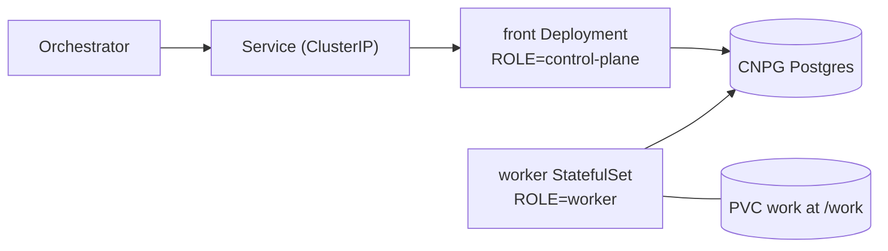

# coder chart

The coder agent (`bin/adam-coder`) as one StatefulSet (`topology: combined`, the
default) or as a front Deployment plus a worker StatefulSet (`topology: split`), with its
own CloudNativePG database, for the `netcup-k8s` cluster.

| Object | What |
|---|---|
| `StatefulSet` | `replicaCount` replicas (1 by default; the worker with `topology: split`), `work` at `/work`: a PVC per pod on `longhorn` by default (mirrors and worktrees persist), or one shared claim, see [Workspace placement](#workspace-placement); `fsGroupChangePolicy: OnRootMismatch`, uid/gid 10001, probes on `/healthz`; on the roles that run workers, the GitHub MCP server as a native sidecar, see [The GitHub MCP server](#the-github-mcp-server-a-sidecar) |
| `PersistentVolumeClaim` | `workspace.placement` `shared` or `affinity` without `workspace.sharedVolume.existingClaim` only: `<release>-coder-work`, ReadWriteMany, kept on `helm uninstall` |
| `Deployment` | `topology: split` only: the front (`<release>-coder-front`), `ROLE=control-plane`, no volume, `front.replicas` replicas |
| `PodDisruptionBudget` | `topology: split` with `front.replicas` above 1: `minAvailable: 1` for the front |
| `Service` | ClusterIP only. **No Ingress**: the orchestrator reaches it in-cluster over A2A with a bearer token |
| `NetworkPolicy` | (both workloads with `topology: split`) ingress only from the namespace `another-agentic-system`; egress open (git, the gateway, registries) |
| `Cluster` (CNPG) | the coder's database; `DATABASE_URL` is the `uri` key of the `<release>-db-app` Secret CNPG creates |
| `ExternalSecret` | `ssegning-aws` / `prod/meta/test-app`; the property of each value is in `externalSecrets.properties` |
| `ConfigMap` | `mcp.websearch.url` set or `mcp.context7.enabled` only: `<release>-coder-mcp`, one file of extra MCP servers in the shape of `mcp.json`, mounted in the pods that run workers and named by `ADAM_EXTRA_MCP_FILE`, see [Extra MCP servers](#extra-mcp-servers-web-search-and-context7) |

```sh
helm lint deploy/coder
helm template coder deploy/coder --namespace another-agentic-system
sh deploy/coder/tests/render-check.sh   # the guarantees above, asserted on the render
helm template coder deploy/coder --set topology=split   # front Deployment + worker StatefulSet
```

`image.tag` is bumped by `.github/workflows/coder.yml` on every green build of
main (`deploy/coder/bump-tag.sh`, also run as a dry run on pull requests).

## Devcontainers are off here

The coder image carries the devcontainer CLI and Podman's client, and the coder can run a repository's commands, checks and OpenCode in
that repository's `devcontainer.json` on a rootless Podman service (`DEVCONTAINER_RUNTIME=podman`, [ADR 0010](../../docs/decisions/0010-a-run-works-in-its-repositorys-devcontainer.md)).
**The chart does not turn it on, and sets none of the `DEVCONTAINER_*` variables**: the default, `off`, keeps every command in the coder's own
pod, as before. Why a pod cannot have it yet:

* The Podman service must see the coder's `/work` volume **at the same path** (a bind source is resolved by the service), so it is a
  container of the same pod (a sidecar sharing the volume) or of a pod on the same node and claim.
* A rootless Podman inside a container needs a seccomp profile that allows `unshare`, `clone` and `mount`, and `systempaths=unconfined`
  (`dev/podman/README.md`). In Kubernetes that is a custom or `Unconfined` seccomp profile and an unmasked `/proc`, which the Pod Security
  Standards' `baseline` level does not allow a workload (*unverified*: from memory of the standards, and this cluster's admission policy was
  not looked at), so it needs the cluster's agreement.
* The service is the trust boundary and sees every run's files: a deployment that has it should have the platform's sandbox
  provider (`another-agentic-platform`) make one environment per run, not one shared service.

Until then a repository's devcontainer is not used on Kubernetes: a run whose first repository has one says so in a step ("This repository has
a devcontainer, but this deployment runs without a container runtime"), and a tool that only the devcontainer has is reported as missing.

## Secrets

| Env | AWS property (default) | Rendered for |
|---|---|---|
| `MODEL_API_KEY` | `adam_coder_model_api_key` | roles that run workers (`all`, `worker`) |
| `MODEL_BASE_URL` | `model_base_url` (`externalSecrets.properties.modelBaseUrl`) | roles that run workers, only with `config.modelBaseUrlFromSecret: true`, see [The model gateway's URL from the secret](#the-model-gateways-url-from-the-secret) |
| `GITHUB_TOKEN` | `adam_coder_github_token` | roles that run workers (`all`, `worker`), with `github.auth: token` (the default) |
| `A2A_BEARER_TOKENS` | `adam_coder_a2a_bearer_tokens` (comma-separated) | roles that serve A2A (`all`, `control-plane`): the front with `topology: split`, not the worker |
| `SEARCH_MCP_TOKEN` | `search_mcp_token` (`externalSecrets.properties.searchMcpToken`) | roles that run workers, only with `mcp.websearch.url` set, see [Extra MCP servers](#extra-mcp-servers-web-search-and-context7) |
| `CONTEXT7_API_KEY` | `context7_api_key` (`externalSecrets.properties.context7ApiKey`) | roles that run workers, only with `mcp.context7.enabled`, same section |

`MODEL_BASE_URL` is a secret only by choice: the default is a literal from `config.modelBaseUrl`. With `config.role=control-plane` the chart renders neither `MODEL_API_KEY` nor `GITHUB_TOKEN`,
in the pod or in the `ExternalSecret`, and `externalSecrets.properties.modelApiKey` and
`githubToken` may be `null`. For the other roles those two properties are `required`: a render
without them fails (`githubToken` only with `github.auth: token`; see [GitHub](#github-a-token-or-an-app-installation)).

The orchestrator holds one of the bearer tokens (its agent list names the
environment variable it reads it from).

## The model gateway's URL from the secret

By default `MODEL_BASE_URL` is the literal `config.modelBaseUrl` (a placeholder, `https://gateway.example.invalid/v1`, that is never
a real gateway). A deployment that does not want its gateway's URL written in git sets `config.modelBaseUrlFromSecret: true`: the
worker's `MODEL_BASE_URL` is then a `secretKeyRef` to the chart's Secret, and the `ExternalSecret` copies one more key into it.

```yaml
externalSecrets:
  key: prod/another-agentic/env       # the AWS secret that holds model_base_url
  # properties.modelBaseUrl: model_base_url   # the default name of the JSON property
config:
  modelBaseUrlFromSecret: true        # and no config.modelBaseUrl: the placeholder, or empty, counts as unset
```

A deployment sets exactly: `config.modelBaseUrlFromSecret=true`, `externalSecrets.key` to the AWS secret that holds the property
(`prod/another-agentic/env`), and, only if the property is not called `model_base_url`, `externalSecrets.properties.modelBaseUrl`.
The AWS property itself holds the full URL with its `/v1` prefix, for example `https://api.ai.camer.digital/v1`, and that value is not in
this repository.

| | |
|---|---|
| Rendered for | the roles that run workers (`all`, `worker`; the split worker), like `MODEL_API_KEY`. A control plane and the split front render nothing, read no property, and need none: the option does nothing for them |
| In the pod | `MODEL_BASE_URL` `valueFrom.secretKeyRef` (`<secret>`, key `MODEL_BASE_URL`), once, in place of `value:` |
| In the `ExternalSecret` | `secretKey: MODEL_BASE_URL`, `remoteRef.property: externalSecrets.properties.modelBaseUrl` under `externalSecrets.key` |
| Everything else | unchanged: `MODEL`, `OPENCODE_MODEL` and `MODEL_API_KEY` are as before, and the default render is byte for byte `tests/golden/combined.yaml` |

**What reads the URL.** Only the binary, from the environment variable, at startup (`bin/adam-coder/src/config.rs`). OpenCode's inline
configuration is built from it at run time (`bin/adam-coder/src/opencode.rs`, `baseURL`), so it needs nothing from the chart. Nothing else in
the chart uses the URL: the `NetworkPolicy` leaves egress open, the extra MCP servers' file and the front do not name it. The chart renders
the literal in no template when the option is on (`tests/render-check.sh` asserts that the placeholder appears nowhere in the render). **No
Rust change and no new image are needed**: the binary already reads `MODEL_BASE_URL` and does not care where Kubernetes got it, so the chart
and the image can be deployed in any order.

**Refusals** (`templates/_validate.tpl`; each stops `helm template` and `helm install`, not the rollout):

* `config.modelBaseUrlFromSecret` is not `true` or `false` (a quoted `"false"` is refused, not read as on).
* The option with a `config.modelBaseUrl` that is a real URL: it would be written in git and ignored. **The default placeholder counts as unset**,
  and so does an empty or `null` value, so a deployment only has to leave `config.modelBaseUrl` alone; the error never prints the URL.
* The option with `MODEL_BASE_URL` in `config.extraEnv` (the chart sets it itself, and a second entry would win silently).
* The option with `externalSecrets.enabled=false` (a URL kept out of git has nowhere else to come from) or with
  `externalSecrets.properties.modelBaseUrl` empty or `null`.

**Order of operations: put the AWS property in place before turning the option on** (the same rule as the
[extra MCP servers](#extra-mcp-servers-web-search-and-context7)).

1. Add `model_base_url` to the AWS secret `externalSecrets.key` names, with the URL as its value. Check that it is not empty: a blank
   value is refused by the binary at startup (`MODEL_BASE_URL is required`, `crates/adam-service/src/config.rs`).
2. Then set `config.modelBaseUrlFromSecret=true` (and drop any `config.modelBaseUrl` of your own).

If you turn it on first, **a property that is missing in AWS fails the whole ExternalSecret sync** (see "What happens when you do not" in
the extra MCP servers' section): `MODEL_API_KEY`, `GITHUB_TOKEN` and `A2A_BEARER_TOKENS` stop being refreshed too, and the new pods wait in
`CreateContainerConfigError` for a key the Secret does not have yet. Rolling back is `config.modelBaseUrlFromSecret=false` with
`config.modelBaseUrl` set again.

**Changing the URL later.** A container reads a `secretKeyRef` at start, and the chart does not hash the Secret, so a new value in AWS
reaches the pods only when they restart (External Secrets refreshes the Secret every `externalSecrets.refreshInterval`, then
`kubectl rollout restart statefulset/<release>`): the same as `MODEL_API_KEY`.

**What this does not hide.** The URL is not a credential: it is kept out of git, not out of the cluster. It is still in the pod's environment
(visible to whoever can `exec` into it or read the pod spec, which names the Secret but not the value) and the binary logs its configuration at
startup with the URL in it (`ModelConfig`'s `Debug` prints `base_url`, `crates/adam-service/src/config.rs`), so it reaches the pod's logs. Hiding it
from the logs would be a Rust change; none is made here. Keep the credential, `MODEL_API_KEY`, in the same place as before.

## Topology

`topology` chooses how the binary is deployed.



| `topology` | Deployed | ROLE |
|---|---|---|
| `combined` (default) | one StatefulSet, exactly as before this option existed (the render is byte-identical, asserted against `tests/golden/combined.yaml`) | `config.role`; unset runs `all` |
| `split` | a front `Deployment` `<release>-coder-front`, and the StatefulSet as the worker | `control-plane` on the front, `worker` on the StatefulSet |

With `split`:

* The Service keeps its name (the orchestrator's URL and `PUBLIC_URL` do not change) and
  selects the front pods. It is still the only Service. The worker has no Service: it serves
  only `/healthz`.
* The front has no volume and no model, GitHub or workspace settings. It gets `ROLE`,
  `LISTEN_ADDR`, `PUBLIC_URL`, `DATABASE_URL`, `A2A_BEARER_TOKENS` and `config.extraEnv`. The
  worker gets everything else, and neither `A2A_BEARER_TOKENS` nor `PUBLIC_URL`: the binary
  requires them only for the roles that serve A2A (`bin/adam-coder/src/config.rs`,
  verified 2026-09-29). One `ExternalSecret` still carries all three secrets.
* **The worker is the existing StatefulSet.** Same name, `serviceName`, selector and
  `volumeClaimTemplates`; only the pod template differs (`ROLE=worker`, fewer variables). A
  StatefulSet's selector and volume claims are immutable, so this is what lets
  `work-<release>-coder-0` survive a switch in either direction. The front's pods carry
  `app.kubernetes.io/name: <name>-front`, so the StatefulSet's `name` + `instance` selector
  never matches them.
* The `NetworkPolicy` selects both workloads (`name` in `<name>` and `<name>-front`, plus the
  `instance` label). The front has a `PodDisruptionBudget` (`minAvailable: 1`) when
  `front.replicas` is above 1. `front.resources` and `front.terminationGracePeriodSeconds`
  size the front; `resources`, `persistence` and `terminationGracePeriodSeconds` are the
  worker's.

Migrating a running release: `helm upgrade <release> deploy/coder --set topology=split`. The
StatefulSet rolls to `ROLE=worker` (its pod restarts, reusing the PVC, and a step cut short is
taken over once its lease expires) and the front Deployment comes up beside it. The Service
selector moves to the front once it is created; until the front is ready the Service has no
endpoints, so start the upgrade at a quiet moment. `--set topology=combined` reverses it and
deletes the front.

Render-time guards (`templates/_validate.tpl`, so a bad value fails `helm template`, not a
rollout):

* `topology` must be `combined` or `split`.
* `config.role` must be empty with `split` (the chart sets `ROLE` itself).
* `workspace.placement` must be empty, `shared`, `affinity` or `isolated`. `a2a-only` is
  refused: every tool of the coder needs a workspace.
* `replicaCount` above 1 needs a `workspace.placement` (for a role that runs workers, which is
  every `topology: split` worker). Before this chart version it was refused outright; it was
  never safe without a placement, because runs move between workers at every step (see below).
* `shared` and `affinity` need `workspace.sharedVolume.storageClass` or
  `workspace.sharedVolume.existingClaim`: there is no default class, because most storage
  classes cannot serve ReadWriteMany and the claim would stay `Pending`.

## Workspace placement

A run moves between workers at every step, and the coder keeps its worktree in one worker's
`/work`. With more than one worker and no plan, a run that lands on a worker without its
worktree silently forks into a second pull request. `workspace.placement` is the plan
([ADR 0002](../../docs/decisions/0002-workspace-placement.md)); the chart passes it to the
binary as `WORKSPACE_PLACEMENT` (`bin/adam-coder/README.md`, "Workspace placement").

| `workspace.placement` | `/work` | Env on the roles that run workers | Runs |
|---|---|---|---|
| empty (default) | a PVC per pod (`volumeClaimTemplates`, `persistence.*`) | none: the binary defaults to `shared`, which for one worker is the same thing | any worker; `replicaCount` above 1 refused |
| `isolated` | a PVC per pod, as above | `WORKSPACE_PLACEMENT=isolated`, `WORKER_ID` = pod name | pinned to the worker that first claimed them |
| `affinity` | one ReadWriteMany claim for all pods (`workspace.sharedVolume.*`); each worker uses `/work/<pod name>` | `WORKSPACE_PLACEMENT=affinity`, `WORKER_ID` = pod name | pinned |
| `shared` | the same one claim, used as it is by every worker | `WORKSPACE_PLACEMENT=shared` | any worker may step any run |
| `a2a-only` | refused | | |

* `WORKER_ID` comes from the downward API (`metadata.name`): the pod name of a StatefulSet
  is stable across restarts, which is what makes a pinned run find its worker again. It is set
  only for `affinity` and `isolated`, the placements that pin runs (the binary exits 78 without
  it); `shared` lets the process pick its own lease identity.
* With `config.role=control-plane` (a `combined` pod that runs no workers) neither variable is
  rendered, and a placement is not required for `replicaCount` above 1.
* `workspace.sharedVolume` (`existingClaim`, `storageClass`, `size`, `accessModes`, default
  `ReadWriteMany`) is used by `shared` and `affinity` only. With `existingClaim` the chart
  creates no claim. The claim it does create is annotated `helm.sh/resource-policy: keep`.
  The volume must be writable by uid/gid 10001: the chart sets `fsGroup: 10001`, which some
  network file systems ignore, so check the mount if a worker cannot create its folder.
* **Switching placement changes the volumes.** `volumeClaimTemplates` are immutable: going
  between the per-pod volume (empty, `isolated`) and the shared one (`shared`, `affinity`)
  needs `kubectl delete statefulset <release>-coder --cascade=orphan` before `helm upgrade`. The
  old per-pod PVCs stay, and their worktrees are not visible on the shared volume. Moving
  between `isolated` and empty, or `shared` and `affinity`, only adds or removes the env.
* Moving a running release from empty to a pinning placement is safe for runs in flight: a
  run with no owner is claimed, and so owned, by the first worker that steps it.

## Role

`config.role` (env `ROLE`) is for `topology: combined` only. It is empty by default: the
chart does not render `ROLE`, and the binary runs `all`, the A2A server and the workers in one
pod. Set it to `control-plane` or `worker` to make that one pod run only that half (a worker
answers `/healthz` on the same port, so the probes keep working, and serves no A2A). To run the
two halves as separate workloads, use `topology: split` instead: it sets `ROLE` itself and
refuses a non-empty `config.role`. See the crate README (`bin/adam-coder/README.md`,
"Roles") for what each role starts and needs.

A control plane needs no model, GitHub or workspace configuration, so with
`config.role=control-plane` the chart leaves out `MODEL_BASE_URL` (the literal, or the Secret key of `config.modelBaseUrlFromSecret`), `MODEL`, `OPENCODE_MODEL`,
`WORKERS`, `MAX_CHECK_CYCLES`, `CHECK_TIMEOUT_SECS`, `WORKSPACE_SWEEP_SECS`, `ALLOWED_REPO_HOSTS`, `GITHUB_API_URL`,
`PR_DRAFT`, `GIT_AUTHOR_*`, `WORKSPACE_ROOT`, `GITHUB_MCP_URL` and the GitHub MCP server sidecar, the GitHub App settings and key volume (`github.auth: app`) and the two secrets above (the helper
`coder.runsWorkers` in `templates/_helpers.tpl`). The render of `all` and `worker` is unchanged.
A `combined` control plane still mounts the `work` volume, because a StatefulSet's
`volumeClaimTemplates` are immutable; the `split` front has no volume at all.
`.github/workflows/coder.yml` runs kubeconform on the default, control-plane and split
renders, and `tests/render-check.sh` asserts all three.

## The GitHub MCP server: a sidecar

The coder reads GitHub through the official GitHub MCP server ([ADR
0017](../../docs/decisions/0017-a-github-app-works-on-every-account-it-is-installed-on.md), D4). Every pod that runs
workers (`all`, `worker`, and the StatefulSet of `topology: split`; **not** a control plane or the split front) has it as
a **native sidecar**: an init container with `restartPolicy: Always` named `github-mcp`, the coder's own image,
`github-mcp-server http --read-only --toolsets context,repos,issues,pull_requests --listen-host 127.0.0.1 --port 8082`.
It starts before the coder, is probed (TCP, `startupProbe`) before the coder starts, restarts on its own and stops
after the coder. It holds **no credential**: no Secret, no key, no `GITHUB_TOKEN`, no volume, and no environment but
`GITHUB_HOST` when `githubMcp.host` is set. It listens on loopback only, so nothing but the coder container reaches it,
and the coder sends it the token of each call. The coder is told where it is with `GITHUB_MCP_URL`
(`http://127.0.0.1:<port>`).

```yaml
githubMcp:
  enabled: true        # false renders no sidecar and no GITHUB_MCP_URL (the coder's own GITHUB_MCP_URL is then yours to set)
  port: 8082           # the shipped agent files name 8082: another port needs an agent folder that names it
  host: ""             # GITHUB_HOST of the server, for GitHub Enterprise: the first of config.allowedRepoHosts (not checked)
  resources: { requests: { cpu: 50m, memory: 64Mi }, limits: { memory: 256Mi } }
```

* **Kubernetes 1.29 or later** (native sidecars are beta and on by default from 1.29 and GA in 1.33: *unverified*, from
  memory; `tests` render for 1.31 in kubeconform). A cluster without them would treat `restartPolicy` on an init
  container as an error, or run it as a one-shot init container that never finishes.
* `MCP_ALLOW_STDIO` stays on the roles that run workers for one release, for a consumer whose vendored agent folder
  still starts `github-mcp-server stdio` as a child process. The embedded files no longer do.
* `githubMcp.port` outside 1 to 65535 fails the render. A control plane renders none of it.

## GitHub: a token or an App installation

`github.auth` (default `token`) picks how the roles that run workers authenticate to GitHub
([ADR 0009](../../docs/decisions/0009-github-per-installation-read-through-mcp.md)); the binary
accepts exactly one (`bin/adam-coder/README.md`, "GitHub credentials").

* **`token`** is the chart as it was: `GITHUB_TOKEN` from the `ExternalSecret`
  (`externalSecrets.properties.githubToken`). The default render is byte for byte what it was
  (`tests/golden/combined.yaml`).
* **`app`** is a GitHub App. Set `github.app.id` (the application ID or the client ID),
  `github.app.privateKeySecret`, the name of a Secret in the release's namespace with one key, **`private-key.pem`**: the
  App's private key as GitHub gives it (PKCS#1) or PKCS#8, and **exactly one of**
  * `github.app.installationId`, a positive integer: the App is **pinned** to that one installation, which serves every
    repository (`GITHUB_APP_INSTALLATION_ID`; a deployment that works on one account), or
  * `github.app.owners`, a list of accounts (users and organisations; `*` for every account the App is installed on, which
    the coder warns about): **no pin**, the installation of each repository's owner is found with the App's key, and a
    token is minted for each, so one deployment works on several accounts (`GITHUB_APP_OWNERS`, [ADR
    0017](../../docs/decisions/0017-a-github-app-works-on-every-account-it-is-installed-on.md)). There is **no default
    list**: a public App can be installed by anyone, so the list, and not the installation, says which accounts the coder may
    act for. A list of names or a string separated by commas or spaces; compared without case.

  The chart mounts the key read-only at `/var/run/secrets/github-app` (mode 0440, group `fsGroup`) and sets
  `GITHUB_APP_ID`, `GITHUB_APP_PRIVATE_KEY_PATH` and the pin or the owners. `GITHUB_TOKEN` is neither
  rendered nor required, and the `ExternalSecret` has no entry for it. **The chart never holds the key**: make the
  Secret yourself, or with another `ExternalSecret`, for example
  `kubectl create secret generic coder-github-app --from-file=private-key.pem=app.pem`.

```sh
helm template coder deploy/coder --set github.auth=app --set github.app.id=1234567 \
  --set github.app.installationId=98765432 --set github.app.privateKeySecret=coder-github-app
helm template coder deploy/coder --set github.auth=app --set github.app.id=1234567 \
  --set 'github.app.owners={acme,octocat}' --set github.app.privateKeySecret=coder-github-app
```

The render fails, naming the value, for `github.auth` that is neither, and (for a role that runs workers, in app
mode) for an empty `github.app.id`, an `installationId` that is not a positive integer, **both `installationId` and
`owners`**, **neither of them**, or an empty `privateKeySecret`. A numeric `id` or `installationId` from a values file keeps its
digits (Helm reads such numbers as floats; the chart converts them). A control plane renders no GitHub setting and no key volume in
either mode, and with `topology: split` only the worker StatefulSet has them. The coder reads the key at startup: after
rotating the Secret, restart the pods. The key is a second volume of the pod, beside the per-pod claim or the shared one
(`.github/workflows/coder.yml` runs kubeconform on the renders, with the pin and with owners; `tests/render-check.sh` asserts
them). *Unverified:* a live rollout against a real App; the renders are checked, not applied.

## Repositories

`config.allowedRepoHosts` (default `github.com`; env `ALLOWED_REPO_HOSTS`) lists
the hosts a task may name a repository on. The GitHub credential (`GITHUB_TOKEN`, or the App's installation token)
is only ever sent to those hosts: any other host, a local path or a URL with embedded credentials is
refused before git runs. For GitHub Enterprise add its host and set
`config.githubApiUrl` (env `GITHUB_API_URL`, default `https://api.github.com`) to
`https://<host>/api/v3`. `ALLOW_LOCAL_REPOS` is for development and tests and is not
exposed by the chart.

`github.createRepoOwners` (default empty; env `CREATE_REPO_OWNERS`, workers only) lists the owners the coder may
create repositories for. Empty turns the `create_repository` tool off. With owners listed it still asks the person
before every creation, makes the repository private and empty unless asked otherwise, and refuses an owner that is
not in the list. A GitHub App creates for organisations only and needs the **Administration** permission on the
organisation; a token needs the `repo` scope.

## Agent files

The binary reads its prompt, card and skills from the folder `ADAM_AGENT_DIR` names, once, at startup
(`bin/adam-coder/README.md`, "Where the prompt and the card live"); unset, it runs the copy embedded in the
image, which is what this chart deploys. **The chart does not expose a folder**: it has no volume for one, and
`config.extraEnv.ADAM_AGENT_DIR` alone would name a path the pod does not have, which stops the pod with exit code
78. What the chart can add to the embedded files is MCP servers, as one extra file
([below](#extra-mcp-servers-web-search-and-context7)): the prompt and the card stay in the binary, so the chart and
the image cannot disagree about them.

## Extra MCP servers: web search and Context7

Two MCP servers the coder can have **in every conversation**, beside the GitHub one, both **off by default**. With
both off the render is byte for byte what it was (`tests/golden/combined.yaml`). The model sees their tools as
`websearch__<tool>` and `context7__<tool>`, listed in its `mcp.json` under the server ids `websearch` and `context7`.

| | `websearch` | `context7` |
|---|---|---|
| What | our web search server (Brave behind our own MCP pod, deployed by the `another-agentic-system` chart) | Context7, hosted (library documentation) |
| Turned on by | `mcp.websearch.url`: **the URL of the Service**, in cluster (empty is off) | `mcp.context7.enabled: true` (a boolean) |
| URL | the value, for example `http://<service>.<namespace>.svc.cluster.local:<port>/mcp` | `mcp.context7.url`, default `https://mcp.context7.com/mcp` |
| Header | `mcp.websearch.header: value`, default `Authorization: Bearer <token>` | `Authorization: Bearer <key>` (`mcp.context7.header` and `valuePrefix` are values too) |
| Secret env var | `SEARCH_MCP_TOKEN` | `CONTEXT7_API_KEY` |
| AWS property | `search_mcp_token` (`externalSecrets.properties.searchMcpToken`) | `context7_api_key` (`externalSecrets.properties.context7ApiKey`) |
| `optional` | `mcp.websearch.optional`, default `true` | `mcp.context7.optional`, default `true` |
| Optional | `mcp.websearch.tools`: an allow-list (a list; empty keeps every tool of the server) | `mcp.context7.tools`, for example `[resolve-library-id, query-docs]` |
| Plain `http` | needs `mcp.websearch.allowInsecure: true` (below) | needs the same opt-in |

```yaml
externalSecrets:
  key: prod/another-agentic/env        # the AWS secret that holds search_mcp_token and context7_api_key
mcp:
  websearch:
    url: https://<service>.<namespace>.svc.cluster.local:<port>/mcp   # the web search Service of the another-agentic-system release
    # url: http://...  needs  allowInsecure: true  (see below)
  context7:
    enabled: true
```

**How it works.** The coder reads one agent folder, and the image holds the shipped one only inside the binary. The
chart therefore does not copy it: with either server on it renders **one file of servers**, the ConfigMap
`<release>-coder-mcp` (`mcp.json` in the shape of the agent's, with only `websearch` and/or `context7`), mounts it
read-only at `/etc/adam/extra-mcp` in the pods that run workers (the combined pod, the split worker; not the front, not a
control plane), and sets `ADAM_EXTRA_MCP_FILE=/etc/adam/extra-mcp/mcp.json`. At startup the worker adds those servers to
the agent's own (`github`) before it connects them ([ADR 0018](../../docs/decisions/0018-extra-mcp-servers-are-a-file-merged-over-the-agents-own.md),
`bin/adam-coder/README.md`, "Extra MCP servers"); a name clash with one of the agent's own servers stops it (exit 78). A
change to the file rolls the pods (`checksum/extra-mcp`): the file is read at startup only, and a changed tool set can
fail the replay of a run that is mid-turn, as any deploy of new code can
([ADR 0004](../../docs/decisions/0004-agent-folders-at-run-time.md)). The rendered entries:

```json
"websearch": { "type": "http", "url": "<mcp.websearch.url>", "headers": { "Authorization": "Bearer ${SEARCH_MCP_TOKEN}" }, "optional": true },
"context7":  { "type": "http", "url": "https://mcp.context7.com/mcp", "headers": { "Authorization": "Bearer ${CONTEXT7_API_KEY}" }, "optional": true }
```

`tests/render-check.sh` parses the rendered file with `jq`. The same entries, in a file next to the agent's, were loaded by
`adam_assembly::AgentDef::with_extra_mcp_file` (tests in `crates/adam-assembly/tests/extra_mcp.rs`): the same parser as
`mcp.json`, the `${VAR}` references `CONTEXT7_API_KEY` and `SEARCH_MCP_TOKEN`.

**Order of operations: put the AWS properties in place before turning an option on.**

1. Add `search_mcp_token` and/or `context7_api_key` to the AWS secret `externalSecrets.key` names
   (`prod/another-agentic/env`). Check them: an **empty value** is refused by the binary (below).
2. Make sure the web search Service is up and its token is the one you stored.
3. Then set `mcp.websearch.url` / `mcp.context7.enabled`.

What happens when you do not:

* **A property that is missing in AWS fails the whole ExternalSecret sync**: External Secrets does not create the Secret
  with the keys it could read, it reports the error and keeps the previous Secret. The existing keys (`MODEL_API_KEY`,
  `GITHUB_TOKEN`, `A2A_BEARER_TOKENS`) stop being refreshed too, so a rotation of those is frozen until the property is
  there. This is why the properties come first.
* **A key that is missing from the Secret** (the Secret exists but the sync has not added the key yet) leaves the new pods
  in `CreateContainerConfigError`; the pods that are running keep running.
* **An empty value** (the property exists and is blank) is not sent: the binary refuses a header whose `${VAR}` is empty. A
  required server stops the worker (exit 78, naming the variable, never the value); an `optional` one is skipped with a
  warning (`the optional MCP server is skipped`), so web search is silently absent until the value is fixed. Look for that
  line in the worker's log.

**Optional servers.** Both are `optional: true` by default (`mcp.websearch.optional`, `mcp.context7.optional`): a
third party that is down, a key with no value, a refused credential or an allow-list that names a tool the server lacks is
**skipped with a warning** and the worker starts without it, instead of exiting 69 and crash-looping the coder. The coder
does not retry later: its tools exist from the next restart. Set `optional: false` for a server the coder must not run
without.

**The trust boundary.**

* **The keys are never chart values.** They come from the `ExternalSecret` (`SEARCH_MCP_TOKEN`, `CONTEXT7_API_KEY`) into the
  environment of the roles that run workers only, and the file holds `${SEARCH_MCP_TOKEN}` and `${CONTEXT7_API_KEY}`,
  expanded when a worker starts. The ConfigMap has no secret in it. `valuePrefix` is plain text (`Bearer `): a `${` in it
  fails the render. With `externalSecrets.enabled: false` the render fails too, because a key has nowhere else to come from.
* **The binary keeps those keys from repository code.** Every `${VAR}` a `mcp.json` names (the agent's own and this file's)
  is hidden from every process a run starts (a repository's checks, `run_command`, OpenCode), and its value is scrubbed from
  tool output, errors and steps, so the model never sees it (commits are not scrubbed). The coder's own `git` starts from an
  empty environment, and the process is non-dumpable, so a child cannot read `/proc/<pid>/environ`. What remains (the token
  of the one `git` invocation that fetches or pushes, a proxy URL with a password, a process with `CAP_SYS_PTRACE`) is listed
  in `bin/adam-coder/README.md`, "Extra MCP servers" and [ADR 0018](../../docs/decisions/0018-extra-mcp-servers-are-a-file-merged-over-the-agents-own.md).
* **All the properties are read under `externalSecrets.key`.** Set it to the AWS secret that holds `search_mcp_token` and
  `context7_api_key` (and the coder's own properties, or point them at the properties of that secret).
* **The URL of a server is no secret** and the render refuses one with a user name, a password, a `${VAR}` or a scheme other
  than `http`/`https` in it (a URL reaches the logs).
* **Plain `http` is an explicit opt-in, never automatic.** The coder refuses a plain `http` URL to another machine unless
  `MCP_ALLOW_INSECURE=true`. The render **fails** for such a URL (websearch, or a Context7 URL you override) without
  `mcp.websearch.allowInsecure: true` (the chart then sets `MCP_ALLOW_INSECURE=true` on the workers) or the deployment's own
  `config.extraEnv.MCP_ALLOW_INSECURE: "true"` (the chart then sets nothing, so it is not duplicated). **That variable is one
  switch**: it applies to every MCP server of the agent, and to the thread-tools endpoints that A2A senders announce
  (`serve.rs`, `adam-ui`'s thread-tools client), and the bearer crosses the network in the clear. Serve the Service over `https`
  where you can; an `https` or loopback URL needs none of this.
* **Context7 is hosted**: its API key goes out of the cluster, in an `Authorization` header over HTTPS, and what the model
  asks of it (a library name, a question) is sent to Context7.

**NetworkPolicy.** The chart's `NetworkPolicy` restricts ingress only (`policyTypes: [Ingress]`), so egress from the coder to
the web search Service (same namespace or another) and to `mcp.context7.com` on 443 is allowed with nothing added;
`tests/render-check.sh` asserts that no `Egress` rule appears when they are on. Do not add `Egress` to that policy without
adding both. The web search Service's own `NetworkPolicy` (in the `another-agentic-system` chart) must admit the coder's
pods, and a cluster-wide default-deny egress is the cluster's to open for Context7's host.

**The GitHub sidecar's port.** The agent's own `mcp.json` names the `github` server at `http://127.0.0.1:8082/`, and the coder
refuses a `github` URL whose origin is not `GITHUB_MCP_URL`. `githubMcp.port` sets `GITHUB_MCP_URL` and the sidecar's port
but not the embedded file, so **any value other than 8082 stops the worker (exit 78)** until the agent's files name that
port: this was already so before the extra servers, and the extra file never touches `github`.

**Facts about Context7**, *verified 2026-10-04* in Context7's documentation
(<https://context7.com/docs/resources/all-clients>, <https://github.com/upstash/context7>): the remote MCP endpoint is
`https://mcp.context7.com/mcp` (`/mcp/oauth` is its OAuth variant); the API key is sent as `Authorization: Bearer
YOUR_API_KEY` (the documentation's configurations for the clients it lists use that header, not a `CONTEXT7_API_KEY`
header); its tools are `resolve-library-id` and `query-docs`. *Unverified*: that the server accepts a key obtained
from the dashboard for every plan, and the web search server's own header and tool names (the system side is built in
parallel): `mcp.websearch.header`, `valuePrefix` and `tools` are values for that reason. *Unverified*: how External Secrets
behaves for a missing property beyond what its documentation says (the sync fails and the Secret is not updated); not tried
on the cluster.

## Known risks

* **No database backups.** Losing the CNPG volume loses the run ledger (what
  is running, what finished), not the pushed branches or pull requests.
* **A pinned run whose worker never returns is stranded.** With `affinity` or `isolated` a
  run is stepped only by the worker that first claimed it. If that pod is scaled in, or its
  volume is deleted (always the case for `isolated` when the PVC is lost), no other worker
  claims the run and nothing reports it. Adoption is future work (ADR 0002, Consequences). Keep
  `replicaCount` from going down and keep the volumes; do not use `isolated` for storage you
  cannot afford to lose.
* **`flock` on network volumes is unverified.** `shared` relies on the cross-process mirror
  lock, which uses `flock(2)` on the volume. *Unverified 2026-09-29* for NFS and for Longhorn
  RWX (which is NFS behind a share manager). Before relying on `shared` on such a volume, run
  two workers against one repository. `affinity` gives each worker its own folder, so two
  workers never share a mirror; it still needs the ReadWriteMany volume but not a working
  `flock`.
* **The chart has not been applied with more than one worker.** The renders are checked
  (`tests/render-check.sh`, kubeconform); a live two-worker rollout is not. The front
  (`topology: split`) is stateless and scales with `front.replicas`.
* The `NetworkPolicy` depends on the cluster's CNI enforcing policies (it is
  otherwise inert) and on the namespace label `kubernetes.io/metadata.name`
  (set automatically by Kubernetes 1.21+).

## Verified and unverified

* `external-secrets.io/v1` is what the cluster's other charts use (checked in
  `WhyThatFunction/home-os`, 2026-09-29).
* The CNPG `Cluster` fields and the `<cluster>-app` Secret with a `uri` key are
  from the CloudNativePG documentation; not yet checked against the installed
  operator version on the cluster.
* Rendered with Helm v3.19.0 (`helm lint`, `helm template`); not applied to a
  cluster and not validated against the CRD schemas.
