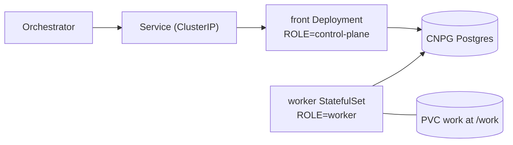

# coder chart

The coder agent (`bin/adam-coder`) as one StatefulSet (`topology: combined`, the
default) or as a front Deployment plus a worker StatefulSet (`topology: split`), with its
own CloudNativePG database, for the `netcup-k8s` cluster.

| Object | What |
|---|---|
| `StatefulSet` | `replicaCount` replicas (1 by default; the worker with `topology: split`), `work` at `/work`: a PVC per pod on `longhorn` by default (mirrors and worktrees persist), or one shared claim, see [Workspace placement](#workspace-placement); `fsGroupChangePolicy: OnRootMismatch`, uid/gid 10001, probes on `/healthz`; on the roles that run workers, the GitHub MCP server as a native sidecar, see [The GitHub MCP server](#the-github-mcp-server-a-sidecar) |
| `PersistentVolumeClaim` | `workspace.placement` `shared` or `affinity` without `workspace.sharedVolume.existingClaim` only: `<release>-coder-work`, ReadWriteMany, kept on `helm uninstall` |
| `Deployment` | `topology: split` only: the front (`<release>-coder-front`), `ROLE=control-plane`, no volume, `front.replicas` replicas |
| `PodDisruptionBudget` | `topology: split` with `front.replicas` above 1: `minAvailable: 1` for the front |
| `Service` | ClusterIP only. **No Ingress**: the orchestrator reaches it in-cluster over A2A with a bearer token |
| `NetworkPolicy` | (both workloads with `topology: split`) ingress only from the namespace `another-agentic-system`; egress open (git, the gateway, registries) |
| `Cluster` (CNPG) | the coder's database; `DATABASE_URL` is the `uri` key of the `<release>-db-app` Secret CNPG creates |
| `ExternalSecret` | `ssegning-aws` / `prod/meta/test-app`; the property of each value is in `externalSecrets.properties` |

```sh
helm lint deploy/coder
helm template coder deploy/coder --namespace another-agentic-system
sh deploy/coder/tests/render-check.sh   # the guarantees above, asserted on the render
helm template coder deploy/coder --set topology=split   # front Deployment + worker StatefulSet
```

`image.tag` is bumped by `.github/workflows/coder.yml` on every green build of
main (`deploy/coder/bump-tag.sh`, also run as a dry run on pull requests).

## Devcontainers are off here

The coder image carries the devcontainer CLI and Podman's client, and the coder can run a repository's commands, checks and OpenCode in
that repository's `devcontainer.json` on a rootless Podman service (`DEVCONTAINER_RUNTIME=podman`, [ADR 0010](../../docs/decisions/0010-a-run-works-in-its-repositorys-devcontainer.md)).
**The chart does not turn it on, and sets none of the `DEVCONTAINER_*` variables**: the default, `off`, keeps every command in the coder's own
pod, as before. Why a pod cannot have it yet:

* The Podman service must see the coder's `/work` volume **at the same path** (a bind source is resolved by the service), so it is a
  container of the same pod (a sidecar sharing the volume) or of a pod on the same node and claim.
* A rootless Podman inside a container needs a seccomp profile that allows `unshare`, `clone` and `mount`, and `systempaths=unconfined`
  (`dev/podman/README.md`). In Kubernetes that is a custom or `Unconfined` seccomp profile and an unmasked `/proc`, which the Pod Security
  Standards' `baseline` level does not allow a workload (*unverified*: from memory of the standards, and this cluster's admission policy was
  not looked at), so it needs the cluster's agreement.
* The service is the trust boundary and sees every run's files: a deployment that has it should have the platform's sandbox
  provider (`another-agentic-platform`) make one environment per run, not one shared service.

Until then a repository's devcontainer is not used on Kubernetes: a run whose first repository has one says so in a step ("This repository has
a devcontainer, but this deployment runs without a container runtime"), and a tool that only the devcontainer has is reported as missing.

## Secrets

| Env | AWS property (default) | Rendered for |
|---|---|---|
| `MODEL_API_KEY` | `adam_coder_model_api_key` | roles that run workers (`all`, `worker`) |
| `GITHUB_TOKEN` | `adam_coder_github_token` | roles that run workers (`all`, `worker`), with `github.auth: token` (the default) |
| `A2A_BEARER_TOKENS` | `adam_coder_a2a_bearer_tokens` (comma-separated) | roles that serve A2A (`all`, `control-plane`): the front with `topology: split`, not the worker |

With `config.role=control-plane` the chart renders neither `MODEL_API_KEY` nor `GITHUB_TOKEN`,
in the pod or in the `ExternalSecret`, and `externalSecrets.properties.modelApiKey` and
`githubToken` may be `null`. For the other roles those two properties are `required`: a render
without them fails (`githubToken` only with `github.auth: token`; see [GitHub](#github-a-token-or-an-app-installation)).

The orchestrator holds one of the bearer tokens (its agent list names the
environment variable it reads it from).

## Topology

`topology` chooses how the binary is deployed.



| `topology` | Deployed | ROLE |
|---|---|---|
| `combined` (default) | one StatefulSet, exactly as before this option existed (the render is byte-identical, asserted against `tests/golden/combined.yaml`) | `config.role`; unset runs `all` |
| `split` | a front `Deployment` `<release>-coder-front`, and the StatefulSet as the worker | `control-plane` on the front, `worker` on the StatefulSet |

With `split`:

* The Service keeps its name (the orchestrator's URL and `PUBLIC_URL` do not change) and
  selects the front pods. It is still the only Service. The worker has no Service: it serves
  only `/healthz`.
* The front has no volume and no model, GitHub or workspace settings. It gets `ROLE`,
  `LISTEN_ADDR`, `PUBLIC_URL`, `DATABASE_URL`, `A2A_BEARER_TOKENS` and `config.extraEnv`. The
  worker gets everything else, and neither `A2A_BEARER_TOKENS` nor `PUBLIC_URL`: the binary
  requires them only for the roles that serve A2A (`bin/adam-coder/src/config.rs`,
  verified 2026-09-29). One `ExternalSecret` still carries all three secrets.
* **The worker is the existing StatefulSet.** Same name, `serviceName`, selector and
  `volumeClaimTemplates`; only the pod template differs (`ROLE=worker`, fewer variables). A
  StatefulSet's selector and volume claims are immutable, so this is what lets
  `work-<release>-coder-0` survive a switch in either direction. The front's pods carry
  `app.kubernetes.io/name: <name>-front`, so the StatefulSet's `name` + `instance` selector
  never matches them.
* The `NetworkPolicy` selects both workloads (`name` in `<name>` and `<name>-front`, plus the
  `instance` label). The front has a `PodDisruptionBudget` (`minAvailable: 1`) when
  `front.replicas` is above 1. `front.resources` and `front.terminationGracePeriodSeconds`
  size the front; `resources`, `persistence` and `terminationGracePeriodSeconds` are the
  worker's.

Migrating a running release: `helm upgrade <release> deploy/coder --set topology=split`. The
StatefulSet rolls to `ROLE=worker` (its pod restarts, reusing the PVC, and a step cut short is
taken over once its lease expires) and the front Deployment comes up beside it. The Service
selector moves to the front once it is created; until the front is ready the Service has no
endpoints, so start the upgrade at a quiet moment. `--set topology=combined` reverses it and
deletes the front.

Render-time guards (`templates/_validate.tpl`, so a bad value fails `helm template`, not a
rollout):

* `topology` must be `combined` or `split`.
* `config.role` must be empty with `split` (the chart sets `ROLE` itself).
* `workspace.placement` must be empty, `shared`, `affinity` or `isolated`. `a2a-only` is
  refused: every tool of the coder needs a workspace.
* `replicaCount` above 1 needs a `workspace.placement` (for a role that runs workers, which is
  every `topology: split` worker). Before this chart version it was refused outright; it was
  never safe without a placement, because runs move between workers at every step (see below).
* `shared` and `affinity` need `workspace.sharedVolume.storageClass` or
  `workspace.sharedVolume.existingClaim`: there is no default class, because most storage
  classes cannot serve ReadWriteMany and the claim would stay `Pending`.

## Workspace placement

A run moves between workers at every step, and the coder keeps its worktree in one worker's
`/work`. With more than one worker and no plan, a run that lands on a worker without its
worktree silently forks into a second pull request. `workspace.placement` is the plan
([ADR 0002](../../docs/decisions/0002-workspace-placement.md)); the chart passes it to the
binary as `WORKSPACE_PLACEMENT` (`bin/adam-coder/README.md`, "Workspace placement").

| `workspace.placement` | `/work` | Env on the roles that run workers | Runs |
|---|---|---|---|
| empty (default) | a PVC per pod (`volumeClaimTemplates`, `persistence.*`) | none: the binary defaults to `shared`, which for one worker is the same thing | any worker; `replicaCount` above 1 refused |
| `isolated` | a PVC per pod, as above | `WORKSPACE_PLACEMENT=isolated`, `WORKER_ID` = pod name | pinned to the worker that first claimed them |
| `affinity` | one ReadWriteMany claim for all pods (`workspace.sharedVolume.*`); each worker uses `/work/<pod name>` | `WORKSPACE_PLACEMENT=affinity`, `WORKER_ID` = pod name | pinned |
| `shared` | the same one claim, used as it is by every worker | `WORKSPACE_PLACEMENT=shared` | any worker may step any run |
| `a2a-only` | refused | | |

* `WORKER_ID` comes from the downward API (`metadata.name`): the pod name of a StatefulSet
  is stable across restarts, which is what makes a pinned run find its worker again. It is set
  only for `affinity` and `isolated`, the placements that pin runs (the binary exits 78 without
  it); `shared` lets the process pick its own lease identity.
* With `config.role=control-plane` (a `combined` pod that runs no workers) neither variable is
  rendered, and a placement is not required for `replicaCount` above 1.
* `workspace.sharedVolume` (`existingClaim`, `storageClass`, `size`, `accessModes`, default
  `ReadWriteMany`) is used by `shared` and `affinity` only. With `existingClaim` the chart
  creates no claim. The claim it does create is annotated `helm.sh/resource-policy: keep`.
  The volume must be writable by uid/gid 10001: the chart sets `fsGroup: 10001`, which some
  network file systems ignore, so check the mount if a worker cannot create its folder.
* **Switching placement changes the volumes.** `volumeClaimTemplates` are immutable: going
  between the per-pod volume (empty, `isolated`) and the shared one (`shared`, `affinity`)
  needs `kubectl delete statefulset <release>-coder --cascade=orphan` before `helm upgrade`. The
  old per-pod PVCs stay, and their worktrees are not visible on the shared volume. Moving
  between `isolated` and empty, or `shared` and `affinity`, only adds or removes the env.
* Moving a running release from empty to a pinning placement is safe for runs in flight: a
  run with no owner is claimed, and so owned, by the first worker that steps it.

## Role

`config.role` (env `ROLE`) is for `topology: combined` only. It is empty by default: the
chart does not render `ROLE`, and the binary runs `all`, the A2A server and the workers in one
pod. Set it to `control-plane` or `worker` to make that one pod run only that half (a worker
answers `/healthz` on the same port, so the probes keep working, and serves no A2A). To run the
two halves as separate workloads, use `topology: split` instead: it sets `ROLE` itself and
refuses a non-empty `config.role`. See the crate README (`bin/adam-coder/README.md`,
"Roles") for what each role starts and needs.

A control plane needs no model, GitHub or workspace configuration, so with
`config.role=control-plane` the chart leaves out `MODEL_BASE_URL`, `MODEL`, `OPENCODE_MODEL`,
`WORKERS`, `MAX_CHECK_CYCLES`, `CHECK_TIMEOUT_SECS`, `WORKSPACE_SWEEP_SECS`, `ALLOWED_REPO_HOSTS`, `GITHUB_API_URL`,
`PR_DRAFT`, `GIT_AUTHOR_*`, `WORKSPACE_ROOT`, `GITHUB_MCP_URL` and the GitHub MCP server sidecar, the GitHub App settings and key volume (`github.auth: app`) and the two secrets above (the helper
`coder.runsWorkers` in `templates/_helpers.tpl`). The render of `all` and `worker` is unchanged.
A `combined` control plane still mounts the `work` volume, because a StatefulSet's
`volumeClaimTemplates` are immutable; the `split` front has no volume at all.
`.github/workflows/coder.yml` runs kubeconform on the default, control-plane and split
renders, and `tests/render-check.sh` asserts all three.

## The GitHub MCP server: a sidecar

The coder reads GitHub through the official GitHub MCP server ([ADR
0017](../../docs/decisions/0017-a-github-app-works-on-every-account-it-is-installed-on.md), D4). Every pod that runs
workers (`all`, `worker`, and the StatefulSet of `topology: split`; **not** a control plane or the split front) has it as
a **native sidecar**: an init container with `restartPolicy: Always` named `github-mcp`, the coder's own image,
`github-mcp-server http --read-only --toolsets context,repos,issues,pull_requests --listen-host 127.0.0.1 --port 8082`.
It starts before the coder, is probed (TCP, `startupProbe`) before the coder starts, restarts on its own and stops
after the coder. It holds **no credential**: no Secret, no key, no `GITHUB_TOKEN`, no volume, and no environment but
`GITHUB_HOST` when `githubMcp.host` is set. It listens on loopback only, so nothing but the coder container reaches it,
and the coder sends it the token of each call. The coder is told where it is with `GITHUB_MCP_URL`
(`http://127.0.0.1:<port>`).

```yaml
githubMcp:
  enabled: true        # false renders no sidecar and no GITHUB_MCP_URL (the coder's own GITHUB_MCP_URL is then yours to set)
  port: 8082           # the shipped agent files name 8082: another port needs an agent folder that names it
  host: ""             # GITHUB_HOST of the server, for GitHub Enterprise: the first of config.allowedRepoHosts (not checked)
  resources: { requests: { cpu: 50m, memory: 64Mi }, limits: { memory: 256Mi } }
```

* **Kubernetes 1.29 or later** (native sidecars are beta and on by default from 1.29 and GA in 1.33: *unverified*, from
  memory; `tests` render for 1.31 in kubeconform). A cluster without them would treat `restartPolicy` on an init
  container as an error, or run it as a one-shot init container that never finishes.
* `MCP_ALLOW_STDIO` stays on the roles that run workers for one release, for a consumer whose vendored agent folder
  still starts `github-mcp-server stdio` as a child process. The embedded files no longer do.
* `githubMcp.port` outside 1 to 65535 fails the render. A control plane renders none of it.

## GitHub: a token or an App installation

`github.auth` (default `token`) picks how the roles that run workers authenticate to GitHub
([ADR 0009](../../docs/decisions/0009-github-per-installation-read-through-mcp.md)); the binary
accepts exactly one (`bin/adam-coder/README.md`, "GitHub credentials").

* **`token`** is the chart as it was: `GITHUB_TOKEN` from the `ExternalSecret`
  (`externalSecrets.properties.githubToken`). The default render is byte for byte what it was
  (`tests/golden/combined.yaml`).
* **`app`** is a GitHub App installation. Set `github.app.id` (the application ID or the client ID),
  `github.app.installationId` (a positive integer) and `github.app.privateKeySecret`, the name of a Secret in
  the release's namespace with one key, **`private-key.pem`**: the App's private key as GitHub gives it (PKCS#1) or
  PKCS#8. The chart mounts it read-only at `/var/run/secrets/github-app` (mode 0440, group `fsGroup`) and sets
  `GITHUB_APP_ID`, `GITHUB_APP_INSTALLATION_ID` and `GITHUB_APP_PRIVATE_KEY_PATH`. `GITHUB_TOKEN` is neither
  rendered nor required, and the `ExternalSecret` has no entry for it. **The chart never holds the key**: make the
  Secret yourself, or with another `ExternalSecret`, for example
  `kubectl create secret generic coder-github-app --from-file=private-key.pem=app.pem`.

```sh
helm template coder deploy/coder --set github.auth=app --set github.app.id=1234567 \
  --set github.app.installationId=98765432 --set github.app.privateKeySecret=coder-github-app
```

The render fails, naming the value, for `github.auth` that is neither, and (for a role that runs workers, in app
mode) for an empty `github.app.id`, an `installationId` that is not a positive integer, or an empty
`privateKeySecret`. A numeric `id` or `installationId` from a values file keeps its digits (Helm reads such numbers
as floats; the chart converts them). A control plane renders no GitHub setting and no key volume in either mode, and
with `topology: split` only the worker StatefulSet has them. The coder reads the key at startup: after rotating the
Secret, restart the pods. The key is a second volume of the pod, beside the per-pod claim or the shared one
(`.github/workflows/coder.yml` runs kubeconform on both renders; `tests/render-check.sh` asserts them). *Unverified:*
a live rollout against a real App; the renders are checked, not applied.

## Repositories

`config.allowedRepoHosts` (default `github.com`; env `ALLOWED_REPO_HOSTS`) lists
the hosts a task may name a repository on. The GitHub credential (`GITHUB_TOKEN`, or the App's installation token)
is only ever sent to those hosts: any other host, a local path or a URL with embedded credentials is
refused before git runs. For GitHub Enterprise add its host and set
`config.githubApiUrl` (env `GITHUB_API_URL`, default `https://api.github.com`) to
`https://<host>/api/v3`. `ALLOW_LOCAL_REPOS` is for development and tests and is not
exposed by the chart.

`github.createRepoOwners` (default empty; env `CREATE_REPO_OWNERS`, workers only) lists the owners the coder may
create repositories for. Empty turns the `create_repository` tool off. With owners listed it still asks the person
before every creation, makes the repository private and empty unless asked otherwise, and refuses an owner that is
not in the list. A GitHub App creates for organisations only and needs the **Administration** permission on the
organisation; a token needs the `repo` scope.

## Agent files

The binary reads its prompt, card and skills from the folder `ADAM_AGENT_DIR` names, once, at startup
(`bin/adam-coder/README.md`, "Where the prompt and the card live"); unset, it runs the copy embedded in the
image, which is what this chart deploys. **The chart does not expose it yet**: it has no volume for a
folder (a ConfigMap mounted at a path), and `config.extraEnv.ADAM_AGENT_DIR` alone would name a path the
pod does not have, which stops the pod with exit code 78. Mounting a folder is a chart change of its own
(a new value, a volume in both workloads, a render check), not part of the change that added the variable.

## Known risks

* **No database backups.** Losing the CNPG volume loses the run ledger (what
  is running, what finished), not the pushed branches or pull requests.
* **A pinned run whose worker never returns is stranded.** With `affinity` or `isolated` a
  run is stepped only by the worker that first claimed it. If that pod is scaled in, or its
  volume is deleted (always the case for `isolated` when the PVC is lost), no other worker
  claims the run and nothing reports it. Adoption is future work (ADR 0002, Consequences). Keep
  `replicaCount` from going down and keep the volumes; do not use `isolated` for storage you
  cannot afford to lose.
* **`flock` on network volumes is unverified.** `shared` relies on the cross-process mirror
  lock, which uses `flock(2)` on the volume. *Unverified 2026-09-29* for NFS and for Longhorn
  RWX (which is NFS behind a share manager). Before relying on `shared` on such a volume, run
  two workers against one repository. `affinity` gives each worker its own folder, so two
  workers never share a mirror; it still needs the ReadWriteMany volume but not a working
  `flock`.
* **The chart has not been applied with more than one worker.** The renders are checked
  (`tests/render-check.sh`, kubeconform); a live two-worker rollout is not. The front
  (`topology: split`) is stateless and scales with `front.replicas`.
* The `NetworkPolicy` depends on the cluster's CNI enforcing policies (it is
  otherwise inert) and on the namespace label `kubernetes.io/metadata.name`
  (set automatically by Kubernetes 1.21+).

## Verified and unverified

* `external-secrets.io/v1` is what the cluster's other charts use (checked in
  `WhyThatFunction/home-os`, 2026-09-29).
* The CNPG `Cluster` fields and the `<cluster>-app` Secret with a `uri` key are
  from the CloudNativePG documentation; not yet checked against the installed
  operator version on the cluster.
* Rendered with Helm v3.19.0 (`helm lint`, `helm template`); not applied to a
  cluster and not validated against the CRD schemas.
