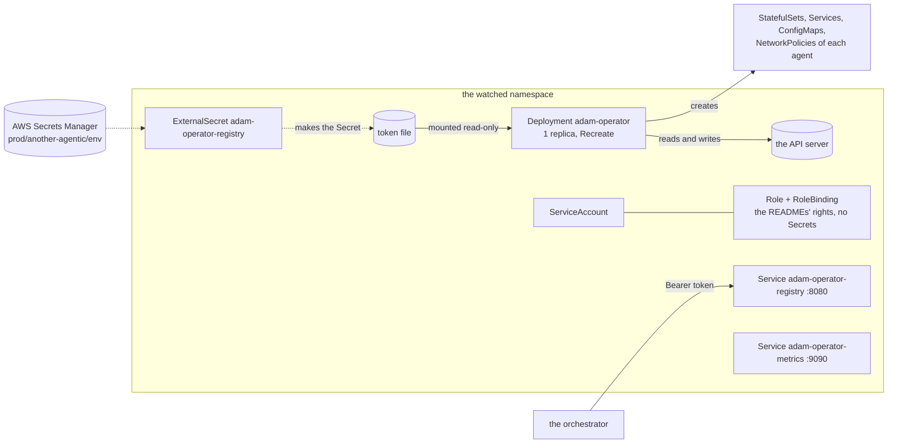

# adam-operator (the chart)

> Moved into adam-rs from `vymalo/another-agentic-platform` at commit [`cfd03db`](https://github.com/vymalo/another-agentic-platform/tree/cfd03db836b39fd4ff81ac0275f2602781ab19c4) ([ADR 0029](../../docs/decisions/0029-adam-rs-has-an-operator.md)). `§N`, `AD-NNN`, `Sn` and `M0`..`M3` in this file cite that repository's design documents (`docs/architecture`, `docs/mvp.md`) as of that commit, which is archived; they are not links into this one.

The Helm chart of the operator: **one replica**
of the `adam-operator` binary ([`bin/adam-operator`](../../bin/adam-operator/README.md)), which reconciles `AgentService` and `AgentConfig` in
**one namespace** and serves the agent registry. The CRDs are another chart, [`deploy/operator-crds`](../operator-crds/README.md)
(a separate Argo CD app); the agents are custom resources of their own ([`examples/`](examples)), not part of this chart.
To run an agent with it, see the guide [Run agents with the operator](../../docs/guides/run-agents-with-the-operator.md).
Apply the CRDs chart of the same revision first: a field an older CRD does not know (`model.contextWindow`, say) is refused under
strict field validation and dropped with a warning otherwise (*verified 2026-10-09* on kube-apiserver 1.35.8; that `kubectl apply`
asks for strict by default is *unverified* here).



| Object | What |
|---|---|
| `Deployment adam-operator` | 1 replica, `Recreate`, no leader election (a second reconciler would only race the first). `adam-operator run`, `WATCH_NAMESPACE` the watched namespace, probes `/healthz` (startup, liveness) and `/readyz` (readiness) on 8081, `/metrics` on 9090 |
| `ServiceAccount`, `Role`, `RoleBinding` | Namespaced, in the watched namespace. Exactly the rights below. **No right on Secrets**, no `ClusterRole` |
| `Service adam-operator-registry` | ClusterIP 8080, **only with a registry token**. No Ingress |
| `Service adam-operator-metrics` | ClusterIP 9090 |
| `NetworkPolicy adam-operator` | Ingress only from who the values name; egress only to the API server's ports |
| `ExternalSecret adam-operator-registry` | Only with `externalSecrets.enabled`: the registry token from AWS Secrets Manager |

## Install

```sh
helm template adam-operator-crds deploy/operator-crds | kubectl apply --server-side -f -     # once, and on a change of a type
helm upgrade --install adam-operator deploy/operator --namespace another-agentic-system \
  -f deploy/operator/examples/netcup.values.yaml
```

On netcup an Argo CD Application does this (`helm.valuesObject`, the contents of
[`examples/netcup.values.yaml`](examples/netcup.values.yaml)), and CI bumps `image.tag` ([below](#the-image)): `values.yaml` holds the tag of the last green build of `main`. Before the first build it was
the placeholder `sha-0000000`, an image that does not exist.

## Values

| Value | Default | What |
|---|---|---|
| `image.repository`, `image.tag`, `image.digest`, `image.pullPolicy` | `ghcr.io/vymalo/another-adam-rs/operator`, `sha-<7>` of the last green build of `main`, none, `IfNotPresent` | The tag is **written by CI only** (`bump-tag.sh`), never by hand. `latest` and a malformed digest are refused |
| `imagePullSecrets` | `[]` | For a private package ([below](#the-image)) |
| `watchNamespace` | the release's namespace | The one namespace watched; the `Role` and `RoleBinding` are made there. A name, never a list or a wildcard: **there is no value that gives the operator a `ClusterRole`** |
| `storeCnpg` | `true` | The right on CloudNativePG `Cluster`s (`get patch create delete`). The image is built with the `store-cnpg` feature; `false` is for a cluster that has no CloudNativePG |
| `registry.tokenSecret.name`, `.key` | none, `token` | An existing Secret that holds the registry's bearer token. The operator reads the file **once**, at start: after a rotation, restart the pod |
| `registry.publicUrl` | none | `REGISTRY_PUBLIC_URL`: the registry document's own URL, its `anchor` |
| `externalSecrets.enabled`, `.apiVersion`, `.refreshInterval`, `.secretStoreRef`, `.key`, `.properties.registryToken` | off, `external-secrets.io/v1`, `1h`, `ClusterSecretStore/ssegning-aws`, `prod/another-agentic/env`, `agent_registry_token` | The token from AWS Secrets Manager, as in the system chart: one ExternalSecret, one property. Not together with `registry.tokenSecret.name` |
| `networkPolicy.enabled` | `true` | |
| `networkPolicy.registry.allowFrom` | `[]` | NetworkPolicyPeers that may read the registry. **Required while there is a token and a policy**: an empty list would make the registry unreachable, which the chart refuses. A peer with only a `podSelector` means the pods of the watched namespace |
| `networkPolicy.metrics.allowFrom` | `[]` | Who may scrape `/metrics`. Empty: nobody |
| `networkPolicy.apiServer.ports`, `.cidrs` | `[443, 6443]`, `[]` | The API server as the pod reaches it (the Service is 443, most clusters' endpoint 6443). `cidrs`, from `kubectl get endpoints kubernetes`, narrows it to those addresses |
| `logLevel` | `info` | `RUST_LOG` |
| `tuning.concurrency`, `.resyncSecs`, `.resyncPendingSecs` | unset (the binary's 4, 300, 15) | `ADAM_OPERATOR_CONCURRENCY`, `ADAM_OPERATOR_RESYNC_SECS`, `ADAM_OPERATOR_RESYNC_PENDING_SECS`; another key is refused |
| `resources` | 50m / 64Mi requested, 256Mi limit | |
| `serviceAccount.create`, `.name`, `.annotations` | `true`, the fullname, none | |
| `podAnnotations`, `podLabels`, `priorityClassName`, `nodeSelector`, `tolerations`, `affinity` | empty | |

**There is no `replicaCount`** (a value of that name is refused), no `crds.install` (the CRDs are their own chart) and no `values.schema.json`: neither of the sibling charts, `deploy/coder` and `deploy/chart` of
another-agentic-system, has one; [`templates/_validate.tpl`](templates/_validate.tpl) refuses what would deploy something other
than what the values say.

The pod is `runAsNonRoot` (65532, the image's user), `seccompProfile: RuntimeDefault`, with `allowPrivilegeEscalation: false`,
every capability dropped and a read-only root filesystem (the binary writes no file). It mounts the service account token, which is
how it reaches the API.

## Rights

The `Role` is the sum of the three crates' tables, no more
([controller](../../crates/adam-operator-controller/README.md#cluster-rights), [runtime](../../crates/adam-operator-runtime-kubernetes/README.md#cluster-rights),
[store](../../crates/adam-operator-store-cnpg/README.md#cluster-rights)); `tests/render-check.sh` compares it with this table line by line.

| Resources | Verbs |
|---|---|
| `agentservices`, `agentconfigs` (`agents.vymalo.com`) | `get list watch patch` |
| `agentservices/status`, `agentconfigs/status` | `patch` |
| `events` (`events.k8s.io`) | `create patch` |
| `statefulsets`, `deployments` (`apps`) | `get list watch patch create delete` |
| `services`, `configmaps`, `persistentvolumeclaims` | `get list patch create delete` |
| `networkpolicies` (`networking.k8s.io`), `poddisruptionbudgets` (`policy`) | `get list patch create delete` |
| `pods` | `list watch` |
| `clusters` (`postgresql.cnpg.io`), with `storeCnpg` | `get patch create delete` |

**No right on Secrets** (a Secret an agent names is read by the kubelet; the operator never sees a value), none on
`agentservices/finalizers`, none on `databases`, `poolers` or `clusters/status`, and nothing outside the watched namespace.

## The registry and its token

The registry lists every service that has A2A on, is not `Blocked` and has a card URL (`a2a_enabled && !blocked && agent_card.is_some()`),
so a `Degraded` service is listed too ([`adam-operator-registry`](../../crates/adam-operator-registry/README.md)).

`adam-operator run` serves the registry only with a token, and the chart follows: **no `registry.tokenSecret.name` and no
`externalSecrets.enabled` means no `REGISTRY_TOKEN_FILE`, no port 8080, no registry Service**, and every service says `Listed: False`,
reason `RegistryDisabled` ([`bin/adam-operator`](../../bin/adam-operator/README.md)). The token reaches the pod as a file, `/var/run/secrets/adam-operator/registry/token`
(mode 0440, group 65532), never as an environment variable.

On netcup the token is the AWS property **`agent_registry_token`** of `prod/another-agentic/env`: random, at least 32 bytes
(`openssl rand -hex 32`). The orchestrator's chart (`another-agentic-system`) reads the same property as its orchestrator's `AGENT_REGISTRY_TOKEN`, so the two sides
cannot differ. It is **not** the agents' bearer (`AGENT_REGISTRY_AGENT_TOKEN`, a member of each agent's `A2A_BEARER_TOKENS`: the
agent token rule, see [`adam-operator-registry`](../../crates/adam-operator-registry/README.md)).

## The image

`ghcr.io/vymalo/another-adam-rs/operator`, built from [`docker/operator/Dockerfile`](../../docker/operator/Dockerfile) by
[`operator.yml`](../../.github/workflows/operator.yml): on a pull request it builds, smoke-tests and runs the kind
end-to-end of the coder; on `main`, after those pass, it pushes the image **that passed** as `sha-<7>`, and as `latest`
unless main has moved on to a newer build (image jobs can finish out of order), and a last job
runs `bump-tag.sh` and pushes `chore(deploy): bump operator to sha-<7>` to `main` as `github-actions[bot]`. A
deployment pins `sha-<7>`, never `latest`.

**A new GHCR package is private until it is made public.** After the first push (owner step): *Packages → operator → Package
settings → Change visibility → Public*, then check the anonymous pull, from the images repository's `CLAUDE.md`:

```sh
TOKEN=$(curl -s "https://ghcr.io/token?scope=repository:vymalo/another-adam-rs/operator:pull" | python3 -c 'import sys,json;print(json.load(sys.stdin)["token"])')
curl -s -o /dev/null -w '%{http_code}\n' -H "Authorization: Bearer $TOKEN" \
  -H 'Accept: application/vnd.oci.image.index.v1+json, application/vnd.oci.image.manifest.v1+json, application/vnd.docker.distribution.manifest.v2+json' \
  https://ghcr.io/v2/vymalo/another-adam-rs/operator/manifests/sha-<7>      # 200
```

Until it answers 200, a cluster that pulls it anonymously gets `ImagePullBackOff` (or set `imagePullSecrets`).

## Tests

```sh
helm lint deploy/operator && helm lint deploy/operator-crds
sh deploy/operator/tests/render-check.sh                    # needs helm
UPDATE_GOLDEN=1 sh deploy/operator/tests/render-check.sh    # after a deliberate change: rewrites tests/golden
sh deploy/operator/tests/bump-tag-test.sh
```

| File | What |
|---|---|
| `tests/render-check.sh` | the three golden renders (`tests/golden/netcup.yaml` from `examples/netcup.values.yaml`, `secret.yaml` from `tests/secret.values.yaml`, `default.yaml`); no Secret object, no `ClusterRole`, no host access; one replica, `Recreate`, the probes, the security context; the `Role` equal to the table above, with and without `storeCnpg`; the registry only with a token, mounted as a file; the NetworkPolicy; the ExternalSecret; every refusal of `_validate.tpl`; and `deploy/operator-crds` equal to `deploy/crds` |
| `tests/bump-tag-test.sh` | `bump-tag.sh` edits only `image.tag`, is idempotent, refuses a malformed tag (the test of adam-rs's `deploy/coder`, with this chart's values) |
| `tests/schemas/` | the `ExternalSecret` schema for kubeconform ([its README](tests/schemas/README.md)) |
| `tests/e2e/` | the kind end-to-end of the coder (S9): [`tests/e2e/README.md`](tests/e2e/README.md) |

CI also runs kubeconform in strict mode over four renders (the defaults, netcup, `secret.values.yaml`, and the CRDs chart with the
`CustomResourceDefinition` kind skipped, because the schema set has none: the `kind-crds` job of `operator.yml` applies them to a real API server).

## What is not proven

* **Proven on kind, 2026-10-07** (*verified*: the `operator` workflow run 37595241571 on `main` at `2644008`,
  https://github.com/vymalo/another-adam-rs/actions/runs/37595241571, every job `success`, read through the GitHub Actions API): the `coder-e2e`
  job installs this chart and the CRDs chart into kind and runs the real coder under an `AgentService`, with a read-only root filesystem, the
  Role as it is, and the registry read from a pod; `kind-crds`, `operator-e2e`, `runtime-kubernetes` and `store-cnpg` apply the CRDs, the
  examples, the binary, the provider and the CloudNativePG store to a real API server. What `coder-e2e` does and does not exercise:
  [`tests/e2e/README.md`](tests/e2e/README.md).
* **Not proven in this repository**: any production cluster. A deployment's own evidence lives in that deployment's repository
  (ADR 0029, *Amended 2026-10-07*). Also *unverified*: that Argo CD syncs the CRDs of `deploy/operator-crds` and this chart in that order
  (its sync waves, or two Applications) and leaves an agent's objects alone while it does; and that the NetworkPolicy's egress is
  enough on a cluster whose CNI differs from kind's.
