# Architecture

adam-rs is a Rust workspace of 21 crates for **durable AI agents**. An agent is
a state machine. The runtime saves its state after every step, so a worker that
dies loses nothing: another worker resumes from the last saved step. Every piece
of infrastructure (database, model, code host, A2A backend) sits behind a trait,
so each deployment picks its own.

This document describes the code **as built**. For the durable model in detail
(runs, journal, leases, scheduling) and the store adapters, read the
[root README](../README.md). This page shows how the parts connect.

> **Status of the facts.** Everything about this repository's own behaviour was
> *verified* on 2026-09-29 by reading the code at commit `172a117` (`main`).
> Claims about third-party products and standards are marked *verified* or
> *unverified* where they occur, and collected in
> [Verified and unverified](#verified-and-unverified).

Contents:

* [The crate map](#the-crate-map)
* [Ports and implementations](#ports-and-implementations)
* [The path of a task](#the-path-of-a-task)
* [The run lifecycle](#the-run-lifecycle)
* [The error tree](#the-error-tree)
* [The coder agent](#the-coder-agent)
* [Where to go next](#where-to-go-next)
* [Verified and unverified](#verified-and-unverified)

## The crate map

Arrows point from a crate to a crate it depends on. Solid arrows come from
`[dependencies]` in the `Cargo.toml` files. Dotted arrows are
`[dev-dependencies]` that are not also normal dependencies (tests only). Grey
arrows go to `adam-error`: every crate except the two test kits,
`adam-agent-fixture` and `adam-macros` depends on it. `adam-assembly` reaches
`adam-a2a` through its optional feature `a2a`, and its dotted edge to
`adam-agent-fixture` closes a cycle through `adam` that cargo allows because
it is a dev-dependency.

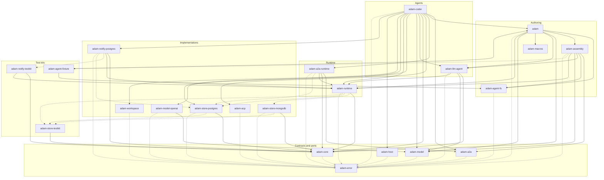

The layers, from the bottom:

* **Contracts and ports.** Small crates that define what other crates
  implement or call.
  * [`adam-error`](../crates/adam-error/README.md): `ErrorClass`, `Classify`,
    `BoxError`, `report()`. No I/O, no async.
  * [`adam-core`](../crates/adam-core/README.md): the `Store` trait, the run,
    journal and lease types, and `MemoryStore`, the reference implementation.
  * [`adam-model`](../crates/adam-model/README.md): the `ModelClient` trait and
    its request and response types. It also holds `MockModel`, a scripted
    double that is always compiled.
  * [`adam-a2a`](../crates/adam-a2a/README.md): the `TaskBackend` seam, and
    the axum server that exposes any backend as an A2A 1.0 agent. It knows
    nothing about the runtime.
  * [`adam-host`](../crates/adam-host/README.md): the closed process `Role`
    (`all`, `control-plane`, `worker`), the closed workspace `Placement`
    (`shared`, `affinity`, `isolated`, `a2a-only`) and `Host`, a small
    supervisor that runs only the components a role asks for and stops them in a
    fixed order. A host app such as `adam-coder` reads the role and the
    placement from its own variables.
* **Implementations.** Each one is a separate crate, so a binary links only what
  it uses.
  * `adam-store-postgres` and `adam-store-mongodb` implement `Store`.
  * `adam-model-openai` implements `ModelClient` for any OpenAI-compatible
    chat-completions endpoint.
  * `adam-workspace` runs `git` for mirrors, worktrees, commit and push, under
    an in-process lock and a file lock on each mirror, so several processes can
    share a root. It also owns two small ports of its own, `GitCredentials` and
    `CodeHost` (GitHub).
  * `adam-acp` is a client for the Agent Client Protocol: it drives a coding
    agent (OpenCode) over stdio.
  * `adam-notify-postgres` implements two ports of the runtime, `EventSink`
    (`PgEventSink`) and `Notifier` (`PgNotifier`), over PostgreSQL
    `LISTEN`/`NOTIFY`. It is separate from `adam-store-postgres` because the
    store must not depend on the runtime.
* **Runtime.**
  * `adam-runtime` owns the run state machine, the journal, the workers and the
    retry policy. It depends on `adam-core` and `adam-error` only.
  * `adam-a2a-runtime` implements the `adam-a2a` seam over the runtime.
* **Agents.**
  * `adam-llm-agent` is a reusable model-and-tools loop written as an
    `adam_runtime::Agent`.
  * `adam-coder` is the coder agent and the only binary. It is a composition
    root: it wires the pieces below it.
* **Authoring.**
  * `adam-macros` is the `#[tool]` attribute macro: a proc-macro crate whose
    expansion is a pure function over token streams. It depends on `syn`,
    `quote` and `proc-macro2` only.
  * `adam-agent-fs` parses and validates an agent directory (`agent/instructions.md`,
    skills, subagents, `mcp.json`, schedules) into an `AgentManifest` and reports
    every mistake with its file and line. It is a leaf over `serde` and
    `serde-saphyr`, with no async and no runtime dependency. Its feature `build`
    is the code generator a `build.rs` calls to embed the directory in the
    binary as a `'static` manifest. See [`docs/authoring.md`](authoring.md).
  * `adam-assembly` binds a manifest to `LlmAgent`s: `AgentDef::from_manifest`
    takes the embedded manifest or one read from a directory (one code path),
    `bind` checks `tools:` against a `ToolSet` (unknown names come back with a
    "did you mean") and renders the `{{var}}` placeholders of the prompt,
    `model` gives every agent its gateway alias and builds the root and one
    `LlmAgent` per local subagent definition, and, with feature `a2a`, `card`
    turns the root's `card:` into an `AgentCardConfig`. It depends on
    `adam-agent-fs`, `adam-llm-agent`, `adam-model` and `adam-runtime`.
  * `adam` is the facade a user writes agents against: `prelude`, the
    re-exported `adam-llm-agent` API, the `#[tool]` macro behind the
    default feature `macros`, `AgentDef` and its stages from `adam-assembly`
    (feature `a2a` turns on the card), and `adam-agent-fs` as `adam::agent_fs`
    with the `include_agent!` macro for the agent embedded by `build.rs`. Generated
    code refers to `adam::__private` and `adam::agent_fs`.
    See [`docs/authoring.md`](authoring.md).
* **Test kits.** `adam-store-testkit` is the conformance suite every store must
  pass, and `adam-notify-testkit` the one every `Notifier` (and its event
  transport) must pass. It is a crate of its own because `adam-runtime` cannot
  dev-depend on a crate that depends on it. `adam-agent-fixture` (not
  published) is a crate with a real `build.rs` and `adam::include_agent!()`; its
  tests prove that an embedded agent equals the directory it came from. The
  other test doubles live inside
  the crates they double for (see
  [Ports and implementations](#ports-and-implementations)).

Dev-only edges (dotted): the runtime's tests run against real Postgres and
MongoDB stores, every store runs the store testkit, and `adam-notify-postgres`
runs the notifier testkit and its two-runtime tests over `adam-store-postgres`. `adam-a2a`,
`adam-workspace` and `adam-coder` also enable their own `test-util` feature in
tests. That adds no new crate edge.

The workspace is `crates/*` (see the root `Cargo.toml`), so a new crate joins by
adding a directory.

## Ports and implementations

A **port** is a trait that a crate defines and other crates implement. The
core never names an implementation: it holds a `dyn` handle (`DynStore`,
`DynModel`, `DynTaskBackend`, `DynCodeHost`, ...). Swapping happens **at build
time**: pick the crates in `Cargo.toml` (and features), and pick the values in
the composition root. There are no runtime plugins and no dynamic loading. This
is the same rule as ADR 0009 of the sibling orchestration layer
(`vymalo/another-agentic-system`): swappable implementations, at build time
(*verified* 2026-09-29: invariant 6 in that repository's agent guide, `AGENTS.md`).

```mermaid
classDiagram
    direction LR

    namespace adam_core {
        class Store {
            <<interface>>
            migrate()
            create_run()
            commit_run()
            journal_get()
            journal_put()
            claim_due()
            renew_lease()
            release_lease()
        }
        class MemoryStore
    }
    namespace adam_store_postgres {
        class PgStore
    }
    namespace adam_store_mongodb {
        class MongoStore
    }
    namespace adam_store_testkit {
        class FaultyStore
    }
    Store <|.. MemoryStore
    Store <|.. PgStore
    Store <|.. MongoStore
    Store <|.. FaultyStore

    namespace adam_model {
        class ModelClient {
            <<interface>>
            complete()
            stream()
        }
        class MockModel
    }
    namespace adam_model_openai {
        class OpenAiCompatible
    }
    ModelClient <|.. OpenAiCompatible
    ModelClient <|.. MockModel

    namespace adam_a2a {
        class TaskBackend {
            <<interface>>
            submit()
            get()
            cancel()
            subscribe()
        }
        class InMemoryBackend
    }
    namespace adam_a2a_runtime {
        class RuntimeTaskBackend
    }
    TaskBackend <|.. RuntimeTaskBackend
    TaskBackend <|.. InMemoryBackend

    namespace adam_workspace {
        class CodeHost {
            <<interface>>
            open_pull_request()
            find_pull_request()
        }
        class GitCredentials {
            <<interface>>
            token_for()
        }
        class GitHub
        class MemoryCodeHost
        class StaticToken
        class ScopedToken
    }
    CodeHost <|.. GitHub
    CodeHost <|.. MemoryCodeHost
    GitCredentials <|.. StaticToken
    GitCredentials <|.. ScopedToken

    namespace adam_runtime {
        class Agent {
            <<interface>>
            name()
            init()
            step()
        }
        class AgentStarter {
            <<interface>>
            name()
            init()
        }
        class EventSink {
            <<interface>>
            emit()
        }
        class Clock {
            <<interface>>
            now()
        }
        class Notifier {
            <<interface>>
            publish()
            subscribe()
        }
        class LocalNotifier
        class NoopSink
        class BroadcastSink
        class CollectingSink
        class SystemClock
        class ManualClock
    }
    EventSink <|.. NoopSink
    EventSink <|.. BroadcastSink
    EventSink <|.. CollectingSink
    Notifier <|.. LocalNotifier
    Clock <|.. SystemClock
    Clock <|.. ManualClock

    namespace adam_notify_postgres {
        class PgEventSink
        class PgNotifier
    }
    EventSink <|.. PgEventSink
    Notifier <|.. PgNotifier

    namespace adam_llm_agent {
        class Tool {
            <<interface>>
            spec()
            call()
            required_state()
        }
        class FnTool
        class LlmAgent
        class LlmStarter
    }
    namespace adam_coder {
        class CoderAgent
        class CoderStarter
        class PrepareWorkspace
        class DelegateToOpenCode
        class RunChecks
        class CommitAndPush
        class OpenPullRequest
        class AskUser
    }
    Tool <|.. FnTool
    Agent <|.. LlmAgent
    Agent <|.. CoderAgent
    AgentStarter <|.. LlmStarter
    AgentStarter <|.. CoderStarter
    Tool <|.. PrepareWorkspace
    Tool <|.. DelegateToOpenCode
    Tool <|.. RunChecks
    Tool <|.. CommitAndPush
    Tool <|.. OpenPullRequest
    Tool <|.. AskUser

    namespace adam_acp {
        class PermissionPrompt {
            <<interface>>
            ask()
        }
        class StaticPrompt
    }
    PermissionPrompt <|.. StaticPrompt
```

Each box is a crate (underscores stand for hyphens). The six coder tools are
`prepare_workspace`, `delegate_to_opencode`, `run_checks`, `commit_and_push`,
`open_pull_request` and `ask_user`. A seventh type, `Redacting`, wraps each of
them to scrub secrets (`crates/adam-coder/src/tools/mod.rs`). `CoderAgent`
wraps the `LlmAgent` that `adam-assembly` builds from `crates/adam-coder/agent/instructions.md` (the prompt, the
limits and the A2A card are that file) and adds its completion rule. `FnTool` is a tool made from a closure. A tool
reads shared dependencies with `ToolCtx::state::<T>()` (given to the agent with
`LlmAgentBuilder::state`), declares them in `Tool::required_state`, and
`LlmAgentBuilder::try_build` fails at startup when one is missing; `parse_args`,
`IntoToolOutput`, `ToolSet` and, with the `schema` feature, `spec_for` remove the boilerplate
(see the [crate README](../crates/adam-llm-agent/README.md)). `AgentStarter` is the start-only half
of `Agent` (`name` and `init`, no `step`): a process that only accepts requests registers
a starter (`LlmStarter`, `CoderStarter`) and never holds the agent's model or credentials.

The boundaries, by what they swap:

| Port | Defined in | Real implementations | Doubles |
|---|---|---|---|
| `Store` | `adam-core` | `PgStore`, `MongoStore` | `MemoryStore` (reference), `FaultyStore` (fault injection, `adam-store-testkit`) |
| `ModelClient` | `adam-model` | `OpenAiCompatible` | `MockModel` |
| `TaskBackend` | `adam-a2a` | `RuntimeTaskBackend` | `InMemoryBackend` (feature `test-util`) |
| `CodeHost` | `adam-workspace` | `GitHub` (feature `github`, on by default) | `MemoryCodeHost` (feature `test-util`) |
| `GitCredentials` | `adam-workspace` | `ScopedToken` (one token, limited to named hosts), `StaticToken` (one token, any host) | none needed |
| `Agent` | `adam-runtime` | `LlmAgent`, `CoderAgent` | test agents |
| `AgentStarter` | `adam-runtime` | `LlmStarter`, `CoderStarter` | test starters |
| `Tool` | `adam-llm-agent` | the coder tools, `FnTool` | test tools |
| `EventSink` | `adam-runtime` | `BroadcastSink` (in-process), `PgEventSink` (`adam-notify-postgres`: local first, then `NOTIFY` to other processes) | `NoopSink` (default), `CollectingSink` |
| `Notifier` | `adam-runtime` | `PgNotifier` (`adam-notify-postgres`) | `LocalNotifier` (in-process; also the fan-out inside `PgNotify`) |
| `Clock` | `adam-runtime` | `SystemClock` | `ManualClock` |
| `PermissionPrompt` | `adam-acp` | none in this repository (the default policy needs no prompt) | `StaticPrompt` |

Not every boundary is a trait. `Workspaces` (in `adam-workspace`) and
`AcpClient` (in `adam-acp`) are concrete types: one shells out to the `git`
CLI, the other spawns a child process. The traits in `adam-workspace` cover the
parts that vary (credentials and the code host).

Rules the code follows, from the crate docs:

* No implementation type appears in a trait signature. A driver error is boxed
  as a `BoxError` `source` (see [The error tree](#the-error-tree)).
* A store passes the **conformance suite** in `adam-store-testkit`
  (`store_conformance!`), so "passes the testkit" means "behaves like every other
  store". To add a backend, implement `Store` and add one line.
* The correctness guarantee is the version compare-and-swap in
  `Store::commit_run`, not the lease. Any store that honours the trait keeps
  it.

### How a binary composes them

`adam-coder` is the composition root. Its `serve` function
(`crates/adam-coder/src/serve.rs`) is the whole process, and `main` is
`serve(Config::from_env(), sigterm)`. To use MongoDB, another model client or
another code host, write another root that builds the same pieces.

`serve` does not supervise anything by hand. It builds the pieces, registers what
the process runs as components of an `adam_host::Host`, and calls `run`. The
`ROLE` variable, parsed with `adam_host::Role`, decides which components run.

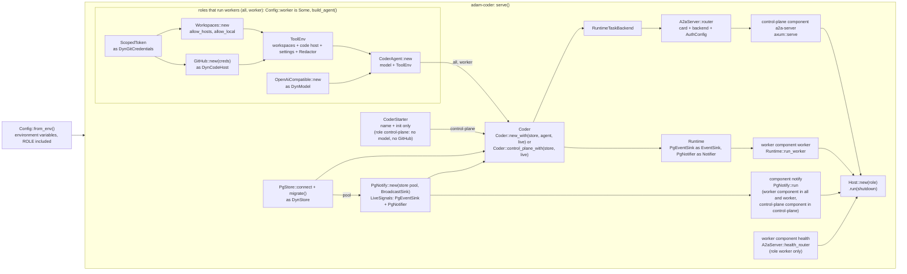

| `ROLE` | Components that run | Needs |
|---|---|---|
| `all` (default) | `a2a-server`, `worker` and `notify`: one process, as before | every variable |
| `control-plane` | `a2a-server` and `notify`, over `Coder::control_plane_with`: a `Runtime` with the agent's `CoderStarter` only, which starts, delivers, cancels and views runs; `run_worker` is never called | `DATABASE_URL`, `A2A_BEARER_TOKENS`, `PUBLIC_URL`; no model, GitHub or workspace variables, and no workspace root is created |
| `worker` | `worker` (`run_worker`), `notify` and `health` (`GET /healthz` on `LISTEN_ADDR`, no A2A) | everything except `A2A_BEARER_TOKENS` and `PUBLIC_URL` |

Only the roles that run workers hold the model, GitHub and workspace settings. Starting a run
needs the agent's name and its `init` and nothing else, so the control plane registers a
`CoderStarter` (an `adam_runtime::AgentStarter`, `RuntimeBuilder::starter`) instead of the
`CoderAgent`, and `Config::worker` is `None` for it: no model client, GitHub client or
workspaces are built, and none of their variables is read
(`crates/adam-coder/src/serve.rs`, `config.rs`). The runtime claims only registered agents, so
a control plane never steps a run even if `run_worker` were called. `CoderAgent::init`
delegates to `CoderStarter`, so both start a run with the same state. The two roles meet in the Postgres store: the run record with its version
compare-and-swap, and leases, which is what makes them correct. They also meet in `NOTIFY`
(see [Across processes: signals and events](#across-processes-signals-and-events)): every role
runs the component `notify`, one `PgNotify` over the store's own pool, so a worker wakes at
once for a run a control plane started, a cancel reaches a step in another process at once,
and the control plane's stream carries a worker's progress events as they happen. Polling
stays on, so without `notify` (a library user's `LiveSignals::local()`, a lost connection, a
transaction-mode pooler) the same things happen a poll interval (250 ms) late. In `all` and
`worker`, `notify` is a worker component that stops only after `worker` has finished, so the
last step's events and signals are still sent; in `control-plane` it stops with the server.

On SIGTERM `Host` stops the control plane first: the server stops taking
connections and open streams get 10 seconds. It then stops the workers, with no
bound, so they finish and commit the steps they are in. If a component stops on
its own the others are stopped in the same order and the process exits with the
component named in the error (`HostError`, exit code 70).

### Where a run's files live: workspace placement

A run moves between workers at every step: a `Continue` is committed, the lease is released, and
the next claim may go to any worker (`crates/adam-runtime/src/worker.rs`, `run_worker`). The
coder keeps a worktree per run under a local root, so with two workers on two disks a run can land
on a worker that has no worktree for it. Nothing fails: `prepare_workspace` clones again, the
branch `agent/<short>` is taken, a longer one is picked, the run notes are gone, and a second pull
request is opened. The deployer therefore chooses a **placement**
([ADR 0002](decisions/0002-workspace-placement.md)), the closed enum `adam_host::Placement`, read
by `adam-coder` from `WORKSPACE_PLACEMENT`:

| `WORKSPACE_PLACEMENT` | Worker root | Claims | Needs `WORKER_ID` |
|---|---|---|---|
| `shared` (default) | `WORKSPACE_ROOT`, one volume for all workers | `ClaimScope::Any` | no |
| `affinity` | `WORKSPACE_ROOT/<WORKER_ID>` | `ClaimScope::Pinned` | yes |
| `isolated` | `WORKSPACE_ROOT`, a volume of this worker only | `ClaimScope::Pinned` | yes |
| `a2a-only` | none | `Any` | refused by `adam-coder` (its tools need a workspace) |

`serve` maps `Placement::pins_runs()` to `RuntimeOptions::claim_scope`
(`crates/adam-coder/src/serve.rs`), and `RuntimeBuilder::claim_scope` to the claim. The store keeps
the **owner** of a run beside its lease (`runs.owner` in Postgres, `owner` in MongoDB), set by the
first pinned claim and never cleared by a release or a commit:

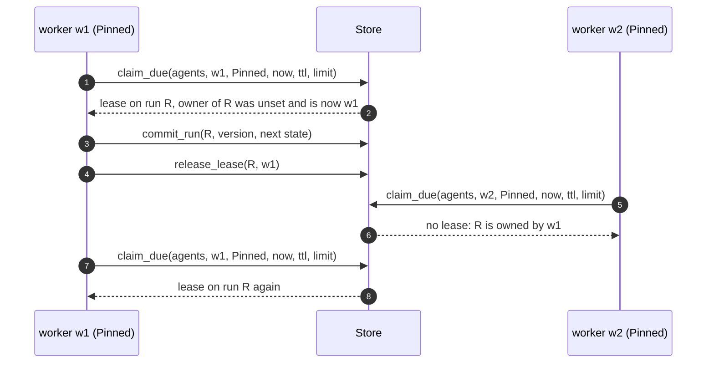

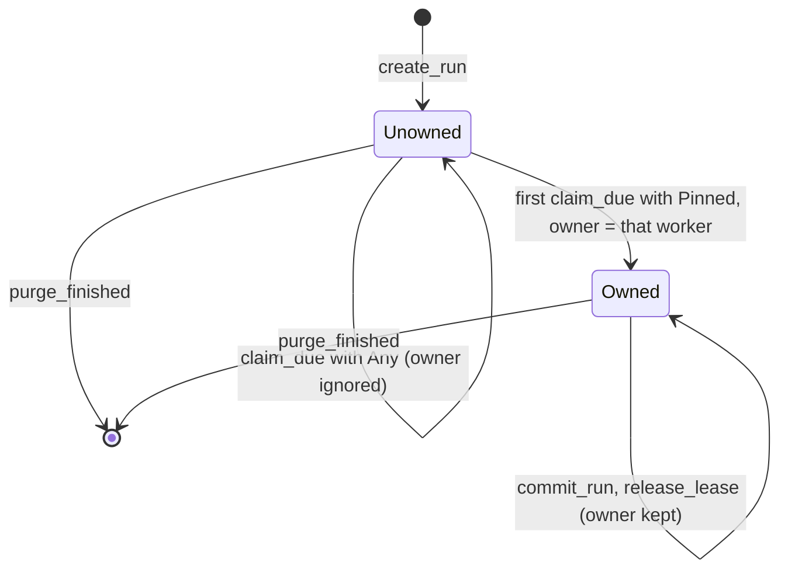

* **A pinned run whose owner is gone is stranded.** A claim cannot tell "the owner is busy" from
  "the owner is gone", so nothing adopts the run and nothing reports it. Adoption is future work;
  until then a deployment that pins keeps worker ids stable and does not scale workers in.
* **`shared` needs the mirror lock.** Several worker processes on one volume would otherwise
  fail in git with "could not lock". `adam-workspace` holds an exclusive `flock` on
  `<mirror>.lock` under its in-process lock (`crates/adam-workspace/src/workspace.rs`,
  `lock_mirror`). *Unverified:* `flock` on NFS and Longhorn RWX volumes.
* **`a2a-only`** is for hosts whose agents only call remote agents, such as the
  `another-agentic-system` orchestrator; the enum is shared so both speak the same vocabulary.

## The path of a task

A task is a **run**. Its id is the A2A `task_id`, and its A2A `context_id` is
part of the run's conversation id. A client talks JSON-RPC over HTTP to the
server in `adam-a2a`. The server hands the request to a `TaskBackend`
(`adam-a2a-runtime`), which starts or feeds a run in the `Runtime`. A worker
advances the run one step at a time and commits each step to the store. The
client sees the run's progress as task events on an SSE stream.

Two sequence diagrams follow. The first is the request and the event stream.
The second is the worker that does the work.

### Request in, events out

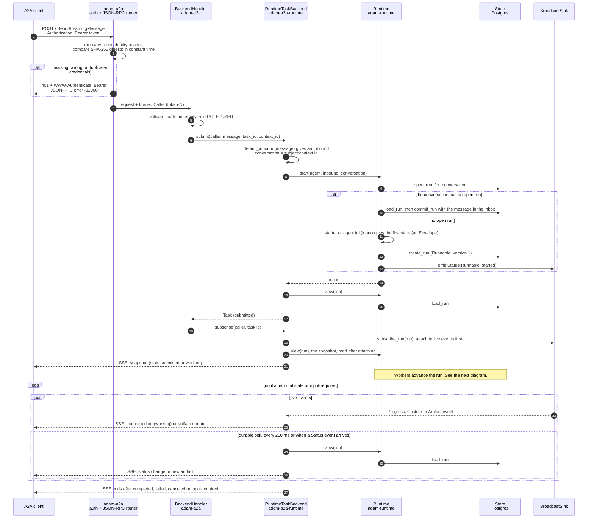

What the diagram cannot say:

* **Authentication fails closed.** Only `GET /.well-known/agent-card.json` and
  `GET /healthz` are public. Every other route, including unknown ones, needs a
  bearer token (`crates/adam-a2a/src/auth.rs`). An empty token list rejects
  everything. `AuthConfig::AllowAnonymous` exists for local development and logs
  a warning.
* **Errors are HTTP 200 with a JSON-RPC error object,** as the A2A SDK does it.
  A body that is not JSON gets `-32700` and a null id. A body that is JSON but
  not a request gets `-32600`. The mapping from error class to code is in
  [The error tree](#the-error-tree).
* **Ownership needs no side table.** The caller's subject is part of the run's
  conversation id (`subject:context id`), and that is durable. A task that
  belongs to someone else looks exactly like one that does not exist.
* **Follow-ups.** A message that carries a `taskId` is delivered to the run
  with `Runtime::deliver`, and only while the task is `input-required`. Any
  other state gives `-32602`. A message with a `contextId` and no `taskId`
  is delivered to the context's open task, or starts a new one when there is
  none.
* **Streams survive restarts.** The subscription takes its snapshot from
  `Runtime::view`, which reads the durable record, and then polls it. The live
  events from the `BroadcastSink` only cut the latency and add intermediate
  progress. They are lost if the process dies, and nothing depends on them, so a
  subscriber attached to another replica, or after a restart, sees the same
  states and artifacts.
* **The task outlives the connection.** Dropping the SSE stream drops only the
  subscription. Only `CancelTask` cancels.
* **Other methods.** `SendMessage` (blocking), `GetTask`, `CancelTask` and
  `SubscribeToTask` are served. `ListTasks` is unsupported, push-notification
  methods return `PushNotificationNotSupported`, and there is no extended agent
  card (`crates/adam-a2a/src/handler.rs`).

### The worker: claim, step, journal, commit

The worker loop is `Runtime::run_worker` in
`crates/adam-runtime/src/worker.rs`. In the default role (`all`) it runs in the same
process as the A2A server; with `ROLE=worker` it runs alone. Any number of
processes can share one database.

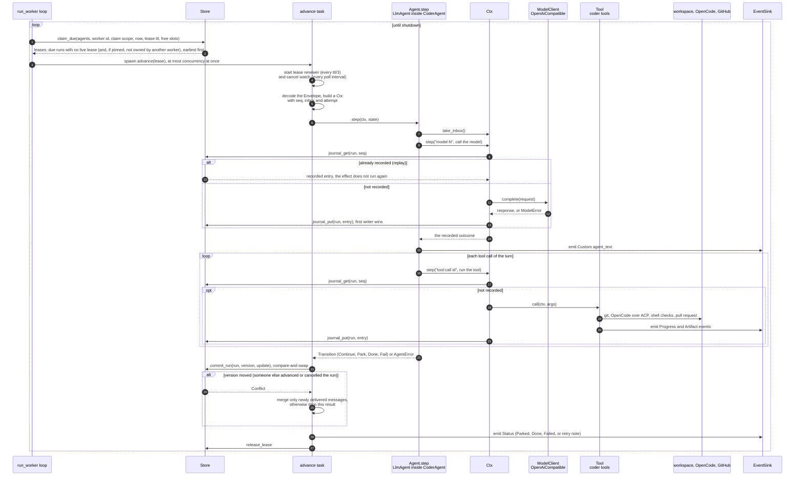

What the diagram cannot say:

* **One step is one model turn.** `LlmAgent::step` calls the model once (in the
  journaled step `model:N`, non-streaming `complete`), runs the tools that call
  asked for (each in a journaled step `tool:<call id>`), and returns
  `Continue`. Every turn is committed before the next begins.
* **The journal makes replay safe, not effects exactly-once.** A recorded
  outcome is never run again. But the effect runs *before* its outcome is
  written, so a crash in between runs it again on replay. Tools must be safe to
  repeat. The coder's tools are (see
  [The coder agent](#the-coder-agent)). A replay that asks for a different
  step name at a recorded `seq` fails the run with `NonDeterminism`.
* **Waking is polling plus hints.** An idle worker sleeps at most one
  `poll_interval` (250 ms by default), and the same `Runtime` wakes its own
  workers at once. With a `Notifier` configured
  (`RuntimeBuilder::notifier`), `start` and `deliver` publish
  `Signal::Runnable` so a worker of another process polls now, and `cancel`
  publishes `Signal::Finished` so a step of another process sees its
  `CancelToken` fire at once (`crates/adam-runtime/src/notify.rs`, `worker.rs`).
  A signal is a hint that may be lost; polling and the cancel watch stay on.
* **The lease is an optimisation.** The compare-and-swap on `version` is the
  guarantee. A worker whose lease expired mid-step cannot overwrite newer state:
  its commit is rejected and it drops its result.
* **Messages that arrive during a step** are kept. The commit merges them,
  and a step that asked to park resumes at once (`Runnable`) instead of
  sleeping through them.
* **Retry.** A transient failure does not fail the run. It is committed as
  `Runnable` with a `wake_at` in the future, and the journal entries of the
  failed try are abandoned, so the retry runs its steps afresh. See
  [The run lifecycle](#the-run-lifecycle).
* **Defaults** (`crates/adam-runtime/src/runtime.rs`, `retry.rs`): lease 30 s,
  idle poll 250 ms, 4 concurrent runs per worker loop, 5 tries per transition,
  backoff 1 s doubling to 60 s.

### Across processes: signals and events

With the front and the workers in different processes, they share only the
database. Left alone, a worker finds a new run at its next poll and a step
learns of a cancel at the next poll of its run. `adam-notify-postgres` closes
both gaps over `LISTEN`/`NOTIFY` without changing who is right: every
notification is a hint, the compare-and-swap and the polling stay in place, and
a run completes with the crate removed, only later. The processes are wired by
their composition root. `adam-coder`'s `serve` does it for every role (done, no new
variable); the crate's `tests/two_runtimes.rs` wires a front and a worker the same way.

Each process has one `PgNotify` (`crates/adam-notify-postgres/src/lib.rs`) whose
`run` holds a listener on two channels, `{prefix}events` and `{prefix}signals`,
and a publisher that drains a queue with `pg_notify`. Its `PgEventSink` is the
runtime's event sink and its `PgNotifier` the runtime's notifier.


What the diagram cannot say:

* **Every arrow into the database from a notifier is best effort.** `publish` and
  `emit` only queue (1 024 items, then drop) and return; a failed `pg_notify`
  drops its item. The worker that polls would have found the run anyway,
  `Runtime::view` holds the durable status and artifacts, and the worker's cancel
  watch finds a finished run at its next poll.
* **No echo, no re-publish.** Events carry the sender's id; the listener skips
  its own and delivers others' into the local `BroadcastSink`, never back into
  the database. Signals have no origin: the publisher hears its own too.
* **Size.** A payload of 8000 bytes or more is rejected by PostgreSQL, so nothing
  over 7 999 is sent. An oversize `Status` loses the tail of its detail; any other
  oversize event stays local, and there is no events table (durable status and
  artifacts are already the run record, and replayable events would cost a write
  per event).
* **The listener holds one pooled connection** and needs a session, so no
  transaction-mode pooler in front of it.
* **Not built here:** MongoDB has no equivalent (no change streams on a standalone
  `mongod`), so it keeps polling; `adam-coder` is Postgres only and uses the crate in
  every role (`crates/adam-coder/src/serve.rs`, and its `binary.rs` test of a control plane
  and a worker in two processes, which sees the worker's progress in the front's stream).

The listener's lifecycle (`crates/adam-notify-postgres/src/lib.rs`, `listen_loop`
and `session`):

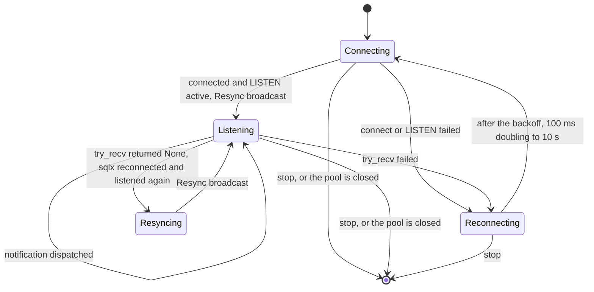

A `Resync` tells the subscribers that notifications may have been lost while the
connection was down. In the runtime (`crates/adam-runtime/src/worker.rs`) it makes
the worker poll at once and re-read every run it is stepping, firing the cancel
token of those that finished. `LISTEN` is active before the `Resync` is sent, so
what happens after the catch-up is heard.

## The run lifecycle

`RunStatus` (`crates/adam-core/src/store/mod.rs`) has four values: `Runnable`,
`Parked`, `Done` and `Failed`. The transitions below are the ones the runtime
makes (`runtime.rs` and `worker.rs`).

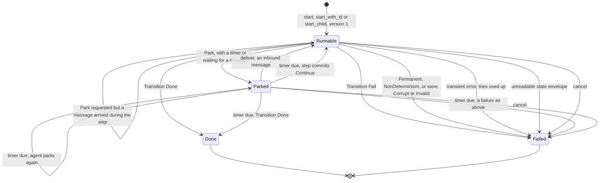

The lease is not a `RunStatus`. It is a separate lifecycle that a run goes
through each time a worker takes it:

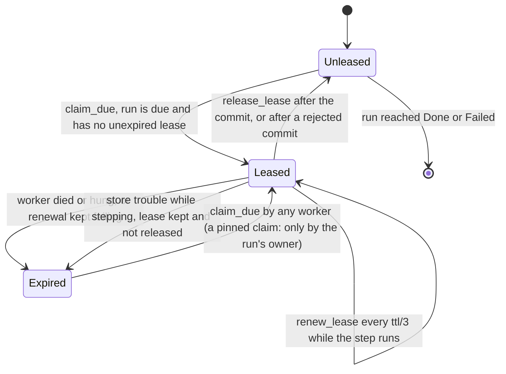

How the two fit:

* **What makes a run due.** `sched_at` is derived from status and `wake_at`
  (`adam_core::store::sched_at`): `Runnable` is due at once, or at `wake_at`
  for a retry backoff. `Parked` with a `wake_at` is due then. `Parked` without
  one is never due: only `deliver` or `cancel` moves it. `Done` and `Failed`
  are never due.
* **Retries.** A step that fails with `AgentError::Transient` (or that panics,
  which is treated as transient) is committed as `Runnable` with
  `wake_at = now + delay` and `attempt + 1`. The delay is the policy's
  exponential backoff. If the error carries a `retry_after` (a provider's
  `Retry-After`), the delay is the larger of the backoff and the hint, and a
  hint is capped at 24 hours (`MAX_RETRY_AFTER`). When `attempt` reaches
  `RetryPolicy::max_attempts` the run is `Failed` with "gave up after N
  attempts".
* **Store trouble.** If the store fails while a step runs, the class decides.
  `Corrupt` and `Invalid` fail the run, because a row that can never be read
  must not be leased for ever. Any other class commits nothing and keeps the
  lease, so the run is retried when the lease expires and is not hammered.
* **Cancel.** `Runtime::cancel` commits `Failed` with the error
  `cancelled: <reason>`. A step running at that moment is told through its
  `CancelToken` (at once in the same process, within one poll interval from
  another one). Its later commit is rejected by the compare-and-swap. A run that
  already finished is left as it is.
* **Deliver.** `Runtime::deliver` appends to the inbox. A `Parked` run becomes
  `Runnable` at once, even if it was waiting on a timer. A run that is `Done`
  or `Failed` answers `Finished`.
* **Children.** A run started with `Runtime::start_child` records its parent. When it reaches `Done` or
  `Failed` (by a step, by a cancel, or because its state cannot be read), the runtime delivers
  `adam.run.finished` to the parent after the commit. See [Child runs](#child-runs).
* **Terminal states** are `Done` and `Failed`. A finished run is kept until
  `Store::purge_finished` deletes it with its journal.

How a run looks to an A2A client (`task_state` in
`crates/adam-a2a-runtime/src/convert.rs`):

| Run | A2A task state |
|---|---|
| `Runnable`, version 1 (no worker has committed yet) | `submitted` |
| `Runnable`, or `Parked` with a timer | `working` |
| `Parked` with no timer | `input-required` |
| `Done` | `completed` |
| `Failed` with an error that starts `cancelled: ` | `canceled` |
| `Failed` otherwise | `failed` |

The ids an A2A client sees are derived, not random. The `message_id` of a
status message is a hash of the task id, the state and the text, so every
event and snapshot of one status carries the same id. A new task's id is a hash
of the agent, the caller, the `contextId` and the `messageId` (`task_id_for` in
`crates/adam-a2a-runtime/src/ids.rs`), started with `Runtime::start_with_id`, so
a repeated `SendMessage` reaches the task its first attempt made and the agent
reads the input once.

## Child runs

A run can start other runs and wait for them. This is what a subagent is: an agent started by a tool of
another agent, with its own history, tools and limits, whose final answer is the result of that tool call.
The runtime supplies four things and no scheduler. `Runtime::start_child(parent, id, agent, input)` creates
a run that records its parent (`RunRecord::parent_id`, which the stores have always kept). When such a run
reaches a terminal state, the runtime delivers an inbound message of kind `adam.run.finished` to the parent.
`Ctx::child_status(run)` reads a child from the store. `ToolError::AwaitRun { run }` is how a tool of an
`LlmAgent` says "my result is that run's outcome".

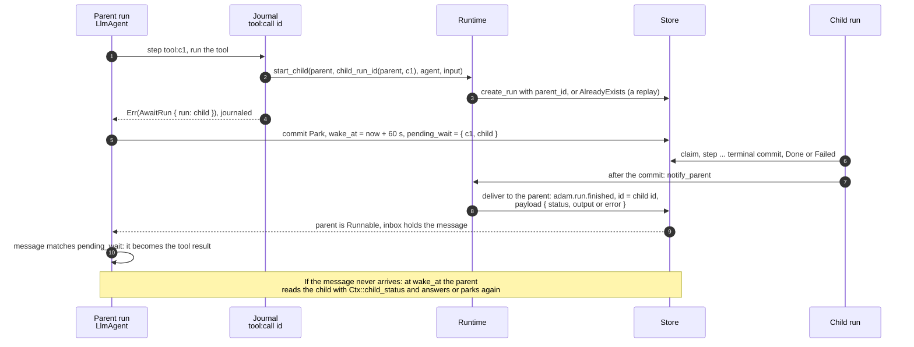

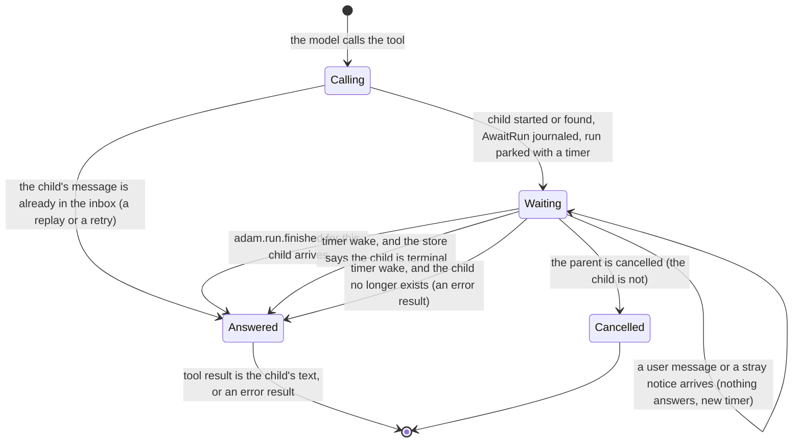

* **The child id is derived.** `child_run_id(parent, key)` is a UUID (version 8) from a SHA-256 over the
  parent id and the key, the same way the A2A adapter derives task ids. `ToolCtx::child_run_id()` is that
  for the current tool call. A tool that runs again, after a crash, a lost lease or a transient retry, asks
  for the same child, and `start_child` (which is `start_with_id` plus the parent) answers `false` and
  leaves the first one alone. The only side effects of the tool are that creation and reads.
* **The message is a hint, the timer is the guarantee.** The runtime sends the message after the child's
  commit, in the worker that made it. It cannot be part of that commit (the store commits one run at a
  time), so a crash or a store error in between loses it, and so does a commit whose acknowledgement is lost
  (the worker then believes the commit failed and sends nothing). The parent therefore never waits without a
  timer: `LlmAgentBuilder::wait_poll` (60 s by default) bounds how late it can be, and each wake without the
  message is one `load_run`. A failed send is logged at `warn`; a parent that is finished or gone is logged
  at `debug` and is not an error.
* **The message is deduplicated by its id.** `Inbound::id` is the child's run id. The `LlmAgent` matches it
  to the run it waits for, uses it once (the wait is cleared in the same commit that consumes it) and drops
  every other: copies of a message already used, a message for a run it does not wait for, one that does not
  parse, one whose status is not final. Such messages are never read as user text.
* **The answer.** A finished child's `output.text` (what an `LlmAgent` child ends with), else its output as
  JSON, is the tool result. A `Failed` child, a cancelled one (`cancelled: <reason>`), one whose state cannot
  be read and one that was purged are an error result (`the run failed: <why>`): the model sees it and the
  run goes on. Nothing in the parent fails because a child did.
* **Who may be asked about.** `Ctx::child_status` answers only for children of the calling run. An id that
  belongs to a run of another parent (or to none) is a permanent error, so an agent cannot read the results
  of unrelated runs, and a derived id that collided with a stranger's run would fail loudly and not answer
  with the stranger's output.
* **`Conversation::pending_wait`** is what the parent is parked on: a `Question` for the user (this field was
  `pending_question`, and state stored under that name still loads) or a `Run` for a child. A2A reads a run
  parked on a timer as `working` and only a run parked with no timer as `input-required`, so a parent
  waiting for a child is `working`.

### Failure interleavings

Written down before the code was final, and each one has a test that makes it happen without sleeping: steps
are held at gates, the 60 s timer is moved with a `ManualClock`, and a fault is scripted on one run of the
`FaultyStore` (`fail_run`, `fail_run_after_apply`). Names are in `crates/adam-runtime/tests/runtime.rs` (run
on the memory, PostgreSQL and MongoDB stores) and `crates/adam-llm-agent/tests/child_runs.rs` (same three).

| # | What happens | What the design does | Test |
|---|---|---|---|
| 1 | The child's terminal commit lands, then its process dies, or delivering to the parent fails | The parent stays parked on its timer. At the timer it reads the child, finds it terminal and answers. Nothing else knows anything is missing | `a_lost_notice_is_recovered_by_the_timer`, `a_lost_notice_is_recovered_when_the_timer_fires` |
| 2 | The child's terminal commit is applied but its acknowledgement is lost | The worker treats the commit as failed and sends nothing (the run is `Done` in the store and nobody claims it again). Same recovery as 1 | `a_lost_terminal_ack_sends_no_notice_and_the_timer_recovers`, `a_lost_terminal_ack_is_recovered_when_the_timer_fires` |
| 3 | The message is delivered twice, or three times, or again after the answer is in, or after the run is over | The first match answers the call and clears the wait. Later copies match no wait and are dropped. On a finished parent `deliver` answers `Finished`, which the sender ignores. The model is not asked again | `a_duplicate_notice_is_ignored`, `only_the_awaited_childs_notice_answers` |
| 4 | The parent is cancelled while it waits | **The child is not cancelled** (see below). It runs to its end within its own limits, its message finds a finished parent and is dropped, and the parent stays `Failed` with `cancelled: <reason>`, untouched | `cancelling_a_waiting_parent_does_not_cancel_its_child`, `cancelling_the_parent_leaves_the_child_running` |
| 5 | The child fails, is cancelled, or was purged | The parent gets `status: failed` and the reason (or, for a purged child, finds it gone) and the tool result is an error result. The run continues | `a_failed_or_cancelled_child_tells_its_parent_why`, `a_failing_child_is_an_error_result`, `a_cancelled_child_is_an_error_result`, `a_child_that_is_gone_is_an_error_result`, `a_purged_child_reads_as_gone` |
| 6 | The parent's lease is lost while it waits, or while it starts the child | Fencing is the version compare-and-swap, not the lease. The worker that took over replays the step: the journal has the start, and `start_child` would answer `false` anyway, so there is one child. The first worker's late commit is refused. The message is delivered with the same compare-and-swap, so it lands on whichever version is current. The parent resumes once. The same holds for the step that answers the call: its consumption of the message commits with it, so a worker that takes over sees the message again and answers the same way | `a_parent_that_loses_its_lease_does_not_start_or_resume_twice`, `a_worker_that_loses_its_lease_while_answering_changes_nothing` |
| 7 | The message arrives before the parent has parked | While the tool step runs: the message waits in the inbox, and the commit turns the park into a wake-up (the rule that already keeps a parked agent from sleeping through a message that arrived during its step). In a replay or a retry of that step: the snapshot the step starts from already holds the message but the wait is not recorded yet, so the agent matches it *after* the tool has returned `AwaitRun`, in the same transition, and never parks | `a_notice_that_beats_the_park_is_not_lost`, `a_notice_that_beats_the_park_is_used`, `a_retry_finds_the_notice_before_the_wait_is_recorded` |
| 8 | The timer fires and the child is still working | One `child_status` read, no answer, a new timer one interval later. No second child, no model call | `a_parent_woken_early_parks_again`, `the_parent_looks_at_the_child_when_the_timer_fires` |
| 9 | A user message arrives while the parent waits | It wakes the parent, which finds nothing to answer with and parks again. The message is kept and appended after the tool result, as for any owed result | `a_message_while_waiting_queues_behind_the_result` |
| 10 | A forged, stray or malformed `adam.run.finished` | Matched by the child's run id only, and only a final status counts. Otherwise it is dropped without becoming user text. `child_status` refuses runs that are not the caller's children | `only_the_awaited_childs_notice_answers`, `child_status_reads_only_the_callers_children` |
| 11 | Two workers start the same child | `create_run` refuses the second (`AlreadyExists`), `start_child` returns `false`. One row | `start_child_records_the_parent_and_is_idempotent` |
| 12 | The process that finishes the child has never heard of the parent's agent | Delivering needs only the parent's run id: it does not have to register the parent's agent. The parent's own worker steps it | the split `front` and `back` runtimes of cases 1, 2, 5 and 6 |

What the design refuses to do, and why:

* **No cascade on cancel (v1).** Cancelling a parent does not cancel its children. A cascade needs a way to
  list children, which the `Store` port does not have (`parent_id` is stored and indexed, and nothing reads
  it), so it is a new port method for three stores and the testkit, and it makes `cancel` more than one
  compare-and-swap. What it costs: a child whose parent is gone runs on until it finishes or hits its limits
  (`max_turns`, `max_tool_calls`), and its message is dropped. That is bounded and visible (the child is a
  normal run, listed and cancellable by id), and `docs/authoring.md` records the same choice for subagents.
  The seam is `Store::children(parent)` plus a loop in `Runtime::cancel`.
* **No parallel fan-out yet.** An `LlmAgent` runs the calls of one model turn in order, and the first
  `AwaitRun` parks the run, so three subagent calls in one turn run one after the other. Starting all the
  children first and waiting for all of them needs `pending_wait` to hold several runs.
* **No timeout on a child, and no asking tools in a subagent.** A parent waits as long as its child is open. A
  child that parks with no timer, for instance because one of its tools asked the user something, waits for
  an answer nobody is placed to give (`Limits` bound a running child, not a parked one). The subagent binding
  (`adam-assembly`) closes this at startup instead of at run time: a tool that can ask says so
  (`Tool::asks_user()`), and `bind` refuses a subagent that has one, so the situation cannot arise from an
  agent directory. A tool that returns `NeedsInput` without declaring it still parks its child, and a child
  can still be cancelled by id: the parent then gets the error result.
* **The output travels whole.** The child's output is the payload of the message, then the text of the tool
  result in the parent's history. Long histories are shortened for the model by `max_history_tokens` as for any
  tool output, but the stored conversation keeps it.
* **No guarantee for a child purged early.** `purge_finished` deletes a finished run with its journal. A
  parent that has not looked yet then reads `None` and reports "the child run no longer exists". Keep the
  retention above the parent's longest wait plus one `wait_poll`.
* **No mixed versions.** The journal entry `AwaitRun` and the `pending_wait` field are not read by a build
  that predates them (it would fail the run as non-deterministic on replay). Roll the workers before the
  tools that start children are enabled. The other direction is safe: journals and states written before
  (`ToolError` without `AwaitRun`, `Conversation` with `pending_question`) load and replay in the new build.

Code that runs inside a step but cannot hold the `Ctx`, such as a tool of an `LlmAgent`, starts a child through
`Ctx::child_starter()`: an owned `ChildStarter` for the runtime that is stepping the run, which can start only
children of that run (`start` is `start_child` with the parent fixed). `LlmAgent` hands it to every tool as
`ToolCtx::start_child(agent, message)` (under `ToolCtx::child_run_id()`), so a tool needs no `Runtime` handle,
and the child starts on the runtime that steps the parent, whichever process that is. The subagent tool of
`adam-assembly` is exactly this call followed by `AwaitRun`; see [subagents](authoring.md#the-subagent-tool-s9).

A hand-written `Agent` can wait for children too: start them with `start_child`, `Park` with a timer, and on
the next step read `take_inbox()` for messages of kind `adam.run.finished` (`ChildStatus::from_notice`) and
`Ctx::child_status` when there is none. It must take its inbox in the step that parks as well: a message
already in the inbox when a step starts is not "arrived during the step", so an agent that parks without
reading it sleeps until its timer.

### Remote tasks: the same wait without a message

A subagent on another A2A agent (`a2a:` in its file, [authoring](authoring.md#remote-subagents-a2a-s9b)) is
the same idea with one thing missing: nothing tells the parent when the remote task is over. The tool starts
the task, returns `ToolError::AwaitRemote { task, timeout_ms }`, and the parent records
`PendingWait::Remote { call_id, tool, task, deadline }` and parks with the `wait_poll` timer. Each time the
timer fires the agent asks the tool how the task stands, as a journaled step, until it is over. There is no
`adam.run.finished` here and no fallback role for the timer: **the timer is the mechanism**.

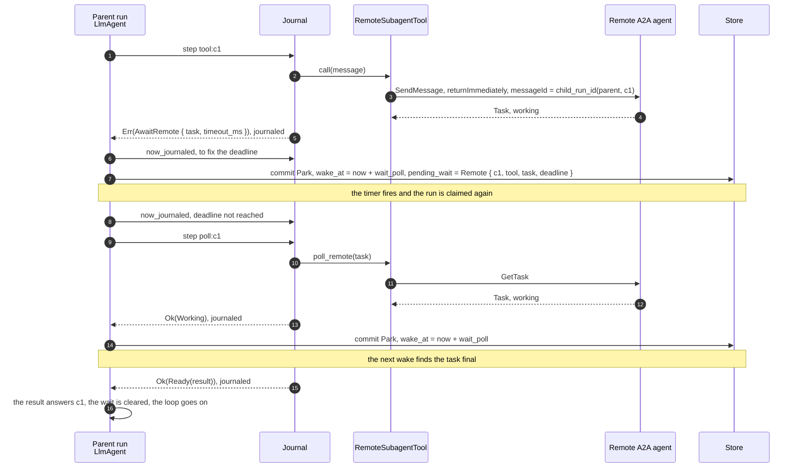

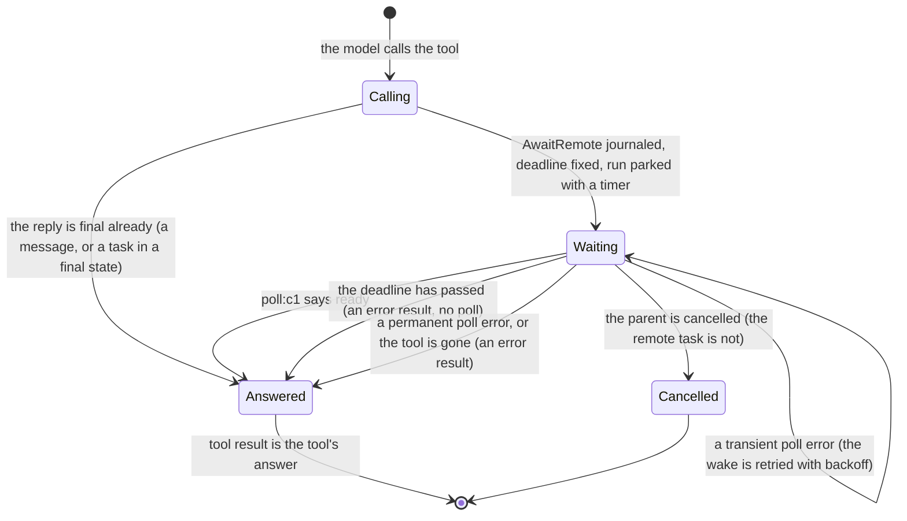

* **Every look is a journal step.** `poll:<call id>` records `Working` or `Ready(result)`, and, when the wait
  has a deadline, `ctx.now` is read through the journal (`Ctx::now_journaled`) so that a replay takes the
  same branch (a replay that skipped a recorded `poll:` step because the clock had moved would meet the
  wrong step name at the next `seq` and fail as non-deterministic). A transient poll error fails the wake as
  `AgentError::Transient`, and the retry looks again from a fresh `seq`.
* **The start is idempotent by message id, not by run id.** A child run is started under an id the runtime
  refuses to create twice; a remote task is started by a `SendMessage` whose `messageId` is
  `child_run_id(parent run, call id)`. The guarantee is only as good as the remote's memory of that id
  (`adam-a2a-runtime` starts the task under `task_id_for(agent, caller, context, messageId)`, so a repeat reaches
  the same task). The journal makes the call once per recorded outcome regardless.
* **Failure interleavings.**

| # | What happens | What the design does | Test |
|---|---|---|---|
| 1 | The process dies while the parent waits | The wait is in the run's committed state. A new process claims the run at the timer and polls the recorded task: no second send | `a_restart_mid_wait_resumes_polling_without_sending_again` (`adam-assembly`), `a_new_process_keeps_polling_without_starting_the_task_again` (`adam-llm-agent`) |
| 2 | The send reaches the remote and its response is lost | The step fails transiently and is retried; the retry sends the same `messageId`, and a deduplicating remote returns the task it made | `a_send_whose_response_is_lost_is_retried_under_the_same_message_id` |
| 3 | The remote finishes while nobody polls | The next timer wake finds it final and answers | the restart case above |
| 4 | The task never ends | At the deadline (default one hour, `AgentDef::remote_timeout`) the call is answered with an error result; the remote task keeps running | `a_task_that_never_ends_is_given_up_on_after_the_limit`, `a_task_that_outlives_its_timeout_is_an_error_result_without_another_look` |
| 5 | The remote fails, cancels, rejects, or wants input | An error result naming the state and the remote's message; the run goes on | `a_remote_task_that_fails_is_an_error_result_and_the_parent_goes_on`, `a_remote_task_that_is_canceled_is_an_error_result`, `a_remote_that_needs_input_is_an_error_result_because_nobody_can_answer` |
| 6 | The remote answers 401 or the card points the token elsewhere | An error result; nothing is sent to the other origin | `a_wrong_token_is_an_error_result_not_a_failed_run_and_the_token_stays_out_of_it`, `a_card_that_points_the_token_at_another_origin_is_refused_before_anything_is_sent` |

* **What it refuses to do.** No streaming yet (`SubscribeToTask` would end the wait sooner; the poll stays as
  the fallback); no cancel of the remote task when the parent is cancelled or the wait times out (that needs a
  tool hook for cancellation); no `contextId` continuity between calls. And, as with child runs, **no mixed
  versions**: a build that predates `AwaitRemote` cannot read a journal that contains it.

## The error tree

Each library defines its own error enum with `thiserror`. A variant says **what
happened**. Its `ErrorClass` (from `adam-error`) says **what to do**. Retry loops,
the A2A error a client sees and the process exit code all decide from the class,
never from a variant. Every enum implements `Classify`, and its test matches
every variant exhaustively, so a new variant forces a class decision.

The first diagram shows which variants map to which class. A dotted arrow means
the enum wraps another and takes its class. `Unsupported` is a valid class, but
no enum in this repository maps to it today (checked by reading the 11
`impl Classify` blocks outside tests).

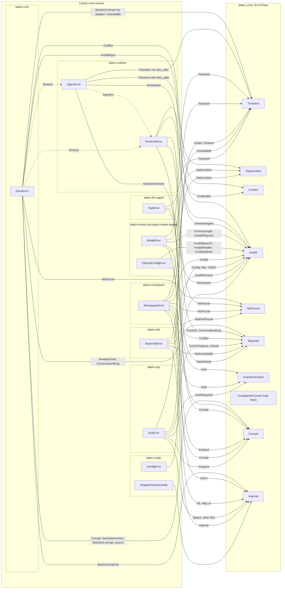

The second diagram shows what each class decides. The full table (with the
"alert" column and the exact messages) is the **Errors** section of the
[root README](../README.md#errors). It is the reference, so this page does
not repeat it.

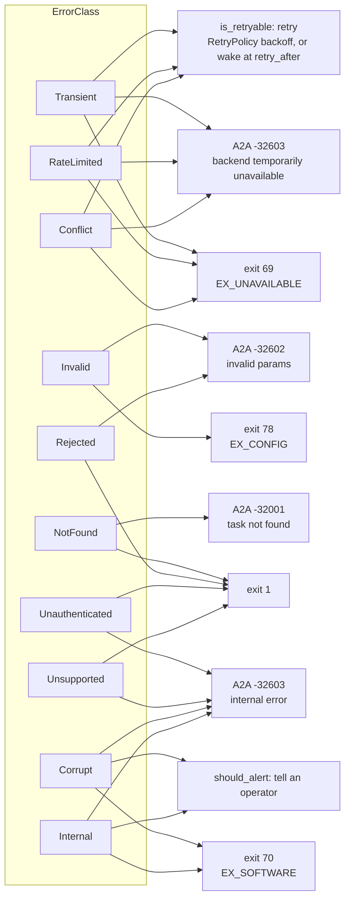

Where each decision is made:

* **Retry** is in `adam-runtime` (`worker.rs`). The model, workspace and ACP
  errors reach it through the agent: a retryable one becomes
  `AgentError::Transient` (directly in `LlmAgent` for a model error, or through
  `ToolError::Transient` for a tool), carrying its `retry_after`. Anything else
  fails the call. In the coder, a permanent tool failure is an error result
  the model sees, and the run goes on.
* **Conflict** retries at once and is bounded: the runtime's commit, deliver,
  cancel and start loops try up to 16 times (`MAX_COMMIT_RETRIES`). Then
  `deliver`, `cancel` and `start` report `Contended`, and a worker drops its
  result with a warning.
* **The A2A code** is chosen at the trust boundary in two steps. First
  `adam-a2a-runtime` maps a `RuntimeError` **by class** to a `BackendError`
  (`map_err` in `crates/adam-a2a-runtime/src/backend.rs`): `NotFound` to
  `TaskNotFound`, `Invalid` and `Rejected` to `InvalidParams`, the three
  retryable classes to `Unavailable`, the rest to `Internal`. Then `adam-a2a`
  maps each `BackendError` to a code (`crates/adam-a2a/src/backend.rs`). The
  client gets a fixed sentence. The cause chain goes to the log, never to the
  client. `-32002` (task cannot be canceled) comes from
  `BackendError::NotCancelable`, which the backend raises when `CancelTask`
  targets a task that is finished and not already canceled.
* **The exit code** is chosen by `adam_coder::exit_code`
  (`crates/adam-coder/src/exit.rs`). It walks the `anyhow` chain from the
  outside in and takes the first match. A `ConfigError` is 78. A typed error
  (`StoreError`, `OpenAiConfigError`, `WorkspaceError`, `RuntimeError`,
  `StoppedUnexpectedly`) is decided by its class, as in the diagram. A panicked
  task is 70. A plain `std::io::Error` (a port that cannot bind, a directory
  that cannot be created) is 71. Anything else is 1. The process logs one
  structured line, `adam-coder failed`, with the whole cause chain and none of
  the process's secrets. The values are BSD `sysexits.h` numbers (*unverified*,
  see the end of this page).

Two rules keep this tree honest (details in the
[`adam-error` README](../crates/adam-error/README.md)):

* A message describes its own layer only, and the lower error is the `source`.
  `adam_error::report(&e)` prints the chain (`a: b: c`) once, and only where an
  error is flattened: the journal, a response to a client, a log line.
* Library crates use `thiserror`. Only binaries use `anyhow`.

## The coder agent

`adam-coder` turns a coding task into a pull request. A client sends
"in repository X, do Y". The agent makes the change in a private git worktree,
runs the project's own checks, and opens a pull request. It is an `LlmAgent`
with six tools and one extra rule, running on the durable runtime and served
over A2A.

### What it does

The model decides the order of the tools. The tools enforce the rules, so the
rules hold even if the model ignores its prompt.

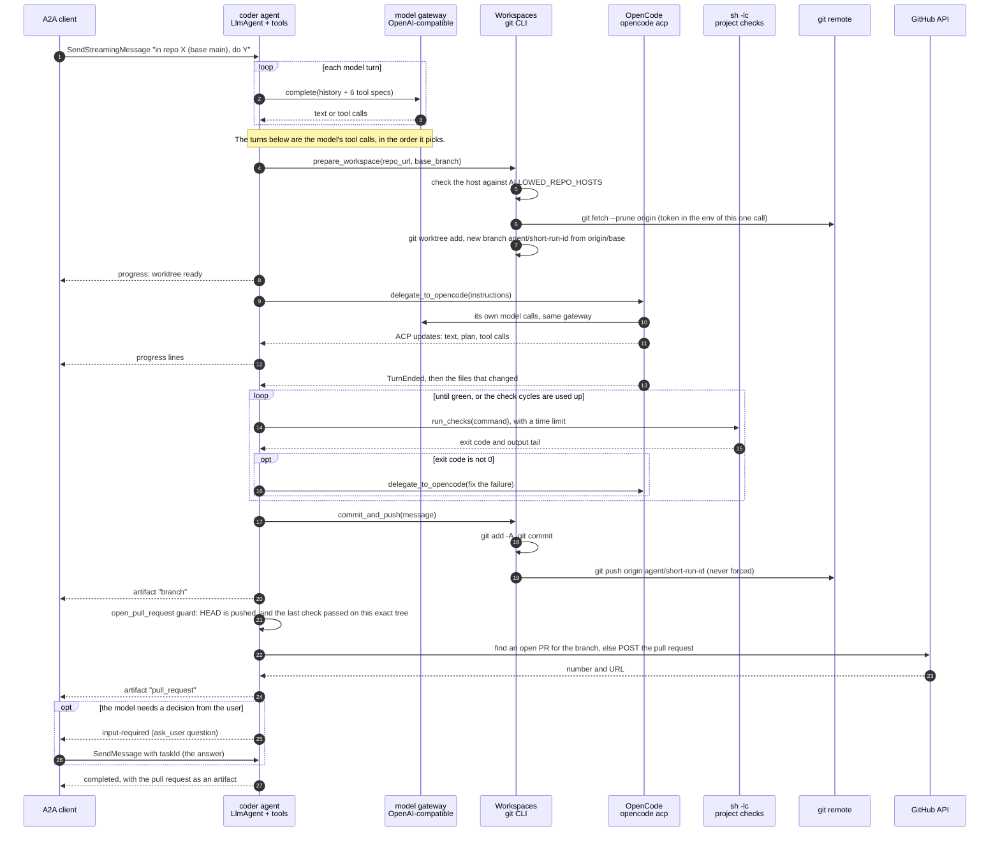

The `pull_request` artifact has two parts: a data part with the JSON
(`url`, `number` as a string, `branch`, `repository`) and, after it, an A2A
`url` part (`Part.url`, A2A v1) with the pull request's URL, so a chat surface
shows a link. The mapping is `adam_a2a_runtime::artifact_of`, which does this
for any artifact whose data is an object with an absolute `http(s)` `url`; the
`branch` artifact has no such field and stays a single data part.

The same flow as states, from the point of view of the run notes and the
tools' guards:

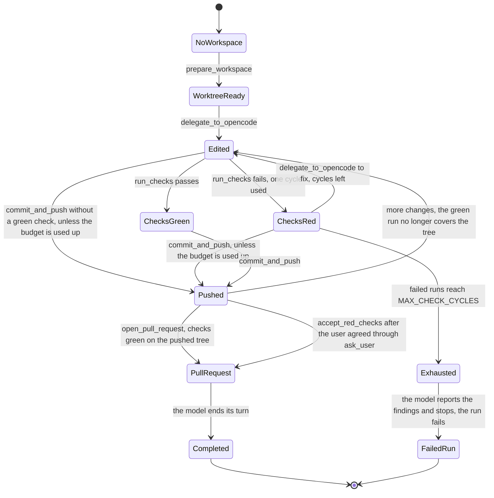

`Exhausted` has no way out except failure: `run_checks`, `commit_and_push` and
`open_pull_request` all refuse, and `accept_red_checks` never overrides it. The states are not stored as an enum:
they follow from the per-run notes (failures counted, last check and its tree,
pushed sha, pull request) and the worktree.

What the diagrams cannot say (`crates/adam-coder/src/`):

* **The tools** (`tools/`): `prepare_workspace`, `delegate_to_opencode`,
  `run_checks`, `commit_and_push`, `open_pull_request` and `ask_user`.
* **The prompt and the card** (`agent/instructions.md`, embedded by `build.rs`): the system prompt with its
  `{{max_check_cycles}}`, the loop's limits and the A2A card are a file, not Rust; `CoderAgent::new` puts
  the file, the tools, the `ToolEnv` state and the model together with `AgentDef`, and keeps only the
  completion policy in Rust.
* **Rules in code.**
  * After `MAX_CHECK_CYCLES` (default 3) failed check runs, `run_checks`
    refuses to run. `commit_and_push` and `open_pull_request` refuse too.
  * `open_pull_request` refuses unless the pushed `HEAD` is the current commit
    and the last check run passed **on exactly the tree it contains**.
  * A completed run with no pull request fails, if its last check was red or
    the credentials were rejected (`CoderAgent::verdict`). "The model said it
    is done" is not the same as "delivered".
* **Safe to repeat.** A tool call that dies before its result is journaled
  runs again, so each tool is safe to repeat. `prepare_workspace` reuses the
  run's worktree, `commit_and_push` does nothing when there is nothing new,
  `open_pull_request` returns the open pull request of the same branch, and
  failed checks are counted per call id.
* **Where state lives.** Conversation, journal and run state are in Postgres.
  The mirrors, worktrees and per-run notes
  (`<WORKSPACE_ROOT>/coder/<run>.json`) are files under `WORKSPACE_ROOT`. Git is
  the durable artifact: a lost database loses the run ledger, not the pushed
  branches or the pull requests.
* **Secrets.**
  * The git token reaches `git` only through the environment of a single
    invocation, never in a remote URL or `.git/config`, and only for hosts on
    the allow-list (`ScopedToken` plus `Workspaces::allow_hosts`).
  * OpenCode's child process gets `MODEL_API_KEY` through its environment (its
    config says `{env:MODEL_API_KEY}`, so the key is not inlined). `GITHUB_TOKEN`,
    `DATABASE_URL` and `A2A_BEARER_TOKENS` are blanked in the child.
  * A `Redactor` scrubs the process's own secrets from every tool result, event
    and failure text.
* **Limits** (`limits:` in `agent/instructions.md`): 200 model turns, 400 tool calls, 8192 output
  tokens per call, 100,000 tokens of history sent to the model. A limit that
  trips fails the run.
* **Cancel.** When a run is cancelled while OpenCode works, the tool sends ACP
  `session/cancel`, waits 2 seconds, then kills OpenCode and its process group.
* **Configuration** is environment variables only. The table is in
  `crates/adam-coder/src/config.rs` and the
  [crate README](../crates/adam-coder/README.md). Every problem is reported at
  once as `invalid configuration`.

### How it is deployed

One container, one process, one database. The image is built by
`docker/coder/Dockerfile` and installed by the Helm chart in `deploy/coder`.

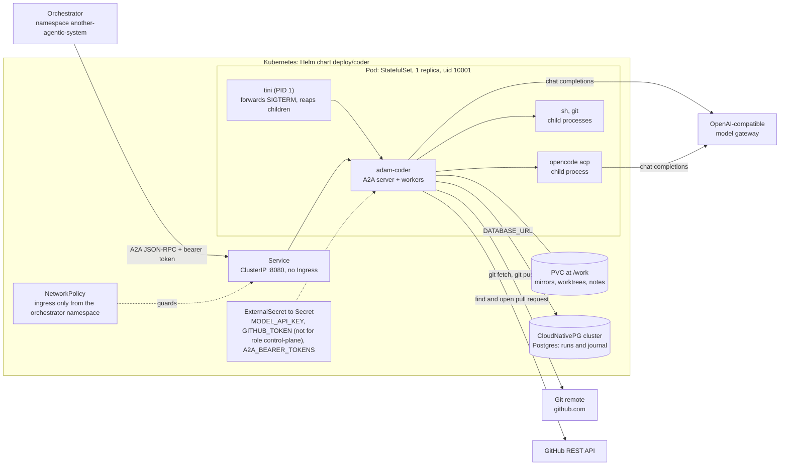

With `topology: split`:

```mermaid
flowchart LR
    orch["Orchestrator<br/>namespace another-agentic-system"]
    gw["OpenAI-compatible<br/>model gateway"]
    remote["Git remote and GitHub REST API"]

    subgraph k8s["Kubernetes: Helm chart deploy/coder, topology split"]
        svc["Service<br/>ClusterIP :8080, selects the front"]
        front["Deployment: front, front.replicas<br/>ROLE=control-plane, no volume"]
        worker["StatefulSet: worker, 1 replica<br/>ROLE=worker, /healthz only"]
        pvc[("PVC at /work")]
        cnpg[("CloudNativePG cluster<br/>Postgres: runs and journal")]
    end

    orch -->|"A2A JSON-RPC + bearer token"| svc
    svc --> front
    front -->|"DATABASE_URL"| cnpg
    worker -->|"DATABASE_URL"| cnpg
    worker --- pvc
    worker -->|"chat completions"| gw
    worker -->|"git, pull requests"| remote
```

Facts about the deployment (`docker/coder/Dockerfile`, `deploy/coder/`):

* **Image.** Two stages. The first compiles `adam-coder` on `rust:1.94-trixie`
  (the base image is pinned by tag and digest) so that its glibc matches the
  runtime image. The second is the `workspace` image of
  `vymalo/another-agentic-images` (Rust, Flutter/Dart, Node, git, tini,
  OpenCode), pinned by an immutable tag. The last `RUN` is a smoke test as uid
  10001. The entrypoint is `tini -- adam-coder`. It listens on `0.0.0.0:8080`.
* **Topology.** `topology: combined` (the default, the diagram above) is one StatefulSet
  running `adam-coder` as `all`. `topology: split` deploys the two halves as separate
  workloads (diagram below): a front `Deployment` (`ROLE=control-plane`, no volume, replicas
  from `front.replicas`) that the Service selects, and the worker `StatefulSet`
  (`ROLE=worker`), which keeps the combined StatefulSet's name, selector and volume claim, so
  switching topology reuses the same PVC. The front holds only `DATABASE_URL` and the A2A
  tokens; the worker holds the model and GitHub secrets and the volume. Deploy-only: no
  binary changed. Verified 2026-09-29: `crates/adam-coder/src/config.rs` requires
  `A2A_BEARER_TOKENS` and `PUBLIC_URL` only for the roles that serve A2A.
* **More than one worker needs a placement.** Runs move between workers at every step
  (`adam-runtime`'s worker), while a worktree lives in one worker's `/work`. A second worker
  that does not have a run's worktree would continue it on a checkout that is not there, and
  fork it into a second pull request. The chart therefore refuses `replicaCount > 1` for the
  roles that run workers until `workspace.placement` is set
  ([ADR 0002](decisions/0002-workspace-placement.md)), and passes it to the binary as
  `WORKSPACE_PLACEMENT` (with `WORKER_ID` from the pod name, the downward API, for the
  placements that pin runs): `isolated` keeps a PVC per pod, `affinity` mounts one
  ReadWriteMany claim and the coder keeps a folder per worker in it, `shared` mounts the same
  claim and lets any worker step any run (guarded by the mirror lock). `a2a-only` is refused.
  See *Where a run's files live: workspace placement*. The front scales freely: it is
  stateless.
* **Probes** hit `/healthz`. Graceful shutdown gets 120 seconds: on SIGTERM the
  workers finish the steps they are in. A step cut short by SIGKILL is taken
  over by the next start once its lease expires.
* **No Ingress.** The orchestrator reaches the Service inside the cluster with
  a bearer token. The chart's `NetworkPolicy` allows ingress only from the
  orchestrator's namespace. It is enforced only if the cluster's CNI enforces
  network policies.
* **Secrets** come from an `ExternalSecret` (AWS Secrets Manager through External
  Secrets). The database URL is the `uri` key of the Secret that CloudNativePG
  creates. With `config.role=control-plane` the chart renders neither
  `MODEL_API_KEY` nor `GITHUB_TOKEN` (nor the model, GitHub and workspace
  settings): the control plane holds none of them. `all` and `worker` need both.
* **Known risks** (stated in the chart README): no database backups, a pinned run whose
  worker never returns is stranded, and `flock` on NFS or Longhorn RWX is unverified.

How a change reaches the chart (`.github/workflows/coder.yml`):

```mermaid
sequenceDiagram
    autonumber
    participant Dev as Pull request
    participant CI as coder.yml
    participant GH as ghcr.io
    participant Chart as deploy/coder/values.yaml

    Dev->>CI: helm lint and template, kubeconform, hadolint, shellcheck
    Dev->>CI: build the image and run the container smoke test
    CI-->>Dev: green
    Dev->>CI: merge to main
    CI->>CI: build the image and smoke-test it again
    CI->>GH: push ghcr.io/vymalo/another-adam-rs/coder, tag sha-XXXXXXX
    CI->>Chart: set image.tag, commit "chore(deploy): bump coder to sha-XXXXXXX"
```

The workflow ends at the commit. How the chart is then applied to the cluster
is outside this repository (*unverified* here).

### The local Compose stack

`compose.yaml` runs the databases, WireMock stand-ins for the external systems,
a local git remote, and, under the `app` profile, the coder wired to all of
them. Ports bind to `127.0.0.1` and every credential is a dummy. The
[root README](../README.md#local-development) has the ports, the environment
variables, and the scenario switches of each mock.

```mermaid
flowchart LR
    subgraph host["Host"]
        cargo["cargo test<br/>ADAM_TEST_* variables"]
        curl["curl, an A2A client"]
    end

    subgraph stack["Compose project adam-rs"]
        pgs[("postgres :5432<br/>database adam_test")]
        mongos[("mongodb :27017<br/>standalone")]
        moai["mock-openai :8081<br/>WireMock, chat completions"]
        mogh["mock-github :8082<br/>WireMock, pull requests"]
        gitsrv["git-server :8083<br/>nginx + git-http-backend<br/>local/sandbox.git"]
        cdr["coder :8080<br/>profile app, built from docker/coder/Dockerfile"]
    end

    curl -->|"A2A, bearer dev-token"| cdr
    cdr -->|"DATABASE_URL"| pgs
    cdr -->|"MODEL_BASE_URL"| moai
    cdr -->|"GITHUB_API_URL"| mogh
    cdr -->|"repository in the task"| gitsrv

    cargo --> pgs
    cargo --> mongos
    cargo --> moai
    cargo --> mogh
```

* `mongodb` is used by the store tests only. The coder does not use it.
* The coder waits until `postgres`, `mock-openai`, `mock-github` and `git-server`
  are healthy.
* The mock model is canned: it answers in text, or calls the first declared tool
  with `{}`. So it cannot drive OpenCode through a real change, and a local run
  does not end in a pull request. A complete run needs a model that can call
  tools. The git remote and the pull request API can still be `git-server` and
  `mock-github`. See the root README for this caveat and for the live smoke
  test in the [`adam-coder` README](../crates/adam-coder/README.md).
* The `compose` job in `.github/workflows/ci.yml` starts the mocks and runs the
  real clients (`OpenAiCompatible`, `GitHub`) against them, so the mappings
  cannot rot.

## Where to go next

| Crate | Layer | README |
|---|---|---|
| `adam-error` | contracts | [crates/adam-error](../crates/adam-error/README.md) |
| `adam-core` | contracts | [crates/adam-core](../crates/adam-core/README.md) |
| `adam-model` | contracts | [crates/adam-model](../crates/adam-model/README.md) |
| `adam-a2a` | contracts | [crates/adam-a2a](../crates/adam-a2a/README.md) |
| `adam-store-postgres` | implementation | [crates/adam-store-postgres](../crates/adam-store-postgres/README.md) |
| `adam-store-mongodb` | implementation | [crates/adam-store-mongodb](../crates/adam-store-mongodb/README.md) |
| `adam-model-openai` | implementation | [crates/adam-model-openai](../crates/adam-model-openai/README.md) |
| `adam-workspace` | implementation | [crates/adam-workspace](../crates/adam-workspace/README.md) |
| `adam-acp` | implementation | [crates/adam-acp](../crates/adam-acp/README.md) |
| `adam-notify-postgres` | implementation | [crates/adam-notify-postgres](../crates/adam-notify-postgres/README.md) |
| `adam-runtime` | runtime | [crates/adam-runtime](../crates/adam-runtime/README.md) |
| `adam-a2a-runtime` | runtime | [crates/adam-a2a-runtime](../crates/adam-a2a-runtime/README.md) |
| `adam-llm-agent` | agent | [crates/adam-llm-agent](../crates/adam-llm-agent/README.md) |
| `adam-coder` | agent, binary | [crates/adam-coder](../crates/adam-coder/README.md) |
| `adam-macros` | authoring, proc-macro | [crates/adam-macros](../crates/adam-macros/README.md) |
| `adam` | authoring, facade | [crates/adam](../crates/adam/README.md) |
| `adam-store-testkit` | test kit | [crates/adam-store-testkit](../crates/adam-store-testkit/README.md) |
| `adam-notify-testkit` | test kit | [crates/adam-notify-testkit](../crates/adam-notify-testkit/README.md) |

Also:

* [Root README](../README.md): the durable model, how each store keeps its
  promises, local development, errors, testing.
* [`deploy/coder/README.md`](../deploy/coder/README.md): the Helm chart, its
  secrets and its known risks.

## Verified and unverified

**Verified 2026-09-29, source: this repository at commit `172a117`.** The crate
graph (from each `Cargo.toml`), the traits and their implementations (from a
search for every `pub trait` and `impl` of it), every error enum and its
`Classify` impl, the run transitions (`runtime.rs`, `worker.rs`), the request
path, the coder's tools and rules, the Dockerfile, the chart templates and
`compose.yaml`. Nothing was executed to check them: the diagrams come from
reading the code. The Mermaid syntax of every diagram is checked in CI by
`tools/docs-check`.

**Verified 2026-09-29, source: this repository with the `Notifier` port and
`adam-notify-postgres`, executed.** The cross-process fan-out and the listener
lifecycle above are checked by `crates/adam-notify-postgres/tests/two_runtimes.rs`
(a front and a worker with a 30 s poll, against PostgreSQL 16), and the
`NOTIFY` payload limit of 8000 bytes against a 16.13 server. See the crate's
README for the third-party facts (PostgreSQL docs, `sqlx-postgres` 0.9.0 source).

**Unverified.**

* The `sysexits.h` numbers 78, 69, 71 and 70 are from memory. The code and the
  root README say the same. The header is not in this repository.
* The A2A method names (`SendMessage`, `SendStreamingMessage`, `GetTask`,
  `CancelTask`, `SubscribeToTask`), the `TASK_STATE_*` names and the error
  codes `-32001` and `-32002` are as documented in `crates/adam-a2a/src/lib.rs`
  for the pinned SDK (`a2a-lf` 0.3, `a2a-server-lf` 0.4). They were not checked
  here against the A2A specification.
* How the SDK frames SSE, and that it sends a keepalive comment every 15 seconds,
  is taken from the `adam-a2a` docs, not re-tested.
* OpenCode's behaviour (ACP over stdio, `{env:VAR}` substitution in its
  inline config) is as recorded in `crates/adam-coder/src/opencode.rs`, which
  cites the OpenCode source at `sst/opencode@7945de2`. It was not re-checked
  here, and a live run against a real gateway is not covered by CI.
* The chart was rendered but, per its README, not applied to a cluster or
  validated against the CRD schemas of the installed operators. The compose
  `app` profile was validated with `docker compose config` only when it was
  written.
* How the chart reaches the cluster after the tag bump is outside this
  repository.
