# Architecture

adam-rs is a Rust workspace of 29 crates for **durable AI agents**. An agent is a state machine: the
runtime saves its state after every step, so a worker that dies loses nothing and another resumes from
the last saved step. Every piece of infrastructure (database, model, code host, A2A backend) sits
behind a trait, chosen at build time.

This page is the mental model. Deep dives are linked from each section; decisions are in
[`decisions/`](decisions/). Everything here describes the code as built; third-party claims are marked
*verified* or *unverified* ([the end of the page](#verified-and-unverified)).

* [The mental model](#the-mental-model)
* [The crate map](#the-crate-map)
* [Ports and implementations](#ports-and-implementations)
* [Processes and roles](#processes-and-roles)
* [The path of a task](#the-path-of-a-task)
* [The run lifecycle](#the-run-lifecycle)
* [Data: the run store](#data-the-run-store)
* [Across processes: signals and events](#across-processes-signals-and-events)
* [Child runs](#child-runs)
* [Errors](#errors)
* [Where a run's files and processes live](#where-a-runs-files-and-processes-live)
* [The two agents](#the-two-agents)
* [Verified and unverified](#verified-and-unverified)

## The mental model

| Word | Meaning |
|---|---|
| **Run** | One execution of an agent. Its id is the A2A `task_id`. The runtime keeps its state in `RunRecord::state` (JSON) and commits every transition with a compare-and-swap on `version`. |
| **Step** | One side effect, `ctx.step(name, ..)`. Its outcome is written to the **journal**, keyed `(run, seq)`. On replay the recorded outcome is returned and the effect does not run again. The first writer wins; a different step name at the same `seq` fails the run with `NonDeterminism`. |
| **Lease** | A worker's claim on a due run for a TTL. It avoids wasted work. **Correctness is the `version` compare-and-swap**: a worker whose lease expired cannot overwrite newer state. |
| **Conversation** | At most one open (runnable or parked) run per `(agent, conversation_id)`, enforced by a unique index. A second message resumes the open run instead of starting another. |
| **Port** | A trait that a crate defines and others implement (`Store`, `ModelClient`, `TaskBackend`, `CodeHost`, `Environment`, `Notifier`). Swapping is a build-time choice, never a runtime plugin. |
| **Signal** | A hint over `LISTEN`/`NOTIFY` that makes a worker or a step react at once. Never the truth: polling and the store decide. |

What survives a crash is the run record and the journal. What does not is anything in memory: live
events, streamed text, a lease.

## The crate map

An arrow means "depends on". Solid arrows are `[dependencies]`; dotted arrows are optional features.
The picture is a selection: nearly every crate also depends on `adam-error`, and the test kits
(`adam-store-testkit`, `adam-notify-testkit`, `adam-mcp-testkit`, `adam-agent-fixture`) are left out.

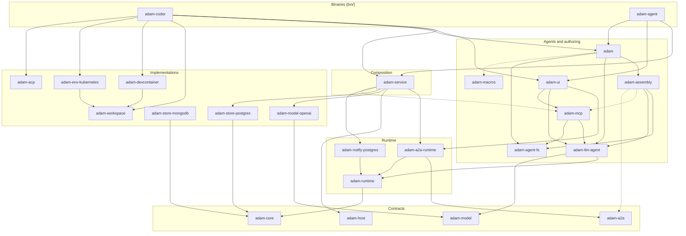

| Layer | Crates | Job |
|---|---|---|
| Contracts | [`adam-error`](../crates/adam-error/README.md), [`adam-core`](../crates/adam-core/README.md), [`adam-model`](../crates/adam-model/README.md), [`adam-a2a`](../crates/adam-a2a/README.md), [`adam-host`](../crates/adam-host/README.md) | Error classes, the `Store` port and run types, the `ModelClient` port, the `TaskBackend` port with the A2A 1.0 server, the process `Role` and `Placement` with a supervisor. |
| Implementations | `adam-store-postgres`, `adam-store-mongodb`, `adam-model-openai`, [`adam-workspace`](../crates/adam-workspace/README.md), [`adam-devcontainer`](../crates/adam-devcontainer/README.md), [`adam-env-kubernetes`](../crates/adam-env-kubernetes/README.md), [`adam-acp`](../crates/adam-acp/README.md), `adam-notify-postgres` | Each in a crate of its own, so a binary links only what it uses. |
| Runtime | [`adam-runtime`](../crates/adam-runtime/README.md), [`adam-a2a-runtime`](../crates/adam-a2a-runtime/README.md), [`adam-service`](../crates/adam-service/README.md) | The run state machine, journal, workers and retry policy; the A2A backend over it; the composition every agent binary shares. |
| Agents and authoring | [`adam-llm-agent`](../crates/adam-llm-agent/README.md), [`adam-ui`](../crates/adam-ui/README.md), [`adam-mcp`](../crates/adam-mcp/README.md), [`adam-agent-fs`](../crates/adam-agent-fs/README.md), [`adam-assembly`](../crates/adam-assembly/README.md), [`adam-macros`](../crates/adam-macros/README.md), [`adam`](../crates/adam/README.md) | The model-and-tools loop; the screen's tools; MCP tools; the agent-folder parser; binding a folder to agents; `#[tool]`; the facade. See [Write an agent](guides/write-an-agent.md). |
| Binaries | [`adam-coder`](../bin/adam-coder/README.md), [`adam-agent`](../bin/adam-agent/README.md) | The two agents you can run. Library and binary each, over `adam-service`. |
| Operator | [`adam-operator-api`](../crates/adam-operator-api/README.md), [`adam-operator-domain`](../crates/adam-operator-domain/README.md), [`adam-operator-ports`](../crates/adam-operator-ports/README.md), [`adam-operator-controller`](../crates/adam-operator-controller/README.md), [`adam-operator-runtime-kubernetes`](../crates/adam-operator-runtime-kubernetes/README.md), [`adam-operator-store-cnpg`](../crates/adam-operator-store-cnpg/README.md), [`adam-operator-store-secret`](../crates/adam-operator-store-secret/README.md), [`adam-operator-registry`](../crates/adam-operator-registry/README.md), binary [`adam-operator`](../bin/adam-operator/README.md) | Runs agents on Kubernetes from `AgentService` and `AgentConfig`; it has its own ports (`RuntimeProvider`, `StoreProvisioner`, `AgentDirectory`) and is separate from the run path above. See [ADR 0029](decisions/0029-adam-rs-has-an-operator.md) and [Run agents with the operator](guides/run-agents-with-the-operator.md). |

`adam-env-kubernetes` also ships the `adam-kube-exec` binary. The workspace is `crates/*` and `bin/*`
(root `Cargo.toml`): a new crate joins by adding a directory with a `README.md`.

## Ports and implementations

A port is a trait. The core holds a `dyn` handle (`DynStore`, `DynModel`, `DynTaskBackend`,
`DynCodeHost`, ...) and never names an implementation. Swapping happens in `Cargo.toml` and in the
composition root.

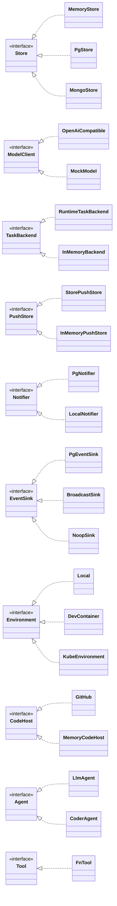

| Port | Defined in | Real implementations | Doubles |
|---|---|---|---|
| `Store` | `adam-core` | `PgStore`, `MongoStore` | `MemoryStore` (reference), `FaultyStore` (testkit) |
| `ModelClient` | `adam-model` | `OpenAiCompatible` (`adam-model-openai`) | `MockModel` |
| `TaskBackend` | `adam-a2a` | `RuntimeTaskBackend` (`adam-a2a-runtime`) | `InMemoryBackend` (feature `test-util`) |
| `PushStore` | `adam-a2a` | `StorePushStore` (`adam-a2a-runtime`, over the `Store`) | `InMemoryPushStore` (feature `test-util`) |
| `Notifier`, `EventSink` | `adam-runtime` | `PgNotifier`, `PgEventSink` (`adam-notify-postgres`), `BroadcastSink` (in process) | `LocalNotifier`, `NoopSink`, `CollectingSink` |
| `Clock` | `adam-runtime` | `SystemClock` | `ManualClock` |
| `Agent`, `AgentStarter` | `adam-runtime` | `LlmAgent`/`LlmStarter`, `CoderAgent`/`CoderStarter` | test agents |
| `Tool`, `ToolSource` | `adam-llm-agent` | the coder's tools, `FnTool`, MCP tools, `ThreadTools` (`adam-ui`) | test tools |
| `CodeHost` | `adam-workspace` | `GitHub` (feature `github`) | `MemoryCodeHost` (feature `test-util`) |
| `GitCredentials` | `adam-workspace` | `ScopedToken`, `GitHubApp` (inside `HostScoped`), `StaticToken` | none needed |
| `Environment` | `adam-workspace` | `Local`, `DevContainer` (`adam-devcontainer`), `KubeEnvironment` (`adam-env-kubernetes`) | stub Podman, CLI and API server in the tests |
| `CallBearer` | `adam-mcp` | `GitHubReadBearer` (`adam-coder`) | test bearers |
| `PermissionPrompt` | `adam-acp` | none (the default policy needs no prompt) | `StaticPrompt` |

`AgentStarter` is the start-only half of `Agent` (`name`, `init`, `init_continuing`): a process that
only accepts requests registers a starter and never holds the model or credentials.
`Workspaces` (git) and `AcpClient` (a child process) are concrete types, not ports.

Rules the code follows:

* No implementation type appears in a trait signature; a driver error is a boxed `source`.
* A store passes the conformance suite `store_conformance!`; to add a backend, implement `Store` and add
  one line ([testing](guides/testing.md#adding-a-backend)).
* The guarantee is the version compare-and-swap in `Store::commit_run`, not the lease.

## Processes and roles

`adam-service`'s `serve(ServiceConfig, Agents, shutdown)` is the whole process. A binary builds its
agent and hands over `Agents { name, card, register, options }`; `serve` connects the store, builds
the runtime, the A2A router and the signals, and registers the components of the role with an
`adam_host::Host`. `main` is `serve(Config::from_env(), sigterm)`.

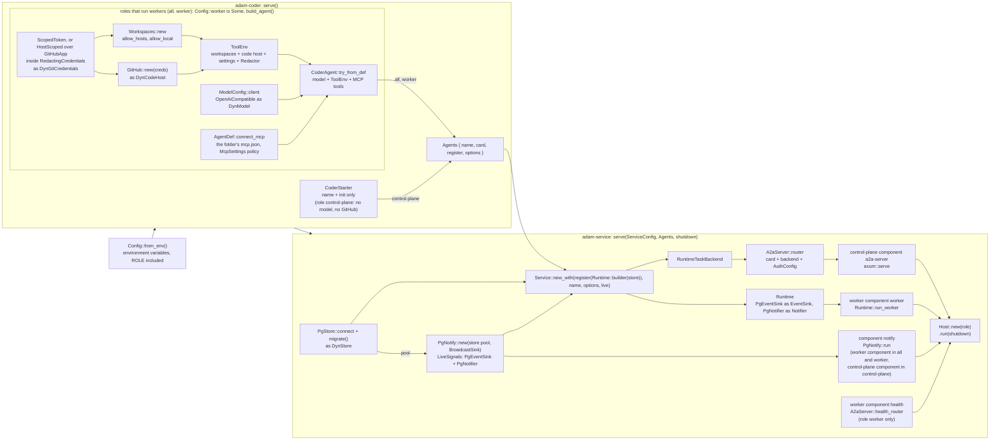

| `ROLE` | Components | Needs |
|---|---|---|
| `all` (default) | `a2a-server`, `worker`, `notify` in one process | every variable |
| `control-plane` | `a2a-server`, `notify`, over a runtime that has only the agent's starter (starts, delivers, cancels and views runs; never steps) | `DATABASE_URL`, `A2A_BEARER_TOKENS`, `PUBLIC_URL`; no model, GitHub or workspace variable |
| `worker` | `worker`, `notify`, `health` (`GET /healthz` on `LISTEN_ADDR`, no A2A) | everything except `A2A_BEARER_TOKENS` and `PUBLIC_URL` |

* The roles meet in the store (the record and its CAS, the leases) and in `NOTIFY` ([below](#across-processes-signals-and-events)).
* On SIGTERM `Host` stops the control plane first (open streams get 10 s), then the workers with no
  bound, so they finish and commit the steps they are in. A component that stops on its own stops the
  others in the same order and the process exits 70 naming it.
* Several `adam-agent` processes with different folders can share one database: runs are scoped by the
  agent's name.

## The path of a task

A task is a run. A client talks JSON-RPC (or HTTP+JSON: the same handler, [below](#swagger-ui-and-the-rest-binding))
over HTTP to the server in `adam-a2a`, which hands the request
to a `TaskBackend` (`adam-a2a-runtime`); that starts or feeds a run in the `Runtime`. A worker advances
the run one step at a time and commits each step. The client sees progress as events on an SSE stream.

### Request in, events out

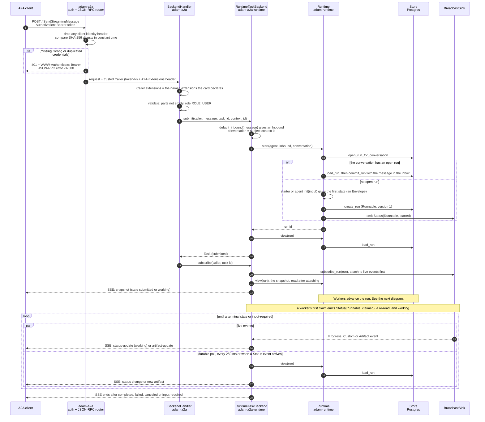

Rules this diagram cannot show:

* **Fail closed.** Only `GET /.well-known/agent-card.json`, `GET /healthz`, the docs (`GET /docs`, its files and
  `GET /openapi.json`, unless `A2A_DOCS=false`) and, when the card is signed, `GET /.well-known/jwks.json` are public; an
  empty token list rejects everything (`crates/adam-a2a/src/auth.rs`).
* **Errors are HTTP 200** with a JSON-RPC error object; the mapping is in [Errors](#errors).
* **Ownership needs no side table**: the caller's subject is part of the run's conversation id
  (`subject:context id`). Someone else's task looks like one that does not exist.
* **A request names the extensions it wants; the card decides.** The handler passes the backend only the
  ones the card declares (`Caller::extensions`), so each extension is optional on both sides.
* **Streams survive restarts.** The snapshot comes from `Runtime::view` (the durable record) and is
  polled every 250 ms; live events only cut latency. A subscriber that attaches after the worker began
  first gets the run's recent live events from a bounded replay in `BroadcastSink` (the newest 64, none older
  than 30 s, dropped at each status change), so a step that started before it attached keeps its input; a
  repeat is possible and harmless. Dropping the SSE stream drops only the subscription; only `CancelTask` cancels.

Follow-ups, `referenceTaskIds`, steering, steps and streamed text are in the
[A2A server reference](reference/a2a-server.md).

### Swagger UI and the REST binding

Every agent serves A2A 1.0 twice over the same `BackendHandler`: JSON-RPC at `POST /` and HTTP+JSON at the paths of
§11 of the specification (`POST /message:send`, `GET /tasks/{id}`, ...; `crates/adam-a2a/src/rest.rs`). The card lists
`JSONRPC` first and `HTTP+JSON` second, at the same URL. Swagger UI at `/docs` documents both from one OpenAPI document
([ADR 0031](decisions/0031-swagger-ui-and-the-a2a-rest-binding.md)). A person opens it and sends a message over REST:

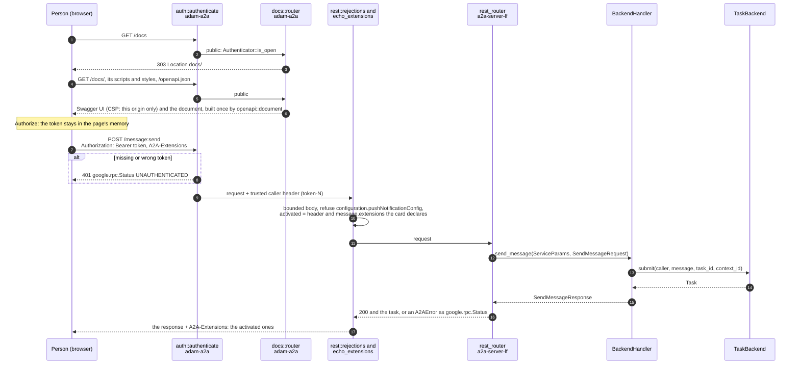

* **One handler.** `R->>H` is the call the JSON-RPC route makes too, with the same `ServiceParams`: identity, extensions,
  push configs, `ListTasks` and the extended card behave the same on both bindings. A malformed REST request (not JSON,
  a query string that does not parse, over 10 MiB) gets the binding's envelope (`PARSE_ERROR`, `INVALID_PARAMS`,
  `INVALID_REQUEST`), never the extractor's plain text.
* **The document is public and the same for everyone**: built once from the public card and the switches it shows
  (push, the extended card, bearer), with no token and nothing of the extended card. Try it out calls the server the
  page came from (the document's server is `.`).
* **Streams** (`/message:stream`, `/tasks/{id}:subscribe`, and their JSON-RPC methods) cannot be watched in Swagger UI,
  which waits for the whole response; their descriptions give the `curl`.
* There is no state diagram: nothing here has a lifecycle (the document and the assets never change while the router runs).

### Push notification delivery

Off unless `A2A_PUSH_ALLOWED_URLS` names the webhooks a deployment allows
([ADR 0030](decisions/0030-a2a-push-notifications-list-tasks-extended-card-signatures.md)). A client registers a
webhook for a task (`CreateTaskPushNotificationConfig`, or in `SendMessage`); the config and how far its delivery got are
kept in the run store, so a restart or another replica loses nothing. A deliverer in the control plane reads the task as
its owner and tells the webhook what it has not heard.

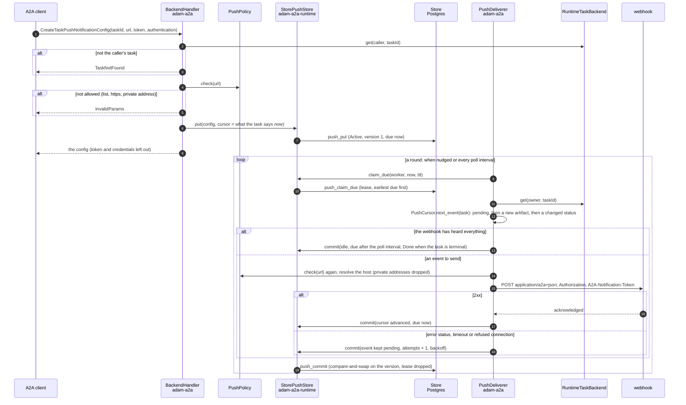

Rules this diagram cannot show:

* **A notification is a hint; `GetTask` is the truth.** What a deliverer never saw (a state between two polls, or while every
  replica was down) is not sent, the next event is the state the task is in, and a webhook may hear one event twice.
* **A failed event is kept whole in the cursor** (`PushCursor.pending`) and sent again as it was, before any later one, so a
  webhook that was down still hears each state the deliverer saw, in order.
* **Fail closed.** The policy is judged at create time and again at delivery; the client resolves names itself, drops private
  addresses, never follows a redirect and ignores `HTTP(S)_PROXY`. A `token` and `credentials` are write-only
  (`crates/adam-a2a/src/push/sender.rs`).
* **Replicas share the work through leases**, and the version compare-and-swap, not the lease, keeps a cursor from going
  backwards. A replaced or deleted config makes the commit of a delivery in flight lose; that request may still have reached
  the webhook once.

The lifecycle of one config (`PushState`, `crates/adam-core/src/store/push.rs`):

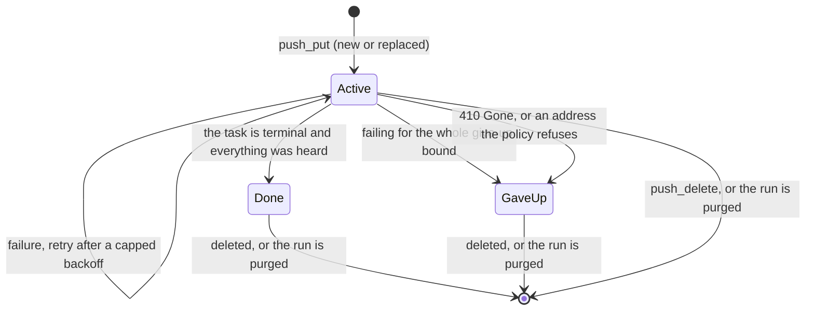

`ListTasks` is one indexed read per page of the run store (`Store::list_runs`) scoped to the caller's conversations, read as
tasks; the extended card and the card's signature are built once when the router is built
(`crates/adam-a2a/src/server.rs`). All of it is in the [A2A server reference](reference/a2a-server.md).

### The worker: claim, step, journal, commit

`Runtime::run_worker` (`crates/adam-runtime/src/worker.rs`) runs in the same process as the server
(`all`) or alone (`worker`). Any number of processes can share one database.

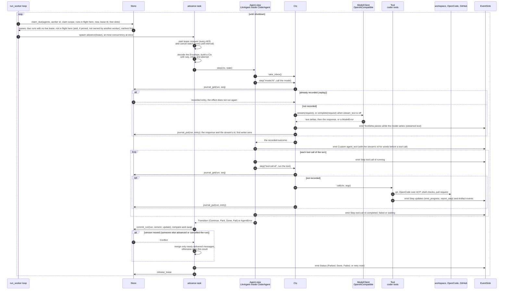

* **One step is one model turn.** `LlmAgent::step` calls the model once (journaled step `model:N`),
  runs the tools it asked for (each a journaled step `tool:<call id>`) and returns `Continue`.
* **Replay is safe, effects are at-least-once.** The effect runs before its outcome is written, so a
  crash in between runs it again. Tools must be safe to repeat.
* **Waking is polling plus hints.** An idle worker sleeps at most one poll interval; `start` and
  `deliver` publish `Signal::Runnable`, `cancel` publishes `Signal::Finished`.
* **Messages that arrive during a step** are kept; the commit merges them, and a step that asked to
  park resumes at once.
* **Retry.** A transient failure is committed as `Runnable` with a future `wake_at`; the failed try's
  journal entries are abandoned.
* **Defaults** (`runtime.rs`, `retry.rs`): lease 30 s, poll 250 ms, 4 concurrent runs per worker loop,
  5 tries per transition, backoff 1 s doubling to 60 s.

## The run lifecycle

`RunStatus` (`crates/adam-core/src/store/mod.rs`) has four values: `Runnable`, `Parked`, `Done`,
`Failed`.

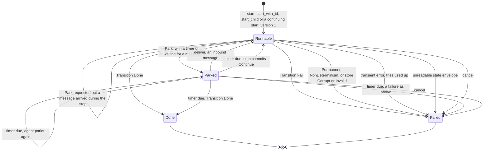

The lease is a separate lifecycle that a run goes through each time a worker takes it:

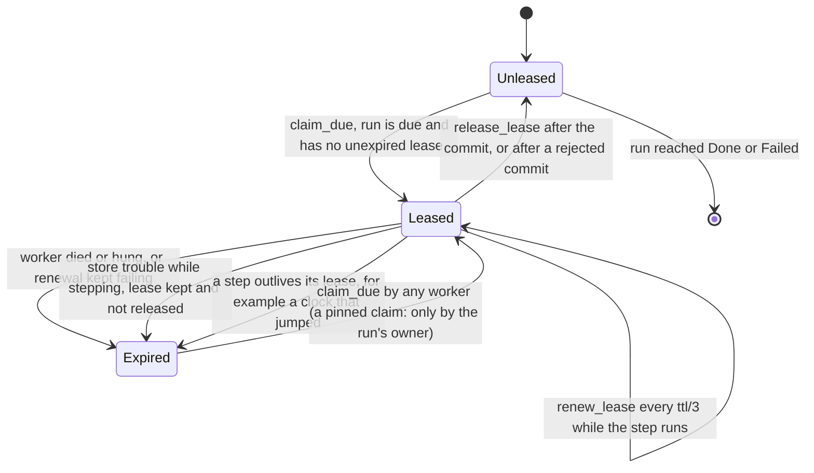

* **What makes a run due.** `sched_at` is derived from status and `wake_at`
  (`adam_core::store::sched_at`):

  | Status | `wake_at` | Due |
  |---|---|---|
  | runnable | none | immediately |
  | runnable | set | at `wake_at` (retry backoff) |
  | parked | set | at `wake_at` (timers, `ctx.sleep`) |
  | parked | none | never; resumed by committing it back to runnable (approval, inbound message) |
  | done / failed | – | never |

* **Retries.** A transient step failure (or a panic) is committed `Runnable` with
  `wake_at = now + delay` and `attempt + 1`. The delay is the larger of the backoff and the error's
  `retry_after` (capped at 24 h). At `max_attempts` the run is `Failed`.
* **A lease that lapses under a step.** The worker passes the run as `busy` in every `claim_due`, so the
  store never leases it to the same worker twice. Another worker may claim it; the CAS rejects the
  commit that comes second.
* **Store trouble.** `Corrupt` and `Invalid` fail the run (a row that can never be read must not be
  leased for ever); any other class commits nothing and keeps the lease.
* **Cancel.** `Runtime::cancel` commits `Failed` with `cancelled: <reason>`. A running step is told
  through its `CancelToken` (at once in the same process, within one poll from another). Model calls and
  the coder's commands listen to it.
* **Deliver.** `Runtime::deliver` appends to the inbox; a `Parked` run becomes `Runnable` at once. A
  step that asked for it (`Ctx::reopen_on_arrival`, which `LlmAgent` does) is not committed `Done` past
  an unread message.
* **Terminal states** are `Done` and `Failed`; `Store::purge_finished` deletes them with their journal.

How a run looks to an A2A client (`task_state`, `crates/adam-a2a-runtime/src/convert.rs`):

| Run | A2A task state |
|---|---|
| `Runnable`, version 1, no worker holds a lease | `submitted` |
| `Runnable`, version 1, a worker holds an unexpired lease (`RunView::claimed`) | `working` |
| `Runnable`, or `Parked` with a timer | `working` |
| `Parked` with no timer | `input-required` |
| `Done` | `completed` |
| `Failed` with an error that starts `cancelled: ` | `canceled` |
| `Failed` otherwise | `failed` |

`Runtime::view` reads the lease **before** the record, so a step that commits between the two reads is
never shown as `submitted` again. A front that holds only the starter claims nothing: its tasks stay
`submitted`. A task's id is derived, not random: `task_id_for(agent, caller, context, messageId)`
(`crates/adam-a2a-runtime/src/ids.rs`), so a repeated `SendMessage` reaches the task its first attempt made.

## Data: the run store

Three tables (PostgreSQL) or collections (MongoDB), prefixed `adam_` by default, plus a `meta` table with
the schema version (`push` holds A2A push-notification configurations, schema version 3). `state` is JSONB in Postgres and a real BSON document in MongoDB.

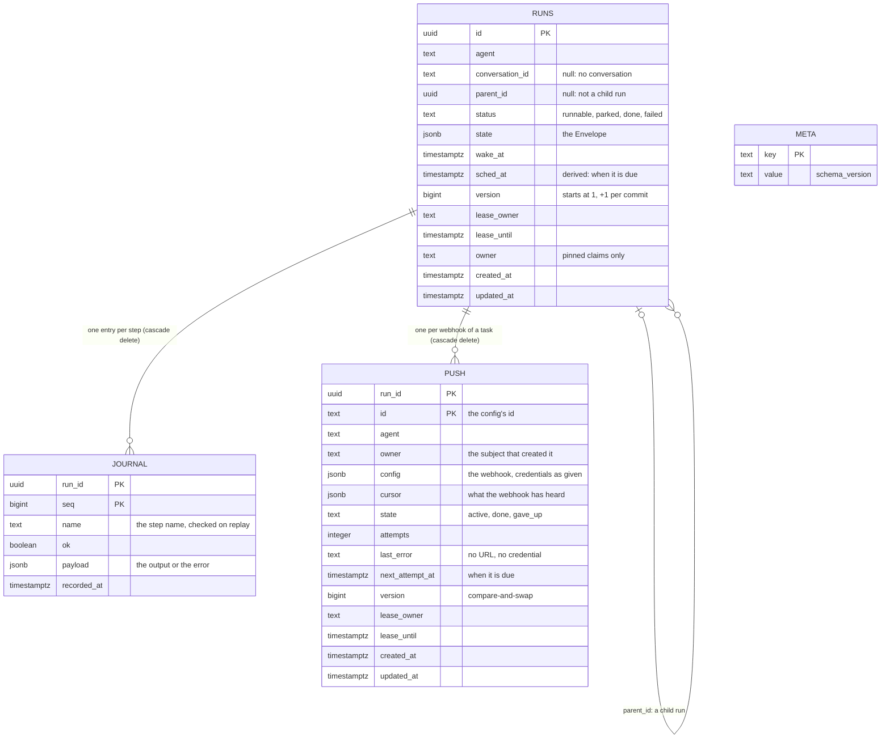

| Index | Purpose |
|---|---|
| `runs (agent, sched_at, id)` where `sched_at` is set | claiming: due runs per agent, earliest first |
| unique `runs (agent, conversation_id)` where the run is open | one open run per conversation |
| `runs (agent, updated_at)` where finished | retention sweeps |
| `runs (parent_id)` where set | children of a run |
| `runs (agent, conversation_id COLLATE "C", updated_at DESC, id DESC)` where set | `ListTasks`: an owner's runs, newest first, by keyset |
| `push (agent, next_attempt_at, run_id, id)` where active | claiming due push configs |

MongoDB keeps the same fields in `adam_runs` (`_id` is the run's UUID) plus `open_key` (a plain unique
index; closed runs get `~<run id>`) and `lease_token`, and the journal in `adam_journal` with
`_id = "<run>:<seq>"`, and the push configs in `adam_push` with `_id = "<run>:<config id>"`. How each adapter keeps its promises: [store adapters](reference/store-adapters.md).

What `state` holds (JSON, versioned `v`; the layout is private to the runtime,
`crates/adam-runtime/src/envelope.rs`):

| Envelope field | Meaning |
|---|---|
| `v` | layout version (1) |
| `agent` | the agent's own state; for an `LlmAgent`, a `Conversation` (below) |
| `inbox` | delivered, not yet read messages (`Inbound { id, kind, payload, received_at }`) |
| `seq`, `attempt`, `rev` | next journal seq; failed tries of this transition; bumped by each worker commit |
| `output`, `error` | the result of a `Done` run; the reason of a `Failed` one |
| `artifacts` | artifacts emitted so far, committed with their transitions |

`Conversation` (`crates/adam-llm-agent/src/conversation.rs`) has `messages`, `turns`, `tool_calls`,
`usage`, `pending_calls`, `pending_wait` (a question for the user, a child run or a remote task),
`deferred`, `artifacts`, `announced`, `source_notes`, `continued_from`, `omitted_turns`, `context` and
`read_ids`. Every field has a serde default, so older state still loads.

Not stored, by design: `RunEvent`s (`Status`, `Progress`, `Step`, `TextDelta`, `ReasoningDelta`,
`Custom`, `Artifact`) are live and may be lost (a short in-memory replay per run covers a late subscriber, see
[the A2A server](reference/a2a-server.md#steps)); the durable truth is the record. Signals
(`Runnable`, `Finished`) are hints.

## Across processes: signals and events

With the front and the workers in different processes, they share only the database. Left alone, a
worker finds a new run at its next poll. `adam-notify-postgres` closes the gaps over `LISTEN`/`NOTIFY`
without changing who is right: every notification is a hint, and the run completes with the crate
removed, only later. Each process has one `PgNotify` listening on `{prefix}events` and
`{prefix}signals`; its `PgEventSink` is the runtime's event sink and its `PgNotifier` the notifier.

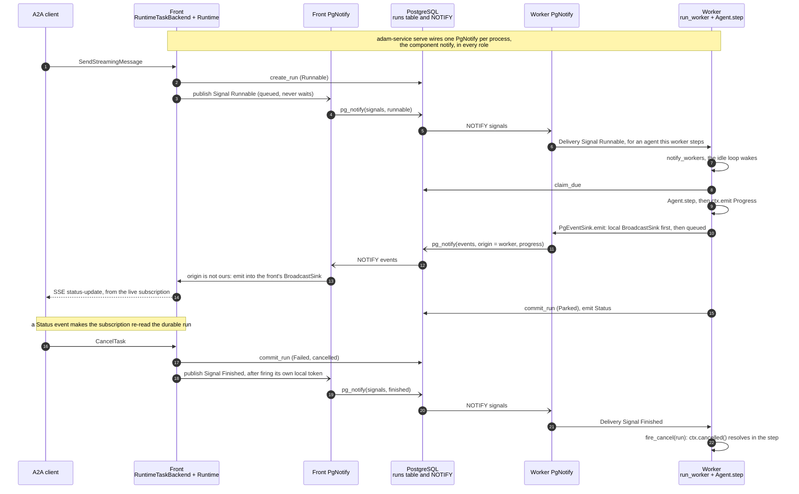

* **Best effort.** `publish` and `emit` queue (1 024 items, then drop); a failed `pg_notify` drops its item.
* **No echo.** Events carry the sender's id and the listener skips its own; signals have no origin.
* **Size.** PostgreSQL rejects a payload of 8000 bytes or more, so nothing over 7 999 is sent. An
  oversize `Status` loses the tail of its detail; any other oversize event stays local.
* **One pooled connection** held by the listener: no transaction-mode pooler in front of it.
* **MongoDB has no equivalent** on a standalone `mongod`, so it keeps polling.

The listener's lifecycle (`listen_loop` in `crates/adam-notify-postgres/src/lib.rs`). A `Resync` tells
subscribers that notifications may have been lost; the worker then polls at once and re-reads the runs
it is stepping.

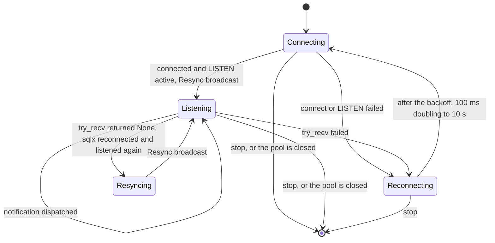

## Child runs

A subagent is a child run: an agent started by a tool of another agent, with its own history, tools and
limits, whose final answer is the result of that tool call. The runtime supplies `start_child`, the
`adam.run.finished` message, `Ctx::child_status` and `ToolError::AwaitRun`; no scheduler.

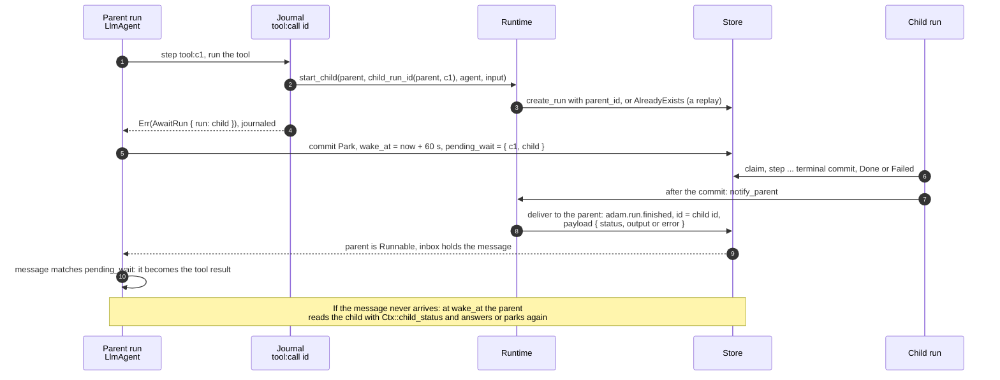

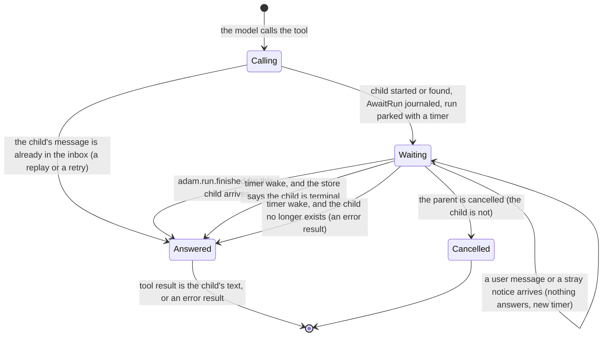

The message is a hint; the parent's timer (`wait_poll`, 60 s) is the guarantee. The child id is derived
(`child_run_id(parent, key)`), so a tool that runs again asks for the same child. Cancelling a parent does
not cancel its children. A subagent on another A2A agent is the same wait with polling and no message.
The failure interleavings, their tests and what the design refuses are in
[Child runs](reference/child-runs.md).

## Errors

Every library error enum implements `adam_error::Classify`: a variant says **what happened**, its
`ErrorClass` says **what to do**. Retry loops, the A2A error a client sees and the process exit code
decide from the class, never from a variant.

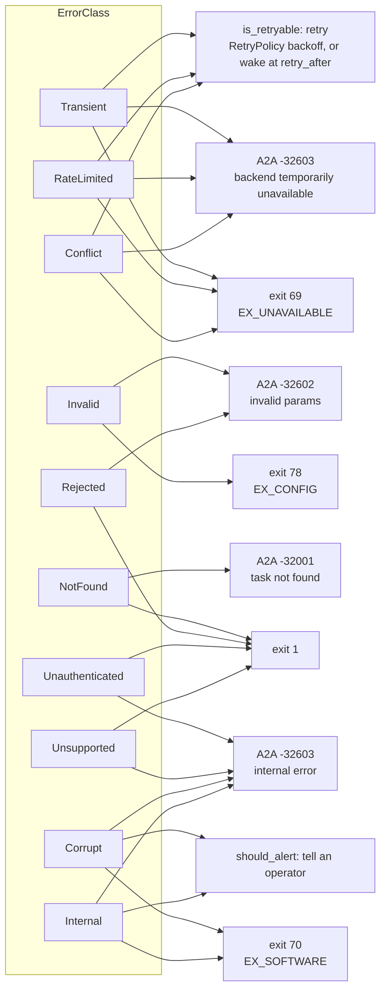

| Class | Retry | A2A error | Exit |
|---|---|---|---|
| `Transient`, `RateLimited`, `Conflict` | yes (backoff; `retry_after`; at once, bounded) | `-32603` backend temporarily unavailable | 69 |
| `Invalid` | no | `-32602` invalid params | 78 |
| `NotFound` | no | `-32001` task not found | 1 |
| `Rejected` | no | `-32602` (`-32002` for a cancel) | 1 |
| `Unauthenticated`, `Unsupported` | no | `-32603` internal error | 1 |
| `Corrupt`, `Internal` | no, and alert | `-32603` internal error | 70 |

The tree of enums and the exit codes are in [Errors](reference/errors.md).

## Where a run's files and processes live

The coder keeps a **workspace** per run: `<root>/workspaces/<run>/`, a directory of slots, each a
repository's worktree or a scratch project. Its commands run through the `Environment` port: in the
coder's own container (`Local`), in the repository's devcontainer on a rootless Podman service
(`DevContainer`), or in a Kubernetes pod of the run's own (`KubeEnvironment`).

Runs move between workers at every step, but a workspace lives on one worker's disk. The deployer picks
a **placement** (`adam_host::Placement`, read from `WORKSPACE_PLACEMENT`;
[ADR 0002](decisions/0002-workspace-placement.md)):

| `WORKSPACE_PLACEMENT` | Worker root | Claims | Needs `WORKER_ID` |
|---|---|---|---|
| `shared` (default) | `WORKSPACE_ROOT`, one volume for all workers | `ClaimScope::Any` | no |
| `affinity` | `WORKSPACE_ROOT/<WORKER_ID>` | `ClaimScope::Pinned` | yes |
| `isolated` | `WORKSPACE_ROOT`, a volume of this worker only | `ClaimScope::Pinned` | yes |
| `a2a-only` | none | `Any` | refused by `adam-coder` |

A pinned run keeps an **owner** next to its lease, set by the first pinned claim and never cleared. A
pinned run whose owner is gone is stranded: keep worker ids stable and do not scale pinned workers in.
Slots, the environments' sequences and states, and the mirror lock are in
[Workspace and environments](reference/workspace-and-environments.md).

## The two agents

| | [`adam-coder`](../bin/adam-coder/README.md) | [`adam-agent`](../bin/adam-agent/README.md) |
|---|---|---|
| Does | Adam: answers, researches, writes documents, and takes a coding task to a verified pull request | serves **any agent folder** |
| Tools | the coder's 17 own tools (workspace, files, checks, git, pull request) plus the screen's `ask_user`, `show`, `ui_catalog` | the folder's MCP and skill tools, the screen's tools, one per subagent |
| Needs | model, GitHub, a workspace | a model; no workspace, no GitHub |
| State | Postgres, plus files under `WORKSPACE_ROOT` | Postgres |
| Prompt and card | `bin/adam-coder/agent` (embedded, or `ADAM_AGENT_DIR`) | `ADAM_AGENT_DIR`, required |

Both ship in one image, `ghcr.io/vymalo/another-adam-rs/coder`; a service that runs a folder overrides
the entrypoint with `adam-agent`. How the coder works: [The coder agent](reference/coder-agent.md).
Deploying it: [guide](guides/deploy-the-coder.md). `adam-agent` has no embedded agent
([ADR 0005](decisions/0005-one-binary-serves-any-agent-folder.md)).

## Verified and unverified

**Verified 2026-09-29, reading this repository at `172a117`:** the ports and their implementations, the
run transitions, the request path and the coder's rules. **Re-read 2026-10-06:** the crate graph (from
`cargo metadata`) and the schema (`crates/adam-store-postgres/src/lib.rs`, `crates/adam-store-mongodb/src/lib.rs`).
The Mermaid syntax of every diagram is checked in CI by `tools/docs-check`.

**Verified 2026-09-29, executed:** the cross-process fan-out and the listener lifecycle
(`crates/adam-notify-postgres/tests/two_runtimes.rs`, PostgreSQL 16) and the `NOTIFY` payload limit of
8000 bytes (16.13 server); the continuation of a finished task (ADR 0003).

**Verified 2026-10-07, executed:** Swagger UI at `/docs` of `adam-agent` (PostgreSQL 16, a stub model) in headless
Chromium: rendered under its CSP with no error and no request to another origin, Authorize then Try it out over both
bindings ([ADR 0031](decisions/0031-swagger-ui-and-the-a2a-rest-binding.md)).

**Unverified:**

* The `sysexits.h` numbers 78, 69, 71 and 70 are from memory.
* The A2A method names, `TASK_STATE_*` names and the codes `-32001` and `-32002` are as documented in
  `crates/adam-a2a/src/lib.rs` for the pinned SDK (`a2a-lf` 0.3, `a2a-server-lf` 0.4), not checked against
  the A2A specification here. Neither is the SDK's SSE keepalive (every 15 s).
* OpenCode's behaviour (ACP over stdio, `{env:VAR}` in its inline config) is as recorded in
  `bin/adam-coder/src/opencode.rs` (`sst/opencode@7945de2`); a live run against a real gateway is not in CI.
* The run pods (ADR 0019) were tested against a fake API server and a `kind` cluster, not the owner's.
* The chart was rendered, not applied to a cluster; how it reaches the cluster after the tag bump is
  outside this repository.
