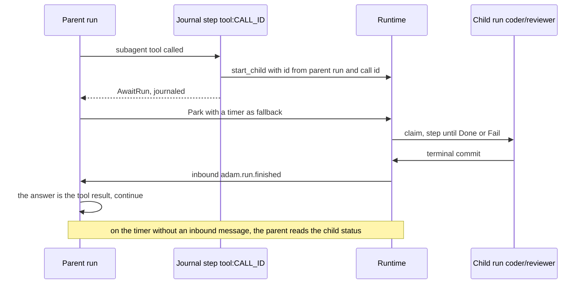
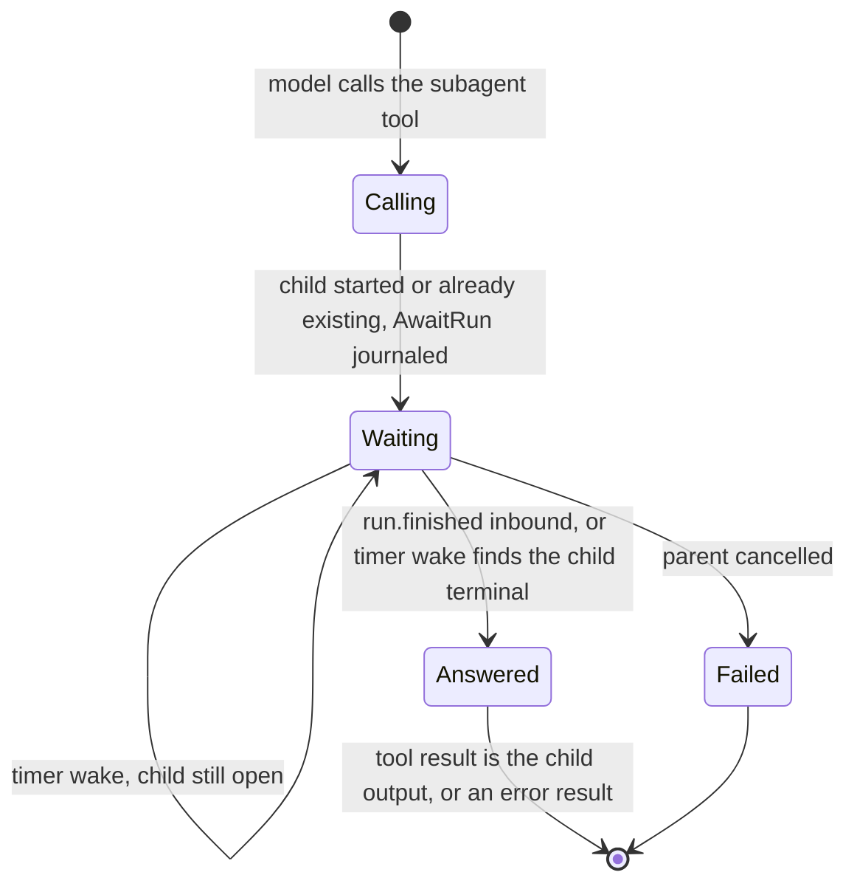
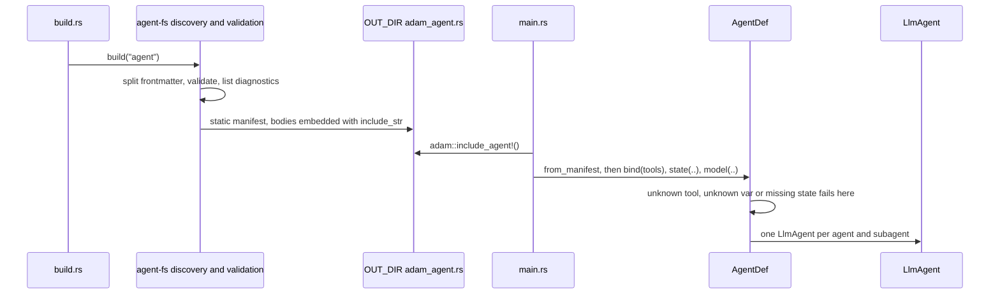

# The authoring layer

Status: **design, planned, nothing here exists yet** except where a row says otherwise (see
[Delivery order](#delivery-order)). Accepted by the owner on 2026-09-29 (decisions D1 to D6 below).
The roadmap items it serves are 3 (`#[tool]`) and 4 (`agent/` discovery) in the
[root README](../README.md#roadmap).

The goal, in the owner's words: agents, skills and more configured through plain Markdown files, and
tools configured in code, very easily, through macros. Where a standard exists, adam-rs follows the
standard.

Facts about third parties are marked *verified* (with the date and the source) or *unverified*.

## The idea in six lines

1. **Markdown for what the model reads, Rust for what runs.** `agent/` holds Markdown and JSON only:
   instructions, skills, subagents, `mcp.json`. Tools are Rust functions annotated `#[tool]`, in
   `src/`, so `cargo fmt`, clippy and rust-analyzer work on them.
2. **The layout is [eve](https://eve.dev)'s.** `agent/instructions.md`, `agent/subagents/`,
   `agent/skills/`, and `agents/<name>/` for several agents in one package.
3. **The file format of an agent, and of a subagent, is the Claude Code / GitHub Copilot custom-agent
   format:** Markdown with YAML frontmatter (`name`, `description`, `tools`, `model`, ...), body = system
   prompt. A file copied from `.claude/agents/x.md` or `.github/agents/x.agent.md` parses unchanged.
4. **Skills are the [Agent Skills](https://agentskills.io/specification) format, unchanged.**
5. **`build.rs` compiles the directory into a static manifest;** a `dev` feature reads the same
   directory at run time. One parser and one validator serve both.
6. **Skills and subagents add no durability mechanism.** They run inside the existing journaled
   `tool:CALL_ID` step; a subagent is a durable child run.

## Layout

```text
my-agent/                       # a normal Cargo package
├── Cargo.toml                  # adam = { features = ["macros"] }; [build-dependencies] adam-agent-fs
├── build.rs                    # adam_agent_fs::build("agent").emit()?;
├── agent/
│   ├── instructions.md         # optional YAML frontmatter + the system prompt
│   ├── instructions/           # optional: more .md files, appended in filename order
│   ├── skills/
│   │   ├── release-notes/SKILL.md      # Agent Skills spec (+ scripts/ references/ assets/)
│   │   └── triage.md                    # flat skill (eve convenience), name = file stem
│   ├── subagents/
│   │   ├── reviewer.md                  # or reviewer.agent.md: a Claude Code / Copilot agent file
│   │   ├── researcher/instructions.md   # directory form: own skills/, mcp.json, subagents/
│   │   └── billing.md                   # `a2a: <agent-card URL>` makes it a remote subagent
│   ├── mcp.json                # {"mcpServers": {...}}; secrets only as ${VAR}
│   └── schedules/daily.md      # frontmatter `cron:`; body = prompt (roadmap 5, sketch)
└── src/
    ├── main.rs                 # adam::include_agent!(); compose store + model + tools + serve
    └── tools/weather.rs        # #[tool] async fn get_weather(...)
```

Several agents in one package: `agents/<name>/...` with the same slots and no nested `agent/`. Having
both `agent/` and `agents/` is a **build error** (eve silently prefers `agent/`).

### Discovery rules

* `agent/` exists: one agent, named by frontmatter `name`, else `CARGO_PKG_NAME`.
* Else `agents/<name>/` for each direct child that holds `instructions.md`, named by its directory (it
  must match `name` when one is given).
* Neither: a build error, unless `build()` was given `.optional()`.
* Ignored: dotfiles, `*.test.md`, `__tests__/`, and a directory under `skills/` without `SKILL.md`.
* Names come from paths: `skills/<name>/SKILL.md` or `skills/<name>.md` is skill `<name>`;
  `subagents/<name>.md`, `subagents/<name>.agent.md` or `subagents/<name>/instructions.md` is subagent
  `<name>`; `schedules/a/b.md` is schedule `a/b`. For a subagent file, the name is the file name minus
  `.md` or `.agent.md` (as Copilot does), unless the frontmatter sets `name`.
* Subagents nest through `subagents/<name>/subagents/...`. Cycles are impossible by construction.

## File formats

YAML 1.2, so `no` is a string and not `false`. Frontmatter is optional in `instructions.md`; without it
the whole file is the prompt. A file whose first line is `---` must have a closing `---`, or it is an
error.

### Agent and subagent files (`instructions.md`, `subagents/*.md`, `*.agent.md`)

One schema for the root agent, for every directory subagent and for every flat subagent file. It is a
superset of the two custom-agent formats below.

```markdown
---
name: coder                    # default: CARGO_PKG_NAME (root), file name (subagents)
description: Turns a coding task into a verified pull request.   # required on subagents
model: coder-large             # a gateway alias; `inherit` = the parent's (default for subagents)
tools: [prepare_workspace, run_checks, ask_user]     # or "a, b, c"; "*" = all; MCP: "linear__*"
skills: all                    # or a list; default: every skill in this agent's skills/
limits:                        # LlmAgent Limits; Claude's `maxTurns` is read as limits.max_turns
  max_turns: 200
  max_tool_calls: 400
vars: { max_check_cycles: 3 }  # defaults for {{placeholders}} in the body; code may override
card:                          # root only: becomes adam_a2a::AgentCardConfig
  name: adam-coder
  skills:
    - { id: coding-task, name: Coding task to pull request, description: "...", tags: [code] }
metadata: { owner: platform-team }
---
You are the coder agent. Stop after at most {{max_check_cycles}} failed check cycles ...
```

* **Secrets and endpoints never live in files.** `model` is an alias; the endpoint and key come from
  the composition root (environment). The validator rejects the keys `api_key`, `apiKey`, `token`,
  `secret`, `password` and `base_url`. There is no `${VAR}` in agent frontmatter.
* `{{name}}` placeholders are logic-free substitution. An unknown placeholder, or a var that is never
  used, is a bind-time error. `{{{{` writes a literal `{{`.
* **Unknown keys: accepted with a warning** (`cargo:warning=`). Keys of Claude Code or Copilot that adam
  knows and ignores (`color`, `permissionMode`, `temperature`, `target`, `user-invocable`,
  `disable-model-invocation`, ...) get a softer "ignored by adam" warning. `build("agent").strict()`
  turns warnings into errors.
* **A subagent inherits nothing** from its parent (eve's isolation boundary), and omitting `tools:`
  gives it **no tools** (decision D3). Claude Code inherits everything; adam does not.
* **A copied file parses unchanged, but its `tools` must name adam tools.** A Claude Code file listing
  `Read, Grep` fails at bind time with a "did you mean" hint, because adam fails closed on an unknown
  tool name. Drop the key or list adam's tool names.

Remote subagent (A2A; the body, if any, only extends the tool description):

```markdown
---
description: Handles billing questions for a customer account.
a2a: https://billing.example.com/.well-known/agent-card.json
auth: bearer:BILLING_AGENT_TOKEN     # names an environment variable, resolved at startup, fail closed
---
```

#### The formats it accepts

| Format | Location | Keys | Status |
|---|---|---|---|
| Claude Code subagent | `.claude/agents/<file>.md` | `name` and `description` required; optional `tools` (comma string or YAML list; inherits all if omitted), `disallowedTools`, `model`, `permissionMode`, `maxTurns`, `skills`, `mcpServers`, `hooks`, `memory`, `background`, `effort`, `isolation`, `color`, `initialPrompt` | *verified 2026-09-29*, <https://code.claude.com/docs/en/sub-agents.md> |
| GitHub Copilot custom agent | `.github/agents/<name>.agent.md` (repository), `.github` or `.github-private` repository (organization) | `description` required; optional `name` (defaults to the file name), `target` (`vscode` or `github-copilot`), `tools` ("Supports both a comma separated string and yaml string array"; `["*"]` all, `[]` none), `model` ("If unset, inherits the default model"), `disable-model-invocation`, `user-invocable`, `mcp-servers`, `metadata`; the prompt is at most 30,000 characters; a file name may contain only `.`, `-`, `_`, `a-z`, `A-Z`, `0-9`; the name minus `.md` or `.agent.md` is what deduplicates | *verified 2026-09-29*, <https://docs.github.com/en/copilot/reference/custom-agents-configuration> and <https://docs.github.com/en/copilot/how-tos/copilot-on-github/customize-copilot/customize-cloud-agent/create-custom-agents> |
| OpenCode agent | `.opencode/agents/<name>.md` | `description`, `mode`, `model`, `temperature`, `permission`; the file name is the agent name | *verified 2026-09-29*, <https://opencode.ai/docs/agents/> |
| eve | `agent/`, `agents/<name>/agent/`, config in `agent.ts` | see the [mapping](#mapping-eve-to-adam-rs-to-standard) | *verified 2026-09-29*, <https://eve.dev/docs/reference/agent-files.md> and <https://eve.dev/docs/subagents.md> |

Where they disagree, adam-rs reads both spellings: `tools` takes a comma string or a list, as both do,
and `mcpServers` (Claude) and `mcp-servers` (Copilot) are recognised and warned about (`mcp.json` is the
place for MCP servers, see below). The Claude `model` values `sonnet`, `haiku` and so on
are not aliases of anything in adam-rs: `model` is a gateway alias, so a Claude file's `model` must be
changed or removed (`inherit` works).

### Skills (`skills/<name>/SKILL.md`): the Agent Skills spec, unchanged

Frontmatter: `name` (required, 1 to 64 characters, `a-z0-9-`, no leading, trailing or double hyphen,
and it must match the directory name), `description` (required, 1 to 1024 characters), `license`,
`compatibility`, `metadata`, `allowed-tools` (experimental). The body is free Markdown; `scripts/`,
`references/` and `assets/` are optional. *Verified 2026-09-29*, <https://agentskills.io/specification.md>.

Validation follows the spec's client guide (*verified 2026-09-29*,
<https://agentskills.io/client-implementation/adding-skills-support.md>): a name that does not match its
directory is a warning (the directory wins); a missing `description` or unparseable YAML skips the
skill and is a **build error**, because these files are our own source and not a third-party install.
A flat `skills/<name>.md` is an eve convenience and may omit frontmatter (the description is then the
first non-empty line, with a warning). `allowed-tools` is parsed and ignored in v1. Resources are
embedded up to 1 MiB per skill.

The repository's own `.agents/skills/` is a corpus of 75 vendored `SKILL.md` files. The parser must read
all of them with no error; that becomes a conformance test in S4.

### `mcp.json`

```json
{
  "mcpServers": {
    "linear": { "type": "http", "url": "https://mcp.linear.app/mcp",
                "headers": { "Authorization": "Bearer ${LINEAR_API_TOKEN}" },
                "tools": ["list_issues", "create_issue"] },
    "fs": { "command": "mcp-server-filesystem", "args": ["/work"],
            "env": { "LOG_LEVEL": "${MCP_LOG_LEVEL:-info}" } }
  }
}
```

* Field names follow Claude Code's `.mcp.json` (*verified 2026-09-29*,
  <https://code.claude.com/docs/en/mcp.md>) and the draft SEP-2633 (*verified draft status 2026-09-29*,
  <https://github.com/modelcontextprotocol/modelcontextprotocol/pull/2633>; the field details are
  *unverified* until the PR is read in full). There is no ratified standard yet.
* A `url` without `type` is an error, as in Claude Code. `tools` (an adam extension) is an allow-list.
  The model-facing name is `<server>__<tool>`.
* `${VAR}` and `${VAR:-default}` are expanded **at startup only**. A missing variable without a default
  fails startup (fail closed). `build.rs` records the names and never the values.
* stdio servers spawn processes: allowed only when the composition root opts in.

### Tools

Tools are Rust (next section). The files only say **which** tools an agent gets (`tools:`). Tool names
match `^[a-z][a-z0-9_]{0,63}$`.

## The `#[tool]` contract

```rust
/// Ask the person who gave you the task a question and wait for the answer.
#[tool]
pub async fn ask_user(
    /// What you need to know
    question: String,
) -> Result<ToolOutput, ToolError> { /* ... */ }

let tools = tools![AskUser, RunChecks];
let agent = LlmAgent::builder("coder", model, alias).state(env.clone()).tools(tools).try_build()?;
```

`#[tool]` keeps the function, and generates a unit struct (`AskUser`) that implements the `Tool` trait
of `adam-llm-agent`.

* **Description and schema:** the doc comment of the function is the tool description; the doc comment
  of each parameter is the property description. The arguments become one struct that derives
  `Deserialize` and `JsonSchema` (schemars 1.x, draft 2020-12, subschemas inlined, no `$schema`, no
  `title`).
* **Parameter kinds:** `&ToolCtx` (at most one); `State<T>` (shared state, resolved from the agent's
  extension map); every other parameter is a field of the arguments struct. `#[args] a: MyArgs` uses an
  existing struct.
* **Return:** `Result<T, E>` or a bare `T`, with `T: IntoToolOutput` and `E: Into<ToolError>`.
* **Bad model input is the model's problem:** a deserialization failure becomes `ToolOutput::error`
  (as `Tool::call` already documents), so the model can correct itself.
* **State is checked at build:** `Tool::required_state` names the `State<T>` types a tool needs, and
  `LlmAgentBuilder::try_build` fails at startup when one is missing.
* **Journaling is unchanged:** the call runs inside `LlmAgent`'s `tool:CALL_ID` step, so the retry
  rules of the `Tool` docs still apply.
* **No distributed slices** (`inventory`, `linkme`): `tools![...]` is an explicit list that the
  compiler checks; the agent files name tools, and binding fails at startup on an unknown name.

`FnTool` builds a tool at run time (an MCP tool is one). The typed helpers it and the macro rely on
(`ToolSpec` from a schema, `IntoToolOutput`, `parse_args`, `State<T>`, `ToolSet`) are slice S1 and live
in [`adam-llm-agent`](../crates/adam-llm-agent/README.md).

## Skills and subagents at run time (planned)

**Skills** use progressive disclosure. The catalog (`name`, `description`) is appended to the system
prompt; the tool `load_skill { name }` (an enum of the agent's skills) returns the body wrapped in
`<skill_content>`; `read_skill_file { skill, path }` reads an embedded resource and rejects `..` and
absolute paths. `load_skill` is a normal tool, so its result is journaled: a replay returns the body the
model first saw, even if the skill changed in between. No skills means no tool and no catalog.

**Subagents** are child runs. Each local subagent is its own `LlmAgent` registered on the same
`Runtime` as `<root>/<sub>`. The parent sees one tool per subagent (decision D5), with input
`{ message }`. The child never sees the parent's history.

Planned: this describes slice S8/S9. Nothing in the diagram exists yet; `NewRun::parent` exists in
`adam-core` and the runtime never sets it.





The deterministic child id (`uuidv5(parent run, call id)`) with `start_with_id` makes the start
idempotent, so the only side effects of the call are that creation and reads. Runtime changes:
`Runtime::start_child`, a notification on the terminal commit of a run that has a parent
(at-least-once, deduplicated by `Inbound::id`), `Ctx::child_status` as the fallback read, a new
`ToolError::AwaitRun` variant (old journals still decode), and `LlmAgent` generalising
`pending_question` to a wait with a serde default so stored conversations still load. Cancelling a
parent does not cancel its children in v1; they finish within their own limits.

Remote subagents (`a2a:`) use the same tool shape: a journaled A2A `SendMessage`, then a park on the
remote task id and a poll on the timer.

## Dev and build (planned)



| | `build.rs` (default) | function-like proc macro | run-time `AgentDir::load` (dev) |
|---|---|---|---|
| Finds new files | yes (`cargo::rerun-if-changed=agent` scans the directory, *verified 2026-09-29*, <https://doc.rust-lang.org/cargo/reference/build-scripts.html>) | no: tracking paths from a proc macro is nightly-only (`proc_macro::tracked`, *verified 2026-09-29*, <https://doc.rust-lang.org/proc_macro/tracked/index.html>) | n/a |
| Errors | file and line, before rustc runs | `compile_error!` at the call site | at startup |
| Cost at startup | none | none | parse |

With the `dev` feature (off by default, so a release binary cannot read prompts from disk unless it
opts in), `AgentDef::from_dir("agent")` plus `.watch()` rebuilds the same manifest at run time. Each
`step` takes the current definition, so a running run picks up new instructions at its next step and
never mid-step; an invalid edit keeps the last good version and logs the diagnostics. Tool code changes
need a rebuild. Runs are durable in the store, so a restart resumes them (use the Compose Postgres, not
the in-memory store).

## Crate layout (planned)

| Crate | Kind | Contents |
|---|---|---|
| `adam-macros` | proc-macro | `#[tool]`; a thin shim over a pure, unit-tested `expand` function |
| `adam-agent-fs` | lib | frontmatter splitter, schemas, discovery, validation with diagnostics, `ManifestSource` (embedded and directory), the `build.rs` codegen behind a feature. No async, no runtime dependency |
| `adam-assembly` | lib | `AgentDef`: manifest + `ToolSet` + model + state into `LlmAgent`s; `{{var}}` templating; skills; `SubagentTool`; the A2A card |
| `adam-mcp` | lib | MCP client (the official Rust SDK): MCP tools as `Tool`s, `${VAR}` expansion, fail closed |
| `adam` | facade | `prelude`, the macro, `include_agent!`, features `macros` (default), `a2a`, `mcp`, `dev` |
| `cargo-adam` | bin | `new`, `check`, `dev` (roadmap 6) |

`ManifestSource` is the seam between where the files come from and what they mean, so that a backend can be swapped
without touching the other: its signature has only manifest types and diagnostics. `Tool` stays
the only tool seam; MCP and `FnTool` implement it. Third-party crates the plan needs (`schemars`, `syn`,
`serde-saphyr`, `rmcp`, `notify`, `trybuild`) are checked against `cargo deny` in the slice that adds
each; `schemars` 1.2.2 is already in `Cargo.lock`.

## Mapping: eve to adam-rs to standard

| eve | adam-rs | Standard or convention |
|---|---|---|
| `agent/`, `agents/<name>/agent/` | `agent/`, `agents/<name>/` | eve (no standard exists) |
| `agent.ts` `defineAgent({ model, limits, ... })` | YAML frontmatter of `instructions.md` | Claude Code and Copilot custom-agent frontmatter |
| `instructions.md`, `instructions/` | same | plain Markdown, as AGENTS.md (no required fields) |
| `tools/<name>.ts` `defineTool` + Zod | `#[tool]` fn in `src/`, schemars, `tools![...]` | JSON Schema 2020-12 parameters (the MCP and OpenAI tool shape) |
| `skills/<name>/SKILL.md`, `skills/<name>.md`, `load_skill` | same, plus `read_skill_file` | **Agent Skills spec** |
| `subagents/<id>/agent.ts` (`description` required) | `subagents/<name>.md`, `<name>.agent.md` or `<name>/instructions.md` | Claude Code subagent file, Copilot custom agent |
| remote agent | `subagents/<name>.md` with `a2a:` | **A2A** agent card |
| built-in `agent` tool | not in v1 | none |
| `connections/*.ts` | `mcp.json` (MCP only) | `mcpServers` (Claude Code, SEP-2633 draft) |
| `channels/` | code: `adam-a2a`; `card:` frontmatter | **A2A** agent card |
| `hooks/*.ts` | `EventSink` in code | none |
| `schedules/*.md` (`cron:`) | same | five-field cron |
| `sandbox.ts` | later (roadmap 7) | none |
| `lib/` | `src/` | Cargo |
| `eve info`, `.eve/compile/*.json` | build errors and warnings, `OUT_DIR/adam_agent.rs`, `cargo adam check` | none |
| `eve dev` | the `dev` feature | none |

A2A card "skills" and Agent Skills are unrelated; they never map implicitly. The **AGENTS.md** file
(<https://agents.md/>, *verified 2026-09-29*) is not used as the agent's prompt, because coding agents
read it as instructions for editing that folder. An agent that works on repositories reads the target
repository's nearest `AGENTS.md` at run time instead.

## Decisions (accepted by the owner, 2026-09-29)

The owner accepted D1 to D6 as recommended, and added one rule: **keep the structure of eve.dev, GitHub
Copilot and Claude Code for agents and subagents.** The layout is eve's; the file format is the Claude
Code / Copilot custom agent; `.agent.md` is accepted and the name is the stem without `.agent`; unknown
Claude or Copilot keys are accepted with a warning.

| | Decision | Rejected alternative |
|---|---|---|
| D1 | Configuration is YAML frontmatter, not `agent.toml`: one schema shared with Claude Code, Copilot, OpenCode and Agent Skills | TOML: Rust-native, but no agent convention |
| D2 | Tools live in `src/` with an explicit `tools![]`, not `agent/tools/*.rs` auto-discovery | included files are invisible to `cargo fmt` |
| D3 | A subagent that omits `tools:` gets none | inherit all: Claude-compatible, surprising for a durable backend |
| D4 | Unknown frontmatter keys and Agent Skills violations warn (`.strict()` opts in to errors); a missing `description` always fails | fail the build on any |
| D5 | One tool per subagent, named after it | a single `delegate { agent, message }` tool |
| D6 | The `dev` feature ships in the facade and is off by default | on by default |

Also confirmed: adam-rs domain types are **closed enums** (no `#[non_exhaustive]` unless an existing
type already sets the pattern).

## Open questions

* Reasoning effort, sampling and compaction: `ModelRequest` has no such fields, so the keys are
  accepted and ignored with a warning.
* Tool approvals (`approval:`) fit roadmap 5; where the policy lives (`#[tool(...)]`, frontmatter or
  both) is open.
* An `evals/` directory; an OpenAPI connection; subagent continuation (`task_id`) and a built-in
  root-copy `agent` tool; exporting a Rust tool as an MCP server; following SEP-2633 to ratification.

## Delivery order

| Slice | What | State |
|---|---|---|
| S0 | this document | this change |
| S1 | typed tool helpers in `adam-llm-agent` (feature `schema`) | next |
| S2 | `#[tool]` and the `adam` facade | planned |
| S3 | `adam-coder` tools through `#[tool]`, no behaviour change | planned |
| S4 to S6 | `adam-agent-fs` (parse, validate), `build.rs` codegen, `adam-assembly` | planned |
| S7 | skills | planned |
| S8, S9 | child runs and subagents | planned; S8 needs a review of the design above first |
| S10, S11 | dev reload; `mcp.json` tools | planned |
