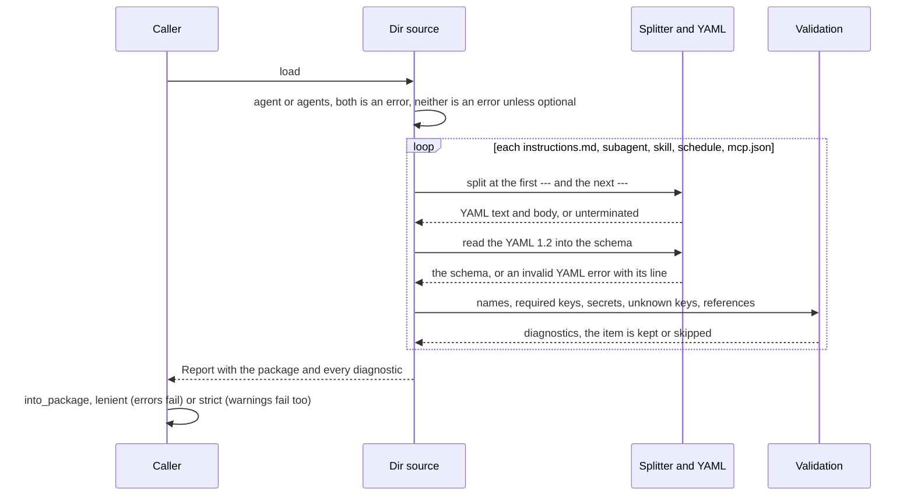
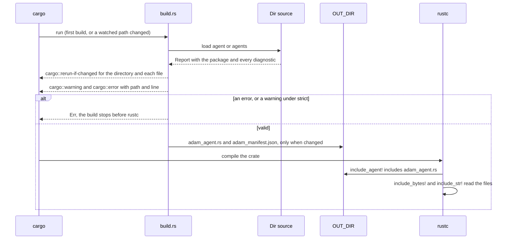
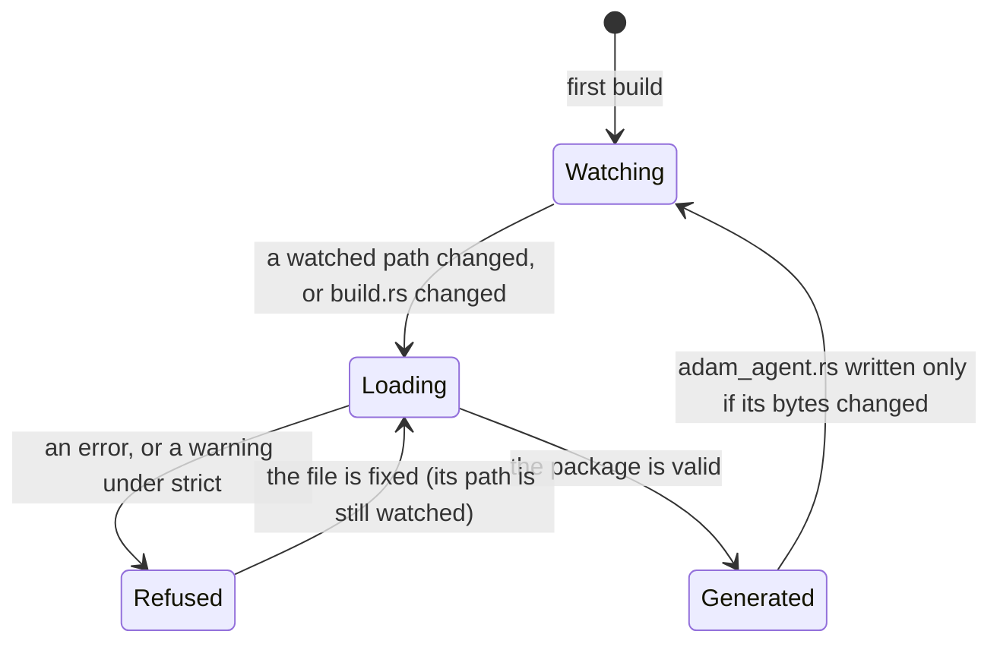
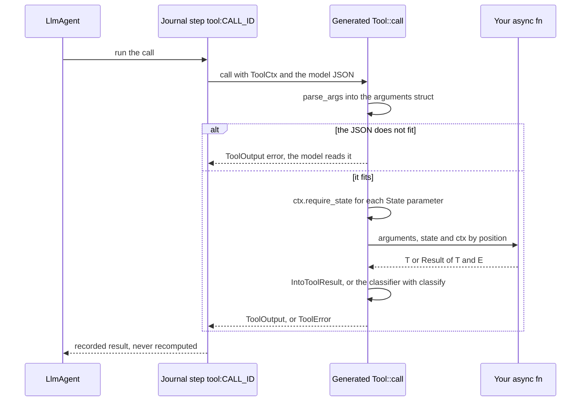
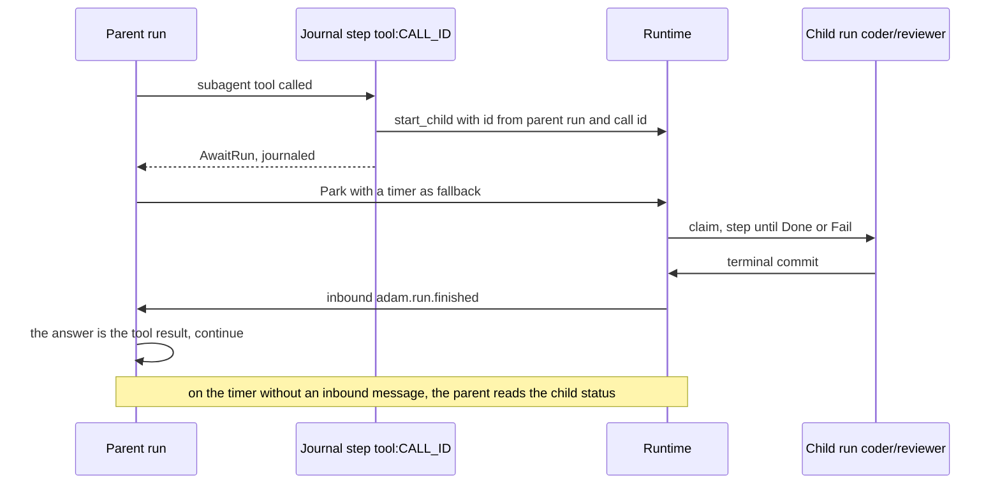
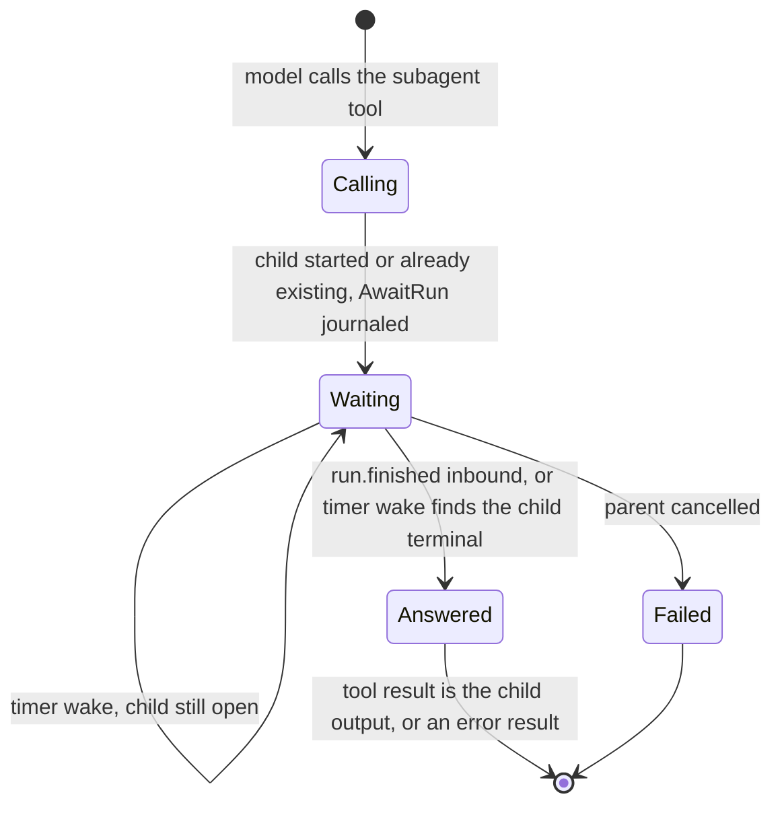
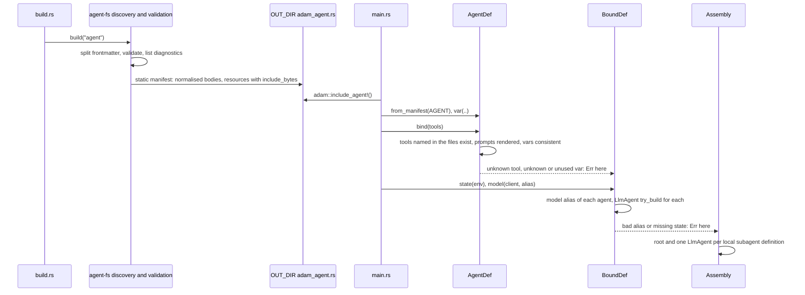
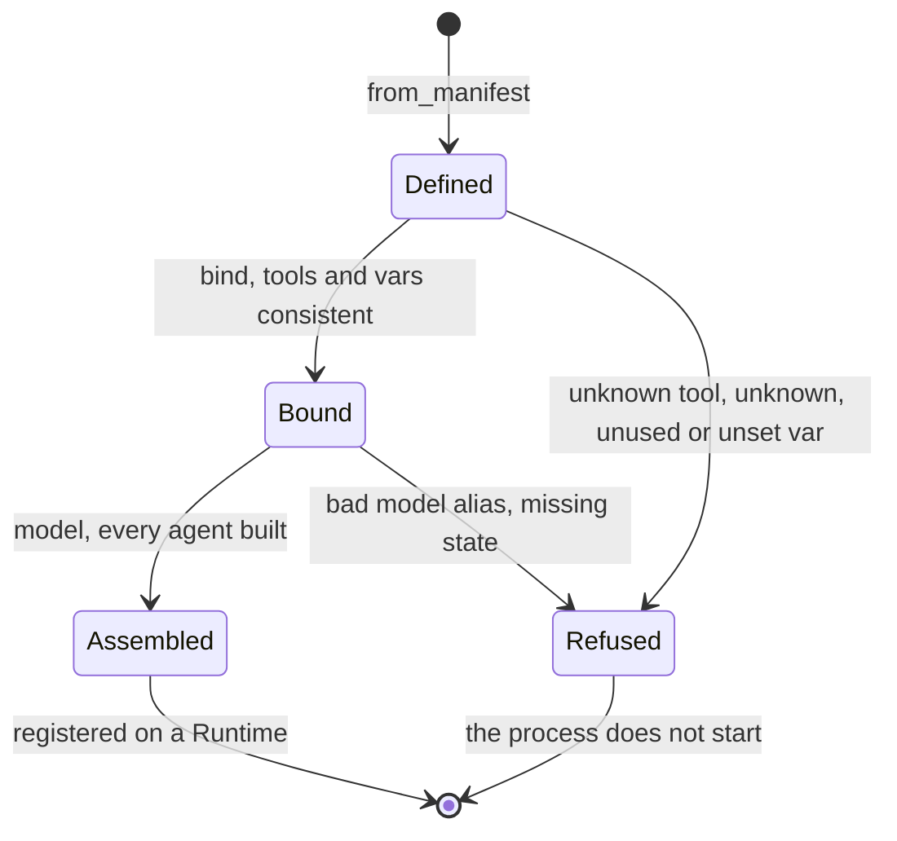

# The authoring layer

Status: **design; slices S1 (the typed tool helpers in `adam-llm-agent`), S2 (`#[tool]` and the `adam`
facade), S3 (`adam-coder` tools through `#[tool]`), S4 (`adam-agent-fs`, the parser and validator of
agent directories), S5 (the `build.rs` codegen and `adam::include_agent!()`) and S6 (`adam-assembly`,
which binds a manifest to `LlmAgent`s) are built**, the rest is planned (see [Delivery order](#delivery-order)). Accepted by
the owner on 2026-09-29 (decisions D1 to D6 below).
The roadmap items it serves are 3 (`#[tool]`) and 4 (`agent/` discovery) in the
[root README](../README.md#roadmap).

The goal, in the owner's words: agents, skills and more configured through plain Markdown files, and
tools configured in code, very easily, through macros. Where a standard exists, adam-rs follows the
standard.

Facts about third parties are marked *verified* (with the date and the source) or *unverified*.

## The idea in six lines

1. **Markdown for what the model reads, Rust for what runs.** `agent/` holds Markdown and JSON only:
   instructions, skills, subagents, `mcp.json`. Tools are Rust functions annotated `#[tool]`, in
   `src/`, so `cargo fmt`, clippy and rust-analyzer work on them.
2. **The layout is [eve](https://eve.dev)'s.** `agent/instructions.md`, `agent/subagents/`,
   `agent/skills/`, and `agents/<name>/` for several agents in one package.
3. **The file format of an agent, and of a subagent, is the Claude Code / GitHub Copilot custom-agent
   format:** Markdown with YAML frontmatter (`name`, `description`, `tools`, `model`, ...), body = system
   prompt. A file copied from `.claude/agents/x.md` or `.github/agents/x.agent.md` parses unchanged.
4. **Skills are the [Agent Skills](https://agentskills.io/specification) format, unchanged.**
5. **`build.rs` compiles the directory into a static manifest;** a `dev` feature reads the same
   directory at run time. One parser and one validator serve both.
6. **Skills and subagents add no durability mechanism.** They run inside the existing journaled
   `tool:CALL_ID` step; a subagent is a durable child run.

## Layout

```text
my-agent/                       # a normal Cargo package
├── Cargo.toml                  # adam = { features = ["macros"] }; [build-dependencies] adam-agent-fs
├── build.rs                    # adam_agent_fs::build("agent").emit()?;
├── agent/
│   ├── instructions.md         # optional YAML frontmatter + the system prompt
│   ├── instructions/           # optional: more .md files, appended in filename order
│   ├── skills/
│   │   ├── release-notes/SKILL.md      # Agent Skills spec (+ scripts/ references/ assets/)
│   │   └── triage.md                    # flat skill (eve convenience), name = file stem
│   ├── subagents/
│   │   ├── reviewer.md                  # or reviewer.agent.md: a Claude Code / Copilot agent file
│   │   ├── researcher/instructions.md   # directory form: own skills/, mcp.json, subagents/
│   │   └── billing.md                   # `a2a: <agent-card URL>` makes it a remote subagent
│   ├── mcp.json                # {"mcpServers": {...}}; secrets only as ${VAR}
│   └── schedules/daily.md      # frontmatter `cron:`; body = prompt (roadmap 5, sketch)
└── src/
    ├── main.rs                 # adam::include_agent!(); compose store + model + tools + serve
    └── tools/weather.rs        # #[tool] async fn get_weather(...)
```

Several agents in one package: `agents/<name>/...` with the same slots and no nested `agent/`. Having
both `agent/` and `agents/` is a **build error** (eve silently prefers `agent/`).

### Discovery rules

* `agent/` exists: one agent, named by frontmatter `name`, else `CARGO_PKG_NAME`.
* Else `agents/<name>/` for each direct child that holds `instructions.md`, named by its directory (it
  must match `name` when one is given).
* Neither: a build error, unless `build()` was given `.optional()`.
* Ignored: dotfiles, `*.test.md`, `__tests__/`, and a directory under `skills/` without `SKILL.md`.
* Names come from paths: `skills/<name>/SKILL.md` or `skills/<name>.md` is skill `<name>`;
  `subagents/<name>.md`, `subagents/<name>.agent.md` or `subagents/<name>/instructions.md` is subagent
  `<name>`; `schedules/a/b.md` is schedule `a/b`. For a subagent file, the name is the file name minus
  `.md` or `.agent.md` (as Copilot does), unless the frontmatter sets `name`.
* Subagents nest through `subagents/<name>/subagents/...`. Cycles are impossible by construction.

## File formats

YAML 1.2, so `no` is a string and not `false`. Frontmatter is optional in `instructions.md`; without it
the whole file is the prompt. A file whose first line is `---` must have a closing `---`, or it is an
error.

### Agent and subagent files (`instructions.md`, `subagents/*.md`, `*.agent.md`)

One schema for the root agent, for every directory subagent and for every flat subagent file. It is a
superset of the two custom-agent formats below.

```markdown
---
name: coder                    # default: CARGO_PKG_NAME (root), file name (subagents)
description: Turns a coding task into a verified pull request.   # required on subagents
model: coder-large             # a gateway alias; `inherit` = the parent's (default for subagents)
tools: [prepare_workspace, run_checks, ask_user]     # or "a, b, c"; "*" = all; MCP: "linear__*"
skills: all                    # or a list; default: every skill in this agent's skills/
limits:                        # LlmAgent Limits; Claude's `maxTurns` is read as limits.max_turns
  max_turns: 200
  max_tool_calls: 400
vars: { max_check_cycles: 3 }  # defaults for {{placeholders}} in the body; code may override
card:                          # root only: becomes adam_a2a::AgentCardConfig
  name: adam-coder
  skills:
    - { id: coding-task, name: Coding task to pull request, description: "...", tags: [code] }
metadata: { owner: platform-team }
---
You are the coder agent. Stop after at most {{max_check_cycles}} failed check cycles ...
```

* **Secrets and endpoints never live in files.** `model` is an alias; the endpoint and key come from
  the composition root (environment). The validator rejects the keys `api_key`, `apiKey`, `token`,
  `secret`, `password` and `base_url`. There is no `${VAR}` in agent frontmatter.
* `{{name}}` placeholders are logic-free substitution. An unknown placeholder, or a var that is never
  used, is a bind-time error. `{{{{` writes a literal `{{`.
* **Unknown keys: accepted with a warning** (`cargo:warning=`). Keys of Claude Code or Copilot that adam
  knows and ignores (`color`, `permissionMode`, `temperature`, `target`, `user-invocable`,
  `disable-model-invocation`, ...) get a softer "ignored by adam" warning. `build("agent").strict()`
  turns warnings into errors.
* **A subagent inherits nothing** from its parent (eve's isolation boundary), and omitting `tools:`
  gives it **no tools** (decision D3). Claude Code inherits everything; adam does not.
* **A copied file parses unchanged, but its `tools` must name adam tools.** A Claude Code file listing
  `Read, Grep` fails at bind time with a "did you mean" hint, because adam fails closed on an unknown
  tool name. Drop the key or list adam's tool names.

Remote subagent (A2A; the body, if any, only extends the tool description):

```markdown
---
description: Handles billing questions for a customer account.
a2a: https://billing.example.com/.well-known/agent-card.json
auth: bearer:BILLING_AGENT_TOKEN     # names an environment variable, resolved at startup, fail closed
---
```

#### The formats it accepts

| Format | Location | Keys | Status |
|---|---|---|---|
| Claude Code subagent | `.claude/agents/<file>.md` | `name` and `description` required; optional `tools` (comma string or YAML list; inherits all if omitted), `disallowedTools`, `model`, `permissionMode`, `maxTurns`, `skills`, `mcpServers`, `hooks`, `memory`, `background`, `effort`, `isolation`, `color`, `initialPrompt` | *verified 2026-09-29*, <https://code.claude.com/docs/en/sub-agents.md> |
| GitHub Copilot custom agent | `.github/agents/<name>.agent.md` (repository), `.github` or `.github-private` repository (organization) | `description` required; optional `name` (defaults to the file name), `target` (`vscode` or `github-copilot`), `tools` ("Supports both a comma separated string and yaml string array"; `["*"]` all, `[]` none), `model` ("If unset, inherits the default model"), `disable-model-invocation`, `user-invocable`, `mcp-servers`, `metadata`; the prompt is at most 30,000 characters; a file name may contain only `.`, `-`, `_`, `a-z`, `A-Z`, `0-9`; the name minus `.md` or `.agent.md` is what deduplicates | *verified 2026-09-29*, <https://docs.github.com/en/copilot/reference/custom-agents-configuration> and <https://docs.github.com/en/copilot/how-tos/copilot-on-github/customize-copilot/customize-cloud-agent/create-custom-agents> |
| OpenCode agent | `.opencode/agents/<name>.md` | `description`, `mode`, `model`, `temperature`, `permission`; the file name is the agent name | *verified 2026-09-29*, <https://opencode.ai/docs/agents/> |
| eve | `agent/`, `agents/<name>/agent/`, config in `agent.ts` | see the [mapping](#mapping-eve-to-adam-rs-to-standard) | *verified 2026-09-29*, <https://eve.dev/docs/reference/agent-files.md> and <https://eve.dev/docs/subagents.md> |

Where they disagree, adam-rs reads both spellings: `tools` takes a comma string or a list, as both do,
and `mcpServers` (Claude) and `mcp-servers` (Copilot) are recognised and warned about (`mcp.json` is the
place for MCP servers, see below). The Claude `model` values `sonnet`, `haiku` and so on
are not aliases of anything in adam-rs: `model` is a gateway alias, so a Claude file's `model` must be
changed or removed (`inherit` works).

### Skills (`skills/<name>/SKILL.md`): the Agent Skills spec, unchanged

Frontmatter: `name` (required, 1 to 64 characters, `a-z0-9-`, no leading, trailing or double hyphen,
and it must match the directory name), `description` (required, 1 to 1024 characters), `license`,
`compatibility`, `metadata`, `allowed-tools` (experimental). The body is free Markdown; `scripts/`,
`references/` and `assets/` are optional. *Verified 2026-09-29*, <https://agentskills.io/specification.md>.

Validation follows the spec's client guide (*verified 2026-09-29*,
<https://agentskills.io/client-implementation/adding-skills-support.md>): a name that does not match its
directory is a warning (the directory wins); a missing `description` or unparseable YAML skips the
skill and is a **build error**, because these files are our own source and not a third-party install.
A flat `skills/<name>.md` is an eve convenience and may omit frontmatter (the description is then the
first non-empty line, with a warning). `allowed-tools` is parsed and ignored in v1. Resources are
embedded up to 1 MiB per skill.

The repository's own `.agents/skills/` is a corpus of 75 vendored `SKILL.md` files. The parser must read
all of them with no error; that is a conformance test since S4.

### `mcp.json`

```json
{
  "mcpServers": {
    "linear": { "type": "http", "url": "https://mcp.linear.app/mcp",
                "headers": { "Authorization": "Bearer ${LINEAR_API_TOKEN}" },
                "tools": ["list_issues", "create_issue"] },
    "fs": { "command": "mcp-server-filesystem", "args": ["/work"],
            "env": { "LOG_LEVEL": "${MCP_LOG_LEVEL:-info}" } }
  }
}
```

* Field names follow Claude Code's `.mcp.json` (*verified 2026-09-29*,
  <https://code.claude.com/docs/en/mcp.md>) and the draft SEP-2633 (*verified draft status 2026-09-29*,
  <https://github.com/modelcontextprotocol/modelcontextprotocol/pull/2633>; the field details are
  *unverified* until the PR is read in full). There is no ratified standard yet.
* A `url` without `type` is an error, as in Claude Code. `tools` (an adam extension) is an allow-list.
  The model-facing name is `<server>__<tool>`.
* `${VAR}` and `${VAR:-default}` are expanded **at startup only**. A missing variable without a default
  fails startup (fail closed). `build.rs` records the names and never the values.
* stdio servers spawn processes: allowed only when the composition root opts in.

### Tools

Tools are Rust (next section). The files only say **which** tools an agent gets (`tools:`). Tool names
match `^[a-z][a-z0-9_]{0,63}$`.

## Parsing and validation (built: `adam-agent-fs`)

Slice S4. [`adam-agent-fs`](../crates/adam-agent-fs/README.md) reads a directory into an
`AgentManifest` and reports every problem as a `Diagnostic { severity, path, line, message }` (severity
is the closed enum `Error | Warning`). It is the one parser and the one validator: the `build.rs` codegen
(S5, below) and the run-time `dev` loader (S10) call it, so the two paths cannot disagree. It has no
async and no adam runtime dependency, and the codegen is a feature (`build`) of the same crate.
Nothing in it expands `${VAR}`.



* **Splitter.** The frontmatter exists only when the first line is `---`; the next `---` line closes
  it. An unclosed block is an error, never "no frontmatter". A byte-order mark and CRLF line endings are
  handled, and a file without frontmatter is all body. Bodies are kept with LF endings and trimmed.
* **YAML.** [`serde-saphyr`](https://crates.io/crates/serde-saphyr) 1.3.0, deserialize only, with
  `strict_booleans` so that `no` is a string (YAML 1.2). It has no dynamic value type, so keys the schema
  does not know are read into `serde_json::Value` and become warnings. *Verified 2026-09-29*, crates.io API:
  1.3.0 (2026-09-16), licence `MIT OR Apache-2.0`, `rust-version` 1.89; its new transitive crates
  `granit-parser` 1.3.0 (1.81), `annotate-snippets` 0.12.16 (1.85), `arraydeque` 0.5.1, `encoding_rs_io`
  0.1.8 and `unicode-width` 0.2.2 are all MIT or Apache-2.0, and `cargo deny check` passes with no change to
  `deny.toml`. Directory walking is `std::fs`, so `walkdir` is not a dependency.
* **Agent files.** `AgentFrontmatter` is the one schema for the root agent, a directory subagent and a flat
  subagent: `name`, `description`, `tools` (a list, or a comma string; `*` is every tool), `model` (an alias,
  or `inherit`), `skills` (`all` or a list), `preload_skills`, `limits` (Claude's `maxTurns` is folded into
  `limits.max_turns`), `vars` (scalars, read as text), `card` (root only), `a2a` and `auth` (a remote
  subagent), `metadata`. A subagent needs a `description`. The keys `api_key`, `apiKey`, `token`, `secret`,
  `password` and `base_url` are errors (compared without case, `_` and `-`), and so is a `model` that is a URL.
  Claude Code, Copilot and OpenCode keys that adam does not act on (`color`, `permissionMode`, `target`,
  `user-invocable`, `mcp-servers`, ...) warn "ignored"; any other unknown key warns "unknown".
* **Names.** Agents and subagents match `^[a-z0-9][a-z0-9_-]{0,63}$`. The frontmatter `name` wins when it is
  valid; otherwise the path gives the name (the file name without `.md` or `.agent.md`, the directory, or the
  composition root's default for the root agent) with a warning. Copilot allows capitals in file names and
  display names in `name`, so `Code-Reviewer.agent.md` is lower-cased with a warning and
  `name: Security Reviewer` falls back to the file name. In `agents/<name>/` the directory is the name and
  a different `name:` is an error. Two subagents or skills with one name are an error.
* **Skills.** The Agent Skills rules of the section above. The effective name is always the directory name
  (the file stem of a flat skill). A missing `name` on a directory skill warns. `metadata` values that are not
  strings are kept as their text (skills in the wild put lists there). `resources` lists the other files of a
  skill directory without reading them; symbolic links are followed one step and never entered twice.
* **`mcp.json`.** `mcpServers`, with `type` `stdio` (the default when there is a `command`), `http`,
  `streamable-http` or `sse`. A `url` without `type` is an error, as in Claude Code; `ws` is not supported.
  The server name and each allow-listed tool must fit `<server>__<tool>` in 64 characters. `${VAR}` and
  `${VAR:-default}` stay as written, and `McpConfig::env_references()` lists the names for a build to record.
  A literal credential in a header, an environment value or a URL is a **warning** (as in the plan; a strict
  build refuses it); a server key such as `apiKey` is an **error**.
* **Schedules.** `cron` (five fields, checked for shape and not evaluated), `timezone` (default `UTC`),
  `agent:` (must be the owning agent), and a non-empty body. Schedules belong to the root agent of a
  directory; in a subagent directory they warn "ignored".
* **Other rules.** A prompt over 30,000 characters warns, because GitHub Copilot accepts at most that in an
  agent file (*verified 2026-09-29*, the Copilot custom-agents configuration page cited above). An entry of an
  agent directory that is not a slot (`tools/`, `channels/`, ...) warns and points at `#[tool]`.
  Dotfiles, `*.test.md`, `__tests__/` and `README.md` are never read. Files that are not UTF-8 are errors.

The test suite is the specification: one fixture directory per rule, each producing exactly one diagnostic;
all 75 vendored `.agents/skills/*/SKILL.md` of this repository parse with no error and no warning; a Claude
Code agent and two Copilot agents parse unchanged as subagents; and the splitter never panics on arbitrary
text.

## Build and dev (built: `build.rs` codegen)

Slice S5. `adam_agent_fs::build("agent").emit()` in `build.rs` and `adam::include_agent!()` in the
crate are the default way to ship an agent: the directory is parsed, validated and embedded at
build time, so a mistake stops the build before rustc runs and nothing is parsed at startup. The
same `Dir` source reads the same files at run time (the `dev` feature of slice S10); both produce a
`Package`, and the tests assert that the embedded one equals the one read from the directory.





* **Diagnostics are build errors.** Every finding is one line, `cargo::error=path:line: message` (or
  `cargo::warning=` for a warning), with the path relative to the package root. A warning fails the
  build under `.strict()`. `emit()` returns `Err(BuildError)` whose `Debug` is its message. Nothing is
  written for a refused directory, and the watch list is printed anyway so that fixing the file
  rebuilds.
* **Rerun tracking.** `cargo::rerun-if-changed` is printed for the agent directory (cargo scans a
  directory recursively, so a new file is noticed) and for every file and directory in it, ignored
  files included. If the directory does not exist nothing is printed: a path that does not exist makes
  cargo rerun the script on every build, and with no directive cargo's default (rerun when the
  package changes) applies. `OUT_DIR/adam_agent.rs` is rewritten only when its bytes change.
  *Verified 2026-09-29* with cargo 1.94.1 on a scratch build script: a missing `rerun-if-changed` path
  is reported `Dirty ... the file ... is missing` on every build, a new file in a watched directory
  makes the package dirty, and `cargo::error=` fails the build even when the script exits 0.
* **`build("agent")` or `build("agents")`.** The argument names the directory (`agent/` one agent,
  `agents/<name>/` several) and must match the layout found; anything else is an error. Both present
  is the error of the discovery rules, neither is an error unless `.optional()`.
* **The generated file** defines `AGENTS` (a slice of `EmbeddedAgent`, sorted by name), `AGENT` (the
  single agent of an `agent/` package) and `PACKAGE` (an `EmbeddedPackage`). It is `'static` data:
  prompts, skill bodies and schedule prompts are raw string literals (normalised: frontmatter removed,
  LF endings, trimmed); the frontmatter is JSON, read back into the same `AgentFrontmatter`; `mcp.json`
  is `include_str!` of the file and stays unexpanded, so no secret passes through the build; skill
  resources are `include_bytes!`, at most 1 MiB per skill. Every agent, at every depth, carries a
  `digest`: SHA-256 over the JSON of the normalised manifest and the bytes of each resource, the same
  for a directory (`Dir::digest`) and for its embedded copy (`EmbeddedAgent::verify`). The plan's
  `body_offset` (a body's line in its file, for bind-time messages) is not there: slice S6 reports lines
  within the body instead (`prompt line N` of the file it names).
* **Two sources, one type.** `ManifestSource::load()` is implemented by `Dir` and by
  `EmbeddedPackage`, both giving a `Report` and a `Package`. `adam::agent_fs` is the whole crate
  re-exported by the facade, and generated code refers to it as `::adam::agent_fs` (change it with
  `.crate_path(..)` for a crate that depends on `adam-agent-fs` directly).
* **Versions must match.** The generated code fills the public fields of the `Embedded*` types, so
  the crate that runs `build()` and the crate that runs the binary must be the same version of
  `adam-agent-fs` (they are, when both come from the workspace or from `adam`).

The tests: a golden file of the generated source; a trybuild pass test that compiles and runs the
generated source for a single, a multi-agent and an absent package under `deny(warnings)`; the
`adam-agent-fixture` crate, which has a real `build.rs` and `adam::include_agent!()` and asserts
embedded equals directory; an invalid directory gives `path:line` errors and no file; and
`rerun-if-changed` equals the set of all files. Details are in the
[`adam-agent-fs` README](../crates/adam-agent-fs/README.md#embedding-at-build-time).

## The `#[tool]` contract

Built (slice S2): [`adam-macros`](../crates/adam-macros/README.md) is the macro, and
[`adam`](../crates/adam/README.md) is the facade you depend on.

```rust
use adam::prelude::*;

/// Ask the person who gave you the task a question and wait for the answer.
#[tool]
pub async fn ask_user(
    /// What you need to know
    question: String,
) -> Result<ToolOutput, ToolError> { /* ... */ }

let tools = tools![AskUser, RunChecks];
let agent = LlmAgent::builder("coder", model, alias).state(env.clone()).tools(tools).try_build()?;
```

`#[tool]` keeps the function (so a unit test can call it), and generates a unit struct (`AskUser`,
the function name in `UpperCamelCase`, with the function's visibility) that implements the `Tool` trait
of `adam-llm-agent`.

* **Description and schema:** the doc comment of the function is the tool description (required: a
  tool without one does not compile); the doc comment of each parameter is the property description.
  Lines of one paragraph are joined with a space and a blank line keeps a paragraph break, so the
  hard wrapping of a doc comment does not reach the model; list items, headings, quotes, table rows
  and fenced code keep their lines. The arguments become one struct that derives `Deserialize` and
  `JsonSchema` (schemars 1.x, draft 2020-12, subschemas inlined, no `$schema`, no `title`); the spec
  is computed once per tool (`OnceLock`).
* **Parameter kinds:** `&ToolCtx` (at most one, any position); `State<T>` (shared state, resolved
  with `ToolCtx::require_state`); every other parameter is a field of the arguments struct, and its
  `#[serde(..)]` and `#[schemars(..)]` attributes are copied to the field. `#[args] a: MyArgs` uses an
  existing struct as the whole argument object and must be the only model argument.
* **Return:** `Result<T, E>` or a bare `T`, with `T: IntoToolOutput` and `E: Into<ToolError>`.
* **Options:** `name = "..."`, `type = Ident`, `strict` (`deny_unknown_fields`, which also closes the
  schema), `classify` (the error is `adam_error::Classify`: retryable becomes `ToolError::Transient`,
  the rest `Permanent`) and `crate = path` (default `::adam`; `::adam_llm_agent` for a crate that does
  not use the facade). Reserved for later: `approval` (roadmap 5) and `subagents = false`.
* **Bad model input is the model's problem:** a deserialization failure becomes `ToolOutput::error`
  (as `Tool::call` already documents), so the model can correct itself; the function never sees it.
* **State is checked at build:** `Tool::required_state` names the `State<T>` types a tool needs, and
  `LlmAgentBuilder::try_build` fails at startup when one is missing.
* **Journaling is unchanged:** the call runs inside `LlmAgent`'s `tool:CALL_ID` step, so the retry
  rules of the `Tool` docs still apply, and the macro adds nothing non-deterministic.
* **No distributed slices** (`inventory`, `linkme`): `tools![...]` is an explicit list that the
  compiler checks; the agent files name tools, and binding fails at startup on an unknown name.
* **Compile errors** the macro produces itself, each pointing at the offending token: no doc comment,
  not `async`, generic or `impl Trait`, a `self` receiver, a borrowed argument (`&str`), two
  `&ToolCtx`, `#[args]` next to another model argument, a bad tool name, an unknown option, a parameter
  pattern that is not a plain name, and `#[tool]` on something that is not a function. All the mistakes
  of one function are reported in one compile. rustc reports the rest (an argument type without
  `Deserialize` or `JsonSchema`, a return type that is not a tool result) with messages from
  `#[diagnostic::on_unimplemented]`.

What runs when the model calls a generated tool (the code between the journal and your function is
what the macro writes):



`FnTool` builds a tool at run time (an MCP tool is one). The typed helpers the macro relies on
(`spec_for`, `IntoToolOutput`, `parse_args`, `State<T>`, `ToolSet`) are slice S1 and live in
[`adam-llm-agent`](../crates/adam-llm-agent/README.md); the paths the generated code uses are
re-exported there as `#[doc(hidden)] __private` (feature `schema`) and again by the facade, so that a
crate using `#[tool]` needs no dependency of its own on `serde`, `schemars` or `async-trait` for the
generated code.

## Skills and subagents at run time (planned)

**Skills** use progressive disclosure. The catalog (`name`, `description`) is appended to the system
prompt; the tool `load_skill { name }` (an enum of the agent's skills) returns the body wrapped in
`<skill_content>`; `read_skill_file { skill, path }` reads an embedded resource and rejects `..` and
absolute paths. `load_skill` is a normal tool, so its result is journaled: a replay returns the body the
model first saw, even if the skill changed in between. No skills means no tool and no catalog.

**Subagents** are child runs. Each local subagent is its own `LlmAgent` registered on the same
`Runtime` as `<root>/<sub>`. The parent sees one tool per subagent (decision D5), with input
`{ message }`. The child never sees the parent's history.

Planned: this describes slice S8/S9. Nothing in the diagram exists yet; `NewRun::parent` exists in
`adam-core` and the runtime never sets it.





The deterministic child id (`uuidv5(parent run, call id)`) with `start_with_id` makes the start
idempotent, so the only side effects of the call are that creation and reads. Runtime changes:
`Runtime::start_child`, a notification on the terminal commit of a run that has a parent
(at-least-once, deduplicated by `Inbound::id`), `Ctx::child_status` as the fallback read, a new
`ToolError::AwaitRun` variant (old journals still decode), and `LlmAgent` generalising
`pending_question` to a wait with a serde default so stored conversations still load. Cancelling a
parent does not cancel its children in v1; they finish within their own limits.

Remote subagents (`a2a:`) use the same tool shape: a journaled A2A `SendMessage`, then a park on the
remote task id and a poll on the timer.

## Binding (built: `adam-assembly`)

Slice S6. [`adam-assembly`](../crates/adam-assembly/README.md) turns a manifest into `LlmAgent`s. The
embedded manifest (`AgentDef::from_manifest(AGENT)`, where `AGENT` is the `&'static EmbeddedAgent` of
`adam::include_agent!()`) and one read from a directory at run time (`AgentDef::from_source(&Dir::new(..), ..)`)
are the same `AgentManifest`, so they take one code path and the tests assert that they bind to equal
agents.





* **Tools.** `tools:` names are checked against the `ToolSet`. An unknown name is
  `Error::UnknownTool` with the closest registered name ("did you mean") and the list of what is
  registered; a `linear__*` pattern must match at least one tool. The root agent with no `tools:` gets
  every registered tool, a subagent with none gets none (D3), `*` is all and `[]` none. Nothing is
  inherited from the parent.
* **Vars.** `{{name}}` is substituted into the body of `instructions.md` and every `instructions/*.md`.
  An unknown placeholder, a var declared and never used, a used var whose default is empty and that the
  code did not supply (`vars:` with `repo:` and nothing after it), a value supplied for an undeclared
  var, and a `{{` that is not a placeholder are all errors at `bind`, with the file and the line of the
  body. `{{{{` writes a literal `{{`. Values come from `AgentDef::var` (root) and `agent_var("a/b", ..)`.
* **Model.** One `DynModel` for every agent. An agent's gateway alias is the `model:` it names, else its
  parent's (`inherit`, the subagent default), else the alias the code passes to `model(..)`.
  `model_aliases([..])` lists what the deployment serves and refuses the rest with a suggestion.
* **State and limits.** `state(Arc<T>)` reaches every agent's tools; a tool whose `required_state` is
  missing fails `model(..)` with the agent's name. The frontmatter `limits` replace the loop's defaults
  key by key.
* **Subagents are defined, not yet callable.** Each local subagent becomes an `LlmAgent` named
  `<parent>/<name>` with its own prompt, tools, alias and limits, and `Assembly::register` registers all of
  them on the runtime. The tool that starts one as a durable child run is S8/S9; remote subagents are data
  (`Assembly::remotes()`) until S9b. Skills and `mcp.json` stay in the manifest for S7 and S11. Each of
  these plugs into `BoundDef::build`, the one function that makes an `LlmAgent` from a bound agent.
* **The card.** With feature `a2a`, `Assembly::card(url, version)` is the root's `card:` as an
  `adam_a2a::AgentCardConfig`; the public URL and the version belong to the deployment.

Deviations from the plan's sketch, on purpose: `AGENT` is already a reference, so the call is
`from_manifest(AGENT)` and not `&AGENT`; the runtime has no `agents(..)` method, so `Assembly::register`
folds `RuntimeBuilder::agent` over the agents; a subagent's prompt lines are counted from its body, since
the manifest keeps no `body_offset`; and `state(..)` comes before `model(..)` because `model(..)` is the
step that builds the agents and finds a missing state.

## Dev reload (planned)

| | `build.rs` (default) | function-like proc macro | run-time `AgentDir::load` (dev) |
|---|---|---|---|
| Finds new files | yes (`cargo::rerun-if-changed=agent` scans the directory, *verified 2026-09-29*, <https://doc.rust-lang.org/cargo/reference/build-scripts.html>) | no: tracking paths from a proc macro is nightly-only (`proc_macro::tracked`, *verified 2026-09-29*, <https://doc.rust-lang.org/proc_macro/tracked/index.html>) | n/a |
| Errors | file and line, before rustc runs | `compile_error!` at the call site | at startup |
| Cost at startup | none | none | parse |

With the `dev` feature (off by default, so a release binary cannot read prompts from disk unless it
opts in), `AgentDef::from_dir("agent")` plus `.watch()` (slice S10; `from_source` is the building block)
rebuilds the same manifest at run time. Each
`step` takes the current definition, so a running run picks up new instructions at its next step and
never mid-step; an invalid edit keeps the last good version and logs the diagnostics. Tool code changes
need a rebuild. Runs are durable in the store, so a restart resumes them (use the Compose Postgres, not
the in-memory store).

## Crate layout

`adam-macros`, `adam`, `adam-agent-fs` and `adam-assembly` exist; the others are planned.

| Crate | Kind | Contents |
|---|---|---|
| `adam-macros` | proc-macro | **built (S2)**: `#[tool]`; a thin shim over a pure, unit-tested `expand` function |
| `adam-agent-fs` | lib | **built (S4, S5)**: frontmatter splitter, schemas, discovery, validation with diagnostics, `ManifestSource` with the `Dir` and `EmbeddedPackage` implementations, the digest of a manifest, and the `build.rs` codegen behind the feature `build`. No async, no runtime dependency |
| `adam-assembly` | lib | **built (S6)**: `AgentDef`: manifest + `ToolSet` + model + state into `LlmAgent`s (root and local subagents); `{{var}}` templating; the A2A card behind feature `a2a`. Planned: skills, `SubagentTool`, dev reload |
| `adam-mcp` | lib | MCP client (the official Rust SDK): MCP tools as `Tool`s, `${VAR}` expansion, fail closed |
| `adam` | facade | **built (S2, S5, S6)**: `prelude`, the macro, feature `macros` (default), `include_agent!`, `adam::agent_fs`, `AgentDef` and its stages, `adam::assembly`, feature `a2a`. Planned: features `mcp`, `dev` |
| `adam-agent-fixture` | test fixture | **built (S5)**, not published: a `build.rs` plus `include_agent!()` over the `adam-agent-fs` test fixture, and the tests that compare embedded and directory |
| `cargo-adam` | bin | `new`, `check`, `dev` (roadmap 6) |

`ManifestSource` is the seam between where the files come from and what they mean, so that a backend can be swapped
without touching the other: its signature has only manifest types and diagnostics. `Tool` stays
the only tool seam; MCP and `FnTool` implement it. Third-party crates the plan needs (`schemars`, `syn`,
`serde-saphyr`, `rmcp`, `notify`, `trybuild`) are checked against `cargo deny` in the slice that adds
each; `schemars` 1.2.2 is already in `Cargo.lock`. S2 added `syn` 3, `quote` and `proc-macro2` (all
already locked, through `async-trait`) to `adam-macros`, and `trybuild` 1.0.121 as a dev-dependency of
`adam` (it brings `toml`, `winnow`, `glob`, `termcolor`, `target-tuple`; *verified 2026-09-29*:
`cargo deny check` passes). S4 added `serde-saphyr` 1.3.0 to `adam-agent-fs` (see [Parsing and
validation](#parsing-and-validation-built-adam-agent-fs)).

## Mapping: eve to adam-rs to standard

| eve | adam-rs | Standard or convention |
|---|---|---|
| `agent/`, `agents/<name>/agent/` | `agent/`, `agents/<name>/` | eve (no standard exists) |
| `agent.ts` `defineAgent({ model, limits, ... })` | YAML frontmatter of `instructions.md` | Claude Code and Copilot custom-agent frontmatter |
| `instructions.md`, `instructions/` | same | plain Markdown, as AGENTS.md (no required fields) |
| `tools/<name>.ts` `defineTool` + Zod | `#[tool]` fn in `src/`, schemars, `tools![...]` | JSON Schema 2020-12 parameters (the MCP and OpenAI tool shape) |
| `skills/<name>/SKILL.md`, `skills/<name>.md`, `load_skill` | same, plus `read_skill_file` | **Agent Skills spec** |
| `subagents/<id>/agent.ts` (`description` required) | `subagents/<name>.md`, `<name>.agent.md` or `<name>/instructions.md` | Claude Code subagent file, Copilot custom agent |
| remote agent | `subagents/<name>.md` with `a2a:` | **A2A** agent card |
| built-in `agent` tool | not in v1 | none |
| `connections/*.ts` | `mcp.json` (MCP only) | `mcpServers` (Claude Code, SEP-2633 draft) |
| `channels/` | code: `adam-a2a`; `card:` frontmatter | **A2A** agent card |
| `hooks/*.ts` | `EventSink` in code | none |
| `schedules/*.md` (`cron:`) | same | five-field cron |
| `sandbox.ts` | later (roadmap 7) | none |
| `lib/` | `src/` | Cargo |
| `eve info`, `.eve/compile/*.json` | build errors and warnings, `OUT_DIR/adam_agent.rs`, `cargo adam check` | none |
| `eve dev` | the `dev` feature | none |

A2A card "skills" and Agent Skills are unrelated; they never map implicitly. The **AGENTS.md** file
(<https://agents.md/>, *verified 2026-09-29*) is not used as the agent's prompt, because coding agents
read it as instructions for editing that folder. An agent that works on repositories reads the target
repository's nearest `AGENTS.md` at run time instead.

## Decisions (accepted by the owner, 2026-09-29)

The owner accepted D1 to D6 as recommended, and added one rule: **keep the structure of eve.dev, GitHub
Copilot and Claude Code for agents and subagents.** The layout is eve's; the file format is the Claude
Code / Copilot custom agent; `.agent.md` is accepted and the name is the stem without `.agent`; unknown
Claude or Copilot keys are accepted with a warning.

| | Decision | Rejected alternative |
|---|---|---|
| D1 | Configuration is YAML frontmatter, not `agent.toml`: one schema shared with Claude Code, Copilot, OpenCode and Agent Skills | TOML: Rust-native, but no agent convention |
| D2 | Tools live in `src/` with an explicit `tools![]`, not `agent/tools/*.rs` auto-discovery | included files are invisible to `cargo fmt` |
| D3 | A subagent that omits `tools:` gets none | inherit all: Claude-compatible, surprising for a durable backend |
| D4 | Unknown frontmatter keys and Agent Skills violations warn (`.strict()` opts in to errors); a missing `description` always fails | fail the build on any |
| D5 | One tool per subagent, named after it | a single `delegate { agent, message }` tool |
| D6 | The `dev` feature ships in the facade and is off by default | on by default |

Also confirmed: adam-rs domain types are **closed enums** (no `#[non_exhaustive]` unless an existing
type already sets the pattern).

## Open questions

* Reasoning effort, sampling and compaction: `ModelRequest` has no such fields, so the keys are
  accepted and ignored with a warning.
* Tool approvals (`approval:`) fit roadmap 5; where the policy lives (`#[tool(...)]`, frontmatter or
  both) is open.
* An `evals/` directory; an OpenAPI connection; subagent continuation (`task_id`) and a built-in
  root-copy `agent` tool; exporting a Rust tool as an MCP server; following SEP-2633 to ratification.

## Delivery order

| Slice | What | State |
|---|---|---|
| S0 | this document | this change |
| S1 | typed tool helpers in `adam-llm-agent` (feature `schema` for the schema part) | built |
| S2 | `#[tool]` and the `adam` facade | built |
| S3 | `adam-coder` tools through `#[tool]`, no behaviour change | built |
| S4 | `adam-agent-fs`: parse and validate agent directories | built |
| S5 | `build.rs` codegen and `adam::include_agent!()` | built |
| S6 | `adam-assembly`: `AgentDef`, templating, tool binding, models, the card | built |
| S7 | skills | planned |
| S8, S9 | child runs and subagents | planned; S8 needs a review of the design above first |
| S10, S11 | dev reload; `mcp.json` tools | planned |
