# The authoring layer

Status: **design; slices S1 (the typed tool helpers in `adam-llm-agent`), S2 (`#[tool]` and the `adam`
facade), S3 (`adam-coder` tools through `#[tool]`), S4 (`adam-agent-fs`, the parser and validator of
agent directories), S5 (the `build.rs` codegen and `adam::include_agent!()`), S6 (`adam-assembly`,
which binds a manifest to `LlmAgent`s), S6b (the coder's prompt and card from `agent/`), S7 (skills at run time), S8 (durable child runs in the runtime), S9 (subagents as tools), S9b (remote A2A subagents), S10 (dev reload) and S11 (`mcp.json` tools) are built**, the rest is planned (see [Delivery order](#delivery-order)). Accepted by
the owner on 2026-09-29 (decisions D1 to D6 below).
The roadmap items it serves are 3 (`#[tool]`) and 4 (`agent/` discovery) in the
[root README](../README.md#roadmap).

The goal, in the owner's words: agents, skills and more configured through plain Markdown files, and
tools configured in code, very easily, through macros. Where a standard exists, adam-rs follows the
standard.

Facts about third parties are marked *verified* (with the date and the source) or *unverified*.

## The idea in six lines

1. **Markdown for what the model reads, Rust for what runs.** `agent/` holds Markdown and JSON only:
   instructions, skills, subagents, `mcp.json`. Tools are Rust functions annotated `#[tool]`, in
   `src/`, so `cargo fmt`, clippy and rust-analyzer work on them.
2. **The layout is [eve](https://eve.dev)'s.** `agent/instructions.md`, `agent/subagents/`,
   `agent/skills/`, and `agents/<name>/` for several agents in one package.
3. **The file format of an agent, and of a subagent, is the Claude Code / GitHub Copilot custom-agent
   format:** Markdown with YAML frontmatter (`name`, `description`, `tools`, `model`, ...), body = system
   prompt. A file copied from `.claude/agents/x.md` or `.github/agents/x.agent.md` parses unchanged.
4. **Skills are the [Agent Skills](https://agentskills.io/specification) format, unchanged.**
5. **`build.rs` compiles the directory into a static manifest;** a `dev` feature reads the same
   directory at run time. One parser and one validator serve both.
6. **Skills and subagents add no durability mechanism.** They run inside the existing journaled
   `tool:CALL_ID` step; a subagent is a durable child run.

## Layout

```text
my-agent/                       # a normal Cargo package
├── Cargo.toml                  # adam = { features = ["macros"] }; [build-dependencies] adam-agent-fs
├── build.rs                    # adam_agent_fs::build("agent").emit()?;
├── agent/
│   ├── instructions.md         # optional YAML frontmatter + the system prompt
│   ├── instructions/           # optional: more .md files, appended in filename order
│   ├── skills/
│   │   ├── release-notes/SKILL.md      # Agent Skills spec (+ scripts/ references/ assets/)
│   │   └── triage.md                    # flat skill (eve convenience), name = file stem
│   ├── subagents/
│   │   ├── reviewer.md                  # or reviewer.agent.md: a Claude Code / Copilot agent file
│   │   ├── researcher/instructions.md   # directory form: own skills/, mcp.json, subagents/
│   │   └── billing.md                   # `a2a: <agent-card URL>` makes it a remote subagent
│   ├── mcp.json                # {"mcpServers": {...}}; secrets only as ${VAR}
│   └── schedules/daily.md      # frontmatter `cron:`; body = prompt (roadmap 5, sketch)
└── src/
    ├── main.rs                 # adam::include_agent!(); compose store + model + tools + serve
    └── tools/weather.rs        # #[tool] async fn get_weather(...)
```

Several agents in one package: `agents/<name>/...` with the same slots and no nested `agent/`. Having
both `agent/` and `agents/` is a **build error** (eve silently prefers `agent/`).

### Discovery rules

* `agent/` exists: one agent, named by frontmatter `name`, else `CARGO_PKG_NAME`.
* Else `agents/<name>/` for each direct child that holds `instructions.md`, named by its directory (it
  must match `name` when one is given).
* Neither: a build error, unless `build()` was given `.optional()`.
* Ignored: dotfiles, `*.test.md`, `__tests__/`, and a directory under `skills/` without `SKILL.md`.
* Names come from paths: `skills/<name>/SKILL.md` or `skills/<name>.md` is skill `<name>`;
  `subagents/<name>.md`, `subagents/<name>.agent.md` or `subagents/<name>/instructions.md` is subagent
  `<name>`; `schedules/a/b.md` is schedule `a/b`. For a subagent file, the name is the file name minus
  `.md` or `.agent.md` (as Copilot does), unless the frontmatter sets `name`.
* Subagents nest through `subagents/<name>/subagents/...`. Cycles are impossible by construction.

## File formats

YAML 1.2, so `no` is a string and not `false`. Frontmatter is optional in `instructions.md`; without it
the whole file is the prompt. A file whose first line is `---` must have a closing `---`, or it is an
error.

### Agent and subagent files (`instructions.md`, `subagents/*.md`, `*.agent.md`)

One schema for the root agent, for every directory subagent and for every flat subagent file. It is a
superset of the two custom-agent formats below.

```markdown
---
name: coder                    # default: CARGO_PKG_NAME (root), file name (subagents)
description: Turns a coding task into a verified pull request.   # required on subagents
model: coder-large             # a gateway alias; `inherit` = the parent's (default for subagents)
tools: [prepare_workspace, run_checks, ask_user]     # or "a, b, c"; "*" = all; MCP: "linear__*"
skills: all                    # or a list; default: every skill in this agent's skills/
limits:                        # LlmAgent Limits; Claude's `maxTurns` is read as limits.max_turns
  max_turns: 200
  max_tool_calls: 400
vars: { max_check_cycles: 3 }  # defaults for {{placeholders}} in the body; code may override
card:                          # root only: becomes adam_a2a::AgentCardConfig
  name: adam-coder
  skills:
    - { id: coding-task, name: Coding task to pull request, description: "...", tags: [code] }
metadata: { owner: platform-team }
---
You are the coder agent. Stop after at most {{max_check_cycles}} failed check cycles ...
```

* **Secrets and endpoints never live in files.** `model` is an alias; the endpoint and key come from
  the composition root (environment). The validator rejects the keys `api_key`, `apiKey`, `token`,
  `secret`, `password` and `base_url`. There is no `${VAR}` in agent frontmatter.
* `{{name}}` placeholders are logic-free substitution. An unknown placeholder, or a var that is never
  used, is a bind-time error. `{{{{` writes a literal `{{`.
* **Unknown keys: accepted with a warning** (`cargo:warning=`). Keys of Claude Code or Copilot that adam
  knows and ignores (`color`, `permissionMode`, `temperature`, `target`, `user-invocable`,
  `disable-model-invocation`, ...) get a softer "ignored by adam" warning. `build("agent").strict()`
  turns warnings into errors.
* **A subagent inherits nothing** from its parent (eve's isolation boundary), and omitting `tools:`
  gives it **no tools** (decision D3). Claude Code inherits everything; adam does not.
* **A copied file parses unchanged, but its `tools` must name adam tools.** A Claude Code file listing
  `Read, Grep` fails at bind time with a "did you mean" hint, because adam fails closed on an unknown
  tool name. Drop the key or list adam's tool names.

Remote subagent (A2A; the body, if any, only extends the tool description):

```markdown
---
description: Handles billing questions for a customer account.
a2a: https://billing.example.com/.well-known/agent-card.json
auth: bearer:BILLING_AGENT_TOKEN     # names an environment variable, resolved at startup, fail closed
---
```

How it behaves (slice S9b) is under [Remote subagents](#remote-subagents-a2a-s9b).

#### The formats it accepts

| Format | Location | Keys | Status |
|---|---|---|---|
| Claude Code subagent | `.claude/agents/<file>.md` | `name` and `description` required; optional `tools` (comma string or YAML list; inherits all if omitted), `disallowedTools`, `model`, `permissionMode`, `maxTurns`, `skills`, `mcpServers`, `hooks`, `memory`, `background`, `effort`, `isolation`, `color`, `initialPrompt` | *verified 2026-09-29*, <https://code.claude.com/docs/en/sub-agents.md> |
| GitHub Copilot custom agent | `.github/agents/<name>.agent.md` (repository), `.github` or `.github-private` repository (organization) | `description` required; optional `name` (defaults to the file name), `target` (`vscode` or `github-copilot`), `tools` ("Supports both a comma separated string and yaml string array"; `["*"]` all, `[]` none), `model` ("If unset, inherits the default model"), `disable-model-invocation`, `user-invocable`, `mcp-servers`, `metadata`; the prompt is at most 30,000 characters; a file name may contain only `.`, `-`, `_`, `a-z`, `A-Z`, `0-9`; the name minus `.md` or `.agent.md` is what deduplicates | *verified 2026-09-29*, <https://docs.github.com/en/copilot/reference/custom-agents-configuration> and <https://docs.github.com/en/copilot/how-tos/copilot-on-github/customize-copilot/customize-cloud-agent/create-custom-agents> |
| OpenCode agent | `.opencode/agents/<name>.md` | `description`, `mode`, `model`, `temperature`, `permission`; the file name is the agent name | *verified 2026-09-29*, <https://opencode.ai/docs/agents/> |
| eve | `agent/`, `agents/<name>/agent/`, config in `agent.ts` | see the [mapping](#mapping-eve-to-adam-rs-to-standard) | *verified 2026-09-29*, <https://eve.dev/docs/reference/agent-files.md> and <https://eve.dev/docs/subagents.md> |

Where they disagree, adam-rs reads both spellings: `tools` takes a comma string or a list, as both do,
and `mcpServers` (Claude) and `mcp-servers` (Copilot) are recognised and warned about (`mcp.json` is the
place for MCP servers, see below). The Claude `model` values `sonnet`, `haiku` and so on
are not aliases of anything in adam-rs: `model` is a gateway alias, so a Claude file's `model` must be
changed or removed (`inherit` works).

### Skills (`skills/<name>/SKILL.md`): the Agent Skills spec, unchanged

Frontmatter: `name` (required, 1 to 64 characters, `a-z0-9-`, no leading, trailing or double hyphen,
and it must match the directory name), `description` (required, 1 to 1024 characters), `license`,
`compatibility`, `metadata`, `allowed-tools` (experimental). The body is free Markdown; `scripts/`,
`references/` and `assets/` are optional. *Verified 2026-09-29*, <https://agentskills.io/specification.md>.

Validation follows the spec's client guide (*verified 2026-09-29*,
<https://agentskills.io/client-implementation/adding-skills-support.md>): a name that does not match its
directory is a warning (the directory wins); a missing `description` or unparseable YAML skips the
skill and is a **build error**, because these files are our own source and not a third-party install.
A flat `skills/<name>.md` is an eve convenience and may omit frontmatter (the description is then the
first non-empty line, with a warning). `allowed-tools` is parsed and ignored in v1. Resources are
embedded up to 1 MiB per skill. What the model sees of a skill at run time is
[described below](#skills-at-run-time-built-s7-adam-assembly).

The repository's own `.agents/skills/` is a corpus of 75 vendored `SKILL.md` files. The parser must read
all of them with no error; that is a conformance test since S4.

### `mcp.json`

```json
{
  "mcpServers": {
    "linear": { "type": "http", "url": "https://mcp.linear.app/mcp",
                "headers": { "Authorization": "Bearer ${LINEAR_API_TOKEN}" },
                "tools": ["list_issues", "create_issue"] },
    "fs": { "command": "mcp-server-filesystem", "args": ["/work"],
            "env": { "LOG_LEVEL": "${MCP_LOG_LEVEL:-info}" } }
  }
}
```

* Field names follow Claude Code's `.mcp.json` (*verified 2026-09-29*,
  <https://code.claude.com/docs/en/mcp.md>) and the draft SEP-2633 (*verified draft status 2026-09-29*,
  <https://github.com/modelcontextprotocol/modelcontextprotocol/pull/2633>; the field details are
  *unverified* until the PR is read in full). There is no ratified standard yet.
* A `url` without `type` is an error, as in Claude Code. `tools` (an adam extension) is an allow-list.
  The model-facing name is `<server>__<tool>`.
* `${VAR}` and `${VAR:-default}` are expanded **at startup only**. A missing variable without a default
  fails startup (fail closed). `build.rs` records the names and never the values.
* stdio servers spawn processes: allowed only when the composition root opts in (`McpPolicy::allow_stdio`).
* At run time (S11, [below](#mcp-tools-at-run-time-built-feature-mcp)): `type: http` and `streamable-http` are the
  streamable HTTP transport, `type: sse` is refused (the specification deprecates HTTP+SSE), a stdio server's
  child gets a clean environment plus the file's `env`, a URL is https or local and carries no credentials and
  no `${VAR}` (the SDK logs URLs; `McpPolicy::allow_url_secrets` is the opt-in), secrets belong in `headers`, and
  `tools` is the allow-list that is the mitigation for a server's description text. A server name has no `__` and
  does not end in `_`, a tool name does not start with `_` (so `<server>__<tool>` names one server).

### Tools

Tools are Rust (next section). The files only say **which** tools an agent gets (`tools:`). Tool names
match `^[a-z][a-z0-9_]{0,63}$`.

## Parsing and validation (built: `adam-agent-fs`)

Slice S4. [`adam-agent-fs`](../crates/adam-agent-fs/README.md) reads a directory into an
`AgentManifest` and reports every problem as a `Diagnostic { severity, path, line, message }` (severity
is the closed enum `Error | Warning`). It is the one parser and the one validator: the `build.rs` codegen
(S5, below) and the run-time `dev` loader (S10) call it, so the two paths cannot disagree. It has no
async and no adam runtime dependency, and the codegen is a feature (`build`) of the same crate.
Nothing in it expands `${VAR}`; it only cuts a text into literals and references
(`split_env_references`, used by `env_references()` here and by the run-time expansion of S11, so both read one grammar).

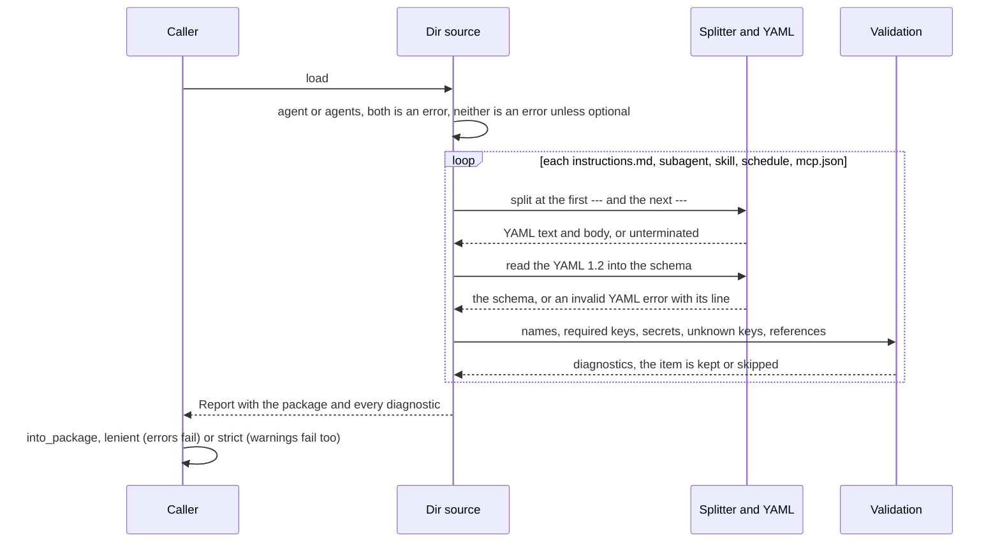

* **Splitter.** The frontmatter exists only when the first line is `---`; the next `---` line closes
  it. An unclosed block is an error, never "no frontmatter". A byte-order mark and CRLF line endings are
  handled, and a file without frontmatter is all body. Bodies are kept with LF endings and trimmed.
* **YAML.** [`serde-saphyr`](https://crates.io/crates/serde-saphyr) 1.3.0, deserialize only, with
  `strict_booleans` so that `no` is a string (YAML 1.2). It has no dynamic value type, so keys the schema
  does not know are read into `serde_json::Value` and become warnings. *Verified 2026-09-29*, crates.io API:
  1.3.0 (2026-09-16), licence `MIT OR Apache-2.0`, `rust-version` 1.89; its new transitive crates
  `granit-parser` 1.3.0 (1.81), `annotate-snippets` 0.12.16 (1.85), `arraydeque` 0.5.1, `encoding_rs_io`
  0.1.8 and `unicode-width` 0.2.2 are all MIT or Apache-2.0, and `cargo deny check` passes with no change to
  `deny.toml`. Directory walking is `std::fs`, so `walkdir` is not a dependency.
* **Agent files.** `AgentFrontmatter` is the one schema for the root agent, a directory subagent and a flat
  subagent: `name`, `description`, `tools` (a list, or a comma string; `*` is every tool), `model` (an alias,
  or `inherit`), `skills` (`all` or a list), `preload_skills`, `limits` (Claude's `maxTurns` is folded into
  `limits.max_turns`), `vars` (scalars, read as text), `card` (root only), `a2a` and `auth` (a remote
  subagent), `metadata`. A subagent needs a `description`. The keys `api_key`, `apiKey`, `token`, `secret`,
  `password` and `base_url` are errors (compared without case, `_` and `-`), and so is a `model` that is a URL.
  Claude Code, Copilot and OpenCode keys that adam does not act on (`color`, `permissionMode`, `target`,
  `user-invocable`, `mcp-servers`, ...) warn "ignored"; any other unknown key warns "unknown".
* **Names.** Agents and subagents match `^[a-z0-9][a-z0-9_-]{0,63}$`. The frontmatter `name` wins when it is
  valid; otherwise the path gives the name (the file name without `.md` or `.agent.md`, the directory, or the
  composition root's default for the root agent) with a warning. Copilot allows capitals in file names and
  display names in `name`, so `Code-Reviewer.agent.md` is lower-cased with a warning and
  `name: Security Reviewer` falls back to the file name. In `agents/<name>/` the directory is the name and
  a different `name:` is an error. Two subagents or skills with one name are an error.
* **Skills.** The Agent Skills rules of the section above. The effective name is always the directory name
  (the file stem of a flat skill). A missing `name` on a directory skill warns. `metadata` values that are not
  strings are kept as their text (skills in the wild put lists there). `resources` lists the other files of a
  skill directory without reading them; symbolic links are followed one step and never entered twice.
* **`mcp.json`.** `mcpServers`, with `type` `stdio` (the default when there is a `command`), `http`,
  `streamable-http` or `sse`. A `url` without `type` is an error, as in Claude Code; `ws` is not supported.
  The server name and each allow-listed tool must fit `<server>__<tool>` in 64 characters. `${VAR}` and
  `${VAR:-default}` stay as written, and `McpConfig::env_references()` lists the names for a build to record.
  A literal credential in a header, an environment value or a URL is a **warning** (as in the plan; a strict
  build refuses it); a server key such as `apiKey` is an **error**.
* **Schedules.** `cron` (five fields, checked for shape and not evaluated), `timezone` (default `UTC`),
  `agent:` (must be the owning agent), and a non-empty body. Schedules belong to the root agent of a
  directory; in a subagent directory they warn "ignored".
* **Other rules.** A prompt over 30,000 characters warns, because GitHub Copilot accepts at most that in an
  agent file (*verified 2026-09-29*, the Copilot custom-agents configuration page cited above). An entry of an
  agent directory that is not a slot (`tools/`, `channels/`, ...) warns and points at `#[tool]`.
  Dotfiles, `*.test.md`, `__tests__/` and `README.md` are never read. Files that are not UTF-8 are errors.

The test suite is the specification: one fixture directory per rule, each producing exactly one diagnostic;
all 75 vendored `.agents/skills/*/SKILL.md` of this repository parse with no error and no warning; a Claude
Code agent and two Copilot agents parse unchanged as subagents; and the splitter never panics on arbitrary
text.

## Build and dev (built: `build.rs` codegen)

Slice S5. `adam_agent_fs::build("agent").emit()` in `build.rs` and `adam::include_agent!()` in the
crate are the default way to ship an agent: the directory is parsed, validated and embedded at
build time, so a mistake stops the build before rustc runs and nothing is parsed at startup. The
same `Dir` source reads the same files at run time (the `dev` feature of slice S10); both produce a
`Package`, and the tests assert that the embedded one equals the one read from the directory.

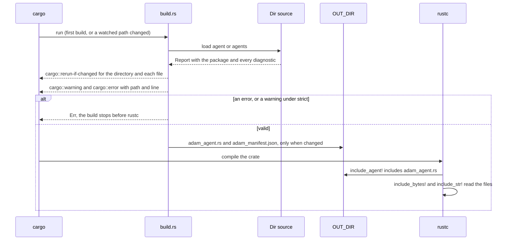

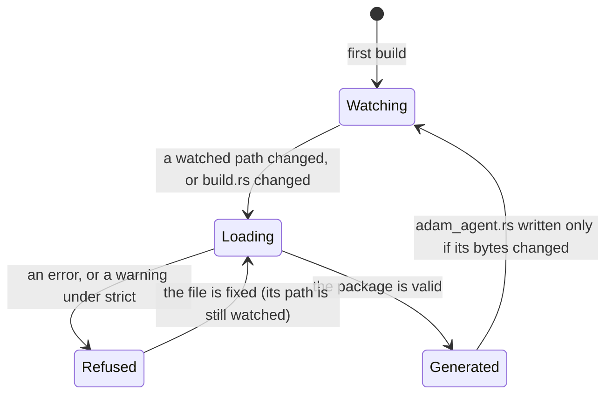

* **Diagnostics are build errors.** Every finding is one line, `cargo::error=path:line: message` (or
  `cargo::warning=` for a warning), with the path relative to the package root. A warning fails the
  build under `.strict()`. `emit()` returns `Err(BuildError)` whose `Debug` is its message. Nothing is
  written for a refused directory, and the watch list is printed anyway so that fixing the file
  rebuilds.
* **Rerun tracking.** `cargo::rerun-if-changed` is printed for the agent directory (cargo scans a
  directory recursively, so a new file is noticed) and for every file and directory in it, ignored
  files included. If the directory does not exist nothing is printed: a path that does not exist makes
  cargo rerun the script on every build, and with no directive cargo's default (rerun when the
  package changes) applies. `OUT_DIR/adam_agent.rs` is rewritten only when its bytes change.
  *Verified 2026-09-29* with cargo 1.94.1 on a scratch build script: a missing `rerun-if-changed` path
  is reported `Dirty ... the file ... is missing` on every build, a new file in a watched directory
  makes the package dirty, and `cargo::error=` fails the build even when the script exits 0.
* **`build("agent")` or `build("agents")`.** The argument names the directory (`agent/` one agent,
  `agents/<name>/` several) and must match the layout found; anything else is an error. Both present
  is the error of the discovery rules, neither is an error unless `.optional()`.
* **The generated file** defines `AGENTS` (a slice of `EmbeddedAgent`, sorted by name), `AGENT` (the
  single agent of an `agent/` package) and `PACKAGE` (an `EmbeddedPackage`). It is `'static` data:
  prompts, skill bodies and schedule prompts are raw string literals (normalised: frontmatter removed,
  LF endings, trimmed); the frontmatter is JSON, read back into the same `AgentFrontmatter`; `mcp.json`
  is `include_str!` of the file and stays unexpanded, so no secret passes through the build; skill
  resources are `include_bytes!`, at most 1 MiB per skill. Every agent, at every depth, carries a
  `digest`: SHA-256 over the JSON of the normalised manifest and the bytes of each resource, the same
  for a directory (`Dir::digest`) and for its embedded copy (`EmbeddedAgent::verify`). The plan's
  `body_offset` (a body's line in its file, for bind-time messages) is not there: slice S6 reports lines
  within the body instead (`prompt line N` of the file it names).
* **Two sources, one type.** `ManifestSource::load()` is implemented by `Dir` and by
  `EmbeddedPackage`, both giving a `Report` and a `Package`; `ManifestSource::read_resource(skill, name)`
  gives the bytes of a bundled file, which a manifest lists without reading (slice S7; it refuses a name the
  skill does not list, so a `..` cannot leave the skill's directory). `adam::agent_fs` is the whole crate
  re-exported by the facade, and generated code refers to it as `::adam::agent_fs` (change it with
  `.crate_path(..)` for a crate that depends on `adam-agent-fs` directly).
* **Versions must match.** The generated code fills the public fields of the `Embedded*` types, so
  the crate that runs `build()` and the crate that runs the binary must be the same version of
  `adam-agent-fs` (they are, when both come from the workspace or from `adam`).

The tests: a golden file of the generated source; a trybuild pass test that compiles and runs the
generated source for a single, a multi-agent and an absent package under `deny(warnings)`; the
`adam-agent-fixture` crate, which has a real `build.rs` and `adam::include_agent!()` and asserts
embedded equals directory; an invalid directory gives `path:line` errors and no file; and
`rerun-if-changed` equals the set of all files. Details are in the
[`adam-agent-fs` README](../crates/adam-agent-fs/README.md#embedding-at-build-time).

## The `#[tool]` contract

Built (slice S2): [`adam-macros`](../crates/adam-macros/README.md) is the macro, and
[`adam`](../crates/adam/README.md) is the facade you depend on.

```rust
use adam::prelude::*;

/// Ask the person who gave you the task a question and wait for the answer.
#[tool]
pub async fn ask_user(
    /// What you need to know
    question: String,
) -> Result<ToolOutput, ToolError> { /* ... */ }

let tools = tools![AskUser, RunChecks];
let agent = LlmAgent::builder("coder", model, alias).state(env.clone()).tools(tools).try_build()?;
```

`#[tool]` keeps the function (so a unit test can call it), and generates a unit struct (`AskUser`,
the function name in `UpperCamelCase`, with the function's visibility) that implements the `Tool` trait
of `adam-llm-agent`.

* **Description and schema:** the doc comment of the function is the tool description (required: a
  tool without one does not compile); the doc comment of each parameter is the property description.
  Lines of one paragraph are joined with a space and a blank line keeps a paragraph break, so the
  hard wrapping of a doc comment does not reach the model; list items, headings, quotes, table rows
  and fenced code keep their lines. The arguments become one struct that derives `Deserialize` and
  `JsonSchema` (schemars 1.x, draft 2020-12, subschemas inlined, no `$schema`, no `title`); the spec
  is computed once per tool (`OnceLock`).
* **Parameter kinds:** `&ToolCtx` (at most one, any position); `State<T>` (shared state, resolved
  with `ToolCtx::require_state`); every other parameter is a field of the arguments struct, and its
  `#[serde(..)]` and `#[schemars(..)]` attributes are copied to the field. `#[args] a: MyArgs` uses an
  existing struct as the whole argument object and must be the only model argument.
* **Return:** `Result<T, E>` or a bare `T`, with `T: IntoToolOutput` and `E: Into<ToolError>`.
* **Options:** `name = "..."`, `type = Ident`, `strict` (`deny_unknown_fields`, which also closes the
  schema), `classify` (the error is `adam_error::Classify`: retryable becomes `ToolError::Transient`,
  the rest `Permanent`), `asks_user` (the tool can end a call with `ToolError::NeedsInput`: the
  generated `Tool::asks_user` says `true`, and `bind` refuses it on a subagent, added in S9) and
  `crate = path` (default `::adam`; `::adam_llm_agent` for a crate that does not use the facade).
  Reserved for later: `approval` (roadmap 5).
* **Bad model input is the model's problem:** a deserialization failure becomes `ToolOutput::error`
  (as `Tool::call` already documents), so the model can correct itself; the function never sees it.
* **State is checked at build:** `Tool::required_state` names the `State<T>` types a tool needs, and
  `LlmAgentBuilder::try_build` fails at startup when one is missing.
* **Journaling is unchanged:** the call runs inside `LlmAgent`'s `tool:CALL_ID` step, so the retry
  rules of the `Tool` docs still apply, and the macro adds nothing non-deterministic.
* **No distributed slices** (`inventory`, `linkme`): `tools![...]` is an explicit list that the
  compiler checks; the agent files name tools, and binding fails at startup on an unknown name.
* **Compile errors** the macro produces itself, each pointing at the offending token: no doc comment,
  not `async`, generic or `impl Trait`, a `self` receiver, a borrowed argument (`&str`), two
  `&ToolCtx`, `#[args]` next to another model argument, a bad tool name, an unknown option, a parameter
  pattern that is not a plain name, and `#[tool]` on something that is not a function. All the mistakes
  of one function are reported in one compile. rustc reports the rest (an argument type without
  `Deserialize` or `JsonSchema`, a return type that is not a tool result) with messages from
  `#[diagnostic::on_unimplemented]`.

What runs when the model calls a generated tool (the code between the journal and your function is
what the macro writes):

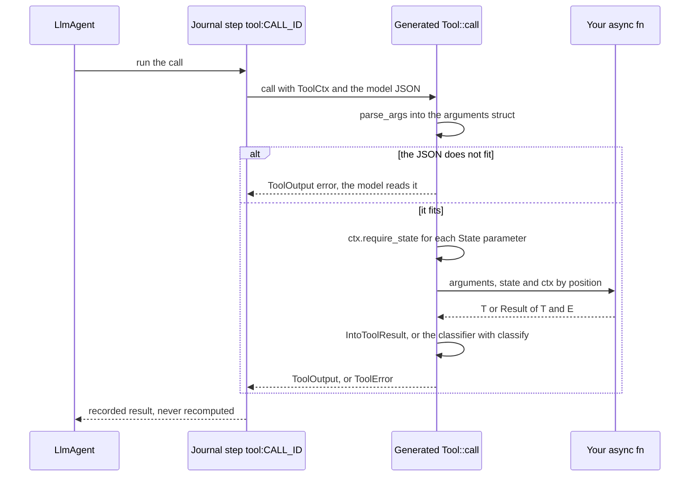

`FnTool` builds a tool at run time (an MCP tool is one). The typed helpers the macro relies on
(`spec_for`, `IntoToolOutput`, `parse_args`, `State<T>`, `ToolSet`) are slice S1 and live in
[`adam-llm-agent`](../crates/adam-llm-agent/README.md); the paths the generated code uses are
re-exported there as `#[doc(hidden)] __private` (feature `schema`) and again by the facade, so that a
crate using `#[tool]` needs no dependency of its own on `serde`, `schemars` or `async-trait` for the
generated code.

## Skills at run time (built: S7, `adam-assembly`)

Skills use progressive disclosure, the three tiers of the Agent Skills client guide (*verified 2026-09-29*,
<https://agentskills.io/client-implementation/adding-skills-support.md>, which recommends a catalog in
the prompt with a behaviour note, a dedicated activation tool whose `name` is an enum, `<skill_content>`
wrapping with the bundled files listed and not read, and no catalog and no tool when there are no
skills). Each agent has its own skills: the ones under its own `skills/`, narrowed by `skills:` (`all`,
the default, or a list in the order it gives) and never inherited from its parent. `bind` builds all of
it, so a mistake is a startup error, and `AgentInfo::prompt`, `tools` and `skills` show what was built.

| Tier | The model sees | Cost |
|---|---|---|
| 1. Catalog | `name` and `description` of each selected skill, in the prompt after the instructions | about 50 to 100 tokens per skill, on every request |
| 2. `load_skill { name }` | the body of `SKILL.md`, frontmatter stripped, in `<skill_content name="...">`, with the bundled files listed in `<skill_resources>` | once, in the tool result; it stays in the conversation |
| 3. `read_skill_file { skill, path }` | one bundled file as text | once per file read |

The catalog is part of the crate's contract and is pinned by a golden file
(`crates/adam-assembly/tests/golden/coder-prompt.txt`): a two-line behaviour note, then an
`<available_skills>` block with one `<skill><name>..</name><description>..</description></skill>` per
skill. A description is collapsed to one line and XML-escaped (`&`, `<`, `>`), so it cannot close a tag;
the body of a skill is not escaped (it is Markdown). `load_skill` has a `name` parameter that is a JSON
Schema **enum** of the skills left to load; `read_skill_file` has a `skill` enum of the skills that
bundle a file. A name outside the enum, an unselected skill and a made-up one get the same refusal, which
lists the available names and suggests the closest.

**`read_skill_file` is a lookup, not a file read.** The path is normalised (a leading `./` is dropped),
refused when it is empty, absolute (`/`, `\`, a drive letter), has a `..` component, a backslash or a
control character, and then looked up **by exact match** in the skill's list of bundled files: there is
no file system access at run time, so a path that is not in the list cannot reach anything. The file must
be UTF-8 without a NUL byte and is returned as it is (an empty file as `(the file is empty)`); a binary
file is refused with its size, because an image or a compiled asset is not something the model can read
as text (scripts and assets are for a sandbox to run, roadmap 7). The bytes come from the binary (an
embedded agent) or were read from the directory once at startup (`AgentDef::from_source`,
`AgentDef::resources_from`), and a skill may bundle at most 1 MiB (`SKILL_RESOURCE_LIMIT`, enforced by the
build script and again when the bytes are loaded), so the bytes a file returns are bounded by that cap.

**`preload_skills:`** puts the whole `<skill_content>` of a skill into the prompt, after the catalog and
under a one-line note, instead of leaving it to `load_skill`. A preloaded skill must be one of the agent's
selected skills. It is out of the catalog and out of the `load_skill` enum, and asking for it anyway says
it is already in the instructions; its files remain readable. When every selected skill is preloaded
there is no `load_skill`, and there is no `read_skill_file` when no selected skill bundles a file. An
agent with no selected skill has neither tool and no catalog.

A registered tool with the name `load_skill` or `read_skill_file` on an agent that has skills is
`Error::ReservedToolName`; `tools:` does not filter the skill tools, `skills: []` turns them off. Both
tools are ordinary `Tool`s, so their results are journaled with the step that ran them: a replay after a
crash returns what the model first saw, even if the skill changed in between.

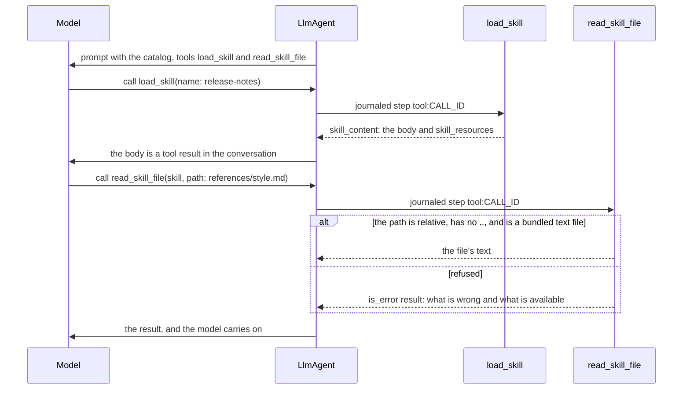

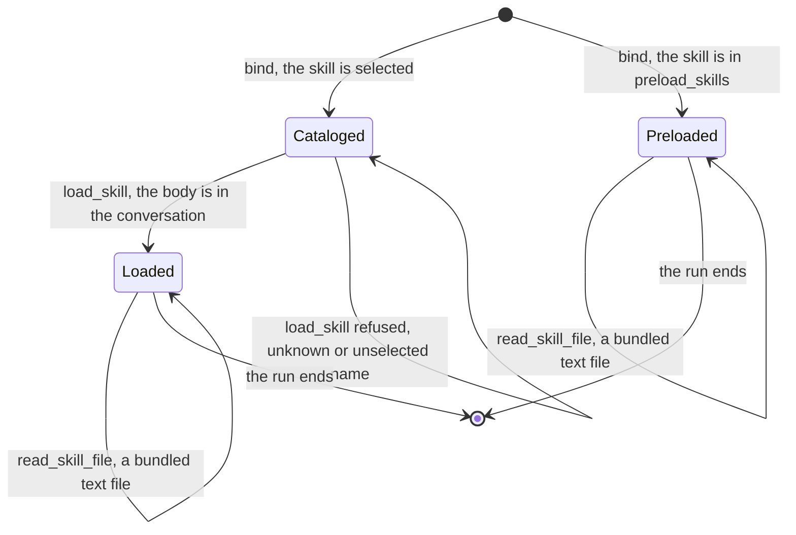

Known limit: an old tool result may be truncated to fit `limits.max_history_tokens`, and a loaded skill
is a tool result like any other (the client guide asks for skill content to be exempt from pruning).
Preloading is the way to keep a skill for the whole run until the loop's history fitting learns to
protect it.

## Subagents at run time (S8 and S9 built)

**Subagents** are child runs. Each local subagent is its own `LlmAgent` registered on the same
`Runtime` as `<root>/<sub>`. The parent sees one tool per subagent (decision D5), with input
`{ message }`. The child never sees the parent's history.

Slice S8 is the child runs in the runtime and in `LlmAgent`; slice S9 is the tool that hands the model a
subagent (`SubagentTool`) and the binding that adds it. The diagrams below are the whole path; the full design
of the runtime half, the failure interleavings and their tests are in [Child runs](architecture.md#child-runs)
in the architecture.

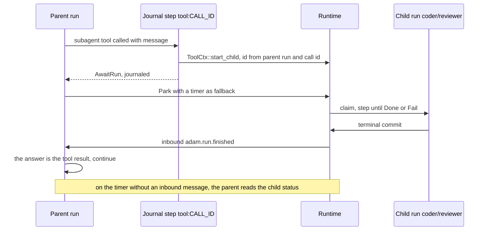

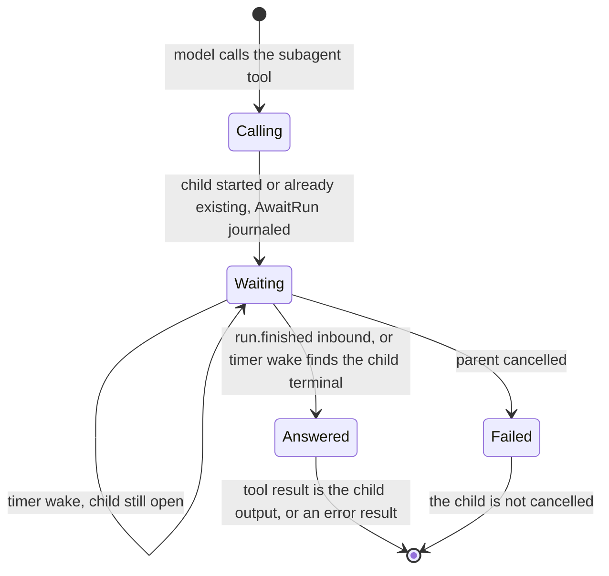

The deterministic child id (`child_run_id(parent run, call id)`) with `start_child` makes the start
idempotent, so the only side effects of the call are that creation and reads. What S8 added:

* `Runtime::start_child(parent, id, agent, input)`: `start_with_id` that records the parent.
* On the terminal commit of a run that has a parent (a step, a cancel, or an unreadable state), the runtime
  delivers `adam.run.finished` (at-least-once; payload `{status, output | error}`; `Inbound::id` is the
  child's run id, so the parent deduplicates). It is sent after the commit, so it can be lost, and the parent
  always waits with a timer.
* `Ctx::child_status(run)`: the fallback read, for the caller's own children only.
* `ToolError::AwaitRun { run }`, a new variant (old journals still decode), and `ToolCtx::child_run_id()`.
* `LlmAgent` records `Conversation::pending_wait` (a `Question` or a `Run`; the field was `pending_question` and
  state stored under that name still loads), parks with `wait_poll` (60 s by default), and turns the child's
  outcome into the tool result: its `output.text`, or an error result if it failed.

The id is a UUID version 8 from a SHA-256 (as the A2A adapter derives task ids), not the UUIDv5 the first
sketch named: no new dependency, and one derivation convention in the workspace.

### The subagent tool (S9)

`AgentDef::bind` gives each agent one [`SubagentTool`](../crates/adam-assembly/README.md#subagents) per local
subagent, after its own tools and its skills' tools, in the order of the manifest. The contract:

* **Name and shape.** The tool is named after the subagent (a name that is already a valid tool name:
  `a-z`, `0-9`, `-`, `_`). Its input is `{ "message": string }`, required, no other property. Its description
  is the subagent's `description` followed by "The agent does not see this conversation; put everything it
  needs in `message`."
* **A call** starts the subagent as a child run of the parent's run, with `message` as its first user message,
  and returns `AwaitRun`. The parent parks; the child's final **text** is the tool result, or an error result
  (`the run failed: ...`) when the child failed, and the parent goes on either way. A missing, non-string or
  blank `message` is an error result and starts nothing.
* **How the tool reaches the runtime.** It does not hold one. `Ctx::child_starter()` gives the step a
  `ChildStarter` (the runtime that steps the run, and the run as the only possible parent), `LlmAgent` puts it
  in each `ToolCtx`, and the tool calls `ToolCtx::start_child(agent, message)`. So there is no handle to attach
  and none to forget, and the child starts on the runtime that steps the parent, in a split deployment too. What
  the runtime needs is the child's agent, registered under `<root>/<sub>` (`Assembly::register` does it; a
  process that steps the parent without knowing the child gets a permanent error result naming the agent).
* **Least privilege.** A subagent's tools are the ones its own `tools:` lists, from the same registered set, and
  none when it lists none. It gets nothing of its parent's, including the parent's subagent tools. A tool the
  parent has and the child does not list is unknown to the child (its model is not offered it, and a call to it
  is answered `unknown tool`).
* **Limits per child.** The child's own `limits:` apply to the child's run: its turns and tool calls are its
  own and do not count against the parent, and a child that goes over fails, which the parent sees as an error
  result.
* **Name clashes are build errors** (`Error::SubagentToolClash`, with the subagent's `Origin`): a subagent
  named like a tool of its parent (registered and selected, or `load_skill`/`read_skill_file` when the parent
  has skills), or like another subagent of the parent. A registered tool the parent does not select is no clash.
* **No asking tools in a subagent.** A subagent runs as a child of another run, so nobody could answer a
  question, and a run that asks parks until someone does. The parent would wait for ever, polling. A tool
  declares that it can ask with `Tool::asks_user()` (`#[tool(asks_user)]`, `FnTool::asking_user()`), and `bind`
  refuses a subagent whose resolved tools include one (`Error::SubagentAsksUser`), also when it got the tool
  through `*` or a pattern. A bind-time refusal was chosen over a deadline on the child because it costs
  nothing at run time, cannot fire in the middle of a run, and tells the author what to change; a deadline
  would only turn "waits for ever" into "fails late". It is a declaration: a tool that returns `NeedsInput`
  without saying so would still park its child, so mark every tool that can.
* **Limits of the design.** The calls of one model turn run one after another, so two subagents called in the
  same turn run one after the other (fan-out needs several pending runs at once and is out of scope). Only the
  child's text travels back: its artifacts stay on the child's run. The child starts with an empty history and
  cannot be continued (a `task_id` is a later question). Cancelling the parent does not cancel the child (a cascade needs
  `Store::children`, see the architecture).

### Remote subagents (`a2a:`, S9b)

A subagent file with `a2a: <agent-card URL>` is not an agent of this assembly: it is a tool on the parent
whose work happens on another A2A agent. It has the **same shape** as a local subagent's tool (input
`{ "message": string }`, the description then the same "The agent does not see this conversation" note, no
questions to the user), is named after the file, is placed among the parent's subagent tools in manifest
order, and goes through the **same name checks** (`Error::SubagentToolClash`). The body of the file, if any,
extends the description. `limits`, `tools`, `model`, `skills` and `vars` mean nothing on it and warn.

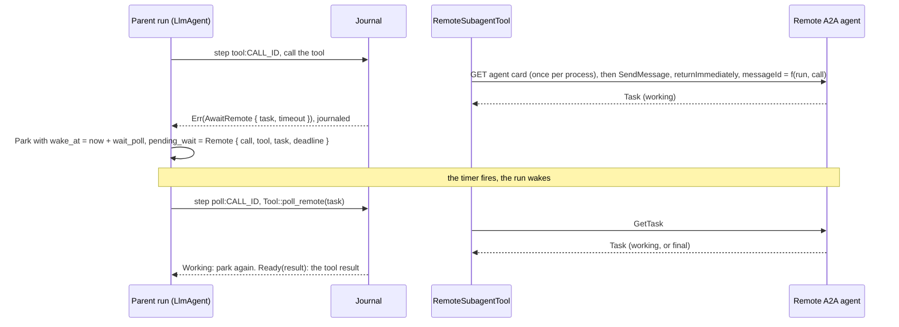

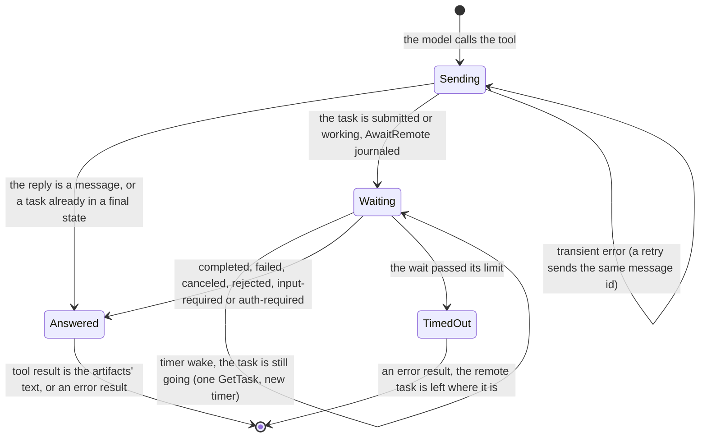

* **The send is journaled and idempotent.** The call is one `Ctx::step` (`tool:<call id>`): a `SendMessage`
  with `configuration.returnImmediately`, whose `messageId` is derived from the parent's run id and the tool
  call id (`adam_runtime::child_run_id`, the same derivation as a local child). A step that ran but was not
  recorded, or a transient retry, sends the same id, and a server that recognises a repeated message id (as
  `adam-a2a-runtime` does) hands back the task its first attempt made instead of starting a second one. Once
  the outcome is recorded the tool is not called again for that call. A server that does **not** dedupe would
  start a second task in that one window (a crash between the response and the journal write); the parent
  waits on the task of the recorded attempt and the extra one is left alone.
* **The wait is the same park as a child run, with no notification.** `ToolError::AwaitRemote { task,
  timeout_ms }` is a new, additive variant; the agent records `PendingWait::Remote { call_id, tool, task,
  deadline }` (untagged by fields like the other waits, so old states load) and parks with the timer of
  `wait_poll`. **Nothing tells the parent the task is over**, so each time the timer fires the agent calls
  `Tool::poll_remote(ctx, task)` (a new trait method, default: refuse) inside a journaled step named
  `poll:<call id>`, and the tool answers `RemotePoll::Working` or `RemotePoll::Ready(result)`. The result of
  every look is recorded, so a replay after a crash makes the same decision and the tool is not asked twice
  for one wake. Streaming (`SendStreamingMessage`, `SubscribeToTask`) is a later refinement that would shorten
  the wait; polling stays as the fallback.
* **How often, and for how long.** Every `wait_poll` (60 s by default; `BoundDef::wait_poll(Duration)` sets it
  for the assembly). Choose it for the remote: a task that takes seconds is noticed up to one interval late.
  The wait ends with an error result after `AgentDef::remote_timeout` (default **one hour**; the remote task is
  not cancelled and its result is lost to that call); the deadline is fixed from the journaled clock when the
  parent parks, so every replay agrees on it. Cancelling the parent does not cancel the remote task either.
* **Terminal states map to the tool result.** `completed`: the text of the artifacts (text parts joined by
  a newline, data parts as JSON, files named and never included, artifacts separated by a blank line), else the
  text of the status message, else "(the remote agent finished without output)"; cut at 64 KiB with a note.
  A `Message` reply (an agent with no tasks) is its text. `failed`, `canceled` and `rejected`: an error result
  with the status message. **`input-required` and `auth-required`: an error result too**, saying the remote needs
  input (or authorization) and that a subagent cannot ask the user, so the task is over and the model should
  call the tool again with a `message` that has everything the agent needs; nobody is placed to answer, and
  parking on it would wait for ever. The remote task is left in that state. `submitted`, `working` and
  `unspecified` are "still going".
* **Failures.** A transport error or a JSON-RPC internal error is `Transient`: the step is retried with
  backoff (and the message id makes the retry safe); if the retries run out the parent's run fails, as for any
  tool. Anything the remote answered on purpose (401, task not found, invalid params) is an error result the
  model sees, and the parent goes on. A card that cannot be fetched or is not valid is one of these too.
* **Auth: `auth: bearer:VAR`.** `bind` reads the environment variable `VAR` (a value given with
  `AgentDef::env(name, value)` wins, so a vault-backed root or a test need not use the environment), trims it,
  and **fails closed**: `Error::RemoteAuth` names the variable and says whether it is missing, empty or not a
  token (printable ASCII, no whitespace) and never shows a value. A remote without `auth:` is called
  without credentials. The token is held as a `secrecy::SecretString`, sent as `Authorization: Bearer <token>`
  on every request to the agent (the card fetch and each call), and is never journaled, logged or put in an
  error message or in `Debug`; there is a test that reads the recorded journal, the run's state and events,
  and a captured trace of the whole run for it. The token goes **only to the origin of the card URL you
  wrote**: an agent card that advertises another host or port for its interface is refused with a message
  saying so (a card is data a remote controls), and redirects are not followed.
* **The URL.** Must be `https`, or `http` to this machine (`localhost`, `*.localhost`, `127.0.0.0/8`, `::1`);
  anything else is `Error::RemoteUrl` at `bind`, unless the deployment calls
  `AgentDef::allow_insecure_remotes(true)` (development only; messages and token would cross the network in
  the clear). A URL with a user name or password is always refused (put the token in `auth:`), and no error or
  log prints one. The card interfaces the client may use follow the same rule.
* **Built once per remote.** `bind` decides everything that is a fact about the files and the deployment (URL,
  token, limits) and stores plain values in the tool. The HTTP client, the card and the transport are made by
  the first call that needs them and kept, so a process that starts offline binds fine and the first call
  reports the network. A reload (S10) binds again and gets new tools, which is how a rotated token or a new URL
  takes effect.
* **What does not travel.** Only text: the remote's artifacts (files, data) are described, not stored on the
  parent's run. A `contextId` is not sent, so every call is a fresh conversation; continuing a remote task
  (`task_id`) is the same open question as for local subagents. Two remote calls in one model turn run one
  after the other, as for local ones.

## Binding (built: `adam-assembly`)

Slice S6. [`adam-assembly`](../crates/adam-assembly/README.md) turns a manifest into `LlmAgent`s. The
embedded manifest (`AgentDef::from_manifest(AGENT)`, where `AGENT` is the `&'static EmbeddedAgent` of
`adam::include_agent!()`) and one read from a directory at run time (`AgentDef::from_source(&Dir::new(..), ..)`)
are the same `AgentManifest`, so they take one code path and the tests assert that they bind to equal
agents.

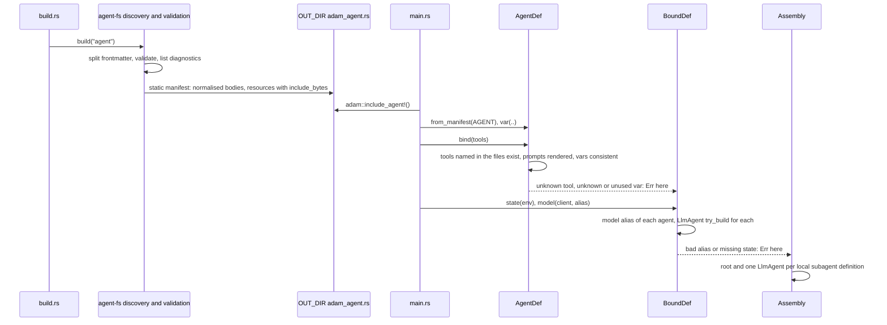

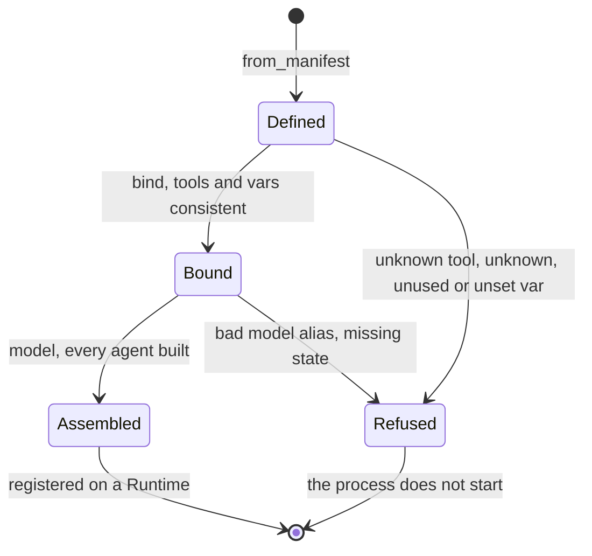

* **Tools.** `tools:` names are checked against the `ToolSet`. An unknown name is
  `Error::UnknownTool` with the closest registered name ("did you mean") and the list of what is
  registered; a `linear__*` pattern must match at least one tool. The root agent with no `tools:` gets
  every registered tool, a subagent with none gets none (D3), `*` is all and `[]` none. Nothing is
  inherited from the parent.
* **Vars.** `{{name}}` is substituted into the body of `instructions.md` and every `instructions/*.md`.
  An unknown placeholder, a var declared and never used, a used var whose default is empty and that the
  code did not supply (`vars:` with `repo:` and nothing after it), a value supplied for an undeclared
  var, and a `{{` that is not a placeholder are all errors at `bind`, with the file and the line of the
  body. `{{{{` writes a literal `{{`. Values come from `AgentDef::var` (root) and `agent_var("a/b", ..)`.
* **Model.** One `DynModel` for every agent. An agent's gateway alias is the `model:` it names, else its
  parent's (`inherit`, the subagent default), else the alias the code passes to `model(..)`.
  `model_aliases([..])` lists what the deployment serves and refuses the rest with a suggestion.
* **State and limits.** `state(Arc<T>)` reaches every agent's tools; a tool whose `required_state` is
  missing fails `model(..)` with the agent's name. The frontmatter `limits` replace the loop's defaults
  key by key.
* **Subagents.** Each local subagent becomes an `LlmAgent` named `<parent>/<name>` with its own prompt,
  tools, alias and limits, and `Assembly::register` registers all of them on the runtime. Its parent gets a
  `SubagentTool` (S9, see [Subagents at run time](#subagents-at-run-time-s8-and-s9-built)); remote subagents
  are also tools of their parent (S9b, see [Remote subagents](#remote-subagents-a2a-s9b)) and are listed as data
  in `Assembly::remotes()`. Skills (S7) and
  subagent tools (S9) are added while `bind` resolves an agent, so the prompt and the tool list
  `BoundDef::build` hands to `LlmAgent` are already final and `AgentInfo::tools` is what the model is
  offered. The MCP tools of S11 join the catalog `tools:` selects from at `bind` too (see
  [MCP tools at run time](#mcp-tools-at-run-time-built-feature-mcp)).
* **The card.** With feature `a2a`, `Assembly::card(url, version)` is the root's `card:` as an
  `adam_a2a::AgentCardConfig`; the public URL and the version belong to the deployment. `AgentDef::card`
  gives the same card before anything is bound, for a process with no model (a control plane).

Deviations from the plan's sketch, on purpose: `AGENT` is already a reference, so the call is
`from_manifest(AGENT)` and not `&AGENT`; the runtime has no `agents(..)` method, so `Assembly::register`
folds `RuntimeBuilder::agent` over the agents; a subagent's prompt lines are counted from its body, since
the manifest keeps no `body_offset`; and `state(..)` comes before `model(..)` because `model(..)` is the
step that builds the agents and finds a missing state.

## MCP tools at run time (built: feature `mcp`)

Slice S11. [`adam-mcp`](../crates/adam-mcp/README.md) is the MCP client (the official Rust SDK, `rmcp`); the
wiring is [`adam-assembly`](../crates/adam-assembly/README.md#mcp-tools-feature-mcp), behind its feature `mcp` (the
facade's `mcp` also gives `adam::mcp`). **Off by default**: a build that does not opt in has no MCP client, cannot
start a process because a file said so, and `bind` still refuses an agent whose `mcp.json` lists servers.

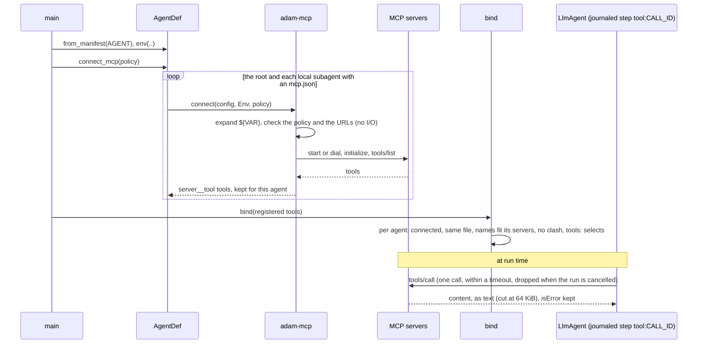

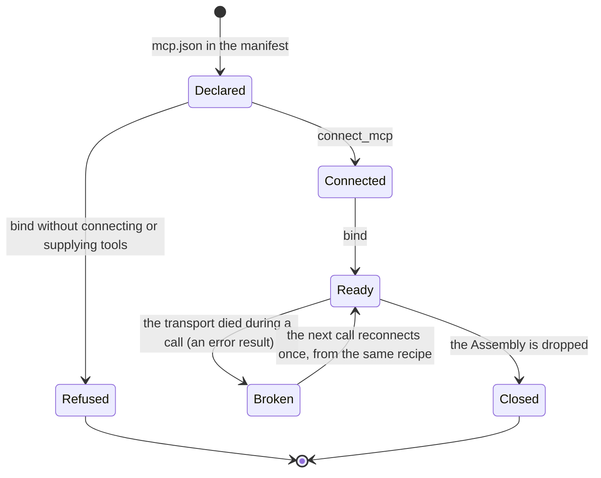

* **Per agent.** An agent's MCP tools come only from the `mcp.json` in its own directory (the root's for the
  root, a subagent directory's for that subagent); they are not added to the shared `ToolSet`. A subagent
  inherits none of them (D3 again), and two directories may each name a server `linear`, connected apart with
  their own headers. `tools:` selects among the registered tools and the agent's own MCP tools (`linear__*`
  works as it always did); a subagent that lists none has none.
* **Fail closed, at startup.** `AgentDef::connect_mcp` finds everything that can be wrong before the first model
  call: a `${VAR}` with no value and no default, `type: sse`, a stdio server the policy does not allow (nothing is
  started), a URL that is plain http to another machine, carries a user name or password, or contains a `${VAR}`
  (unless the deployment opts in), an invalid header, a
  server that is down or refuses the credentials, an allow-list naming a tool the server lacks. `bind` refuses an
  agent with servers and no connection (`McpNotConnected`), tools of a different `mcp.json` (`McpChanged`), a tool
  that belongs to no server of the agent's file (`McpForeignTool`) and a name clash with a registered tool or a
  subagent. `AgentDef::mcp_tools(agent, tools)` is the hook for a client of your own and for tests.
* **Names and text.** Model-facing names are `<server>__<tool>`; without an allow-list, a tool whose name does not
  fit `^[A-Za-z0-9_-]{1,64}$` is skipped with a warning; with one, exactly the listed tools in its order. The
  description is the server's (else its title, else a default), cut at 8 KiB; the parameters are the server's
  schema as it is. Answers are the content blocks as text, scrubbed of expanded values and then cut at 64 KiB;
  images and blobs are described, never included; `isError` is an error result.
* **Durability: at-least-once.** A call runs inside the agent's journaled step, so a replay of a committed call
  returns the recorded result and does not call the server. MCP has no idempotency key, so a transition that fails
  before it commits (a crash, a lost lease, a later tool of the same turn returning `Transient`) calls the server
  again. For that reason **no failure of an MCP call is a `ToolError::Transient`**: a timeout, a lost connection or
  a protocol error is an error result that says the call may or may not have run, and the model decides. The
  tests pin both the committed case and the retried one.
* **Secrets.** `${VAR}` reads `AgentDef::env` first and the process environment second, as
  `auth: bearer:VAR` does. Values are `SecretString`s; every expanded value and the whole expanded text is
  registered (and its percent-encoded, form-encoded and JSON-escaped forms) with a redactor that every message from
  the server, the transport or the SDK, every tool result (text and `isError`) and every line of a child's stderr
  (logged at `debug`) passes through. Nothing secret is in a journal, state, event, `Debug` or error, or in a log
  line of this crate. **Secrets go in `headers`, not in the URL**: the SDK logs the URL it dials in its own log
  lines, which the redactor cannot reach, so a `${VAR}` in a `url` is refused (`Error::UrlSecret`) unless
  `McpPolicy::allow_url_secrets(true)`, and then the `rmcp` log target must be filtered. A secret in a stdio `args`
  is visible to every process of the machine (`/proc/*/cmdline`, `ps`): use `env`. Tool descriptions and answers are text the server
  controls and go into the model's context: the allow-list is the mitigation.
* **Reload.** Connections are made once, at startup, and outlive dev reloads (`LiveBuilder::connect_mcp`, features
  `dev` and `mcp`; a reload is synchronous and may run on the watcher's thread, so it never connects). An edit of
  an `mcp.json` is refused with a message saying to restart: tools are discovered once, and a run in flight may
  have called one.
* **Not in S11:** MCP resources, prompts, sampling, roots and elicitation; OAuth; `type: sse`; `list_changed` and
  re-discovery on a reload; MCP tasks; progress notifications; concurrent connects (servers connect one after the
  other, in name order); exporting adam's tools as an MCP server.

*Verified 2026-09-29* (the `rmcp` 3.5.0 crate, <https://docs.rs/rmcp/3.5.0>, <https://crates.io/api/v1/crates/rmcp>):
`rmcp` 3.5.0 is Apache-2.0 with `rust-version` 1.88; its SSE transport was removed in 0.11.0 (its CHANGELOG, PR #562)
and the specification calls HTTP+SSE deprecated (<https://modelcontextprotocol.io/specification/2025-03-26/basic/transports>).
The crate README lists the facts the code relies on, with the ones found by running the tests.

## Dev reload (built: feature `dev`)

Slice S10. The comparison of the three ways to get an agent into a process, for the record:

| | `build.rs` (default) | function-like proc macro | run-time `Dir` (dev) |
|---|---|---|---|
| Finds new files | yes (`cargo::rerun-if-changed=agent` scans the directory, *verified 2026-09-29*, <https://doc.rust-lang.org/cargo/reference/build-scripts.html>) | no: tracking paths from a proc macro is nightly-only (`proc_macro::tracked`, *verified 2026-09-29*, <https://doc.rust-lang.org/proc_macro/tracked/index.html>) | n/a |
| Errors | file and line, before rustc runs | `compile_error!` at the call site | at startup, and on each reload |
| Cost at startup | none | none | parse |

With the `dev` feature of `adam-assembly` (re-exported by `adam` as `dev`; **off by default**, so a release
binary cannot read prompts from disk unless it opts in, and turning it on logs a warning), a
`LiveAssembly` does what `from_source`, `bind` and `model` do at startup and keeps the recipe (the directory, the
`ToolSet`, the model, and the closures that give `AgentDef` and `BoundDef` their values: `var`, `env`,
`remote_timeout`, `state`, `wait_poll`), so it can do it again. `ADAM_AGENT_DIR` replaces the directory the code
names. It registers one stand-in agent per name with the runtime; each `step` takes the current `Arc<LlmAgent>`
for that name once and makes the whole transition with it. Tool code changes need a rebuild. Runs are durable
in the store, so a restart resumes them (use the Compose Postgres, not the in-memory store).

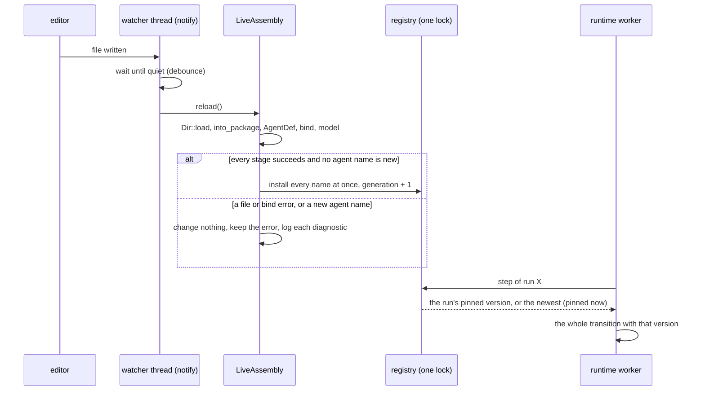

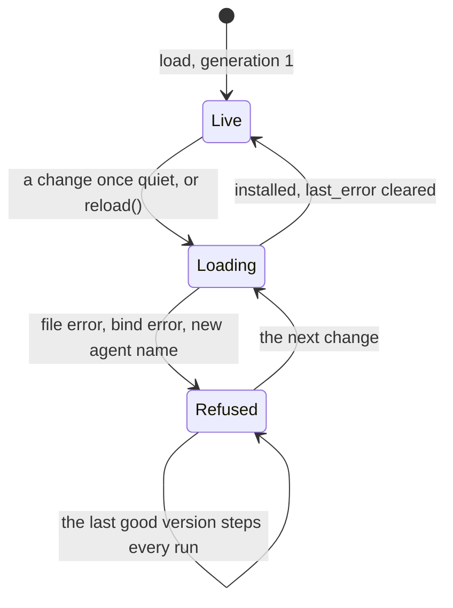

**What a reload changes.** The prompt is not journaled and the model request is rebuilt on every turn, so a
new prompt, limits, model alias, tool description, `{{var}}` value, wait timer, remote timeout or token apply to
every run **at its next step**, never in the middle of one. A re-bind builds new tools, and a remote tool makes
its HTTP client on its first call, so a rotated token or a new URL is what the next call uses. **MCP
connections are the exception**: they are made once, by `LiveBuilder::connect_mcp`, outlive reloads, and an edit of
an `mcp.json` is refused (`McpChanged`, "restart the process"), like an invalid edit: the last good version stays.

**The replay rule.** A run's journal is keyed by step names (`model:3`, `tool:<call id>`), and a replayed
transition (lease lost, stale commit) that finds `tool:c1` where its code now answers "unknown tool" fails with
`NonDeterminism`. So a change to *which tools exist* is the one thing that must not reach a run that has
started. The tool set of an agent is the set of its tools' names, and:

* an unchanged tool set is swapped for everyone;
* a changed one applies to **runs that start after the reload**: a run that has taken a step keeps the newest
  version with the tool set it started with (its prompt edits stop until the tool set goes back, which brings
  it along again), and it ends with its pin;
* a **new agent name** (a new subagent, a renamed root) is refused as a whole, `NeedsRestart`, because the
  runtime registers its agents once, when it is built;
* a **removed** agent stays registered with its last version, for its own runs and for parents still on the old
  tool set: a run never fails because a file went away;
* a **restart is a deploy**: the pins live in memory, and a new process steps every run with the files as they
  are, as a production deploy of new code does.

The alternatives were to refuse a tool-set change while any run is in flight (a parked conversation would
block the developer indefinitely, and the process cannot see a cancelled run) and to swap at transition
boundaries without pinning (which is safe between transitions and unsafe in the one case, a replayed
transition, that matters). An in-flight transition already holds its `Arc`, so the swap cannot tear it.

**An invalid edit** keeps the last good version and logs every diagnostic (file, line, message) and then
`reload refused, keeping the last good version`; `last_error()` exposes it (`ReloadError::diagnostics()` for the
loader's findings, `Load(Error::UnknownTool { .. })` and the other bind errors as they are) until the next good
load. The watcher is `notify` 8 (*verified 2026-09-29*, crates.io: 8.2.0 is the current stable, CC0-1.0, MSRV
1.77) with a debounce of our own, ignoring reads, so a reload does not trigger the next. See the
[crate README](../crates/adam-assembly/README.md#dev-reload-feature-dev) for the API and the tests.

## Crate layout

`adam-macros`, `adam`, `adam-agent-fs`, `adam-assembly`, `adam-mcp` and `adam-mcp-testkit` exist; the others are planned.

| Crate | Kind | Contents |
|---|---|---|
| `adam-macros` | proc-macro | **built (S2)**: `#[tool]`; a thin shim over a pure, unit-tested `expand` function |
| `adam-agent-fs` | lib | **built (S4, S5)**: frontmatter splitter, schemas, discovery, validation with diagnostics, `ManifestSource` with the `Dir` and `EmbeddedPackage` implementations, the digest of a manifest, and the `build.rs` codegen behind the feature `build`. No async, no runtime dependency |
| `adam-assembly` | lib | **built (S6, S7, S9, S9b, S10, S11)**: `AgentDef`: manifest + `ToolSet` + model + state into `LlmAgent`s (root and local subagents); `{{var}}` templating; the skills catalog with `load_skill` and `read_skill_file`; `SubagentTool`, one per local subagent; a tool per remote (A2A) subagent, with bearer auth from the environment; the A2A card behind feature `a2a`; dev reload behind feature `dev` (`LiveAssembly`, `notify`); the tools of each agent's `mcp.json` behind feature `mcp` (`connect_mcp`, `mcp_tools`, the per-agent checks) |
| `adam-mcp` | lib | **built (S11)**: the MCP client over `rmcp` 3.5 (streamable HTTP and stdio, no SSE): `McpServers::connect(&McpConfig, &Env, &McpPolicy)` gives `<server>__<tool>` tools; `${VAR}` expansion, allow-list, redaction, reconnect, fail closed |
| `adam-mcp-testkit` | test kit | **built (S11)**, not published: a scriptable MCP server over stdio (the binary `adam-mcp-test-server`) and streamable HTTP (`TestHttpServer`), and the stdio tests of `adam-mcp` |
| `adam` | facade | **built (S2, S5, S6)**: `prelude`, the macro, feature `macros` (default), `include_agent!`, `adam::agent_fs`, `AgentDef` and its stages, `adam::assembly`, features `a2a`, `dev` and `mcp` (`adam::mcp`) |
| `adam-agent-fixture` | test fixture | **built (S5)**, not published: a `build.rs` plus `include_agent!()` over the `adam-agent-fs` test fixture, and the tests that compare embedded and directory |
| `cargo-adam` | bin | `new`, `check`, `dev` (roadmap 6) |

`ManifestSource` is the seam between where the files come from and what they mean, so that a backend can be swapped
without touching the other: its signature has only manifest types and diagnostics. `Tool` stays
the only tool seam; MCP and `FnTool` implement it. Third-party crates the plan needs (`schemars`, `syn`,
`serde-saphyr`, `rmcp`, `notify`, `trybuild`) are checked against `cargo deny` in the slice that adds
each; S11 added `rmcp` 3.5.0 (Apache-2.0; client features only, `default-features = false`) with `process-wrap`,
`sse-stream`, `pastey`, `nix` and the Windows crates it needs (*verified 2026-09-29*: `cargo deny check` passes); `schemars` 1.2.2 is already in `Cargo.lock`. S2 added `syn` 3, `quote` and `proc-macro2` (all
already locked, through `async-trait`) to `adam-macros`, and `trybuild` 1.0.121 as a dev-dependency of
`adam` (it brings `toml`, `winnow`, `glob`, `termcolor`, `target-tuple`; *verified 2026-09-29*:
`cargo deny check` passes). S4 added `serde-saphyr` 1.3.0 to `adam-agent-fs` (see [Parsing and
validation](#parsing-and-validation-built-adam-agent-fs)).

## Mapping: eve to adam-rs to standard

| eve | adam-rs | Standard or convention |
|---|---|---|
| `agent/`, `agents/<name>/agent/` | `agent/`, `agents/<name>/` | eve (no standard exists) |
| `agent.ts` `defineAgent({ model, limits, ... })` | YAML frontmatter of `instructions.md` | Claude Code and Copilot custom-agent frontmatter |
| `instructions.md`, `instructions/` | same | plain Markdown, as AGENTS.md (no required fields) |
| `tools/<name>.ts` `defineTool` + Zod | `#[tool]` fn in `src/`, schemars, `tools![...]` | JSON Schema 2020-12 parameters (the MCP and OpenAI tool shape) |
| `skills/<name>/SKILL.md`, `skills/<name>.md`, `load_skill` | same, plus `read_skill_file` | **Agent Skills spec** |
| `subagents/<id>/agent.ts` (`description` required) | `subagents/<name>.md`, `<name>.agent.md` or `<name>/instructions.md` | Claude Code subagent file, Copilot custom agent |
| remote agent | `subagents/<name>.md` with `a2a:` | **A2A** agent card |
| built-in `agent` tool | not in v1 | none |
| `connections/*.ts` | `mcp.json` (MCP only) | `mcpServers` (Claude Code, SEP-2633 draft) |
| `channels/` | code: `adam-a2a`; `card:` frontmatter | **A2A** agent card |
| `hooks/*.ts` | `EventSink` in code | none |
| `schedules/*.md` (`cron:`) | same | five-field cron |
| `sandbox.ts` | later (roadmap 7) | none |
| `lib/` | `src/` | Cargo |
| `eve info`, `.eve/compile/*.json` | build errors and warnings, `OUT_DIR/adam_agent.rs`, `cargo adam check` | none |
| `eve dev` | the `dev` feature | none |

A2A card "skills" and Agent Skills are unrelated; they never map implicitly. The **AGENTS.md** file
(<https://agents.md/>, *verified 2026-09-29*) is not used as the agent's prompt, because coding agents
read it as instructions for editing that folder. An agent that works on repositories reads the target
repository's nearest `AGENTS.md` at run time instead.

## Decisions (accepted by the owner, 2026-09-29)

The owner accepted D1 to D6 as recommended, and added one rule: **keep the structure of eve.dev, GitHub
Copilot and Claude Code for agents and subagents.** The layout is eve's; the file format is the Claude
Code / Copilot custom agent; `.agent.md` is accepted and the name is the stem without `.agent`; unknown
Claude or Copilot keys are accepted with a warning.

| | Decision | Rejected alternative |
|---|---|---|
| D1 | Configuration is YAML frontmatter, not `agent.toml`: one schema shared with Claude Code, Copilot, OpenCode and Agent Skills | TOML: Rust-native, but no agent convention |
| D2 | Tools live in `src/` with an explicit `tools![]`, not `agent/tools/*.rs` auto-discovery | included files are invisible to `cargo fmt` |
| D3 | A subagent that omits `tools:` gets none | inherit all: Claude-compatible, surprising for a durable backend |
| D4 | Unknown frontmatter keys and Agent Skills violations warn (`.strict()` opts in to errors); a missing `description` always fails | fail the build on any |
| D5 | One tool per subagent, named after it | a single `delegate { agent, message }` tool |
| D6 | The `dev` feature ships in the facade and is off by default | on by default |

Also confirmed: adam-rs domain types are **closed enums** (no `#[non_exhaustive]` unless an existing
type already sets the pattern).

## Open questions

* Reasoning effort, sampling and compaction: `ModelRequest` has no such fields, so the keys are
  accepted and ignored with a warning.
* Tool approvals (`approval:`) fit roadmap 5; where the policy lives (`#[tool(...)]`, frontmatter or
  both) is open.
* An `evals/` directory; an OpenAPI connection; subagent continuation (`task_id`) and a built-in
  root-copy `agent` tool; exporting a Rust tool as an MCP server; following SEP-2633 to ratification.

## Dogfood: `adam-coder` (S3 and S6b)

`adam-coder` is written with the layer it documents, in two steps, neither of which changed what the
agent does.

**S3, tools.** The seven tools are `#[tool]` functions reading `State<ToolEnv>`; `coder_tools(&env)` is
`tools![..]` wrapped in the `Redacting` layer. `tests/tool_specs.rs` pins each `ToolSpec` against the JSON
of the hand-written tools.

**S6b, prompt, limits and card.** They are one file,
[`bin/adam-coder/agent/instructions.md`](../bin/adam-coder/agent/instructions.md): the frontmatter has the
`name`, `description`, `limits`, `vars.max_check_cycles` (default 3) and the `card:` (name `adam-coder`, one
skill `coding-task`); the body is the system prompt with `{{max_check_cycles}}`. `build.rs` embeds it
(`adam_agent_fs::build("agent").emit()`), the crate includes it (`adam::include_agent!()`), and
`CoderAgent::try_with_tools` is the whole wiring:

```rust
AgentDef::from_manifest(AGENT)?
    .var("max_check_cycles", env.settings.max_check_cycles)   // the process's setting wins over the default
    .bind(tools)?                                             // the seven tools, in the order they are offered
    .state(env)                                               // what the tools read with State<ToolEnv>
    .model(model, alias)?                                     // one client, the gateway alias
```

`CoderAgent` wraps the root `LlmAgent` of that assembly and adds the completion policy (a run with red
checks and no pull request fails; any other stop without one parks as a question). That is the escape hatch in practice: **files for the common case, a Rust
wrapper around the assembled agent for policy**. The A2A card comes from the same file: `Assembly::card` for a
process that has the assembly, `AgentDef::card` (added for this slice) for a control plane, which has no
model or tools and serves the same card.

The proof is in `bin/adam-coder/tests/agent_files.rs` and `src/app.rs`, against goldens captured from the Rust
code before it was deleted (`tests/fixtures/agent/prompt.txt`, `card.json`): the assembled prompt equals the old
prompt for any limit (but for its final newline, which every loaded body loses); the card equals the old
literal; the limits, the tool order, the model request (system prompt, tools, `max_output_tokens`) and the
journal's step names (`model:0`, `tool:<call id>`) are the old ones, so a run journaled by the previous
version replays. The optional next step, moving "discover the repository's real checks" into a skill, changes
what the model does and needs a comparison with a live model; it is not a slice.

## Delivery order

| Slice | What | State |
|---|---|---|
| S0 | this document | this change |
| S1 | typed tool helpers in `adam-llm-agent` (feature `schema` for the schema part) | built |
| S2 | `#[tool]` and the `adam` facade | built |
| S3 | `adam-coder` tools through `#[tool]`, no behaviour change | built |
| S4 | `adam-agent-fs`: parse and validate agent directories | built |
| S5 | `build.rs` codegen and `adam::include_agent!()` | built |
| S6 | `adam-assembly`: `AgentDef`, templating, tool binding, models, the card | built |
| S6b | `adam-coder`: prompt, limits and card from `bin/adam-coder/agent/instructions.md`, no behaviour change (see [Dogfood](#dogfood-adam-coder-s3-and-s6b)) | built |
| S7 | skills at run time: the catalog, `load_skill`, `read_skill_file`, `preload_skills` | built |
| S8 | child runs in the runtime: `start_child`, the finished message, `Ctx::child_status`, `ToolError::AwaitRun`, `pending_wait` | built |
| S9 | subagents: `SubagentTool`, its binding, name-clash and asks-user checks, `ToolCtx::start_child` | built |
| S9b | remote (A2A) subagents: `AwaitRemote`, `PendingWait::Remote`, `Tool::poll_remote`, `auth: bearer:VAR`, the journaled send and the poll on the timer | built |
| S10 | dev reload: feature `dev`, `LiveAssembly`, `reload`, `watch`, the swap at step boundaries, the replay rule | built |
| S11 | `mcp.json` tools: `adam-mcp`, `adam-mcp-testkit`, feature `mcp` of `adam-assembly` and `adam`, `AgentDef::connect_mcp` and `mcp_tools`, `LiveBuilder::connect_mcp` | built |
