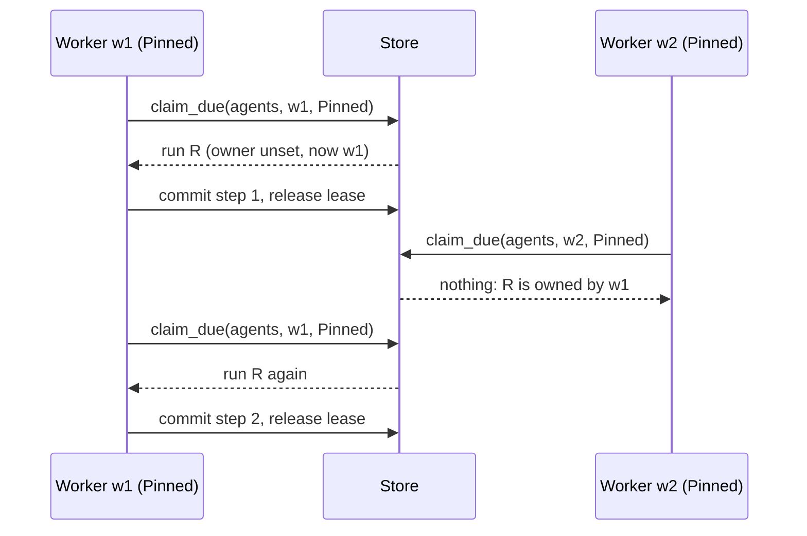
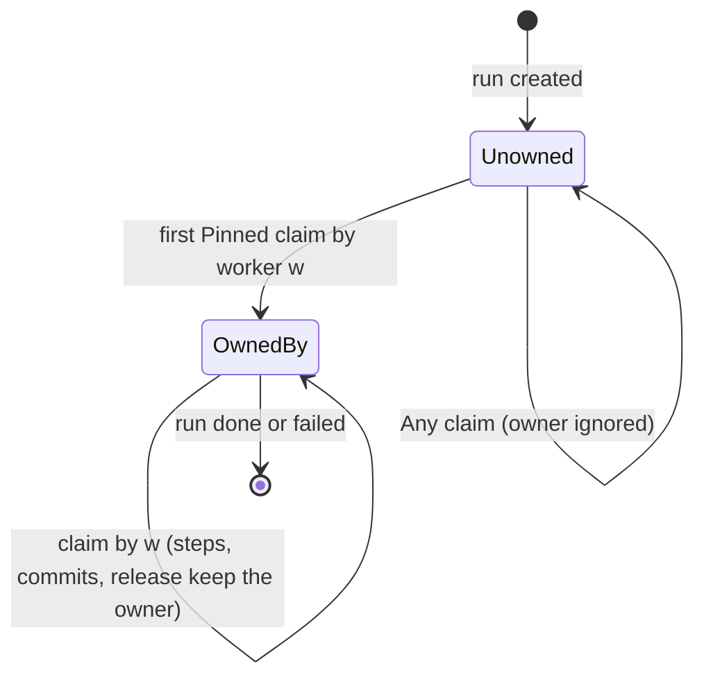

# 0002. Workspace placement as a closed enum

Status: **Accepted** (2026-09-29). Closes the open question of
[ADR 0001](0001-library-first-host-roles.md), decision 10. Adoption of the runs of a lost worker is
not part of this decision (see *Consequences*).

*Status note 2026-09-29: the `coder` Helm chart (0.2.0) sets the placement. `workspace.placement`
(`shared`, `affinity`, `isolated`; `a2a-only` is refused) is passed as `WORKSPACE_PLACEMENT`, and
`WORKER_ID` is the pod name for the pinning placements. `replicaCount` above 1 is allowed once a
placement is set. The decision itself is unchanged.*

## Context

The owner's words, 2026-09-29: "A worker can do the work, it can own a folder, it can have an
isolated pvc, it can use only a2a. The guy doing the deployment will decide."

ADR 0001 decided that the deployer picks the workspace placement, and left the exact enum and the
mechanism open. The reason it cannot stay open is a silent failure that exists today.

**A run moves between workers at every step.** The worker loop commits a run that `Continue`s,
releases its lease, and the next claim may go to any worker
(`crates/adam-runtime/src/worker.rs`, the doc of `run_worker`). The Postgres claim has no owner
filter, and the release clears `lease_owner`
(`crates/adam-store-postgres/src/lib.rs`, `claim_due` and `release_lease`). The worker id is random
per process (`worker-<uuid>`, `crates/adam-runtime/src/runtime.rs`), and `adam-coder` never sets it.
*Verified 2026-09-29: read those files at commit `a1bcb1e`.*

**The coder keeps a worktree per run under a local root.** With two workers on two local disks, a
run can land on a worker that has no worktree for it. The chain, in code:

1. `open_existing` returns `None`, and the tool answers "call prepare_workspace first"
   (`crates/adam-coder/src/tools/mod.rs`, `worktree`).
2. `prepare` clones the repository again (`crates/adam-workspace/src/workspace.rs`).
3. The branch `agent/<short>` is already pushed, so `branch_is_available` says no and `pick_branch`
   takes `agent/<short + 4 characters>`.
4. The run notes lived under `<root>/coder`, on the other disk, and are lost.
5. The pull-request lookup goes by head branch (`crates/adam-coder/src/github.rs`), so it finds
   nothing and opens a **second pull request**.

No error is raised anywhere. The run forks silently. *Verified 2026-09-29: read each function
named above.* Even with one shared volume there is a smaller gap: the lock that serialises work on
a repository's mirror is in-process only (`Workspaces::lock_for`), so two worker processes can run
`git fetch` on one mirror at the same time and fail with "could not lock".

## Decision

1. **`Placement` is a closed enum in `adam-host`**, beside `Role`, with no `#[non_exhaustive]` for
   the reason of ADR 0001 decision 3: a new placement must be a compile error in every host that
   matches on it.

   | Placement | Meaning | Runs pinned to a worker | Needs a workspace |
   |---|---|---|---|
   | `shared` (default) | one volume, mounted by every worker (RWX); any worker may resume any run | no | yes |
   | `affinity` | a run is stepped only by the worker that first claimed it; each worker owns a folder `<root>/<worker id>` | yes | yes |
   | `isolated` | as `affinity`, and the worker's root is a volume of its own (a PVC per worker), used as it is | yes | yes |
   | `a2a-only` | the host has no filesystem work, its agents only call remote agents | no | no |

   `Placement::pins_runs()` is true for `affinity` and `isolated`. `Placement::needs_workspace()`
   is false only for `a2a-only`. The name is the deployer's word; the host reads it from its own
   variable (`adam-coder`: `WORKSPACE_PLACEMENT`).
2. **The store learns to pin.** `Store::claim_due` takes a closed `ClaimScope`:
   * `Any`: what it did before. The owner is neither read nor written.
   * `Pinned`: a run is claimable only if it has no owner or its owner is this worker, and the
     first claim sets the owner. Releasing a lease leaves the owner alone, so the run comes back
     to the same worker.

   The owner is a column (`runs.owner`, Postgres) or a field (`owner`, MongoDB, a missing field
   counts as none), not a part of the run state, because the pure state machine never sees it.
   Postgres schema version goes to 2 (`ALTER TABLE .. ADD COLUMN IF NOT EXISTS owner TEXT`, then
   the version row is raised); MongoDB needs no migration for a missing field, and its version
   number goes to 2 as well so both stores say the same.
3. **The runtime chooses the scope.** `RuntimeBuilder::claim_scope(ClaimScope)`, default `Any`.
   `adam-core` and `adam-runtime` do not depend on `adam-host`; the host maps
   `Placement::pins_runs()` to `ClaimScope::Pinned` itself. A pinned worker needs a **stable**
   worker id (a StatefulSet pod name), or the owner it set is never seen again.
4. **The mirror lock crosses processes.** Under the in-process async lock, `adam-workspace` takes
   an exclusive advisory lock on `<mirror>.lock` with `std::fs::File::lock` (`flock(2)` on Linux),
   through `spawn_blocking`. It makes a shared root safe for many worker processes. The lock file
   sits next to the mirror, never inside it, and it is released when the file is closed, so a
   crashed process frees it.
   *Verified 2026-09-29: `File::lock` and `TryLockError` are stable since Rust 1.89; a test
   program built with 1.94.1 showed that a second handle to the same file, in the same process,
   gets `WouldBlock` from `try_lock` and succeeds after `unlock`.*
5. **`adam-coder` reads two variables.** `WORKSPACE_PLACEMENT` (default `shared`) and `WORKER_ID`.
   A pinning placement without `WORKER_ID` is a configuration error (exit 78) that names the
   variable, because a random id would silently strand every run at the next restart.
   `a2a-only` is also a configuration error for the worker roles of `adam-coder`, whose tools all
   need a workspace. `affinity` joins `<worker id>` under `WORKSPACE_ROOT`; `isolated` and
   `shared` use `WORKSPACE_ROOT` as it is.

## Consequences

* **A pinned run whose owner is gone is stranded.** If the worker that owns a run never comes back
  (a scaled-in pod, a deleted PVC), no other worker claims it, and nothing reports it, because a
  cheap check does not exist: a claim cannot tell "owner is busy" from "owner is gone". This is a
  known limitation of this decision. Adoption (a way to move a run to another owner, with its
  workspace) is future work. Until then a deployer who uses `affinity` or `isolated` keeps worker
  ids stable and does not scale the workers in.
* **Isolated storage loses the workspace with the volume,** and with it the pinned runs. That is
  the price of the placement, and it is the deployer's choice.
* **flock on network volumes is unverified.** The mirror lock relies on `flock(2)` being honoured
  by the volume. *Unverified 2026-09-29* for NFS and for Longhorn RWX; the deployer who picks
  `shared` on such a volume should test two workers against one repository before relying on it.
* **`a2a-only` exists for other hosts.** `adam-coder` rejects it. A host whose agents only call
  remote agents, such as the `another-agentic-system` orchestrator, uses the same vocabulary and
  needs no workspace at all.
* **`Store::claim_due` changes signature** (a breaking change for anyone who implements `Store`).
  The testkit gets conformance cases so a third-party store proves the pinning.
* `Placement` and `ClaimScope` are two closed enums that deployments and hosts depend on. Adding
  a variant is a breaking change on purpose.

## Alternatives considered

* **A worker id derived from the host name, with no configuration.** A pod that restarts under a
  new name would strand its runs with no error. Rejected: the deployer must say the id is stable.
* **Pin inside the run state.** The pure `transition` would have to know about workers. Rejected
  (ADR 0001 keeps the core pure).
* **Keep runs on one worker with a bare lease that never expires.** It breaks crash recovery, the
  reason leases exist. Rejected.
* **Make the run workspace-independent** (push the worktree state on every step). It costs a
  commit and a push per step and loses the run notes anyway. Rejected as a default; a
  `Shared` volume already covers the case.
* **`#[non_exhaustive]` on `Placement` or `ClaimScope`.** Rejected for the reason of ADR 0001.
