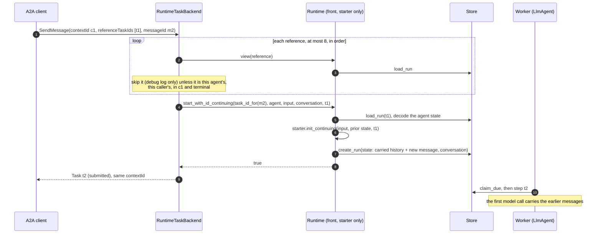
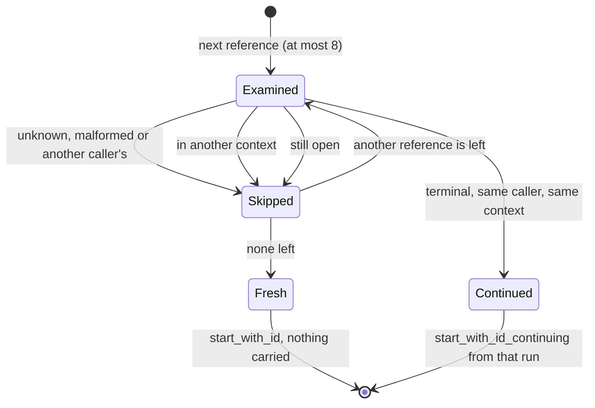

# 0003. A new task continues the conversation of the task it references

Status: **Accepted** (2026-09-30). Built in two steps: the runtime and `LlmAgent` (`init_continuing`,
the carry cap), then `adam-a2a-runtime` (choosing the run from `referenceTaskIds`). What the coder
agent does with a carried conversation (which repositories a task named, reusing a pushed branch) is
a later change, see *Consequences*.

## Context

A host such as the `another-agentic-system` orchestrator drives the coder over A2A. Every rework,
follow-up and new job it sends is a **new** A2A task in the **same `contextId`** as the one before:
a task that has finished accepts nothing more, and the context is what ties the tasks together.

**Today the agent forgets.** The runtime keys a conversation by `<subject>:<contextId>` and allows at
most one open run per conversation. A new task after the previous one finished is a new run, and
`LlmAgent::init` gives it `Conversation::new(text)`: the history of the earlier task is not in it.
The owner saw this in the first live run (reported 2026-09-30, the transcript is not in this
repository): the coder answered that "the task text itself was never carried into this session", then
invented a repository. *Verified 2026-09-30: read `crates/adam-a2a-runtime/src/backend.rs`
(`start_or_join`) and `crates/adam-llm-agent/src/agent.rs` (`start_conversation`) at commit
`416d71e`.*

**A2A already says how a client names what a new task builds on.**

* The A2A topic "Life of a Task" says that refining the output of an earlier task "is modeled by
  starting another interaction using the same contextId as the original task", and that "clients
  further hint the agent by providing references to the original task using `referenceTaskIds` in
  the Message object". *Verified 2026-09-30: fetched
  <https://a2a-protocol.org/latest/topics/life-of-a-task/>, section "Task Refinements".*
* The pinned SDK has the field: `a2a::Message::reference_task_ids: Option<Vec<TaskId>>`
  (`TaskId` is `String`). *Verified 2026-09-30: `a2a-lf` 0.3.1, `src/types.rs` line 340.*

The field is standard, optional and only a hint, so an agent may ignore it and a client may leave it
out: this is not one of ADR 0001's host extensions and needs no capability detection.

## Decision

1. **The runtime can start a run that continues another.** `Agent` and `AgentStarter` gain
   `init_continuing(&self, input, prior: &State, prior_run: RunId) -> Result<State, AgentError>`,
   whose default is `self.init(input)`, so nothing changes for an agent that does not override it.
   `Runtime::start_with_id_continuing(run, agent, input, conversation, prior)` and
   `Runtime::start_continuing(agent, input, conversation, prior)` (the counterpart of `start`) read the
   prior run's last committed state with `Store::load_run`, which every store already has, so no new
   store method and no new conformance case are needed. They work on a runtime that registered only
   the agent's starter, which is all an A2A front process holds.
   * The runtime checks that the prior run exists (`NotFound`) and is a run of the same agent
     (`Invalid`), so that its state is this agent's. It does **not** check who may continue it: the
     runtime has no owners. The caller does.
   * A prior state that does not decode as the agent's state is not an error: the run starts as
     `init` says, and a warning logs the kind of decoding failure (never its text, which can quote the
     conversation).
   * `AgentStarter::State` now needs `DeserializeOwned`, as `Agent::State` always did, because the
     starter has to read the prior state. The starter's state had to be the agent's state already.
   * `prior_run` is a parameter because the state records which run it carries on
     (`Conversation::continued_from`); an agent that does not care ignores it.
   * `start_with_id_continuing` is idempotent like `start_with_id`, including after the prior run was
     purged: a repeat that finds its own run answers `false`.
2. **`LlmAgent` and `LlmStarter` continue a conversation the same way** (`Conversation::continued`,
   shared by both, so a front and a worker cannot disagree):
   * *carried:* the history, and the user messages that were waiting behind an owed tool result
     (`deferred`), in the order they arrived, then the new user message;
   * *dropped:* a last assistant message whose tool calls did not all get a result, with the results
     that did arrive. A run that ended mid-turn (a limit, a cancel, a question nobody answered)
     leaves one, and a provider rejects a call without a result. `pending_calls` and `pending_wait`
     are therefore always empty in a continued conversation, so it never answers a question or a child
     run of the run before. The side effects of the dropped calls are not undone: the model can look
     at the world again with its tools;
   * *reset:* `turns`, `tool_calls`, `usage` (`Limits` are per run, and this is a new run) and
     `artifacts` (the final output lists what this run produced);
   * *recorded:* `continued_from: Option<RunId>`, not written while `None`, so stored state and old
     readers are unaffected;
   * *bounded:* see the next decision.
3. **The carried history is capped at 256 KiB of JSON** (`MAX_CARRIED_BYTES`). Over it, the oldest
   **whole turns** are dropped and one marker message stands in for them. A turn is a user message
   and everything up to the next user message, so no tool call loses its result and no half turn is
   kept. The newest prior turn is never dropped, even when it alone is larger: one run's own limits
   bound it, and the next continuation drops it. The marker is a *user* message whose text begins
   with `OMITTED_MARKER_PREFIX` (`[earlier conversation omitted`), because a conversation cannot
   start with an assistant message, and so that a rule that reads what the user said can skip it.
   Why a cap: each continuation copies the history into the new run's state, one JSON value in the
   store that each model call reads again, so without a bound every task in a long-lived context
   would store and send everything said before. Why this size: it is about what
   `Limits::max_history_tokens` (100 000 tokens, estimated as 4 characters each) lets through to the
   model, so the cap removes history that would be cut anyway. `fit_history` is untouched and still
   shortens old tool output in what is sent.
4. **`RuntimeTaskBackend` picks the run to continue from `referenceTaskIds`.** On a new task (a
   message without a `taskId`) it looks at the first `MAX_REFERENCES` (8) references, in order, and
   takes the **first** that is all of: a task of this agent owned by the caller (the rule of `get`,
   `cancel` and `subscribe`: the caller's subject is part of the run's conversation id); in the **same
   context** as the new task; and **terminal** (`completed`, `failed` or `canceled`; `rejected`, the
   fourth terminal A2A state, is never produced here). It starts the new run with
   `start_with_id_continuing`. A reference that is unknown, malformed, someone else's, another
   context's or still open is skipped with a debug log. The client gets what it would for an id that
   never existed, a fresh task, so a reference reveals nothing about other callers' tasks. A message
   without a `contextId` gets a context of its own, so it continues nothing.
   * An **open** referenced task (`working`, `input-required`) is not continued: a message for the
     context goes to its open task as it always did (one open run per conversation), reference or not.
   * **No reference, no continuation.** The backend never guesses "the latest task of the context".
   * `task_id_for` does not depend on the references, so repeating a request (same `messageId`) is
     idempotent as before, continuing or not.

## Consequences

* **A wrapper agent must forward `init_continuing`.** The default is `init`, so an agent that wraps
  an `LlmAgent` and delegates `init` to it silently stops the continuation unless it delegates
  `init_continuing` too. `adam-assembly`'s dev-reload `LiveAgent` does. **`CoderAgent` and
  `CoderStarter` in `adam-coder` do not yet:** until the coder change that follows, a coder task
  that references another starts fresh, exactly as today. Nothing breaks, and nothing is carried.
* **Only user messages say what the person asked.** The carried history holds the model's own words
  and tool output. A policy that decides from "what the user said" (the coder refuses a repository the
  task never named) must read user-role messages only, skip the omission marker, and be aware that a
  host may quote untrusted text in a user message (the orchestrator quotes check findings inside a
  fenced block). That rule belongs to the coder change, and the coupling is documented in both
  repositories.
* **A worktree is per run, so a continued run gets a new one.** What the model remembers of the old
  one (branch names, files) may not exist in it. Reusing a pushed branch is the coder change.
* **Cost.** A continued task stores and sends the carried history, bounded by the cap and, for the
  model, by `max_history_tokens`. There is no summarising compaction: that needs a model call and
  loses detail, and is not needed for the bound.
* **A referenced task that was purged reads as unknown**: the new task starts fresh.
* **Consecutive user messages.** A continued history can hold two user messages in a row (the dropped
  call's turn, the marker, a deferred message). The loop already sends that when several messages
  arrive together. *Unverified 2026-09-30:* that every OpenAI-compatible provider accepts it; the tests
  use `MockModel`.
* **The orchestrator must send the field.** It is a hint, so an orchestrator that does not send it
  loses nothing it has today.

## Alternatives considered

* **The client re-sends the earlier conversation as a message part.** Rejected. Text the agent wrote
  would arrive inside a user-role message, which defeats every rule that looks at what the user said
  (the coder's repository check). It is sent again with every task, it has no tool calls or results,
  so the model cannot see what it did, and it puts the burden of keeping a transcript on every client.
* **Continue "the latest run of the context" without a reference.** Rejected. It needs a new store
  query, and an index, on every `Store`, and it silently gives the history to every client that
  reuses a `contextId`, including one that wants a fresh start. An explicit reference fails closed:
  a client that says nothing gets nothing. An opt-in fallback can be added later without changing
  this decision.
* **Reopen the finished run.** Rejected. A2A says that "once a task reaches a terminal state
  (completed, canceled, rejected, or failed), it cannot restart" and that a refinement "must initiate
  a new task within the same contextId" (section "Task Immutability" of the topic above, *verified
  2026-09-30*). The runtime refuses input to a finished run (`Finished`) too, and the run's journal and
  limits belong to it.
* **A lineage column on the run record.** Rejected: a schema change for every store to record what the
  agent's own state can say (`continued_from`).
* **Cap by tokens, or summarise the dropped turns.** Rejected for now: a token cap needs a tokenizer
  the framework does not have, and a summary needs a model call inside `init`, which must be pure.
  Dropping whole turns is checkable, cheap and never leaves a tool call without its result.
* **Take the prior state in the erased layer only, without changing the traits.** Rejected: only the
  agent knows what of its state to carry and what to reset.

## Verified and unverified

*Verified 2026-09-30:* the A2A text and the SDK field quoted above; the code read at commit `416d71e`;
the behaviour of every decision, by tests that run in CI: `adam-runtime` (`tests/runtime.rs`, per store),
`adam-llm-agent` (`src/conversation.rs`, `tests/llm_agent.rs`), `adam-a2a-runtime` (`tests/backend.rs`,
including PostgreSQL across a restart and a real `LlmAgent` behind the backend) and `adam-assembly`
(`tests/dev.rs`). Executed on 2026-09-30 against the in-memory store and PostgreSQL 16.13; the MongoDB
variants of the `adam-runtime` cases use the same store calls and run in CI only (no MongoDB was at hand).

*Unverified:* that a live provider accepts the histories described above; how the orchestrator fills
`referenceTaskIds` (that is its repository's change, recorded there).
