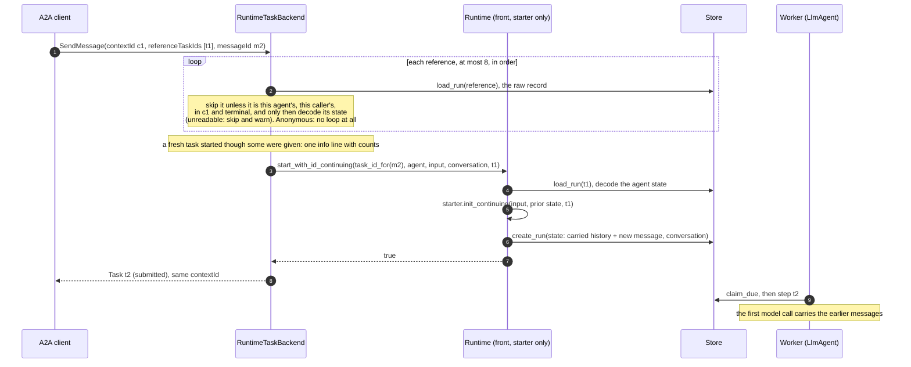
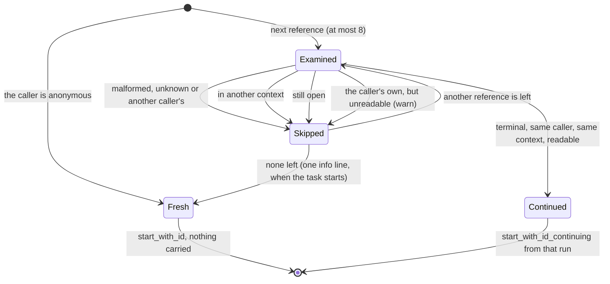
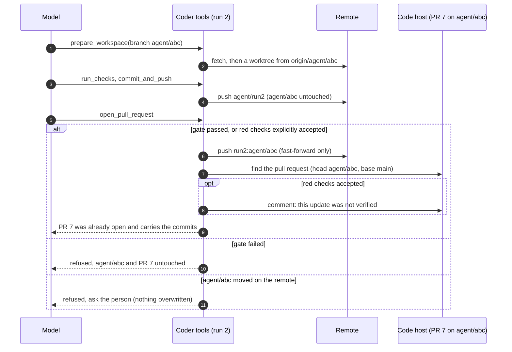
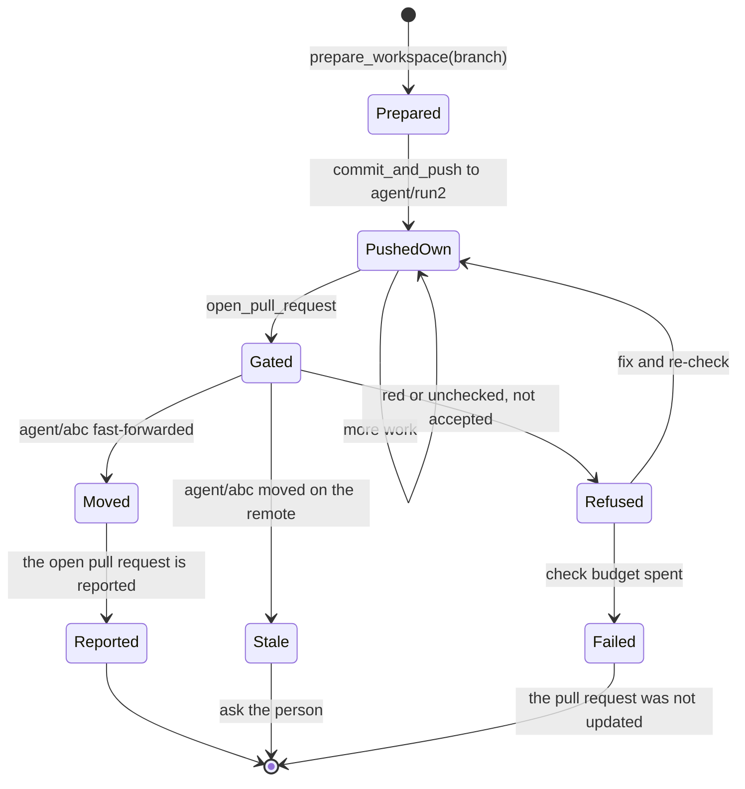

# 0003. A new task continues the conversation of the task it references

Status: **Accepted** (2026-09-30). Built in two steps: the runtime and `LlmAgent` (`init_continuing`,
the carry cap), then `adam-a2a-runtime` (choosing the run from `referenceTaskIds`). What the coder
agent does with a carried conversation (which repositories a task named, reusing a pushed branch) is
slice 11 of the same branch, built; see *Consequences*.

*Amended 2026-09-30, after review, before the first release:* decision 3 (the cap gave up the task
itself in a long chain: tool output is now shortened first and the first user message is never
dropped), decision 2 (the roles of a continued history alternate), decision 4 (a reference is judged
from the raw record before anything is decoded, an unreadable one is skipped, the anonymous caller
continues nothing, what the operator sees) and decision 1 (a repeat is recognised before the prior is
read; a wrong-agent prior has its own error).

*Amended 2026-09-30, second review (cap and wire):* the cap now shortens the tool outputs of the
newest prior turn last, after old turns have been dropped (it used to shorten them first, which cost
the turn the next message follows up on before any old turn was touched); the first message is reduced
to its task before a marker is added, so the marker is always its second part (a first message of
`[task, next]` with nothing omitted used to put the marker third, where the real marker counted as the
person's text, a lookalike part was skipped, and the next continuation stacked a second marker or cut
the user's own part); text-only content with several parts goes to the model as one string; the
operator's `info` line about references that continued nothing is said once per request, for the
outcome it really had (it was said on every pick, and for messages delivered to an open task, where a
reference means nothing).

*Amended 2026-09-30, third review (continuation hardening):* `prepare_workspace` asks the remote for the
default branch only after the named-repository check; a continued branch's base is recorded and
inherited and its pull request is found by head alone; a comment that cannot be posted no longer makes
the verdict say the pull request was not updated (`RunNotes::published`), and is posted once per pushed
commit; the commands that carry the token name the repository's URL and not `origin`, and
`core.fsmonitor` is pinned off.

*Amended 2026-09-30, fourth review (credentialed calls):* `url.*.insteadOf` rewrites command-line URLs
too, so naming the URL was not enough: before every command that carries a token the workspace removes
from the shared mirror's configuration every key that could redirect or reconfigure it, under the mirror
lock, and `GIT_CONFIG_GLOBAL` is `/dev/null`; `run_command`'s snapshot no longer compares refs and
configuration that other runs write (tags, `refs/stash`, other runs' `agent/*` keys), holds the mirror
lock to restore, and is documented as a guard against accidents; the advice to install a project's own
dependencies goes through `delegate_to_opencode` only, and the second report of the same missing tool asks
the person.

*Amended 2026-09-30, second review (branch continuation):* a continued branch is reached only
through the checks gate. The first version pushed a continuing run's commits straight to the
branch that already had a pull request, so a rework whose checks never went green left unverified
commits in a pull request that carried the first task's verification text, and the verdict said
that no pull request had been opened. Now `commit_and_push` pushes to the run's own branch, and
`open_pull_request` moves the continued branch after its gate (see *Consequences*, "A worktree is
per run" and the diagrams there). The pushed-branch evidence is structured state written by the tool
(run notes), not text read back from the history.

*Amended 2026-10-02 (a cancel stops the model call; owed calls are answered):* decision 2's *dropped* bullet
is replaced. A last assistant message whose tool calls did not all get a result is no longer dropped with the results
that did arrive. It is kept, and each owed call is answered with an error result, "Stopped by the person"
(`STOPPED_BY_THE_PERSON`), after the results that did arrive, so the model keeps what it asked for and a provider
still never sees a call without a result. `pending_calls` and `pending_wait` stay empty. The conversation cannot tell
a cancel from another ending (the agent state is not touched by a cancel), so a run that ended in a limit or a failure
gets the same text. This goes with the cancel work: the model call is dropped when the run is cancelled
(`adam-llm-agent`, `Cancel`), so a cancelled run is the common predecessor of a continuation.

## Context

A host such as the `another-agentic-system` orchestrator drives the coder over A2A. Every rework,
follow-up and new job it sends is a **new** A2A task in the **same `contextId`** as the one before:
a task that has finished accepts nothing more, and the context is what ties the tasks together.

**Today the agent forgets.** The runtime keys a conversation by `<subject>:<contextId>` and allows at
most one open run per conversation. A new task after the previous one finished is a new run, and
`LlmAgent::init` gives it `Conversation::new(text)`: the history of the earlier task is not in it.
The owner saw this in the first live run (reported 2026-09-30, the transcript is not in this
repository): the coder answered that "the task text itself was never carried into this session", then
invented a repository. *Verified 2026-09-30: read `crates/adam-a2a-runtime/src/backend.rs`
(`start_or_join`) and `crates/adam-llm-agent/src/agent.rs` (`start_conversation`) at commit
`416d71e`.*

**A2A already says how a client names what a new task builds on.**

* The A2A topic "Life of a Task" says that refining the output of an earlier task "is modeled by
  starting another interaction using the same contextId as the original task", and that "clients
  further hint the agent by providing references to the original task using `referenceTaskIds` in
  the Message object". *Verified 2026-09-30: fetched
  <https://a2a-protocol.org/latest/topics/life-of-a-task/>, section "Task Refinements".*
* The pinned SDK has the field: `a2a::Message::reference_task_ids: Option<Vec<TaskId>>`
  (`TaskId` is `String`). *Verified 2026-09-30: `a2a-lf` 0.3.1, `src/types.rs` line 340.*

The field is standard, optional and only a hint, so an agent may ignore it and a client may leave it
out: this is not one of ADR 0001's host extensions and needs no capability detection.

## Decision

1. **The runtime can start a run that continues another.** `Agent` and `AgentStarter` gain
   `init_continuing(&self, input, prior: &State, prior_run: RunId) -> Result<State, AgentError>`,
   whose default is `self.init(input)`, so nothing changes for an agent that does not override it.
   `Runtime::start_with_id_continuing(run, agent, input, conversation, prior)` and
   `Runtime::start_continuing(agent, input, conversation, prior)` (the counterpart of `start`) read the
   prior run's last committed state with `Store::load_run`, which every store already has, so no new
   store method and no new conformance case are needed. They work on a runtime that registered only
   the agent's starter, which is all an A2A front process holds.
   * The runtime checks that the prior run exists (`NotFound`) and is a run of the same agent
     (`RuntimeError::WrongAgent`, class `Invalid`, whose text names the run and is never shown to an
     A2A client), so that its state is this agent's. It does **not** check who may continue it: the
     runtime has no owners. The caller does.
   * A prior state that does not decode as the agent's state is not an error: the run starts as
     `init` says, and a warning logs the kind of decoding failure (never its text, which can quote the
     conversation).
   * `AgentStarter::State` now needs `DeserializeOwned`, as `Agent::State` always did, because the
     starter has to read the prior state. The starter's state had to be the agent's state already.
   * `prior_run` is a parameter because the state records which run it carries on
     (`Conversation::continued_from`); an agent that does not care ignores it.
   * `start_with_id_continuing` is idempotent like `start_with_id`: it looks for a run under `run_id`
     first and answers `false` if there is one, before the prior is read or `init_continuing` runs, so
     a repeat works after the prior was purged (or, for that matter, was wrong).
2. **`LlmAgent` and `LlmStarter` continue a conversation the same way** (`Conversation::continued`,
   shared by both, so a front and a worker cannot disagree):
   * *carried:* the history, and the user messages that were waiting behind an owed tool result
     (`deferred`), in the order they arrived, then the new user message;
   * *answered* (amended 2026-10-02, see the note at the top; it was *dropped*): the tool calls of a last assistant
     message that did not all get a result each get an error result, "Stopped by the person", after the results
     that did arrive. A run that ended mid-turn (a limit, a cancel, a question nobody answered)
     leaves such a message, and a provider rejects a call without a result. `pending_calls` and `pending_wait`
     are therefore always empty in a continued conversation, so it never answers a question or a child
     run of the run before. The side effects of the dropped calls are not undone: the model can look
     at the world again with its tools;
   * *reset:* `turns`, `tool_calls`, `usage` (`Limits` are per run, and this is a new run) and
     `artifacts` (the final output lists what this run produced);
   * *recorded:* `continued_from: Option<RunId>`, not written while `None`, so stored state and old
     readers are unaffected, and `omitted_turns: u32` (decision 3), not written while zero;
   * *alternating:* user messages that would end up next to each other become **one user message with
     several text parts**: the marker and what follows it, a new message after a history that ends with
     the user's (a run that failed before the model answered), and the waiting ones in front of the new
     one. Chat templates that insist on alternating roles (Mistral, Gemma under vLLM or llama.cpp)
     reject two user messages in a row, and a continuation would otherwise produce them in every one of
     these cases. The text parts keep each message's own text verbatim and in order in the stored
     state, and the OpenAI adapter sends a message whose parts are all text as **one string**, the
     parts joined with a blank line (an array of typed parts is for a part that is not text);
   * *bounded:* see the next decision.
3. **The carried history is capped at 256 KiB of JSON** (`MAX_CARRIED_BYTES`), and what is given up to
   meet the cap is given up in this order, only as far as needed:
   1. **The tool outputs of the turns older than the newest are shortened**, oldest first, each keeping
      its head and ending in the marker `TRUNCATION_MARKER_PREFIX` that history truncation already uses
      (`shorten_output`, shared with `fit_history`). No call loses its result. A coding run is mostly
      tool output, so this is usually all that is needed.
   2. **Whole old turns are dropped**, oldest first (a turn is a user message and everything up to the
      next user message, so no half turn is kept), and one marker says how many. The marker is the
      **second text part of the first user message**, starting with `OMITTED_MARKER_PREFIX`
      (`[earlier conversation omitted`), and `Conversation::omitted_turns` counts the turns left out
      over the whole chain. The count, and not the text, is what tells the next continuation that the
      part is a marker, so a user message that merely starts with the prefix is an ordinary message and
      an ordinary turn start. The marker is **always** the second part: before anything is dropped
      the first message is reduced to its task (its first part), and what else it holds (the marker of
      an earlier omission, which is taken out, or the messages that joined it when a run ended before
      the model answered) goes back to being a user message of its own, which is a turn like any other.
   3. **The newest prior turn's tool outputs are shortened, last**, only if the cap is still exceeded
      after the turns that could go have gone.
   Two things are **never** given up: **the first user message of the chain**, kept verbatim as the first
   text part of the first message (it is the task the whole conversation is about: a coder run is easily
   one turn larger than the cap, and dropping whole turns first would lose "implement X in repo R" at the
   second rework, which is the amnesia this decision exists to end), and **the newest prior turn** (only
   step 3 shortens its tool outputs: it is what the new message most likely follows up on, so old turns
   are given up before it is touched). A newest turn whose own assistant text and tool-call arguments
   exceed the cap is carried over it: one run's own limits bound it, and the next continuation shortens or
   drops it. The waiting user messages and the new one are counted but never cut.
   Why a cap: each continuation copies the history into the new run's state, one JSON value in the
   store that each model call reads again, so without a bound every task in a long-lived context would
   store and send everything said before. Why this size: it is about what `Limits::max_history_tokens`
   (100 000 tokens, estimated as 4 characters each) lets through to the model. *Corrected in the
   review:* the first version said the cap "removes history that would be cut anyway". That was wrong:
   `fit_history` only ever shortens tool output and never drops user or assistant text, so the cap is a
   real loss of text, and it is ordered to lose the least. `fit_history` is untouched and still shortens
   old tool output in what is sent.
4. **`RuntimeTaskBackend` picks the run to continue from `referenceTaskIds`.** On a new task (a
   message without a `taskId`) it looks at the first `MAX_REFERENCES` (8) references, in order, and
   takes the **first** that is all of: a task of this agent owned by the caller (the rule of `get`,
   `cancel` and `subscribe`: the caller's subject is part of the run's conversation id); in the **same
   context** as the new task; and **terminal** (`completed`, `failed` or `canceled`; `rejected`, the
   fourth terminal A2A state, is never produced here). It starts the new run with
   `start_with_id_continuing`. A reference that is malformed, unknown, someone else's, another
   context's, still open or unreadable is skipped. The client gets what it would for an id that never
   existed, a fresh task, so a reference reveals nothing about other callers' tasks. A message without a
   `contextId` gets a context of its own, so it continues nothing.
   * **The record is judged before it is read.** Agent, conversation (subject and context) and status
     come from the raw record (`Store::load_run`). Only a record that passes all of them, which is
     therefore the caller's own, has its state decoded, and a state that does not decode (a corrupt
     record, or one written by a newer build) is skipped with a warning. The first version decoded every
     reference through `Runtime::view` and propagated the error: a foreign unreadable record failed the
     whole request with `-32603`, which also showed that the id exists; the caller's own unreadable task
     blocked every new task that referenced it; and a request paid up to eight full decodes.
   * **"The caller" is the authenticated subject**, nothing finer. With token authentication the subject
     is `token-<index>` of the token in the configured list (`adam-a2a`), so **reordering or replacing
     the tokens hands the history of an index to whoever holds that index next**: an operational rule,
     keep the list append-only (or drop the contexts) when a holder changes. The **anonymous** caller
     (authentication off, local development) is every client of the server at once, so a message from it
     **never continues anything**: its references are ignored (debug log) and the task starts fresh.
   * **What the operator sees.** A request that named references and **started a fresh task** anyway
     leaves one `info` line with the number given and a count per reason (malformed, unknown, not the
     caller's, other context, open, unreadable, beyond the limit of eight): never an id of another
     caller's task. The line is said once, by `start_or_join`, for the outcome the request really had:
     picking is silent, so a request that is picked again (the conversation was busy), is delivered to
     the open task of its context (a reference means nothing there) or repeats an earlier one does not
     repeat the line, and one whose chosen run is purged or unreadable at the start counts that too.
     An unreadable record of the caller's own also gets a `warn`. At `debug` each reference is shown
     with `{:?}` (escaped) and cut to 48 characters, since it is client input.
   * An **open** referenced task (`working`, `input-required`) is not continued: a message for the
     context goes to its open task as it always did (one open run per conversation), reference or not.
     If that task finishes between the two steps (the conversation was busy, the open task is gone by
     the time it is delivered to), the reference is judged again instead of starting from nothing.
   * **No reference, no continuation.** The backend never guesses "the latest task of the context".
   * `task_id_for` does not depend on the references, so repeating a request (same `messageId`) is
     idempotent as before, continuing or not.

## Consequences

* **A wrapper agent must forward `init_continuing`.** The default is `init`, so an agent that wraps
  an `LlmAgent` and delegates `init` to it silently stops the continuation unless it delegates
  `init_continuing` too. `adam-assembly`'s dev-reload `LiveAgent` does, and so do `CoderAgent` and `CoderStarter`
  in `adam-coder` (*built 2026-09-30, after this ADR's first version*): before that a coder task that
  referenced another started fresh, exactly as before, and nothing was carried.
* **Only user messages say what the person asked.** The carried history holds the model's own words
  and tool output. A policy that decides from "what the user said" (the coder refuses a repository the
  task never named) must read user-role messages only, read them **part by part** (a continued user
  message can have several text parts: the task, the omission marker, the next message), skip the part
  that starts with `OMITTED_MARKER_PREFIX` when `omitted_turns` is not zero, and be aware that a host
  may quote untrusted text in a user message (the orchestrator quotes check findings inside a fenced
  block). That rule is the coder's (`person_texts` in `adam-coder`, which does all of this, and is tested with
  a carried conversation), and the coupling is documented in both repositories.
* **A worktree is per run, so a continued run gets a new one, and the branch it continues is
  reached only through the gate.** What the model remembers of the old worktree (branch names,
  files) may not exist in the new one. The coder therefore continues a *pushed branch*, not the old
  worktree: `prepare_workspace`'s `branch` (an `agent/*` branch that an earlier `commit_and_push` of
  the conversation recorded for the repository, never taken from the model's word) starts the new
  worktree from it. **The run's commits are pushed to the run's own branch `agent/<run>`, not to the
  continued one** (`commit_and_push` cannot move it). `open_pull_request`, after its gate has passed
  (the last check run passed on exactly the pushed code, or the person accepted red checks
  explicitly), fast-forwards the continued branch to the pushed commit (`git push origin
  <own>:<continued>`, never forced) and reports the pull request that is open for it; on an accepted
  red check it adds a comment to that pull request saying the update was not verified (its body is
  not ours to rewrite). So a pull request that is open never carries code the gate did not see, a
  rework whose checks stay red leaves the branch and its pull request as they were, and the run ends
  `failed` with "the pull request for <branch> was not updated" (the verdict no longer says that none
  was opened when one exists). If the continued branch moved on the remote since the task started, it
  is not overwritten: the tool says so, where the run's commits are, and tells the model to ask the
  person. The pull request is found by head **and** base branch (`CodeHost::find_pull_request`).
  Nothing removes a finished run's worktree yet. See the coder's README.

* **The run's own branch is left on the remote.** A continuing run pushes to `agent/<run>` and the
  gate moves the continued branch to that commit; `agent/<run>` stays on the remote (and in the
  mirror) after a successful publish. It is not recorded as a branch to continue (only the
  continued branch is: `RunNotes::pushed_branches` holds the line of work, with the base branch its
  pull request is against), so the model is never offered it, and it is harmless (an ancestor of the
  continued branch once published; the only copy of the work when the gate refused or the branch moved).
  Deleting it is deliberately not done here: nothing removes finished runs' worktrees or branches
  yet, and deleting the copy that is the only record of refused work would be the wrong default. A
  cleanup, if wanted, belongs with the removal of finished runs' workspaces.
* **The base of a continued pull request is part of what is continued.** `commit_and_push` records the
  base branch with the branch, a continuing run inherits it and works against it whatever
  `base_branch` the model says, and the pull request of a continued branch is found by its head
  alone (`CodeHost::find_pull_request_on_head`), so a run that disagrees about the base, or
  whose branch came from the result text, which carries none, does not open a second pull request.
  `prepare_workspace` checks that the repository was named before it asks the remote for a default
  branch: the default branch is an authenticated request, and leaving `base_branch` out must not let
  the model probe repositories nobody named.
* **Which branches may be continued is state, not text.** `commit_and_push` records the line of
  work it pushed for (the continued branch, or the run's own) in the notes of its run
  (`RunNotes::pushed_branches`), and a run that continues another adds, before every step, the
  notes of the run it continues (`Conversation::continued_from`). Only when those notes are not at
  hand (another worker's volume, as with the `isolated` placement) does the agent read the
  `commit_and_push` results of the carried history: paired with their call by position (the k-th
  result of a message answers its k-th call, because providers that send no ids repeat them), only
  if the text ends with the two lines `repository:` and `branch:`, and never from a result that
  history truncation cut (the cut is where the lines are). The first version parsed any line of any
  result, and the cap's shortening removed the evidence exactly when a chain was long.
* **Cost.** A continued task stores and sends the carried history, bounded by the cap and, for the
  model, by `max_history_tokens`. There is no summarising compaction: that needs a model call and
  loses detail, and is not needed for the bound.
* **A referenced task that was purged reads as unknown**: the new task starts fresh.
* **The token list is part of the privacy boundary.** See decision 4: the subject is an index, so the
  order of the configured tokens decides who may continue whose tasks.
* **Roles alternate, at the price of multi-part user messages.** A continued history is built so that no
  two user messages are adjacent (decision 2). The alternative, leaving them, is what the loop already
  sends when several messages arrive together, but alternation-strict templates reject it. A user
  message with several text parts is stored with its parts and goes out as one string joined with a
  blank line, so no server or chat template has to accept an array of typed parts for it (the first
  version sent an array, which is *unverified* for every server but the OpenAI API and vLLM; the tests
  use `MockModel` and the wire shape is unit-tested).
* **Semver.** The workspace is 0.1.x and records no changelog, so this is where the breaking changes of
  this decision are recorded: `AgentStarter::State` now needs `DeserializeOwned`; `Conversation` has
  two new public fields (`continued_from`, `omitted_turns`), so code that builds it with a struct
  literal and no `..Default::default()` must add them; `Conversation::messages` is no longer only
  ever-growing (a continued run starts from a bounded copy); `RuntimeError` gained `WrongAgent` (it is
  `#[non_exhaustive]`, so that is not breaking). `Agent::init_continuing` and
  `AgentStarter::init_continuing` have defaults.
* **The orchestrator must send the field.** It is a hint, so an orchestrator that does not send it
  loses nothing it has today.

## Alternatives considered

* **The client re-sends the earlier conversation as a message part.** Rejected. Text the agent wrote
  would arrive inside a user-role message, which defeats every rule that looks at what the user said
  (the coder's repository check). It is sent again with every task, it has no tool calls or results,
  so the model cannot see what it did, and it puts the burden of keeping a transcript on every client.
* **Continue "the latest run of the context" without a reference.** Rejected. It needs a new store
  query, and an index, on every `Store`, and it silently gives the history to every client that
  reuses a `contextId`, including one that wants a fresh start. An explicit reference fails closed:
  a client that says nothing gets nothing. An opt-in fallback can be added later without changing
  this decision.
* **Reopen the finished run.** Rejected. A2A says that "once a task reaches a terminal state
  (completed, canceled, rejected, or failed), it cannot restart" and that a refinement "must initiate
  a new task within the same contextId" (section "Task Immutability" of the topic above, *verified
  2026-09-30*). The runtime refuses input to a finished run (`Finished`) too, and the run's journal and
  limits belong to it.
* **A lineage column on the run record.** Rejected: a schema change for every store to record what the
  agent's own state can say (`continued_from`).
* **Drop whole turns first, as the first version did.** Rejected in the review: one coder run can be
  larger than the cap, so the task statement went at the second rework. Tool output is shortened first
  and the first user message is never dropped.
* **Put the omission marker in an assistant message** (it would keep the roles alternating without
  merging user messages). Rejected: it puts words in the model's mouth that it never said, and a rule
  that reads what the user said would have to know which assistant messages to ignore.
* **Cap by tokens, or summarise the dropped turns.** Rejected for now: a token cap needs a tokenizer
  the framework does not have, and a summary needs a model call inside `init`, which must be pure.
  Dropping whole turns is checkable, cheap and never leaves a tool call without its result.
* **Take the prior state in the erased layer only, without changing the traits.** Rejected: only the
  agent knows what of its state to carry and what to reset.

## Verified and unverified

*Verified 2026-09-30:* the A2A text and the SDK field quoted above; the code read at commit `416d71e`;
the behaviour of every decision, by tests that run in CI: `adam-runtime` (`tests/runtime.rs`, per store),
`adam-llm-agent` (`src/conversation.rs`, `tests/llm_agent.rs`), `adam-a2a-runtime` (`tests/backend.rs`,
including PostgreSQL across a restart and a real `LlmAgent` behind the backend) and `adam-assembly`
(`tests/dev.rs`). Executed on 2026-09-30 against the in-memory store and PostgreSQL 16.13; the MongoDB
variants of the `adam-runtime` cases use the same store calls and run in CI only (no MongoDB was at hand).

*Verified 2026-09-30 (second review), by tests that ran locally against a local bare remote, a wiremock
GitHub and in-memory and PostgreSQL 16 stores:* the gate on a continued branch (`adam-coder`
`tests/tools.rs`: red checks never touch the branch or its pull request, green moves it, accepted red moves
it and comments, a branch that moved on the remote is not overwritten; `tests/e2e.rs`: the failed
verdict says the pull request was not updated), `Worktree::push` and `publish` and the match on head and
base (`adam-workspace` `tests/workspace.rs`, `tests/github.rs`), the marker placement and the cap order
(`adam-llm-agent` `src/conversation.rs`), the one-string wire shape (`adam-model-openai` `src/wire.rs`) and
the single `info` line (`adam-a2a-runtime` `tests/backend.rs`). *Not done:* `judge` still reads the record
and its envelope once more than the start does (`Runtime::view`, then `start_with_id_continuing`'s own read):
removing it needs a runtime method that takes the record that was already read, a public addition for the
saving of one envelope decode per task start.

*Unverified:* the WireMock template of `dev/wiremock/mock-github` that now answers the list call with the
requested base branch (it runs in CI, through `adam-workspace`'s `tests/wiremock_compose.rs`); that a live
provider accepts the histories described above (a user message that holds
several paragraphs joined by a blank line, and roles that alternate in every shape); how the orchestrator fills `referenceTaskIds` (that is its repository's change, recorded
there).
