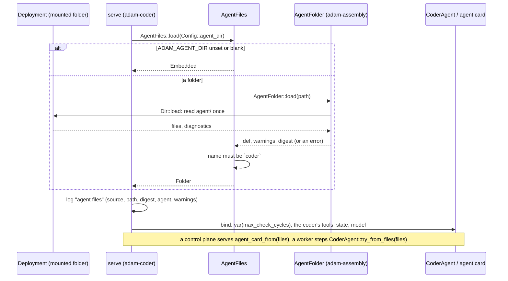
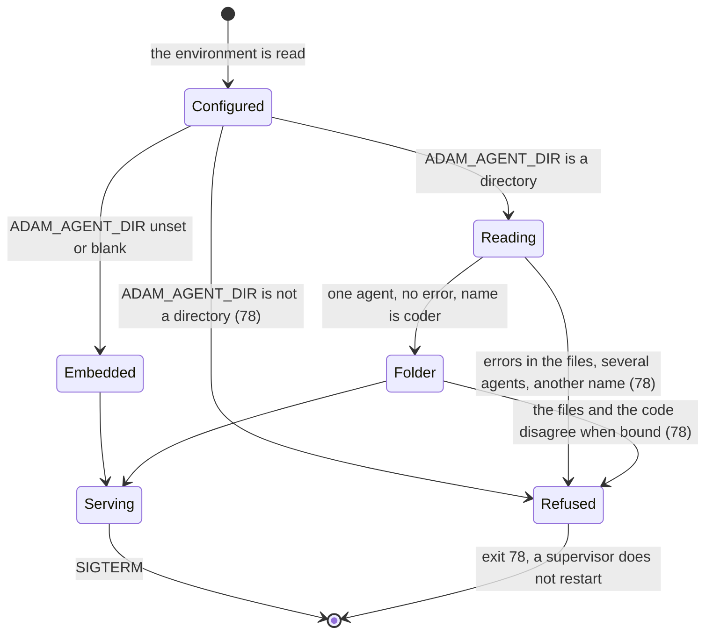

# 0004. Agent folders are read at run time, at startup

Status: **Accepted** (2026-10-01), decided on the owner's delegation; the owner may revisit.
Builds on the authoring layer ([`docs/reference/agent-files.md`](../reference/agent-files.md), S4 to S6b) and on
[ADR 0001](0001-library-first-host-roles.md) (a binary is a composition of libraries). Built as
slice S12 of the authoring layer, in `adam-assembly` (`AgentFolder`) and `adam-coder` (`ADAM_AGENT_DIR`).

## Context

An agent's instructions, card, skills, subagents and `mcp.json` are files (`agent/`), and today they
reach the coder only through `build.rs`: `adam_agent_fs::build("agent").emit()` embeds them in the
binary, so changing a sentence of the prompt means a build, an image and a rollout. The owner's
integration of this crate with the `another-agentic-system` chat (2026-10-01) needs the opposite: the
people who run the stack change what an agent says, in a folder they mount, and restart it. The first
visible case is the coder's name and greeting ([#55](https://github.com/vymalo/another-adam-rs/issues/55)),
which is a prompt change.

What already exists, *verified 2026-10-01 by reading the code at commit `82f8082`*:

* The loader that `build.rs` uses also reads a directory at run time and with no feature:
  `AgentDef::from_source(&Dir, Strictness)` (`crates/adam-assembly/src/def.rs`).
* The conveniences around it (`ADAM_AGENT_DIR`, `agent_dir()`, the "path is the root or `agent/`" rule,
  `AgentDef::from_dir`) were behind the feature `dev` (`crates/adam-assembly/src/dev.rs`), together
  with `LiveAssembly`, which watches the directory with `notify` and swaps the agents at step
  boundaries. The feature is off in release builds on purpose: a watcher and a swap with pinned versions
  are a development tool, and the file's own docs say it is not for production.
* The coder embeds `agent/` and binds only that copy (`CoderAgent::try_with_tools`, `agent_card`), and
  registers only its root: a subagent in a folder would be refused at call time because nothing
  registered it.

What a swap while the process runs costs: a run is durable, its journal is keyed by step names, and a
replayed transition must take the same steps. A prompt, a limit or a tool description can change under
a run (the request is rebuilt every turn), but a change to *which tools exist* fails a replayed
transition with `NonDeterminism`, which is why `LiveAssembly` pins runs to the tool set they started
with (*verified 2026-10-01: the doc of `LiveAssembly` in `dev.rs`*).

## Decision

1. **A binary reads its agent folder once, when it starts.** The environment variable `ADAM_AGENT_DIR`
   names a directory that holds `agent/`, or `agent/` itself (the rule that already existed). It is read by
   **every role**: the control plane needs the card, the workers need the prompt, and they must agree.
   `adam-assembly` gets `AgentFolder::load(path)` (one agent; lenient: warnings returned, errors refused;
   the digest of what was read) and `agent_dir_from_env()`, with no feature. `Error::NotOneAgent` refuses
   a folder that holds none or several: a process serves one agent.
2. **A binary that embeds a copy falls back to it.** `adam-coder`: `ADAM_AGENT_DIR` unset or blank means
   the copy `build.rs` embedded, exactly as before; set, it must be an existing directory (a configuration
   error, exit 78, naming the variable) holding the coder (`name: coder`, because the runs are stored under
   that name) and every `vars` entry the process supplies (`max_check_cycles`). Any mistake in the files is
   exit 78 with every diagnostic as `path:line: error: ...`, before anything connects. The startup log has
   one `agent files` line (`source=folder|embedded`, `path`, `digest`, `agent`, `warnings`) and one line
   per warning. The subagents of a folder are registered beside the root.
3. **No hot reload in release images.** The feature `dev` and `LiveAssembly` stay for development and are
   not enabled by any binary. A change to a mounted folder applies at the next start. `docker compose up -d
   coder` (or a Kubernetes rollout, which a changed ConfigMap triggers anyway) is the way.
4. **A restart is a deploy.** The runs are durable and survive it, and the process that steps them next
   uses the files as they are then. A change that only touches words (prompt, card, descriptions, limits)
   is invisible to the journal. A change to which tools exist (`tools:`, a subagent, an `mcp.json`) can fail
   the replay of a run that is in flight with `NonDeterminism`, as any deploy of new code can: change the
   tool set when no run is mid-turn, or accept that those runs fail.
5. **Binaries live in `bin/`, libraries in `crates/`.** Recorded here because this is the first change
   after the move (`adam-coder` is `bin/adam-coder`, #56): a folder-driven binary is a composition, and the
   next one (`adam-agent`, a binary that serves any folder) joins `bin/` without touching a library.

## Consequences

* **Editing `instructions.md` in the mounted folder changes the answer after a restart, with no build.**
  `bin/adam-coder/tests/agent_files.rs` shows the model being sent the edited prompt; `tests/binary.rs`
  shows the card of a folder served by a control plane and every refusal; `dev/greeting-e2e.sh` does it
  through the stack (a restart on an edited copy of the folder, "hi" answered with the other name, the default
  folder put back); the [run-locally guide](../guides/run-locally.md#change-what-an-agent-says) has the compose way.
* **The embedded copy is the default and the fallback**, so an image that is run with no mount, and every
  existing deployment, behaves as before. The Helm chart is not changed and does not expose the variable
  yet: it has no volume for a folder, so mounting a ConfigMap at a path is a chart change of its own
  ([`deploy/coder/README.md`](../../deploy/coder/README.md#agent-files)).
* **A folder is held to the code.** The tools, the completion policy and the redaction are Rust: a folder
  changes what the agent says and offers, not what its tools do. `tools:` may narrow the coder's seven
  tools, and a name that is not one is a startup error with a suggestion.
* **Subagents of the coder run as child runs with their own run id.** The coder's tools work on the
  worktree of the run that calls them, so a subagent has none of it: give a subagent tools that need no
  worktree (MCP tools, when the coder takes `mcp.json`). This is documented, not changed here.
* **`schedules/` of a folder are read and not run** by the coder; a warning says so.
* **A folder must be readable by the runtime user** (uid 10001 in the coder image).
* `AgentDef::from_dir`, `agent_dir` and `AGENT_DIR_ENV` are no longer behind the feature `dev`: the
  compile-fail doc test that said so is gone, and the sentence "a release build cannot read prompts from
  disk" became "cannot watch and reload them".

## Alternatives considered

* **Hot reload (`LiveAssembly`) in the coder.** Rejected for now: it brings `notify` and the pin
  bookkeeping into the one production binary, and a deployment already has a rollout that applies a changed
  mount. It needs a handle that `CoderAgent` can wrap (its completion policy sits around the root agent).
  Revisit when a restart is too slow for the people editing prompts.
* **A feature `run-time-folders`.** Rejected: reading a folder once uses the loader that is already in every
  build, adds no dependency and starts no process. The `dev` feature stays about watching.
* **A required folder (no embedded fallback) for the coder.** Rejected: it would break every deployment that
  does not mount one, and the embedded copy is what the tests and the image smoke test run. A general
  binary that serves any folder (`adam-agent`) has no embedded copy and requires the variable.
* **The folder overrides individual files over the embedded copy.** Rejected: two sources of the same
  prompt make "which files is this process running" unanswerable. One source, named in the log with its
  digest.

## Verified and unverified

* *Verified 2026-10-01*: the digest of the shipped `agent/` read from disk equals the digest `build.rs`
  embedded (`files::tests::the_shipped_folder_has_the_digest_of_the_embedded_copy`), and the digest of the
  `adam-agent-fixture` folder equals its embedded copy's (`crates/adam-assembly/tests/folder.rs`).
* *Verified 2026-10-01*: a folder with errors, another agent's name, a missing `max_check_cycles` var and a
  missing directory each stop the binary with exit 78 (`bin/adam-coder/tests/binary.rs`).
* *Unverified*: how a real model behaves with an edited prompt; the files only prove what the model is sent.
* *Unverified*: that `NonDeterminism` is what a replay reports for a tool that appeared or vanished across a
  restart, beyond the documentation of `LiveAssembly`; no test restarts a process over a changed tool set.
