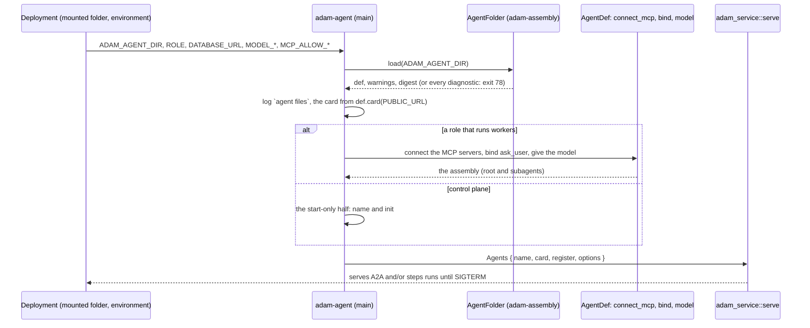
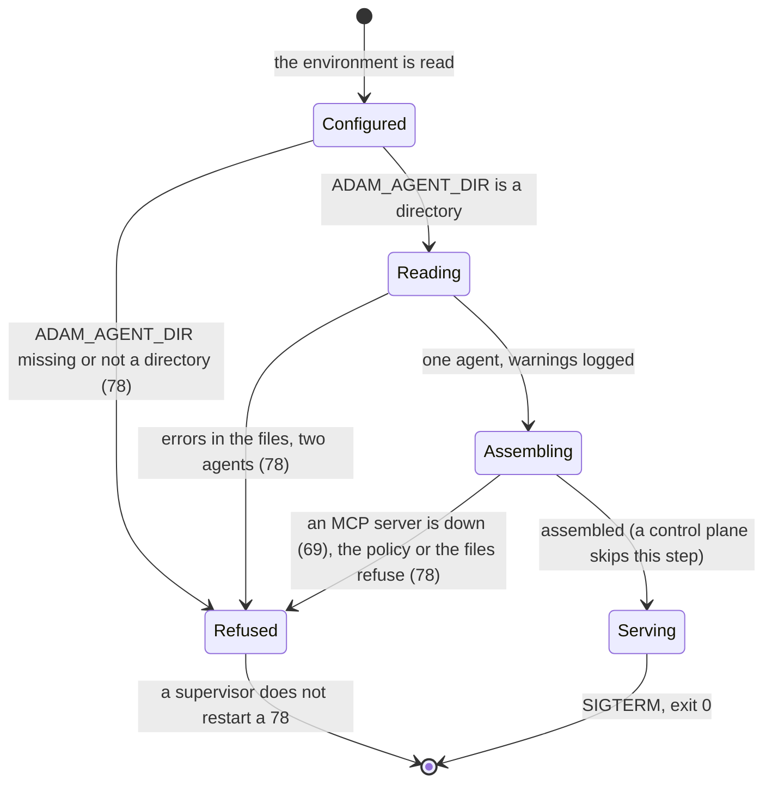

# 0005. One binary serves any agent folder (`adam-agent`)

Status: **Accepted** (2026-10-01), decided on the owner's delegation; the owner may revisit.
Builds on [ADR 0004](0004-agent-folders-at-run-time.md) (a binary reads its agent folder at startup),
[ADR 0001](0001-library-first-host-roles.md) (a binary is a composition of libraries, roles through
`adam-host`) and the MCP tools of an agent folder (`mcp.json`, [`docs/reference/agent-files.md`](../reference/agent-files.md)). Built as
`bin/adam-agent` over [`adam-service`](../../crates/adam-service/README.md).

## Context

`adam-coder` is one agent with seven tools written in Rust, and it is the only binary. The stack the owner
is building around it (the `another-agentic-system` chat) needs more agents than that: a plain chat
assistant, a researcher that reads the web through an MCP server, later others. Each of those is, in the
authoring layer's own terms, files: instructions, a card, skills, subagents and an `mcp.json`. Writing a
binary for each of them would put a `build.rs`, a Dockerfile, a chart and a release in front of a
change of a sentence.

What exists, *verified 2026-10-01 by reading the code at commit `7b2d8f9`*:

* The generic half of the coder (the Postgres store, the runtime, the A2A router, the `LISTEN`/`NOTIFY`
  signals, the components of a `ROLE`, the exit codes) was moved into `adam-service`, so a second binary
  does not copy it. The coder reads `ADAM_AGENT_DIR`, and connects an `mcp.json`.
* `AgentFolder::load` reads one agent's folder at run time with no feature; `AgentDef::connect_mcp` connects the
  servers of its `mcp.json`; `bind`, `model` and `register` assemble the root and its subagents and put them on
  a runtime (`crates/adam-assembly`).
* The runtime scopes runs by the agent's name: `RuntimeTaskBackend` refuses another agent's runs and a
  worker claims only the agents it registered (`crates/adam-a2a-runtime/src/backend.rs`), so several agents can
  share a database.

## Decision

1. **`bin/adam-agent` is one binary that serves any agent folder.** It is `main.rs` over a small library:
   read the folder, assemble the agent, hand it to `adam_service::serve`. It is a composition and has no
   agent of its own.
2. **No embedded default.** `ADAM_AGENT_DIR` is required by every role (exit 78 naming the variable when it is
   unset, blank or not a directory). A default persona would hide a missing mount: a process that starts and
   answers as something nobody configured is worse than one that does not start.
3. **One agent per process.** The folder holds exactly one agent (`AgentFolder::load` refuses `agents/` with
   several). The agent's `name` is the registered name and the key of its stored runs; renaming it strands the
   runs of the old name, as for the coder.
4. **The one built-in tool is `ask_user`.** It parks the run as `input-required`. Everything else the agent
   offers comes from its folder: the tools of its MCP servers (`<server>__<tool>`), the skills' tools and one
   tool per subagent. A folder that needs a tool written in Rust needs a binary of its own (a composition over
   `adam-service`, like the coder), not a plugin: tools are not loaded at run time (ADR 0009 of the sibling
   orchestration layer applies here: swapping is at build time).
5. **Every `vars` entry has a value in the file.** Nothing in this binary supplies one (the coder supplies
   `max_check_cycles`); a var declared without a value, a var the prompt does not use and a placeholder the
   frontmatter does not declare are startup errors naming them.
6. **MCP servers are connected by the workers, at startup, under the deployment's policy.** `MCP_ALLOW_STDIO`,
   `MCP_ALLOW_INSECURE` and `MCP_ALLOW_URL_VARS` (all off by default) say which kinds of server a folder may
   use; `${VAR}` in `headers`, `args` and `env` reads the process environment and `${VAR}` in a `url` is refused
   unless the deployment opts in, because the MCP client library logs the URL it dials. A server that is down is
   exit 69, anything the files or the policy get wrong is 78. A control plane steps no run, so it connects no
   server.
7. **Not pinned, no workspace.** The agent has no worktree, so a run is not tied to a worker: any worker steps
   any run (`ClaimScope::Any`), there is no `WORKSPACE_*` and no `GITHUB_TOKEN`. Several services share one
   database, each under its own agent name.
8. **It ships inside the existing coder image.** The `coder` image (`ghcr.io/vymalo/another-adam-rs/coder`)
   builds and installs both binaries; its entrypoint stays `adam-coder`, and a service that runs a folder
   overrides it with `adam-agent` and mounts the folder. No new package: a new GHCR package is private until
   the owner makes it public, and the image is large because it carries the workspace toolchains. A lean image
   of its own can come after the MVP, when someone runs the generic agent without the toolchains.

## Consequences

* **A new agent is a folder and a few lines of deployment**, not a build. The stack's chat assistant and the
  researcher are `dev/agents/*/agent/` mounted into `adam-agent` services; their mocks are WireMock models
  scripted by the persona lines (`mock-assistant`, `dev/wiremock/mock-openai`).
* **A folder cannot do what needs Rust.** No filesystem, shell, git or HTTP tool exists unless an MCP server
  offers it (and the deployment allows that kind of server). That is the point: the agent's reach is what the
  deployment mounted and allowed.
* **A restart is a deploy** (ADR 0004): an edit applies at the next start, and a change to which tools exist
  (`tools:`, `mcp.json`, a subagent) can fail the replay of a run that is mid-turn.
* **`ask_user` exists twice** (`adam-coder` and `adam-agent`): the coder's description names pull requests and
  this one's does not. Unifying them into a shared crate is a later slice's call.
* **`schedules/` are read and not run**, with a warning, as in the coder.

## Alternatives considered

* **A binary per agent.** Rejected: it is the cost this decision removes.
* **A feature of `adam-coder`** (the coder with its tools off). Rejected: the coder's configuration (a GitHub
  token, a workspace, a placement) and its completion policy (a run that stops without a pull request is a
  question, not a completion) are not an assistant's.
* **A default folder embedded in `adam-agent`.** Rejected, see decision 2.
* **A lean image of its own now.** Rejected for the MVP, see decision 8; the cost is an image carrying
  toolchains the generic agent does not use.

## Verified and unverified

* *Verified 2026-10-01*: a chat folder is answered in role over A2A through the official client, an edit with a
  restart changes the answer, a control plane and a worker in two processes complete a task, and every refusal
  in decisions 2, 3, 5 and 6 has the exit code stated (`bin/adam-agent/tests/`).
* *Unverified*: how a real model behaves with these prompts; the tests script the model by the prompt and
  only prove what it is sent.
