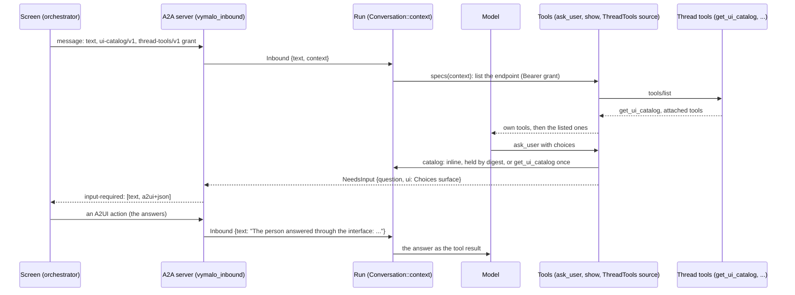
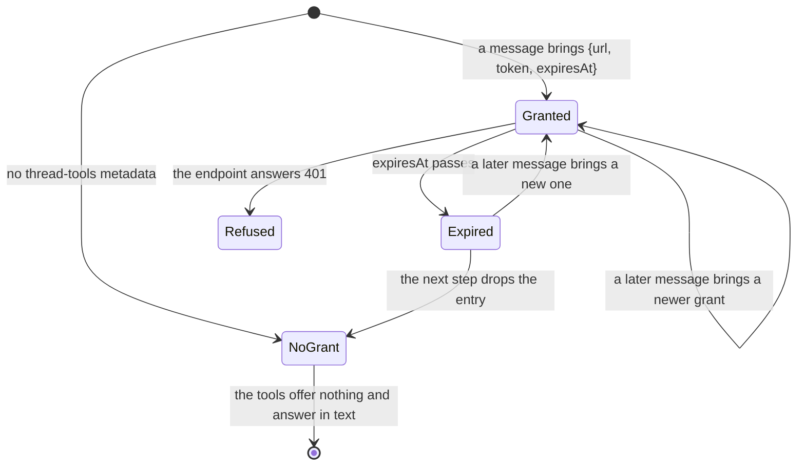

# 0006. A2UI and the vymalo extensions in adam-rs

Status: **Accepted** (2026-10-01), decided on the owner's delegation; the owner may revisit.
Builds on [ADR 0001](0001-library-first-host-roles.md) (libraries first, binaries compose),
[ADR 0003](0003-a-new-task-continues-the-task-it-references.md) (a new task carries the conversation) and
[ADR 0005](0005-one-binary-serves-any-agent-folder.md) (`adam-agent`). The other side of the contract is the
orchestration layer's: ADR 0013 (A2UI), ADR 0023 (the UI catalog as an A2A extension, its status note) and ADR 0024
to 0026 of `vymalo/another-agentic-system`, and its pages `docs/api/ui-catalog-v1.md` and
`docs/api/thread-tools-v1.md`.

## Context

The orchestration layer's chat can draw more than text. The web owns a **catalog** of components (Text, Column,
Choices today; Cards and Mermaid next), the orchestrator relays it to an agent in the A2A messages it sends, and it
serves one **MCP endpoint per conversation** (the thread tools) through which an agent reads the catalog again and,
in later slices, uses the tools of the servers the person attached and asks other agents. All of it is optional A2A
extension machinery, detected from the agent's card, so a plain A2A agent keeps working.

What adam-rs had, *verified 2026-10-01 by reading the code at commit `bec4044`*:

* No A2UI anywhere. `ask_user { question }` was `ToolError::NeedsInput { question }`, and an `input-required` status
  carried the question as text only (`adam-a2a-runtime/src/convert.rs`).
* `default_inbound` turned an A2A message into `{"text": ...}`, with data parts printed as JSON text: a message's
  metadata (where the extensions live) never reached the agent, and an A2UI action arrived as JSON.
* `Tool::spec()` is one fixed spec per tool, so a tool list that changes from one turn to the next (the tools of
  the thread's endpoint) could not be offered to the model.
* `adam-mcp` connected the servers of an `mcp.json` once, at startup.

## Decision

1. **A question can carry an interface.** `ToolError::NeedsInput` and `PendingQuestion` gain an optional `ui` (an array
   of A2UI messages), journal- and state-compatible (absent in old records, not written while `None`). An
   `input-required` status message is the question as a text part and the interface as an
   `application/a2ui+json` data part, in both spellings of the media type (`mediaType` of A2A 1.0 and the
   extension's `metadata.mimeType`); the status message id and the "did anything change" key include a digest of
   the interface, and a status without one is exactly what it was.
2. **What a message says about its sender is the run's inbound context.** The objects under `"context"` of every
   inbound payload are merged, key by key (`null` deletes), into the durable `Conversation::context`, carried by
   `Conversation::continued` (a new task of the same conversation has the catalog and the grant of the one before),
   bounded to 256 KiB, and read by tools with `ToolCtx::context`. `adam-a2a-runtime`'s `vymalo_inbound` fills it
   from the extensions of a message: `vymalo.ui.ref` (`ui-catalog/v1`), `vymalo.ui.catalog` (an inline catalog with
   the ref's id, read under `v0.9`, `v0.9.1` and `v1.0` capability keys because A2UI's own files disagree on it),
   `vymalo.threadTools` (`{url, token, expiresAt}`). It also reads an A2UI **action** as the person's answer:
   Choices answers become `The person answered through the interface:` and a line per question (`- db: pg`), any
   other action `The person used the interface: action "<name>" ...`. A2A servers hold metadata numbers as doubles
   (`maxLength: 256.0`): whole numbers are written back as integers, which is what a catalog's digest is over.
3. **The thread-tools token is kept in the run's state until it expires.** The token must survive the split between
   the A2A front and the worker that steps the run, and a restart, so it is stored in the context (the durable
   state of the run, in Postgres) and **removed once its `expiresAt` has passed**, at the start of the next step
   (`Conversation::drop_expired_context`: any context entry that is an object with an `expiresAt`). It is never in a
   log line, a tool result, an error message or the model's context; its `Debug` prints `[redacted]`. This is the
   first alternative of the orchestration layer's risk R4 (the other, dropping it and refetching only inside the
   process that received the message, breaks the front/worker split). A parked run keeps an expired token until it
   next steps.
4. **Dynamic tools are a `ToolSource` read at every model turn.** `adam-llm-agent` gains the trait: `specs(ctx)` lists
   the tools to offer on this turn (read from the run's context, inside the journaled model step, so a replay
   lists nothing and the journal has no new entries), `call(ctx, name, args)` answers the calls to them inside the
   journaled tool step. The agent's own tools come first and win a name clash; at most 64 are offered. The
   thread-tools client (`adam_ui::ThreadTools`) is one: it lists the endpoint's `tools/list` each turn and offers
   **every listed tool under its listed name**, so the relayed tools of attached servers and `ask_agent` of later
   slices appear with no change here. `adam-assembly`'s `BoundDef::tool_source` gives a source to every agent.
5. **One `show` tool, not one tool per component.** The catalog is the screen's and changes with its version; a
   model's tool list should not, and a screen is several blocks together. `ui_catalog {}` gives the components and
   their schemas; `show { blocks, title? }` takes `{component, ...properties}` blocks, **validates each against the
   catalog's JSON Schema** (`jsonschema`, draft 2020-12, no network resolution) and answers a refusal in words the
   model can act on; a good call is a run artifact `ui` of media type `application/a2ui+json` under the
   screen's `catalogId`. `ask_user` gains `choices` (up to 8 questions, 2 to 8 options each) rendered as one Choices
   surface; on a screen that cannot draw it, the options go in the question's text. Every tool degrades; none
   fails a run.
6. **The catalog is checked against its digest, always, and refetched when stale.** A catalog read from a message or
   from `get_ui_catalog` must hash (canonical JSON: sorted ASCII keys, whole numbers, no whitespace; RFC 8785
   restricted to what a catalog holds) to the digest it was announced with, or it is not used. The tools look at the
   run's context, then at the catalogs this process holds (by digest, 8, in memory), and when the current catalog is
   neither inline nor held they read it once over the thread tools. An expired, missing or refused grant, an endpoint
   that is down or a document that does not hash are all "unreadable": the tool degrades to text.
7. **The endpoint is an MCP server under the deployment's policy.** `adam_mcp::Endpoint` opens a connection per
   request (the endpoint is stateless and the token is per message), applies the rules of every remote server
   (https, or plain `http` only to this machine unless `MCP_ALLOW_INSECURE`; no credentials in the URL) and scrubs
   the token from everything it returns.
8. **The extensions are announced on the card, and only the card.** `adam_ui::card_extensions()` is A2UI v0.9.1
   (with `supportedCatalogIds` and `acceptsInlineCatalogs: true`), `ui-catalog/v1` and `thread-tools/v1`, all
   optional (ADR 0008 of the orchestration layer: detected live from the card, fail closed, removable). Nothing
   else in the process depends on them being listed: an agent whose card lists none gets messages without the
   metadata, and its tools answer in text.

## Consequences

* **Breaking for code that builds `ToolError::NeedsInput`, `PendingQuestion` or `Conversation` with a struct
  literal** (a new field each); `ToolError::needs_input(question)` and `needs_input_with_ui(question, ui)` are the
  constructors. Old journals and old state load unchanged, and a question with no interface writes the shape it
  always had.
* **The token is at rest** in the store for as long as its lifetime (the orchestration layer's default is two hours),
  and in the A2A inbox of the run until the message is consumed. A deployment that cannot accept that does not list
  `thread-tools/v1` on its card.
* **The tool list a model sees can change between turns**, but not between a call and its replay: the listing is
  not journaled (only the model's answer is), and the call is. An agent that was given a source mid-run (a deploy)
  can fail the replay of a turn that was in flight, as a change of `tools:` can (ADR 0004).
* **`jsonschema` joins the build** (MIT; its dependency `borrow-or-share` is MIT-0, added to `deny.toml`'s list).
* **`MCP_ALLOW_INSECURE` is needed by a stack whose orchestrator is reached over plain `http` inside a cluster
  network**, for the thread-tools URL as for any MCP server.
* **A source's tool cannot wait on a remote task** (`ToolError::AwaitRemote`): the agent polls the tool that
  started the task, and a source's tool is not known then. The relayed tools of the next slices are plain calls.

## Alternatives considered

* **One tool per component.** Rejected (decision 5): a tool list that follows the catalog's version, and a model that
  has to compose a screen out of several calls.
* **Hard-wiring `get_ui_catalog` as the only thread tool.** Rejected (decision 4): the orchestration layer adds
  tools to the same endpoint, and an agent that lists none of them is not using the endpoint.
* **Dropping the token and refetching only inside the receiving process.** Rejected (decision 3): it breaks the
  front/worker split that ADR 0001 is about.
* **Journaling the tool listing.** Rejected: it adds a step to every turn of an agent with a source and changes the
  journal sequence of runs in flight; not journaling it costs nothing, because only the model's answer is replayed.
* **A hand-written validator for the catalog's schemas.** Rejected: the catalog is JSON Schema 2020-12 the web
  authors and a library says what the web's validator says.

## Verified and unverified

* *Verified 2026-10-01*, by tests in this repository: the digest of the web's real catalog (version 2, a copy in
  `crates/adam-ui/tests/fixtures`) is the one its lock names and the contract's known-answer vector hashes as
  documented; doubles hash as the integers they are; rmcp 3.5's client works against rmcp 3.5's own **stateless**
  server (`NeverSessionManager`, JSON responses) mounted with `route_service` on the parametrised path
  `/thread-tools/{thread}/mcp`; a stateless endpoint is served one connection per request; a whole agent behind A2A
  asks three questions as one form, takes the answer as an action and goes on; the token reaches neither the model
  nor the person.
* *Verified 2026-10-01* against A2UI's files (`github.com/google/A2UI` `main`, as `ui-catalog-v1.md` records): the
  capability key is `v0.9` in the JSON schema and `v0.9.1` in the extension page; adam reads both.
* *Unverified*: how a real model uses `choices` and `show` (the tests script the model); the web's drawing of the
  surfaces (the orchestration layer's tests); a 401 is told apart from other failures by the text the transport
  reports.

## Status notes

*2026-10-02, from the owner's chats of that day (a model guessed a component name, drew a form that nobody could answer and
then blamed the screen, and called two tools for one catalog). Three changes, none of them to the contract:*

* **`show` is described with the screen's components.** The description a model reads names each component of the
  conversation's catalog with the first sentence of what it is for (at most 2 KiB, then "and n more"), so a block names a
  component that exists on the first call; `ui_catalog` still gives the schemas. A tool's description is made when the agent is
  built, and the catalog is the conversation's, so the new hook is a defaulted method of `ToolSource`, `refine(&SourceCtx,
  &mut [ToolSpec])`, called once per model call (inside the journaled step, so a replay reads nothing), and `Ui::source()` uses it
  to rewrite the description of `show` **from the catalogs this process already holds**: no turn asks the endpoint for the sake of a
  description. The first turn of a conversation whose catalog is only referenced and not held yet is described as before ("call
  `ui_catalog` first"); that call, or any tool that reads the catalog, holds it, and the next turn lists it.
* **`show` refuses a `Choices` block.** The screen enables a form only while the conversation is blocked on one (`ask_user`), so
  a form drawn by `show` is a dead form. The refusal says so and names `ask_user` with `choices`, and the description says it
  too. (A later option, the web letting an action on a finished thread start the next job, would change this and not the
  refusal's reasoning today.)
* **`get_ui_catalog` is not shown to the model.** `Ui::source()` hides it (`ThreadTools::hiding`) and answers a call to it as a name
  nobody has: the model has `ui_catalog`, and two tools for one thing made it call whichever it remembered. The refetch of a stale
  catalog still goes through the endpoint, inside this crate. The other way round (hiding the local tool) was rejected: `ui_catalog`
  works with no grant, from the message's own catalog, and `get_ui_catalog` does not.
