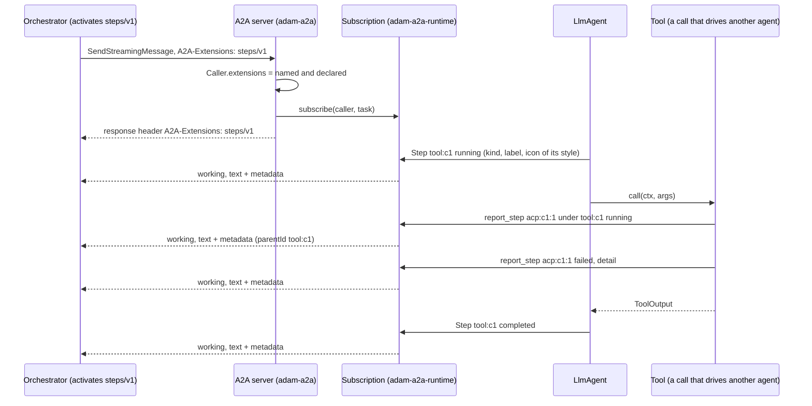
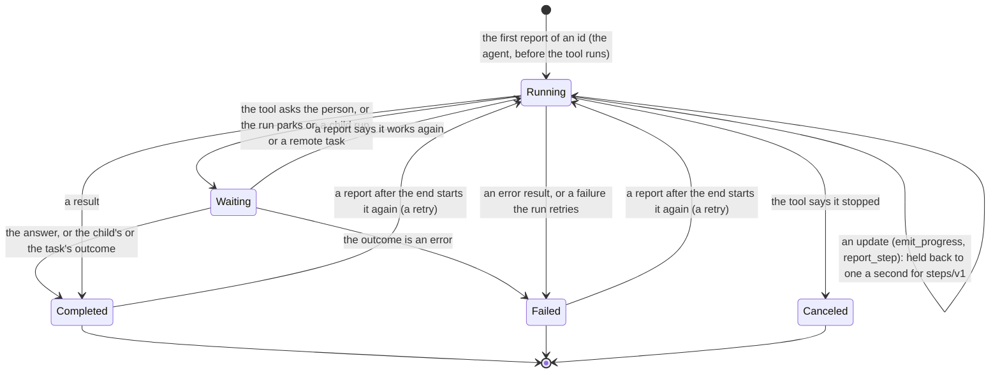

# 0007. Progress as steps and streamed text

Status: **Accepted** (2026-10-01) for the steps (decisions 1 to 7); the streamed text (issue #51) is decided when it
is built and recorded here, in [the last section](#streamed-text). Decided on the owner's delegation; the owner may
revisit. Builds on [ADR 0001](0001-library-first-host-roles.md) (libraries first) and
[ADR 0006](0006-a2ui-and-the-vymalo-extensions-in-adam-rs.md) (the vymalo extensions, detected from the card). The
other side of the contract is the orchestration layer's: its ADR 0025 (nested steps), its ADR 0008 (an A2A extension
is optional, read live from the card, removable) and its page `docs/api/steps-v1.md` in
`vymalo/another-agentic-system`.

## Context

An agent's work has a shape: the agent, a sub-agent it handed a task to (the coder drives OpenCode over ACP), and the
tools and commands they ran. What an adam agent reported of it was flat. *Verified 2026-10-01 by reading the code at
commit `d411249`:*

* The events of a run are `RunEvent::{Status, Progress, Custom, Artifact}` (`adam-runtime/src/events.rs`), best
  effort and not durable. A tool call was `Custom { kind: "tool_start" }` and `Custom { kind: "tool_end" }` (data
  parts of a `working` status), and a tool's `emit_progress` was free text. The coder turned every update of
  OpenCode into a `Progress` line, so a client read one flat stream of statuses.
* The orchestration layer logs every `working` status that has text; in one real thread, 7 messages produced 336 status
  events, 197 of them one sub-agent's (its ADR 0025). It asks agents for a tree instead, over the `steps/v1`
  extension: a report of a step carries its id, its parent, a kind, a label, a state, an icon and a detail, in the
  metadata of a `working` status message.
* A request's `A2A-Extensions` header never reached a backend: `Caller` held the subject and nothing else, so an
  agent could not tell a client that wants steps from one that does not.

## Decision

1. **The extensions a request activates reach the backend.** `Caller::extensions` holds the URIs a request named (its
   `A2A-Extensions` header, and `message.extensions` of a message it sends) that **the card declares**, each once;
   one the card does not declare is not activated. Each method does it for its own request (a resubscribe activates
   for itself), and the response's `A2A-Extensions` header lists what was activated. Ownership still looks at the
   subject only. *Verified 2026-10-01*, <https://a2a-protocol.org/latest/topics/extensions/>: a client "requests
   extension activation by including the `A2A-Extensions` header ... a comma-separated list of extension URIs", and
   "the response SHOULD include the `A2A-Extensions` header, listing all extensions that were successfully
   activated"; the page does not mention `Message.extensions`, which the orchestration layer sends as well.
2. **A step is a run event.** `RunEvent::Step(StepEvent)` (`adam-runtime`) carries the contract's members: an `id`
   (at most 128 bytes), an optional `parent`, a `kind` (`subagent`, `tool`, `command`, `message`), a one-line `label`
   (at most 200 characters), a `state` (`running`, `waiting`, `completed`, `failed`, `canceled`: the last three end
   the step), an optional `icon` and a `detail` (at most 1000 characters). The kinds, states and icons are closed
   enums (`#[non_exhaustive]`, so a later version of the contract can add a word), and the constructors keep the
   bounds, so an agent cannot send what the orchestration layer would drop. **It replaces** the `Custom` events
   `tool_start` and `tool_end` and the `Progress` event of a tool call: a breaking change of the shapes of adam's
   events, which this ADR and the READMEs state (the owner's decision 6 of the program brief).
3. **A tool call is a step, in a style the tool chooses.** The agent reports the step `tool:<call id>` as `running`
   before the tool runs and, after it, `completed` (a result), `failed` (an error result, or a failure it retries),
   or `waiting` (the tool asked the person, or the run parked on a child run or a remote task), which ends with the
   answer or the outcome. `Tool::step_style() -> StepStyle` (kind, label, icon; the default is a plain `tool` labelled
   with the tool's name) and `#[tool(step = "subagent", label = "OpenCode", icon = "agent")]` set it; subagent tools
   of `adam-assembly` are `subagent` steps drawn as agents. `ToolCtx::step_id()`, `ToolCtx::report_step(..)` (a step
   that runs under the call's, or under another one the call reported) and `ToolCtx::emit_progress(..)` (an update of
   the call's own step, the text in its detail) are how a tool says more. **The agent never puts a tool's output in a
   step's detail**: a step is shown to the person, and a tool's result is for the model; a tool that wants a result
   shown says it in its own update.
4. **A client that activated `steps/v1` gets the report; one that did not gets a line.** The subscription
   (`adam-a2a-runtime`) turns a step into a `working` status update whose message has one text part, and, for an
   activated request, the report under the extension's URI in the message's `metadata` (and the URI in its
   `extensions`). The text is the plain line the contract asks for: the label for a start or a move, the detail
   alone for a progress line of a step at the top (what `emit_progress` always was), `label: detail` for one
   under another step, and `label: done`, `label: failed` or `label: canceled` (then the detail) for an end.
5. **The throttle is the subscription's, because it is the one that knows.** The contract asks for at most one update
   per step per second. A subscription that activated steps holds back the report of a state a step is already in
   for a second; the start, every change of state and the end always go out. The agent emits everything, so a
   client that did not activate steps still gets every line, as `Progress` always was, and the events that cross
   processes (`adam-notify-postgres`) are whole.
6. **The orchestration layer keeps the log small, not this repository.** An agent sends the reports; the orchestrator
   coalesces them (a start, a few updates and an end per step), so the agent keeps no ledger of open steps.
7. **Nothing here is required.** The card lists the extension (`ExtensionConfig::steps()`), a client that does not
   activate it reads plain A2A, and the orchestrator reads the card live and fails closed (its ADR 0008).

## Consequences

* **Breaking for code that matches `RunEvent` exhaustively** (a new variant, `Step`), for code that read the `Custom`
  events `tool_start` and `tool_end` (`ok` is now `completed`, `error` and `transient_error` are `failed`,
  `needs_input` and `waiting` are `waiting`), and for a client that read a tool's progress as `Progress`. A tool's
  `Tool::step_style` is a new default method: no tool has to change.
* **A client that did not activate steps reads a line of text for the start and the end of each tool call**, where it
  read a data part (`tool_start`, `tool_end`), and a line for each update, as it did. A client that wants fewer
  asks for steps.
* **A failed step carries no reason unless the tool says one** (decision 3): the screen shows "failed" and the
  model's own words say why.
* **`Caller` equality includes the extensions.** A test that compares a `Caller` with `Caller::new(subject)` after a
  request with extensions would differ; ownership compares subjects.
* **Throttling by subscription costs a map** (the state and time of each open step, at most 1024, then it starts
  again) per streaming client that activated steps.

## Alternatives considered

* **Keep `tool_start` and `tool_end` and add steps beside them.** Rejected: two descriptions of one thing, and twice
  the events on every call.
* **Throttle where the event is emitted.** Rejected (decision 5): the emitter does not know who listens, and a
  client without steps would lose lines it always had.
* **Open steps in a ledger in the agent, to close them at the end of a run.** Rejected (decision 6): the
  orchestrator has to close what an agent left open anyway (a crash), so the agent's ledger would be a second copy.
* **Free-text icons and kinds.** Rejected: the screen ignores an icon it does not know, so a closed set is all an
  agent can mean, and a typo is a compile error (`#[tool(icon = "..")]` is checked while the macro expands).

## Streamed text

*Not decided yet.* Issue #51 asks for the model's answer to reach the client as it is written. It will be recorded
here when it is built: the `text-stream/v1` extension of the orchestration layer (chunks as artifact updates, the
whole text stated once as a status message), the streamed model step in the journal, and what is stored (the final
text only).

## Verified and unverified

* *Verified 2026-10-01*, by tests in this repository: a request activates the extensions it names that the card
  declares, in each method, and the response says which (`crates/adam-a2a/tests/round_trip.rs`); a step is a status
  whose message carries the report under `steps/v1` for an activated caller and one line of text for one that is
  not, with the throttle of decision 5 (`crates/adam-a2a-runtime/tests/steps.rs`); a tool call is a step in its
  style, its reports nest under it, and a question keeps it open until the answer
  (`crates/adam-llm-agent/tests/llm_agent.rs`); the words of `#[tool(step, icon)]` are the runtime's
  (`crates/adam/tests/tool_macro.rs`); the largest step event fits a `NOTIFY` payload
  (`crates/adam-notify-postgres/src/wire.rs`).
* *Verified 2026-10-01* against the contract (`docs/api/steps-v1.md` of the orchestration layer, accepted the same day):
  the members, the vocabulary, the bounds and the one-update-a-second rule are the ones written here.
* *Unverified*: how the orchestrator's tree reads a real coder turn (its own tests, and the compose scenario of the
  change that pins this build there).
