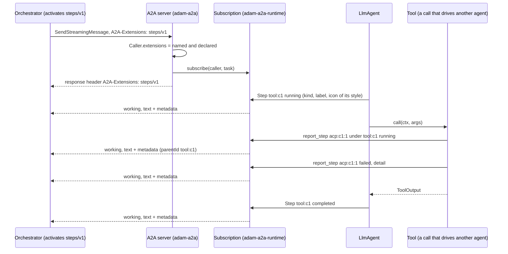
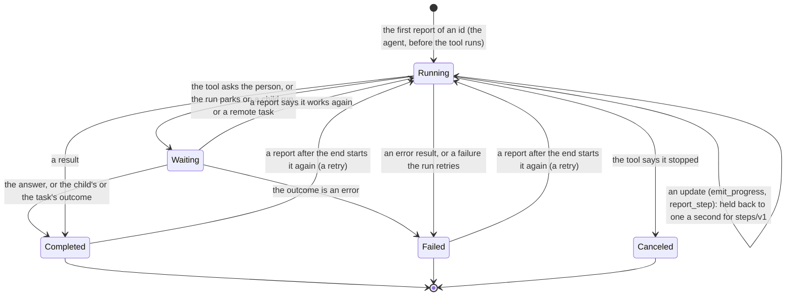
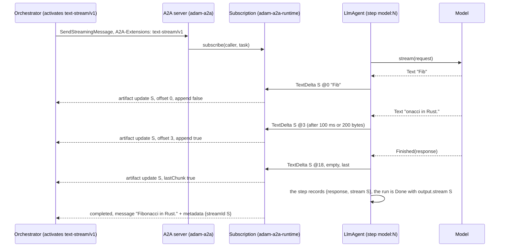
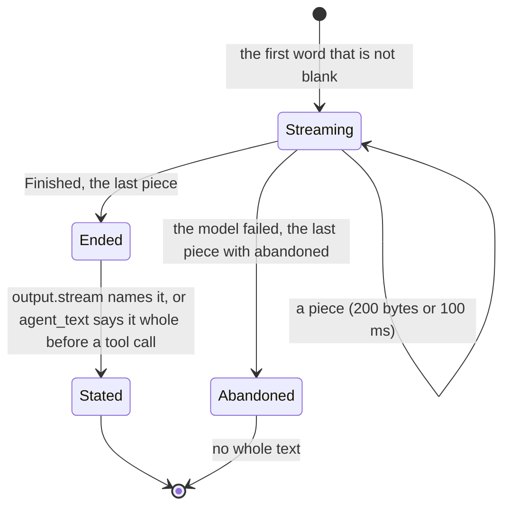

# 0007. Progress as steps and streamed text

Status: **Accepted** (2026-10-01) for the steps (decisions 1 to 8) and for the streamed text (decisions 9 to 16,
recorded the same day, when it was built: [Streamed text](#streamed-text)). Decided on the owner's delegation; the
owner may revisit. Builds on [ADR 0001](0001-library-first-host-roles.md) (libraries first) and
[ADR 0006](0006-a2ui-and-the-vymalo-extensions-in-adam-rs.md) (the vymalo extensions, detected from the card). The
other side of the contract is the orchestration layer's: its ADR 0025 (nested steps) and ADR 0027 (live text is relayed,
not stored), its ADR 0008 (an A2A extension is optional, read live from the card, removable) and its pages
`docs/api/steps-v1.md` and `docs/api/text-stream-v1.md` in `vymalo/another-agentic-system`.

## Context

An agent's work has a shape: the agent, a sub-agent it handed a task to (the coder drives OpenCode over ACP), and the
tools and commands they ran. What an adam agent reported of it was flat. *Verified 2026-10-01 by reading the code at
commit `d411249`:*

* The events of a run are `RunEvent::{Status, Progress, Custom, Artifact}` (`adam-runtime/src/events.rs`), best
  effort and not durable. A tool call was `Custom { kind: "tool_start" }` and `Custom { kind: "tool_end" }` (data
  parts of a `working` status), and a tool's `emit_progress` was free text. The coder turned every update of
  OpenCode into a `Progress` line, so a client read one flat stream of statuses.
* The orchestration layer logs every `working` status that has text; in one real thread, 7 messages produced 336 status
  events, 197 of them one sub-agent's (its ADR 0025). It asks agents for a tree instead, over the `steps/v1`
  extension: a report of a step carries its id, its parent, a kind, a label, a state, an icon and a detail, in the
  metadata of a `working` status message.
* A request's `A2A-Extensions` header never reached a backend: `Caller` held the subject and nothing else, so an
  agent could not tell a client that wants steps from one that does not.

> **Amended 2026-10-02 by [ADR 0011](0011-a-tool-calls-step-carries-its-input-and-output.md):** decision 3's sentence "the
> agent never puts a tool's output in a step's detail" still holds for the `detail`, but a step now has two members of
> its own, `input` (on the report that starts it) and `output` (on the one that ends it), cut to 4 KiB and 8 KiB and
> redacted by the agent first, so that a screen can open a step and show what the tool was given and answered.

> **Amended 2026-10-05:** "live" in decisions 1 to 16 no longer means "only from the moment of subscription". A streaming
> send submits the run and subscribes afterwards, and a worker could begin in that gap, so the start of a tool call's
> step (the only report with its `input`) was lost and the step showed no input. `BroadcastSink` now keeps the recent
> live events of each run (the newest 64, none older than 30 seconds, at most 64 runs; no `Status`, no `Artifact`, and
> only since the run's last change of status, so a run taken up again after a question replays only its new turn) and `subscribe_run` replays them before the live ones, with no gap and no duplicate. Events are
> still best effort and never the truth; the durable record decides. A resubscribe within those 30 seconds may repeat a
> step (a snapshot by id) or a text piece (it carries its `offset`), so decision 14's "not replayed to a client that
> resubscribes" holds for the record and not for the last seconds. See `crates/adam-runtime/src/events.rs`.

## Decision

1. **The extensions a request activates reach the backend.** `Caller::extensions` holds the URIs a request named (its
   `A2A-Extensions` header, and `message.extensions` of a message it sends) that **the card declares**, each once;
   one the card does not declare is not activated. Each method does it for its own request (a resubscribe activates
   for itself), and the response's `A2A-Extensions` header lists what was activated. Ownership still looks at the
   subject only. *Verified 2026-10-01*, <https://a2a-protocol.org/latest/topics/extensions/>: a client "requests
   extension activation by including the `A2A-Extensions` header ... a comma-separated list of extension URIs", and
   "the response SHOULD include the `A2A-Extensions` header, listing all extensions that were successfully
   activated"; the page does not mention `Message.extensions`, which the orchestration layer sends as well.
2. **A step is a run event.** `RunEvent::Step(StepEvent)` (`adam-runtime`) carries the contract's members: an `id`
   (at most 128 bytes), an optional `parent`, a `kind` (`subagent`, `tool`, `command`, `message`), a one-line `label`
   (at most 200 characters), a `state` (`running`, `waiting`, `completed`, `failed`, `canceled`: the last three end
   the step), an optional `icon` and a `detail` (at most 1000 characters). The kinds, states and icons are closed
   enums (`#[non_exhaustive]`, so a later version of the contract can add a word), and the constructors keep the
   bounds, so an agent cannot send what the orchestration layer would drop. **It replaces** the `Custom` events
   `tool_start` and `tool_end` and the `Progress` event of a tool call: a breaking change of the shapes of adam's
   events, which this ADR and the READMEs state (the owner's decision 6 of the program brief).
3. **A tool call is a step, in a style the tool chooses.** The agent reports the step `tool:<call id>` as `running`
   before the tool runs and, after it, `completed` (a result), `failed` (an error result, or a failure it retries),
   or `waiting` (the tool asked the person, or the run parked on a child run or a remote task), which ends with the
   answer or the outcome. `Tool::step_style() -> StepStyle` (kind, label, icon; the default is a plain `tool` labelled
   with the tool's name) and `#[tool(step = "subagent", label = "OpenCode", icon = "agent")]` set it; subagent tools
   of `adam-assembly` are `subagent` steps drawn as agents. `ToolCtx::step_id()`, `ToolCtx::report_step(..)` (a step
   that runs under the call's, or under another one the call reported) and `ToolCtx::emit_progress(..)` (an update of
   the call's own step, the text in its detail) are how a tool says more. **The agent never puts a tool's output in a
   step's detail**: a step is shown to the person, and a tool's result is for the model; a tool that wants a result
   shown says it in its own update.
4. **A client that activated `steps/v1` gets the report; one that did not gets a line.** The subscription
   (`adam-a2a-runtime`) turns a step into a `working` status update whose message has one text part, and, for an
   activated request, the report under the extension's URI in the message's `metadata` (and the URI in its
   `extensions`). The text is the plain line the contract asks for: the label for a start or a move, the detail
   alone for a progress line of a step at the top (what `emit_progress` always was), `label: detail` for one
   under another step, and `label: done`, `label: failed` or `label: canceled` (then the detail) for an end.
5. **The throttle is the subscription's, because it is the one that knows.** The contract asks for at most one update
   per step per second. A subscription that activated steps holds back the report of a state a step is already in
   for a second; the start, every change of state and the end always go out. The agent emits everything, so a
   client that did not activate steps still gets every line, as `Progress` always was, and the events that cross
   processes (`adam-notify-postgres`) are whole.
6. **The orchestration layer keeps the log small, not this repository.** An agent sends the reports; the orchestrator
   coalesces them (a start, a few updates and an end per step), so the agent keeps no ledger of open steps.
7. **The coder reports what OpenCode does as the tree under its call** (`adam-coder`). `delegate_to_opencode` is a `subagent`
   step labelled OpenCode; each ACP tool call is a child step `acp:<call id>:<ACP id>` (kind `command` for ACP's
   `execute`, `tool` otherwise; the icon is ACP's kind when the contract has one; the label is its title), moved and
   ended by its updates with the output as the detail (cut to 300 characters); the plan and the lines of its reply are
   updates of the OpenCode step; its reply is one `message` child at the end; a call that never said it ended ends with
   the turn. Everything OpenCode says is scrubbed of the process's secrets and cut before it is reported. This
   **replaces** the flat `opencode: ...` lines (`describe`), which a client that did not activate steps now reads as
   the children's titles and ends. The coder's and `adam-agent`'s cards list `steps/v1`.
8. **Nothing here is required.** The card lists the extension (`ExtensionConfig::steps()`), a client that does not
   activate it reads plain A2A, and the orchestrator reads the card live and fails closed (its ADR 0008).

## Consequences

* **Breaking for code that matches `RunEvent` exhaustively** (a new variant, `Step`), for code that read the `Custom`
  events `tool_start` and `tool_end` (`ok` is now `completed`, `error` and `transient_error` are `failed`,
  `needs_input` and `waiting` are `waiting`), and for a client that read a tool's progress as `Progress`. A tool's
  `Tool::step_style` is a new default method: no tool has to change.
* **A client that did not activate steps reads a line of text for the start and the end of each tool call**, where it
  read a data part (`tool_start`, `tool_end`), and a line for each update, as it did. A client that wants fewer
  asks for steps.
* **A failed step carries no reason unless the tool says one** (decision 3): the screen shows "failed" and the
  model's own words say why. *(Since ADR 0011 a failed step's `output` is the error the tool returned.)*
* **`Caller` equality includes the extensions.** A test that compares a `Caller` with `Caller::new(subject)` after a
  request with extensions would differ; ownership compares subjects.
* **Throttling by subscription costs a map** (the state and time of each open step, at most 1024, then it starts
  again) per streaming client that activated steps.

## Alternatives considered

* **Keep `tool_start` and `tool_end` and add steps beside them.** Rejected: two descriptions of one thing, and twice
  the events on every call.
* **Throttle where the event is emitted.** Rejected (decision 5): the emitter does not know who listens, and a
  client without steps would lose lines it always had.
* **Open steps in a ledger in the agent, to close them at the end of a run.** Rejected (decision 6): the
  orchestrator has to close what an agent left open anyway (a crash), so the agent's ledger would be a second copy.
* **Free-text icons and kinds.** Rejected: the screen ignores an icon it does not know, so a closed set is all an
  agent can mean, and a typo is a compile error (`#[tool(icon = "..")]` is checked while the macro expands).

## Streamed text

Issue #51 asked for the model's answer to reach the client as it is written: a reply used to appear all at once, when
the model had finished, which can be a minute of "working". The orchestration layer's answer is its `text-stream/v1`
extension: the reply travels as **chunks** (artifact updates, transient) and is **stated whole once** (a status message
that names the stream), so the screen shows the words growing while the log holds only the final text.

9. **A model turn streams by default, and the words are run events.** `LlmAgentBuilder::stream_text(bool)` (on by
   default) makes the journaled step `model:<turn>` call `ModelClient::stream` instead of `complete`, and the step
   says what the model has written so far as `RunEvent::TextDelta { stream, offset, text, last, abandoned }`: the
   pieces of one **stream**, each with where it begins in UTF-8 bytes (the contract's unit). The step is the same
   step: its outcome is the assembled response, so the history, the tools and the run's outcome do not change. A
   model client that cannot stream, or a provider that refuses a stream request, is a reason to turn it off.
10. **The stream's id is made inside the step and recorded with the answer.** `<run id>-m<turn>-<8 hex digits>`
    (at most 128 bytes, no control characters, as the contract asks), and the journal's record of the call holds
    `{response, stream}`, written with the response's members at the top level, so a journal written before streaming
    existed (a bare response) still reads, as one with no stream. A **replay** calls no model and sends no piece
    (the pieces were live), but it knows which stream the words were, so it states them whole under the same id. A
    **retry** of a failed turn is another stream (the failed try's journal is abandoned, and the suffix tells the two
    apart).
11. **The pieces are coalesced where they are made.** The model's client yields what it likes (a word, a token, the
    whole answer); the agent sends a piece when 200 bytes have gathered or 100 ms have passed since the last one,
    whichever comes first (the contract's rate), the first at once so the first word is not held, a timer so the last
    words do not wait for the next token, and never more than 1024 bytes in one event, so that the event fits what
    crosses between processes (`adam-notify-postgres` tests that the largest piece fits a `NOTIFY` payload, even of
    control characters). A stream opens on the first word that is not blank, so a turn that only breathes before a tool
    call opens none, and ends with a piece marked `last` (empty if everything had gone), `abandoned` when the model
    failed.
12. **A failure is the call's failure.** The stream's error, before its first byte or in the middle of the answer, goes
    through the same `ModelFailure` as a failed `complete`: the same retry, the same hint, the same message in the
    failed run. What was written is sent first with `abandoned: true`, so the screen does not wait for an end that will
    not come; no whole text follows. A process that dies mid-stream sends nothing: the orchestration layer's AG-UI projection
    ends a stream whose invocation or run closes first (`docs/api/agui.md`, "Live text").
13. **The words are stated once, as the contract asks.** The words of a turn that goes on to call tools are the
    `agent_text` event with `stream`, which the subscription turns into a `working` status whose message carries the
    whole text and `{streamId}` in its metadata (best effort, like every event). The answer that ends the run names its
    stream in the run's **output** (`output.stream`), and the `completed` status message carries the marker (durable:
    a poll, a resubscribe and the live stream agree, and it is the log's text if every chunk was lost). The words
    before a tool call are not also in the answer's status, and the answer is not also in a `working` status: one
    statement each. The status that ends a turn by **asking** carries the marker too when its question is the model's
    own words: the coder turns a reply that delivers nothing ("Hi! I need a repository") into a question, and
    `PendingQuestion::stream` (absent unless the question is the streamed reply) lets the `input-required` status say
    which stream it is. An `ask_user` call's question is not the words before it (those are the `working` status's), so
    it has no stream.
14. **Only a client that activated `text-stream/v1` is sent chunks.** The subscription turns a `TextDelta` into a
    `TaskArtifactUpdateEvent` (artifact id = the stream id, name `reply`, one text part, `extensions` and
    `metadata[URI] = {offset, abandoned?}`, `append` false for the first, `lastChunk` true for the last) for a caller
    whose `Caller::extensions` has the URI, and into nothing for any other; the whole reply arrives with the turn, as it
    always did. The marker on the `completed` status is data under a namespaced key, so every client gets it. Chunks
    are never in a `GetTask` and are not replayed to a client that resubscribes. `message/send` is unchanged.
15. **The cards list it.** The coder's and `adam-agent`'s cards list `text-stream/v1` (`ExtensionConfig::text_stream()`,
    `TEXT_STREAM_EXTENSION`), because both stream their model calls. The extension is optional, read live from the
    card and removable (ADR 0008 of the orchestration layer).
16. **The scripted mocks speak SSE.** Every scripted model of `dev/wiremock/mock-openai` answers a request with
    `"stream": true` as a stream (a twin of each mapping, one priority above it, a text answer in several deltas, the
    coder's last answer over about two seconds), and a test of `adam-model-openai` plays each script both ways and
    requires the same response, so a twin cannot drift from its original.

## Consequences of the streamed text

* **A model turn is a stream by default**, so a deployment whose provider does not support `stream: true` has to turn
  it off (`stream_text(false)`); the coder and `adam-agent` do not expose that yet. Nothing else changes for the run:
  the same journal entry names, the same outcome.
* **A test model has to stream too.** A `ModelClient` that does its work in `complete` only (a hang, a gate, a persona)
  is not asked for `complete` any more. `MockModel` streams what it was told to answer, so most tests did not change.
* **Breaking for observers**: `RunEvent` has a new variant (`TextDelta`), the `agent_text` event may carry `stream`, the
  run's output may carry `stream` (a consumer that compares the whole output compares one more member), and a
  `completed` status message carries `metadata` under the extension's URI.
* **More events**: a long answer is about ten events a second while it is written, to every subscriber of the run (a
  `BroadcastSink` drops the oldest for a slow one, `PgNotify` carries them between processes, each one bounded by the
  payload limit). A subscriber that did not activate the extension drops them.
* **The pieces are not durable**, by design (the orchestration layer's ADR 0027): a client that connects mid-stream
  sees what the orchestrator relays, and the whole text arrives with the turn.

## Alternatives considered for the streamed text

* **Store the partial text** (a journal entry per piece, or a growing run state). Rejected: the orchestration layer logs
  only the final text, and a write per piece is cost for something that is meant to be lost.
* **Send the pieces as `working` status messages**, as progress lines are. Rejected: A2A has chunked artifacts for
  exactly this (`append`, `lastChunk`), and a status is a state change; the contract chose artifact updates.
* **Stream only for a client that activated the extension** (ask the model for `complete` otherwise). Rejected: the
  model call is one journaled step, made before anyone is asked, by whichever worker has the run, and the agent knows
  nothing of who listens; the subscription is the one that knows, so it drops what nobody asked for.
* **Coalesce in the subscription.** Rejected for the same reason as for the steps' throttle (decision 5), in reverse:
  the event crosses processes, and an event for every token would be ten times the `NOTIFY` traffic for nothing.
* **A stream id from the model's response id.** Rejected: not every provider has one, the id must exist before the
  first piece, and a retry needs another.

## Verified and unverified

* *Verified 2026-10-01*, by tests in this repository: a request activates the extensions it names that the card
  declares, in each method, and the response says which (`crates/adam-a2a/tests/round_trip.rs`); a step is a status
  whose message carries the report under `steps/v1` for an activated caller and one line of text for one that is
  not, with the throttle of decision 5 (`crates/adam-a2a-runtime/tests/steps.rs`); a tool call is a step in its
  style, its reports nest under it, and a question keeps it open until the answer
  (`crates/adam-llm-agent/tests/llm_agent.rs`); the words of `#[tool(step, icon)]` are the runtime's
  (`crates/adam/tests/tool_macro.rs`); the largest step event fits a `NOTIFY` payload
  (`crates/adam-notify-postgres/src/wire.rs`); OpenCode's tool calls are child steps of the call, scrubbed and cut, and
  ended with the turn (`bin/adam-coder/src/tools/delegate.rs`, `tests/tools.rs` against the scripted fake ACP agent),
  and the coder's card and `adam-agent`'s list `steps/v1`.
* *Verified 2026-10-01* against the contract (`docs/api/steps-v1.md` of the orchestration layer, accepted the same day):
  the members, the vocabulary, the bounds and the one-update-a-second rule are the ones written here.
* *Verified 2026-10-01*, by tests in this repository, for the streamed text: a model turn is sent as pieces that add up to
  the answer, each beginning where the one before ended in UTF-8 bytes and none over 1024 bytes, in the stream named by
  the run's output; the words before a tool call are a stream of their own; a model that fails in the middle fails the run
  exactly as a failed `complete` does, and its stream ends abandoned; a retry is another stream; a replayed journal calls
  no model, sends no piece and says the same words, and a journal written before streaming still reads
  (`crates/adam-llm-agent/tests/streaming.rs`, and `src/text_stream.rs` for the timer); a client that activated
  `text-stream/v1` reads the chunks (the artifact update of decision 14, `lastChunk`, `abandoned`), the words before a
  tool call as a `working` status and the answer's `completed` status, or the `input-required` status of a reply turned
  into a question, with the marker, one that did not reads none of
  it, a blocking send's task has no chunk, and over HTTP through the A2A SDK the header activates it, the response
  names it, and `offset` is a whole number on the wire (`crates/adam-a2a-runtime/tests/text_stream.rs`); the largest
  piece fits a `NOTIFY` payload (`crates/adam-notify-postgres/src/wire.rs`); the scripted mocks answer a stream as they
  answer a completion, and the coder's last answer takes over a second (`crates/adam-model-openai/tests/wiremock_compose.rs`,
  against the `mock-openai` WireMock of `compose.yaml`, in CI's `compose` job); the cards of the coder and of `adam-agent`
  list `text-stream/v1`.
* *Verified 2026-10-01* against the contract (`docs/api/text-stream-v1.md` of the orchestration layer, accepted the same
  day): the chunk's members, the 1 to 128 byte stream id, the byte offset, `abandoned`, the marker in the message's
  `metadata`, the 100 ms / 200 byte rate and "chunks are transient" are the ones written here. Where the plan this was
  built from and that page differed, the page was followed: the marker is on the status that ends the turn (`completed`,
  or `input-required` for a reply the agent turned into a question) only when that status's text is the stream's, and
  the words before a tool call are stated by a `working` status and the answer by the status that ends the turn, not both
  (the plan had every turn's words stated by a `working` status, the answer's too).
* *Unverified*: how the orchestrator's tree reads a real coder turn, and how its screen shows the words growing (its
  own tests, and the compose scenario of the change that pins this build there); how a real provider chunks its stream
  and whether every one accepts `stream_options` (the agent only reads the deltas it is given); and what a process that
  is killed mid-stream leaves on a screen (the projection's rule is the orchestration layer's, read in its `agui.md`, not run here).
