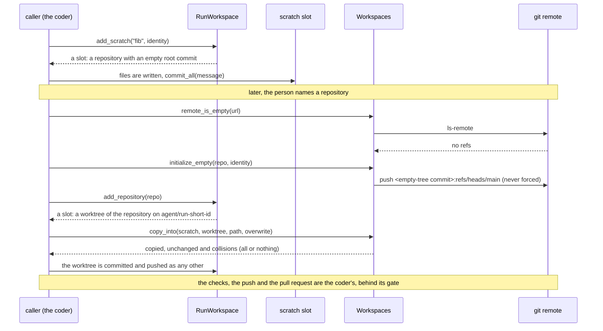
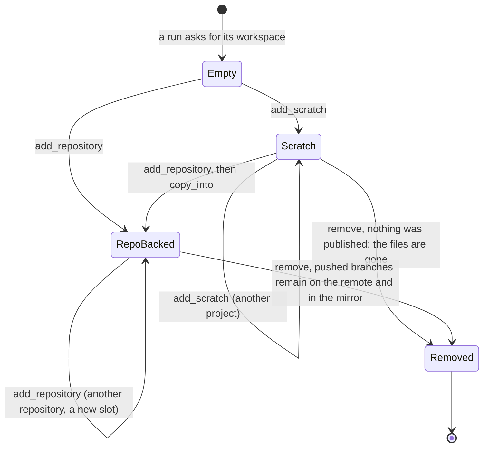

# 0008. A run's workspace holds several repositories and scratch projects

Status: **Accepted** (2026-10-01). The defaults are the ones the slice 7 plan proposed (its D7.2,
D7.3, D7.4, D7.5 and the open question 24 default); the owner may revisit them. This record covers
the workspace model, which `adam-workspace` builds. The coder's use of it (a second repository, the
janitor, the scratch tools) is built by changes of the slice, and the status notes at the end say
which are.

## Context

The owner's words, 2026-10-01: the coder must be useful from the first message, so it has to start
before anyone names a repository (issue #52, "scratch"), take in a second repository when the
person agrees, and not leave a worktree behind for every run that ever existed.

Today a run has **one worktree**: `<root>/worktrees/<run>`, recorded in `<root>/meta/<run>.json`
(`Workspaces::prepare`, `crates/adam-workspace/src/workspace.rs`). *Verified 2026-10-01 at adam
`ee78170`: read that file.* That fits "in repository X, do Y" and nothing else:

* There is nowhere to build something before a repository exists.
* A second repository would need a second run, and the pull request that needs both has no place to
  be made.
* Nothing removes a worktree. `Workspaces::remove` exists and nothing calls it, so finished runs'
  worktrees pile up on the volume.

The orchestration layer's vision says the same from its side: a workspace lives as long as its task
(`docs/vision.md`, capability 6, of
[another-agentic-system](https://github.com/vymalo/another-agentic-system/blob/main/docs/vision.md)).

## Decision

1. **A run's workspace is a directory of slots**: `<root>/workspaces/<run>/<dir>/`. A slot is
   either a **repository slot**, a git worktree of one repository on the run's own branch
   `agent/<run-short-id>` (every operation of a `Worktree` is as it was), or a **scratch slot**, a
   local git repository that no remote has. `Workspaces::run(run)` gives the `RunWorkspace`.
2. **The workspace lives as long as the run.** A run is an A2A task. It lives while it is parked on a
   question and ends at a pull request, a failure or a cancel. Its workspace is deleted when it
   ends, every slot of it, by a sweep of finished runs (the coder's janitor). The run's notes stay,
   and so do its `agent/*` branches in the mirrors: they are the only copy of any unpushed commit.
   Placement is unchanged ([ADR 0002](0002-workspace-placement.md)). **The default for the
   orchestration layer's open question 24, for the MVP:** `WORKSPACE_PLACEMENT=shared`, one coder
   process (`ROLE=all`), one volume. More workers need a volume they share; `flock` on network
   volumes is still *unverified* (ADR 0002).
3. **A slot is called by a name the model can say.** A repository's slot is the repository's name,
   lowercased; if another repository of the run has that name, `<name>-<owner>`; a number after that
   if even this is taken. A scratch slot is the name it is given: `^[a-z0-9][a-z0-9._-]{0,63}$`,
   not ending in `.git`. A repository has **at most one slot per run**: asking again, with another
   base branch or another spelling of its address (`.git`, `file://`), returns its slot.
4. **Slots have an order.** The metadata of a slot records `seq`, the place in the order slots joined
   the run, from 1. The worktree of the legacy layout is 0. "The first repository" of a workspace
   is the first slot in that order (`RunWorkspace::slots_in_join_order`); a change to the work
   environment that has to pick one repository (a devcontainer, planned) uses it.
5. **A scratch project is a place to start, not something that is kept.** It is a git repository on
   `main` with an empty root commit, so `HEAD` exists and the project is committed as it grows. It is
   deleted with the workspace. What it holds reaches a repository only through `copy_into`: the files
   (tracked and untracked ones that `.gitignore` does not exclude), under a directory of the
   repository's worktree, with the executable bit; a symbolic link only if its target is relative and
   stays inside the project; never into `.git`. **It is all or nothing**: a file that is already
   there with other content, a directory or a link in the way, or a link that leaves the project is a
   collision, and any collision means nothing is copied (`overwrite` replaces files that differ, and
   nothing else). The scratch history is **not carried** (OD5 of the plan): the pull request carries
   the new commits made in the repository's worktree.
6. **An empty remote gets a first commit, the only push outside `agent/*`.** A repository that was
   just created has no branch, so a worktree has nothing to start from. `Workspaces::initialize_empty`
   makes a commit of the empty tree (`Initial commit`, by the caller's identity) and pushes it as the
   base branch, never forced, and only when the remote has no ref at all (`Conflict` otherwise, also
   if somebody pushed in between). The coder's gate is unchanged: what reaches the base branch is an
   empty commit, and the work goes through `agent/*` and a pull request.
7. **The metadata has a version.** A slot is recorded in `<root>/meta/<run>/<dir>.json` (version 2:
   `dir`, `seq`, `kind`, for a repository the url, base branch and branch, and for a scratch project
   the repository its files were last copied into (`published_to`), never a credential).
   The legacy worktree and its `<root>/meta/<run>.json` (version 1) are **read as a slot** named after
   the repository, removed with the rest by `RunWorkspace::remove`, and never made again by a
   `RunWorkspace`; `Workspaces::prepare` and `open_existing` stay as single-repository helpers and
   still make and find it. A run that began before an upgrade keeps working, and may add a second
   repository, which mixes the two layouts (tested).
8. **One run's workspace changes by one at a time, across processes.** Adding a slot picks its
   directory and its `seq`, so it and the removal of the workspace take a lock on
   `<root>/workspaces/<run>.lock`, an in-process lock under an exclusive `flock` as the mirror's
   ([ADR 0002](0002-workspace-placement.md), decision 4). The run's lock is taken before a mirror's
   and never the other way round, and never while holding another run's.
9. **Which repository may enter a workspace is the coder's rule, not the workspace's.** The workspace
   accepts what its policy accepts (the hosts, the local paths). The coder lets a repository in only
   when the person named it, agreed to a question the coder's tool wrote about it, or the coder created
   it after the person agreed (the slice 7 plan's D7.3). The model can never grant. That rule is
   built with the tools that ask.

## Consequences

* **The layout changes under runs that are in flight.** A parked run from before the change has its
  worktree in the legacy layout. Reading it as a slot keeps it working, and a legacy run that adds a
  repository mixes the layouts. `RunWorkspace::remove` removes both, so no worktree is left behind by
  the change.
* **Scratch work is lost when the run ends, on purpose.** What the person wants kept must be
  published to a repository they name. The coder tells the model so when it starts a scratch project.
* **One more lock file per run**, `<root>/workspaces/<run>.lock`, removed with the workspace. A
  workspace that is partly gone (a crash in the middle of `remove`) is still listed by
  `Workspaces::runs`, so the sweep finishes it.
* **A remote that is not empty is never given a first commit.** `initialize_empty` refuses it, even
  under another base branch name, so a mistake cannot overwrite or fork what is there.
* **The empty "Initial commit" is a commit on the remote that the person did not make.** It is the
  price of a base to start from; it carries no files.
* **Two repositories in one job leave the gate judging one.** The orchestration layer's gate binds the
  last `branch` artifact; a job that pushes to two repositories is a limitation, recorded as the
  orchestration layer's question 40, not solved here.
* **`flock` on a shared network volume is unverified** (ADR 0002); the run's lock relies on it
  like the mirror's.
* *Verified 2026-10-01 with git 2.43.0 on a local bare repository:* `git ls-remote` of an empty
  repository prints nothing and exits 0, and `git mktree` of empty input writes the empty tree
  `4b825dc642cb6eb9a060e54bf8d69288fbee4904` and prints it. *Unverified:* what GitHub says to a push
  of a first commit to a repository that was just created through its API, which the creation of a
  repository by the coder (a later change) has to check.

## Alternatives considered

* **A workspace per conversation.** A scratch project and a second repository would then outlive the
  task that made them. Rejected: a new task is a new run, and continuing earlier work uses the
  pushed branch ([ADR 0003](0003-a-new-task-continues-the-task-it-references.md)), so the
  conversation already has a durable place for work, and it is git.
* **Carry the scratch history into the repository.** Replaying the scratch commits onto the first
  commit of an empty repository would keep them. Rejected as the default (OD5): it only works for an
  empty repository, and the history of a throwaway start is not what a reviewer reads. It can come
  later for that one case.
* **One worktree per run, with a second repository as a subdirectory of it.** A worktree is a
  checkout of one repository on one branch; nesting another would put its files in the first one's
  commit. Rejected.
* **A scratch project as a branch of a bare mirror.** It would need a remote to name before there is
  one. Rejected: a local repository needs nothing.
* **Copy file by file and report collisions as they come.** A repository left half-populated is a
  state the model has to reason about. Rejected for all or nothing, which says everything in the way
  at once.
* **A lock on the whole workspace root.** One run adding a slot would stop every other run. Rejected
  for a lock per run and one per mirror.

## Status notes

*2026-10-01: built in `adam-workspace` (`RunWorkspace`, `Slot`, `Scratch`, `copy_into`, the remote
helpers, the version 2 metadata; `crates/adam-workspace/README.md`).*

*2026-10-01: the coder uses it (`bin/adam-coder/README.md`, "The workspace of a run"). Built: the slots
of a run (`prepare_workspace` adds one for each repository the person named, as it always required);
the optional `repo` argument of `run_command`, the file tools, `delegate_to_opencode`, `run_checks`,
`commit_and_push` and `open_pull_request`; the checks recorded per slot, with the gate of
`open_pull_request` unchanged (the most recent check of the pushed tree, from any slot, out of the last
32 records of the run's notes); a run that began in the legacy layout, which keeps working; and the
janitor of decision 2, a worker component of the host (`Agents::worker_component`, `WORKSPACE_SWEEP_SECS`,
300 by default and `0` for off). Not built yet: the scratch tools, the coder's question about a
repository the person did not name (decision 9; until then the rule is the one that was already there,
the person named it), the creation of a repository, and `copy_into` as a tool.*

*2026-10-01: the scratch tools are built (`bin/adam-coder/README.md`, "Scratch projects"). `start_scratch`
makes a scratch slot, and every tool that works in a slot works in it (the file tools, `run_command`,
`run_checks`, `delegate_to_opencode`); `commit_and_push` there is a local commit and `open_pull_request` is
refused. `publish_scratch` puts the project into a repository **the person named** (the coder's rule of
decision 9, the one `prepare_workspace` applies, until the tool that asks the person for another repository
exists): an empty remote is given its first commit (decision 6), a repository that already has files needs a
`path` or `overwrite`, which the person decides, and the files are copied all or nothing (decision 5). The
project records `published_to` (decision 7), and says so to the model that goes on editing it. The gate is
unchanged, and it is what carries the project's checks over: they bind the pushed commit when the worktree
after the copy has the same tree, so a project that lands unchanged in an empty repository needs no second
check, and any other tree is unchecked until `run_checks` has run on it. Not built yet: the coder's question
about a repository the person did not name (decision 9), and the creation of a repository.*

*2026-10-01 (slice 7, A7): the coder's question about another repository is built (decision 9, the part
about the person's yes; `bin/adam-coder/README.md`, "Another repository, only with the person's yes").
`request_repository { repo_url, reason }` parks the run on a question the **tool** writes (it names the
repository, quotes the model's reason, capped at 300 characters, and offers a yes and a no: a form where the
screen can draw one, the options as text where it cannot), and only a yes grants the repository. The grant is
recorded by the agent before each step from the conversation: the person's answer to that call (the result of a
call that did not fail, or the inbox while the run is parked on it) is paired with the call by position and
grants the repository of that call's argument, never what the model said and never the answer to a question
the model wrote with `ask_user`. A yes is the form's option or, in words, exactly `yes`, `y` or the option's
label. `RunNotes::named_repos` now means the granted keys, and `RunNotes::consents` keeps every answer, a
refusal included, so that a repository the person turned down is not asked about again. The workspace gained
one thing for it: `Workspaces::check_repository`, the policy alone, so that a repository that could never be
added is not asked about. `prepare_workspace` and `publish_scratch` are unchanged except that their refusal
now points to the tool. The third way a repository is granted is built too (A8, below).*

*2026-10-01 (slice 7, A8): the coder creates a repository on request (decision 9, the third way a repository
is granted; [ADR 0009](0009-github-per-installation-read-through-mcp.md), decision 9, and `bin/adam-coder/README.md`,
"A repository of its own, on request"). `create_repository` asks the person, creates the repository empty after
a yes, and grants it by the key of its clone URL; `RunNotes::created_repos` records it. A scratch project is then
published to it with `publish_scratch`, as to any granted repository.*
