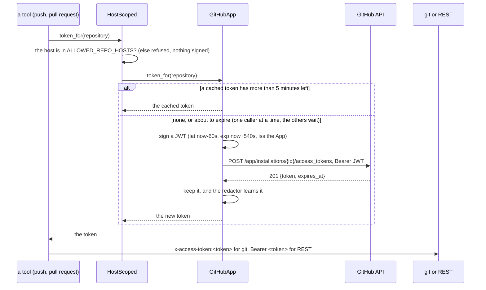
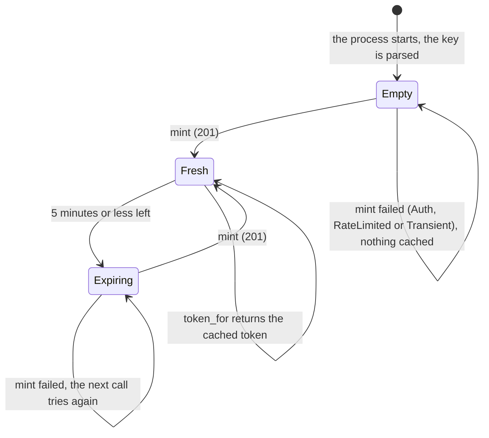

# 0009. GitHub per installation: an App or a token, and GitHub read through MCP

Status: **Accepted** (2026-10-01). The defaults are the ones the slice 7 plan proposed (its D7.1,
D7.6, D7.7 and D7.8); the owner may revisit them. This record covers how the coder authenticates to
GitHub, which `adam-workspace` and the coder build, and the two decisions around it that later changes
of the slice build: the coder's own tools stay in process, and GitHub is *read* through the official
GitHub MCP server. The status notes at the end say which are built.

## Context

The coder has one static `GITHUB_TOKEN` (`bin/adam-coder/src/config.rs`), scoped to
`ALLOWED_REPO_HOSTS` by `ScopedToken` (`crates/adam-workspace/src/credentials.rs`). *Verified
2026-10-01 at adam `2e259a3`: read both.* A personal access token belongs to a person, lives until
someone revokes it and reaches everything that person can. A deployment for a team wants an identity
of its own, scoped to the repositories it was installed on, whose credentials expire by themselves: a
**GitHub App installation**.

The `GitCredentials` port already asks for a token *per repository* ("static in the MVP; a broker
later"), and `git` and the REST client already take a token per call. So the seam exists; what is
missing is a source of tokens that is not a constant.

*Verified 2026-10-01 against docs.github.com* ("Generating a JSON Web Token (JWT) for a GitHub App",
the REST reference of `POST /app/installations/{installation_id}/access_tokens`, "Authenticating as
a GitHub App installation"):

* The App signs a JWT with `RS256`. Its `iat` is best set 60 seconds in the past against clock
  drift, its `exp` is at most 10 minutes ahead, and its `iss` is the App's client ID or its
  application ID.
* The JWT, as a bearer, is traded at `POST /app/installations/{id}/access_tokens` for
  `201 {"token", "expires_at", ...}`. A bad JWT, a forbidden or an unknown installation is `401`,
  `403` or `404`.
* An installation access token expires after one hour. It is the password of `x-access-token` for
  git over HTTPS and a bearer for the REST API.
* GitHub began a staged rollout of a longer, stateless token format on 2026-04-27, so nothing may
  depend on a token's length or characters.

The official GitHub MCP server (`github/github-mcp-server`), as the slice 7 plan read it on
2026-10-01 (its README, `docs/github-app-auth.md`, `docs/streamable-http.md` and the releases; *not
read again by this change*): the `stdio` mode takes either `GITHUB_PERSONAL_ACCESS_TOKEN` or a GitHub
App (`GITHUB_APP_ID`, `GITHUB_APP_INSTALLATION_ID`, and `GITHUB_APP_PRIVATE_KEY_PATH` or
`GITHUB_APP_PRIVATE_KEY`) and mints and renews the installation token itself; the `http` mode takes
the client's bearer on each request, and App auth is not documented for it. It has `--read-only` and
`--toolsets`. Whether the exact tool names and the empty-variable behaviour hold for the pinned image
is *unverified*, and the change that ships the server checks it.

## Decision

1. **The coder is authenticated one of two ways, exactly one.** A **token** (`GITHUB_TOKEN`, as
   before) or an **App installation** (`GITHUB_APP_ID`, `GITHUB_APP_INSTALLATION_ID` and one of
   `GITHUB_APP_PRIVATE_KEY_PATH` or `GITHUB_APP_PRIVATE_KEY`). The names are the ones
   github-mcp-server reads, so one set of variables serves both. Both set, a partial App set, or
   neither is a configuration error (exit 78) that lists every problem and never a value.
2. **The key is parsed at startup.** A file that cannot be read, a PEM with no private key, a key that
   is not RSA of 2048 to 8192 bits, or an encrypted one stops the process, so a deployment learns of
   it when it rolls out and not at the first push. PKCS#1 (what GitHub lets the owner download) and
   PKCS#8 are accepted. A key in a variable accepts `\n` escapes, for the places that cannot hold a
   multi-line value. A rotated key needs a restart.
3. **`adam_workspace::GitHubApp` mints the tokens, behind the existing port.** It implements
   `GitCredentials`: `token_for` returns the cached installation token while more than five minutes
   of it are left, and otherwise mints one, under a lock so that however many callers wait there is
   one request. The JWT is `{"alg":"RS256","typ":"JWT"}` with `iat` now minus 60 s, `exp` now plus
   540 s and `iss` the App (a number when the ID is one, a string for a client ID), signed with
   `aws-lc-rs` and `RSA_PKCS1_SHA256`. The request carries `Accept: application/vnd.github+json` and
   `X-GitHub-Api-Version: 2022-11-28`. The token endpoint is `{GITHUB_API_URL}/app/installations/{id}/access_tokens`,
   so GitHub Enterprise Server and a mock need no other setting. A failed mint is not cached.
4. **The host is checked before anything is minted.** The coder wraps the App in `HostScoped`, which
   applies `ScopedToken`'s rule to any credentials: a repository on a host that is not in
   `ALLOWED_REPO_HOSTS`, and every local remote, is refused before a JWT is signed. Whoever chooses a
   repository URL cannot make the coder sign anything or send an installation token anywhere.
5. **Mint failures are typed, and the run is told what to check.** `401`, `403` and `404` are
   `Auth`, and name the variables; a run that ends at one fails naming `GITHUB_APP_ID`,
   `GITHUB_APP_INSTALLATION_ID` and the key (the coder's completion policy, as for a bad token). `429`
   and a `403` with no rate limit left are `RateLimited`, with the `Retry-After` GitHub gave.
   `5xx`, a transport failure and an answer that cannot be read are `Transient`. Neither the JWT nor a
   token is in a message, a `Debug` output or a log line.
6. **A minted token is a secret from the moment it exists.** The coder's `Redactor` is shared (its
   values live behind one lock, so clones see what is added), and the credentials the coder gives
   the workspace register every token they hand out. The key's PEM and its base64 body are
   registered at startup. At most 16 minted tokens are remembered, oldest forgotten first, which is
   more than the tokens one process can have in flight (one lives for an hour, one is minted five
   minutes before the last runs out). The key is hidden from OpenCode and from the project's commands
   (`GITHUB_APP_PRIVATE_KEY`, as `GITHUB_TOKEN` is); a key *file* is only a path.
7. **The trusted toolset stays in adam-coder, in process (D7.1).** What must hold, the sandbox, the
   named-repository rule, consent, checks bound to the pushed commit, publishing and the pull request
   behind the gate, and the creation of a repository, is the coder's own `#[tool]`s. A process
   boundary would not make them more trusted, and it would move the completion policy and the run
   notes out of the agent, make adam-mcp pass the host's grants in `params._meta` and artifacts and
   progress through, and make MCP calls retry-safe. Serving the toolset over MCP later is possible
   (an rmcp server, the grants in `params._meta`) and is not decided here (the plan's OD1).
8. **GitHub is read through the official server, read-only (D7.8).** The coder's `mcp.json` names
   the official binary over stdio, started with `--read-only` and a toolset allow-list, and a `tools`
   allow-list of read tools, so the model can read repositories, issues, pull requests and files and
   cannot write: **writes stay the coder's own** (decision 7), because they are what the gate guards.
   Production runs the binary inside the coder image; development and the e2e point the coder at a
   mock over http. In App mode the server gets the same `GITHUB_APP_*` variables, the key as a *file*
   (the key in a variable is not passed to a child).
9. **Creating a repository is off unless the deployment says who it may be created for (D7.7).**
   `CREATE_REPO_OWNERS`, empty means off; the repository is private and empty; the person is asked
   every time, by a question the coder's tool writes; the credential is the same installation (an
   App needs the `Administration` permission for an organisation, and creates in organisations
   only) or token (`repo` scope).

## Consequences

* **A deployment chooses per installation.** The same image runs with a token or an App. The chart
  (`github.auth: token|app`) and the compose override (`dev/compose.github-app.yaml`) do both.
* **The App's key is a long-lived secret in the pod**, a mounted file or a variable, and every pod
  that runs workers has it. A control plane has none of it. The key is never in the chart, in a log
  or in a tool result (the redactor), and a rotated key needs a restart.
* **An installation token is valid for an hour, and a push can be made with it for as long.** The
  coder replaces it five minutes early, so a step that began just before the margin has the rest of
  the margin. A token that leaks is good for what is left of its hour; the redactor is the defence
  inside the process.
* **One more hop at the start of every hour**, and a dependency on GitHub's token endpoint, where a
  token had none. A failed mint is a typed error for the step: `Transient` and `RateLimited` are the
  retryable classes of the host's error model, `Auth` is not.
* **`aws-lc-rs` and `rustls-pki-types` are direct dependencies of `adam-workspace`'s `github`
  feature.** Both were already in the tree under `rustls`; the features chosen add no new package.
* **The installation token's reach is the App's.** A repository the App is not installed on fails with
  `Auth` at `git` or at the REST call, not at the mint, and the run's error names the variables.
* *Unverified:* GitHub Enterprise Server's token endpoint and its rate-limit headers (the code reads
  `GITHUB_API_URL` and the standard headers), and a live App against github.com. What is tested is a
  mock: `cargo test -p adam-workspace --test github_app` checks the JWT's signature, `iss` and
  lifetime and the cycle (refresh margin, one request for 16 callers, the typed errors) with a key
  made for the run, and the compose e2e checks that the mock saw a JWT-shaped bearer and that every
  call to the repositories' API carried the token it gave (WireMock does not check the signature).

## Alternatives considered

* **Let github-mcp-server hold the App and give the coder a token from it.** The server's App mode is
  `stdio`-only and exposes no token; the coder needs tokens for `git` and for its own REST calls
  anyway. Rejected.
* **A token broker outside the process.** A sidecar or a service that returns tokens. More moving
  parts for a one-endpoint exchange. Not needed now, and not excluded: `GitCredentials` is the port,
  and a broker is another implementation of it.
* **A JWT crate and a GitHub client crate (`jsonwebtoken`, `octocrab`).** More dependencies for 60
  lines, and the second is a host SDK in all but name. Rejected for `aws-lc-rs`, which `rustls`
  already brings, and `reqwest`, which the REST client already uses.
* **Mint on every call.** Simple, and at most a request per push, but a run pushes, comments and
  polls several times a minute against a rate limit that counts per installation. Rejected for the
  cache.
* **Hold the old token on a failed refresh.** The cached token is good for five more minutes at the
  refresh margin. Rejected for now: the failure is rare and a step that fails with `Transient` is
  retried, which is simpler than a second state. It can come later without a change of interface.
* **A separate MCP-server process for the coder's own tools (OD1).** Decision 7. Left to the owner
  with the cost of about three more changes and a replay risk.

## Status notes

*2026-10-01: decisions 1 to 6 are built, in `adam-workspace` (`GitHubApp`, `AppKey`, `HostScoped`) and
in the coder (`GitHubAuth`, the shared `Redactor`, `RedactingCredentials`; `bin/adam-coder/README.md`,
"GitHub credentials"), with the chart (`github.auth`) and the compose override. Not built yet:
decision 8 (the GitHub MCP server in the coder image and its mock) and decision 9 (the creation of a
repository). Decision 7 is the state of the code.*
