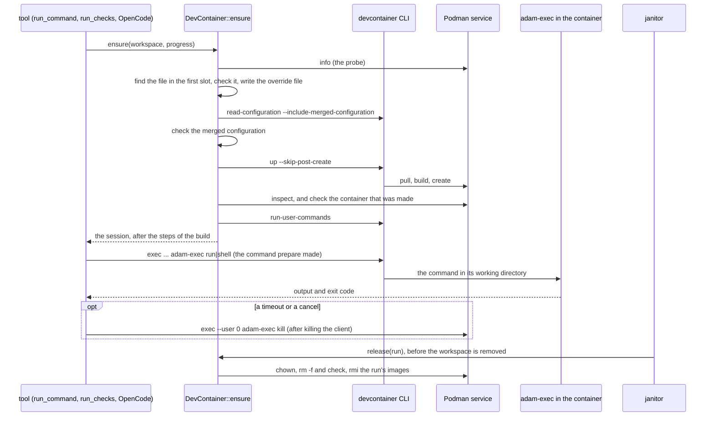
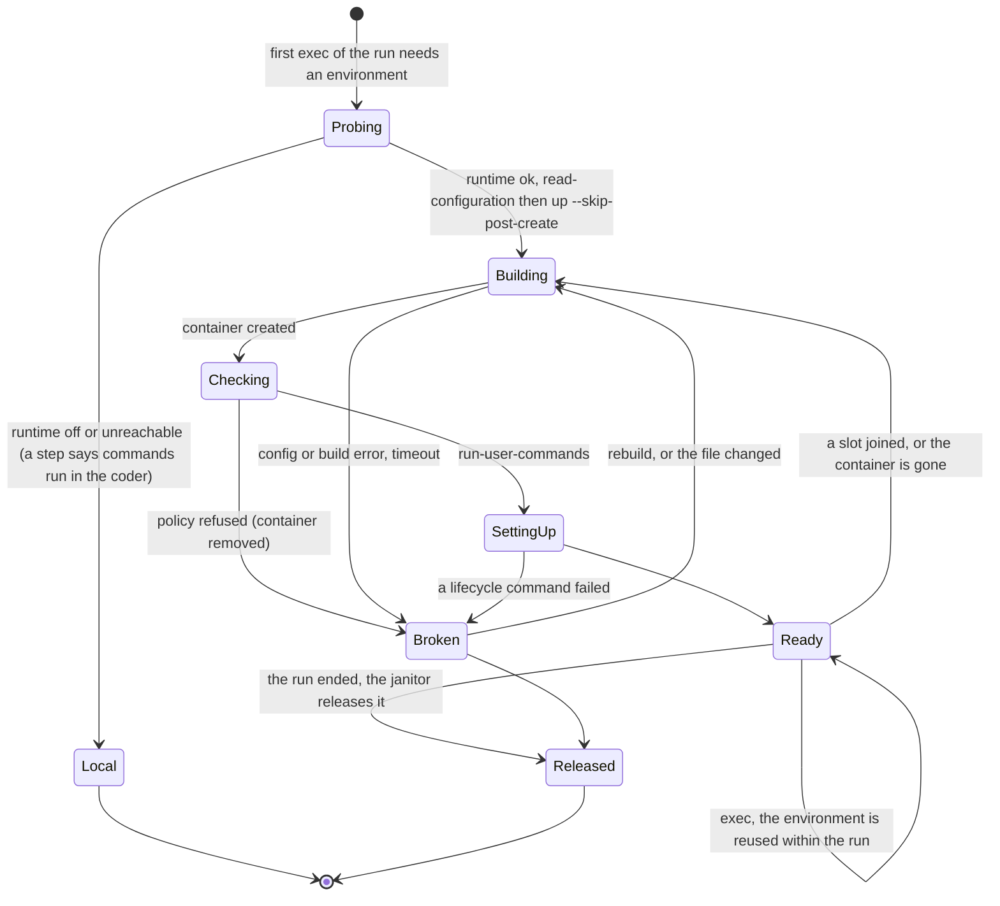

# 0010. A run works in its repository's devcontainer, on a rootless Podman service

Status: **Accepted** (2026-10-01), an owner decision ("Can't we use devcontainers to build work environments?",
then "Go with 7b after slice 7"). It follows the orchestration layer's
[ADR 0028](https://github.com/vymalo/another-agentic-system/blob/main/docs/decisions/0028-devcontainer-json-is-the-workspace-environment-contract.md)
(`devcontainer.json` is the workspace environment contract), which decides *what*; this record decides *how
adam-rs does it*. The defaults listed under [Defaults the owner may revisit](#defaults-the-owner-may-revisit) were
chosen by the plan, not by the owner. **Built:** the crate `adam-devcontainer` (`DevContainer`, an `Environment` of
`adam-workspace`), the Podman service of the dev stack, their tests and CI job, and the coder's use of them (its configuration, its
tools, OpenCode inside, the image, the end to end). The status notes at the end say which change built what.

## Context

The coder runs every command in its own container: `run_command`, `run_checks`, OpenCode, and every command
OpenCode starts. One image has to carry the toolchain of every repository it will ever meet, and a repository
cannot say what it needs. Slice 7 built the seam for changing that without changing the tools: the
`Environment` and `EnvSession` traits of `adam-workspace` (`crates/adam-workspace/src/environment.rs`), with
`Local` (the coder's own container) as the one implementation, the janitor that releases an environment before
it removes the run's workspace, and the order slots joined a run (`Slot::seq`). This record is the second
implementation.

The facts below are what the decision rests on. Each says how it is known.

**The devcontainer CLI** (`@devcontainers/cli` 0.89.0, MIT, no runtime dependencies):

* *Verified 2026-10-01 by reading its own `--help` (npm package 0.89.0) and its source at the tag `v0.89.0`
  (`src/spec-node/devContainersSpecCLI.ts`, `src/spec-utils/log.ts`):*
  * `up`, `read-configuration`, `run-user-commands` and `exec` take `--docker-path`, `--workspace-folder`,
    `--config`, `--override-config`, `--id-label` (repeatable; "set on the container and used to query for an
    existing container"), `--mount-workspace-git-root` and `--log-format text|json`.
  * `up` also takes `--remove-existing-container`, `--skip-post-create`, `--no-lockfile`, `--gpu-availability
    all|detect|none` and `--container-session-data-folder`; `read-configuration` takes
    `--include-merged-configuration` and has no `--container-session-data-folder`; `exec` takes `--remote-env` and
    `--default-user-env-probe` and not `--container-session-data-folder`. There is no `down` or `remove`.
  * `up` prints one JSON line on standard output, `{"outcome":"success","containerId","remoteUser","remoteWorkspaceFolder"}`
    or `{"outcome":"error","message","description",...}` with exit code 1; `read-configuration` prints
    `{"configuration","workspace","featuresConfiguration","mergedConfiguration"}`; `run-user-commands` prints
    `{"outcome":"success"|"error",...}`. Logs go to standard error, and with `--log-format json` each line is
    `{"type":"text"|"raw"|"start"|"stop"|"progress","level","timestamp","text"}`. A lifecycle hook announces itself as
    `Running the <hook> from <origin>...`.
  * `exec <cmd> [args..]` reads its arguments with an option parser (an argument such as `--version` after the command
    is parsed unless something stands before it), and with `--log-format json` it uses a terminal.
  * For Podman, the CLI adds `--security-opt label=disable`, and `--userns=keep-id` when the effective user (the
    `remoteUser`, else `--user`, else the image's user, else root) is not root (the bundle's function `uW`).
* *Verified 2026-10-01 by running it, in the slice 7b planning (Docker 29.6.2, kernel 6.18, the CLI 0.89.0,
  `quay.io/podman/stable:v5.8.7-immutable`; **not re-run for this change**, which was written where no Podman runs, and
  the CI job `devcontainer` repeats it):* `--override-config` supplies the content while the config file's directory stays
  the repository's, so a relative `build.dockerfile` resolves there; without `--no-lockfile` the CLI writes
  `devcontainer-lock.json` into the worktree; `exec` with a text log passes standard input and output through and
  returns the exit code; **killing the `exec` client leaves the process inside running**; `podman rm -f` may print an
  error ("removing exec sessions ... openByHandleAt failed") and still remove the container.

**Rootless Podman in a container** (the same planning runs): with Docker's default seccomp profile nested containers
fail (`cannot clone`); with containers' `seccomp.json` (which allows `unshare`, `clone`, `clone3` and `mount`) and
`systempaths=unconfined` (else `crun: mount proc`) they run, as uid 10001, with `--userns=keep-id` (files in a
bind-mounted directory stay 10001's outside), `--network=none` and the shared network namespace; there is no
`/dev/fuse` (storage is native overlay on the volume) and `pasta` needs `/dev/net/tun`, which is not given. The service
(`podman system service`) makes a socket of mode 0600. No `privileged`, no `cap_add`, no `devices` were needed. The
`docker-default` AppArmor profile has `deny mount,` (moby/profiles `apparmor/template.go`), hence `apparmor=unconfined`.

**What this change checked itself (2026-10-01):**

* The pinned image: `quay.io/podman/stable:v5.8.7-immutable` is the manifest list
  `sha256:f345d8d4fddea244d3a1ced27bcec82d14cc9e32cb5ead7f5882b0baf59dc8b0` (quay.io's API).
* The seccomp profile: Podman v5.8.7's `go.mod` requires `go.podman.io/common v0.67.2`; the profile is
  `common/pkg/seccomp/seccomp.json` of containers/container-libs (the successor of the archived containers/common) at
  that tag, commit `62c711d302a4349b959816d5f3d1b5d8b3a7df73`, sha256 `2598b3b9...` (`dev/podman/README.md`). It allows
  the same syscalls as the copy the planning used, with more rules that refuse `socket` for some address families.
* The shapes of `podman inspect` (`HostConfig.Privileged`, `CapAdd`, `SecurityOpt`, `Devices`, `NetworkMode`, `PidMode`,
  `IpcMode`, `UsernsMode`, `Mounts[].Type|Source|Destination|RW`, `ImageName`, `State.Running`), `podman ps --format json`
  (`Id`, `State`, `Labels`) and `podman images --format json` (`Names`), against Podman v5.8.7's own source
  (`libpod/define/container_inspect.go`, `libpod/container_inspect_linux.go`, `pkg/domain/entities/types`). Two things
  the source says that a guess would have got wrong: `UsernsMode` is `"private"` or empty and never `keep-id` ("TODO: Rootless
  has an additional 'keep-id' option, presently not reflected here"), so `keep-id` is derived from the `remoteUser` the CLI
  reports, and nothing depends on it (the release maps ids through the container's own id map); and `IpcMode` is `host` when
  the spec has no IPC namespace, which is the case when the service's `containers.conf` says `ipcns="host"`.

**Unverified**, to be checked by the CI job `devcontainer` and by the e2e of the next changes:

* Ubuntu 24.04 runners set `kernel.apparmor_restrict_unprivileged_userns=1`, which the service needs off (a secondary
  source, marcioapm/lux#35). Where it stays on, the coder falls back to `Local` with a step: it degrades, it does not break.
* ~~Podman's remote client of the distribution against the 5.8.7 server.~~ *Settled 2026-10-01 by the CI job:* Ubuntu
  24.04's `podman-remote` is 4.9.3; it pulled and inspected, but the CLI's image build against the 5.8.7 service hung until
  the timeout. The client is the static `podman-remote` of the same release as the service (containers/podman v5.8.7,
  `podman-remote-static-linux_amd64.tar.gz`, sha256 `01b5ac59…5e7e` from the release's `shasums`, *verified 2026-10-01*),
  in CI and in the coder's image.
* *Settled 2026-10-02 by the CI job:* a container's `/proc/self/uid_map` is relative to the rootless service's own
  user namespace, not to the host's. Handing the coder's host uid (10001) to `adam-exec chown` gave the workspace to
  110000 (a subuid) and the coder could not delete it. `release` now first numbers the ids as the service does
  (`host.idMappings` of `podman info`: the service's own user, which is the coder's, is 0), and leaves the files
  alone, with a warning, when the service has no number for them.
* That Compose resolves the relative path `seccomp=./dev/podman/seccomp.json` (`PODMAN_SECCOMP` overrides it).
* DNS to a compose service name from a devcontainer in the service's network namespace; egress from nested containers.
* That the inspect check does not refuse a container for a `SecurityOpt` the service's `containers.conf` adds (the check
  names the option it refused, so the first run says), and that the nested container's `Mounts` has no bind of the
  service's `/proc` (the upstream image's user-level `containers.conf` adds one; the `agent` user of `dev/podman/Containerfile`
  has none, and the inspect check refuses a bind that is not ours either way).
* `git status` inside a slot whose mirror is read-only; OpenCode's native binary inside a glibc image (the coder's change: its end to end, `dev/coder-e2e.sh` `SCENARIO=devcontainer`, runs OpenCode there).

## Decision

1. **A new crate, `adam-devcontainer`, implements `Environment`.** `DevContainer` is a composition of two commands
   it does not link to: the devcontainer CLI and Podman's remote client, run as child processes. The crate has no
   dependency on an agent host, a gateway product or a container SDK; the only new dependency is `jsonc-parser` (MIT),
   for the file's comments and trailing commas. A binary chooses it at build and configuration time
   (`DEVCONTAINER_RUNTIME=podman`); there is no plugin.
2. **The seam is the one slice 7 built** (`crates/adam-workspace/src/environment.rs`, as built, not as first sketched):
   `ExecSpec` has a `hide` list (names of the caller's own variables a process must not see), `Local::kill` does nothing,
   `ExecId` is a string, and the janitor releases the runs `held_runs()` returns that are over. `DevContainer` makes a
   `PreparedCommand` that is `devcontainer exec` with an empty environment plus an allow-list, and the file tools and git
   stay in the coder. The one addition to `adam-workspace` was `Worktree::mirror()`, which an environment that runs `git`
   in a worktree needs (the `.git` file of a worktree points into the shared bare mirror); the coder's change adds two defaulted methods to the port
   (see the 2026-10-02 status note).
3. **Which file.** The first slot in `Slot::seq` order decides, once, for the whole run; a scratch slot counts. The lookup is
   `.devcontainer/devcontainer.json`, `.devcontainer.json`, then the first of `.devcontainer/<folder>/devcontainer.json` in
   sorted order (a step names the others). A first slot with none gets `Settings::default_image`. Later repositories are mounted
   into the same container and their own devcontainer is ignored (a step says so). A workspace of the older layout stays `Local`.
4. **The file is untrusted, and the policy is checked three times** (on the file, on `mergedConfiguration`, on `podman inspect`
   of the container made, which has the last word and removes the container). Refused: `privileged`, a capability other than
   `SYS_PTRACE`, a `securityOpt` other than `seccomp=unconfined` and `label=disable`, a `bind` mount, `volume-opt` and
   `volume-driver`, a mount over `/opt/adam` or `/run/adam`, `dockerComposeFile`, `runArgs` outside a short list, a label of the
   coder's prefix, `build.options`, and a build context, Dockerfile or local feature that leaves the repository (the last two
   are additions to the plan: a build context of `../../..` would put the workspace root, with every other run and the coder's
   own files, into an image). `initializeCommand` is removed; `appPort`, `forwardPorts` and `portsAttributes` are removed;
   `workspaceFolder`, `workspaceMount`, `mounts` and `runArgs` are made as `override_file.rs` says. A configuration or
   Dockerfile path is read as the CLI reads it, relative to the file's directory, which `--config` keeps the repository's.
5. **The runtime is a rootless Podman service, never the host's Docker socket.** The service container has no `privileged`, no
   `cap_add` and no `devices` (`dev/podman/`, `dev/compose.devcontainer.yaml`); it is the trust boundary and is trusted like the
   coder. One service serves one workspace volume, mounted at the **same path** in both. A deployment without one runs with
   `DEVCONTAINER_RUNTIME=off`, the default.
6. **Credentials never enter.** Every process of this crate starts with an empty environment and `PATH`, a `HOME` of its own,
   `CONTAINER_HOST`, `LANG`, `TMPDIR`. The GitHub token and App key stay with git in the coder; `DATABASE_URL`, the bearer tokens
   and the thread-tools token are not passed. OpenCode's model key is the file `/run/adam/secrets/model-key` (mode 0600, mounted
   read-only), named by `EnvSession::secret_ref`; no secret is on an argument list, and every log and error is scrubbed.
7. **Nothing happens silently.** Making an environment is one step (id `environment`) that carries the CLI's phase, then
   "ready in N s" and the list of changes made to the file, or the failure; other steps say that a repository joined, that the
   environment was lost and is made again, which devcontainer is used, and that the run is in the coder's own environment
   and why. A broken file is an error that names the file and the key or phase, carries the last 40 lines of the log
   (scrubbed), and is kept (`Broken`) until the file changes or `rebuild` is called: no silent fallback to the default image.
8. **Teardown.** `release(run)` gives the tree back to the coder's ids (`adam-exec chown`, mapped through the container's id map),
   removes the run's containers by label and **checks by listing** (`rm -f` exit codes are not trusted), removes the `vsc-*`
   images the CLI built for the run (never a pulled base image) and the run's directory. `held_runs()` finds orphans by label and
   by directory, for this deployment only. Process cleanup has three backstops, since killing the `exec` client does not stop
   what it started: `adam-exec kill` (the process, its descendants and, when it leads a group, its group), then the container's
   removal.
9. **Kubernetes stays `Local`** until the platform has a sandbox provider.

### The sequence

### The lifecycle

`state.json` (`<root>/environments/<run>/`) keeps the phase, the digest of the file, the slots the container was made with,
the container and its image, and a `Broken` error. Every `ensure` on `Ready` checks with one `podman ps` that the container
is there and running; a container that is not is made again (`--remove-existing-container`, and the repository's lifecycle
commands run again). A probe's answer is reused for 30 seconds; a run that fell back to `Local` stays there, so that its
commands do not change environment half way. An `ensure` is single-flight per run (an in-process lock, then a `flock` of
`<run dir>/lock`), and the caller may drop it: a half-made environment is `Building` in `state.json` and is made again, with
its partial container removed by label.

## Defaults the owner may revisit

| Id | Topic | Default | Alternative |
|---|---|---|---|
| OD-B1 | Compose-based devcontainers | Refused, with a clear error | `docker compose` against the Podman socket: needs the compose CLI in the coder and the policy on every service |
| OD-B2 | Privileges | `capAdd` only `SYS_PTRACE`; `securityOpt` only `seccomp=unconfined` and `label=disable`, both under the service's own filter; `privileged`, other capabilities and binds refused (so no Docker-in-Docker) | Refuse those too, which breaks the official rust, go and cpp features |
| OD-B3 | A repository joins the run | Recreate the container, so the mirror is mounted and the lifecycle commands run again | No restart, and no git inside the slot that joined late |
| OD-B4 | A broken file | An error, and the person decides (`rebuild(run, use_default)`) | Fall back to the default image on its own, with a warning step |
| OD-B5 | The read-only mirror | Mounted, so git can read inside; it also shows other runs' local branches of the same repository | No mirror, and no git inside |
| OD-B6 | A toolchain devcontainer feature | None; the toolchain stays in the `workspace` image, and the one tool the agent needs inside, OpenCode, is mounted | A small `opencode` feature, for musl images |
| OD-B7 | The default image in tests, and pruning | The small MCR base image in the stack and in CI; the `workspace` image in production; per-run images are removed, pulled base images stay | Test with the real image every time (about 9 GB more per runner) |
| OD-B8 | The container's network | The service's own (`--network=host`), which the deployment limits | `none` by default, which needs a per-run model proxy in the coder |
| OD-B9 | No runtime | Run in the coder's own environment, with a visible step | Fail closed when the repository declares a devcontainer |
| OD-B10 | *(added here)* A file with a path that leaves the repository | Refused (`build.context`, `build.dockerfile`, local features), and `build.options` | Allow a context above the repository, which puts other runs' files into an image |

## Consequences

* A repository says what it needs, in a file other tools read; the coder's image no longer has to be every repository's
  environment. The cost is a Podman service beside every coder (images are stored a second time, the first run of an
  environment pays for a pull or a build), and a host may need a setting (the Ubuntu sysctl).
* Where the service cannot run, the coder degrades to its own environment with a step that says so.
* A new class of untrusted input is accepted, and the policy is the control. The residual risks are the plan's: an escape lands
  in the Podman service, which sees every run's `/work` and its socket but holds no GitHub credential; there are no per-container
  limits (nested cgroups are off), so one run's build can slow the others and the service's own `cpus`, `mem_limit` and
  `pids_limit` bound them all; a process that leaves its parent and its group inside the container stays until the container is
  removed; the mirror shows other runs' local branches of the same repository (OD-B5). It is not isolation between tenants:
  stronger isolation (a service per run, gVisor, the platform's sandbox) comes after the MVP.
* The inspect fixtures of the unit tests are hand-written in Podman's documented shapes, so the gated test and the CI job are the
  proof that a live Podman answers as they do.

## Alternatives rejected

* **envbuilder** (builds a devcontainer from inside a container): its README says it is in maintenance mode (ADR 0028, verified
  2026-10-01). The official CLI is the reference implementation.
* **The host's Docker socket**: it would hand the coder, which holds credentials, control of the host's containers.
* **A privileged or Docker-in-Docker service**: not needed (see the facts above).
* **`seccomp=unconfined` for the service**: broader than the containers profile, which is enough.
* **The upstream image's `/proc` bind into nested containers**, instead of `systempaths=unconfined`: a devcontainer would see
  every run's processes and read the environment of any process with the same uid.
* **Reading the state of a run from Podman only** (no `state.json`): a `Broken` environment has no container to ask, and the digest
  of the file that broke it has to be somewhere.
* **Parsing `podman inspect` for `keep-id`**: Podman does not report it (see the facts).

## Status notes

*2026-10-01: built in the crate `adam-devcontainer` (`README.md` there): `DevContainer`, `Settings`, `Runtime`, `Network`;
the policy, the override file, the state, `adam-exec`; `dev/podman/` (the service, the pinned seccomp profile),
`dev/compose.devcontainer.yaml`; unit tests, stub-based tests of every call, the gated test against a real Podman, and the CI
job `devcontainer`. Not built: the coder's configuration (`DEVCONTAINER_*`), its tools and their routing through the
environment's session, OpenCode inside the container (`AcpCommand` cannot clear its environment yet), the `rebuild_environment`
tool, the janitor's use of `held_runs`, the image with the CLI and Podman's client, the fixtures `local/devbox` and
`local/devbox-broken` for the end to end, and the orchestration layer's end to end (slices 7b-2, S7b-1 and S7b-2). The facts
marked unverified above have not run yet in this repository.*

*2026-10-02: the coder uses it (slice 7b, A7b-2; `bin/adam-coder/README.md`, "The work environment"):*

* **Configuration and start.** `DEVCONTAINER_RUNTIME` (`off` by default, or `podman`), `CONTAINER_HOST`, `DEVCONTAINER_DEFAULT_IMAGE` (default: the
  `workspace` image of `another-agentic-images` the coder is built on, **by digest only**, *verified* 2026-10-01 by an anonymous manifest request and
  its config's `devcontainer.metadata` label; the devcontainer CLI 0.89.0 cannot parse a reference with both a tag and a digest, which CI's real-Podman job
  found, so a value for it is `name@sha256:...` too; a test keeps the tag that digest was published as equal to the Dockerfile's `WORKSPACE_TAG`), `DEVCONTAINER_NETWORK`, `DEVCONTAINER_DEPLOYMENT_ID`,
  the two timeouts, `DEVCONTAINER_PREPULL`, `DEVCONTAINER_CLI`, `DEVCONTAINER_PODMAN` and `OPENCODE_BINARY` (a native executable, checked at start): an
  invalid value is exit 78, nothing connects first. A start with `podman` writes the tools directory (a failure stops it), probes the service (a
  service that does not answer is a warning: runs fall back to the coder's own container, with a step, until it does) and pulls the default image in
  the background. **`DevContainer` is the coder's `Environment` even with the runtime `off`**, which is how a repository that has a devcontainer is
  told, once per run, that this deployment does not use it.
* **Routing.** `run_command`, `run_checks` and `delegate_to_opencode` went through the session already (slice 7); what this change adds is
  OpenCode from where the environment has it (`EnvSession::tool_path`), its key as `{file:...}` (`EnvSession::secret_ref`), `AcpCommand::clear_env` for the CLI's
  own empty environment, `opencode --version` once per environment (a musl image gets a refusal and the other tools go on), the refusal under
  `DEVCONTAINER_NETWORK=none`, the `environment {kind, source?, image}` of the `checks` artifact, and a missing tool's answer that says which environment
  lacks it. A broken environment is a **permanent** error that tells the model to ask the person (OD-B4: no fallback), and `rebuild_environment {use_default?}` is
  the way out. The port gained two defaulted methods for this, `Environment::rebuild(run, use_default) -> bool` and `EnvSession::tool_path(name)`, beside
  `Worktree::mirror()` of decision 2.
* **Image and stack.** The coder image has `@devcontainers/cli` 0.89.0 and the static `podman-remote` of containers/podman v5.8.7, the service's own release,
  pinned by the release's sha256 (the settled finding above; a distribution's package is not used), and its smoke test and the container smoke test check both and that the
  OpenCode on `PATH` is an ELF. The fixtures `local/devbox` and `local/devbox-broken` are on the dev git-server, the mock scripts `[mock:devcontainer]`,
  `[mock:default-env]`, `[mock:broken-env]` and `[mock:no-runtime]` (and OpenCode's `[mock:oc-devbox]`) are in `dev/wiremock/mock-openai`, and
  `dev/coder-e2e.sh` runs `SCENARIO=devcontainer`, `default-env`, `broken-env` and `no-runtime` in CI's `coder.yml`.
* **Not verified here, and why.** This change was written where no rootless Podman runs and the coder image does not fit. The unit and stub-based tests, the
  coder's tests against a fake environment, the binary's start against a service that does not answer, and the mock scripts (against a WireMock, both ways)
  ran; the facts marked *unverified* above (the sysctl, DNS and egress from a nested container, OpenCode's binary
  in a glibc image, `git status` over the read-only mirror) and that the static client in the coder image reaches the service are the end to end's to show, in CI's `coder.yml`.
* **Kubernetes** keeps `DEVCONTAINER_RUNTIME=off` (decision 9); the chart sets nothing and its README says why.
* **Not built:** the orchestration layer's end to end (S7b-2), and a periodic `podman image prune` (the release removes the run's own images; the layers a failed
  build leaves are the operator's `podman system prune`, because another worker may be building on the same service).
