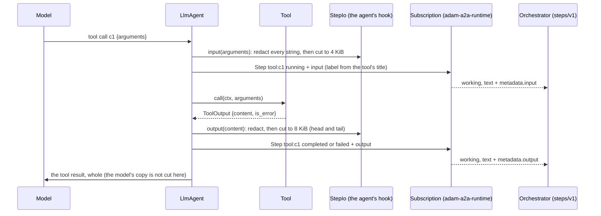
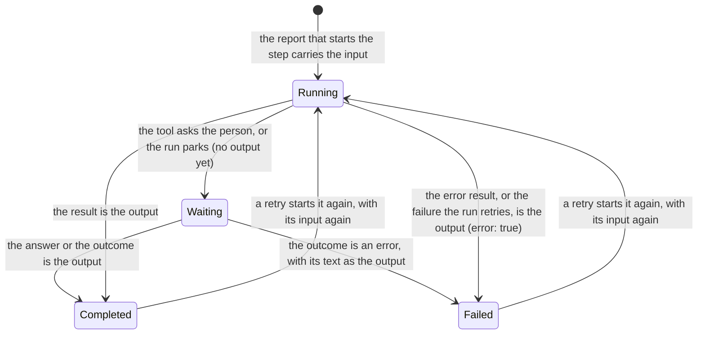

# 0011. A tool call's step carries its input and output, cut and redacted

Status: **Accepted** (2026-10-02), an owner decision (the owner's answer 5 of 2026-10-02: tool inputs and outputs are
recorded by default, redacted and capped at 4 KiB in, 8 KiB out and 2 MiB per job, with a switch to turn it off).
**Amends [ADR 0007](0007-progress-as-steps-and-streamed-text.md) decision 3**, which said the agent never puts a tool's
output in a step: the output now has a member of its own, and the `detail` stays what it was. The other side of the
contract is the orchestration layer's: its ADR 0030 (a step carries its input and output) and the revision of
`docs/api/steps-v1.md` in `vymalo/another-agentic-system`, written at the same time from the same plan. **Built:** the
step event, the agent's hook, the coder's and `adam-agent`'s redactors, the A2A report, the MCP `title` as the label.

## Context

The screen's step list shows what an agent did, one line per tool call. A person who opens one of those lines (the
researcher's three `search__web_search` calls, in the owner's chat of 2026-10-02) found nothing to open: the report
carried an id, a label, a state and a detail, and the label was the raw `<server>__<tool>`. The arguments the model gave
and what the tool answered were in the journal and in the model's context, and nowhere an observer could read them.
*Verified 2026-10-02 by reading the code at commit `6160be9`:* `LlmAgent` reported `tool:<call id>` as `running`
before the call and as `completed`, `failed` or `waiting` after it, with no more than the label and the icon of the
tool's `step_style`; ADR 0007 decision 3 gave the reason: a step is shown to the person, and a tool's result is for
the model.

The owner asked for exactly this to be shown ("params -> output"), and for it to be safe: the arguments and the results
of tools are the most likely place for a credential to cross a boundary, so the record is redacted and bounded by both
sides.

## Decision

1. **A step has two more optional members.** `StepEvent::input`: the arguments of the call, a JSON object, on the
   report that **starts** the step (`running`, the first report of its id); a call the model made with no arguments
   has no `input`, as the orchestration layer keeps none for an empty object. `StepEvent::output`: a `StepOutput`
   `{text, truncated?, bytes?, error?}` on the report that **ends** it (`completed`, `failed`). On the wire they are
   the members `input` and `output` of the report under `steps/v1`, named as in the plan of 2026-10-02: `truncated`,
   `bytes` and `error` are present only when they are so, and `bytes` is the size of the whole answer in bytes
   when it was cut. `detail` is unchanged: a short human line, never the result. A step that is `waiting` has
   neither; when the answer of the person, a child run's outcome or a remote task's outcome ends it, **that**
   is the output. A client that did not activate `steps/v1` reads the same plain lines as before: the members are
   not in them.
2. **The bounds are the contract's.** `input`: strings longer than 512 characters are cut (ending in `…`),
   control characters other than the line break and the tab are dropped, and an input that is still over **4096 bytes**
   serialized is replaced by `{"_cut": true, "bytes": <the size before any cut>}`. `output.text`: control characters
   dropped, and a text over **8192 bytes** is cut keeping its head and its tail, because an error is at the end: the head
   gets three quarters of what is left once a line `… n bytes not kept …` is counted, so that the **whole is within
   8192 bytes**, with `truncated` and `bytes` (the size of the printable text). The cuts are on character
   boundaries. The constructors (`StepEvent::with_input`, `StepOutput::new`) keep them, as they keep the id and the
   label, so an agent cannot send what the orchestration layer would cut; an agent may lower them
   (`StepIo::input_max`, `output_max`), never raise them. **The budget of 2 MiB per job is the orchestration layer's**
   (its ledger drops the members past it): the agent keeps no ledger of open steps (decision 6 of ADR 0007), and the
   most one run sends is bounded by what a call may send and by `Limits::max_tool_calls`.
3. **Redaction comes first, in two places.** The agent redacts what it knows: `LlmAgentBuilder::step_io(StepIo)`
   takes a hook, `StepIo::redact`, that sees every string of the arguments (and every key) and of the result **before**
   the cut, so that a cut cannot leave the front half of a value the redactor would no longer recognise. The coder gives
   it its `Redactor` (exact values: the model's key, the GitHub credentials, the database password, the A2A tokens, and
   an installation token the moment it is minted, in the Base64 forms a header carries); `adam-agent` gives it the values
   of the configuration and of every environment variable whose name says it is a secret (`*_KEY`, `*_TOKEN`,
   `*_SECRET`, `*_PASSWORD`, ...), which is where the `${VAR}` values of its `mcp.json` come from. The orchestration layer
   redacts patterns on top (bearer tokens, JWTs, key shapes). **It is a filter, not a guarantee**: a secret that is
   neither a known value nor a known shape crosses, and the log is as sensitive as the chat already is.
4. **There is a switch.** `StepIo::off()` sends neither member and the step is what it was before this record. The
   orchestration layer has its own (`steps.recordToolIo`), which drops both whatever the agent sent. The default is to
   send.
5. **The label can come from the tool.** An MCP tool's `title` (what its server calls it for a person) is the label of
   its step when there is one (`Tool::step_style`, `McpTool`); the model still knows the tool as `<server>__<tool>`,
   and the title is not part of the description the model reads.
6. **Across processes the I/O is a courtesy.** A step's report crosses from a worker to a control plane in a Postgres
   `NOTIFY`, which refuses a payload of 8000 bytes or more. A step whose input or output does not fit goes without
   them (`adam-notify-postgres`), and the step, its state and its label go whole: an end that lost its output is still an
   end. In a single process (the `all` role), nothing is lost.
7. **The model's result is its own.** Nothing about what the model is told changes: the tool's result still goes into
   the history as it was, and the journal still records it. What is cut and redacted is the **copy for the observer**.

## Consequences

* **The log holds what tools were given and answered**, for every agent that sends it (the default), cut and
  redacted but not secret-free. An operator who does not want that turns it off at the orchestration layer's
  switch, or with `StepIo::off()`; an agent author whose tools handle secrets the redactor cannot know about turns
  it off for that agent.
* **A step event can be 12 KiB instead of 1 KiB**, and a run of 400 tool calls up to 2 MiB of it at the
  orchestration layer's budget. In a split deployment a big one crosses without its members (decision 6).
* **`StepEvent` has two more fields**, `#[non_exhaustive]` as it was, so code that builds one with the constructors
  is unaffected, and one that compares events whole sees the new members (the tests of this repository did).
* **A tool that returns a very large result costs a scan of it** to redact and cut, in the transition that ran the
  call; the MCP client already cuts at 64 KiB, and the coder's tools at less.

## Alternatives considered

* **Put the result in `detail`.** Rejected: 1000 characters, drawn under the label in the main list, so a result
  would be in front of the person whether they opened the step or not. The `output` member is for the block that opens.
* **A new event kind for the I/O.** Rejected: two reports that must be matched by id, in order, to say one thing,
  and the orchestration layer already keeps the step by id.
* **Redact in the orchestration layer only.** Rejected: a value the agent knows is a secret would have crossed
  the wire first. The layer's patterns are the second line, not the first.
* **The whole result, unbounded.** Rejected: the owner's cap, and an `NOTIFY` payload that would not fit.
* **A per-job budget in the agent.** Not built: it would need a ledger in the conversation or a map by run in a
  stateless worker, to enforce a number the orchestration layer enforces anyway at its door.

## Verified and unverified

* *Verified 2026-10-02*, by tests in this repository: the bounds (a string of 512 characters, an input over 4096 bytes
  becoming `{"_cut", "bytes"}`, an output of any size within 8192 bytes with its head and its tail, control
  characters, boundaries of four-byte characters) in `crates/adam-runtime/src/step.rs`; the report's shape under
  `steps/v1` and that a client that did not activate it reads the same lines (`crates/adam-a2a-runtime/src/steps.rs`,
  `tests/steps.rs`); a call's step carries its arguments and its result scrubbed by the agent's redactor before the cut,
  an error result, a permanent failure, an unknown tool, the person's answer, a child run's outcome, and with
  `StepIo::off()` neither (`crates/adam-llm-agent/tests/llm_agent.rs`, `tests/child_runs.rs`); an MCP tool's title is
  the label of its step (`crates/adam-mcp/tests/http.rs`); the coder's redactor and `adam-agent`'s environment values
  reach the steps (`bin/adam-coder/tests/e2e.rs`, `bin/adam-agent/tests/agent.rs`); a step too big for a `NOTIFY` goes
  without its members (`crates/adam-notify-postgres/src/wire.rs`).
* *Unverified*, until the orchestration layer's side is merged: that its `StepReport` reads `input` and `output` as
  written here (the names and shapes are the plan's of 2026-10-02, section 3.1), that it cuts at the same
  numbers (so nothing is cut twice), and that `bytes` in `{"_cut": true, "bytes": n}` is the size before any cut. Where
  the plan did not say (whether a string cut counts its `…` in the 512 characters, whether `truncated` and `bytes` are
  absent when not so), this record chose, and says so above.
