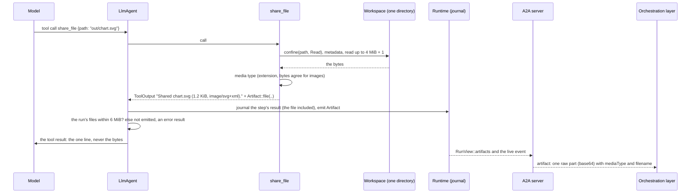
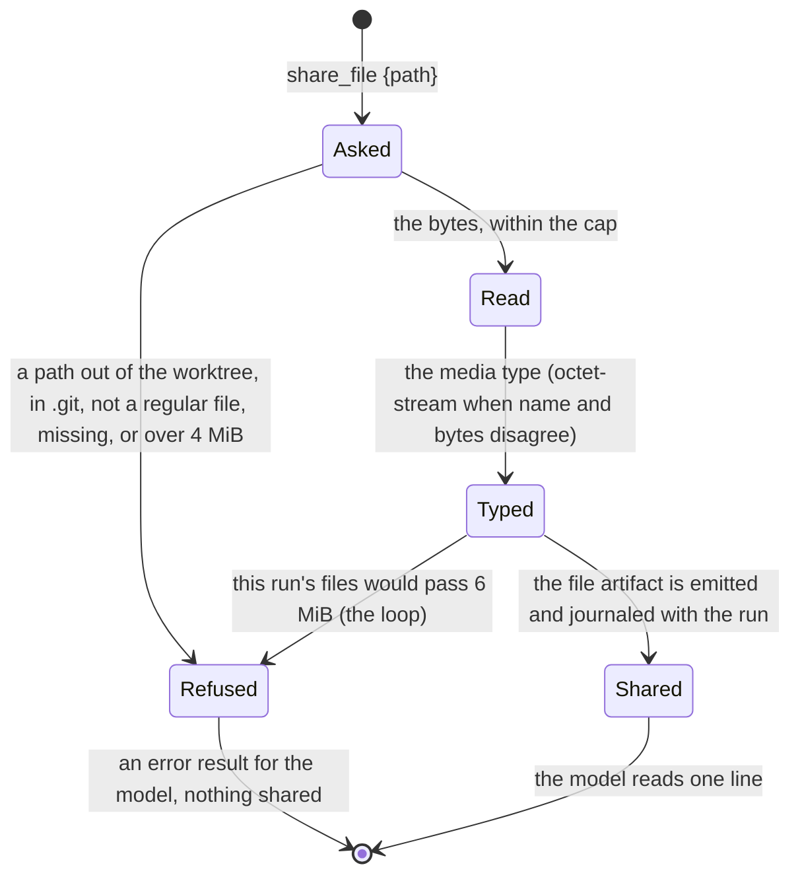

# 0012. A file is an A2A artifact with a `raw` part; the coder shares one with `share_file`

Status: **Accepted** (2026-10-02), an owner decision taken with plan 10 of 2026-10-02 (a file an agent made must reach
the person's screen; the hand-over is a standard A2A artifact, with no extension). The other side of the contract is the
orchestration layer's: its ADR 0032 (files from agents live in an artifact store and the log keeps references), written at
the same time from the same plan. **Built:** `Artifact::file`, its journal form, the A2A `raw` part, the per-run cap in
the agent loop, and the coder's `share_file`.

## Context

The owner's chat of 2026-10-02: the coder was asked for a drawing, made an SVG in a scratch project, and could not show it.
Its words were "your screen can draw text, cards and Mermaid diagrams, no images", and it drew a Mermaid diagram from the
SVG's coordinates and told the person to "drop the SVG into a browser". Two things were missing, one on each side of the
protocol. On the orchestration layer's side: it read an A2A `Url` part as a link and dropped a `Raw` part. On ours:
`adam_runtime::Artifact` was JSON only (`name`, `mime_type`, `data: Value`), so an agent had no way to say "this is a file"
at all, and the coder had no tool to hand one over.

*Verified 2026-10-02 by reading the code at commit `bdbfafa`:* `Artifact { name, mime_type, data }` is what a tool returns in
`ToolOutput::artifacts`, what `Ctx::emit` records with the transition's commit (`Envelope::artifacts`, rewritten with every
commit of the run's state) and what `RunView::artifacts` reads back; `adam_a2a_runtime::artifact_of` made a text part
from string data and a data part from anything else. *Verified 2026-10-02 by reading `a2a-lf` 0.3.1 (`src/types.rs`) and
the A2A v1 `a2a.proto` that `a2a-pb` 0.2.1 ships:* a `Part` is one of `Text`, `Raw(Vec<u8>)` (`bytes raw`, "in JSON
serialization, encoded as a base64 string"), `Url` or `Data`, with `filename` and `media_type` (`mediaType` on the wire);
the crate does the base64.

## Decision

1. **A file is an A2A artifact whose one part is `raw`.** `adam_a2a_runtime::artifact_of` maps a file artifact to
   `Artifact { parts: [Part::raw(bytes) with mediaType and filename] }`, with nothing else: no `data` part, no metadata, no
   extension. A plain A2A client gets a standard file artifact, which is what the protocol says results should be ("a clear
   distinction between communication (messages) and data output (artifacts)"). It is not one of the optional, capability-detected host conveniences the orchestration
   layer's own rules are careful about (its ADR 0008): nothing is detected and nothing fails closed. The artifact's id is derived from its name, media type, filename and the
   SHA-256 of its bytes, so the live event and the durable copy are one artifact and a changed file is a new one.
2. **`Artifact::file { name, media_type, filename, bytes }` is the file form of `adam_runtime::Artifact`.** The struct gains
   an optional `file: ArtifactFile { filename, bytes }`, and `RunEvent::Artifact` gains the same member, both with
   `#[serde(default, skip_serializing_if = "Option::is_none")]`, so **what was journaled before still decodes** (no `file`:
   a JSON artifact, as it was) and a JSON artifact serializes as it did. A file artifact has its media type in `mime_type`
   and `null` in `data`. `Artifact` and `ArtifactFile` are `#[non_exhaustive]` with constructors (`Artifact::new` for the
   JSON form), as the house style has it for a type that will grow; that changes the code that built an `Artifact` by a
   struct literal (this repository's, a handful of places) and nothing else. The bytes are serialized as a base64 string, the form
   the A2A part has, never as an array of numbers. `Artifact::file` is the one place the rules of a file are checked: a
   filename is a name (not empty, at most 255 bytes, no `/`, `\`, control characters, not `.` or `..`), a media type is
   `type/subtype` with no whitespace, and the size is at most the cap (3). `Debug` prints a file's size, not its bytes.
3. **The caps: 4 MiB a file, 6 MiB a run.** The orchestration layer keeps files up to its `artifacts.maxFileBytes`
   (10 MiB); this side stays under it (`MAX_ARTIFACT_FILE_BYTES` = 4 MiB), so an agent never makes a file the other side
   refuses. The number is lower than the limit it must respect because of what a file costs **in the journal**: the bytes,
   as base64 (a third more), are in the journal entry of the tool call that made the file (`Ctx::step` journals the
   whole `ToolOutput`), and in the run's state (`Envelope::artifacts`), which every later commit of the run writes again,
   and which a document store may cap (MongoDB's document is 16 MiB). So the **run** keeps at most
   `MAX_RUN_FILE_BYTES` = 6 MiB of files in all, about 8 MiB of base64 in its state. The agent loop enforces it
   (`LlmAgent`: the references it keeps in the conversation, `ArtifactRef`, carry the size of a file, `bytes`, and a file that
   would go over is not emitted; the tool's result is marked as an error and says so, and the model decides what to do).
   The runtime itself keeps what it is given. Both numbers are constants of `adam-runtime`; moving them is a one-line change
   and a reason to read this record again, not a configuration.
4. **The model never sees the bytes.** What the model is told is the tool's `content`, one line. The loop records a tool's
   `content` in the history and the artifact's name, media type and size in the conversation; the bytes are in the run's
   artifacts and the journal only, never in the history, in the step's `output` (which is the same `content`), or in the run's
   final output. (An MCP tool that carried base64 through the model is not a way to share a file: it would cost tokens and
   corrupt bytes.)
5. **The coder shares a file with `share_file { path, repo?, name? }`.** It reads **one file of the workspace**, with the
   confinement `read_file` has (one function, `confine(.., Access::Read)`): relative to the slot, no `..`, nothing inside
   `.git`, a symlink followed only while it stays inside the worktree. It must be a regular file within the cap; a directory, a
   pipe, a missing file and a bigger file are results for the model. The bytes are read up to the cap plus one. Because the
   workspace is one directory whatever environment the commands run in
   ([ADR 0010](0010-a-run-works-in-its-repositorys-devcontainer.md)), a file a command made in the devcontainer is shared
   like one the coder wrote. The result is `Shared <filename> (<size>, <type>).`.
   *Amended 2026-10-09 ([ADR 0033](0033-files-from-mcp-results-are-shared-files.md)):* for an image the line goes on,
   `To show it in your answer, write .`, because a model that wrote the image's workspace path
   (``) left the person's screen nothing to resolve; the screen resolves an image's source
   against the files shared in the run, by the share's path and then by the file's name. The line is
   `adam_runtime::Artifact::shared_line`, and the media-type rule of 6 is `adam_runtime::checked_media_type`, shared with
   the files of an MCP server's results. *Amended the same day:* a filename may not hold a `:` either (2), so that a
   name never reads as a URL (`http:evil.example`) where a screen or a Markdown link resolves it.
6. **The media type is derived, and checked for images.** From the extension, against a small table; for an image
   (`png`, `jpeg`, `gif`, `webp`, `svg`) the bytes must agree (the PNG, JPEG, GIF and WebP signatures; an `<svg` element after
   any BOM, XML declaration, doctype or comment). A file whose name and bytes disagree, and a file whose extension the table does not
   know, are `application/octet-stream`: a person can download it, nothing renders it. A file with no known extension whose
   bytes are an image is that image. This is the rule the orchestration layer applies again on its side; the agent's
   answer is a claim, not the last word.
7. **A text file is scrubbed.** The coder's tools are wrapped by its `Redactor`, which now also goes over a file artifact that
   is valid UTF-8 (the values it knows: the model's key, the GitHub credentials, the database password, the A2A tokens). A
   file that is not text has no string to match and is left as it is. It is a filter, not a guarantee, as in ADR 0011.
8. **Across processes a file is a courtesy of the durable record.** A worker's events cross to a control plane in a Postgres
   `NOTIFY` (under 8000 bytes). A file artifact whose bytes alone are over that is dropped without being serialized, and
   reaches a subscriber through the durable poll (`RunView::artifacts`), as any artifact that does not fit
   (`adam-notify-postgres`). In a single process the live event carries it whole.
9. **What this does not decide.** Where the bytes live, how they are served and drawn (the orchestration layer's ADR 0032 and
   its web), `url` parts (an agent that has a file at a URL says so with a `url` part, which the orchestration layer
   may fetch from an allow-list), and uploads for a file over the cap (a later slice of the same plan): all on the
   other side. A file over the cap here is not shared; it is not truncated.

## Consequences

* **An agent can hand over a file, and any A2A client can read it.** The coder's SVG in the owner's chat is shared as
  `chart.svg`, `image/svg+xml`, and the orchestration layer's work (store, serve, preview) is what makes the person see it.
* **The journal grows with the files a run shares**, by up to 8 MiB of base64 in a run's state (and the same again in the
  journal entry of each file's tool call, at most the files' own total). Most files are small (an SVG is kilobytes). A
  deployment that shares many large files is the reason to read decision 3 again, and one of the "upload" ideas of the plan.
* **Code that built an `Artifact` or matched a `RunEvent::Artifact` changes** (`Artifact::new`, the `file` member). Inside this
  repository that was the tools of the coder and `adam-ui`, the A2A subscription and the tests. A consumer outside it
  (the orchestration layer's `adam-host` dependency, when `agent-local` is on) compiles against the new shape when it
  moves its pin.
* **A journal written by this version has a member an older build ignores:** a file artifact reads as an artifact with
  `null` data there. No journal written before this version is affected.
* **The coder's prompt and tool list change** (`share_file` is the eighteenth tool, and the instructions say when to use it:
  for anything the person should see or download, never to paste its contents), which changes what a replayed run would
  have been shown, as any change to a tool's spec does: the snapshots are regenerated in the same commit.

## Alternatives considered

* **A `url` part pointing at the agent.** Rejected as the default: the orchestration layer would have to fetch from an agent
  that may be behind the same boundary the file was made in, and a file made in a run's workspace is gone when the run's
  workspace is. `url` parts stay available for an agent that really has a file at a URL.
* **Base64 in `data`.** Rejected: a data part is JSON the person's screen may show, a media type on it means something else,
  and the receiver cannot tell a file from a value. `raw` is the protocol's name for it.
* **A host extension (`vymalo/file/v1`).** Rejected: a standard part does the work, and an extension would make a plain client
  worse off (the orchestration layer's ADR 0008: a convenience is removable without breaking plain A2A, and a file is not one).
* **Bytes outside the journal (an object store on this side).** Not built: it would add a store to an agent that is a library
  with a database, to serve files the orchestration layer keeps anyway. The cap is what bounds the cost; an upload slice
  would remove the cap's reason.
* **No per-run cap.** Rejected: 200 tool calls (the default) times 4 MiB is a state document no store should be asked to
  rewrite at every commit.
* **`share_file` with a content argument.** Rejected: the model would write the bytes (tokens, and corruption), when the file
  is already on disk.
* **A tool-level per-run total (state in the coder).** Rejected: the tool is stateless; the loop already keeps the run's
  artifact references, and any agent's tools get the bound.

## Verified and unverified

* *Verified 2026-10-02*, by tests in this repository: a file artifact round-trips through JSON as base64 and an artifact (and
  an event) journaled before the file form decodes with no `file` (`crates/adam-runtime/src/events.rs`); it comes back from
  the store byte for byte (`crates/adam-runtime/tests/runtime.rs`, `events_and_durable_artifacts`, on every store the suite
  runs on); it is one `raw` part with `mediaType` and `filename`, base64 on the wire, with an id that follows the bytes
  (`crates/adam-a2a-runtime/src/convert.rs`), once in the stream and the same in the task (`tests/backend.rs`); the model's
  request and the history never hold the bytes, the output names the size, and a file past the run's 6 MiB is not kept
  (`crates/adam-llm-agent/tests/llm_agent.rs`); a file artifact too big for a payload is dropped without being serialized
  (`crates/adam-notify-postgres/src/wire.rs`); `share_file`'s path rules (`..`, absolute, `.git` in any case, a link out of the
  worktree, a link to `.git`, a directory, a pipe, missing, over the cap and at the cap), its media types (PNG and SVG
  agree; a PNG named `.txt`, an HTML page named `.png` and an unknown extension are octet-stream), the sizes it says, a file a
  command produced, and the redactor (`bin/adam-coder/src/tools/share.rs`, `tests/tools.rs`); and the whole chain over A2A, on
  memory and on PostgreSQL: the coder draws an SVG, shares it, and the client reads one `raw` part with the SVG's bytes,
  `image/svg+xml` and `dot.svg` (`bin/adam-coder/tests/e2e.rs`).
* *Verified 2026-10-02*, by reading the sources named in Context: `Part` and `PartContent` in `a2a-lf` 0.3.1, and `raw` as
  base64 in the A2A v1 `a2a.proto` of `a2a-pb` 0.2.1.
* *Unverified*, until the orchestration layer's side is merged: that its mapper reads a `raw` part with `mediaType` and
  `filename` as written here and that its own cap (10 MiB) and sniffing agree with decisions 3 and 6. *Unverified:* any size
  limit for a `raw` part in the A2A specification itself (the excerpts read state none), and how an A2A client other than
  this stack's treats a multi-megabyte part in a streamed event.
* *Not exercised:* the compose stack. A scripted-model scenario for the coder would need a stream twin for every step of the
  script and a repository or a scratch project the coder cannot complete; the orchestration layer's `artifact-e2e` (its S13)
  is the scenario that runs the chain across both systems.
