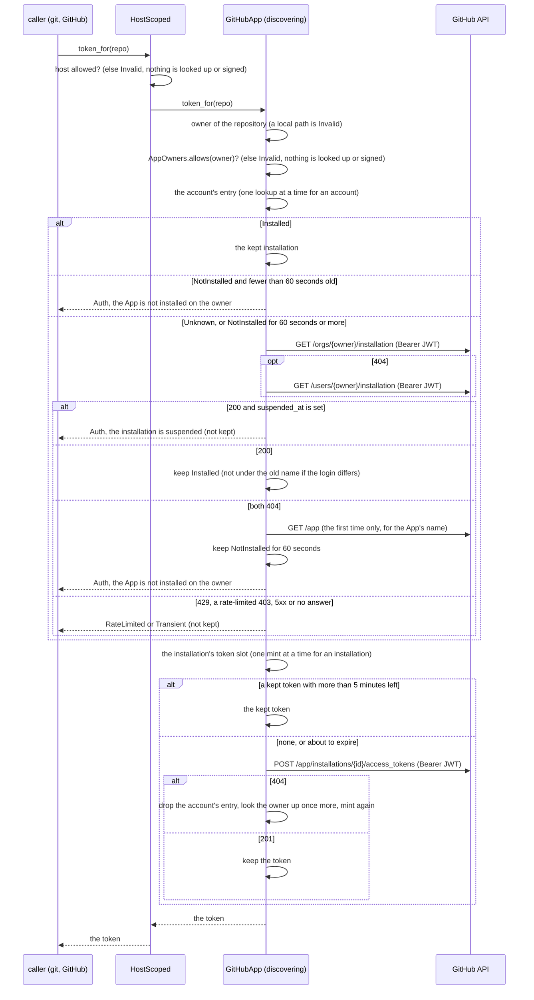
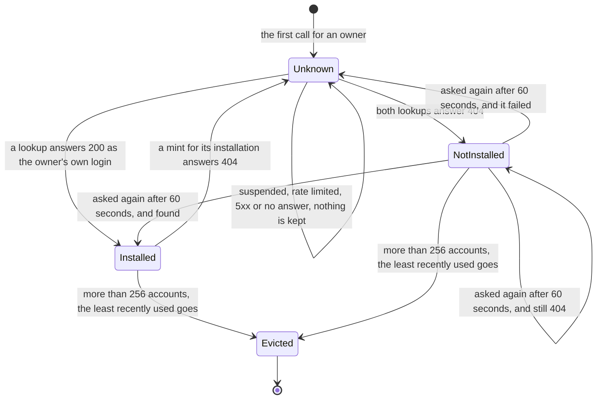

# 0017. A GitHub App works on every account it is installed on that the deployment allows

Status: **Accepted** (2026-10-03). **Extends [ADR 0009](0009-github-per-installation-read-through-mcp.md)** (decisions 1, 5
and 8, and its alternative "Let github-mcp-server hold the App").

*Status note, 2026-10-03: built so far is the library part, **D1, D2 and D3 in `crates/adam-workspace`**
(`GitHubApp::discovering`, `AppOwners`, `Installation`, `MAX_CACHED_INSTALLATIONS`). Not built, and follows in later
changes: the coder's configuration (`GITHUB_APP_OWNERS`, an optional `GITHUB_APP_INSTALLATION_ID`, its startup checks and
the chart), **D4** (GitHub read through `github-mcp-server http` with a token per call), **D5** (the redactor's bound) and
**D6** (read-only tokens). Until then the coder is exactly as ADR 0009 says: its `GitHubApp` is pinned. The sequence
diagram of an MCP call comes with the change that builds D4.*

*Status note, 2026-10-03: **D4's adam-mcp part is built** (`crates/adam-mcp`): `CallBearer`, `McpPolicy::bearer_per_call`
(a server name plus an origin), and the refusals at connect (`Error::BearerBinding`: another origin, or an `Authorization`
header of the file's own; a `stdio` server of the bound name gets no binding and a warning). Still not built: the coder's
use of it (the router that picks a token per call, `GITHUB_MCP_URL`, the embedded `mcp.json`, the sidecar).*

## Context

ADR 0009 authenticates the coder as **one installation** of a GitHub App: `GITHUB_APP_INSTALLATION_ID` names it, and the token
of that installation is handed out for every repository. That is right for a deployment that works on one account, and wrong
for one that works on several: an App installed on three organisations and a person needs three installation IDs, one process
per account, or an owner who copies IDs out of GitHub's settings by hand. GitHub can answer the question itself: given the
App's JWT, it says which installation is on an account. So the coder can pick the installation from the **owner of the
repository it was asked to work on**, and a deployment says which accounts it is willing to act for.

What is new is a risk, which is why the allow-list is a decision of its own (D2): a **public** App can be installed by anyone
(F6), so "the App is installed on this account" says nothing about whether the deployment wants it to act there. A
prompt-injected "push this to `attacker/repo`" would otherwise get a working token for any account that installed the App.
With a pinned installation that cannot happen today.

*Facts, with how far each is known:*

| # | Fact | Status |
|---|---|---|
| F1 | These endpoints exist and take the App's JWT: `GET /repos/{owner}/{repo}/installation` (documented answers 200, 301, 404), `GET /orgs/{org}/installation` (200), `GET /users/{username}/installation` (200), `GET /app/installations` (`per_page` up to 100, `page`, `since`, `outdated`). | **verified 2026-10-03**: the OpenAPI description at `github/rest-api-description` main, and docs.github.com "REST API endpoints for GitHub Apps" |
| F2 | The org and user lookups answer `404` when the App is not installed. The OpenAPI lists only `200` for them; the rendered docs page suggests `404`. | **unverified.** The code takes a `404` as "not installed" on every lookup. |
| F3 | Whether `GET /users/{x}/installation` also answers for an organisation. | **unverified.** Nothing depends on it: the organisation lookup comes first, then the user lookup. |
| F4 | The installation schema has `id`, `account` (nullable; a `simple-user` or an `enterprise`), `app_id`, `app_slug`, `repository_selection`, `permissions` and `suspended_at`. `GET /app` returns `slug` and `html_url`. `GET /app/installations/{id}` answers `200` or `404`. | **verified 2026-10-03**, OpenAPI |
| F5 | `POST /app/installations/{id}/access_tokens`: by default the token reaches every repository of the installation. The body can narrow it with `repositories` (names, up to 500), `repository_ids` or `permissions`, never widen it. Answers `201`, `401`, `403`, `404`, `422`. New tokens use the stateless `ghs_APPID_JWT` format (rollout began 2026-04-27). | **verified 2026-10-03**, OpenAPI description text |
| F6 | A **private** App "can only be installed on the account that owns the app". A **public** App can be installed by "any user on GitHub". So cross-organisation work needs a public App (or an enterprise-owned one), and then **strangers can add installations**. | **verified 2026-10-03**, docs.github.com "Making a GitHub App public or private". Enterprise-owned Apps: **unverified**. |
| F7 | Owner logins are case-insensitive; the API returns the canonical case in `account.login`. | **unverified** (common knowledge, not from a document) |
| F8 | A renamed or transferred repository answers `301` at the repository lookup. Whether an organisation or user lookup by a former login redirects is not known. | the `301`: **verified** (OpenAPI); the rest **unverified** |
| F9 | `github-mcp-server` v1.12.2 and v1.14.0 (the latest tag; `v1.13.0` exists too). `stdio` App mode needs exactly one installation (`internal/githubapp` `validate`: "GitHub App installation ID is required") and its token provider is one function per process. The `http` subcommand takes no credential flags: it reads the token **per request** from `Authorization` (`Bearer ...` or raw); a missing header is `401`; a token whose prefix it does not recognise (`ghp_`, `github_pat_`, `gho_`, `ghu_`, `ghs_`, or the old 40-hex form) is refused. It is stateless streamable HTTP and builds one MCP server per request. `--read-only`, `--toolsets` and `--tools` bound the tool set; the `/readonly` and `/x/{toolset}` routes and the headers can only narrow it. It fetches scopes only for classic `ghp_` tokens. `--listen-host` and `--port` (default 8082) are `http`-only; `--gh-host` (`GITHUB_HOST`) is global. | **verified 2026-10-03 by reading the source** (`cmd/github-mcp-server/main.go`, `pkg/http/handler.go`, `pkg/http/server.go`, `pkg/http/middleware/{token,pat_scope}.go`, `pkg/utils/token.go`). **Not run.** |
| F10 | In `http` mode, `tools/list` sent with a placeholder `ghs_...` bearer makes no request to GitHub. | **unverified.** The binary test of the change that builds D4 has to prove it. |
| F11 | The twelve allow-listed read tools at v1.12.2 take `owner` and `repo` (eight of them), `query` (`search_issues`, with an optional `owner`/`repo`; `search_repositories` and `search_code` take `query` only), or nothing (`get_me`, which with an installation token hits `GET /user` and gets `403`). | **verified 2026-10-03**, `pkg/github/{repositories,search,issues,pullrequests,context_tools}.go` |
| F12 | Native Kubernetes sidecars (an init container with `restartPolicy: Always`) are beta and on by default from 1.29, and GA in 1.33. | **unverified** (from memory) |

What the library change adds to this, checked against `WireMock` (the unit and integration tests of `adam-workspace`, and the
compose mock `dev/wiremock/mock-github/mappings/app.json`, run on 2026-10-03): the request shapes and the order of the lookups
(F1, F2 and F3 as the mock models them, which is not GitHub's behaviour: *unverified* against GitHub). **No live App was
tried.**

## Decision

1. **D1. The installation is found per owner; `GITHUB_APP_INSTALLATION_ID` becomes an optional pin.** *Built in the library
   (`GitHubApp::discovering`; `GitHubApp::new` is the pinned constructor, unchanged); the coder's variable follows.*
   * With a pin, behaviour is exactly ADR 0009: no lookup, one token for every repository.
   * Without a pin, the installation is resolved from the owner of the repository's URL, with the App's JWT:
     1. `GET /orgs/{owner}/installation`;
     2. on `404`, `GET /users/{owner}/installation`;
     3. on `404` again, "not installed".
   * By owner and not by repository, because creating a repository (`create_repository` asks for credentials for an address
     that does not exist yet) needs the installation too.
   * A pin and an owner list together are a configuration error (the coder's exit 78; follows with its configuration).
2. **D2. An owner allow-list is required when there is no pin: fail closed.** *Built in the library (`AppOwners`); the coder's
   `GITHUB_APP_OWNERS` follows.* Logins are compared without case; `AppOwners::Any` (the coder's `*`) is every account the App
   is installed on, and the coder logs a warning for it. There is no default, because of F6.
   * The check runs **before anything is looked up or signed** and applies on every path (git, REST, `create_repository`, and
     later MCP reads). `CREATE_REPO_OWNERS` still applies on top, and `ALLOWED_REPO_HOSTS` (`HostScoped`) stays outermost.
   * An account that GitHub reports under another login than the one asked for (a rename) has to be on the list too, under
     its new name: the old name may belong to somebody else tomorrow (F8).
3. **D3. Cache, single flight, errors.** *Built.*
   * **Account cache**, keyed by lowercased login, holding what is known of the account: `Installed { id, login }` or
     `NotInstalled` for 60 seconds, read from the same clock as the JWT and the tokens (`with_clock`).
     * An installed entry is kept until a mint for its installation answers `404` (uninstalled, or installed again under a
       new ID). Then the entry is dropped and the lookup is done again **once**.
     * When `account.login` differs from the owner asked for (a rename) the result is not kept under the asked-for name.
     * A lookup that fails (rate limit, `5xx`, transport) or finds a suspended installation is **never** kept.
   * **Token cache**: one slot per installation, each with its own `tokio` mutex. At most one mint is in flight per
     installation, and different installations mint at the same time. Lookups are single flight per account, so sixteen
     callers for one owner make one lookup and one mint.
   * **Bounds**: `MAX_CACHED_INSTALLATIONS` = 64 installations' tokens, and 256 accounts; the least recently used is evicted
     first and found again with one request.
   * **Errors**, all typed by the crate's existing classes (callers decide from the class):
     * not installed: `WorkspaceError::Auth` ("the GitHub App `<slug>` is not installed on `<owner>` (install it at
       `<html_url>/installations/new`, or grant it the repository)"). The slug and page come from `GET /app`, read once and
       lazily, the first time a message needs them; when that call fails the message names the App's ID instead;
     * an owner that is not allowed, or is not a login, or a local repository: `WorkspaceError::Invalid`, naming
       `GITHUB_APP_OWNERS`;
     * a suspended installation (`suspended_at` set): `Auth`, naming the owner;
     * a refused JWT or mint: `Auth`, which no longer names `GITHUB_APP_INSTALLATION_ID` when the App finds its installations;
     * a lookup or a mint that is rate limited, `5xx` or does not reach GitHub: `RateLimited` (with `Retry-After`) or
       `Transient`.
   * **Logs**: `owner` and `installation` are tracing fields; a JWT or a token never is.
   * **A missing permission**: an installation with "selected repositories" that lacks the repository fails at `git` or at
     the REST call, as today.
4. **D4. The GitHub MCP server runs in `http` mode, holds no credentials, and the coder supplies a token per call.**
   *Recommended; not built.*
   * **Process**: `github-mcp-server http --read-only --toolsets context,repos,issues,pull_requests --listen-host 127.0.0.1
     --port 8082` as a native sidecar in the chart (F12), or a service sharing the coder's network in compose.
   * **Agent folder**: the embedded `mcp.json` becomes `{"type":"http","url":"http://127.0.0.1:8082/","tools":[the twelve]}`
     with no environment and no credential.
   * **A new adam-mcp port, `CallBearer`**, bound by the deployment to a server name and origin through `McpPolicy`; a folder
     that points `github` at another origin, or adds its own `Authorization` header, is refused at connect. A `stdio` server of
     that name gets no binding, so old vendored folders keep working with a pin or a token.
   * **Per call**, the coder picks the token from the call's `owner`/`repo` (through `GitCredentials::token_for`, so the host
     check, the owner list, the redactor and the cache all apply), or, for a `query`-only search, from the one non-negated
     `repo:`, `org:` or `user:` qualifier; with none or several it is refused when the installation is found by owner, and the
     one token is used otherwise. `get_me` is refused for an App that finds its installations ("a GitHub App is not a user").
   * **Gains**: one process serves every installation; the MCP container holds no key and no token at rest. **Costs**: an
     `initialize` plus a call per tool call (loopback); a token without a recognised prefix is refused; it relies on a server
     mode built for GitHub's hosted service; F10 has to be shown.
   * **Rejected**: (a) one `stdio` server per installation, started on demand: N processes, each holding the key and minting
     its own unscoped tokens (a workable fallback if `http` mode disappoints); (b) replacing the MCP read tools with adam's own
     REST `#[tool]`s: twelve tools to rebuild and maintain, and the loss of upstream's lockdown and content windowing; (c)
     feeding the `stdio` server a minted token: it is static for the process and expires within the hour; (d) coder-only
     wrappers over `adam_mcp::Endpoint`, with no adam-mcp change: smaller, but it moves the allow-list out of the agent
     folder (second choice).
5. **D5. The redactor scales with the cache.** *Not built.* `bin/adam-coder/src/redact.rs` `MAX_ADDED` becomes
   `2 * adam_workspace::MAX_CACHED_INSTALLATIONS`. ADR 0009 decision 6's 16 assumes one live token; with 64 installations
   there can be 64, and one more while a refresh overlaps. The constant is public for that reason.
6. **D6. Down-scoping.** *Not built.*
   * (a) **Read-only tokens for MCP calls: recommended**, as a later change: minted with `permissions` of `contents`, `issues`,
     `pull_requests` and `metadata` as `read`, limited to what the installation was granted, cached as a second slot per
     installation, so that third-party code is never handed a write token. A default method of `GitCredentials`, so it is
     not a breaking change.
   * (b) **Per-repository `repositories` scoping: deferred.** It changes the cache key to (installation, repository), creating
     a repository needs an owner-wide token, and how `422` and public-repository reads behave is unverified.

## The path of a token

The cache of tokens is the one of ADR 0009 (`Empty`, `Fresh`, `Expiring`), one for each installation and at most
`MAX_CACHED_INSTALLATIONS` of them. `crates/adam-workspace/src/github_app.rs` is the code, and
`crates/adam-workspace/README.md` ("GitHub App credentials") the API.

## Consequences

* **One process serves every account the App is installed on** that the deployment lists; a deployment that wants exactly
  one keeps the pin and sees no change.
* **The allow-list is the security boundary, not the installation.** A public App can be installed by a stranger; the
  stranger's account is not on the list, so nothing is signed for it.
* **One more request the first time an owner is seen** (two for a person's account), and at most one an owner a minute for an
  account that is not installed. The JWT's rate limit for the lookups is *unverified*; the caches keep it to about one a
  process for each owner.
* **A `404` at a mint costs a second lookup**, once, so a deployment that uninstalls and installs again recovers by itself.
* **`GitHubApp::new` is unchanged**, `Debug` shows the mode and the owners and never a key or a token, and the new API is
  additive (`Installation` is `#[non_exhaustive]`).
* **Unverified:** F2, F3, F7 and F8 above, GitHub Enterprise Server, and a live App. What is tested is a mock that answers as
  the documentation says, so a different real answer shows up as a refused or a failed lookup, not as a wrong token.

## Alternatives considered

* **Let `github-mcp-server` hold the App** (ADR 0009's alternative, still rejected, and now for one more reason): its `stdio`
  App mode needs exactly one installation (F9), so it cannot serve several, and it exposes no token for the coder's `git`.
  The `http` mode of D4 holds no App at all.
* **Look the installation up by repository** (`GET /repos/{owner}/{repo}/installation`): it answers `301` for a renamed
  repository (F8) and does not exist for a repository that is yet to be created.
* **List the installations at startup** (`GET /app/installations`) and keep the map: it is one request, but a stale map after
  an install or an uninstall until the next restart, and it lists accounts the deployment has no interest in.
* **Default the owner list to every installed account**: rejected because of F6.
