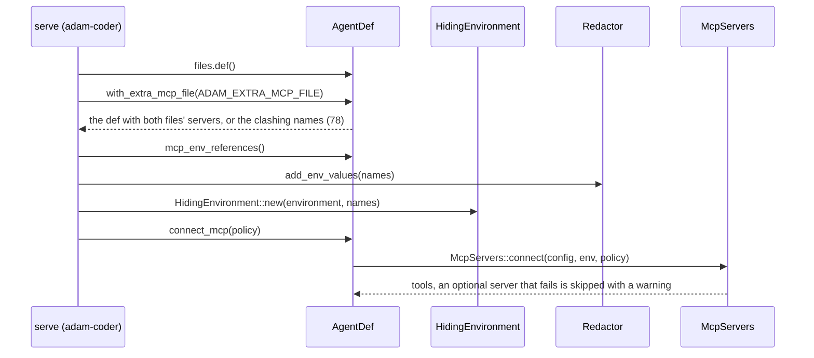
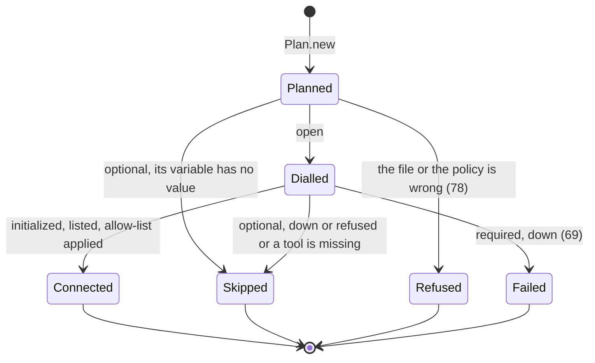

# 0018. Extra MCP servers are a file merged over the agent's own, and a server may be optional

Status: **Accepted** (2026-10-04), decided on the owner's delegation; the owner may revisit.
Builds on [ADR 0004](0004-agent-folders-at-run-time.md) (agent folders are read once, at startup) and
[ADR 0009](0009-github-per-installation-read-through-mcp.md) (an MCP server kind is allowed by the deployment, not by the
agent's files; secrets are never in files).

## Context

The chart of the coder wants to give it two more MCP servers (web search behind our own MCP pod, and the hosted
Context7), switched on by values. The coder reads **one** agent folder, and without `ADAM_AGENT_DIR` the files embedded in
its binary: the only `mcp.json` that can name a server is that one, and the chart cannot reach the embedded copy. A first
version of the chart shipped a copy of the prompt and of the `mcp.json` in a ConfigMap and mounted it as the folder.
Reviewed, that has two faults: the chart is synced at `HEAD` before CI bumps `image.tag`, so a copied prompt can run on an
older binary (or a newer one after a rollback), and a copy is another thing to keep equal. Two more facts came with it,
*verified 2026-10-04 by reading the code at the revision of this change*:

* a server that is down at worker start makes the worker exit 69 (`adam_mcp::Error::Connect`, transient), so a third party's
  outage becomes a crash loop of the coder;
* every `${VAR}` of a `mcp.json` is a secret of the process, and the coder ran its checks, commands and OpenCode in its own
  container with the environment minus two fixed deny-lists (`HIDDEN_FROM_CHECKS`, `HIDDEN_FROM_CHILD`), and redacted only the
  values it knew from its configuration. A key named only by a `mcp.json` reached repository code (`env` in a test script),
  and the tools' output.

## Decision

1. **An extra file of servers, added over the agent's own.** `ADAM_EXTRA_MCP_FILE` names a file in the shape of `mcp.json`.
   The roles that run workers (`adam-coder`, `adam-agent`) read it at startup with the same loader and add its servers to the
   root agent's before `connect_mcp` (`AgentDef::with_extra_mcp_file`). The policy, `${VAR}` expansion and `tools:` are those of
   `mcp.json`. The prompt and every other file stay where they were: in the binary, or in the folder.
2. **A name clash is an error** (exit 78, one diagnostic per name, nothing merged). The alternative, the extra file winning,
   would let a deployment replace `github`, whose credentials the coder binds to its name and origin; the other, the agent
   winning, would silently ignore a deployment's file.
3. **`optional: true` on a server** (in either file). An optional server whose `${VAR}` has no value, that cannot be reached or
   listed, or whose allow-list names a tool it lacks is skipped with a `warn!`; the worker starts without it. A mistake in the
   file or the policy is an error whatever `optional` says, and a server without `optional` is exactly as before (exit 69 while
   it is down). Alternatives: retrying in the background (a server that appears later would add tools to a running agent, which
   the journal's tool set forbids, ADR 0004 decision 4), or a deployment-wide switch (it would hide a required server's outage).
4. **A header with an empty variable is an error.** A `${VAR}` with no default in a header value whose variable is empty is
   `VarProblem::Empty` (a skip for an optional server): `Authorization: Bearer ` with the key gone is not a header. Elsewhere an
   empty variable still expands to nothing, as in a shell.
5. **The variables a `mcp.json` names are hidden and redacted, generically.** `AgentDef::mcp_env_references` gives every
   `${VAR}` of the root and the local subagents, extra file included. `adam-coder` wraps its environment in
   `HidingEnvironment`, which adds those names to the `hide` list of every `ExecSpec` the environment prepares (checks,
   commands, `run`, OpenCode), beside the fixed lists, and registers the values with the `Redactor`
   (`add_env_values`). `adam-agent` scrubs them from the tool-call steps (`step_io_named`). Alternatives: a longer fixed list
   (it misses the next key), or deciding by the name of the variable (`*_KEY`, which `adam-agent` already does and which
   misses `SEARCH_ACCESS`).
6. **Plain `http` stays the deployment's explicit choice.** `MCP_ALLOW_INSECURE` is one switch: it covers every server and the
   thread-tools endpoints senders announce. The chart sets it only for `mcp.websearch.allowInsecure: true` (or the
   deployment's own `config.extraEnv`), and refuses a render with a plain-`http` URL to another machine without one.

## Consequences

* The chart ships no copy of the agent's files and cannot disagree with the image about the prompt.
* `McpServer` gained the field `optional`: a struct pattern without `..`, or a literal, breaks (the workspace's own users were
  updated). `AgentDef` gained `with_extra_mcp`, `with_extra_mcp_file` and `mcp_env_references`; `adam-workspace` gained
  `HidingEnvironment`; `adam-service` gained `parse_file`; `AgentError` (non-exhaustive) gained `ExtraMcp`. Nothing is a new
  required trait method.
* A skipped server's tools do not exist: a `tools:` entry of the agent that names one fails at `bind`. The coder's own files
  select none.
* A process of the same user can still read `/proc/<pid>/environ` of the coder, for these keys as for `GITHUB_TOKEN`: the
  deny-lists are about what a run's child inherits, not a sandbox.
* The tool set of an agent depends on what was reachable at start: a restart that finds an optional server up adds its tools,
  which can fail the replay of a run that is mid-turn, as any deploy of a changed tool set can (ADR 0004 decision 4).
