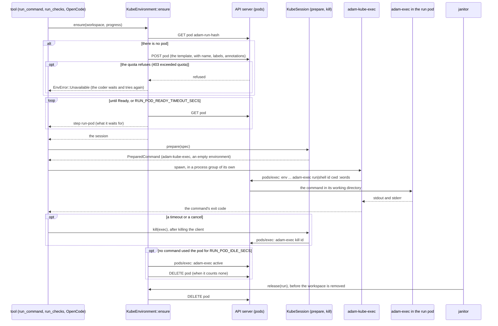

# 0019. A run's processes in a pod of their own

Status: **Accepted** (2026-10-05), an owner decision: each active coder run gets its processes in a Kubernetes pod of its
own, with a 2Gi memory limit, and the coder pod itself shrinks to about 1Gi. The facts the decision rests on say how
they are known; the ones marked *unverified* are the owner's to check on the cluster (the list is at the end). **Built:**
the crate `adam-env-kubernetes` (the `Environment`, and `adam-kube-exec`), the coder's use of it (`RUN_ENVIRONMENT`,
`RUN_POD_*`, the wait for a slot), the chart's `runPods` block and its checks, the image, and a `kind` job in CI. It
mirrors [ADR 0010](0010-a-run-works-in-its-repositorys-devcontainer.md), which decided the same for a Podman service, and
amends its decision 9 (see the note there).

## Context

The coder runs every command of every run in its own container: `run_command`, `run_checks`, OpenCode and every command
OpenCode starts. A Rust build, a Flutter build or an `npm install` of one run takes the memory of the whole pod, so the
coder pod has to be sized for the sum of what several runs may do at once (today `resources.limits.memory: 6Gi`), and an
out-of-memory kill of one run's build kills the coder and the other runs with it. [ADR 0002](0002-workspace-placement.md)
put the files of a run on a volume and [ADR 0008](0008-a-workspace-holds-several-repositories.md) made the workspace a
directory of slots; ADR 0010 made the place where processes run a port, `Environment` and `EnvSession` in
`crates/adam-workspace/src/environment.rs`, with the rule that **paths mean the same in every environment** and that git
and the file tools stay in the coder, because that is where the credentials are. This record is the third implementation of
that port, for a cluster.

The facts, each with how it is known:

* **The Kubernetes client.** `kube` 4.2.0 and `k8s-openapi` 0.28.0 are the newest releases of both (*verified* 2026-10-05,
  the crates.io API: `max_stable_version`); `kube` 4.2.0 declares `rust-version` 1.89.0, below this workspace's 1.94, and its
  `ws` feature is the transport of `pods/exec`. Its TLS is `hyper-rustls`, which with the `aws-lc-rs` feature and no `ring`
  uses the provider the rest of this tree already has (*verified* 2026-10-05 with `cargo tree`). It brings a second
  `serde-saphyr` (0.0.29, for kubeconfig files) beside the workspace's 1.3.
* **`pods/exec` from `kube`.** `Api::exec` with `AttachParams` gives stdin, stdout, stderr and the end of the command as a
  `Status` whose cause of reason `ExitCode` carries the exit code; closing stdin sends the stream-close message when the
  server negotiated `v5.channel.k8s.io`, and otherwise closes the whole WebSocket, which loses output (*verified*
  2026-10-05 by reading `kube-client` 4.2.0, `src/api/remote_command.rs`). That the API server and the kubelet of the
  deployment's cluster speak v5 is *unverified* (the code assumes Kubernetes 1.30 or later, which the admission policy needs
  anyway). That closing the client does not stop what it started in the container is *unverified* (from memory of how exec
  behaves), and it does not matter: `adam-exec kill` stops it by id, as it does for ADR 0010.
* **Quota.** A `ResourceQuota` is scoped by `scopeSelector` on `PriorityClass` (`scopeName: PriorityClass`, operator `In`,
  `values`), tracks `pods`, `limits.memory` and the other compute resources, **cannot select pods by label**, and refuses a
  pod with HTTP 403 and a message that says `exceeded quota` (*verified* 2026-10-05, kubernetes.io, "Resource Quotas").
* **Admission.** `ValidatingAdmissionPolicy` is stable (`admissionregistration.k8s.io/v1`) since Kubernetes 1.30, and a
  refusal says `ValidatingAdmissionPolicy '<name>' with binding '<binding>' denied request: <message>` (*verified*
  2026-10-05, kubernetes.io, "Validating Admission Policy"). The HTTP status of such a refusal is not in that page:
  *unverified*, so the environment treats a 403 that is not a quota, a 422 and a 400 alike, as the deployment's mistake. The
  version of the owner's cluster is *unverified*.
* **The default image.** `ghcr.io/vymalo/another-agentic-images/workspace`, tag `1.98.1-ee2273e`, is
  `sha256:9b2670fc45f50b7b7b8f959fe5caa06e630cba86c0229b2a7d33bee7f26d752a`: a single `linux/amd64` manifest of seven layers,
  2.85 GB compressed, whose config says `User: agent` (a name, not a number, so a pod needs `runAsUser: 10001` to satisfy
  `runAsNonRoot`), `WorkingDir: /work` and `Entrypoint: [tini, --]` (*verified* 2026-10-05: an anonymous ghcr.io token and a
  manifest request returned 200 and this digest; the tag list is `1.98.1-bc97d51`, `1.98.1-ee2273e`, `latest`,
  `buildcache`). It is the image the coder is built on, so its glibc matches the coder's OpenCode. A node pulls 2.85 GB the
  first time: the default time to be ready is ten minutes in the chart.
* **Volumes.** That Longhorn lets two pods on one node mount one `ReadWriteOnce` volume is *unverified*. Kubernetes' own
  definition of `ReadWriteOnce` is "a single node", which allows it; whether Longhorn's attach does is for the owner to try.

## Decision

1. **A new crate, `adam-env-kubernetes`, implements `Environment`.** `KubeEnvironment` talks to the cluster through `kube`
   (its client, not a command it runs), has no dependency on an agent host or a gateway product, and is chosen by a binary at
   configuration time: `RUN_ENVIRONMENT=kubernetes`. The default is `local`, so nothing changes for a deployment that does not
   opt in. `RUN_ENVIRONMENT=kubernetes` together with `DEVCONTAINER_RUNTIME=podman` is refused, with every other problem of the
   configuration, at startup (exit 78): the commands of a run run in a pod of its own or in the repository's devcontainer,
   not both. There is no plugin.
2. **`ensure(run)` makes, or finds, one pod per run.** It is named `adam-run-<12 hex digits of the sha256 of the run id>`,
   carries the labels `app.kubernetes.io/managed-by=adam-coder`, `adam.vymalo.com/run=<hash>` and the release's
   `app.kubernetes.io/instance`, and the annotations `adam.vymalo.com/run-id` (the full id, which `held_runs` reads back and
   which detects two runs whose names collide) and `adam.vymalo.com/worker`. It waits for the pod to be ready, up to
   `RUN_POD_READY_TIMEOUT_SECS`, and says what it waits for as steps (`EnvStep`, id `run-pod`). It is single-flight per run in
   a process and idempotent across workers (a create that finds the pod there goes on with it), and a dropped call leaves at
   most a pod the next call finds. **The pod is the deployment's, not the code's**: a file the chart mounts
   (`RUN_POD_TEMPLATE_FILE`, a Pod in YAML or JSON) holds the image, the resources, the priority class, the security context,
   the volumes, the variables from Secrets and the node affinity; the code fills in the name, the namespace, the labels and
   the annotations, nothing else, and no owner reference. The template is read and checked at startup (it may not name the
   coder's labels, may not lack the container the commands run in, and may not ask for what the cluster's policy refuses), so
   that a template that cannot work stops the coder and not a run. A pod that cannot be scheduled for the whole wait, or whose
   image cannot be pulled, is deleted and reported (`Unavailable`, `Build`), so that nothing pending is left to count against
   the quota; one that is only slow stays and the next call waits for it again.
3. **Files.** The run pod mounts the coder's workspace volume at **the same path** (`/work`), so a path means the same in
   both, as ADR 0010 requires. The chart has two modes. With `workspace.placement: shared` (or `affinity`) it is the
   `ReadWriteMany` claim the coder uses. In the default mode, where each coder pod has a `ReadWriteOnce` claim of its own
   (`work-<release>-0`), the template adds a **required pod affinity** to the coder pod (topology key
   `kubernetes.io/hostname`), so the run pod lands on the node that has the volume attached. With more than one replica and a
   `ReadWriteOnce` claim the chart refuses to render, as it does today. The run pod sees the whole volume: the mirrors, the
   notes and the other runs' workspaces (see the consequences).
4. **Processes.** An init container of the run pod, from the coder's image, copies `/opt/adam/bin/adam-exec` and
   `/opt/adam/bin/opencode` into an `emptyDir` that the run container mounts read-only at `/opt/adam/bin`: the layout of the
   devcontainer's tools directory, so `tool_path("opencode")` is `/opt/adam/bin/opencode` here as there. `prepare(spec)`
   returns a `PreparedCommand` whose program is the new binary **`adam-kube-exec`** (a `[[bin]]` of this crate, shipped in the
   coder's image) with the namespace, the pod, the exec id, the working directory, the variables, and the words of the command
   with the leading `:` that `adam-exec` removes. The client runs `env [-u NAME]... [NAME=VALUE]... /opt/adam/bin/adam-exec
   run|shell <id> <cwd> :...` in the run container (`pods/exec`), streams stdin, stdout and stderr, and exits with the
   command's exit code. It is started with an empty environment and only the variables it needs to reach the cluster. Every
   word of a command is its own argument all the way to `adam-exec`; nothing is quoted for a shell and no shell reads it, but
   `shell` mode, which is a login shell by design. The variables of the spec are on the command line and are never secrets
   (`ExecSpec` says so). `kill(exec)` runs `adam-exec kill <id>` in the pod, which stops the process and its descendants and
   never fails. `secret_ref("model-key")` is the variable `MODEL_API_KEY`, which the template sets from the deployment's Secret
   (`secretKeyRef`). **No GitHub credential, no database URL and no bearer token ever enters a run pod**: git and the file
   tools stay in the coder. `adam-exec` gets one more subcommand, `active`, which counts the commands it started that are
   alive; the devcontainer never calls it.
5. **`release(run)` deletes the pod and is idempotent; `held_runs()` lists the pods of the release by label** and returns the
   run ids from the annotation, for the janitor's sweep of what a crash left. A pod no command used for `RUN_POD_IDLE_SECS`
   (900 by default; `0` never) is deleted by a sweep of the worker that made it, unless `adam-exec active` says a command is
   still running in it (a long build, OpenCode), and the next `ensure` of the run makes a new one: the files are on the volume,
   so **a run that waits hours for a person holds nothing**.
6. **Limits.** A pod the namespace's quota refuses (HTTP 403, `exceeded quota`) is `EnvError::Unavailable`, as is a cluster
   that does not answer and a pod no node has room for. The coder then **waits and tries again**, with a pause of 2 seconds
   that doubles up to 30, for at most `RUN_POD_WAIT_SECS` (600 by default), with a step (`env:<run>:slot`) that says the run
   waits for a slot; it neither falls back to its own container (that would put the build back in the coder's memory, which is
   what this decision removes) nor fails at once. This is a setting of the coder's tools (`ToolEnv::with_unavailable_wait`),
   set only for run pods: the devcontainer's behaviour, where the first `Unavailable` is the tool's result and the environment
   itself falls back to the coder's container with a step, is unchanged.
7. **The chart (`deploy/coder`), with `runPods.enabled: false` by default**, when enabled renders: the pod template (a
   ConfigMap) with `requests: {cpu: 250m, memory: 512Mi}`, `limits: {memory: 2Gi}` and `CARGO_BUILD_JOBS=2`, all configurable;
   a **PriorityClass** `<release>-run` (value 0, `preemptionPolicy: Never`) and a **ResourceQuota** scoped to it
   (`limits.memory: 8Gi`, `pods: 4`), because a quota cannot select pods by label and a priority class is what it can select
   by; RBAC for the coder's ServiceAccount on `pods` (create, delete, get, list, watch) and `pods/exec` (create and get: kube's exec is a WebSocket, which the API server authorizes as a GET, *unverified*, from memory; the `kind` job runs it), with a
   ServiceAccount the chart creates when it has none and the token mounted for the coder alone; a
   **ValidatingAdmissionPolicy and its binding**, matched to pods created by that ServiceAccount, which refuses a pod without
   the run label or the priority class, with an image other than the allowed ones, with a `hostPath` volume or a Secret other
   than the allowed one, that is privileged or may escalate, runs as root, uses the host's network, PID or IPC namespace, or
   does not set `automountServiceAccountToken: false` (this policy is what lets the coder create pods without being able to
   read the namespace's other Secrets); and a **NetworkPolicy** for run pods with no ingress and egress to DNS and to the
   internet except the private ranges and the pod and service CIDRs that the values name. The coder's own resources are
   `runPods.coderResources` (a limit of 1Gi) while run pods are on, and `resources` is untouched when they are off.
8. **Tests.** The environment is tested against a fake API server behind a real `kube::Client` (a `tower-test` mock service):
   `ensure`, idempotency and races, the quota, admission and unschedulable refusals, `release`, `held_runs`, the idle sweep,
   `prepare` and the quoting of its words; `adam-kube-exec`'s command line is tested for every refusal and for the round trip.
   The tests that need a cluster are gated on `ADAM_TEST_KUBECONFIG` and fail instead of skipping under
   `ADAM_TEST_REQUIRE_KUBERNETES=1`; a `kind` job in CI renders the chart's run-pod objects, applies them, and runs the gated
   tests as the coder's ServiceAccount (what that proves, and what it does not, is in the status notes).

### The sequence

### The lifecycle of a run pod

```mermaid
stateDiagram-v2
  [*] --> Absent
  Absent --> Absent: the quota refuses (Unavailable, the coder waits)
  Absent --> Starting: ensure creates the pod
  Starting --> Ready: the pod is Running and Ready
  Starting --> Deleted: no node has room, or the image cannot be pulled, for the whole wait
  Starting --> Starting: only slow (Timeout; the next ensure waits again)
  Ready --> Ready: exec, ensure reuses the pod
  Ready --> Ended: the pod failed (evicted) or finished
  Ended --> Deleted: the next ensure deletes it
  Ready --> Deleted: idle for RUN_POD_IDLE_SECS with no command running
  Starting --> Deleted: release or rebuild
  Ready --> Deleted: release or rebuild
  Deleted --> Absent: the pod is gone
  Absent --> [*]: the run ended
```

A pod's state is the cluster's: there is no state file. `ensure` on a pod that is there and ready costs one `GET` and says nothing
(no step). A pod whose container restarts (an out-of-memory kill under the 2Gi limit) is still Ready when it is back and its
commands are gone, which the coder sees as a command that ended with a non-zero code. `rebuild` deletes the pod and the next
`ensure` makes another from the template; there is no repository file to ignore, so `use_default` changes nothing.

## Defaults the owner may revisit

| Id | Topic | Default | Alternative |
|---|---|---|---|
| OD-K1 | What a run pod mounts | The whole workspace volume at `/work`, as the coder does | A `subPath` per run, which needs the pod made per run with a mount of its own and no git inside a worktree (its `.git` file points into the shared mirror) |
| OD-K2 | Idle timeout | 900 seconds, a sweep every 60, a pod busy with a command is never deleted | `0`: a pod lives until its run ends and holds its memory while the run waits for a person |
| OD-K3 | Time to be ready | 600 seconds in the chart (300 in the binary): the first pull of 2.85 GB on a node | Pre-pull the image on the nodes (a DaemonSet), and a shorter wait |
| OD-K4 | A quota | Wait with backoff up to `RUN_POD_WAIT_SECS` (600) | Fail at once, or fall back to the coder's container (rejected: see below) |
| OD-K5 | The model key | `MODEL_API_KEY` from the deployment's Secret in the run container's environment, readable by every command of the run, as it is in the coder's own today | A key per run, which needs a proxy in the coder |
| OD-K6 | Egress | The internet except the private ranges and the CIDRs named; DNS | Allow only named hosts (`ALLOWED_REPO_HOSTS`, the gateway, registries): breaks builds that fetch from anywhere |
| OD-K7 | A repository's devcontainer | Not used in a run pod: the template's image is the environment | Run the repository's image in the pod, which needs the policy of ADR 0010 on a pod |

## Consequences

* A run's builds are bounded by the pod's 2Gi, and the coder pod can be 1Gi: an out-of-memory kill takes one run's command, not
  the coder. A run holds a pod only while it is active.
* The cluster, not the coder, decides how many run at once (the quota), and the coder's ServiceAccount can make pods but only
  the kind the admission policy allows: a compromised coder cannot start a privileged pod, mount another Secret, or read one.
  The policy is the control; it is only as good as the cluster enforcing it (*unverified* on the owner's cluster, see below),
  and without it the RBAC alone lets the coder create any pod in its namespace, which is why the chart renders the policy with
  the RBAC and the template check refuses what the policy would.
* **It is not isolation between runs.** A run pod sees the whole volume, so a command of one run can read the files of another
  run and the coder's notes, and the model key is in every pod's environment. That is what a shared coder container already
  was. A pod per run does bound memory and the blast radius of a crash, not what one run can read; a `subPath` per run
  (OD-K1) is the way to narrow it.
* A pod per run adds the cost of making one (scheduling, and a pull on a node that has not got the image) to the first command
  of a run and of a run that comes back after an idle timeout, and it adds `kube` and `k8s-openapi` to the tree (and a second
  `serde-saphyr`).
* Processes a command left running in the background (a dev server) stop when the pod is deleted for being idle. A command
  that is running keeps the pod.
* The `NetworkPolicy` is only as real as the cluster's CNI enforces it (*unverified* for the owner's cluster), and it blocks
  in-cluster services: a model gateway inside the cluster needs `runPods.networkPolicy.extraEgress`.
* **TLS needs a named provider.** `kube` builds its TLS configuration with rustls' process default, and rustls refuses to guess one when
  a binary's tree enables two (the coder's does: sqlx's rustls enables `ring` beside `aws-lc-rs`), so the first `kube::Client` of the
  coder, and of `adam-kube-exec` when it is built with the coder, would panic. `install_crypto_provider` names aws-lc-rs and both call it
  (*verified* 2026-10-05 by a test in the coder, which panics without it in that tree). It adds `rustls` as a direct dependency of the crate.
* `EnvKind` gains `Kubernetes { pod, image }` (it was `#[non_exhaustive]` already), so a `match` over it needs a wildcard,
  which the coder has. `adam-exec` gains `active`. Neither is a required method of a trait.

## Alternatives rejected

* **A pod for the whole coder per run** (a Job per task): the coder is a durable worker with a lease and a journal; a pod per
  step is the wrong grain, and the A2A server cannot move.
* **The devcontainer on a Podman service in the cluster** (ADR 0010 as it is): it needs a privileged-adjacent sidecar and a
  service that every run's build shares, so its memory is bounded for all runs together, not for one.
* **The Kubernetes API through `kubectl exec` as a child process**: the coder's image would carry `kubectl`, its config and a
  larger surface. `adam-kube-exec` is the same transport with nothing else in it and a command line of its own to test.
* **Falling back to the coder's own container when no pod can be had**: it puts the build back in the memory this decision
  takes it out of, and a run's results would depend on whether the namespace was busy.
* **A label-based quota**: Kubernetes has none; the priority class is what a quota can scope by (*verified* above).
* **Deleting a pod at the end of every command**: a build's caches, a `git` index and a started language server are in the
  pod; the idle timeout gives a run its pod back for the next command and frees it when the run waits.

## What the owner checks on the cluster

* The Kubernetes version: 1.30 or later (the ValidatingAdmissionPolicy), and that the API server and kubelet speak
  `v5.channel.k8s.io` for exec (*unverified*).
* That Longhorn lets a second pod mount a `ReadWriteOnce` volume on the node that has it attached (*unverified*), or that the
  deployment uses a shared placement.
* The pod and service CIDRs of the cluster, for `runPods.networkPolicy.clusterCIDRs`, and that the CNI enforces
  NetworkPolicy.
* The HTTP status of an admission refusal (*unverified*; the environment handles 403, 422 and 400).

## Status notes

*2026-10-05: built in the crate `adam-env-kubernetes` (`README.md` there): `KubeEnvironment`, `PodTemplate`, `Settings`,
`Invocation`, the idle sweep, and the binary `adam-kube-exec`; the coder's `RUN_ENVIRONMENT` and `RUN_POD_*`, the wait for a
slot (`ToolEnv::with_unavailable_wait`), `EnvKind::Kubernetes`; `adam-exec active`; the chart's `runPods` block, its render
checks and golden render; the image (`/opt/adam/bin/{adam-exec,opencode}`, `adam-kube-exec`) and the CI job. **Not built:** a
repository's own devcontainer in a pod (OD-K7), a `subPath` per run (OD-K1), a step that says a repository's
`devcontainer.json` is not used, and an end to end of the coder over a model against a cluster: the `kind` job proves the
chart's run-pod objects apply and behave (the admission policy refuses what it should, the quota refuses a fifth pod), and
that the environment and `adam-kube-exec` run a command in a real pod (output, exit code, stdin, kill, idle sweep, release),
not that a task goes from a model to a pull request that way.*
