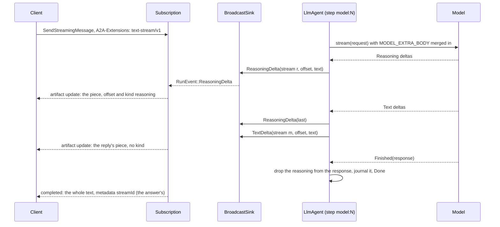
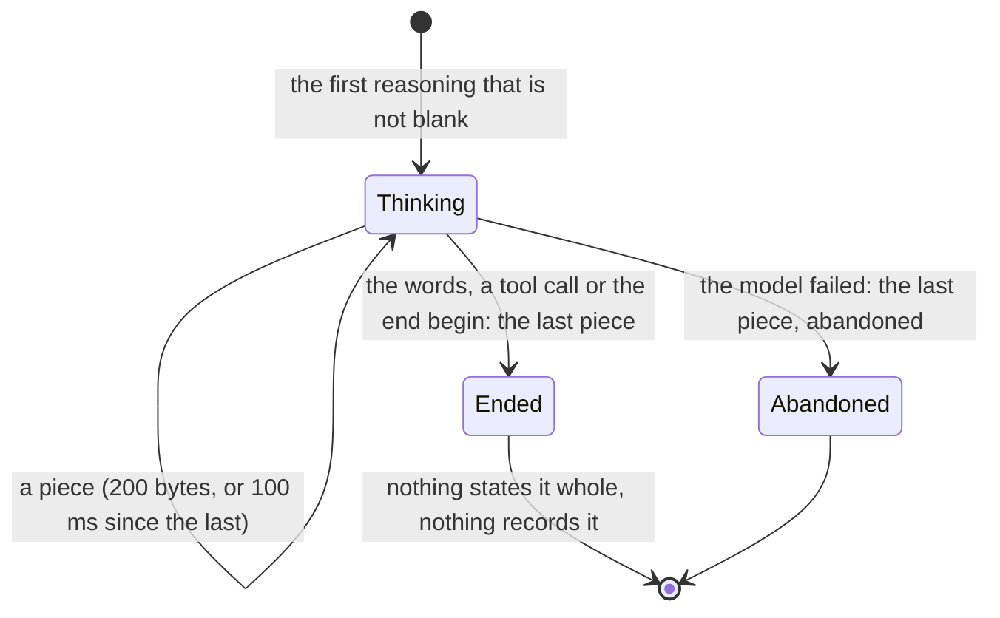

# 0020. Reasoning is streamed beside the answer, kept nowhere by the agent, and sent back only when the provider requires it

Status: **Accepted** (2026-10-05), decided on the owner's delegation; the owner may revisit.
Builds on [ADR 0007](0007-progress-as-steps-and-streamed-text.md) (the model's words are streamed as `RunEvent::TextDelta`
and `text-stream/v1`) and [ADR 0014](0014-a-turn-output-answer-is-the-runs-answer.md) (the run's answer is its output
text). The contract it amends is the orchestration layer's, `docs/api/text-stream-v1.md` of `vymalo/another-agentic-system`,
amended in the same change set (note of 2026-10-05).

## Context

A model in thinking mode writes its reasoning before its answer, and the owner sees none of it: the model client read only
`content` and `tool_calls`, so `reasoning_content` was dropped on the way in. The screen should show it as a collapsed
"Thinking" block above the answer, streaming while it is open, from the model to the web.

Facts the design rests on, each *verified 2026-10-05* from the page named (the per-provider table, with the request flags, is
in [`crates/adam-model-openai/README.md`](../../crates/adam-model-openai/README.md#reasoning)):

* A provider names the field `reasoning_content` (DeepSeek, GLM, LiteLLM) or `reasoning` (OpenRouter, current vLLM; Ollama's
  field on its OpenAI-compatible endpoint is *unverified*), as a delta of a stream and as a member of a completion's message.
  Sources: <https://api-docs.deepseek.com/guides/thinking_mode>, <https://docs.z.ai/guides/capabilities/thinking-mode>,
  <https://docs.litellm.ai/docs/reasoning_content>, <https://docs.vllm.ai/en/latest/features/reasoning_outputs.html>,
  <https://openrouter.ai/docs/use-cases/reasoning-tokens>.
* **Whether reasoning goes back to the model is the provider's rule, and DeepSeek's is the opposite of the one the request for
  this change assumed.** DeepSeek's thinking mode: "for requests carrying the `tools` parameter, the `reasoning_content` must be
  fully passed back to the API in all subsequent requests — even for turns where the model did not perform a tool call. If your
  code does not correctly pass back `reasoning_content`, the API will return a 400 error", and for a request without `tools` it
  "does not need to be passed back; even if passed to the API, it will be ignored"
  (<https://api-docs.deepseek.com/guides/thinking_mode>). GLM's preserved thinking (`"clear_thinking": false`) asks for the
  complete reasoning back on the assistant message and improves reuse of its cache, without being an error to omit
  (<https://docs.z.ai/guides/capabilities/thinking-mode>); OpenRouter asks for it back "particularly... for tool-use
  scenarios" (<https://openrouter.ai/docs/use-cases/reasoning-tokens>). Almost every other model wants none.
* Thinking is on by default for DeepSeek's V4 models ("Thinking mode is enabled by default, with the default effort being
  `high`") and for GLM-4.7 and later. A gateway that fronts a model that needs a flag to think (`reasoning_effort`,
  `chat_template_kwargs`, `thinking`) has to be told.

## Decision

1. **The model port carries reasoning beside the answer, never in it.** `ModelDelta::Reasoning(String)` pieces while the model
   writes, and `ModelResponse.reasoning: Option<String>` whole. `Message::text()` never holds it. `adam-model-openai` reads
   `delta.reasoning_content` and `delta.reasoning`, and `message.reasoning_content` and `message.reasoning` (the first that is a
   string that is not empty; a structure is ignored, and the chunk it came in still counts).
2. **Reasoning is not in the history and not sent back, by default.** `Message::Assistant` has a `reasoning` member that is
   written only when present, and it is `Some` only when the **model client was set to echo reasoning**
   (`OpenAiCompatible::with_echo_reasoning`, `MODEL_ECHO_REASONING=reasoning_content|reasoning`): then the client keeps it in the
   message it returns, so that the run's stored history holds it, and sends it on the assistant message under that member name.
   The wire layer sends it only when the client is set to, whatever a message holds (two gates). Off, which is the default, a
   request never carries reasoning and no history holds it. **It is on for DeepSeek's thinking mode with tools, and only the
   owner can say that**: the cost is that the run's state grows with every turn's reasoning and is sent again in every request.
3. **A flag that makes a model think is a deployment value.** `MODEL_EXTRA_BODY`, a JSON object merged into the top level of
   every chat-completions request (`OpenAiCompatible::with_extra_body`), not secret, empty by default. Nothing of the kind
   existed (*verified 2026-10-05*: no `extra_body` in the crates, no `MODEL_` variable beyond the three). A value that is not a
   JSON object, or that sets `model`, `messages`, `tools`, `tool_choice` or `stream` (the client owns them), is a startup error
   (exit 78, the message names the variable and never repeats the value). The chart renders it from `config.modelExtraBody`.
4. **Reasoning is its own run event and stream.** `RunEvent::ReasoningDelta { stream, offset, text, last, abandoned }` has the
   shape and bounds of `TextDelta`. A new variant, not a flag on `TextDelta`: a process that predates it ignores the event
   (`adam-notify-postgres` drops what it cannot read), so reasoning is never taken for the answer's text during a rolling
   deploy, and every `match` over `RunEvent` must say what it does with it. Its stream id is its own, `<run>-r<turn>-<hex8>`
   (the words' is `<run>-m<turn>-<hex8>`). It opens on the first reasoning that is not blank, **ends (`last`) when the words, a
   tool call or the end of the answer begin**, so it is always over before the words of its turn are sent, and ends `abandoned`
   when the model fails. A model that does not stream (`stream_text(false)`) has its reasoning said whole, cut in pieces, before
   its words.
5. **Reasoning is kept nowhere by the agent.** The step `model:<turn>` drops it from the response before the journal records it
   (`Recorded` holds none), so it is in no journal, no run state (unless the client echoes it, decision 2), no output, no
   `turn_output` and no step; a replay sends no reasoning, as it sends no pieces. How much a turn reasoned is a DEBUG line
   (`reasoning_chars`, never the text); nothing is logged at INFO.
6. **On A2A it is `text-stream/v1` chunks marked as reasoning.** The chunk is the contract's, with `"kind": "reasoning"` beside
   `offset` in the metadata entry, the artifact named `reasoning` and its own `artifactId`. No status message states a
   reasoning stream whole: it is transient, like every chunk, and a client that wants it keeps the pieces (the orchestration layer
   does, and logs it: its ADR 0044). A chunk with no `kind` is a reply, as before.

## Alternatives rejected

* **A flag on `RunEvent::TextDelta` (`kind`).** An old process would send reasoning as the answer's text in the rolling deploy
  it is meant to survive. A new variant fails closed instead.
* **A new extension URI for reasoning.** The activation is one header of URIs; a second URI would make every client and card
  carry two, for a thing that is a kind of stream. The price of staying inside `text-stream/v1` is in *Consequences*.
* **A `ContentPart::Reasoning` in the message.** `Message::text()` and `content_value` would have to be taught to skip it, and
  one place that forgot would put reasoning in the answer or in a request. A separate, optional member is skipped by default.
* **Stating the whole reasoning in a status message, like the words.** It would be journaled in the run's output or sent as a
  status of up to the size of the reasoning (a `NOTIFY` payload takes under 8000 bytes, and an oversized `Custom` event does
  not cross between processes). Reasoning is not an answer; the chunks are enough for a client that wants to show it.
* **Always sending reasoning back, or never.** The first is wrong for almost every model, the second is a 400 for DeepSeek's
  thinking mode with tools (verified above). A setting of the client, off by default, is the smallest thing that serves both.

## Consequences

* **Breaking for implementers and for code that builds these types** (the PR says so, and the READMEs of `adam-model`,
  `adam-runtime`, `adam-model-openai` and `adam-service` do): `ModelResponse` and `Message::Assistant` have a new field,
  `ModelDelta` and `RunEvent` a new variant, `OpenAiConfigError` a new variant, `adam_service::ModelConfig` two new public fields
  (`extra_body`, `echo_reasoning`). A `ModelClient` that never reasons changes nothing but the literals.
* **Version skew.** A client that activated `text-stream/v1` and does not know `kind` reads a reasoning chunk as a reply chunk of
  a stream nobody states. Roll out the reader first (the orchestration layer reads `kind` from its ADR 0044), the agents after.
  The contract's amendment says so.
* **`MODEL_EXTRA_BODY` applies to the agent's own model calls**, not to OpenCode's (`OPENCODE_MODEL`), which the coder runs as a
  child process with its own configuration.
* **Not verified:** that LiteLLM forwards a `reasoning_content` it receives on an assistant message to DeepSeek unchanged
  (its page documents the response side and Anthropic's `thinking_blocks`); that the owner's two models answer to the flags in
  the README; how Ollama names the reasoning of its OpenAI-compatible endpoint. Nothing here was run against a real model.
