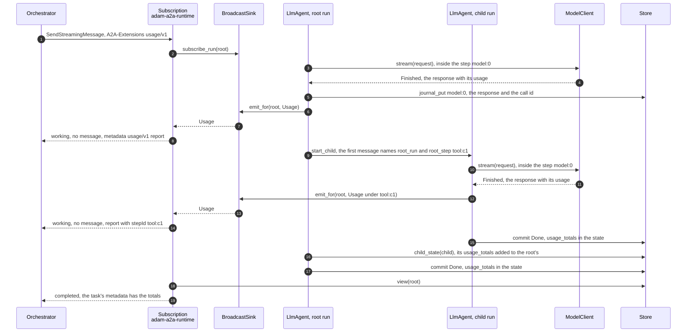
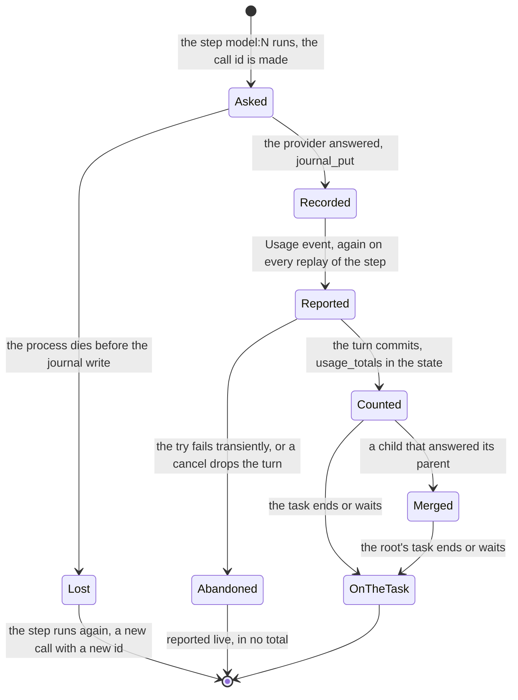

# 0032. The tokens of each model call, and a task's totals

Status: **Accepted** (2026-10-08), at the owner's request ("a token gauge: usage per model call from adam-rs to the
orchestrator's log to the web, sub-agents counted apart"). The contract is the orchestration layer's `usage/v1`,
<https://github.com/vymalo/another-agentic-system/blob/main/docs/api/usage-v1.md>, written beside this decision and
implemented there in parallel (its ADR 0056); the page exists on `main` once that change merges, and until then it is in
the change. Builds on [ADR 0007](0007-progress-as-steps-and-streamed-text.md) (run events, `Caller::extensions`, the
journaled model step), [ADR 0028](0028-the-card-says-which-build-answers.md) (an extension every card lists) and
[ADR 0031](0031-swagger-ui-and-the-a2a-rest-binding.md) (two bindings, one handler).

## Context

*Verified 2026-10-08 by reading the code at `61d2ade`:* `adam_model::Usage` held the prompt and completion tokens only, the
OpenAI-compatible client dropped the rest of a response's `usage`, and `LlmAgent` summed both into `Conversation::usage`,
which nothing reported. A subagent is a **child run**: its events are its own run's, and the A2A subscription of a task follows
the task's run only (`RunSubscription::recv` filters by run), so a client never heard a subagent's work except as the
parent's `tool:<call id>` step.

Facts the design rests on:

* **OpenAI's `usage`**, *verified 2026-10-08* in the API reference,
  <https://developers.openai.com/api/reference/resources/chat/subresources/completions/methods/create>:
  `completion_tokens_details.reasoning_tokens` ("Tokens generated by the model for reasoning"; "like reasoning tokens, these
  tokens are still counted in the total completion tokens"), `prompt_tokens_details.cached_tokens` ("Cached tokens present in
  the prompt") and `prompt_tokens_details.cache_write_tokens` ("The unadjusted number of prompt tokens written to cache");
  with `stream_options.include_usage` "an additional chunk will be streamed before the `data: [DONE]` message", whose
  `choices` is empty and whose `usage` is the whole request's, and "all other chunks will also include a usage field, but with
  a null value". `platform.openai.com` refused this environment (403); the page above is OpenAI's own reference.
* **AG-UI's `TokenUsage`**, *verified 2026-10-08* in the orchestration layer's vendored schema
  (`orchestrator/crates/agui-proto/schema/ag-ui-1.0.schema.json`, `$defs.TokenUsage`): `inputTokens` and `outputTokens` are
  totals, `reasoningTokens`, `cachedInputTokens` and `cacheWriteInputTokens` parts of them ("never additions"), and "a provider
  that reports reasoning tokens beside a smaller completion count has them added in by the producer" (the same for the cache
  counts and the input); every count at most 9007199254740991.
* **A status update needs no message**, *verified 2026-10-08* in `a2a-lf` 0.3.1 (`src/event.rs`, `src/types.rs`):
  `TaskStatusUpdateEvent.metadata` and `TaskStatus.message` are both optional.
* **ACP gives no count per call**, *verified 2026-10-08* in `agent-client-protocol-schema` 1.9.1 (`src/v1/client.rs`,
  `src/v1/agent.rs`): `SessionUpdate::UsageUpdate` is `{used, size, cost}`, the context used and its size, and the turn's
  `usage` of `PromptResponse` is behind the feature `unstable_end_turn_token_usage`, which this workspace does not turn on;
  `adam-acp` drops `usage_update` (`crates/adam-acp/src/update.rs`). Whether OpenCode sends `usage_update` is *unverified*.

## Decision

1. **`Usage` counts every token the contract names** (`adam-model`). It gains `reasoning_tokens`, `cached_input_tokens` and
   `cache_write_input_tokens`, each an `Option` (`None` when the provider did not say, left out of the JSON so a usage recorded
   before reads the same), and becomes `#[non_exhaustive]`, built with `Usage::new` and `with_*`. `accounted()` applies AG-UI's
   rule (a part above its total is added in; twice is once), `saturating_add` sums two calls part by part. The OpenAI-compatible
   client reads the three details named above, from a completion and from a stream's last chunk, and applies `accounted()`.
2. **Provider, model and window come from the model client and the deployment.** `ModelClient` gains two **default** methods:
   `provider()` (`None`; the OpenAI-compatible client says `openai`: nothing in a deployment names a provider today, and none is
   added) and `context_window(alias)` (`None`). The model is the alias the agent asks for. `MODEL_CONTEXT_WINDOW` is read with the
   other `MODEL_*` variables (`ModelConfig::context_window`, a whole number from 1 to 2^53 - 1, anything else a startup problem,
   exit 78), and the client says it **for the alias `MODEL` only**. It is not an agent file setting: a folder names an alias, and
   which model an alias is, and so its window, is the deployment's (the same folder runs against different gateways). A subagent
   whose `model:` names another alias reports no window rather than a wrong one.
3. **One event per completed model call** (`adam-runtime`, `adam-llm-agent`): `RunEvent::Usage(UsageEvent)` with the call's id,
   the step it ran under, the provider, the model, the `Usage` and the window. `LlmAgent` emits it when the journaled step
   `model:<turn>` returns an answer, **each time the step is passed**, a replay included. The id is `<run id>-c<turn>-<8 hex>`,
   **made inside the step and recorded with the answer** (the record's `call` member, beside `stream`), as the stream id is
   (ADR 0007, decision 10): a replay reads it from the journal and says the same report again; a call made again is another id
   (a process that died before the journal write asks again, and a transient retry starts at a fresh journal position). A
   journal written before this reports under `<run id>-c<turn>`. The run id makes it unique within the task, a child's too.
4. **A subagent's call is its root's work.** `ToolCtx::start_child` puts, beside the root run, the **root's step** the child works
   under in the child's first message (`root_step`: the root's `tool:<call id>`, handed down to a child's children), and the
   child emits its reports **as events of the root run** (`Emitter::emit_for`) under that step. Not of its own run: nobody
   subscribes to a child over A2A, and the root's subscribers are the task's.
5. **The A2A side** (`adam-a2a-runtime`). For a request that activated `usage/v1`, each report is a `working`
   `TaskStatusUpdateEvent` with **no message** and the report in the event's `metadata` under the URI; for any other, nothing.
   A task that is `completed`, `failed`, `canceled` or `input-required` carries `Task.metadata[URI] = {"totals": [...]}` for
   every reader, built when the task is read (`task_from_view`): `GetTask`, `ListTasks`, a stream's snapshot, a blocking send.
   A working task carries none.
6. **The totals are the agent's state; the store does not change.** `Conversation::usage_totals` (`adam_runtime::UsageTotals`)
   counts every call of the run per provider and model, at most 32 entries, committed with the turn, so a task taken up again
   after a question goes on from them. When a child answers (its message, or the timer's read), the parent adds the child's
   totals, read with a new live read of a child's state, `Ctx::child_state` (the run's own children only, like `child_status`).
   `Conversation::usage` stays the run's own calls.
7. **Every card lists it**: `ExtensionConfig::usage()`, `USAGE_EXTENSION`, the contract's description; `adam-agent` and
   `adam-coder` add it with `steps/v1` and `text-stream/v1`.
8. **Bounds**: a count is at most 2^53 - 1 and the counts stay consistent (`totalTokens` the sum, a part within its total); a
   call id, a step and a label at most 128 bytes, cut on a character boundary.

## Consequences

* **Breaking**, said in the READMEs and in `adam-upgrade`: `Usage` is `#[non_exhaustive]` with three new fields (a struct
  literal outside `adam-model` becomes `Usage::new(..)`); `RunEvent` has a new variant, `Usage` (an exhaustive `match` needs an
  arm; a process that predates it drops it, as `adam-notify-postgres` does every event it cannot read); `ModelConfig` has a new
  public field, `context_window`; `Conversation` has `usage_totals` and `root_step` (both serde-defaulted, so a stored state
  reads); `adam-runtime` now depends on `adam-model` for the token counts. **No required trait method** and **no store change**:
  `ModelClient::provider` and `context_window` have defaults, and the totals are in the state every store already keeps.
* A journal entry of a model call holds one more member, `call`; a build that predates it ignores it.
* **What the totals miss**, by design: the call of a try that failed transiently and was retried (the try's state is abandoned,
  and the retry's own call is counted), the call of a turn a cancel ended, the calls of a child whose parent was canceled before
  it answered (the child is not canceled: [child runs](../reference/child-runs.md#failure-interleavings)), a remote (`a2a:`) subagent's calls
  (its own agent's task; AG-UI's rule: an agent run as a separate run reports its own) and OpenCode's (ACP says none). The sum of
  the live reports can therefore exceed the totals by exactly those; the contract keeps the totals as the record.
* **OpenCode reports nothing**: the coder's `Hand to OpenCode` step has no report and its tokens are in no total. Counting them
  needs ACP's turn usage, an unstable feature of the protocol today.
* A client that reads a stream gets the totals from the task (`GetTask`, or the snapshot of `SubscribeToTask`); the status update
  that ends a stream carries no metadata, as the contract places the totals on the task.
* The SDK writes a number of metadata as a float on both bindings, a whole one (`41250.0`); the bound of 2^53 - 1 keeps it exact.
* The scripted models of `dev/wiremock/mock-openai` say cached and reasoning tokens in every answer (both forms), `compose.yaml`
  sets `MODEL_CONTEXT_WINDOW` for the coder, and `dev/greeting-e2e.sh` activates the extension and checks the greeting's report
  and the task's totals. The chart and the operator have no value of their own for the window yet: `config.extraEnv` sets it.

## Alternatives considered

* **Totals from the journal** (every recorded `model:*` entry, abandoned tries included). Rejected: a `GetTask` or a page of
  `ListTasks` would read every journal entry of every task and of every child, and nothing lists a run's children
  (`Store::children` does not exist, `docs/reference/child-runs.md`).
* **Totals in a store column.** Rejected: a `Store` method and a migration in three stores for what the state already holds.
* **The subscription follows the children's runs.** Rejected for the same reason: it would have to know the children.
* **A call id from the journal position alone.** Rejected: the position is the runtime's (`Ctx` keeps it), and a call made again
  after a crash would reuse the id of the call that was lost; the turn and a suffix made in the step mirror the stream id.
* **Reports as `RunEvent::Custom`.** Rejected: untyped, and every host would parse JSON to read them.
* **The window in the agent's files.** Rejected in decision 2.
* **The totals also on the last status update of a stream.** Not done: the contract puts them on the task; a change of the
  contract would be the orchestration layer's to make.

## Verified and unverified

* *Verified 2026-10-08* by tests in this repository: the wire parsing of the three details, from a completion and a stream's last
  chunk, absent ones, and reasoning or cache counts beside a smaller total added in (`crates/adam-model-openai/src/wire.rs`);
  `MODEL_CONTEXT_WINDOW` (`crates/adam-service/src/config.rs`, `bin/adam-agent/src/config.rs`); one report per call, a subagent's
  (and its own child's) on the root under the root's step, a replay under the recorded id, a retry under another, the totals
  (`crates/adam-llm-agent/tests/usage.rs`); the largest report fits a `NOTIFY` payload (`crates/adam-notify-postgres/src/wire.rs`);
  the A2A side, both bindings over HTTP, a resubscribe, the totals of a completed, failed, canceled, waiting and resumed task
  (`crates/adam-a2a-runtime/tests/usage.rs`); the coder end to end over the OpenAI-compatible client with its explorer
  (`bin/adam-coder/tests/e2e.rs`); the cards (`bin/adam-agent/tests/agent.rs`, `bin/adam-coder/tests/fixtures/agent/card.json`).
* *Verified 2026-10-08* against the contract (`docs/api/usage-v1.md` of the orchestration layer, proposed 2026-10-08): the URI, the
  card entry, the activation, the report's members, the totals' place and states, the bounds.
* *Unverified*: which OpenAI-compatible gateways send the details, and whether `cache_write_tokens` is disjoint from
  `cached_tokens` everywhere; the dev stack's check (`dev/greeting-e2e.sh`) and the scripted models' twins
  (`wiremock_compose`), which CI's `coder` and `compose` jobs run and this change did not run (no Docker here); how the
  orchestrator and the screen read the reports, which is that repository's.
