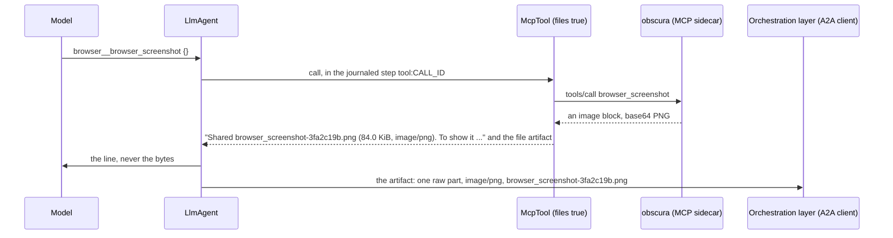
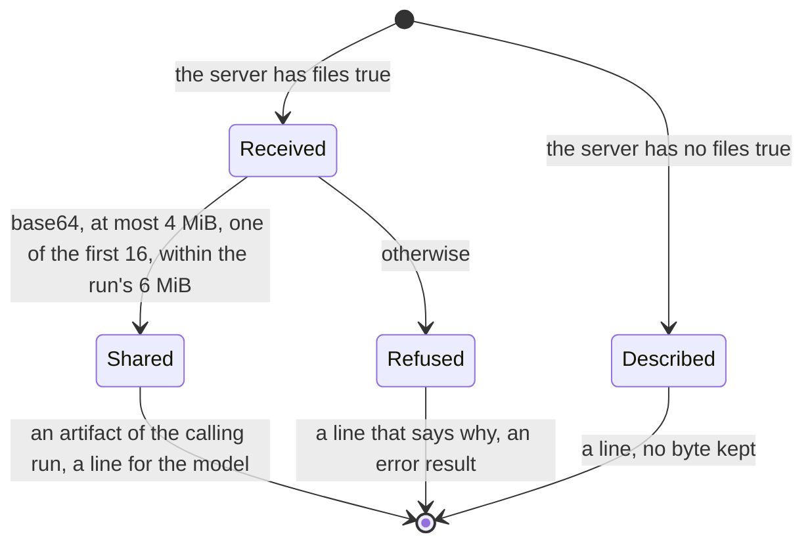

# 0033. Files from an MCP result, or from a remote subagent, are shared files

Status: **Accepted** (2026-10-09), at the owner's request: a **browser agent** (an `adam-agent` folder that the
orchestration layer's chart deploys, with the headless browser obscura as a sidecar MCP server over loopback HTTP, one task
per replica) that Chat, Chat's researcher and Adam ask, and "a dedicated tool to pass files from agents to the
orchestrator". Builds on [ADR 0012](0012-files-as-a2a-artifacts.md) (a file is an A2A artifact with a `raw` part; the
caps; the model never sees the bytes).

## Context

*Verified 2026-10-09 by reading the code at `e95503e`:* `adam-mcp` turned every image, audio clip and blob of a tool's
result into a line for the model (`[image not included: image/png]`, `[binary resource not included: <uri> (<type>)]`,
`src/tool.rs`) and kept no byte of it. A screenshot a browser took was seen by nobody. The one way an agent handed a file
over was the coder's `share_file`, which reads a file of its workspace; a folder agent has no workspace, so it had nothing.
And an adam agent that asks another over A2A (a remote subagent, `a2a:`) turned a `raw` file part of the answer into a
line, ``[file `page.png` not included: ...]`` (`adam-assembly`, `src/remote.rs`): the browser agent's screenshot would stop
at Chat when Chat asks it as a subagent.

* **What obscura answers**, *verified 2026-10-09* by reading `crates/obscura-mcp/src/lib.rs` of
  <https://github.com/h4ckf0r0day/obscura> at tag `v0.2.4` (commit `1fccab2`): `browser_screenshot` returns one content
  block `{"type": "image", "data": <base64 PNG>, "mimeType": "image/png"}` and `browser_pdf` one block
  `{"type": "resource", "resource": {"uri": "obscura://capture/current-page.pdf", "mimeType": "application/pdf",
  "blob": <base64>}}` (`tool_screenshot`, `tool_pdf`, both behind the crate's `render` feature). No text block, no
  `annotations`.
* **What MCP says a file is**, *verified 2026-10-09* in the specification's `schema/2025-06-18/schema.ts` and
  `schema/2025-11-25/schema.ts` (<https://github.com/modelcontextprotocol/modelcontextprotocol/tree/main/schema>):
  `ImageContent` and `AudioContent` carry `data` ("base64-encoded") and a required `mimeType`; an `EmbeddedResource`
  carries `TextResourceContents` or `BlobResourceContents`, whose `blob` is "a base64-encoded string" and whose
  `mimeType` is optional. `Annotations.audience` ("who the intended customer of this object or data is") exists and is
  optional.

## Decision

1. **A server opts in, in its own entry: `"files": true`.** An adam extension of `mcp.json`, beside `tools` and
   `optional`; a boolean, default `false`. Without it a file is described in a line as before and no byte is kept (fail
   closed). It is the file's because it says what becomes of a server's answers, which the author of the folder knows (a
   browser's screenshots are for the person, a search server's favicons are not); what kinds of server may run stays the
   deployment's (`MCP_ALLOW_*`).
2. **Each image, audio clip and embedded blob of such a server's result is a file artifact of the run**, the
   `adam_runtime::Artifact::file` that `share_file` returns, which the A2A server serves as one `raw` part with
   `mediaType` and `filename` (ADR 0012). So it reaches an A2A client, the orchestration layer included, exactly as a
   shared file does: that layer stores it unchanged in its artifact store (its ADR 0032) and its web shows it. **This is
   the hand-over the owner asked for**: no new tool and no extension. A folder agent's files come from its tools, and the
   tool that makes a file is the one that shares it.
3. **Named after the tool and the content**: the tool's name on the server, the first 8 hexadecimal digits of the
   SHA-256 of the bytes, and the extension of the checked media type (`browser_screenshot-3fa2c19b.png`,
   `browser_pdf-9d04e1a7.pdf`; `bin` for an unknown type). Names are unique within a run, so two screenshots of one
   run never share a name and the inline image of the second never shows the first, and a replay names a file as it
   did. The tool's name is a valid file name by construction (`[A-Za-z0-9_-]`); a URI from the server is not used.
4. **The media type is the server's, checked against the bytes**, by the rule `share_file` already had for an extension,
   moved to `adam_runtime::checked_media_type` so that there is one: a declared PNG, JPEG, GIF, WebP or SVG must be that
   image by its bytes, bytes that are an image declared as something else disagree, and both are
   `application/octet-stream`; a type the rule cannot check stands.
5. **The model reads one line**,
   `Shared browser_screenshot-3fa2c19b.png (84.0 KiB, image/png). To show it in your answer, write .`
   (`Artifact::shared_line`, which `share_file` says too), in place of
   the block. The second sentence is for an image only: a model that wrote an image's workspace path
   (``, seen in an owner's thread of 2026-10-09) left the person's screen nothing to resolve,
   and the screen resolves an image's source against the files shared in the run, by the share's path and then by the
   file's name. So the line names the file, never a path; this amends ADR 0012 (5). The bytes are never in the history, the step's output or the context.
6. **Bounded before the journal sees it.** The tool's whole result is journaled in `tool:CALL_ID` (and a remote's in
   `poll:CALL_ID`) before the agent loop applies the run's 6 MiB (`MAX_RUN_FILE_BYTES`) in `output_message`, so the
   loop's cap alone would let one result carry 16 files of 4 MiB into one journal entry, over MongoDB's 16 MiB document
   and unbounded on Postgres. So a result shares at most 4 MiB a file (`MAX_ARTIFACT_FILE_BYTES`), 16 files, and **what
   the run may still share**, which the loop gives every call and poll (`ToolCtx::files_left`), checked on the length
   (the base64's, whitespace left out, or the part's) before anything is decoded or copied. A file that is not shared,
   for any of these or because it is not base64, is a line that says why, and the result is an **error result**: the
   person did not get what the call made, and the model is told to ask for a smaller one or say so.
7. **A subagent's files stay on the subagent's run**, as `share_file`'s do (`bin/adam-coder/README.md`, "Subagents"): the
   call is the subagent's, so its run holds the artifact and the budget, and only its text reaches the parent.
8. **In the shared layer.** It is `adam-mcp`'s, so `adam-agent`, `adam-coder` and any program that connects an
   `mcp.json` through `adam-assembly` get it. A text file is scrubbed by the server's redactor like the text of a result.
   The rule itself (names, checked types, the caps, the refusals) is `adam_runtime::ReceivedFiles`, one place for every
   source of a file that another system sent.
9. **A remote subagent passes files on with `files: true` in its file.** The same key, the same default (off: a `raw`
   part is a line, as before) and the same rule: each `raw` part of the remote's answer becomes a file artifact of the
   calling run, named `<base>-<hash>.<ext>` from the sender's file name (its base cut to `[A-Za-z0-9._-]`, else the
   subagent's name; never its extension, which follows the checked type: `evil.html` that is not a PNG is a `.bin`), and
   under the remote artifact's name (one line, at most 120 characters) when the part is its only one. So the browser agent's screenshot reaches the orchestration layer whether it asks
   the browser itself or asks Chat, which asks the browser. A file at a `url` part is not fetched (it would need the
   remote's credentials somewhere else, and could point anywhere): it stays a line. A subagent's files stay on its run
   (7), so a screenshot the researcher gets from the browser stops at the researcher, by design.

10. **The files are untrusted content.** Nothing a sender says of a file is believed: the type is checked against the
    bytes, the name is made here (and `Artifact::file` refuses a `:`, so a name never reads as a URL in a Markdown
    link), a refusal repeats the sender's type only when it is one. The bytes stay the sender's: a client serves them as
    an attachment or sanitizes them (a claimed `text/html`, an SVG), as the orchestration layer's artifact store does.

## Consequences

* **Breaking for code that builds `adam_agent_fs::McpServer`, `RemoteAgent` or `EmbeddedRemote` by hand:** each gained
  `files: bool` (a struct literal or a pattern without `..` stops compiling). Files are unchanged: `files` is absent until
  an author adds it, and it is left out of a manifest's JSON when `false`, so a folder's digest does not move.
* The coder's `share_file` reads its media type through `adam_runtime::checked_media_type` and says its line with
  `Artifact::shared_line`; what it shares is unchanged. A file an MCP server shared is not "delivered" in the coder's run
  notes (`RunNotes::shared` stays `share_file`'s).
* `adam_runtime::Artifact::file` refuses a file name with a `:`, which `share_file` meets too: a workspace file named
  `a:b.txt` is no longer shared (rename it). This amends ADR 0012 (2).
* The same file shared twice in a run has the same name and the same artifact (its id follows its content, ADR 0012);
  two different files never share a name.
* **Follow-up:** the HTTP clients do not cap a response body: an MCP server or a remote agent can still send a huge
  answer, which is held in memory before these caps refuse its files. `rmcp`'s transport and the A2A client take a
  `reqwest::Client` that has no body limit; a cap there is not built here.
* The journal carries the files, as for `share_file` (ADR 0012, 3): a browser agent that takes many screenshots meets the
  6 MiB of its run and is told so.
* The MCP testkit gains `screenshot`, `pdf` and `png { bytes, count? }`, the shapes obscura answers with.

## Alternatives considered

* **A deployment switch (`MCP_SHARE_FILES`).** Too coarse: it shares every server's images, a search server's thumbnails
  too, and the deployment does not know which server makes what the person asked for. The folder does.
* **A `share_file` tool for folder agents.** A folder agent has no file system to read from, so the model would pass the
  bytes through its context, which ADR 0012 (4) rules out.
* **Showing the image to the model** (a vision content part). Not what was asked, it costs tokens on every later turn, and
  the person still does not get the file. A later value (`files: "model"`) could add it beside the share.
* **`annotations.audience`** to choose blocks: optional in the specification and absent from obscura's answers, so it
  cannot be the switch. A later refinement could leave a block marked `["assistant"]` alone.

## Verified and unverified

* obscura's answers and the MCP schema: *verified 2026-10-09*, sources above.
* The size of obscura's screenshots and PDFs of real pages: *unverified*. A long page's raster PDF may be over 4 MiB; it is
  then refused with a line, not cut.
* Whether the orchestration layer's web renders an `application/pdf` artifact or only offers it for download:
  *unverified*; it stores any type (its ADR 0032).
