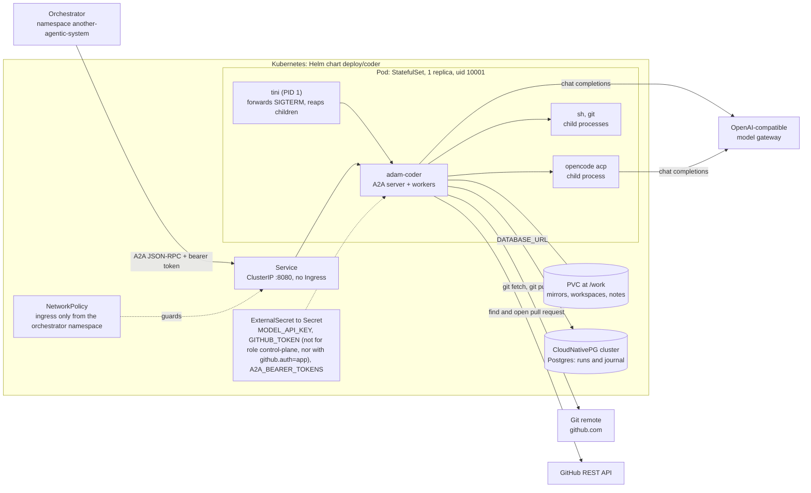
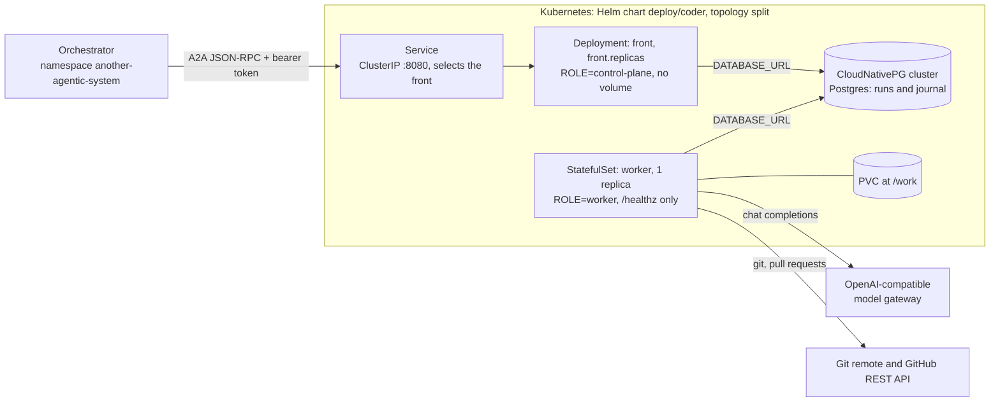
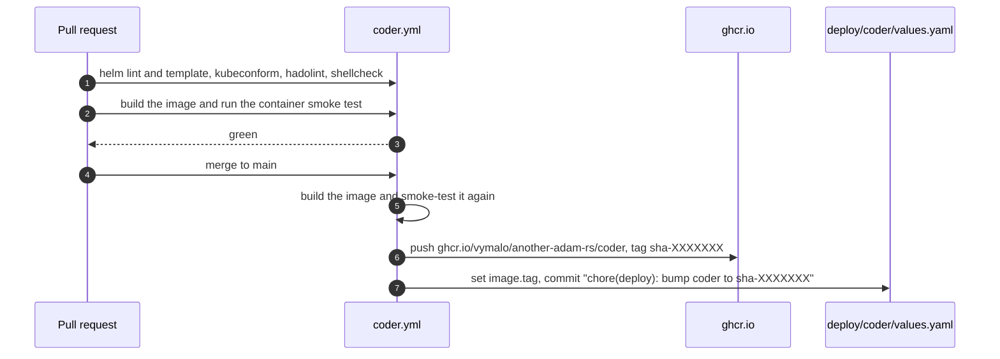

# Deploy the coder

The coder is one image, `ghcr.io/vymalo/another-adam-rs/coder` (built from `docker/coder/Dockerfile`), deployed
by the Helm chart in [`deploy/coder`](../../deploy/coder/README.md). The chart README documents every value;
this page is the path through the decisions. How the chart reaches the cluster after merge is outside this
repository (*unverified* here).

## What you get

One container, one process, one database. Reachable **only inside the cluster**: the orchestrator calls A2A on
the Service with a bearer token; there is no Ingress.



`topology: split` runs the two halves as separate workloads: a stateless front (`ROLE=control-plane`, no volume)
the Service selects, and the worker StatefulSet (`ROLE=worker`, `/healthz` only):



## The image

`docker/coder/Dockerfile`, built from the **repository root**, has three stages: it compiles `adam-coder`,
`adam-agent` and `adam-kube-exec` on a pinned `rust:1.94-trixie` (tag and digest, so glibc matches the runtime
image); it takes the official `github-mcp-server` binary (pinned by tag and digest); and the runtime is the
`workspace` image of `vymalo/another-agentic-images` (Rust, Flutter/Dart, Node, git, tini, OpenCode), pinned by an
immutable tag, with those binaries, the devcontainer CLI and Podman's remote client added. It runs as uid 10001,
listens on `0.0.0.0:8080`, keeps its files in `/work`, and its entrypoint is `tini -- adam-coder` (`tini` forwards
SIGTERM and reaps children). Tags are `sha-<7>` of the commit. Both agents' binaries are smoke-tested in CI
(`docker/coder/test/`).

## Before you start

| You need | Why |
|---|---|
| Kubernetes 1.29+ (1.30+ for run pods) | the GitHub MCP server is a native sidecar; run pods use a `ValidatingAdmissionPolicy` (*unverified*, from memory) |
| the CloudNativePG operator, **or** an existing Postgres | the run store; `database.enabled: false` + `database.existingSecret.name` for your own |
| External Secrets (`ExternalSecret`, `external-secrets.io/v1`) | the three secrets below; the defaults point at one owner's `secretStoreRef` and `key`, override them |
| a StorageClass | the PVC at `/work` (a ReadWriteMany one for `shared` or `affinity` placement) |
| an OpenAI-compatible model gateway | `config.modelBaseUrl`, with its `/v1` prefix |
| a GitHub token, or a GitHub App | to push and open pull requests |

## Secrets

Nothing secret is in values or in git.

| Variable | AWS property (default) | For |
|---|---|---|
| `MODEL_API_KEY` | `adam_coder_model_api_key` | roles that run workers |
| `GITHUB_TOKEN` | `adam_coder_github_token` | workers, with `github.auth: token` (the default) |
| `A2A_BEARER_TOKENS` | `adam_coder_a2a_bearer_tokens` (comma-separated) | roles that serve A2A (the front, with `split`) |
| `MODEL_BASE_URL` | `model_base_url` | only with `config.modelBaseUrlFromSecret: true`, to keep the URL out of git |

Put an AWS property in place **before** turning an option on that reads it: a missing property fails the whole
`ExternalSecret` sync. With a GitHub App there is no `GITHUB_TOKEN`; you make the Secret that holds the App's
private key (`private-key.pem`) yourself and name it in `github.app.privateKeySecret`; the chart never holds it.
The orchestrator holds one of the bearer tokens.

## Install

```sh
helm lint deploy/coder
helm template coder deploy/coder --namespace another-agentic-system          # read what it will create
sh deploy/coder/tests/render-check.sh                                          # the guarantees, asserted on the render
helm upgrade --install coder deploy/coder --namespace another-agentic-system -f my-values.yaml
```

`image.tag` is bumped by CI on every green build of `main` (`sha-<7>`); do not edit it by hand.

The values you will actually set:

| Value | Decision |
|---|---|
| `config.modelBaseUrl`, `config.model`, `config.opencodeModel` | the gateway and the model alias (`coder`) |
| `config.publicUrl` | the URL clients reach (goes into the agent card); empty is the in-cluster Service URL |
| `topology` | `combined` (default) or `split`. Switch with `--set topology=split`; the Service selector moves to the front once it exists, so do it at a quiet moment |
| `replicaCount`, `workspace.placement` | more than one worker **needs** a placement (`isolated`, `affinity` or `shared`, [why](../reference/workspace-and-environments.md#placement-which-worker-holds-a-runs-files)); the chart refuses `replicaCount > 1` without one. Switching between a per-pod and a shared volume needs `kubectl delete statefulset <release>-coder --cascade=orphan` first |
| `github.auth`, `github.app.*` | `token`, or `app` with exactly one of `installationId` (pinned) or `owners` (the accounts it may act for; no default list) |
| `config.allowedRepoHosts`, `config.githubApiUrl` | repository hosts the token may go to; GitHub Enterprise: add the host and `https://<host>/api/v3` |
| `github.createRepoOwners` | owners the coder may create repositories for, after the person agrees; empty turns it off |
| `database.*` | CloudNativePG `Cluster` (default) or `existingSecret` |
| `mcp.websearch.url`, `mcp.context7.enabled` | optional extra MCP servers, off by default |
| `config.modelExtraBody`, `config.modelEchoReasoning` | to make a model emit its reasoning |
| `runPods.enabled` | [below](#run-pods) |

Render-time guards stop a bad combination at `helm template`, not at rollout (`templates/_validate.tpl`).

## Verify

* The pods are `Ready` (probes hit `/healthz`; the GitHub MCP sidecar starts first).
* `GET <PUBLIC_URL>.well-known/agent-card.json` is public and returns the card; any other route without a bearer
  token is `401`.
* Send a task as in [Run it locally](run-locally.md#send-the-coder-a-task) with a real repository.
* A pod that exits **78** has a configuration problem (the log names the variable); **69** means Postgres is not
  reachable; a missing `ExternalSecret` property leaves pods in `CreateContainerConfigError`.

Graceful shutdown gets 120 seconds: on SIGTERM the workers finish the steps they are in; a step cut short by
SIGKILL is taken over once its lease expires.

## Run pods

`runPods.enabled: true` ([ADR 0019](../decisions/0019-a-runs-processes-in-a-pod-of-their-own.md)) runs each active
run's checks, commands and OpenCode in **a pod of its own**, so a build is bounded by a pod's memory (2Gi) and
not the coder's (about 1Gi). Off by default, and then invisible. It renders the pod template (a ConfigMap), a
`PriorityClass` and a `ResourceQuota` scoped to it, a ServiceAccount with a Role for `pods` and `pods/exec`, a
`ValidatingAdmissionPolicy` that refuses any pod of that ServiceAccount but the intended one, and a
`NetworkPolicy`. Needs Kubernetes 1.30+. A run pod sees the whole `/work` volume: it bounds memory and a crash,
it is not isolation between runs. Details and what is unverified on the owner's cluster:
[chart README, "Run pods"](../../deploy/coder/README.md#run-pods). The repository's devcontainer is **not** used
on Kubernetes ([why](../../deploy/coder/README.md#devcontainers-are-off-here)).

## A folder agent instead of the coder

The same image carries `adam-agent`. The chart deploys the coder only. For a folder agent, run the image with
the entrypoint `tini -- adam-agent`, the folder mounted read-only at `ADAM_AGENT_DIR` and readable by uid 10001,
and write your own manifest using the chart's StatefulSet as a model for the variables
([Write an agent](write-an-agent.md), [`bin/adam-agent`](../../bin/adam-agent/README.md#image-and-compose)).

## How a change reaches the chart



Pin a consumer to an image by tag **and** digest (`adam-upgrade`). The build context is the repository root.
A new GHCR package is private until its owner makes it public: check an anonymous pull before pointing a
deployment at it.

## Known risks

* **No database backups.** Losing the CNPG volume loses the run ledger, not the pushed branches or pull requests.
* **A pinned run whose worker never returns is stranded** (`affinity`, `isolated`): keep worker ids stable, do not
  scale in, keep the volumes.
* **`flock` on network volumes is unverified** for `shared` on NFS and Longhorn RWX.
* **The chart has not been applied with more than one worker**; the renders are checked, a live rollout is not.
* The `NetworkPolicy` is inert unless the cluster's CNI enforces policies.
* The model gateway's URL is not a credential: kept out of git, it is still in the pod's environment and the
  startup log.

Full list and the verified/unverified facts: [chart README](../../deploy/coder/README.md#known-risks).
