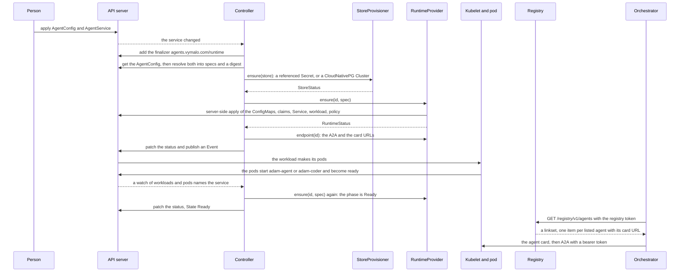
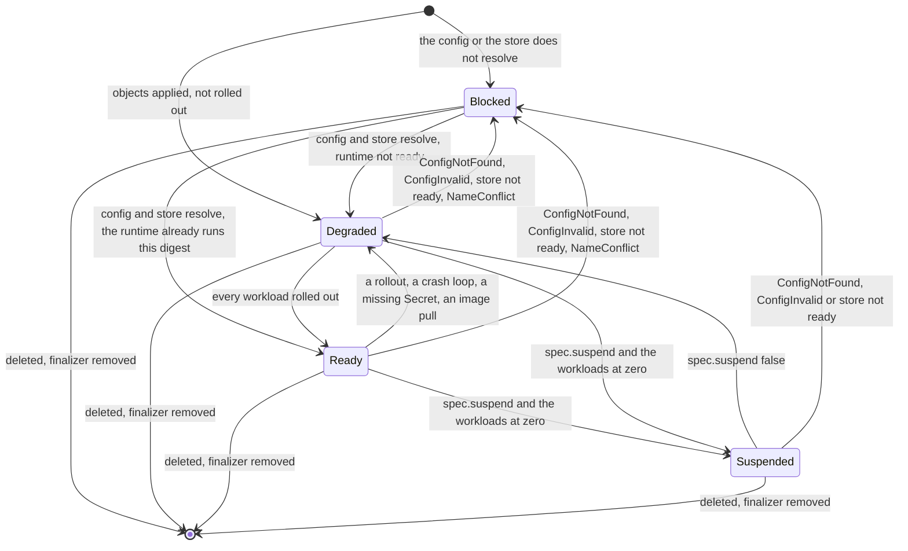

# Run agents with the operator

The operator ([ADR 0029](../decisions/0029-adam-rs-has-an-operator.md)) runs an agent from two custom resources
instead of a Helm release: an `AgentConfig` (what runs) and an `AgentService` (how it runs). It makes the pods, the
Service and the network policy, wires the database, and lists the agent in a registry for the orchestrator. The
coder chart is the other way to deploy the coder: [Deploy the coder](deploy-the-coder.md). Status: the types are
`v1alpha1`. The kind jobs of [`operator.yml`](../../.github/workflows/operator.yml) passed on `main` at `2644008` (*verified 2026-10-07*,
GitHub Actions API); this repository holds no production evidence (see the *Amended* note of the ADR).

## Before you start

| You need | Why |
|---|---|
| Kubernetes 1.29+ | the coder's GitHub MCP server is a native sidecar, as in the chart |
| the CRDs, [`deploy/operator-crds`](../../deploy/operator-crds/README.md), as a release of their own | **never prune it**: deleting a CRD deletes every `AgentService` and `AgentConfig` |
| the operator, [`deploy/operator`](../../deploy/operator/README.md#install), in the namespace it watches | a `Role` only, no right on Secrets |
| a Postgres Secret (key `uri`), or CloudNativePG | the run store: `store.postgres.secretRef` or `cnpg` |
| the Secrets you reference | bearer tokens, model key, and for the coder the GitHub token or App key: the operator never reads them |
| the coder image, by tag and digest | `ghcr.io/vymalo/another-adam-rs/coder:sha-<7>@sha256:<digest>`; the package must be public |

## Apply the pair

An agent that is only a folder is [`deploy/operator/examples/chat.yaml`](../../deploy/operator/examples/chat.yaml);
the coder is [`coder.yaml`](../../deploy/operator/examples/coder.yaml). Every secret in them is a `{name, key}`
reference, never a value.

```sh
kubectl apply -f chat.yaml
kubectl get agentservices -n <namespace> -w          # State: Degraded, then Ready
kubectl describe agentservice chat -n <namespace>    # the conditions and the Events
```

An object the schema refuses fails at `kubectl apply`; each rule has an invalid example in
[`examples/invalid`](../../deploy/operator/examples/invalid). A pair the schema accepts but the operator cannot
resolve (A2A left off, a name over 52 characters) is `Blocked`, reason `ConfigInvalid`.

## What happens



The first pass only adds the finalizer; the patch brings the second
([`reconcile_service`](../../crates/adam-operator-controller/src/service.rs)). A timer (5 minutes when settled,
15 seconds when not) backs every signal. The registry reads the controller's cache, lists a service that has A2A on
and is not `Blocked`, and answers only with its token
([`adam-operator-registry`](../../crates/adam-operator-registry/README.md)).



`Blocked` means the operator applied nothing and left what runs alone. The rule is `state` in
[`derive.rs`](../../crates/adam-operator-controller/src/derive.rs); the conditions and reasons are in the
controller README, [The status](../../crates/adam-operator-controller/README.md#the-status). Deleting runs the
finalizer: the workload goes, the claims and a CloudNativePG cluster stay under `deletionPolicy: Retain` (the
default) and go under `Delete`.

## When it is not Ready

| You see | Do |
|---|---|
| nothing happens, the operator pod is unready | the CRDs are missing: install `deploy/operator-crds` |
| `Blocked`, `ConfigNotFound` or `ConfigInvalid` | read the message: it lists every issue |
| `Blocked`, `NameConflict` | an object of that name is not the operator's (a Helm release's): remove it, the operator looks again every 15 s |
| `Degraded`, `MissingSecret` | the reason names the Secret: create it |
| `Degraded`, `ImagePull` | the tag is wrong, or the package is private (the CRD has no pull secret) |
| `Degraded`, `ConfigRejected` or `DependencyUnavailable` | the process exited 78 (read its log) or 69 (Postgres or a required MCP server is down) |
| `StoreReady` false, `CNPGNotInstalled` | `cnpg` without CloudNativePG, or `storeCnpg: false` in the operator chart |

## Moving the coder off its chart

A hard cutover. Write the pair from the release's values, name the service `coder`, and point
`store.postgres.secretRef` at the chart's CloudNativePG Secret (`<cluster>-app`, key `uri`) so the runs survive.
Prune the Helm release first: its StatefulSet and Service `coder` would be a `NameConflict`. The claim `work-coder-0`
is then mounted again by name, or delete it to start clean. That a StatefulSet reuses a claim another one made is
*unverified*.

For an agent working on this, the skill `adam-operator` has the same path as a checklist.
