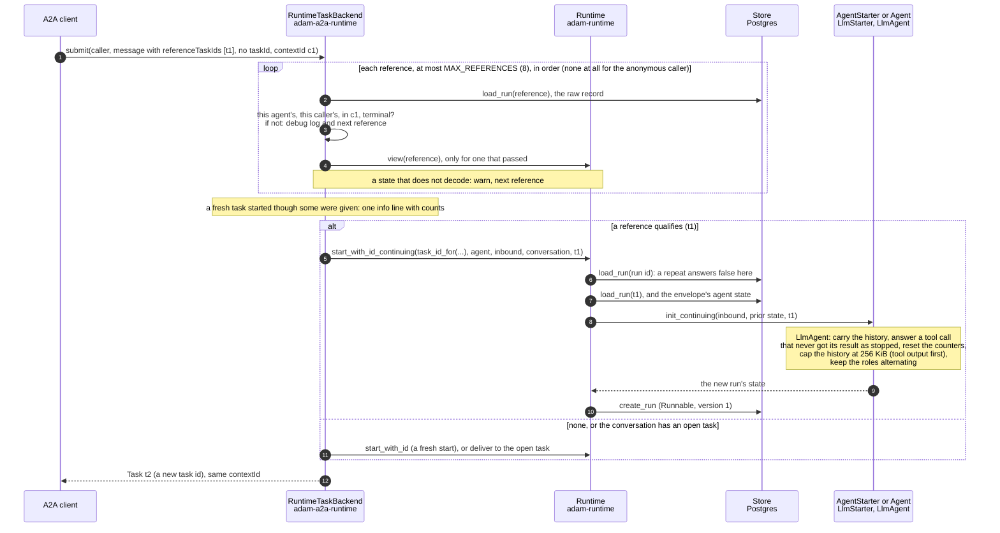
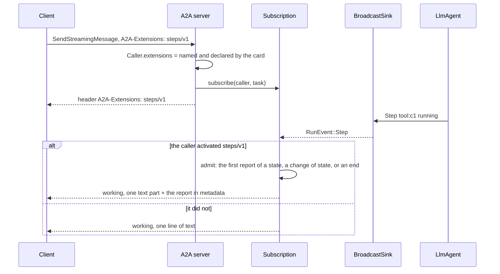
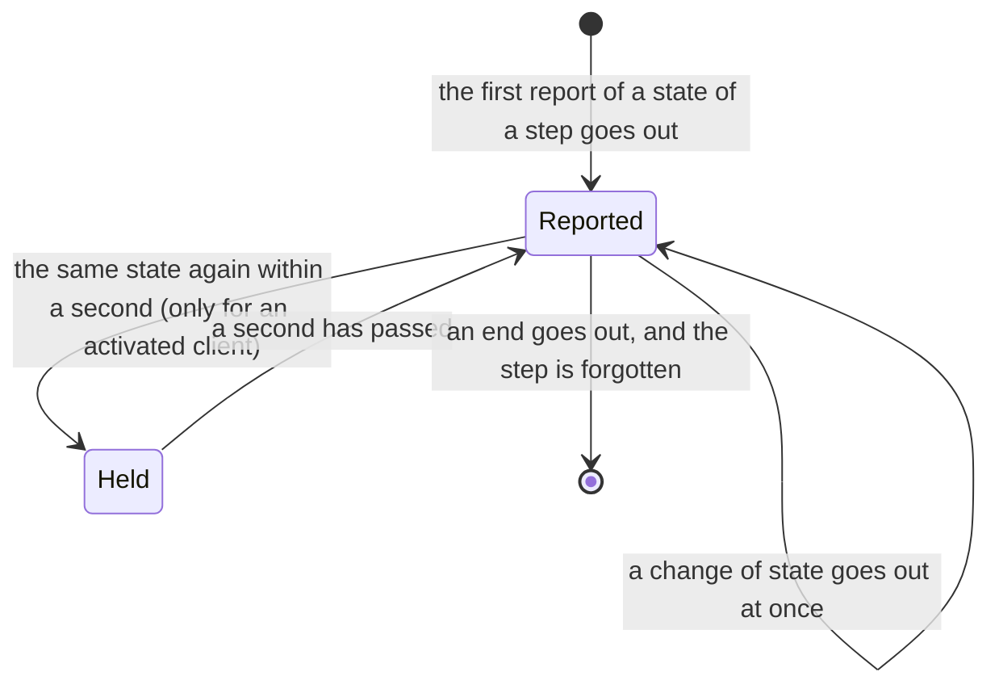
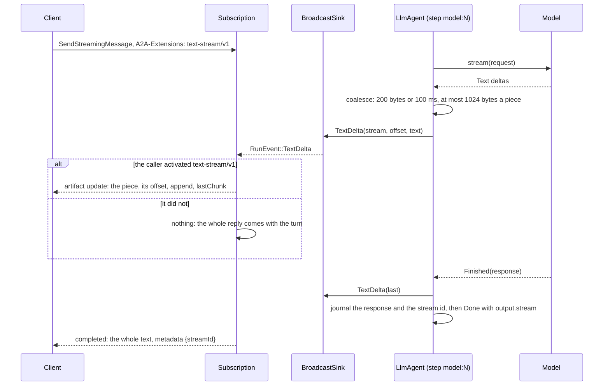
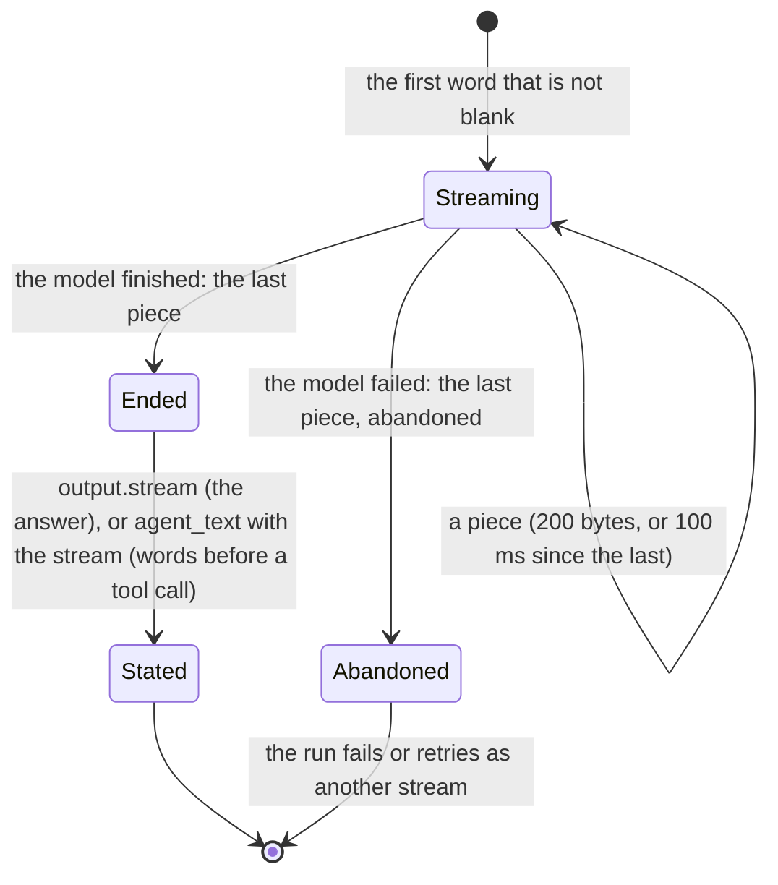

# The A2A server: what a client sees

How a task looks from outside: follow-ups, continuing a finished task, and the three live streams
(steps, text, reasoning). The request path itself is in
[Architecture](../architecture.md#request-in-events-out). Code: `crates/adam-a2a` (server),
`crates/adam-a2a-runtime` (backend over the runtime). Extensions: the `adam-a2a-extensions` skill and
[ADR 0006](../decisions/0006-a2ui-and-the-vymalo-extensions-in-adam-rs.md).

## Methods

`SendMessage` (blocking), `SendStreamingMessage`, `GetTask`, `CancelTask` and `SubscribeToTask` are
served. `ListTasks` is unsupported, push-notification methods return `PushNotificationNotSupported`, and
there is no extended agent card (`crates/adam-a2a/src/handler.rs`).

## Follow-ups

| The message | What happens |
|---|---|
| carries a `taskId`, the task is `input-required` | delivered to the run (`Runtime::deliver`) |
| carries a `taskId`, the task has finished | `-32004` (`UnsupportedOperationError`) |
| carries a `taskId`, the task is `submitted` or `working` | `-32602`, **unless the request activated `steer/v1`**: then it goes to the run's inbox, is read at its next step, and the answer is the task, still working ([ADR 0016](../decisions/0016-a-message-sent-to-a-working-task-is-steered-into-it.md)) |
| has a `contextId`, no `taskId` | delivered to the context's open task, or starts a new one |
| has `referenceTaskIds` | starts from the conversation of one of them, below |

## A new task that continues a finished one

A refinement or a rework is a new task in the same `contextId`, because a finished task accepts nothing.
`Message.referenceTaskIds` names what it builds on ([ADR 0003](../decisions/0003-a-new-task-continues-the-task-it-references.md)).

* **The reference is checked from the raw record**, before any state is decoded: this agent's, this
  caller's, in the same context, terminal. Anything else is skipped, and the client gets the fresh task it
  would for an id that never existed, so it learns nothing about other callers' tasks. At most 8 references.
  A message without a `contextId` continues nothing; the backend never guesses "the latest task".
* **"Caller" is the authenticated subject** (`token-<index>`); reordering the tokens hands a history to
  whoever holds that index next. The anonymous caller is every client at once, so it continues nothing.
* **It works on a front that holds only the starter**: the prior state is decoded as the starter's `State`.
  `init_continuing` defaults to `init`; a state that does not decode falls back to `init` with a warning.
  An agent that wraps another must forward it.
* **The history is bounded.** `Conversation::continued` shortens old tool outputs first, then drops the
  oldest whole turns beyond `MAX_CARRIED_BYTES` (256 KiB), saying so in a marker text and `omitted_turns`.
  The first user message and the newest prior turn are kept; adjacent user messages are merged so roles alternate.
* **The new run is an ordinary run**: new id, own journal, limits and worktree.
* **The coder carries the work on**: a rework can check out the branch an earlier task pushed, and
  `open_pull_request` then updates the same pull request ([coder](coder-agent.md#continuing-a-task)).

## Steps

A tool call, the work it hands to another agent and the commands that agent runs are **steps**
(`RunEvent::Step`, [ADR 0007](../decisions/0007-progress-as-steps-and-streamed-text.md)). The agent
reports `tool:<call id>` before and after every call; a tool says more with `ToolCtx::emit_progress` and
`report_step`. A client that **activated `steps/v1`** gets each as a `working` status whose metadata
carries the report; any other client reads a line of text. A tool call's report carries its `input` and
`output`, redacted by the agent and cut to 4 KiB and 8 KiB ([ADR 0011](../decisions/0011-a-tool-calls-step-carries-its-input-and-output.md));
a step too big for a `NOTIFY` crosses between processes without them.

A step's **label** is a title a person reads ("Edit a file", "Run the checks"), never the tool's name: the tool says it with
`Tool::step_style` (`#[tool(label = "...")]`), an MCP tool with its `title`, a tool of a source with `ToolNote::label`, a subagent
with its own name capitalised. The model keeps calling the tool by its name. A client that did not activate `steps/v1` reads
the same label in its plain line (`Edit a file: done`) ([ADR 0027](../decisions/0027-every-tool-has-a-title-for-its-step.md)).

Events are live and best effort. A streaming send submits the run and subscribes afterwards, so
`BroadcastSink` keeps a small replay of each run's recent events (the newest 64, none older than 30 s, no
`Status` or `Artifact`, dropped at every status change) and `subscribe_run` delivers it before the live ones,
with no gap and no duplicate: a step that started before the subscriber attached keeps its `input`. A
resubscribe within 30 s may repeat a step (a snapshot by id) or a text piece (it carries its `offset`). A
process with no event sink replays nothing and sees only the durable record
([ADR 0007](../decisions/0007-progress-as-steps-and-streamed-text.md), `crates/adam-runtime/src/events.rs`).

## Which build answers

The card says which build of the agent answers, so that a thread export can be tied to a commit and to the agent's files
([ADR 0028](../decisions/0028-the-card-says-which-build-answers.md)):

* `version` is `<crate version>+<first 7 characters of the commit>` (`0.1.0+6478fbc`, `0.1.0+unknown` for a build that was
  given no revision): semver build metadata, which does not take part in precedence. The commit is the build argument
  `ADAM_BUILD_REVISION` of `docker/coder/Dockerfile` (CI passes `github.sha`), read with `option_env!` by `adam-coder` and
  `adam-agent`.
* `capabilities.extensions` lists `https://agents.vymalo.com/a2a/extensions/build/v1` with `params`
  `{"revision": <the commit, whole, or "unknown">, "folderDigest": "sha256:..."}`. The digest is
  `adam-agent-fs`'s over the agent's files (the one the `agent files` line of the startup log shows), so a prompt mounted
  over the embedded copy changes it. The extension is optional and informational: `required: false`, nothing to
  activate, ignored by a client that does not know it. `adam_a2a::ExtensionConfig::build(revision, folder_digest)` declares it,
  `adam_agent::card_of_folder` and `adam_coder::agent_card_from` add it.

## Streamed text

A model turn streams by default (`LlmAgentBuilder::stream_text`): the journaled step `model:<turn>` calls
`ModelClient::stream` and sends what the model has written as `RunEvent::TextDelta` pieces. A client that
**activated `text-stream/v1`** gets each as an artifact chunk with its byte offset. The whole text is stated
once, by a `working` status for words before a tool call or by the status that ends the turn (`completed`
with `output.stream`, or `input-required` for a reply turned into a question).

* Pieces are live and meant to be lost; a replay of a recorded step sends none and states the same
  words whole under the recorded stream id.
* A failure in the middle is the call's failure (`ModelFailure`): the same retry, the same failed run.
* A chunk is at most 1024 bytes so the event fits a `NOTIFY` payload.
* A client that did not activate the extension, and a blocking `message/send`, get the whole reply
  with the turn.

## Reasoning

A model in thinking mode writes its reasoning before its answer, on the same streamed step
([ADR 0020](../decisions/0020-reasoning-is-streamed-beside-the-answer-and-never-stored.md)).
`ModelDelta::Reasoning` (read from `reasoning_content` or `reasoning`, `crates/adam-model-openai/src/wire.rs`)
becomes `RunEvent::ReasoningDelta` in a stream of its own that ends before the words begin, and a
`text-stream/v1` chunk marked `"kind": "reasoning"`.

It is **never stored**: dropped before the journal, in no output, `turn_output` or step, and a replay
sends none. The model is sent its earlier reasoning only if its client is set to
(`MODEL_ECHO_REASONING`, which DeepSeek's thinking mode with tools needs). `MODEL_EXTRA_BODY` is how a
deployment asks a model that needs a flag to think.
