# Agent files and `#[tool]`

The reference for agents authored as Markdown folders plus `#[tool]` functions: layout, formats, what is
validated, and how each piece behaves at run time. The task-oriented version is
[Write an agent](../guides/write-an-agent.md). Decisions D1 to D6 (accepted 2026-09-29) are at the end.
Facts about third parties are marked *verified* (date and source) or *unverified*.

The goal, in the owner's words: agents, skills and more configured through plain Markdown files, and tools
configured in code, very easily, through macros. Where a standard exists, adam-rs follows the standard.

## The idea in six lines

1. **Markdown for what the model reads, Rust for what runs.** `agent/` holds Markdown and JSON only:
   instructions, skills, subagents, `mcp.json`. Tools are Rust functions annotated `#[tool]`, in
   `src/`, so `cargo fmt`, clippy and rust-analyzer work on them.
2. **The layout is [eve](https://eve.dev)'s.** `agent/instructions.md`, `agent/subagents/`,
   `agent/skills/`, and `agents/<name>/` for several agents in one package.
3. **The file format of an agent, and of a subagent, is the Claude Code / GitHub Copilot custom-agent
   format:** Markdown with YAML frontmatter (`name`, `description`, `tools`, `model`, ...), body = system
   prompt. A file copied from `.claude/agents/x.md` or `.github/agents/x.agent.md` parses unchanged.
4. **Skills are the [Agent Skills](https://agentskills.io/specification) format, unchanged.**
5. **`build.rs` compiles the directory into a static manifest;** the same directory can be read at run
   time instead (`ADAM_AGENT_DIR`, once, at startup, with no feature) and a `dev` feature watches it and
   reloads. One parser and one validator serve all three.
6. **Skills and subagents add no durability mechanism.** They run inside the existing journaled
   `tool:CALL_ID` step; a subagent is a durable child run.

## Layout

```text
my-agent/                       # a normal Cargo package
├── Cargo.toml                  # adam = { features = ["macros"] }; [build-dependencies] adam-agent-fs
├── build.rs                    # adam_agent_fs::build("agent").emit()?;
├── agent/
│   ├── instructions.md         # optional YAML frontmatter + the system prompt
│   ├── instructions/           # optional: more .md files, appended in filename order
│   ├── skills/
│   │   ├── release-notes/SKILL.md      # Agent Skills spec (+ scripts/ references/ assets/)
│   │   └── triage.md                    # flat skill (eve convenience), name = file stem
│   ├── subagents/
│   │   ├── reviewer.md                  # or reviewer.agent.md: a Claude Code / Copilot agent file
│   │   ├── researcher/instructions.md   # directory form: own skills/, mcp.json, subagents/
│   │   └── billing.md                   # `a2a: <agent-card URL>` makes it a remote subagent
│   ├── mcp.json                # {"mcpServers": {...}}; secrets only as ${VAR}
│   └── schedules/daily.md      # frontmatter `cron:`; body = prompt (roadmap 5, sketch)
└── src/
    ├── main.rs                 # adam::include_agent!(); compose store + model + tools + serve
    └── tools/weather.rs        # #[tool] async fn get_weather(...)
```

Several agents in one package: `agents/<name>/...` with the same slots and no nested `agent/`. Having
both `agent/` and `agents/` is a **build error** (eve silently prefers `agent/`).

### Discovery rules

* `agent/` exists: one agent, named by frontmatter `name`, else `CARGO_PKG_NAME`.
* Else `agents/<name>/` for each direct child that holds `instructions.md`, named by its directory (it
  must match `name` when one is given).
* Neither: a build error, unless `build()` was given `.optional()`.
* Ignored: dotfiles, `*.test.md`, `__tests__/`, and a directory under `skills/` without `SKILL.md`.
* Names come from paths: `skills/<name>/SKILL.md` or `skills/<name>.md` is skill `<name>`;
  `subagents/<name>.md`, `subagents/<name>.agent.md` or `subagents/<name>/instructions.md` is subagent
  `<name>`; `schedules/a/b.md` is schedule `a/b`. For a subagent file, the name is the file name minus
  `.md` or `.agent.md` (as Copilot does), unless the frontmatter sets `name`.
* Subagents nest through `subagents/<name>/subagents/...`. Cycles are impossible by construction.

## File formats

YAML 1.2, so `no` is a string and not `false`. Frontmatter is optional in `instructions.md`; without it
the whole file is the prompt. A file whose first line is `---` must have a closing `---`, or it is an
error.

### Agent and subagent files (`instructions.md`, `subagents/*.md`, `*.agent.md`)

One schema for the root agent, for every directory subagent and for every flat subagent file. It is a
superset of the two custom-agent formats below.

```markdown
---
name: coder                    # default: CARGO_PKG_NAME (root), file name (subagents)
description: Turns a coding task into a verified pull request.   # required on subagents
model: coder-large             # a gateway alias; `inherit` = the parent's (default for subagents)
tools: [prepare_workspace, run_checks, ask_user]     # or "a, b, c"; "*" = all; MCP: "linear__*"
skills: all                    # or a list; default: every skill in this agent's skills/
limits:                        # LlmAgent Limits; Claude's `maxTurns` is read as limits.max_turns
  max_turns: 200
  max_tool_calls: 400
vars: { max_check_cycles: 3 }  # defaults for {{placeholders}} in the body; code may override
card:                          # root only: becomes adam_a2a::AgentCardConfig
  name: adam-coder
  skills:
    - { id: coding-task, name: Coding task to pull request, description: "...", tags: [code] }
  extended:                    # optional: what an authenticated caller sees on top (GetExtendedAgentCard)
    description: A longer description, for callers that signed in.
    skills:
      - { id: audit, name: Audit, description: "Only for authenticated callers" }
metadata: { owner: platform-team }
---
You are the coder agent. Stop after at most {{max_check_cycles}} failed check cycles ...
```

* **Secrets and endpoints never live in files.** `model` is an alias; the endpoint and key come from
  the composition root (environment). The validator rejects the keys `api_key`, `apiKey`, `token`,
  `secret`, `password` and `base_url`. There is no `${VAR}` in agent frontmatter.
* `{{name}}` placeholders are logic-free substitution. An unknown placeholder, or a var that is never
  used, is a bind-time error. `{{{{` writes a literal `{{`.
* **Unknown keys: accepted with a warning** (`cargo:warning=`). Keys of Claude Code or Copilot that adam
  knows and ignores (`color`, `permissionMode`, `temperature`, `target`, `user-invocable`,
  `disable-model-invocation`, ...) get a softer "ignored by adam" warning. `build("agent").strict()`
  turns warnings into errors.
* **A subagent inherits nothing** from its parent (eve's isolation boundary), and omitting `tools:`
  gives it **no tools** (decision D3). Claude Code inherits everything; adam does not.
* **A copied file parses unchanged, but its `tools` must name adam tools.** A Claude Code file listing
  `Read, Grep` fails at bind time with a "did you mean" hint, because adam fails closed on an unknown
  tool name. Drop the key or list adam's tool names.

Remote subagent (A2A; the body, if any, only extends the tool description):

```markdown
---
description: Handles billing questions for a customer account.
a2a: https://billing.example.com/.well-known/agent-card.json
auth: bearer:BILLING_AGENT_TOKEN     # names an environment variable, resolved at startup, fail closed
---
```

How it behaves is under [Remote subagents](#remote-subagents-a2a).

#### The formats it accepts

| Format | Location | Keys | Status |
|---|---|---|---|
| Claude Code subagent | `.claude/agents/<file>.md` | `name` and `description` required; optional `tools` (comma string or YAML list; inherits all if omitted), `disallowedTools`, `model`, `permissionMode`, `maxTurns`, `skills`, `mcpServers`, `hooks`, `memory`, `background`, `effort`, `isolation`, `color`, `initialPrompt` | *verified 2026-09-29*, <https://code.claude.com/docs/en/sub-agents.md> |
| GitHub Copilot custom agent | `.github/agents/<name>.agent.md` (repository), `.github` or `.github-private` repository (organization) | `description` required; optional `name` (defaults to the file name), `target` (`vscode` or `github-copilot`), `tools` ("Supports both a comma separated string and yaml string array"; `["*"]` all, `[]` none), `model` ("If unset, inherits the default model"), `disable-model-invocation`, `user-invocable`, `mcp-servers`, `metadata`; the prompt is at most 30,000 characters; a file name may contain only `.`, `-`, `_`, `a-z`, `A-Z`, `0-9`; the name minus `.md` or `.agent.md` is what deduplicates | *verified 2026-09-29*, <https://docs.github.com/en/copilot/reference/custom-agents-configuration> and <https://docs.github.com/en/copilot/how-tos/copilot-on-github/customize-copilot/customize-cloud-agent/create-custom-agents> |
| OpenCode agent | `.opencode/agents/<name>.md` | `description`, `mode`, `model`, `temperature`, `permission`; the file name is the agent name | *verified 2026-09-29*, <https://opencode.ai/docs/agents/> |
| eve | `agent/`, `agents/<name>/agent/`, config in `agent.ts` | see the [mapping](#mapping-eve-to-adam-rs-to-standard) | *verified 2026-09-29*, <https://eve.dev/docs/reference/agent-files.md> and <https://eve.dev/docs/subagents.md> |

Where they disagree, adam-rs reads both spellings: `tools` takes a comma string or a list, as both do,
and `mcpServers` (Claude) and `mcp-servers` (Copilot) are recognised and warned about (`mcp.json` is the
place for MCP servers, see below). The Claude `model` values `sonnet`, `haiku` and so on
are not aliases of anything in adam-rs: `model` is a gateway alias, so a Claude file's `model` must be
changed or removed (`inherit` works).

### Skills (`skills/<name>/SKILL.md`): the Agent Skills spec, unchanged

Frontmatter: `name` (required, 1 to 64 characters, `a-z0-9-`, no leading, trailing or double hyphen,
and it must match the directory name), `description` (required, 1 to 1024 characters), `license`,
`compatibility`, `metadata`, `allowed-tools` (experimental). The body is free Markdown; `scripts/`,
`references/` and `assets/` are optional. *Verified 2026-09-29*, <https://agentskills.io/specification.md>.

Validation follows the spec's client guide (*verified 2026-09-29*,
<https://agentskills.io/client-implementation/adding-skills-support.md>): a name that does not match its
directory is a warning (the directory wins); a missing `description` or unparseable YAML skips the
skill and is a **build error**, because these files are our own source and not a third-party install.
A flat `skills/<name>.md` is an eve convenience and may omit frontmatter (the description is then the
first non-empty line, with a warning). `allowed-tools` is parsed and ignored in v1. Resources are
embedded up to 1 MiB per skill. What the model sees of a skill at run time is
[described below](#skills-at-run-time).

The repository's own `.agents/skills/` is a corpus of 75 vendored `SKILL.md` files. The parser must read
all of them with no error; that is a conformance test.

### `mcp.json`

```json
{
  "mcpServers": {
    "linear": { "type": "http", "url": "https://mcp.linear.app/mcp",
                "headers": { "Authorization": "Bearer ${LINEAR_API_TOKEN}" },
                "tools": ["list_issues", "create_issue"] },
    "fs": { "command": "mcp-server-filesystem", "args": ["/work"],
            "env": { "LOG_LEVEL": "${MCP_LOG_LEVEL:-info}" } }
  }
}
```

* Field names follow Claude Code's `.mcp.json` (*verified 2026-09-29*,
  <https://code.claude.com/docs/en/mcp.md>) and the draft SEP-2633 (*verified draft status 2026-09-29*,
  <https://github.com/modelcontextprotocol/modelcontextprotocol/pull/2633>; the field details are
  *unverified* until the PR is read in full). There is no ratified standard yet.
* A `url` without `type` is an error, as in Claude Code. `tools` (an adam extension) is an allow-list.
  The model-facing name is `<server>__<tool>`. `optional: true` (an adam extension) lets a server be missing at
  startup: if it cannot be reached or listed, or its `${VAR}` has no value, it is skipped with a warning.
* `${VAR}` and `${VAR:-default}` are expanded **at startup only**. A missing variable without a default
  fails startup (fail closed). `build.rs` records the names and never the values.
* stdio servers spawn processes: allowed only when the composition root opts in (`McpPolicy::allow_stdio`).
* At run time ( [below](#mcp-tools-at-run-time-feature-mcp)): `type: http` and `streamable-http` are the
  streamable HTTP transport, `type: sse` is refused (the specification deprecates HTTP+SSE), a stdio server's
  child gets a clean environment plus the file's `env`, a URL is https or local and carries no credentials and
  no `${VAR}` (the SDK logs URLs; `McpPolicy::allow_url_secrets` is the opt-in), secrets belong in `headers`, and
  `tools` is the allow-list that is the mitigation for a server's description text. A server name has no `__` and
  does not end in `_`, a tool name does not start with `_` (so `<server>__<tool>` names one server).

### Tools

Tools are Rust (next section). The files only say **which** tools an agent gets (`tools:`). Tool names
match `^[a-z][a-z0-9_]{0,63}$`.

## Parsing and validation

[`adam-agent-fs`](../../crates/adam-agent-fs/README.md) reads a directory into an `AgentManifest` and
reports every problem as a `Diagnostic { severity, path, line, message }` (`Error` or `Warning`). It is the
one parser and the one validator: the `build.rs` codegen, the run-time `Dir` loader and the dev reload all
call it, so they cannot disagree. No async, no runtime dependency; nothing in it expands `${VAR}`.

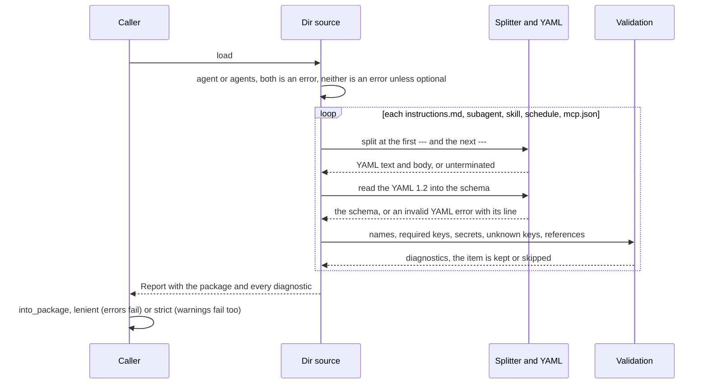

* **Splitter.** Frontmatter exists only when the first line is `---`; the next `---` closes it. An unclosed
  block is an error, never "no frontmatter". BOM and CRLF are handled; bodies are kept with LF and trimmed.
* **YAML 1.2** (`serde-saphyr` 1.3.0, *verified 2026-09-29*, MIT or Apache-2.0), with `strict_booleans`, so `no`
  is a string. Unknown keys are read into `serde_json::Value` and become warnings.
* **Agent files.** One schema, `AgentFrontmatter`, for the root agent, a directory subagent and a flat
  subagent file: `name`, `description`, `tools`, `model`, `skills`, `preload_skills`, `limits`, `vars`,
  `card` (root only), `a2a` and `auth` (remote subagent), `metadata`. A subagent needs a `description`. The
  keys `api_key`, `apiKey`, `token`, `secret`, `password` and `base_url` are errors (compared without case,
  `_` and `-`), and so is a `model` that is a URL. Claude Code, Copilot and OpenCode keys adam does not act on
  warn "ignored"; any other unknown key warns "unknown".
* **Names** match `^[a-z0-9][a-z0-9_-]{0,63}$`. A valid frontmatter `name` wins; otherwise the path gives the
  name (file name without `.md` or `.agent.md`, or the directory) with a warning. Copilot's capitals are
  lower-cased with a warning. In `agents/<name>/` the directory is the name and a different `name:` is an
  error. Two subagents or skills with one name are an error.
* **Skills** follow the Agent Skills rules above; the effective name is the directory name. `resources` lists
  the other files of a skill directory without reading them.
* **`mcp.json`**: `mcpServers` with `type` `stdio` (the default when there is a `command`), `http`,
  `streamable-http` or `sse` (refused at run time). A `url` without `type` is an error; `ws` is unsupported.
  The server name and each allow-listed tool must fit `<server>__<tool>` in 64 characters. A literal
  credential in a header, env value or URL is a warning (an error under `.strict()`).
* **Schedules**: `cron` (five fields, checked for shape, not evaluated), `timezone` (default `UTC`), a
  non-empty body; they belong to the root agent.
* **Other**: a prompt over 30,000 characters warns (Copilot's limit, *verified 2026-09-29*); an entry that is
  not a slot (`tools/`, `channels/`) warns and points at `#[tool]`; dotfiles, `*.test.md`, `__tests__/` and
  `README.md` are never read; non-UTF-8 is an error.

The test suite is the specification: one fixture directory per rule, each producing exactly one diagnostic;
all vendored `.agents/skills/*/SKILL.md` parse with no error; a Claude Code agent and two Copilot agents
parse unchanged as subagents.

## Build time: `build.rs` and `include_agent!`

`adam_agent_fs::build("agent").emit()` in `build.rs` and `adam::include_agent!()` in the crate are the
default way to ship an agent: the directory is parsed, validated and embedded at build time, so a mistake
stops the build before rustc runs and nothing is parsed at startup. The same `Dir` source reads the same
files at run time; both give a `Package`, and tests assert the embedded one equals the directory's.

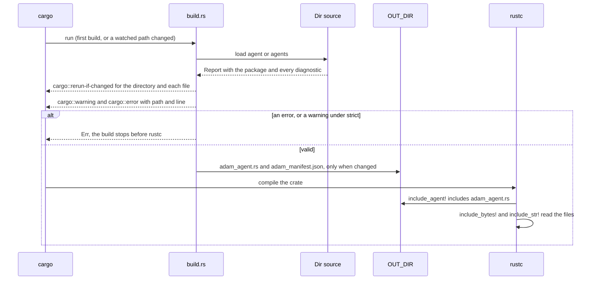

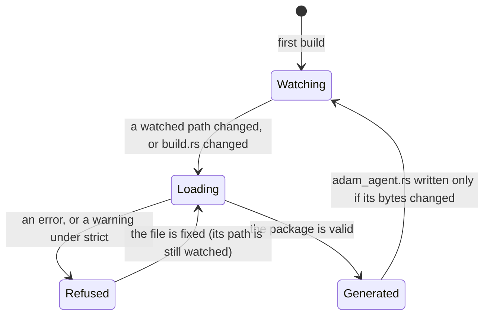

* **Diagnostics are build errors**: `cargo::error=path:line: message` (or `cargo::warning=`); a warning fails
  the build under `.strict()`. Nothing is written for a refused directory, and the watch list is printed anyway
  so that fixing the file rebuilds.
* **Rerun tracking**: `cargo::rerun-if-changed` for the directory and every file in it. `OUT_DIR/adam_agent.rs`
  is rewritten only when its bytes change. *Verified 2026-09-29* with cargo 1.94.1.
* **The generated file** defines `AGENTS`, `AGENT` (the single agent of an `agent/` package) and `PACKAGE`:
  `'static` data. `mcp.json` is `include_str!` and stays unexpanded, so no secret passes through the build;
  skill resources are `include_bytes!` (at most 1 MiB per skill). Every agent carries a SHA-256 `digest`, the
  same for a directory (`Dir::digest`) and its embedded copy (`EmbeddedAgent::verify`).
* **Versions must match**: the crate that runs `build()` and the one that runs the binary must use the same
  `adam-agent-fs`.

Details: [`adam-agent-fs` README](../../crates/adam-agent-fs/README.md#embedding-at-build-time).

## The `#[tool]` contract

[`adam-macros`](../../crates/adam-macros/README.md) is the macro, and
[`adam`](../../crates/adam/README.md) is the facade you depend on.

```rust
use adam::prelude::*;

/// Ask the person who gave you the task a question and wait for the answer.
#[tool]
pub async fn ask_user(
    /// What you need to know
    question: String,
) -> Result<ToolOutput, ToolError> { /* ... */ }

let tools = tools![AskUser, RunChecks];
let agent = LlmAgent::builder("coder", model, alias).state(env.clone()).tools(tools).try_build()?;
```

`#[tool]` keeps the function (so a unit test can call it), and generates a unit struct (`AskUser`,
the function name in `UpperCamelCase`, with the function's visibility) that implements the `Tool` trait
of `adam-llm-agent`.

* **Description and schema:** the doc comment of the function is the tool description (required: a
  tool without one does not compile); the doc comment of each parameter is the property description.
  Lines of one paragraph are joined with a space and a blank line keeps a paragraph break, so the
  hard wrapping of a doc comment does not reach the model; list items, headings, quotes, table rows
  and fenced code keep their lines. The arguments become one struct that derives `Deserialize` and
  `JsonSchema` (schemars 1.x, draft 2020-12, subschemas inlined, no `$schema`, no `title`); the spec
  is computed once per tool (`OnceLock`).
* **Parameter kinds:** `&ToolCtx` (at most one, any position); `State<T>` (shared state, resolved
  with `ToolCtx::require_state`); every other parameter is a field of the arguments struct, and its
  `#[serde(..)]` and `#[schemars(..)]` attributes are copied to the field. `#[args] a: MyArgs` uses an
  existing struct as the whole argument object and must be the only model argument.
* **Return:** `Result<T, E>` or a bare `T`, with `T: IntoToolOutput` and `E: Into<ToolError>`.
* **Options:** `name = "..."`, `type = Ident`, `strict` (`deny_unknown_fields`, which also closes the
  schema), `classify` (the error is `adam_error::Classify`: retryable becomes `ToolError::Transient`,
  the rest `Permanent`), `asks_user` (the tool can end a call with `ToolError::NeedsInput`: the
  generated `Tool::asks_user` says `true`, and `bind` refuses it on a subagent), `step`, `label` and
  `icon` (how a call is drawn as a step, `Tool::step_style`: the kind, a label instead of the tool's name (give one: it is what the person reads), and an
  icon from the closed vocabulary of the orchestration layer's `steps/v1` (`opencode` is OpenCode's own); [ADR 0007](../decisions/0007-progress-as-steps-and-streamed-text.md)) and
  `crate = path` (default `::adam`; `::adam_llm_agent` for a crate that does not use the facade).
  Reserved for later: `approval` (roadmap 5).
* **Bad model input is the model's problem:** a deserialization failure becomes `ToolOutput::error`
  (as `Tool::call` already documents), so the model can correct itself; the function never sees it.
* **State is checked at build:** `Tool::required_state` names the `State<T>` types a tool needs, and
  `LlmAgentBuilder::try_build` fails at startup when one is missing.
* **Journaling is unchanged:** the call runs inside `LlmAgent`'s `tool:CALL_ID` step, so the retry
  rules of the `Tool` docs still apply, and the macro adds nothing non-deterministic.
* **No distributed slices** (`inventory`, `linkme`): `tools![...]` is an explicit list that the
  compiler checks; the agent files name tools, and binding fails at startup on an unknown name.
* **Compile errors** the macro produces itself, each pointing at the offending token: no doc comment,
  not `async`, generic or `impl Trait`, a `self` receiver, a borrowed argument (`&str`), two
  `&ToolCtx`, `#[args]` next to another model argument, a bad tool name, an unknown option, a parameter
  pattern that is not a plain name, and `#[tool]` on something that is not a function. All the mistakes
  of one function are reported in one compile. rustc reports the rest (an argument type without
  `Deserialize` or `JsonSchema`, a return type that is not a tool result) with messages from
  `#[diagnostic::on_unimplemented]`.

What runs when the model calls a generated tool (the code between the journal and your function is
what the macro writes):

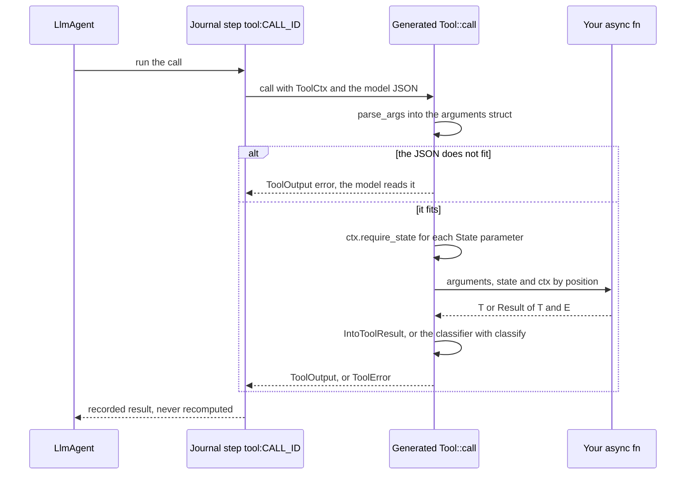

`FnTool` builds a tool at run time (an MCP tool is one). The typed helpers the macro relies on
(`spec_for`, `IntoToolOutput`, `parse_args`, `State<T>`, `ToolSet`) live in
[`adam-llm-agent`](../../crates/adam-llm-agent/README.md); the paths the generated code uses are
re-exported there as `#[doc(hidden)] __private` (feature `schema`) and again by the facade, so that a
crate using `#[tool]` needs no dependency of its own on `serde`, `schemars` or `async-trait` for the
generated code.


## Binding: manifest to agents

[`adam-assembly`](../../crates/adam-assembly/README.md) turns a manifest into `LlmAgent`s. The embedded manifest
(`AgentDef::from_manifest(AGENT)`) and one read from a directory (`AgentDef::from_source(&Dir::new(..), ..)`)
are the same type and take one code path.

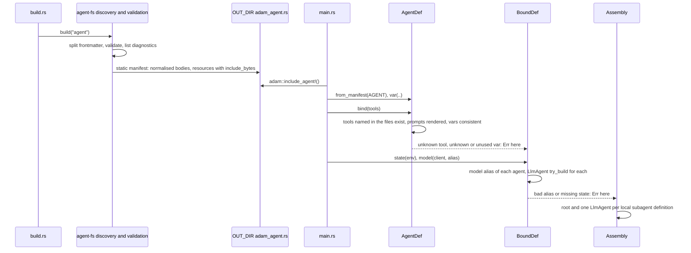

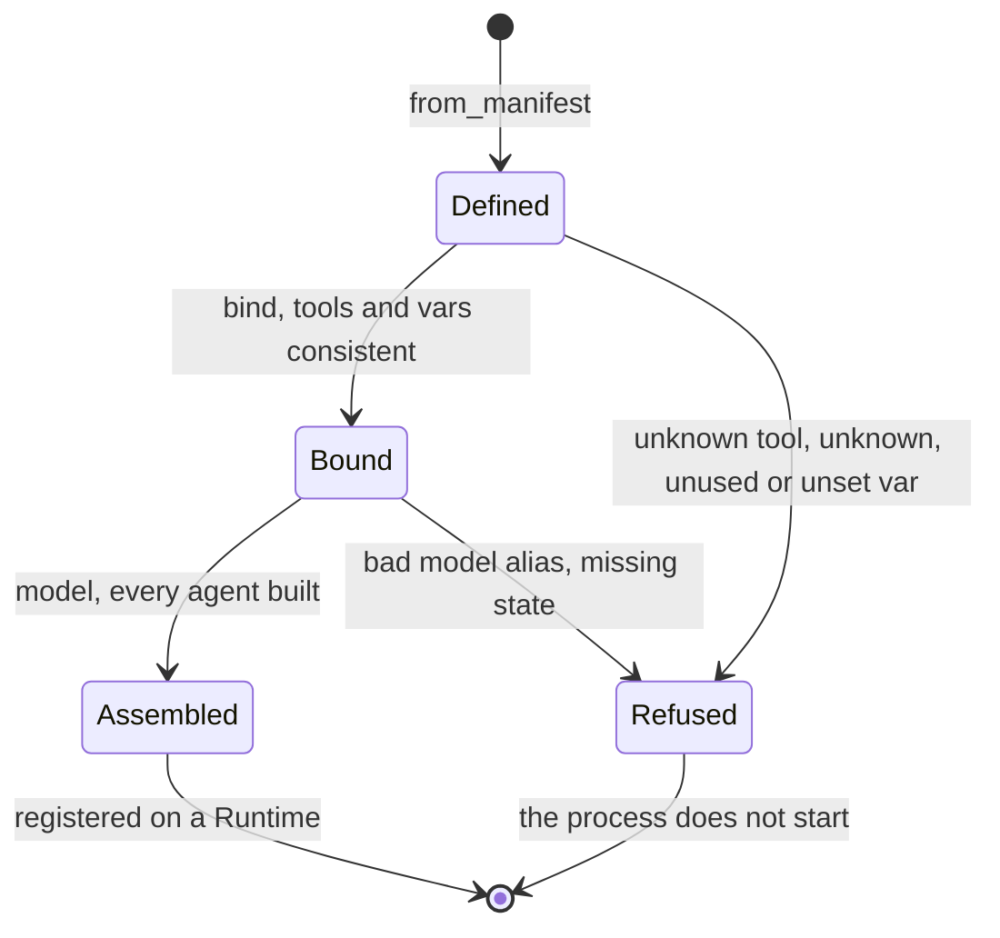

* **Tools.** `tools:` names are checked against the `ToolSet`: an unknown name is `Error::UnknownTool` with a
  "did you mean"; a `linear__*` pattern must match at least one tool. The root with no `tools:` gets every
  registered tool, a subagent with none gets none (D3); `*` is all, `[]` none. Nothing is inherited.
* **Vars.** `{{name}}` is substituted into the body and `instructions/*.md`. An unknown placeholder, a var
  declared and never used, a used var with an empty default that the code did not supply, a value for an
  undeclared var, and a `{{` that is not a placeholder are errors at `bind`, with file and line. `{{{{` writes
  a literal `{{`. Values come from `AgentDef::var` and `agent_var("a/b", ..)`.
* **Model.** One `DynModel` for every agent. An agent's alias is its `model:`, else its parent's (`inherit`),
  else the alias the code passes to `model(..)`. `model_aliases([..])` refuses the rest with a suggestion.
* **State and limits.** `state(Arc<T>)` reaches every agent's tools; a missing `required_state` fails
  `model(..)` with the agent's name. Frontmatter `limits` replace the loop's defaults key by key.
* **Subagents.** Each local subagent becomes an `LlmAgent` named `<parent>/<name>`; its parent gets a
  `SubagentTool`. `Assembly::register` registers them all on the runtime. Skills' tools, subagent tools and MCP
  tools are added while `bind` resolves an agent, so `AgentInfo::tools` is what the model is offered.
* **The card.** With feature `a2a`, `Assembly::card(url, version)` is the root's `card:` as an
  `adam_a2a::AgentCardConfig`; `AgentDef::card` gives it before anything is bound, for a control plane.
  `card.extended` (`description`, `skills`) becomes the config's extended card: the public card with the description
  replaced and the skills added (a public id is replaced). It is served only to authenticated callers and only when the
  server authenticates ([the A2A server](a2a-server.md#the-extended-card)); an empty `extended: {}` declares nothing, and a
  file holds no secret, so put nothing in it that you would not give every holder of a token.

## Skills at run time

Progressive disclosure, the three tiers of the Agent Skills client guide (*verified 2026-09-29*,
<https://agentskills.io/client-implementation/adding-skills-support.md>). Each agent has its own skills (its
own `skills/`, narrowed by `skills:`), never inherited.

| Tier | The model sees | Cost |
|---|---|---|
| 1. Catalog | `name` and `description` of each selected skill, in the prompt after the instructions | about 50 to 100 tokens per skill, on every request |
| 2. `load_skill { name }` | the body of `SKILL.md`, frontmatter stripped, in `<skill_content name="...">`, with bundled files listed in `<skill_resources>` | once, in the tool result; it stays in the conversation |
| 3. `read_skill_file { skill, path }` | one bundled file as text | once per file read |

* The catalog is pinned by a golden file (`crates/adam-assembly/tests/golden/coder-prompt.txt`). Descriptions
  are collapsed to one line and XML-escaped. `name` of `load_skill` and `skill` of `read_skill_file` are JSON
  Schema enums; an unknown, unselected or made-up name gets the same refusal, listing what is available.
* **`read_skill_file` is a lookup, not a file read**: the path is normalised, refused when empty, absolute, with
  `..`, a backslash or a control character, then matched **exactly** against the skill's bundled list. There is
  no filesystem access at run time. Text only (no NUL), at most 1 MiB per skill.
* **`preload_skills:`** puts the whole skill into the prompt instead of leaving it to `load_skill`; it is out of
  the catalog and the enum. With every skill preloaded there is no `load_skill`; with none bundling a file, no
  `read_skill_file`; with no skills, neither tool and no catalog.
* A registered tool named `load_skill` or `read_skill_file` is `Error::ReservedToolName`; `tools:` does not
  filter the skill tools, `skills: []` turns them off. Results are journaled like any tool's.
* Known limit: an old tool result may be truncated by `limits.max_history_tokens`, a loaded skill included.
  Preload a skill to keep it for the whole run.

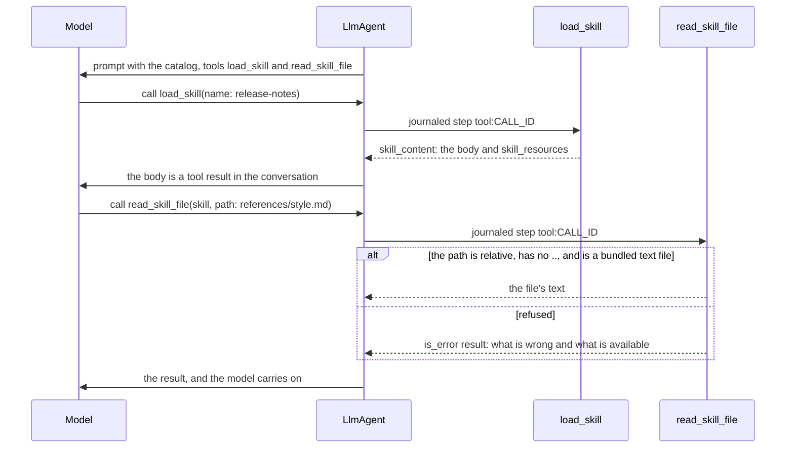

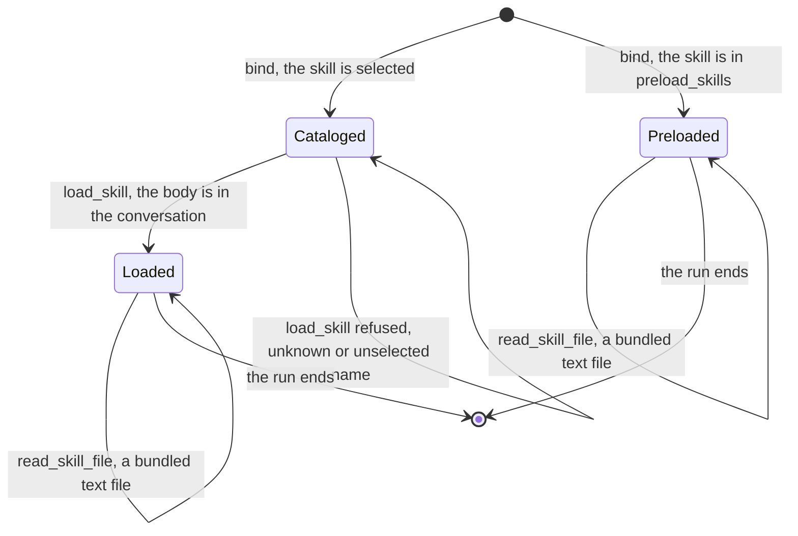

## Subagents at run time

A subagent is a child run ([child runs](child-runs.md)). Each local subagent is its own `LlmAgent` registered
as `<root>/<sub>`; the parent sees **one tool per subagent** (D5) with input `{ message }`, and the child never
sees the parent's history. The sequence and the states of the wait are in
[Architecture](../architecture.md#child-runs).

### The subagent tool

* **Name and shape.** Named after the subagent. Input `{ "message": string }`, required. Description: the
  subagent's `description` plus "The agent does not see this conversation; put everything it needs in `message`."
* **A call** starts the child with `message` as its first user message and returns `AwaitRun`. The parent
  parks; the child's final **text** is the tool result, or an error result (`the run failed: ...`). A blank
  `message` is an error result and starts nothing.
* **No runtime handle.** `Ctx::child_starter()` gives the step a `ChildStarter`; `LlmAgent` puts it in each
  `ToolCtx`; the tool calls `ToolCtx::start_child(agent, message)`. The child starts on the runtime that steps
  the parent. A process that does not know the child's agent gets a permanent error result naming it.
* **Least privilege.** A subagent's tools are those its own `tools:` lists, from the same registered set, and
  none when it lists none. It gets nothing of its parent's.
* **The root run.** A tool in a child run can ask `ToolCtx::root_run_id()` for the run whose work the child serves
  (the top of the chain of parents; the run itself when it is nobody's child). The id travels in the child's first
  message and its stored state, so it survives a restart. A tool that keeps something for the whole task, such as
  `adam-coder`'s workspace and its check budget, keys it by the root: its subagents then share the worktree.
* **Limits per child.** Its own `limits:` apply to its run; it does not count against the parent.
* **Name clashes are build errors** (`Error::SubagentToolClash`): a subagent named like a tool of its parent, a
  skill tool, or another subagent.
* **No asking tools in a subagent.** Nobody could answer, and the parent would wait for ever. A tool declares
  it can ask with `#[tool(asks_user)]` or `FnTool::asking_user()`; `bind` refuses a subagent whose resolved
  tools include one (`Error::SubagentAsksUser`), also through `*` or a pattern.
* **Limits of the design.** The calls of one model turn run one after another. Only the child's text travels
  back (artifacts stay on the child's run). The child starts empty and cannot be continued. Cancelling the
  parent does not cancel the child.

### Remote subagents (`a2a:`)

A subagent file with `a2a: <agent-card URL>` is a tool on the parent whose work happens on another A2A agent.
Same shape, name checks and placement as a local subagent's tool; `limits`, `tools`, `model`, `skills` and
`vars` mean nothing on it and warn. The sequence and states of the wait, the poll and the failure table are in
[child runs](child-runs.md#remote-tasks-the-same-wait-without-a-message).

* **Send.** One journaled step: `SendMessage` with `returnImmediately`, `messageId = child_run_id(parent run,
  call id)`, so a retry reaches the same task on a server that deduplicates (`adam-a2a-runtime` does).
* **Wait.** `ToolError::AwaitRemote` parks the parent with `wait_poll` (60 s by default); each wake is a
  journaled `poll:<call id>` step (`Tool::poll_remote`). The wait ends with an error result after
  `AgentDef::remote_timeout` (default **one hour**); the remote task keeps running.
* **Terminal states.** `completed`: the artifacts' text (cut at 64 KiB), else the status message. `failed`,
  `canceled`, `rejected`, and also `input-required` and `auth-required`: an error result (a subagent cannot ask
  the user). `submitted`, `working` are "still going".
* **Failures.** A transport or JSON-RPC internal error is `Transient` (retried with backoff); anything the
  remote answered on purpose (401, task not found) is an error result and the parent goes on.
* **Auth: `auth: bearer:VAR`.** `bind` reads the variable (`AgentDef::env(name, value)` wins), trims it and
  **fails closed** (`Error::RemoteAuth`, naming the variable, never a value). The token is a `SecretString`,
  sent as `Authorization: Bearer` on every request, never journaled or logged, and goes **only to the origin of
  the card URL you wrote**: a card that advertises another host is refused, redirects are not followed.
* **URL.** `https`, or `http` to this machine; anything else is `Error::RemoteUrl` unless
  `AgentDef::allow_insecure_remotes(true)` (development only). A URL with credentials is always refused.
* **What does not travel.** Only text; no `contextId`, so every call is a fresh conversation.

More in the [`adam-assembly` README](../../crates/adam-assembly/README.md#subagents).

## MCP tools at run time (feature `mcp`)

[`adam-mcp`](../../crates/adam-mcp/README.md) is the MCP client (the official Rust SDK `rmcp`); the wiring is
[`adam-assembly`](../../crates/adam-assembly/README.md#mcp-tools-feature-mcp) behind its feature `mcp`
(`adam::mcp` through the facade). **Off by default**: a build that does not opt in has no MCP client, cannot
start a process because a file said so, and `bind` refuses an agent whose `mcp.json` lists servers.

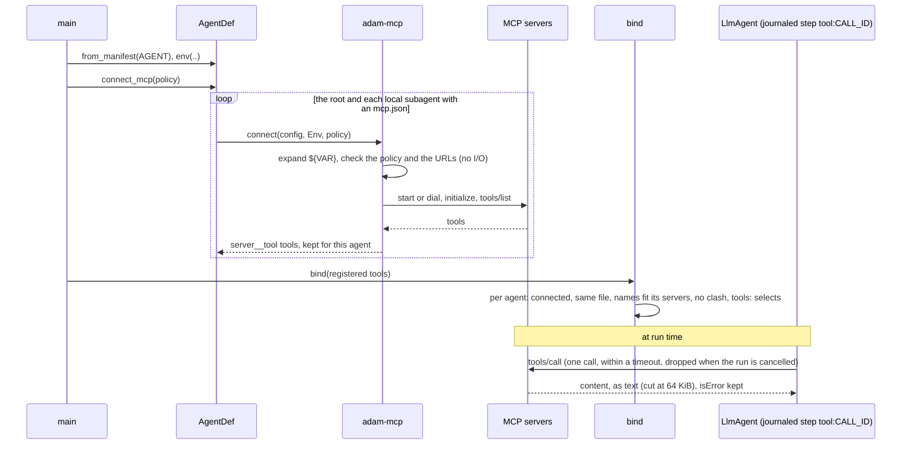

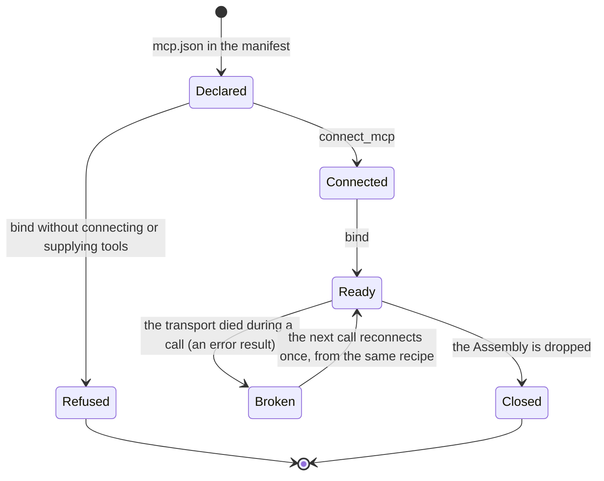

* **Per agent.** An agent's MCP tools come only from the `mcp.json` in its own directory; a subagent inherits
  none, and two directories may each name a server `linear`, connected apart.
* **Fail closed at startup.** `AgentDef::connect_mcp` finds everything that can be wrong before the first
  model call: a `${VAR}` with no value, `type: sse`, a stdio server the policy forbids, a plain-http URL to
  another machine, a URL with credentials or a `${VAR}`, a bad header, a server that is down or refuses the
  credentials, an allow-list naming a tool the server lacks.
* **Names and text.** `<server>__<tool>`; without an allow-list a tool whose name does not fit
  `^[A-Za-z0-9_-]{1,64}$` is skipped with a warning. Descriptions are cut at 8 KiB, answers at 64 KiB; images
  and blobs are described, never included; `isError` is an error result.
* **At-least-once.** A call runs inside the journaled step, so a replay of a committed call does not call the
  server again, but a transition that fails before it commits calls it again. MCP has no idempotency key, so
  **no failure of an MCP call is `ToolError::Transient`**: a timeout or lost connection is an error result saying
  the call may or may not have run.
* **Secrets.** `${VAR}` reads `AgentDef::env` then the process environment. Expanded values are
  `SecretString`s and registered (with their encoded forms) with a redactor that every server message, tool
  result and child stderr line passes through. **Secrets go in `headers`, not in the URL** (the SDK logs the
  URL): `${VAR}` in a `url` is refused unless `McpPolicy::allow_url_secrets(true)`. A secret in stdio `args`
  is visible in `ps`: use `env`. Tool text is controlled by the server: the allow-list is the mitigation.
* **In the binaries.** `adam-coder` and `adam-agent` call `connect_mcp` in every role that runs workers, with
  `MCP_ALLOW_STDIO`, `MCP_ALLOW_INSECURE` and `MCP_ALLOW_URL_VARS`. A server that is down exits 69; anything
  wrong in the files or the policy exits 78.
* **Not supported**: MCP resources, prompts, sampling, roots, elicitation, OAuth, `type: sse`, `list_changed`,
  MCP tasks, progress notifications, exporting adam's tools as an MCP server.

*Verified 2026-09-29* (<https://docs.rs/rmcp/3.5.0>): `rmcp` 3.5.0 is Apache-2.0 with `rust-version` 1.88; its
SSE transport was removed in 0.11.0 and the specification calls HTTP+SSE deprecated
(<https://modelcontextprotocol.io/specification/2025-03-26/basic/transports>).

## Dev reload (feature `dev`)

With the `dev` feature of `adam-assembly` (re-exported by `adam`; **off by default**, so a release binary
cannot watch and turning it on logs a warning), a `LiveAssembly` redoes `from_source`, `bind` and `model` on
each change. Tool code needs a rebuild. Reading a folder once at startup is [below](#run-time-folders) and
needs no feature.

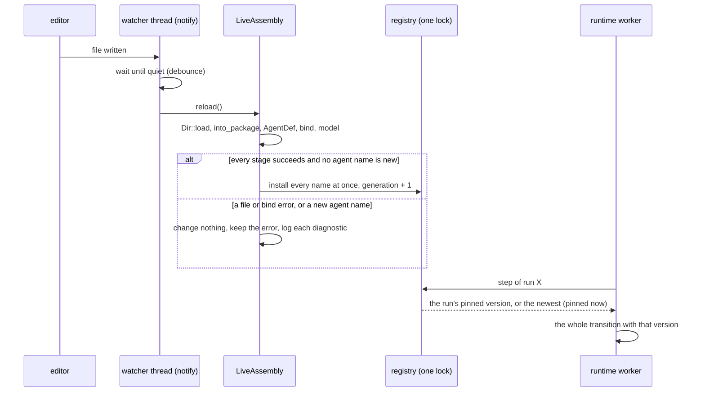

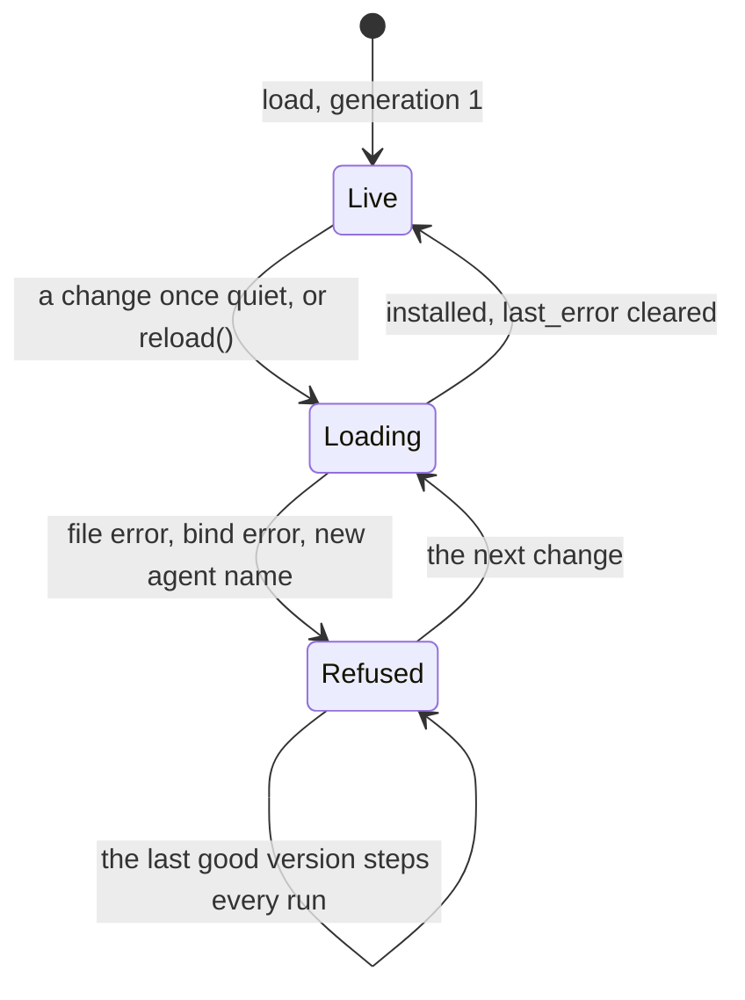

* **What a reload changes.** The prompt is not journaled and the model request is rebuilt each turn, so a new
  prompt, limits, alias, tool description, `{{var}}`, wait timer or token applies to every run **at its next
  step**, never in the middle of one. MCP connections are made once and outlive reloads; an edit of an
  `mcp.json` is refused ("restart the process").
* **The replay rule.** A journal is keyed by step names; a replayed transition that finds `tool:c1` where its
  code now says "unknown tool" fails with `NonDeterminism`. So a change to *which tools exist* must not reach a
  run that has started: an unchanged tool set is swapped for everyone; a changed one applies to **runs that
  start after the reload**; a **new agent name** is refused (`NeedsRestart`); a **removed** agent stays
  registered with its last version; a **restart is a deploy**.
* **An invalid edit** keeps the last good version and logs every diagnostic and `reload refused, keeping the
  last good version`; `last_error()` exposes it.
* The watcher is `notify` 8 (*verified 2026-09-29*, crates.io) with a debounce of our own.
  API and tests: [`adam-assembly` README](../../crates/adam-assembly/README.md#dev-reload-feature-dev).

## Run-time folders

A deployment can change what an agent says and offers (instructions, card, skills, subagents, `mcp.json`)
without a build: the binary reads a folder when it starts ([ADR 0004](../decisions/0004-agent-folders-at-run-time.md)).
`AgentFolder::load(path)` in `adam-assembly` is the mechanism (one agent; warnings returned, errors refused,
plus the digest), `agent_dir_from_env()` reads `ADAM_AGENT_DIR`, and a binary that embeds a copy falls back to
it when the variable is unset (`adam-coder`). The folder is read **once**: no watcher, so a release image stays
as it was and the next start applies an edit.

`adam-agent` ([ADR 0005](../decisions/0005-one-binary-serves-any-agent-folder.md)) serves *any* folder: a chat
assistant or a researcher on a web-search MCP server is a folder (`dev/agents/assistant/agent/`), not a crate,
and its only deployment step is mounting it.

## Mapping: eve to adam-rs to standard

| eve | adam-rs | Standard or convention |
|---|---|---|
| `agent/`, `agents/<name>/agent/` | `agent/`, `agents/<name>/` | eve (no standard exists) |
| `agent.ts` `defineAgent({ model, limits, ... })` | YAML frontmatter of `instructions.md` | Claude Code and Copilot custom-agent frontmatter |
| `instructions.md`, `instructions/` | same | plain Markdown, as AGENTS.md (no required fields) |
| `tools/<name>.ts` `defineTool` + Zod | `#[tool]` fn in `src/`, schemars, `tools![...]` | JSON Schema 2020-12 parameters (the MCP and OpenAI tool shape) |
| `skills/<name>/SKILL.md`, `skills/<name>.md`, `load_skill` | same, plus `read_skill_file` | **Agent Skills spec** |
| `subagents/<id>/agent.ts` (`description` required) | `subagents/<name>.md`, `<name>.agent.md` or `<name>/instructions.md` | Claude Code subagent file, Copilot custom agent |
| remote agent | `subagents/<name>.md` with `a2a:` | **A2A** agent card |
| built-in `agent` tool | not in v1 | none |
| `connections/*.ts` | `mcp.json` (MCP only) | `mcpServers` (Claude Code, SEP-2633 draft) |
| `channels/` | code: `adam-a2a`; `card:` frontmatter | **A2A** agent card |
| `hooks/*.ts` | `EventSink` in code | none |
| `schedules/*.md` (`cron:`) | same | five-field cron |
| `sandbox.ts` | later (roadmap 7) | none |
| `lib/` | `src/` | Cargo |
| `eve info`, `.eve/compile/*.json` | build errors and warnings, `OUT_DIR/adam_agent.rs`, `cargo adam check` | none |
| `eve dev` | the `dev` feature | none |

A2A card "skills" and Agent Skills are unrelated; they never map implicitly. The **AGENTS.md** file
(<https://agents.md/>, *verified 2026-09-29*) is not used as the agent's prompt, because coding agents
read it as instructions for editing that folder. An agent that works on repositories reads the target
repository's nearest `AGENTS.md` at run time instead.

## Decisions (accepted by the owner, 2026-09-29)

The owner accepted D1 to D6 as recommended, and added one rule: **keep the structure of eve.dev, GitHub
Copilot and Claude Code for agents and subagents.** The layout is eve's; the file format is the Claude
Code / Copilot custom agent; `.agent.md` is accepted and the name is the stem without `.agent`; unknown
Claude or Copilot keys are accepted with a warning.

| | Decision | Rejected alternative |
|---|---|---|
| D1 | Configuration is YAML frontmatter, not `agent.toml`: one schema shared with Claude Code, Copilot, OpenCode and Agent Skills | TOML: Rust-native, but no agent convention |
| D2 | Tools live in `src/` with an explicit `tools![]`, not `agent/tools/*.rs` auto-discovery | included files are invisible to `cargo fmt` |
| D3 | A subagent that omits `tools:` gets none | inherit all: Claude-compatible, surprising for a durable backend |
| D4 | Unknown frontmatter keys and Agent Skills violations warn (`.strict()` opts in to errors); a missing `description` always fails | fail the build on any |
| D5 | One tool per subagent, named after it | a single `delegate { agent, message }` tool |
| D6 | The `dev` feature ships in the facade and is off by default | on by default |

Also confirmed: adam-rs domain types are **closed enums** (no `#[non_exhaustive]` unless an existing
type already sets the pattern).

## Open questions

* Reasoning effort, sampling and compaction: `ModelRequest` has no such fields, so the keys are
  accepted and ignored with a warning.
* Tool approvals (`approval:`) fit roadmap 5; where the policy lives (`#[tool(...)]`, frontmatter or
  both) is open.
* An `evals/` directory; an OpenAPI connection; subagent continuation (`task_id`) and a built-in
  root-copy `agent` tool; exporting a Rust tool as an MCP server; following SEP-2633 to ratification.

