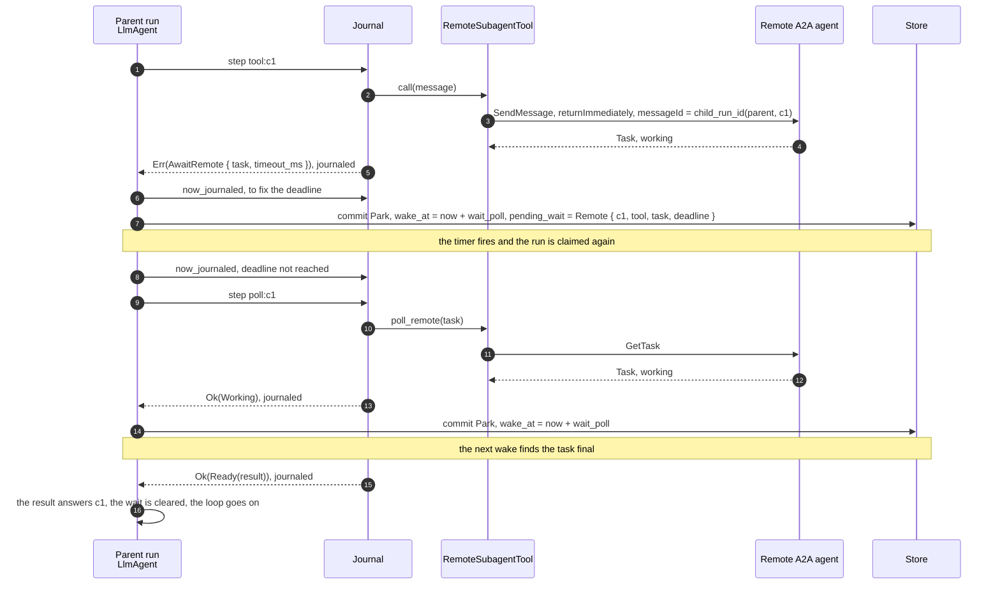
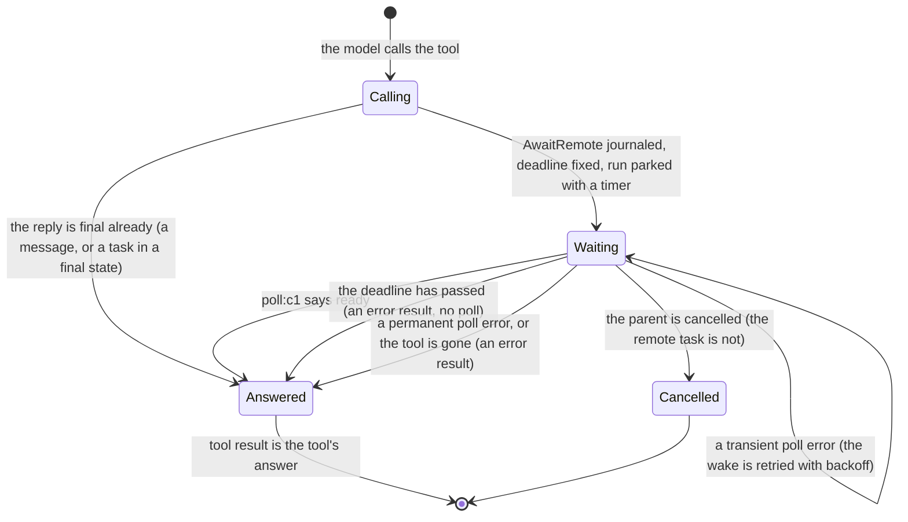

# Child runs and remote tasks

A subagent is a run started by a tool of another run. This page is the full design of the runtime half:
the local case, the remote (A2A) case, every failure interleaving with the test that makes it happen,
and what the design refuses. The picture is in [Architecture](../architecture.md#child-runs); how a
folder declares subagents is in [Agent files](agent-files.md#subagents-at-run-time).

Code: `crates/adam-runtime` (`start_child`, `child_status`, the notice), `crates/adam-llm-agent`
(`pending_wait`, `AwaitRun`, `AwaitRemote`), `crates/adam-assembly` (`SubagentTool`, `RemoteSubagentTool`).

## A local child

* **The child id is derived.** `child_run_id(parent, key)` is a UUID (version 8) from a SHA-256 over the
  parent id and the key, the same way the A2A adapter derives task ids. `ToolCtx::child_run_id()` is that
  for the current tool call. A tool that runs again, after a crash, a lost lease or a transient retry, asks
  for the same child, and `start_child` (which is `start_with_id` plus the parent) answers `false` and
  leaves the first one alone. The only side effects of the tool are that creation and reads.
* **The message is a hint, the timer is the guarantee.** The runtime sends the message after the child's
  commit, in the worker that made it. It cannot be part of that commit (the store commits one run at a
  time), so a crash or a store error in between loses it, and so does a commit whose acknowledgement is lost
  (the worker then believes the commit failed and sends nothing). The parent therefore never waits without a
  timer: `LlmAgentBuilder::wait_poll` (60 s by default) bounds how late it can be, and each wake without the
  message is one `load_run`. A failed send is logged at `warn`; a parent that is finished or gone is logged
  at `debug` and is not an error.
* **The message is deduplicated by its id.** `Inbound::id` is the child's run id. The `LlmAgent` matches it
  to the run it waits for, uses it once (the wait is cleared in the same commit that consumes it) and drops
  every other: copies of a message already used, a message for a run it does not wait for, one that does not
  parse, one whose status is not final. Such messages are never read as user text.
* **The answer.** A finished child's `output.text` (what an `LlmAgent` child ends with), else its output as
  JSON, is the tool result. A `Failed` child, a cancelled one (`cancelled: <reason>`), one whose state cannot
  be read and one that was purged are an error result (`the run failed: <why>`): the model sees it and the
  run goes on. Nothing in the parent fails because a child did.
* **Who may be asked about.** `Ctx::child_status` answers only for children of the calling run. An id that
  belongs to a run of another parent (or to none) is a permanent error, so an agent cannot read the results
  of unrelated runs, and a derived id that collided with a stranger's run would fail loudly and not answer
  with the stranger's output.
* **`Conversation::pending_wait`** is what the parent is parked on: a `Question` for the user (this field was
  `pending_question`, and state stored under that name still loads) or a `Run` for a child. A2A reads a run
  parked on a timer as `working` and only a run parked with no timer as `input-required`, so a parent
  waiting for a child is `working`.

## Failure interleavings

Each one has a test that makes it happen without sleeping: steps are held at gates, the 60 s timer is
moved with a `ManualClock`, and a fault is scripted on one run of the `FaultyStore` (`fail_run`,
`fail_run_after_apply`). Names are in `crates/adam-runtime/tests/runtime.rs` (memory, PostgreSQL and
MongoDB) and `crates/adam-llm-agent/tests/child_runs.rs`.

| # | What happens | What the design does | Test |
|---|---|---|---|
| 1 | The child's terminal commit lands, then its process dies, or delivering to the parent fails | The parent stays parked on its timer. At the timer it reads the child, finds it terminal and answers. Nothing else knows anything is missing | `a_lost_notice_is_recovered_by_the_timer`, `a_lost_notice_is_recovered_when_the_timer_fires` |
| 2 | The child's terminal commit is applied but its acknowledgement is lost | The worker treats the commit as failed and sends nothing (the run is `Done` in the store and nobody claims it again). Same recovery as 1 | `a_lost_terminal_ack_sends_no_notice_and_the_timer_recovers`, `a_lost_terminal_ack_is_recovered_when_the_timer_fires` |
| 3 | The message is delivered twice, or three times, or again after the answer is in, or after the run is over | The first match answers the call and clears the wait. Later copies match no wait and are dropped. On a finished parent `deliver` answers `Finished`, which the sender ignores. The model is not asked again | `a_duplicate_notice_is_ignored`, `only_the_awaited_childs_notice_answers` |
| 4 | The parent is cancelled while it waits | **The child is not cancelled** (see below). It runs to its end within its own limits, its message finds a finished parent and is dropped, and the parent stays `Failed` with `cancelled: <reason>`, untouched | `cancelling_a_waiting_parent_does_not_cancel_its_child`, `cancelling_the_parent_leaves_the_child_running` |
| 5 | The child fails, is cancelled, or was purged | The parent gets `status: failed` and the reason (or, for a purged child, finds it gone) and the tool result is an error result. The run continues | `a_failed_or_cancelled_child_tells_its_parent_why`, `a_failing_child_is_an_error_result`, `a_cancelled_child_is_an_error_result`, `a_child_that_is_gone_is_an_error_result`, `a_purged_child_reads_as_gone` |
| 6 | The parent's lease is lost while it waits, or while it starts the child | Fencing is the version compare-and-swap, not the lease. The worker that took over replays the step: the journal has the start, and `start_child` would answer `false` anyway, so there is one child. The first worker's late commit is refused. The message is delivered with the same compare-and-swap, so it lands on whichever version is current. The parent resumes once. The same holds for the step that answers the call: its consumption of the message commits with it, so a worker that takes over sees the message again and answers the same way | `a_parent_that_loses_its_lease_does_not_start_or_resume_twice`, `a_worker_that_loses_its_lease_while_answering_changes_nothing` |
| 7 | The message arrives before the parent has parked | While the tool step runs: the message waits in the inbox, and the commit turns the park into a wake-up (the rule that already keeps a parked agent from sleeping through a message that arrived during its step). In a replay or a retry of that step: the snapshot the step starts from already holds the message but the wait is not recorded yet, so the agent matches it *after* the tool has returned `AwaitRun`, in the same transition, and never parks | `a_notice_that_beats_the_park_is_not_lost`, `a_notice_that_beats_the_park_is_used`, `a_retry_finds_the_notice_before_the_wait_is_recorded` |
| 8 | The timer fires and the child is still working | One `child_status` read, no answer, a new timer one interval later. No second child, no model call | `a_parent_woken_early_parks_again`, `the_parent_looks_at_the_child_when_the_timer_fires` |
| 9 | A user message arrives while the parent waits | It wakes the parent, which finds nothing to answer with and parks again. The message is kept and appended after the tool result, as for any owed result | `a_message_while_waiting_queues_behind_the_result` |
| 10 | A forged, stray or malformed `adam.run.finished` | Matched by the child's run id only, and only a final status counts. Otherwise it is dropped without becoming user text. `child_status` refuses runs that are not the caller's children | `only_the_awaited_childs_notice_answers`, `child_status_reads_only_the_callers_children` |
| 11 | Two workers start the same child | `create_run` refuses the second (`AlreadyExists`), `start_child` returns `false`. One row | `start_child_records_the_parent_and_is_idempotent` |
| 12 | The process that finishes the child has never heard of the parent's agent | Delivering needs only the parent's run id: it does not have to register the parent's agent. The parent's own worker steps it | the split `front` and `back` runtimes of cases 1, 2, 5 and 6 |

What the design refuses to do, and why:

* **No cascade on cancel (v1).** Cancelling a parent does not cancel its children. A cascade needs a way to
  list children, which the `Store` port does not have (`parent_id` is stored and indexed, and nothing reads
  it), so it is a new port method for three stores and the testkit, and it makes `cancel` more than one
  compare-and-swap. What it costs: a child whose parent is gone runs on until it finishes or hits its limits
  (`max_turns`, `max_tool_calls`), and its message is dropped. That is bounded and visible (the child is a
  normal run, listed and cancellable by id), and `docs/reference/agent-files.md` records the same choice for subagents.
  The seam is `Store::children(parent)` plus a loop in `Runtime::cancel`.
* **No parallel fan-out yet.** An `LlmAgent` runs the calls of one model turn in order, and the first
  `AwaitRun` parks the run, so three subagent calls in one turn run one after the other. Starting all the
  children first and waiting for all of them needs `pending_wait` to hold several runs.
* **No timeout on a child, and no asking tools in a subagent.** A parent waits as long as its child is open. A
  child that parks with no timer, for instance because one of its tools asked the user something, waits for
  an answer nobody is placed to give (`Limits` bound a running child, not a parked one). The subagent binding
  (`adam-assembly`) closes this at startup instead of at run time: a tool that can ask says so
  (`Tool::asks_user()`), and `bind` refuses a subagent that has one, so the situation cannot arise from an
  agent directory. A tool that returns `NeedsInput` without declaring it still parks its child, and a child
  can still be cancelled by id: the parent then gets the error result.
* **The output travels whole.** The child's output is the payload of the message, then the text of the tool
  result in the parent's history. Long histories are shortened for the model by `max_history_tokens` as for any
  tool output, but the stored conversation keeps it.
* **No guarantee for a child purged early.** `purge_finished` deletes a finished run with its journal. A
  parent that has not looked yet then reads `None` and reports "the child run no longer exists". Keep the
  retention above the parent's longest wait plus one `wait_poll`.
* **No mixed versions.** The journal entry `AwaitRun` and the `pending_wait` field are not read by a build
  that predates them (it would fail the run as non-deterministic on replay). Roll the workers before the
  tools that start children are enabled. The other direction is safe: journals and states written before
  (`ToolError` without `AwaitRun`, `Conversation` with `pending_question`) load and replay in the new build.

Code that runs inside a step but cannot hold the `Ctx`, such as a tool of an `LlmAgent`, starts a child through
`Ctx::child_starter()`: an owned `ChildStarter` for the runtime that is stepping the run, which can start only
children of that run (`start` is `start_child` with the parent fixed). `LlmAgent` hands it to every tool as
`ToolCtx::start_child(agent, message)` (under `ToolCtx::child_run_id()`), so a tool needs no `Runtime` handle,
and the child starts on the runtime that steps the parent, whichever process that is. The subagent tool of
`adam-assembly` is exactly this call followed by `AwaitRun`; see [subagents](agent-files.md#the-subagent-tool).

A hand-written `Agent` can wait for children too: start them with `start_child`, `Park` with a timer, and on
the next step read `take_inbox()` for messages of kind `adam.run.finished` (`ChildStatus::from_notice`) and
`Ctx::child_status` when there is none. It must take its inbox in the step that parks as well: a message
already in the inbox when a step starts is not "arrived during the step", so an agent that parks without
reading it sleeps until its timer.

## Remote tasks: the same wait without a message

A subagent on another A2A agent (`a2a:` in its file) is the same idea with one thing missing: nothing tells
the parent when the remote task is over. The tool starts the task, returns `ToolError::AwaitRemote { task,
timeout_ms }`, and the parent records `PendingWait::Remote { call_id, tool, task, deadline }` and parks with
the `wait_poll` timer. Each time it fires the agent asks the tool how the task stands, as a journaled step,
until it is over. **The timer is the mechanism.**

* **Every look is a journal step.** `poll:<call id>` records `Working` or `Ready(result)`, and, when the wait
  has a deadline, `ctx.now` is read through the journal (`Ctx::now_journaled`) so that a replay takes the
  same branch (a replay that skipped a recorded `poll:` step because the clock had moved would meet the
  wrong step name at the next `seq` and fail as non-deterministic). A transient poll error fails the wake as
  `AgentError::Transient`, and the retry looks again from a fresh `seq`.
* **The start is idempotent by message id, not by run id.** A child run is started under an id the runtime
  refuses to create twice; a remote task is started by a `SendMessage` whose `messageId` is
  `child_run_id(parent run, call id)`. The guarantee is only as good as the remote's memory of that id
  (`adam-a2a-runtime` starts the task under `task_id_for(agent, caller, context, messageId)`, so a repeat reaches
  the same task). The journal makes the call once per recorded outcome regardless.
* **Failure interleavings.**

| # | What happens | What the design does | Test |
|---|---|---|---|
| 1 | The process dies while the parent waits | The wait is in the run's committed state. A new process claims the run at the timer and polls the recorded task: no second send | `a_restart_mid_wait_resumes_polling_without_sending_again` (`adam-assembly`), `a_new_process_keeps_polling_without_starting_the_task_again` (`adam-llm-agent`) |
| 2 | The send reaches the remote and its response is lost | The step fails transiently and is retried; the retry sends the same `messageId`, and a deduplicating remote returns the task it made | `a_send_whose_response_is_lost_is_retried_under_the_same_message_id` |
| 3 | The remote finishes while nobody polls | The next timer wake finds it final and answers | the restart case above |
| 4 | The task never ends | At the deadline (default one hour, `AgentDef::remote_timeout`) the call is answered with an error result; the remote task keeps running | `a_task_that_never_ends_is_given_up_on_after_the_limit`, `a_task_that_outlives_its_timeout_is_an_error_result_without_another_look` |
| 5 | The remote fails, cancels, rejects, or wants input | An error result naming the state and the remote's message; the run goes on | `a_remote_task_that_fails_is_an_error_result_and_the_parent_goes_on`, `a_remote_task_that_is_canceled_is_an_error_result`, `a_remote_that_needs_input_is_an_error_result_because_nobody_can_answer` |
| 6 | The remote answers 401 or the card points the token elsewhere | An error result; nothing is sent to the other origin | `a_wrong_token_is_an_error_result_not_a_failed_run_and_the_token_stays_out_of_it`, `a_card_that_points_the_token_at_another_origin_is_refused_before_anything_is_sent` |

* **What it refuses to do.** No streaming yet (`SubscribeToTask` would end the wait sooner; the poll stays as
  the fallback); no cancel of the remote task when the parent is cancelled or the wait times out (that needs a
  tool hook for cancellation); no `contextId` continuity between calls. And, as with child runs, **no mixed
  versions**: a build that predates `AwaitRemote` cannot read a journal that contains it.

