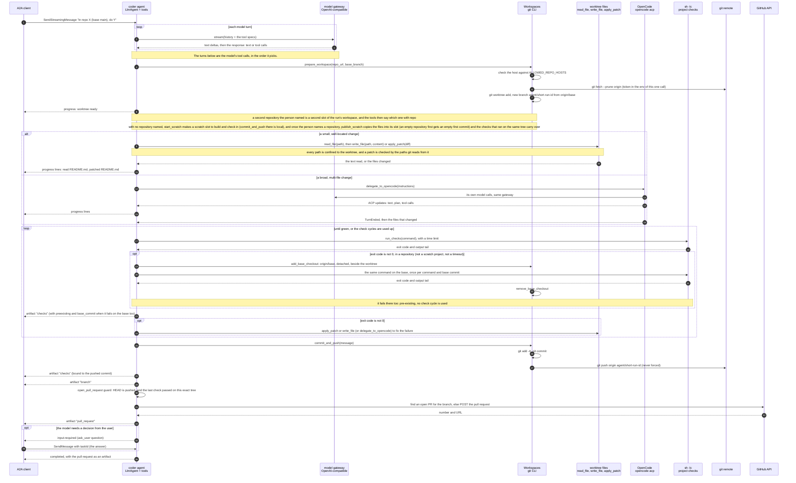
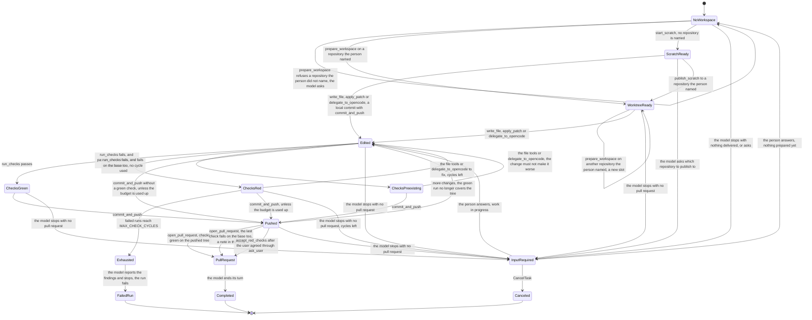

# The coder agent

Adam (the `adam-coder` binary) is a general agent that answers and explains, researches with the tools it is given, writes documents and files, and plans before it acts on a large request ([ADR 0021](../decisions/0021-the-coder-is-adam-a-general-agent-that-can-code.md)). Its strongest path, and the one this page describes, turns a coding task into a pull request. A client sends "in repository X, do Y"; the agent
makes the change in a private git worktree (a slot of the run's workspace), runs the project's own checks
and opens a pull request. It is an `LlmAgent` with 17 tools of its own plus the screen's `ask_user`,
`show` and `ui_catalog`, one extra completion rule, running on the durable runtime and served over A2A.
Crate README with every detail: [`bin/adam-coder`](../../bin/adam-coder/README.md).

Two read-only subagents, `explorer` and `reviewer` (`bin/adam-coder/agent/subagents/`), look at the same worktree
for it: tools find the workspace and the budgets of the **root run** (`ToolCtx::root_run_id`), so a child run shares them
([ADR 0021](../decisions/0021-the-coder-is-adam-a-general-agent-that-can-code.md)).

The model decides the order of the tools. **The tools enforce the rules**, so they hold even if the model
ignores its prompt.

## What it does

Artifacts:

* `pull_request`: a data part (`url`, `number`, `branch`, `repository`) and an A2A `url` part, so a chat
  surface shows a link (`adam_a2a_runtime::artifact_of`).
* `checks` (`passed`, `commit`, `tree`, optional `summary`, `findings`, and `preexisting` with `base_commit` when the
  command fails on the base too): reported by every `run_checks` that ran; `commit_and_push` emits one bound to the pushed commit (the last run's report if it ran on the
  pushed tree, else `passed: false`). An orchestrator gates on the last `checks` whose `commit` is the
  pushed SHA. Schema: [coder README](../../bin/adam-coder/README.md#artifacts).
* `branch`.
* A shared file (`share_file`): one A2A `raw` part with `mediaType` and `filename`, capped at 4 MiB a file
  and 6 MiB a run, never shown to the model ([ADR 0012](../decisions/0012-files-as-a2a-artifacts.md)).

## The same flow as states

The states are not stored as an enum: they follow from the per-run notes (failures counted, last check and
its tree, pushed sha, pull request) and the worktree.

`Exhausted` has no way out except failure: `run_checks`, `commit_and_push` and `open_pull_request` all
refuse, and `accept_red_checks` never overrides it. `InputRequired` is the chat waiting for the person; the
run ends only with a pull request, a failure, `CancelTask` or `max_turns`.

## Rules in code

| Rule | Where |
|---|---|
| `prepare_workspace` and `publish_scratch` accept only a **granted** repository: one the person named in their own messages (recorded from the conversation, never from the model's argument; text in `untrusted` fences does not count), or one they agreed to add when `request_repository` asked. An explicit no is remembered. | [coder README](../../bin/adam-coder/README.md#another-repository-only-with-the-persons-yes), [ADR 0008](../decisions/0008-a-workspace-holds-several-repositories.md) |
| `create_repository` makes a new **empty**, private-by-default repository for an owner in `CREATE_REPO_OWNERS`, only after the person says yes to a question the tool writes. A GitHub App creates for organisations only. | [coder README](../../bin/adam-coder/README.md#a-repository-of-its-own-on-request) |
| A check that fails in a repository is run once on `origin/<base>`: when it fails there too it is **pre-existing**, spends no cycle, is told to the model and carries `preexisting` in the `checks` artifact, and does not stop `open_pull_request` (the body says so). Not for a scratch project or a timeout. | [ADR 0026](../decisions/0026-a-failure-the-base-has-too-is-not-the-runs.md) |
| After `MAX_CHECK_CYCLES` (3) failed check runs in a repository, `run_checks`, `commit_and_push` and `open_pull_request` refuse there. A scratch project has `SCRATCH_CHECK_CYCLES` (5), counted apart. | ADR 0013 |
| `open_pull_request` refuses unless the pushed `HEAD` is the current commit **and** the last check passed on exactly that tree. A continued branch is fast-forwarded only after this gate (never forced). | |
| The shell has three tools of one job each: `run_command` looks (its changes are undone), `run` makes (file changes kept, git untouched), `run_checks` checks and is the only one the gate sees. | [ADR 0013](../decisions/0013-run-keeps-changes-edit-file-and-scratch-completion.md) |
| The file tools refuse a path that is empty, absolute, has `..`, names `.git`, or leaves the worktree through a symlink. A patch is checked by the paths `git apply --numstat -z` reports and refused if it creates a symlink or submodule. `edit_file` replaces exact text and, when it cannot, changes nothing and shows the closest region. | [coder README](../../bin/adam-coder/README.md#reading-and-changing-files-itself) |
| A command the shell cannot find (exit 127) is a missing toolchain: reported to the model, no check cycle used, the model asks the person. | |
| A **scratch project** is temporary and has no remote: `commit_and_push` there is a local commit; `open_pull_request` refuses. `publish_scratch` copies all or nothing into a repository the person named. | [coder README](../../bin/adam-coder/README.md#scratch-projects) |
| A workspace of several slots: the tools take an optional `repo`, refused with the list of slots when there are several and none is given. The run notes keep the last 32 check records for the gate. | [coder README](../../bin/adam-coder/README.md#the-workspace-of-a-run) |

How a run **ends** (`CoderAgent::verdict`): "the model said it is done" is not "delivered".

| The model stops with no pull request, and | Result |
|---|---|
| the check-cycle budget is used up with the last check red, or the credentials were rejected | the run **fails** |
| it is scratch work that shared a file (`share_file`) and no repository was named, created, pushed or continued | the run **completes** (owner's decision of 2026-10-02, ADR 0013) |
| anything else | a question: the run parks `input-required` with the model's text as the question |

Every tool is safe to repeat (a crash before the result is journaled runs it again): `prepare_workspace`
reuses the run's slot, `start_scratch` returns the project of that name, `commit_and_push` does nothing when
there is nothing new, `open_pull_request` returns the open pull request of the same branch.

## Continuing a task

A rework is a new task that references a finished one ([A2A server](a2a-server.md#a-new-task-that-continues-a-finished-one)).
`prepare_workspace`'s `branch` is accepted only for a branch that a `commit_and_push` of that conversation
recorded for that repository; once checks pass, `open_pull_request` moves that branch to the run's commits,
which updates the same pull request. Details: [coder README](../../bin/adam-coder/README.md#a-task-that-continues-a-task).

## Where state lives

Conversation, journal and run state are in Postgres. Under `WORKSPACE_ROOT` (default `/work`) are files: the
shared git mirrors (`<root>/git/`), the workspaces of runs (`<root>/workspaces/<run>/<slot>`) and the per-run
notes (`<root>/coder/<run>.json`: failures counted, last checks, pushed branches, grants). **Git is the durable
artifact**: a lost database loses the run ledger, not the pushed branches or the pull requests.

## Secrets

| Secret | How it is kept |
|---|---|
| Git token | reaches `git` only in the environment of one invocation, never in a remote URL or `.git/config`, and only for hosts on `ALLOWED_REPO_HOSTS` |
| GitHub App | a token **or** an App installation, never both ([ADR 0009](../decisions/0009-github-per-installation-read-through-mcp.md)): `GitHubApp` signs a short JWT, trades it for an installation token (kept until five minutes before it expires, one mint at a time), and finds the installation of each owner when not pinned (`GITHUB_APP_OWNERS`, required, [ADR 0017](../decisions/0017-a-github-app-works-on-every-account-it-is-installed-on.md)) |
| GitHub reads | through the official GitHub MCP server, read-only, as a **sidecar** that holds no credential; the coder gives each call the token of the repository it is about (`GitHubReadBearer`). Writes stay the coder's own, behind the gate |
| OpenCode | its child gets `MODEL_API_KEY` by reference (`{env:...}` or a file in a devcontainer); `GITHUB_TOKEN`, `GITHUB_APP_PRIVATE_KEY`, `DATABASE_URL` and `A2A_BEARER_TOKENS` are blanked in it |
| Everything | a `Redactor` scrubs the process's own secrets from every tool result, event and failure text |

## Limits and cancel

`limits:` in `agent/instructions.md`: 200 model turns, 400 tool calls, 8192 output tokens per call, 100,000
tokens of history; a limit that trips fails the run. When a run is cancelled while OpenCode works, the tool
sends ACP `session/cancel`, waits 2 seconds, then kills OpenCode and its process group and tells the run's
environment which command to kill.

Where the workspace, the janitor and the environments are: [Workspace and environments](workspace-and-environments.md).
Configuration: [Environment variables](environment.md).
