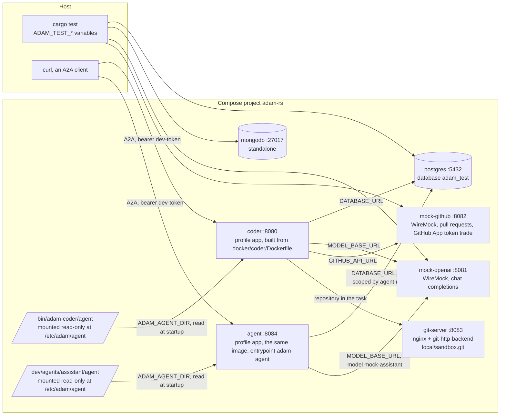

# The local stack: services, mocks and scripted models

`compose.yaml` starts the databases, WireMock stand-ins for the external systems, a local git remote and,
under the `app` profile, the coder and a general agent wired to all of them. Ports bind to `127.0.0.1` and
every credential in the file is a dummy. To run it, see [Run it locally](../guides/run-locally.md); to run
the end-to-end scripts, [Testing](../guides/testing.md#end-to-end-scenarios).



## Services

| Service | Host address | What it is |
|---|---|---|
| `postgres` | `127.0.0.1:5432` | PostgreSQL 16, database `adam_test`, user and password `postgres` |
| `mongodb` | `127.0.0.1:27017` | MongoDB 7, standalone; used by the store tests only |
| `mock-openai` | `http://127.0.0.1:8081/v1` | WireMock: OpenAI-compatible chat completions (also without `/v1`) and `/v1/models`; the models `mock-coder`, `mock-opencode`, `mock-assistant` and `mock-researcher` are scripted ([below](#scripted-models)) |
| `mock-github` | `http://127.0.0.1:8082` | WireMock: the GitHub REST subset `adam-workspace` uses (list and open pull requests, create a repository, the owner's kind, the login) and the GitHub App token trade (`POST /app/installations/{id}/access_tokens`, a token that lasts four minutes) |
| `mock-github-mcp` | `http://127.0.0.1:8085/mcp` | WireMock: the GitHub MCP server's streamable HTTP endpoint (behind a bearer, `401` without; `initialize`, `tools/list` with the twelve read tools, `tools/call` of `get_me` and `list_branches`; any other tool is an error result "not scripted") |
| `git-server` | `http://127.0.0.1:8083/local/sandbox.git` | bare repositories over smart HTTP (nginx + git-http-backend), seeded from `dev/git-server/seed/<owner>/<name>/`, no authentication |
| `coder` (profile `app`) | `http://127.0.0.1:8080/` | the coder built from `docker/coder/Dockerfile`, bearer token `dev-token`; its folder `bin/adam-coder/agent` is mounted read-only at `/etc/adam/agent` |
| `github-mcp` (profile `app`) | none (the coder's network) | the real GitHub MCP server (`github-mcp-server http --read-only`), the coder's sidecar with no credential; idle here, the coder reads `mock-github-mcp` |
| `agent` (profile `app`) | `http://127.0.0.1:8084/` | `adam-agent` from the **coder's image** (entrypoint `tini -- adam-agent`), token `dev-token`, serving `dev/agents/assistant/agent`, model `mock-assistant`; shares the coder's database (runs are scoped by agent name) |

The coder waits for `postgres`, `mock-openai`, `mock-github` and `git-server`. Its `mcp.json` in this stack is
`dev/coder-agent/mcp.json`, mounted over the folder's, with `GITHUB_MCP_URL=http://mock-github-mcp:8080` and
`MCP_ALLOW_INSECURE=true` (plain `http` to another container; development only). `CREATE_REPO_OWNERS` is
`scratch`. The coder authenticates with a dummy token unless `-f dev/compose.github-app.yaml` is added (below).
Ports move with variables ([Environment](environment.md#local-stack-composeyaml)).

## Overrides

| File | What it adds |
|---|---|
| `dev/compose.github-app.yaml` | the coder as a **GitHub App**: an init service makes a throwaway RSA key into a volume (none is committed), `GITHUB_TOKEN` is off, the coder gets `GITHUB_APP_ID`, `GITHUB_APP_OWNERS` (`local,scratch,other-org`, no pin) and `GITHUB_APP_PRIVATE_KEY_PATH`. It finds each owner's installation at `mock-github` (every owner on installation 67890, `other-org` on 67891), trades its JWT and uses the installation token for `git`, REST and MCP calls. WireMock cannot check an RS256 signature; that is `cargo test -p adam-workspace --test github_app`. |
| `dev/compose.devcontainer.yaml` | a **rootless Podman** service beside the coder (no `privileged`, `cap_add` or `devices`; `dev/podman/README.md` says why) and `DEVCONTAINER_RUNTIME=podman`, so a run works in its repository's own devcontainer. Ubuntu 24.04 hosts need `sudo sysctl -w kernel.apparmor_restrict_unprivileged_userns=0`. The first pull and build take minutes. |

## `mock-openai` scenarios

Selected by the request header `X-Mock-Scenario: <name>`, or by `[mock:<name>]` anywhere in the request body.
Mappings: `dev/wiremock/mock-openai/`.

| Scenario | Answer |
|---|---|
| (none) | a text answer; with `"stream": true` an SSE stream: role chunk, text chunks, finish chunk, a usage chunk (empty `choices`), `data: [DONE]` |
| `tool-call` | a call of the **first tool the request declares** with arguments `{}` (`finish_reason: tool_calls`), streamed or not. Once the history holds a `tool` message the mock answers in text instead, so an agent loop ends |
| `rate-limit` | `429` with `Retry-After: 2` |
| `server-error` | `500` |
| `unauthorized` | `401` `invalid_api_key` |
| `context-length` | `400` `context_length_exceeded` |

These apply to every model except `mock-coder`, `mock-opencode` and `mock-assistant`, which follow their scripts.
The error scenarios apply to streaming and non-streaming requests alike and persist as long as the header or
keyword is sent.

## `mock-github` scenarios

`GET /repos/{owner}/{repo}/pulls` answers no open pull requests; `POST` answers `201` with number, `html_url` and
`head.ref` derived from the request. Same switches: the header, or `[mock:<name>]` in the body of a `POST`.

| Switch | Answer |
|---|---|
| `Authorization: Bearer bad-token`, or scenario `unauthorized` | `401` "Bad credentials" |
| `rate-limit` | `403` with `x-ratelimit-remaining: 0` |
| `server-error` | `500` |
| `already-exists` (on the `POST`) | `422` "A pull request already exists", and the **next** `GET` returns a pull request (#42) once, then the mock is back to normal: a lost race with another opener |
| a `head` query containing `already-open` | the list returns pull request #7, so opening is idempotent |

`dev/wiremock/mock-github/mappings/repos.json` is what `create_repository` needs: `GET /users/{owner}` says
`local` and `scratch` are organisations and any other owner a user; `GET /user` is `dev-user` (for an
installation token, `403 Resource not accessible by integration`, as GitHub says); `POST /orgs/{owner}/repos` and
`POST /user/repos` answer `201` with a new empty repository whose `clone_url` is
`http://git-server:8080/<owner>/<name>.git`. `[mock:already-exists]` answers `422 name already exists`.

## `mock-github-mcp`

Production runs the real server as a sidecar of the coder's pod; the stack has no GitHub to give it, so the mock
stands in over the same transport. It answers JSON with no session id and no standalone stream (`GET` and
`DELETE` are `405`), which `rmcp`, the client of `adam-mcp`, accepts (*verified* by
`cargo test -p adam-mcp --test wiremock_compose`, which CI runs). `get_me` is `{"login":"dev-user"}`,
`list_branches` is `[{"name":"main"}]`. The dev `mcp.json` holds no credential: the coder sends the credentials of
each call and a placeholder (`ghs_adam_listing_only`) to list the tools at startup. `dev/coder-e2e.sh` reads the
mock's journal.

## `git-server`

```sh
git clone http://127.0.0.1:8083/local/sandbox.git      # README.md, check.sh, justfile
```

Inside the network it is `http://git-server:8080/local/sandbox.git`, which is what a task should name. Layout
`/<owner>/<repo>.git`, the shape `adam-workspace` and the mock GitHub expect; repositories live in the `git-data`
volume. Seeds: `local/sandbox`, `local/library` (a `greeting.txt`, for `second-repo`), `local/devbox` (its own
devcontainer with the tool `devbox-tool`) and `local/devbox-broken` (a devcontainer file that asks for what is not
allowed). A request for `/<owner>/<name>.git` of an owner in `AUTO_CREATE_OWNERS` (`scratch` in `compose.yaml`)
makes the bare repository first, empty, on `main`, with pushes enabled, as a just-created GitHub repository is
(`dev/git-server/cgi.sh`). Any other missing repository is a 404. `GET /__repos/` lists what is there.

## Scripted models

The coder's model is `mock-coder` and OpenCode's is `mock-opencode` (`MODEL` and `OPENCODE_MODEL` in
`compose.yaml`); the general agent's is `mock-assistant`. All are in `mock-openai`, selected by the request's
`model`, and are **stateless**: the answer is chosen by which scripted tool-call ids the request's history already
holds, so a retried or replayed request gets the same answer and the script cannot drift out of step.

| Model | Mapping | Script |
|---|---|---|
| `mock-coder` | `mappings/coder-script.json` | `prepare_workspace` (`http://git-server:8080/local/sandbox.git`, `main`, id `coder-call-1`), `github__list_branches` (`local/sandbox`, read through `mock-github-mcp`, id `coder-gh-1`), `delegate_to_opencode` (create `hello.txt` containing `hello`, `coder-call-2`), `run_checks` (`sh ./check.sh`, `coder-call-3`), `commit_and_push` (`coder-call-4`), `open_pull_request` (`coder-call-5`), then a final text (`stop`). Also as a stream (see below). |
| `mock-coder`, the person's first message is a greeting (`hi`, `hello` or `hey`, then anything) | same file | a text answer (`stop`): `Hi! I'm <name>. <summary>. What can I help with?`, **built from the first two lines of the system prompt** (`messages[0]`: `Your name is <name>.` and `In one sentence: <summary>.`, the persona lines the coder's `agent/instructions.md` opens with), so editing the instructions, or mounting another folder, changes the mocked answer. The run then waits for the person (`input-required`); the answer to it (the synthetic `ask_user` call `stop0000N` is in the history) continues with `prepare_workspace` (`coder-call-1`) and the script above. A greeting needs a system message first: a request with the user message alone is not one. |
| `mock-coder`, task text contains `[mock:no-opencode]` | same file | `prepare_workspace` (`nc-call-1`), `run_checks` with `echo hello > hello.txt && sh ./check.sh` (the check command makes the change, `nc-call-2`), `commit_and_push`, `open_pull_request`, final text. OpenCode is never started: deterministic where OpenCode's own behaviour is not the subject. |
| `mock-coder`, task text contains `[mock:files]` | same file | the coder edits the files itself, ids `fl-call-N`: `prepare_workspace` (`fl-call-1`), `read_file` `README.md` (`fl-call-2`), `write_file` `hello.txt` with `hello` (`fl-call-3`), `run_checks` (`sh ./check.sh`), `commit_and_push`, `open_pull_request`, final text. OpenCode is never started. `dev/coder-e2e.sh` runs it with `SCENARIO=files`. |
| `mock-coder`, task text contains `[mock:second-repo]` | same file | ids `sr-call-N`: `prepare_workspace` (`local/sandbox`), `request_repository` (`http://git-server:8080/local/library.git`, a reason), which parks the run on the tool's question; once the answer is in the history, `prepare_workspace` (`local/library`), and then by what that said. **Added** (its `slot: library` is in the result): `read_file` (`greeting.txt`, `repo: library`), `write_file` (`hello.txt` in the sandbox, `hello from library`), `run_checks`, `commit_and_push` and `open_pull_request` (all `repo: sandbox`), final text. **Refused** (the refusal text is in the result): a final text that says the library could not be added, which parks the run. `dev/coder-e2e.sh` runs it with `SCENARIO=second-repo` and `ANSWER=yes` or `no`, and `wiremock_compose` plays both ways, in both forms. |
| `mock-coder`, task text contains `[mock:create-repo] fib-<hex>` | same file | ids `cr-call-N`: `start_scratch`, two `write_file`, `run_checks`, a **text question** (it can create a repository), which parks the run. Once the person's answer holds `Create scratch/`: `create_repository` (`scratch`, `fib-<hex>`, a description; the name taken from the task text with `regexExtract`), which parks the run on the tool's question; once its answer is in the history, `create_repository` again. Then by what the tool said. **Created** (`(private, empty` is in the result): `publish_scratch` (`http://git-server:8080/scratch/fib-<hex>.git`), `commit_and_push` and `open_pull_request` (`repo: fib-<hex>`), final text. **Declined** (`declined` is in the result): a final text that says the repository was not created, which parks the run. `dev/coder-e2e.sh` runs it with `SCENARIO=create-repo` and `ANSWER=yes` or `no`, and `wiremock_compose` plays both ways, in both forms. |
| `mock-coder`, task text contains `[mock:devcontainer]` | same file | the repository's own devcontainer is the environment, ids `dc-call-N`: `prepare_workspace` (`local/devbox`), `run_command` `devbox-tool --version` (`dc-call-2`; the tool only the devcontainer has), `run_command` `env` (`dc-call-3`; the e2e asserts it shows no secret), `delegate_to_opencode` (`dc-call-4`, with `[mock:oc-devbox]` in the instructions: `mock-opencode` then calls `bash` with `devbox-tool --version > tool.txt`, ids `oc-dc-1`, and says it is done), `run_checks` (`sh ./check.sh`, which passes only where `devbox-tool` is the devcontainer's), `commit_and_push`, `open_pull_request`, final text. `dev/coder-e2e.sh` runs it with `SCENARIO=devcontainer`, on the stack with `dev/compose.devcontainer.yaml`, and `wiremock_compose` plays all four scripts below both ways. |
| `mock-coder`, task text contains `[mock:default-env]` | same file | a repository without a devcontainer, ids `de-call-N`: `prepare_workspace` (`local/sandbox`), `run_command` `test -d /opt/flutter && echo coder-env || echo devcontainer-env` (only the coder's own image has `/opt/flutter`: the output says which environment ran it), `run_checks` (the check command makes the change, as `[mock:no-opencode]`), `commit_and_push`, `open_pull_request`, final text. `SCENARIO=default-env`. |
| `mock-coder`, task text contains `[mock:broken-env]` | same file | `local/devbox-broken`, whose file asks for `privileged`, ids `be-call-N`: `prepare_workspace`, `run_command` `true` (the result is the broken environment's error, which names the file and says to ask the person), then a final **question** (wait for the fix, or go on in the default environment), which parks the run. `SCENARIO=broken-env`. |
| `mock-coder`, task text contains `[mock:no-runtime]` | same file | `local/devbox` with the Podman service stopped, ids `nr-call-N`: `prepare_workspace`, `run_command` `devbox-tool --version` (reported as a missing tool), then a final question, which parks the run. `SCENARIO=no-runtime` stops the service first and starts it again at the end. |
| `mock-coder`, task text contains `[mock:scratch] fib-<hex>` | same file | no repository is named, ids `sc-call-N`: `start_scratch` (`fib`), `write_file` `fib.sh` and `check.sh`, `run_checks` (`repo: fib`, `sh ./check.sh`), then a **text question** (which repository should I publish it to), which parks the run. Once the person's answer holds `Publish it to` (and the stop's `ask_user` call is in the history, which the greeting's second step also reads: that step excludes this switch): `publish_scratch` (`http://git-server:8080/scratch/fib-<hex>.git`, the repository named in the task text with `regexExtract`, so reruns on one stack never collide), `commit_and_push` and `open_pull_request` (both `repo: fib-<hex>`, the slot of the new repository), final text. OpenCode is never started. `dev/coder-e2e.sh` runs it with `SCENARIO=scratch`, and `wiremock_compose` plays it, in both forms, with the answer in the shape the coder gives it. |
| `mock-coder`, task text contains `[mock:choices]` | `mappings/coder-choices.json` | `ask_user` (`choices-call-1`) with the question `Three quick questions before I start` and three `choices`: `db` (`pg`, `sqlite`), `auth` (`keycloak`, `none`), `deploy` (`k8s`, `compose`), priority 1; once its result holds `db: pg` (how the person's answers read to the model) the text `Going with Postgres, Keycloak and Compose.` (`stop`), priority 1; any other answers, `Thanks, I have your answers.`, priority 2. No workspace or repository is touched. `dev/coder-choices-e2e.sh` runs it through the stack. |
| `mock-opencode` | `mappings/opencode-script.json`, `__files/opencode-*.sse` | streamed: a `bash` tool call `oc-call-1` with `echo hello > hello.txt`, then, once its result is in the history, a final text. Any other request of that model (for example OpenCode's title generation) gets the canned text of the default scenario. |
| `mock-assistant` | `mappings/agent-script.json` | for the general agent (`adam-agent`), stateless: a request that holds a tool result (`role: tool`) gets a fixed text (`I looked into it with the tool you gave me. ...`), priority 1; any other request gets `Hi! I'm <name>. <summary>.`, **built from the first two lines of the system prompt** (`Your name is <name>.` and `In one sentence: <summary>.`), priority 2. Also as a stream (see below). It answers in role whatever is asked: it proves that the folder reaches the model, not what a model does with it. `dev/agent-e2e.sh` runs it through the stack. |
| `mock-researcher`, question text contains `[mock:cards]` | `mappings/researcher-cards.json` | `show` (`cards-call-1`) with three blocks: a `Text`, a `Cards` of three sources (`https://example.org/mock-search/1` to `/3`, each with a subtitle, a body and tags) and a `Mermaid` `graph TD`, priority 1; once the history holds `cards-call-1` (whatever the result was: drawn, or refused by a screen without `Cards`) the text `Here are the three sources I found: ...` with the three links (`stop`), priority 1. Any other request of that model gets the canned text of the default scenario (the orchestration layer's own `mock-researcher`, which searches, is a different mock, in its repository). |

**Streamed answers.** The agents call their model with `"stream": true` (`LlmAgentBuilder::stream_text` is on, [ADR 0007](../decisions/0007-progress-as-steps-and-streamed-text.md)),
so every scripted answer above also has an SSE twin, in `mappings/coder-script-stream.json`, `coder-choices-stream.json`,
`agent-script-stream.json` and `researcher-cards-stream.json`: the same request matchers plus `$.stream == true`, **one priority
above the original** (so priority 0 for the ones that were 1), and the same answer as a stream: a text in about eight content
deltas (the greeting and the other answers dribbled over half a second, the coder's last answer over about two seconds, so a
screen has something to show growing), a tool call in a few argument deltas, the usage chunk and `data: [DONE]`. The off-script
404 and the error scenarios are plain HTTP errors, which a stream request gets as well. `cargo test -p adam-model-openai --test
wiremock_compose` (CI's `compose` job, `ADAM_TEST_MOCK_OPENAI_URL`) plays every script from the first request to the final
answer **both ways** and requires the same response (text, tool calls, finish reason, usage), so a twin cannot drift from
its original: **change a script in both files**.

The steps mirror the reference script of `bin/adam-coder/tests/binary.rs`. The greeting mapping has priority 1 and
the first step of the script (`prepare_workspace` on a first request) priority 2, so a greeting is never taken for a
task; the 404 is priority 3. `dev/greeting-e2e.sh` runs the greeting through the stack (see below).
A request of `mock-coder` that is not on the script (an id out of order, a
history the script does not know) is answered with **404** `off_script` on
purpose, so a run that leaves the script fails loudly instead of wandering on
the canned answers. The task text only has to name the repository and base
branch; the script does not read it, apart from the `[mock:no-opencode]` switch.

OpenCode's tool name and argument (`bash`, `command`) are *verified 2026-09-29*:
the published `opencode-ai` 1.18.33 binary (the version pinned in
`vymalo/another-agentic-images`' workspace image at the time) ran through the
real `adam-coder` against these mappings, and all three stubs matched (the
title-generation fallback, the `bash` call, the final text). Which OpenCode
version a given coder image ships is *unverified*; a newer one that renames the
tool needs the mapping updated, and `NO_OPENCODE=1` is the variant that does not
depend on it.
