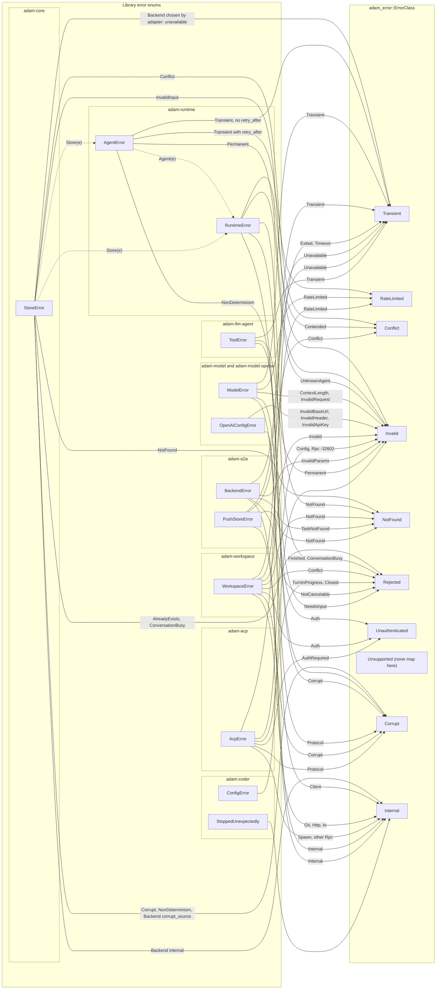
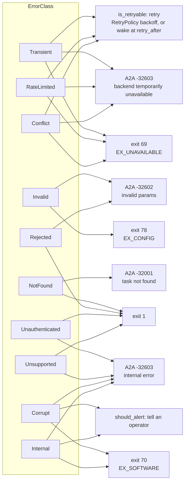

# Errors

Each library defines its own error enum with `thiserror`. A variant says **what happened**; its
`ErrorClass` (from [`adam-error`](../../crates/adam-error/README.md)) says **what to do**. Retry loops,
the A2A error a client sees and the process exit code decide from the class, never from a variant.
Every enum implements `Classify` and its test matches every variant exhaustively, so a new variant
forces a class decision.

## Classes

| Class | Meaning | Retry | Alert | A2A error (`adam-a2a`) | Exit code |
|---|---|---|---|---|---|
| `Transient` | may succeed later: network, 5xx, timeout, pool, crashed child | yes, with backoff | no | `-32603` "backend temporarily unavailable" | 69 |
| `RateLimited` | slow down; honour `retry_after()` | yes, after `max(backoff, retry_after)` | no | `-32603` "backend temporarily unavailable" | 69 |
| `Conflict` | lost an optimistic-concurrency race | yes, at once (bounded) | no | `-32603` "backend temporarily unavailable" | 69 |
| `Invalid` | the input is wrong; it never succeeds | no | no | `-32602` invalid params | 78 |
| `NotFound` | absent, or invisible to this caller | no | no | `-32001` task not found | 1 |
| `Rejected` | valid, but the target's state forbids it (finished, busy, exists) | no | no | `-32602` invalid params (`-32002` for a cancel) | 1 |
| `Unauthenticated` | credentials missing or refused | no | no | `-32603` "internal error" | 1 |
| `Unsupported` | the peer does not offer this (no enum maps here today) | no | no | `-32603` "internal error" | 1 |
| `Corrupt` | stored or received data breaks an invariant | no | **yes** | `-32603` "internal error" | 70 |
| `Internal` | a bug, or unclassified | no | **yes** | `-32603` "internal error" | 70 |

The A2A server answers every JSON-RPC error with HTTP 200 and an error object. A body that is not JSON
gets `-32700`, JSON that is not a request `-32600`, both with a null id.

## Which variant maps to which class

A dotted arrow means the enum wraps another and takes its class.

## What each class decides

Where each decision is made:

* **Retry** is in `adam-runtime` (`worker.rs`). The model, workspace and ACP
  errors reach it through the agent: a retryable one becomes
  `AgentError::Transient` (directly in `LlmAgent` for a model error, or through
  `ToolError::Transient` for a tool), carrying its `retry_after`. Anything else
  fails the call. In the coder, a permanent tool failure is an error result
  the model sees, and the run goes on.
* **Conflict** retries at once and is bounded: the runtime's commit, deliver,
  cancel and start loops try up to 16 times (`MAX_COMMIT_RETRIES`). Then
  `deliver`, `cancel` and `start` report `Contended`, and a worker drops its
  result with a warning.
* **The A2A code** is chosen at the trust boundary in two steps. First
  `adam-a2a-runtime` maps a `RuntimeError` **by class** to a `BackendError`
  (`map_err` in `crates/adam-a2a-runtime/src/backend.rs`): `NotFound` to
  `TaskNotFound`, `Invalid` and `Rejected` to `InvalidParams`, the three
  retryable classes to `Unavailable`, the rest to `Internal`. Then `adam-a2a`
  maps each `BackendError` to a code (`crates/adam-a2a/src/backend.rs`). The
  client gets a fixed sentence. The cause chain goes to the log, never to the
  client. A `PushStoreError` (the push-notification configs) takes the same road in
  `crates/adam-a2a/src/handler.rs` (`push_error`): `NotFound` is `TaskNotFound`, the rest a `BackendError`
  `Unavailable` or `Internal`; the deliverer decides from the class and never tells a client.
  `-32002` (task cannot be canceled) comes from
  `BackendError::NotCancelable`, which the backend raises when `CancelTask`
  targets a task that is finished and not already canceled.
* **The exit code** is chosen by `adam_coder::exit_code`
  (`bin/adam-coder/src/exit.rs`), which is `adam_service::exit_code_with`
  (`crates/adam-service/src/exit.rs`) plus the coder's own errors (a workspace, the agent
  files). It walks the `anyhow` chain from the
  outside in and takes the first match. A `ConfigError` is 78. A typed error
  (`StoreError`, `OpenAiConfigError`, `WorkspaceError`, `RuntimeError`,
  `StoppedUnexpectedly`) is decided by its class, as in the diagram. A panicked
  task is 70. A plain `std::io::Error` (a port that cannot bind, a directory
  that cannot be created) is 71. Anything else is 1. The process logs one
  structured line, `adam-coder failed`, with the whole cause chain and none of
  the process's secrets. The values are BSD `sysexits.h` numbers (*unverified*,
  see [Verified and unverified](../architecture.md#verified-and-unverified)).

## Retry

The runtime retries a step that fails with a `Transient` or `RateLimited` `AgentError` with exponential
backoff (`RetryPolicy`), waiting at least the error's `retry_after()` (a provider's `Retry-After`, capped
at 24 hours). Any other class fails the run. A store error while stepping is decided by class: `Corrupt` and
`Invalid` fail the run; everything else leaves the run to its lease and is logged with its class.

## Exit codes

Values are BSD `sysexits.h` numbers (*unverified*: from memory). The code is found by walking the
`anyhow` chain from the outside in (`adam_service::exit_code_with`, `crates/adam-service/src/exit.rs`, plus
the coder's own errors in `bin/adam-coder/src/exit.rs`):

| Code | Meaning |
|---|---|
| 0 | clean shutdown after SIGTERM |
| 78 | configuration (`ConfigError`, an invalid `OpenAiConfigError`, `ServeError::Push`: push notifications are on and cannot be set up, any other `Invalid` error). A bad `A2A_PUSH_*` or `A2A_CARD_SIGNING_*` value is a `ConfigError` |
| 69 | a dependency unreachable at boot (Postgres) |
| 71 | an OS error (a port that cannot bind, a directory that cannot be created) |
| 70 | a half of the process stopped, a panic or an internal error |
| 1 | anything else |

The failure is one structured JSON log line (`adam-coder failed`, `adam-agent failed`) with the whole
cause chain and none of the process's secrets.

## Rules for an error enum

`thiserror` in libraries and `anyhow` only in binaries; `#[non_exhaustive]`; an `impl Classify` with an
exhaustive `match` in its test; a `#[source]` for every wrapped error (`BoxError` for a driver or SDK type,
so none appears in a trait signature); a message that describes its own layer only. Nothing interpolates
its source: `adam_error::report(&e)` prints the chain (`a: b: c`) once, only where an error is flattened:
the journal, a response to a client, a log line. Details: the
[`adam-error` README](../../crates/adam-error/README.md).
