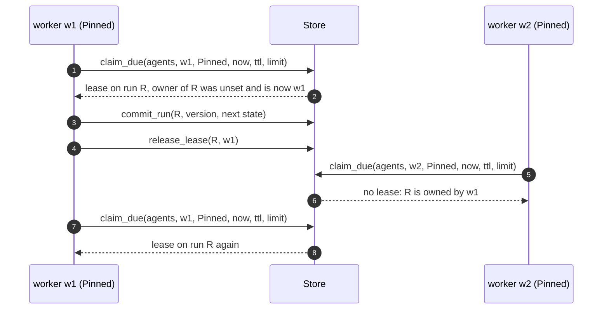
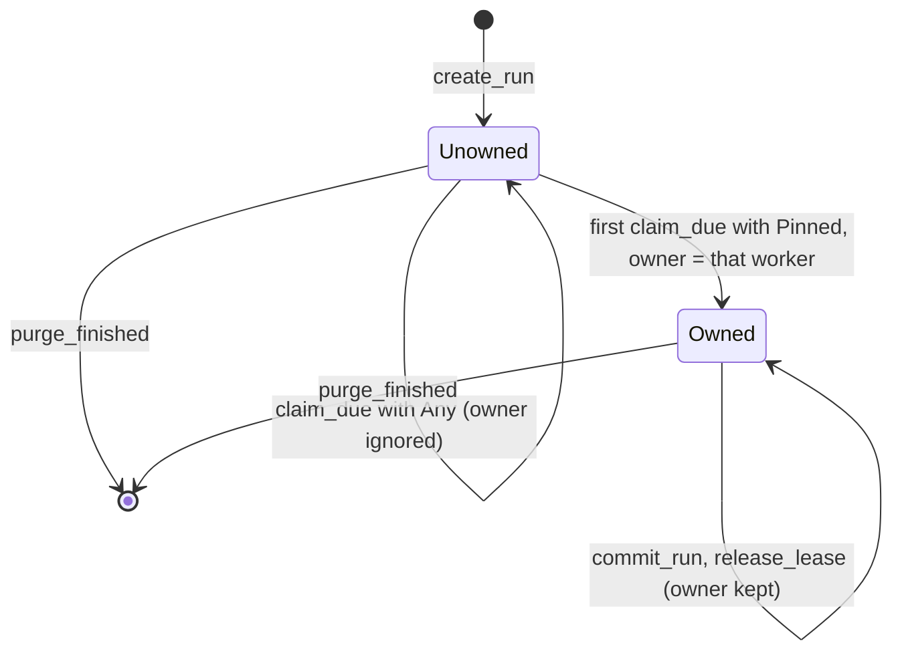
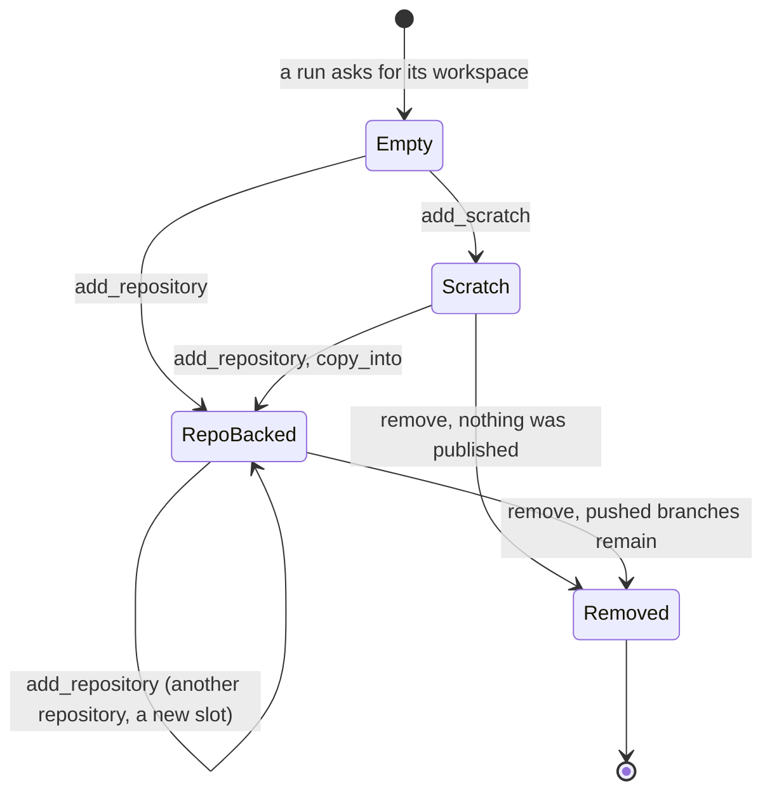
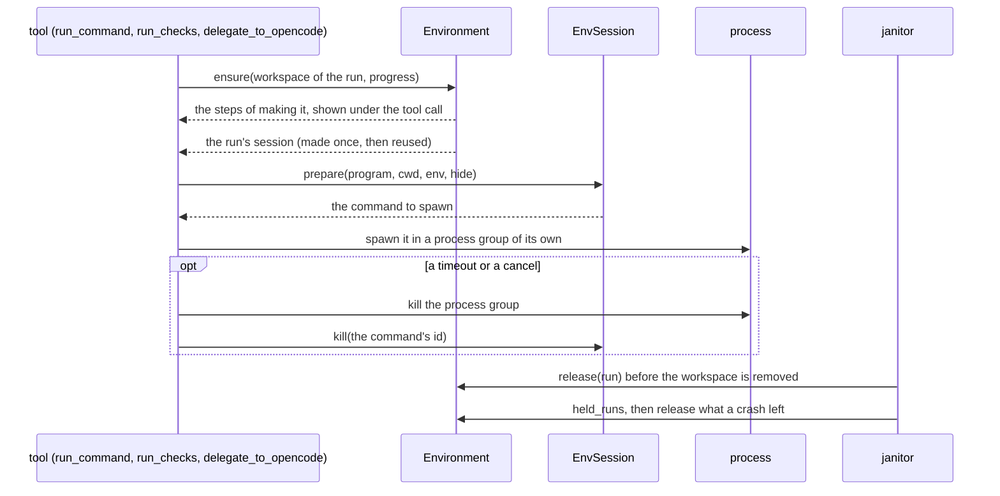
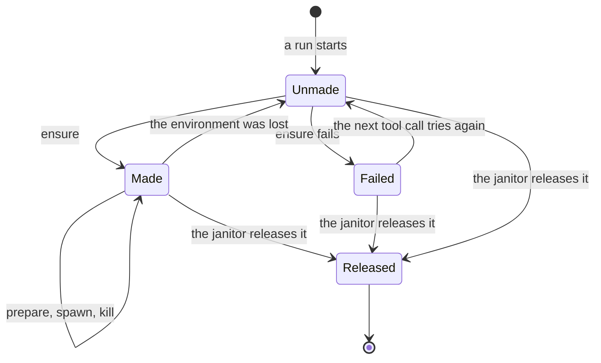
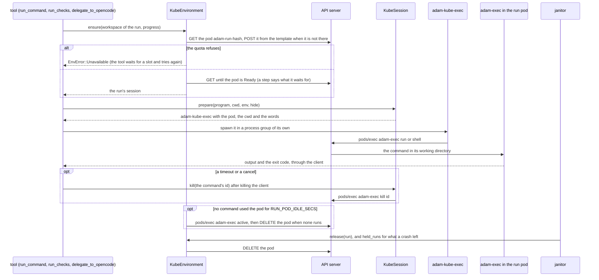
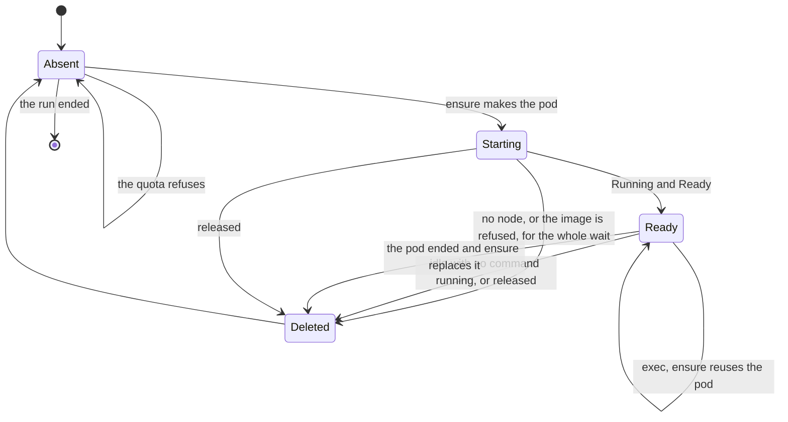

# Workspace, placement and environments

Where a run's files live and where its processes run. This is the coder's side of the platform; the
overview is in [Architecture](../architecture.md#where-a-runs-files-and-processes-live). Code:
`crates/adam-workspace` (workspaces, `Environment`, credentials), `crates/adam-devcontainer`,
`crates/adam-env-kubernetes`, `crates/adam-host` (`Placement`), `bin/adam-coder`.

## Placement: which worker holds a run's files

A run moves between workers at every step: a `Continue` is committed, the lease is released, and the next
claim may go to any worker. The coder keeps a workspace per run under a local root, so with two workers on
two disks a run can land on a worker that has no workspace for it. Nothing fails: `prepare_workspace`
clones again, a longer branch name is taken, the run notes are gone, and a **second pull request** is
opened. The deployer therefore chooses a placement ([ADR 0002](../decisions/0002-workspace-placement.md)),
the closed enum `adam_host::Placement`, read from `WORKSPACE_PLACEMENT`:

| `WORKSPACE_PLACEMENT` | Worker root | Claims | Needs `WORKER_ID` |
|---|---|---|---|
| `shared` (default) | `WORKSPACE_ROOT`, one volume for all workers | `ClaimScope::Any` | no |
| `affinity` | `WORKSPACE_ROOT/<WORKER_ID>` | `ClaimScope::Pinned` | yes |
| `isolated` | `WORKSPACE_ROOT`, a volume of this worker only | `ClaimScope::Pinned` | yes |
| `a2a-only` | none | `Any` | refused by `adam-coder` (its tools need a workspace) |

`serve` maps `Placement::pins_runs()` to `RuntimeOptions::claim_scope`. The store keeps the **owner** of a
run beside its lease (`runs.owner`), set by the first pinned claim and never cleared by a release or a commit.

* **A pinned run whose owner is gone is stranded.** A claim cannot tell "busy" from "gone", so nothing
  adopts the run and nothing reports it. Keep worker ids stable and do not scale pinned workers in.
* **`shared` needs the mirror lock.** Several worker processes on one volume would otherwise fail in git
  with "could not lock". `adam-workspace` holds an exclusive `flock` on `<mirror>.lock`
  (`crates/adam-workspace/src/workspace.rs`, `lock_mirror`). *Unverified:* `flock` on NFS and Longhorn RWX.
* **`a2a-only`** is for hosts whose agents only call remote agents, such as the orchestrator.

## A run's workspace

A run's files are `<root>/workspaces/<run>/`, a directory of **slots**
([ADR 0008](../decisions/0008-a-workspace-holds-several-repositories.md)). A slot is a worktree of one
repository on the run's branch `agent/<run-short-id>`, or a **scratch project**: a local git repository
with an empty root commit, where work can start before anyone names a repository. A run has at most one
slot per repository; slots keep the order they joined.

* The workspace lives as long as the run and is deleted when it ends (the janitor). The run's notes and the
  `agent/*` branches in the mirrors stay: they are the only copy of an unpushed commit.
* `copy_into` is the only way a scratch project's files reach a repository, all or nothing.
  `initialize_empty` gives an empty repository its first commit, the only push outside `agent/*`.
* A workspace made before slots existed (`<root>/worktrees/<run>`) is read as a slot and removed with the rest.
* API, layout and locks: the
  [`adam-workspace` README](../../crates/adam-workspace/README.md#a-runs-workspace-slots-scratch-projects-and-the-copy-between-them).

The janitor (`bin/adam-coder/src/janitor.rs`, a worker component) sweeps at startup and every
`WORKSPACE_SWEEP_SECS` (default 300; `0` is off): it removes the workspace of a run that is `done`,
`failed` (a cancel included) or unknown to the store, after releasing what the run's environment holds. A
run that is `runnable` or `parked` keeps its workspace however long the person takes to answer. A store
that does not answer leaves it alone.

## Environments: where a run's processes run

The project's checks, a command to look around and OpenCode are started through the `Environment` port.
A tool asks the run's session to **prepare** a command from a description (program or shell line, working
directory, variables, the names of this process's secrets to hide) and spawns what comes back. Files and
paths are the same in every environment, so the file tools and all git work stay in the coder.

| Environment | Where | Chosen by |
|---|---|---|
| `Local` | the coder's own container | the default |
| `DevContainer` | the first slot's `devcontainer.json` (a default image when it has none), on a rootless Podman service, never the host's Docker socket | `DEVCONTAINER_RUNTIME=podman` (off by default; off on Kubernetes) |
| `KubeEnvironment` | a Kubernetes pod of the run's own, made from a template the deployment mounts | `RUN_ENVIRONMENT=kubernetes` (refused with `podman`) |

It is chosen when the binary is composed, not by a plugin. A failure to make the environment is a result
for the model (no check cycle is used); a secret is never in a description, only the names to hide.

### The repository's devcontainer

The file is untrusted and checked three times; nothing of the coder's environment enters the container;
every step of making it is shown ([ADR 0010](../decisions/0010-a-run-works-in-its-repositorys-devcontainer.md)
has the sequence and the lifecycle). The coder also starts OpenCode inside it (its own binary mounted
read-only, the model key as a file), has a `rebuild_environment` tool for the way out of a file that cannot be
used, and has its janitor release a run's environment before it removes the workspace. Why the chart does
not turn it on: [the chart README](../../deploy/coder/README.md#devcontainers-are-off-here).

### A pod for each run

A build is bounded by the pod's memory (2Gi in the chart), and the coder shrinks to about 1Gi
([ADR 0019](../decisions/0019-a-runs-processes-in-a-pod-of-their-own.md)). The pod is made from a template
that holds the image, resources, priority class, security context and volumes; the code adds a name, labels and
annotations, and the pod mounts the coder's workspace volume at the same path. A command is
`adam-kube-exec`, which runs `adam-exec` in the pod over `pods/exec`. No GitHub credential ever enters a
pod. The chart's `runPods` block renders what surrounds it
([deploy guide](../guides/deploy-the-coder.md#run-pods)).

See also the [`adam-workspace` README](../../crates/adam-workspace/README.md#where-a-runs-processes-run-the-environment-port)
and [the coder README](../../bin/adam-coder/README.md#where-the-processes-of-a-run-run).
